# Docker容器化部署

<cite>
**本文引用的文件**   
- [Dockerfile](file://Dockerfile)
- [Makefile](file://Makefile)
- [go.mod](file://go.mod)
- [configs/config.yaml](file://configs/config.yaml)
- [configs/config.yaml.example](file://configs/config.yaml.example)
- [internal/api/server.go](file://internal/api/server.go)
- [internal/config/config.go](file://internal/config/config.go)
- [deployment/README.md](file://deployment/README.md)
- [deployment/kind/cluster-config.yaml](file://deployment/kind/cluster-config.yaml)
- [deployment/kind/manage.sh](file://deployment/kind/manage.sh)
- [cmd/klaw/main.go](file://cmd/klaw/main.go)
</cite>

## 目录
1. [简介](#简介)
2. [项目结构](#项目结构)
3. [核心组件](#核心组件)
4. [架构总览](#架构总览)
5. [详细组件分析](#详细组件分析)
6. [依赖关系分析](#依赖关系分析)
7. [性能考量](#性能考量)
8. [故障排查指南](#故障排查指南)
9. [结论](#结论)
10. [附录](#附录)

## 简介
本指南面向希望在本地或生产环境中使用 Docker 与 Docker Compose 部署 Klaw 平台的运维与开发人员。内容涵盖：
- Docker 镜像构建流程与优化建议
- 容器运行参数、环境变量与配置文件挂载
- 数据卷持久化策略
- 网络配置与端口暴露
- 单机 Docker 部署与多容器编排示例（含 Docker Compose）
- 健康检查、日志收集与监控集成
- 在 Kind 等轻量 Kubernetes 环境中的快速验证

## 项目结构
Klaw 平台采用 Go 后端与 Web 前端分离的架构，根目录包含 Dockerfile、Makefile、Go 模块定义以及应用配置样例。部署相关脚本位于 deployment 目录，API 服务入口位于 internal/api，配置加载逻辑位于 internal/config。

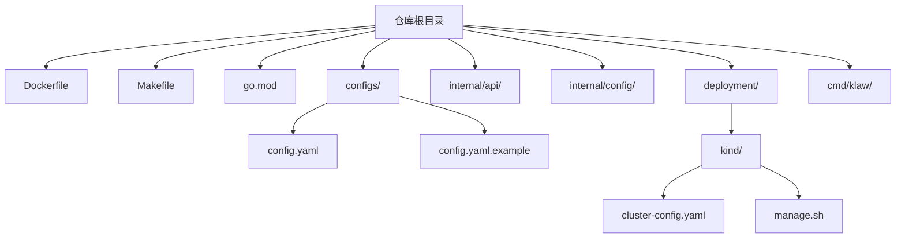

图表来源
- [Dockerfile](file://Dockerfile)
- [Makefile](file://Makefile)
- [go.mod](file://go.mod)
- [configs/config.yaml](file://configs/config.yaml)
- [configs/config.yaml.example](file://configs/config.yaml.example)
- [internal/api/server.go](file://internal/api/server.go)
- [internal/config/config.go](file://internal/config/config.go)
- [deployment/kind/cluster-config.yaml](file://deployment/kind/cluster-config.yaml)
- [deployment/kind/manage.sh](file://deployment/kind/manage.sh)
- [cmd/klaw/main.go](file://cmd/klaw/main.go)

章节来源
- [Dockerfile](file://Dockerfile)
- [Makefile](file://Makefile)
- [go.mod](file://go.mod)
- [configs/config.yaml](file://configs/config.yaml)
- [configs/config.yaml.example](file://configs/config.yaml.example)
- [internal/api/server.go](file://internal/api/server.go)
- [internal/config/config.go](file://internal/config/config.go)
- [deployment/README.md](file://deployment/README.md)
- [deployment/kind/cluster-config.yaml](file://deployment/kind/cluster-config.yaml)
- [deployment/kind/manage.sh](file://deployment/kind/manage.sh)
- [cmd/klaw/main.go](file://cmd/klaw/main.go)

## 核心组件
- 镜像构建与打包
  - Dockerfile：定义多阶段构建、依赖安装、二进制编译与运行时最小镜像。
  - Makefile：封装常用构建、测试、打包命令，便于 CI/CD 集成。
- 应用配置与启动
  - configs/config.yaml 与 configs/config.yaml.example：提供默认与示例配置项。
  - internal/config/config.go：负责读取并解析配置，支持从文件或环境变量注入。
  - cmd/klaw/main.go：程序入口，初始化配置、注册路由、启动 HTTP 服务。
- API 服务
  - internal/api/server.go：HTTP 服务器初始化、路由注册、中间件与监听端口。

章节来源
- [Dockerfile](file://Dockerfile)
- [Makefile](file://Makefile)
- [configs/config.yaml](file://configs/config.yaml)
- [configs/config.yaml.example](file://configs/config.yaml.example)
- [internal/config/config.go](file://internal/config/config.go)
- [cmd/klaw/main.go](file://cmd/klaw/main.go)
- [internal/api/server.go](file://internal/api/server.go)

## 架构总览
下图展示了 Klaw 在容器化环境中的典型部署形态：单一应用容器通过数据卷持久化配置与状态，外部依赖（如数据库、消息队列、对象存储）以独立容器或服务形式接入。

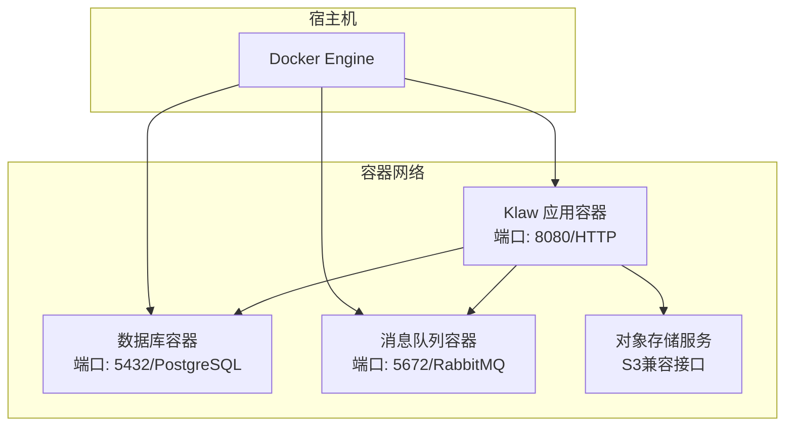

图表来源
- [internal/api/server.go](file://internal/api/server.go)
- [configs/config.yaml](file://configs/config.yaml)

章节来源
- [internal/api/server.go](file://internal/api/server.go)
- [configs/config.yaml](file://configs/config.yaml)

## 详细组件分析

### Docker 镜像构建流程
- 多阶段构建
  - 构建阶段：安装 Go 依赖、编译二进制、生成静态资源。
  - 运行阶段：基于精简基础镜像，仅拷贝必要文件与二进制。
- 缓存优化
  - 分层依赖安装与代码变更隔离，提升构建速度。
- 安全加固
  - 非 root 用户运行、最小权限原则、移除不必要工具。

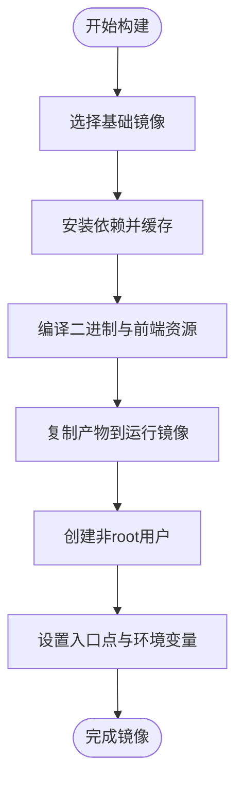

图表来源
- [Dockerfile](file://Dockerfile)

章节来源
- [Dockerfile](file://Dockerfile)
- [Makefile](file://Makefile)

### 容器运行参数与环境变量
- 端口映射
  - 将容器内 HTTP 端口映射至宿主机，便于访问控制台与 API。
- 环境变量
  - 数据库连接串、认证密钥、日志级别、功能开关等。
- 配置文件挂载
  - 将 configs/config.yaml 挂载为只读卷，避免容器内修改。
- 数据卷
  - 持久化应用状态、审计日志、备份文件等。

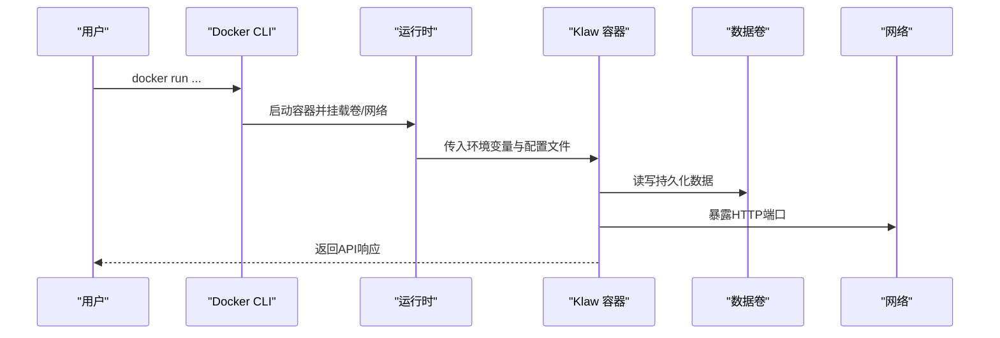

图表来源
- [internal/api/server.go](file://internal/api/server.go)
- [configs/config.yaml](file://configs/config.yaml)

章节来源
- [internal/api/server.go](file://internal/api/server.go)
- [configs/config.yaml](file://configs/config.yaml)
- [configs/config.yaml.example](file://configs/config.yaml.example)

### 数据卷挂载策略
- 配置卷
  - 挂载 config.yaml，确保配置集中管理与版本控制。
- 数据卷
  - 数据库文件、审计日志、诊断报告、备份归档等。
- 临时卷
  - 用于构建缓存或中间结果，不跨容器共享。

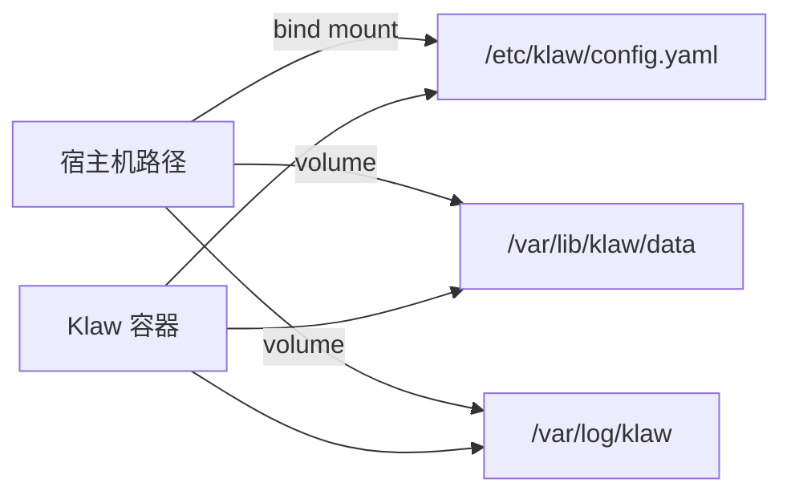

图表来源
- [configs/config.yaml](file://configs/config.yaml)

章节来源
- [configs/config.yaml](file://configs/config.yaml)

### 网络配置
- 单机模式
  - 使用 bridge 网络，端口映射到宿主机。
- 多容器编排
  - 使用自定义网络，服务间通过容器名通信。
- 反向代理
  - 可选 Nginx/Traefik 统一入口、TLS 终止与路径路由。

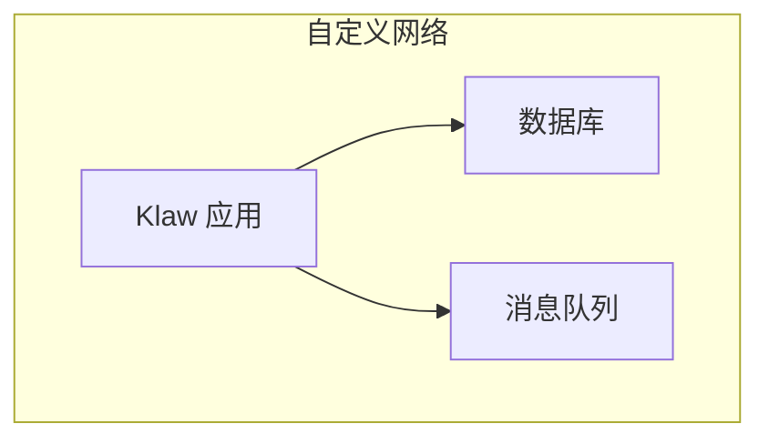

图表来源
- [internal/api/server.go](file://internal/api/server.go)

章节来源
- [internal/api/server.go](file://internal/api/server.go)

### 健康检查与就绪探针
- 健康端点
  - 提供 /healthz 或 /readyz 端点，返回服务状态。
- Docker 健康检查
  - 使用 curl 或内置探测命令定期检查。
- Kubernetes 探针（可选）
  - 在编排平台中配置 liveness/readiness 探针。

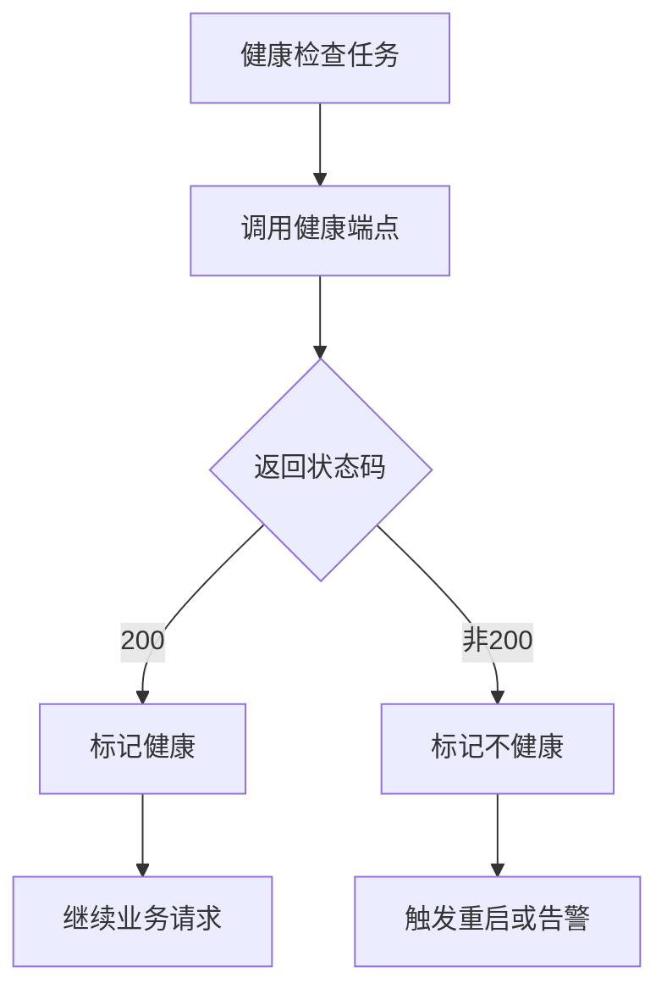

图表来源
- [internal/api/server.go](file://internal/api/server.go)

章节来源
- [internal/api/server.go](file://internal/api/server.go)

### 日志收集与监控
- 标准输出
  - 将日志输出到 stdout/stderr，便于容器日志采集。
- 结构化日志
  - JSON 格式便于 ELK/Loki 解析。
- 指标暴露
  - 暴露 /metrics 端点供 Prometheus 抓取。
- 外部系统
  - 对接告警通知（钉钉、飞书等）。

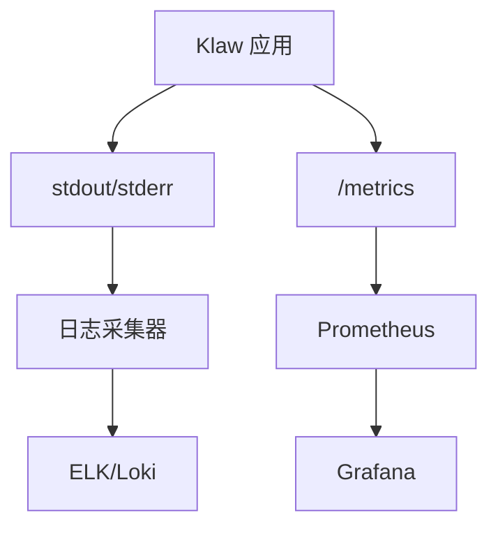

图表来源
- [internal/api/server.go](file://internal/api/server.go)

章节来源
- [internal/api/server.go](file://internal/api/server.go)

### 单机 Docker 部署步骤
- 准备配置
  - 复制示例配置并填写数据库、认证、日志等参数。
- 构建镜像
  - 使用 Dockerfile 或 Makefile 进行构建。
- 启动容器
  - 映射端口、挂载配置与数据卷、设置环境变量。
- 验证服务
  - 访问健康端点与主界面。

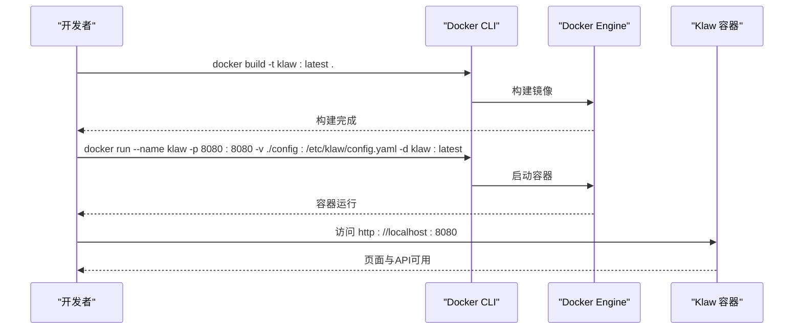

图表来源
- [Dockerfile](file://Dockerfile)
- [configs/config.yaml](file://configs/config.yaml)

章节来源
- [Dockerfile](file://Dockerfile)
- [configs/config.yaml](file://configs/config.yaml)

### 多容器编排（Docker Compose）
- 服务定义
  - 应用服务、数据库、消息队列、对象存储等。
- 网络与卷
  - 自定义网络与命名卷，保证服务间通信与数据持久化。
- 环境变量与配置
  - 通过 env_file 或 inline 方式注入。
- 健康检查与依赖
  - 使用 depends_on 与健康检查确保启动顺序。

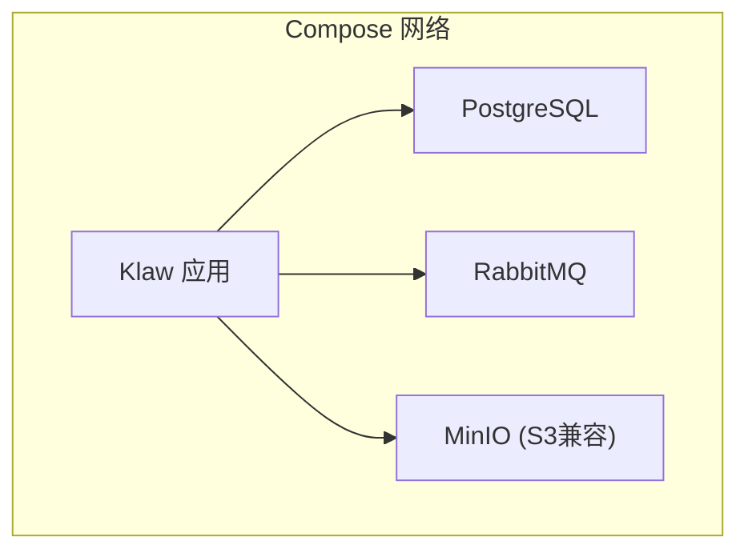

图表来源
- [configs/config.yaml](file://configs/config.yaml)

章节来源
- [configs/config.yaml](file://configs/config.yaml)

### 在 Kind 中快速验证
- 集群准备
  - 使用 kind 创建本地 Kubernetes 集群。
- 部署清单
  - 参考 deployment/kind 下的配置与脚本。
- 访问服务
  - 通过 NodePort 或 Ingress 暴露服务。

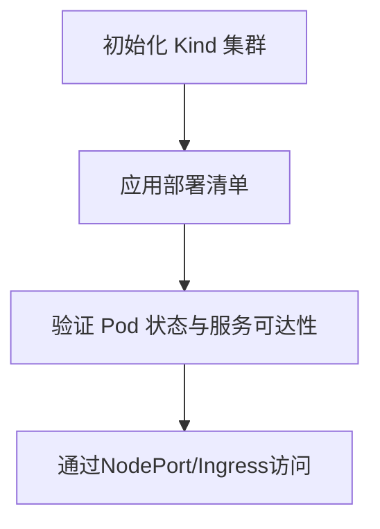

图表来源
- [deployment/kind/cluster-config.yaml](file://deployment/kind/cluster-config.yaml)
- [deployment/kind/manage.sh](file://deployment/kind/manage.sh)

章节来源
- [deployment/README.md](file://deployment/README.md)
- [deployment/kind/cluster-config.yaml](file://deployment/kind/cluster-config.yaml)
- [deployment/kind/manage.sh](file://deployment/kind/manage.sh)

## 依赖关系分析
- 内部依赖
  - 配置模块负责加载与校验配置，API 模块依赖配置进行服务初始化。
- 外部依赖
  - 数据库、消息队列、对象存储等通过环境变量与配置文件注入。
- 构建依赖
  - Go 模块管理依赖版本，确保可重复构建。

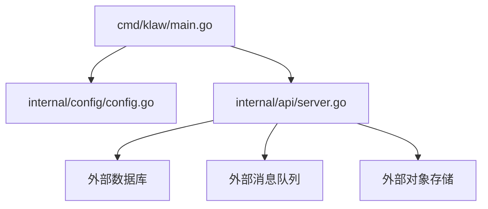

图表来源
- [cmd/klaw/main.go](file://cmd/klaw/main.go)
- [internal/config/config.go](file://internal/config/config.go)
- [internal/api/server.go](file://internal/api/server.go)

章节来源
- [cmd/klaw/main.go](file://cmd/klaw/main.go)
- [internal/config/config.go](file://internal/config/config.go)
- [internal/api/server.go](file://internal/api/server.go)
- [go.mod](file://go.mod)

## 性能考量
- 镜像体积
  - 使用多阶段构建与精简基础镜像，减少攻击面与传输开销。
- 资源限制
  - 为容器设置 CPU 与内存限制，避免资源争用。
- 并发与连接池
  - 合理配置数据库与消息队列的连接池大小。
- 缓存策略
  - 启用应用级缓存与 CDN，降低后端压力。
- 日志轮转
  - 配置日志大小与保留策略，避免磁盘占满。

[本节为通用指导，无需特定文件引用]

## 故障排查指南
- 启动失败
  - 检查环境变量与配置文件是否正确挂载。
  - 查看容器日志定位错误原因。
- 无法访问服务
  - 确认端口映射与防火墙规则。
  - 检查健康端点返回状态。
- 数据丢失
  - 确认数据卷挂载路径与权限。
  - 定期备份关键数据。
- 性能问题
  - 监控指标与慢查询日志。
  - 调整资源限制与连接池参数。

章节来源
- [internal/api/server.go](file://internal/api/server.go)
- [configs/config.yaml](file://configs/config.yaml)

## 结论
通过本指南，您可以在单机与多容器环境中快速、可靠地部署 Klaw 平台。遵循最佳实践进行镜像构建、配置管理、数据持久化、网络与安全设置，并结合健康检查、日志与监控实现稳定运维。

[本节为总结性内容，无需特定文件引用]

## 附录
- 常用命令
  - 构建镜像、启动容器、查看日志、进入容器等。
- 配置项说明
  - 数据库、认证、日志、功能开关等关键配置。
- 扩展阅读
  - Helm Chart、Operator、CI/CD 流水线等高级主题。

[本节为补充信息，无需特定文件引用]