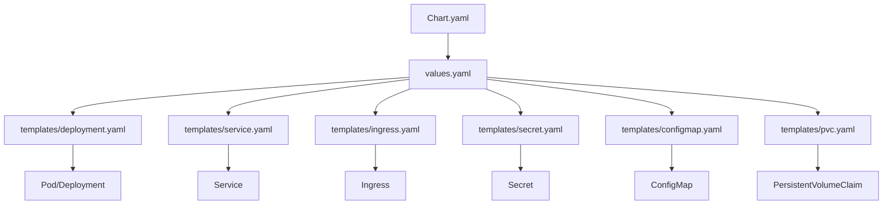
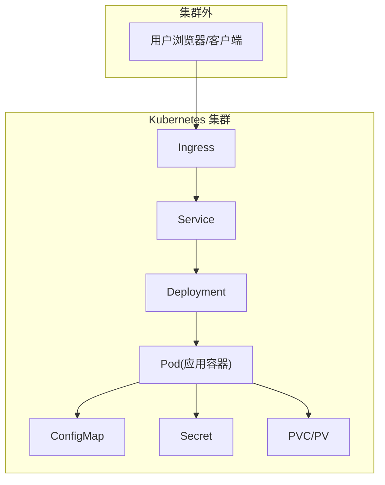
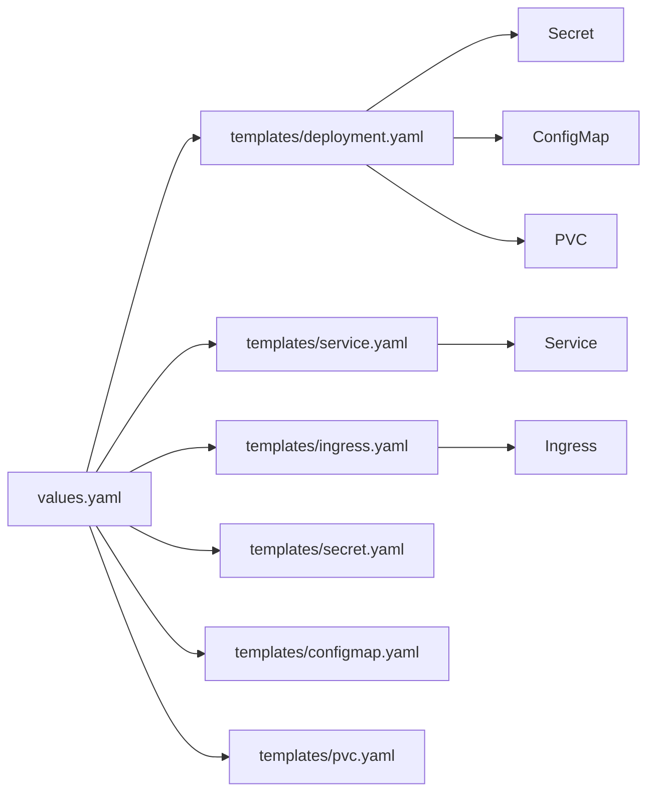

# Helm Chart 部署

<cite>
**本文引用的文件**   
- [Chart.yaml](file://helm/klaw/Chart.yaml)
- [values.yaml](file://helm/klaw/values.yaml)
- [deployment.yaml](file://helm/klaw/templates/deployment.yaml)
- [service.yaml](file://helm/klaw/templates/service.yaml)
- [ingress.yaml](file://helm/klaw/templates/ingress.yaml)
- [secret.yaml](file://helm/klaw/templates/secret.yaml)
- [configmap.yaml](file://helm/klaw/templates/configmap.yaml)
- [pvc.yaml](file://helm/klaw/templates/pvc.yaml)
- [NOTES.txt](file://helm/klaw/NOTES.txt)
- [README.md](file://deployment/README.md)
</cite>

## 目录
1. [简介](#简介)
2. [项目结构](#项目结构)
3. [核心组件](#核心组件)
4. [架构总览](#架构总览)
5. [详细组件分析](#详细组件分析)
6. [依赖关系分析](#依赖关系分析)
7. [性能与容量规划](#性能与容量规划)
8. [故障排查指南](#故障排查指南)
9. [结论](#结论)
10. [附录：生产环境 values 示例与最佳实践](#附录生产环境-values-示例与最佳实践)

## 简介
本指南面向使用 Helm 部署 Klaw 的用户，提供从 Chart 结构、values 配置到模板自定义的完整说明。内容涵盖基础安装、命名空间隔离、资源限制、Ingress 暴露、Secret 管理，以及生产环境的高可用、监控集成与备份策略等高级选项。读者可据此快速完成本地试用与生产上线。

## 项目结构
Klaw 的 Helm Chart 位于 helm/klaw 目录，遵循标准 Helm Chart 组织方式：
- Chart.yaml：Chart 元数据（名称、版本、应用版本、依赖等）
- values.yaml：默认值与用户覆盖项
- templates/：Helm 模板，渲染为 Kubernetes 资源清单
- NOTES.txt：安装后的提示信息

图表来源
- [Chart.yaml](file://helm/klaw/Chart.yaml)
- [values.yaml](file://helm/klaw/values.yaml)
- [deployment.yaml](file://helm/klaw/templates/deployment.yaml)
- [service.yaml](file://helm/klaw/templates/service.yaml)
- [ingress.yaml](file://helm/klaw/templates/ingress.yaml)
- [secret.yaml](file://helm/klaw/templates/secret.yaml)
- [configmap.yaml](file://helm/klaw/templates/configmap.yaml)
- [pvc.yaml](file://helm/klaw/templates/pvc.yaml)

章节来源
- [README.md](file://deployment/README.md)

## 核心组件
- Chart 元数据与版本管理：通过 Chart.yaml 声明应用名、版本与应用版本，便于升级与回滚。
- 默认配置中心：values.yaml 集中定义镜像、副本数、资源限制、存储、网络、Ingress、Secret 等所有可配置项。
- 工作负载模板：deployment.yaml 渲染 Deployment/StatefulSet，定义容器镜像、环境变量、卷挂载、探针、亲和性等。
- 服务暴露：service.yaml 定义 ClusterIP/NodePort/LoadBalancer；ingress.yaml 定义域名、TLS、路径转发规则。
- 敏感信息：secret.yaml 将密钥以 Secret 形式注入，避免硬编码。
- 非敏感配置：configmap.yaml 用于挂载配置文件或环境变量。
- 持久化：pvc.yaml 为有状态组件提供持久卷声明。

章节来源
- [Chart.yaml](file://helm/klaw/Chart.yaml)
- [values.yaml](file://helm/klaw/values.yaml)
- [deployment.yaml](file://helm/klaw/templates/deployment.yaml)
- [service.yaml](file://helm/klaw/templates/service.yaml)
- [ingress.yaml](file://helm/klaw/templates/ingress.yaml)
- [secret.yaml](file://helm/klaw/templates/secret.yaml)
- [configmap.yaml](file://helm/klaw/templates/configmap.yaml)
- [pvc.yaml](file://helm/klaw/templates/pvc.yaml)

## 架构总览
下图展示了 Helm 渲染后 Klaw 在 Kubernetes 中的典型运行架构：Ingress 将外部流量路由至 Service，Service 转发到 Deployment 管理的 Pod；Pod 内应用读取 ConfigMap 与 Secret，并通过 PVC 持久化数据。

图表来源
- [ingress.yaml](file://helm/klaw/templates/ingress.yaml)
- [service.yaml](file://helm/klaw/templates/service.yaml)
- [deployment.yaml](file://helm/klaw/templates/deployment.yaml)
- [configmap.yaml](file://helm/klaw/templates/configmap.yaml)
- [secret.yaml](file://helm/klaw/templates/secret.yaml)
- [pvc.yaml](file://helm/klaw/templates/pvc.yaml)

## 详细组件分析

### Chart 元数据与版本
- Chart.yaml 定义了 Chart 的名称、版本、应用版本、描述与依赖。升级时建议遵循语义化版本控制，确保平滑滚动更新与回滚。

章节来源
- [Chart.yaml](file://helm/klaw/Chart.yaml)

### values.yaml 配置项
- 镜像与副本：image.repository、image.tag、replicaCount
- 资源限制：resources.requests、resources.limits
- 存储：storage.enabled、storage.size、storage.storageClass
- 网络：service.type、service.port、ingress.enabled、ingress.hosts、ingress.tls
- 安全：secrets.*（如数据库连接串、API Key）
- 其他：env、nodeSelector、tolerations、affinity、podSecurityContext、containerSecurityContext

章节来源
- [values.yaml](file://helm/klaw/values.yaml)

### 工作负载模板（Deployment/StatefulSet）
- deployment.yaml 根据 values 渲染工作负载，包含：
  - 容器镜像与环境变量
  - 健康检查探针（liveness/readiness）
  - 卷挂载（ConfigMap、Secret、PVC）
  - 资源请求与限制
  - 调度策略（节点选择、容忍度、亲和性）

章节来源
- [deployment.yaml](file://helm/klaw/templates/deployment.yaml)

### 服务暴露（Service/Ingress）
- service.yaml 定义内部访问端口与类型（ClusterIP/NodePort/LoadBalancer）。
- ingress.yaml 定义域名、路径、TLS 证书与后端服务映射。

章节来源
- [service.yaml](file://helm/klaw/templates/service.yaml)
- [ingress.yaml](file://helm/klaw/templates/ingress.yaml)

### 敏感信息与配置（Secret/ConfigMap）
- secret.yaml 将敏感数据以 Secret 形式注入，避免明文。
- configmap.yaml 用于挂载非敏感配置或环境变量。

章节来源
- [secret.yaml](file://helm/klaw/templates/secret.yaml)
- [configmap.yaml](file://helm/klaw/templates/configmap.yaml)

### 持久化（PVC）
- pvc.yaml 声明所需存储大小与 StorageClass，确保数据跨 Pod 重启保留。

章节来源
- [pvc.yaml](file://helm/klaw/templates/pvc.yaml)

### 安装提示（NOTES）
- NOTES.txt 在安装完成后输出访问地址、默认账号等信息，便于快速验证。

章节来源
- [NOTES.txt](file://helm/klaw/NOTES.txt)

## 依赖关系分析
- Chart 与 values：Chart 模板通过 values 驱动渲染，任何变更需同步更新 values 与模板。
- 模板间依赖：
  - deployment.yaml 引用 secret.yaml、configmap.yaml、pvc.yaml 的资源名（通常由 _helpers.tpl 生成）。
  - service.yaml 与 ingress.yaml 指向 deployment.yaml 暴露的端口与服务名。
- 外部依赖：
  - Ingress Controller（如 nginx/traefik）
  - 存储类（StorageClass）
  - 可选：Prometheus/Grafana（监控）、备份工具（etcd-backup 等）

图表来源
- [values.yaml](file://helm/klaw/values.yaml)
- [deployment.yaml](file://helm/klaw/templates/deployment.yaml)
- [service.yaml](file://helm/klaw/templates/service.yaml)
- [ingress.yaml](file://helm/klaw/templates/ingress.yaml)
- [secret.yaml](file://helm/klaw/templates/secret.yaml)
- [configmap.yaml](file://helm/klaw/templates/configmap.yaml)
- [pvc.yaml](file://helm/klaw/templates/pvc.yaml)

章节来源
- [values.yaml](file://helm/klaw/values.yaml)
- [deployment.yaml](file://helm/klaw/templates/deployment.yaml)
- [service.yaml](file://helm/klaw/templates/service.yaml)
- [ingress.yaml](file://helm/klaw/templates/ingress.yaml)
- [secret.yaml](file://helm/klaw/templates/secret.yaml)
- [configmap.yaml](file://helm/klaw/templates/configmap.yaml)
- [pvc.yaml](file://helm/klaw/templates/pvc.yaml)

## 性能与容量规划
- 副本数与水平扩展：根据 QPS 与延迟目标设置 replicaCount，并结合 HPA（若启用）自动扩缩容。
- 资源限制：合理设置 requests 与 limits，避免资源争用与 OOMKill。
- 存储容量：依据数据增长预估 PVC 大小与扩容策略，选择合适的 StorageClass。
- 网络吞吐：Ingress 与 Service 类型影响入口带宽，必要时使用 LoadBalancer 或专用 Ingress Controller。
- 缓存与连接池：应用层连接池参数与超时时间需与集群资源匹配。

[本节为通用指导，不直接分析具体文件]

## 故障排查指南
- 安装失败：检查 Chart 版本与集群兼容性，查看 helm install 输出与 NOTES.txt。
- 启动异常：查看 Pod 日志、事件与探针状态，确认 Secret/ConfigMap 是否就绪。
- 无法访问：校验 Ingress 规则、TLS 证书、Service 端口与后端端口一致性。
- 存储问题：确认 PVC 绑定状态、StorageClass 可用性、磁盘配额。
- 权限问题：RBAC 与 SecurityContext 是否正确，Secret 是否被正确挂载。

章节来源
- [NOTES.txt](file://helm/klaw/NOTES.txt)

## 结论
通过 Helm Chart 部署 Klaw，可实现标准化、可重复、易维护的应用交付。结合 values 集中配置、模板化资源与完善的 Ingress/Secret/PVC 支持，能够快速满足从开发测试到生产高可用的全生命周期需求。

[本节为总结性内容，不直接分析具体文件]

## 附录：生产环境 values 示例与最佳实践
以下为生产环境的推荐配置要点（请根据实际环境与业务规模调整）：
- 命名空间隔离
  - 使用独立命名空间，避免资源冲突与权限泄露。
  - 通过 --namespace 指定安装目标命名空间。
- 镜像与版本
  - 固定 image.tag 为具体版本号，禁止使用 latest。
  - 开启镜像拉取策略与私有仓库认证（如需）。
- 副本与高可用
  - 设置 replicaCount >= 2，配合反亲和性与多可用区部署。
  - 启用健康检查探针，保障自愈能力。
- 资源限制
  - 明确 requests 与 limits，预留足够 CPU/Memory 余量。
  - 针对 IO 密集型任务适当增加内存与磁盘 I/O 配额。
- 存储与备份
  - 选择高性能 StorageClass，启用快照与定期备份。
  - 对关键数据启用 PVC 快照与异地复制策略。
- 网络与 Ingress
  - 启用 TLS，配置域名与路径规则，启用 HTTP->HTTPS 重定向。
  - 配置限流、白名单与 WAF（由 Ingress Controller 提供）。
- 安全与 Secret
  - 所有敏感信息通过 Secret 注入，避免明文。
  - 最小权限原则，限制 Pod 与 ServiceAccount 权限。
- 监控与告警
  - 暴露指标端点，接入 Prometheus/Grafana。
  - 配置告警规则（CPU、内存、磁盘、错误率、延迟）。
- 升级与回滚
  - 使用 helm upgrade --atomic 进行原子升级，失败自动回滚。
  - 发布前执行 dry-run 与 diff 检查。

章节来源
- [values.yaml](file://helm/klaw/values.yaml)
- [ingress.yaml](file://helm/klaw/templates/ingress.yaml)
- [secret.yaml](file://helm/klaw/templates/secret.yaml)
- [pvc.yaml](file://helm/klaw/templates/pvc.yaml)
- [deployment.yaml](file://helm/klaw/templates/deployment.yaml)