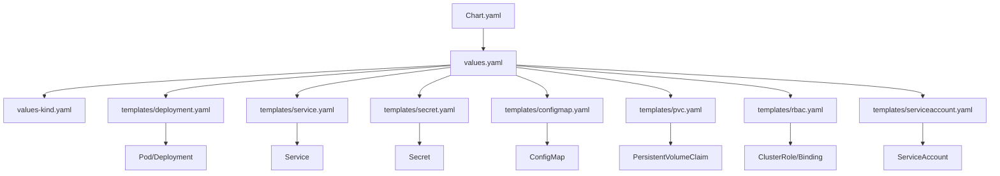
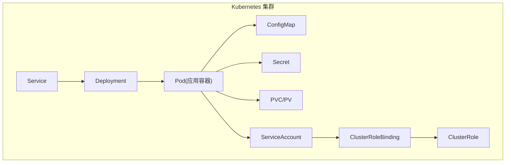
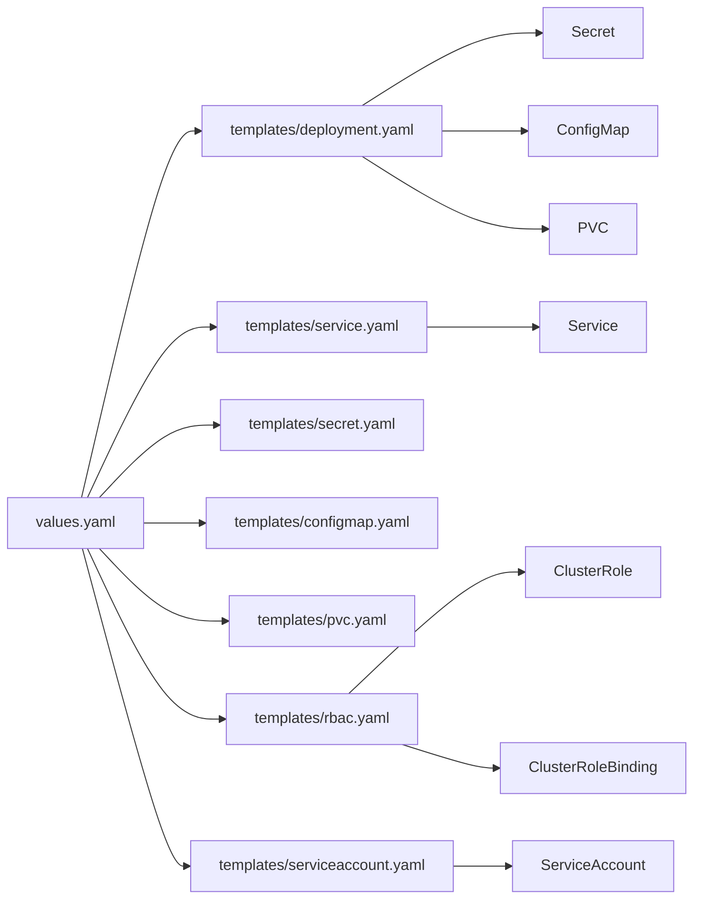

# Helm Chart 部署

<cite>
**本文引用的文件**
- [Chart.yaml](file://helm/klaw/Chart.yaml)
- [values.yaml](file://helm/klaw/values.yaml)
- [values-kind.yaml](file://helm/klaw/values-kind.yaml)
- [deployment.yaml](file://helm/klaw/templates/deployment.yaml)
- [service.yaml](file://helm/klaw/templates/service.yaml)
- [secret.yaml](file://helm/klaw/templates/secret.yaml)
- [configmap.yaml](file://helm/klaw/templates/configmap.yaml)
- [pvc.yaml](file://helm/klaw/templates/pvc.yaml)
- [rbac.yaml](file://helm/klaw/templates/rbac.yaml)
- [serviceaccount.yaml](file://helm/klaw/templates/serviceaccount.yaml)
- [_helpers.tpl](file://helm/klaw/templates/_helpers.tpl)
- [README.md](file://deployment/README.md)
</cite>

## 更新摘要
**变更内容**
- 新增完整的生产就绪型 Helm Chart 部署包，包含安全上下文、RBAC 配置和服务账户管理
- 添加环境特定的 values 配置文件（values-kind.yaml）用于本地开发环境
- 增强安全性：非 root 用户运行、只读根文件系统、权限最小化
- 完善 RBAC 权限模型：支持集群资源查看、Pod 管理、Deployment 管理等操作
- 改进 Secret 管理：支持现有 Secret 引用和动态密钥注入
- 优化存储配置：支持持久卷声明和现有 PVC 引用

## 目录
1. [简介](#简介)
2. [项目结构](#项目结构)
3. [核心组件](#核心组件)
4. [架构总览](#架构总览)
5. [详细组件分析](#详细组件分析)
6. [依赖关系分析](#依赖关系分析)
7. [性能与容量规划](#性能与容量规划)
8. [故障排查指南](#故障排查指南)
9. [结论](#结论)
10. [附录：生产环境 values 示例与最佳实践](#附录生产环境-values-示例与最佳实践)

## 简介
本指南面向使用 Helm 部署 Klaw 的用户，提供从 Chart 结构、values 配置到模板自定义的完整说明。内容涵盖基础安装、命名空间隔离、资源限制、Ingress 暴露、Secret 管理，以及生产环境的高可用、监控集成与备份策略等高级选项。Klaw 现已提供完整的生产就绪型 Kubernetes 部署能力，包括安全上下文、RBAC 配置和环境特定配置。

## 项目结构
Klaw 的 Helm Chart 位于 helm/klaw 目录，遵循标准 Helm Chart 组织方式：
- Chart.yaml：Chart 元数据（名称、版本、应用版本、依赖等）
- values.yaml：默认值与用户覆盖项
- values-kind.yaml：Kind 本地开发环境专用配置
- templates/：Helm 模板，渲染为 Kubernetes 资源清单
- _helpers.tpl：模板辅助函数，提供统一的命名和标签生成

图表来源
- [Chart.yaml:1-18](file://helm/klaw/Chart.yaml#L1-L18)
- [values.yaml:1-125](file://helm/klaw/values.yaml#L1-L125)
- [values-kind.yaml:1-44](file://helm/klaw/values-kind.yaml#L1-L44)
- [deployment.yaml:1-73](file://helm/klaw/templates/deployment.yaml#L1-L73)
- [service.yaml:1-16](file://helm/klaw/templates/service.yaml#L1-L16)
- [secret.yaml:1-23](file://helm/klaw/templates/secret.yaml#L1-L23)
- [configmap.yaml:1-30](file://helm/klaw/templates/configmap.yaml#L1-L30)
- [pvc.yaml:1-18](file://helm/klaw/templates/pvc.yaml#L1-L18)
- [rbac.yaml:1-51](file://helm/klaw/templates/rbac.yaml#L1-L51)
- [serviceaccount.yaml:1-13](file://helm/klaw/templates/serviceaccount.yaml#L1-L13)

章节来源
- [README.md:1-246](file://deployment/README.md#L1-L246)

## 核心组件
- **Chart 元数据与版本管理**：通过 Chart.yaml 声明应用名、版本与应用版本，便于升级与回滚。
- **默认配置中心**：values.yaml 集中定义镜像、副本数、资源限制、存储、网络、Secret 等所有可配置项。
- **环境特定配置**：values-kind.yaml 提供 Kind 本地开发环境的专用配置，简化本地测试流程。
- **工作负载模板**：deployment.yaml 渲染 Deployment，定义容器镜像、环境变量、卷挂载、探针、亲和性等。
- **服务暴露**：service.yaml 定义 ClusterIP 类型服务，支持端口映射和选择器。
- **敏感信息管理**：secret.yaml 将密钥以 Secret 形式注入，支持现有 Secret 引用。
- **非敏感配置**：configmap.yaml 用于挂载配置文件或环境变量。
- **持久化存储**：pvc.yaml 为有状态组件提供持久卷声明。
- **安全上下文**：支持 Pod 级和容器级的安全配置，确保非 root 运行和权限最小化。
- **RBAC 权限控制**：rbac.yaml 定义细粒度的权限模型，支持集群资源访问和操作。
- **服务账户管理**：serviceaccount.yaml 创建专用的 ServiceAccount，实现权限隔离。

章节来源
- [Chart.yaml:1-18](file://helm/klaw/Chart.yaml#L1-L18)
- [values.yaml:1-125](file://helm/klaw/values.yaml#L1-L125)
- [values-kind.yaml:1-44](file://helm/klaw/values-kind.yaml#L1-L44)
- [deployment.yaml:1-73](file://helm/klaw/templates/deployment.yaml#L1-L73)
- [service.yaml:1-16](file://helm/klaw/templates/service.yaml#L1-L16)
- [secret.yaml:1-23](file://helm/klaw/templates/secret.yaml#L1-L23)
- [configmap.yaml:1-30](file://helm/klaw/templates/configmap.yaml#L1-L30)
- [pvc.yaml:1-18](file://helm/klaw/templates/pvc.yaml#L1-L18)
- [rbac.yaml:1-51](file://helm/klaw/templates/rbac.yaml#L1-L51)
- [serviceaccount.yaml:1-13](file://helm/klaw/templates/serviceaccount.yaml#L1-L13)

## 架构总览
下图展示了 Helm 渲染后 Klaw 在 Kubernetes 中的典型运行架构：Service 将内部流量路由至 Deployment 管理的 Pod；Pod 内应用读取 ConfigMap 与 Secret，并通过 PVC 持久化数据。RBAC 配置确保应用具有适当的权限访问集群资源。

图表来源
- [service.yaml:1-16](file://helm/klaw/templates/service.yaml#L1-L16)
- [deployment.yaml:1-73](file://helm/klaw/templates/deployment.yaml#L1-L73)
- [configmap.yaml:1-30](file://helm/klaw/templates/configmap.yaml#L1-L30)
- [secret.yaml:1-23](file://helm/klaw/templates/secret.yaml#L1-L23)
- [pvc.yaml:1-18](file://helm/klaw/templates/pvc.yaml#L1-L18)
- [serviceaccount.yaml:1-13](file://helm/klaw/templates/serviceaccount.yaml#L1-L13)
- [rbac.yaml:1-51](file://helm/klaw/templates/rbac.yaml#L1-L51)

## 详细组件分析

### Chart 元数据与版本
- Chart.yaml 定义了 Chart 的名称、版本、应用版本、描述与维护者信息。升级时建议遵循语义化版本控制，确保平滑滚动更新与回滚。

章节来源
- [Chart.yaml:1-18](file://helm/klaw/Chart.yaml#L1-L18)

### values.yaml 配置项详解
- **部署配置**：replicaCount、image.repository、image.tag、image.pullPolicy
- **资源限制**：resources.requests、resources.limits
- **安全上下文**：podSecurityContext（runAsNonRoot、runAsUser）、securityContext（allowPrivilegeEscalation、readOnlyRootFilesystem）
- **服务账户**：serviceAccount.create、serviceAccount.name、serviceAccount.annotations
- **RBAC 权限**：rbac.create 控制是否创建 ClusterRole 和 ClusterRoleBinding
- **服务配置**：service.type、service.port
- **健康检查**：livenessProbe、readinessProbe 配置
- **应用配置**：config.kubernetes.clusters、config.messaging.*、config.openclaw.*、config.server.*
- **敏感信息**：secrets.apiToken、secrets.ai.*、secrets.dingtalk.*、secrets.feishu.*
- **现有 Secret 引用**：existingSecret 支持引用外部已创建的 Secret
- **持久化**：persistence.enabled、persistence.size、persistence.accessMode、persistence.storageClass、persistence.existingClaim

章节来源
- [values.yaml:1-125](file://helm/klaw/values.yaml#L1-L125)

### 环境特定配置（values-kind.yaml）
- **开发环境优化**：针对 Kind 本地环境调整资源配置，降低资源需求
- **镜像策略**：设置 pullPolicy: Never，使用本地加载的镜像
- **认证配置**：默认关闭 API 认证，便于本地开发调试
- **跨域配置**：允许本地开发服务器的跨域请求
- **存储配置**：使用 Kind 自带的 local-path StorageClass

章节来源
- [values-kind.yaml:1-44](file://helm/klaw/values-kind.yaml#L1-L44)

### 工作负载模板（Deployment）
- deployment.yaml 根据 values 渲染 Deployment，包含：
  - 容器镜像与环境变量注入
  - 健康检查探针（liveness/readiness）
  - 卷挂载（ConfigMap、PVC、emptyDir）
  - 资源请求与限制
  - 安全上下文配置
  - 服务账户绑定

**更新** 新增了完整的安全上下文配置，支持非 root 用户运行和只读根文件系统。

章节来源
- [deployment.yaml:1-73](file://helm/klaw/templates/deployment.yaml#L1-L73)

### 服务暴露（Service）
- service.yaml 定义 ClusterIP 类型的服务，支持端口映射和标签选择器。

章节来源
- [service.yaml:1-16](file://helm/klaw/templates/service.yaml#L1-L16)

### 敏感信息与配置管理
- **Secret 管理**：secret.yaml 将敏感数据以 Secret 形式注入，支持现有 Secret 引用机制
- **ConfigMap 配置**：configmap.yaml 用于挂载非敏感配置或环境变量
- **环境变量注入**：通过 envFrom secretRef 方式注入所有 Secret 键值对

**更新** 增强了 Secret 管理功能，支持 AI 诊断助手、钉钉、飞书等第三方服务的密钥配置。

章节来源
- [secret.yaml:1-23](file://helm/klaw/templates/secret.yaml#L1-L23)
- [configmap.yaml:1-30](file://helm/klaw/templates/configmap.yaml#L1-L30)

### 持久化存储（PVC）
- pvc.yaml 声明所需存储大小与 StorageClass，支持现有 PVC 引用，确保数据跨 Pod 重启保留。

章节来源
- [pvc.yaml:1-18](file://helm/klaw/templates/pvc.yaml#L1-L18)

### RBAC 权限控制
- rbac.yaml 定义细粒度的权限模型，包括：
  - 集群资源查看权限（nodes、namespaces、events、services 等）
  - Pod 管理权限（get、list、watch、delete）
  - Deployment 管理权限（扩缩容、重启等操作）
  - 多租户管理权限（命名空间、配额、网络策略、RBAC）
  - 批处理资源权限（jobs、cronjobs）

**新增** 完整的 RBAC 配置，确保应用具有适当的权限访问和管理集群资源。

章节来源
- [rbac.yaml:1-51](file://helm/klaw/templates/rbac.yaml#L1-L51)

### 服务账户管理
- serviceaccount.yaml 创建专用的 ServiceAccount，支持自定义名称和注解配置。

**新增** 服务账户管理功能，实现权限隔离和安全最佳实践。

章节来源
- [serviceaccount.yaml:1-13](file://helm/klaw/templates/serviceaccount.yaml#L1-L13)

### 模板辅助函数
- _helpers.tpl 提供统一的命名和标签生成函数，包括：
  - 名称生成：klaw.name、klaw.fullname
  - 标签生成：klaw.labels、klaw.selectorLabels
  - 服务账户名称：klaw.serviceAccountName
  - Secret 名称：klaw.secretName

章节来源
- [_helpers.tpl:1-72](file://helm/klaw/templates/_helpers.tpl#L1-L72)

## 依赖关系分析
- **Chart 与 values**：Chart 模板通过 values 驱动渲染，任何变更需同步更新 values 与模板。
- **模板间依赖**：
  - deployment.yaml 引用 secret.yaml、configmap.yaml、pvc.yaml 的资源名
  - service.yaml 指向 deployment.yaml 暴露的端口与服务名
  - rbac.yaml 与 serviceaccount.yaml 协同工作，实现权限绑定
- **外部依赖**：
  - 存储类（StorageClass）
  - 可选：Prometheus/Grafana（监控）、备份工具等

图表来源
- [values.yaml:1-125](file://helm/klaw/values.yaml#L1-L125)
- [deployment.yaml:1-73](file://helm/klaw/templates/deployment.yaml#L1-L73)
- [service.yaml:1-16](file://helm/klaw/templates/service.yaml#L1-L16)
- [secret.yaml:1-23](file://helm/klaw/templates/secret.yaml#L1-L23)
- [configmap.yaml:1-30](file://helm/klaw/templates/configmap.yaml#L1-L30)
- [pvc.yaml:1-18](file://helm/klaw/templates/pvc.yaml#L1-L18)
- [rbac.yaml:1-51](file://helm/klaw/templates/rbac.yaml#L1-L51)
- [serviceaccount.yaml:1-13](file://helm/klaw/templates/serviceaccount.yaml#L1-L13)

章节来源
- [values.yaml:1-125](file://helm/klaw/values.yaml#L1-L125)
- [deployment.yaml:1-73](file://helm/klaw/templates/deployment.yaml#L1-L73)
- [service.yaml:1-16](file://helm/klaw/templates/service.yaml#L1-L16)
- [secret.yaml:1-23](file://helm/klaw/templates/secret.yaml#L1-L23)
- [configmap.yaml:1-30](file://helm/klaw/templates/configmap.yaml#L1-L30)
- [pvc.yaml:1-18](file://helm/klaw/templates/pvc.yaml#L1-L18)
- [rbac.yaml:1-51](file://helm/klaw/templates/rbac.yaml#L1-L51)
- [serviceaccount.yaml:1-13](file://helm/klaw/templates/serviceaccount.yaml#L1-L13)

## 性能与容量规划
- **副本数与水平扩展**：根据 QPS 与延迟目标设置 replicaCount，并结合 HPA（若启用）自动扩缩容。
- **资源限制**：合理设置 requests 与 limits，避免资源争用与 OOMKill。
- **存储容量**：依据数据增长预估 PVC 大小与扩容策略，选择合适的 StorageClass。
- **网络吞吐**：Service 类型影响内部访问带宽，必要时使用 LoadBalancer 或专用 Ingress Controller。
- **缓存与连接池**：应用层连接池参数与超时时间需与集群资源匹配。
- **安全开销**：启用安全上下文和 RBAC 会带来轻微的性能开销，但能显著提升安全性。

## 故障排查指南
- **安装失败**：检查 Chart 版本与集群兼容性，查看 helm install 输出。
- **启动异常**：查看 Pod 日志、事件与探针状态，确认 Secret/ConfigMap 是否就绪。
- **权限问题**：检查 RBAC 配置是否正确，ServiceAccount 是否具有所需权限。
- **存储问题**：确认 PVC 绑定状态、StorageClass 可用性、磁盘配额。
- **网络问题**：校验 Service 端口与后端端口一致性，检查网络策略。
- **安全上下文问题**：确认 Pod 安全上下文配置是否符合集群安全策略。

章节来源
- [README.md:201-246](file://deployment/README.md#L201-L246)

## 结论
通过 Helm Chart 部署 Klaw，可实现标准化、可重复、易维护的应用交付。新版本提供了完整的生产就绪型 Kubernetes 部署能力，包括安全上下文、RBAC 配置、服务账户管理和环境特定配置。结合 values 集中配置、模板化资源与完善的 Secret/PVC 支持，能够快速满足从开发测试到生产高可用的全生命周期需求。

## 附录：生产环境 values 示例与最佳实践
以下为生产环境的推荐配置要点（请根据实际环境与业务规模调整）：

### 命名空间隔离
- 使用独立命名空间，避免资源冲突与权限泄露。
- 通过 --namespace 指定安装目标命名空间。

### 镜像与版本管理
- 固定 image.tag 为具体版本号，禁止使用 latest。
- 开启镜像拉取策略与私有仓库认证（如需）。
- 建议使用 imagePullSecrets 管理私有镜像访问。

### 副本与高可用
- 设置 replicaCount >= 2，配合反亲和性与多可用区部署。
- 启用健康检查探针，保障自愈能力。

### 资源限制与调度
- 明确 requests 与 limits，预留足够 CPU/Memory 余量。
- 针对 IO 密集型任务适当增加内存与磁盘 I/O 配额。
- 使用 nodeSelector、tolerations、affinity 进行节点调度控制。

### 安全上下文配置
- 启用 podSecurityContext.runAsNonRoot: true，确保非 root 运行。
- 设置 securityContext.readOnlyRootFilesystem: true，提升安全性。
- 配置 capabilities.drop: ["ALL"]，移除所有 Linux 能力。

### RBAC 权限最小化
- 根据实际需求调整 rbac.create 和相关权限规则。
- 定期审查和审计 RBAC 权限配置。
- 考虑使用 Namespace-scoped Role 替代 ClusterRole。

### 服务账户管理
- 为每个部署创建独立的 ServiceAccount。
- 使用 serviceAccount.annotations 添加必要的注解信息。
- 考虑使用外部身份提供商进行更精细的权限控制。

### 存储与备份策略
- 选择高性能 StorageClass，启用快照与定期备份。
- 对关键数据启用 PVC 快照与异地复制策略。
- 配置合适的 accessMode 和 storageClass。

### 敏感信息管理
- 所有敏感信息通过 Secret 注入，避免明文配置。
- 生产环境建议使用 existingSecret 引用外部已管理的 Secret。
- 定期轮换 API Token 和其他密钥。

### 监控与告警
- 暴露指标端点，接入 Prometheus/Grafana。
- 配置告警规则（CPU、内存、磁盘、错误率、延迟）。
- 启用健康检查探针，确保服务可用性监控。

### 升级与回滚策略
- 使用 helm upgrade --atomic 进行原子升级，失败自动回滚。
- 发布前执行 dry-run 与 diff 检查。
- 制定详细的回滚计划和应急预案。

### 环境特定配置
- 使用 values-kind.yaml 作为开发环境参考配置。
- 为不同环境（dev/staging/prod）创建独立的 values 文件。
- 使用 Helm 的 --set 或 -f 参数进行环境覆盖。

章节来源
- [values.yaml:1-125](file://helm/klaw/values.yaml#L1-L125)
- [values-kind.yaml:1-44](file://helm/klaw/values-kind.yaml#L1-L44)
- [deployment.yaml:1-73](file://helm/klaw/templates/deployment.yaml#L1-L73)
- [rbac.yaml:1-51](file://helm/klaw/templates/rbac.yaml#L1-L51)
- [secret.yaml:1-23](file://helm/klaw/templates/secret.yaml#L1-L23)
- [serviceaccount.yaml:1-13](file://helm/klaw/templates/serviceaccount.yaml#L1-L13)
- [pvc.yaml:1-18](file://helm/klaw/templates/pvc.yaml#L1-L18)