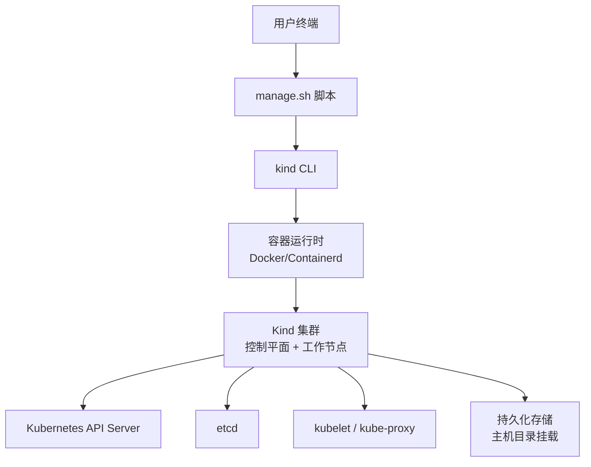
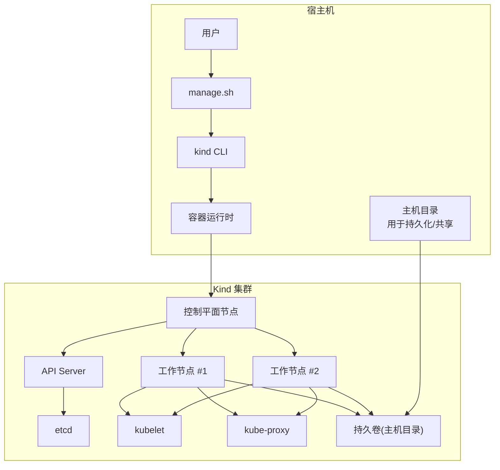
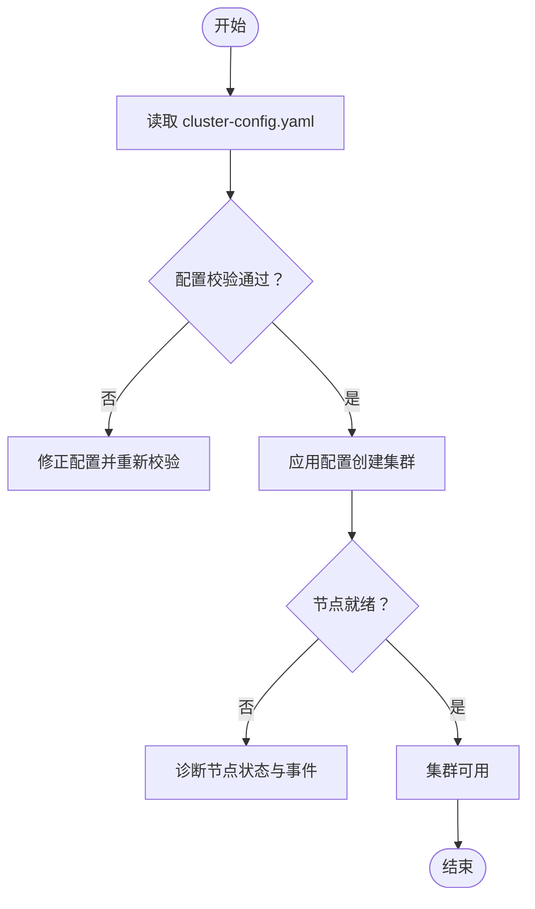
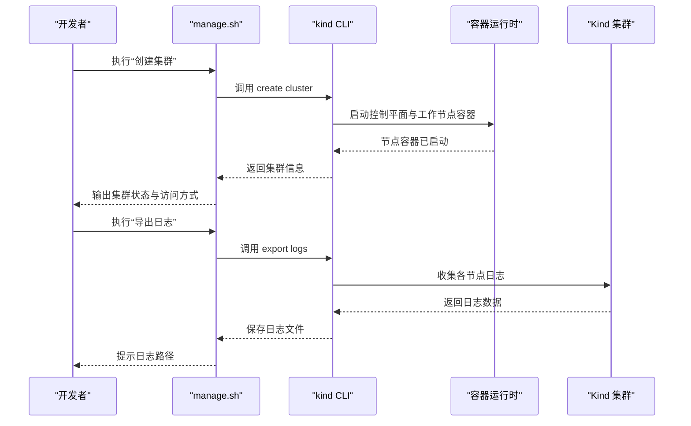

# Kind 本地集群部署

<cite>
**本文引用的文件**   
- [deployment/kind/cluster-config.yaml](file://deployment/kind/cluster-config.yaml)
- [deployment/kind/manage.sh](file://deployment/kind/manage.sh)
- [deployment/README.md](file://deployment/README.md)
</cite>

## 目录
1. [简介](#简介)
2. [项目结构](#项目结构)
3. [核心组件](#核心组件)
4. [架构总览](#架构总览)
5. [详细组件分析](#详细组件分析)
6. [依赖关系分析](#依赖关系分析)
7. [性能考虑](#性能考虑)
8. [故障排查指南](#故障排查指南)
9. [结论](#结论)
10. [附录](#附录)

## 简介
本指南面向在本地使用 Kind 快速搭建 Kubernetes 开发环境的开发者，围绕仓库中的 Kind 相关配置与脚本，提供从集群创建、应用部署、日志查看到故障排查的完整操作说明。内容涵盖：
- Kind 集群配置文件详解（节点角色、资源配额、网络与存储）
- 管理脚本的使用方法与常用命令
- 最佳实践与性能调优建议

## 项目结构
与 Kind 相关的核心文件位于 deployment/kind 目录，主要包括：
- cluster-config.yaml：Kind 集群定义文件，描述控制平面与工作节点的拓扑、端口映射、附加卷挂载等
- manage.sh：一键式管理脚本，封装了集群创建、删除、扩容、日志导出等常用操作
- deployment/README.md：部署说明文档，包含前置依赖、基本用法与常见问题

图表来源
- [deployment/kind/cluster-config.yaml](file://deployment/kind/cluster-config.yaml)
- [deployment/kind/manage.sh](file://deployment/kind/manage.sh)

章节来源
- [deployment/README.md](file://deployment/README.md)

## 核心组件
- Kind 集群配置文件（cluster-config.yaml）
  - 定义控制平面与工作节点数量及角色
  - 指定节点 CPU/内存请求与限制
  - 配置端口转发（如 Ingress/Service 暴露）
  - 挂载主机目录到节点以实现持久化或共享数据
- 管理脚本（manage.sh）
  - 封装 kind create cluster、kind delete cluster、kind export logs 等命令
  - 支持参数化启动（如集群名、节点数、镜像源）
  - 提供便捷的状态检查与错误提示

章节来源
- [deployment/kind/cluster-config.yaml](file://deployment/kind/cluster-config.yaml)
- [deployment/kind/manage.sh](file://deployment/kind/manage.sh)

## 架构总览
下图展示了本地 Kind 集群的典型运行架构，以及与管理脚本和宿主机的交互关系。

图表来源
- [deployment/kind/cluster-config.yaml](file://deployment/kind/cluster-config.yaml)
- [deployment/kind/manage.sh](file://deployment/kind/manage.sh)

## 详细组件分析

### Kind 集群配置文件详解（cluster-config.yaml）
该文件是 Kind 集群的核心声明，通常包含以下关键部分：
- 集群元信息与版本
- 控制平面节点配置
  - 端口转发（HostPort）用于暴露服务
  - 节点标签与系统设置
- 工作节点配置
  - 副本数量与角色
  - CPU/内存请求与限制
  - 磁盘大小与交换分区设置
- 网络插件与 CNI 配置
  - 默认 CNI 选择
  - Pod 网段与服务网段
- 存储与卷挂载
  - 通过 extraMounts 将宿主机目录挂载到节点
  - 适用于数据库、缓存、日志等需要持久化的场景
- 镜像与注册表
  - 自定义镜像源或私有仓库地址
  - 预拉取镜像以加速启动

图表来源
- [deployment/kind/cluster-config.yaml](file://deployment/kind/cluster-config.yaml)

章节来源
- [deployment/kind/cluster-config.yaml](file://deployment/kind/cluster-config.yaml)

### 管理脚本使用说明（manage.sh）
manage.sh 提供了对 Kind 集群的一键管理能力，常见用法包括：
- 创建集群
  - 根据 cluster-config.yaml 初始化控制平面与工作节点
  - 自动完成端口转发与卷挂载
- 删除集群
  - 清理所有节点与关联资源
- 导出日志
  - 收集各节点日志便于问题定位
- 扩展节点
  - 动态增加工作节点以提升计算能力
- 检查状态
  - 验证集群健康度与节点就绪情况

图表来源
- [deployment/kind/manage.sh](file://deployment/kind/manage.sh)

章节来源
- [deployment/kind/manage.sh](file://deployment/kind/manage.sh)

### 网络设置要点
- 端口转发
  - 通过 HostPort 将宿主机端口映射到集群内 Service/Pod
  - 避免端口冲突，确保端口唯一性
- CNI 与网段
  - 默认 CNI 通常满足开发需求
  - 若需自定义 Pod/Service 网段，需在配置中明确
- 防火墙与安全组
  - 确保宿主机允许所需端口入站
  - 本地调试时可临时关闭防火墙以便快速验证

章节来源
- [deployment/kind/cluster-config.yaml](file://deployment/kind/cluster-config.yaml)

### 存储配置要点
- 主机目录挂载
  - 使用 extraMounts 将宿主机目录挂载到节点
  - 适用于数据库、缓存、日志等持久化场景
- 权限与路径
  - 确保宿主机目录存在且具备读写权限
  - 注意不同操作系统的路径差异
- 性能影响
  - 主机目录 I/O 性能直接影响应用吞吐
  - 建议使用 SSD 提升写入性能

章节来源
- [deployment/kind/cluster-config.yaml](file://deployment/kind/cluster-config.yaml)

## 依赖关系分析
- 外部依赖
  - kind CLI：用于创建与管理 Kind 集群
  - 容器运行时：Docker 或 Containerd，用于运行节点容器
  - kubectl：用于与集群交互（可选但推荐）
- 内部依赖
  - cluster-config.yaml：集群定义的基础
  - manage.sh：封装常用操作，降低使用门槛

图表来源
- [deployment/kind/manage.sh](file://deployment/kind/manage.sh)
- [deployment/kind/cluster-config.yaml](file://deployment/kind/cluster-config.yaml)

章节来源
- [deployment/kind/manage.sh](file://deployment/kind/manage.sh)
- [deployment/kind/cluster-config.yaml](file://deployment/kind/cluster-config.yaml)

## 性能考虑
- 节点资源配置
  - 合理设置 CPU/内存请求与限制，避免过度分配导致抖动
  - 为关键应用预留足够资源
- 存储优化
  - 使用高性能磁盘（SSD）作为持久化后端
  - 减少频繁小文件写入，合并日志输出
- 网络优化
  - 避免过多端口转发，集中暴露必要服务
  - 使用本地镜像缓存减少拉取时间
- 镜像管理
  - 预拉取常用镜像，缩短集群启动时间
  - 使用轻量级基础镜像减小镜像体积

[本节为通用指导，无需特定文件引用]

## 故障排查指南
- 集群无法启动
  - 检查端口占用与容器运行时状态
  - 查看 kind 创建日志与节点事件
- 节点未就绪
  - 检查 kubelet 状态与系统资源
  - 确认 CNI 插件正常加载
- 存储挂载失败
  - 验证宿主机目录权限与路径
  - 检查文件系统类型与挂载选项
- 网络不通
  - 确认防火墙规则与端口转发
  - 检查 Service/Ingress 配置与 DNS 解析

章节来源
- [deployment/kind/manage.sh](file://deployment/kind/manage.sh)
- [deployment/kind/cluster-config.yaml](file://deployment/kind/cluster-config.yaml)

## 结论
通过本指南，开发者可以快速搭建基于 Kind 的本地 Kubernetes 环境，并利用提供的配置文件与脚本进行高效开发与测试。建议结合项目实际需求调整节点资源、网络与存储配置，以获得最佳体验。

[本节为总结性内容，无需特定文件引用]

## 附录
- 前置依赖安装
  - 安装 kind CLI 与容器运行时
  - 准备宿主机目录用于持久化存储
- 常用命令速查
  - 创建集群：参考 manage.sh 中的创建逻辑
  - 删除集群：参考 manage.sh 中的删除逻辑
  - 导出日志：参考 manage.sh 中的日志导出逻辑
  - 检查状态：使用 kubectl get nodes/pods 等命令

章节来源
- [deployment/README.md](file://deployment/README.md)
- [deployment/kind/manage.sh](file://deployment/kind/manage.sh)