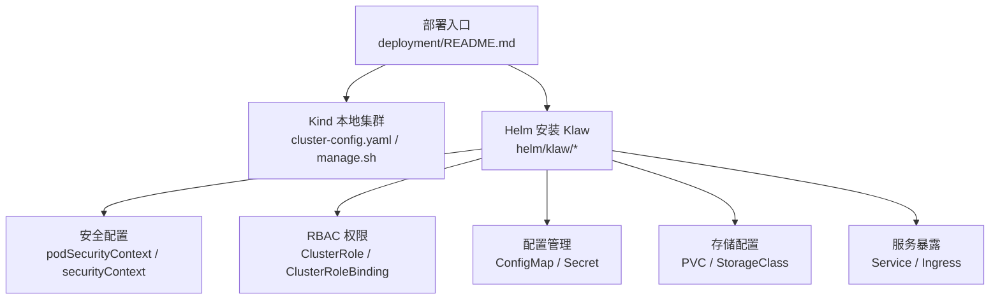
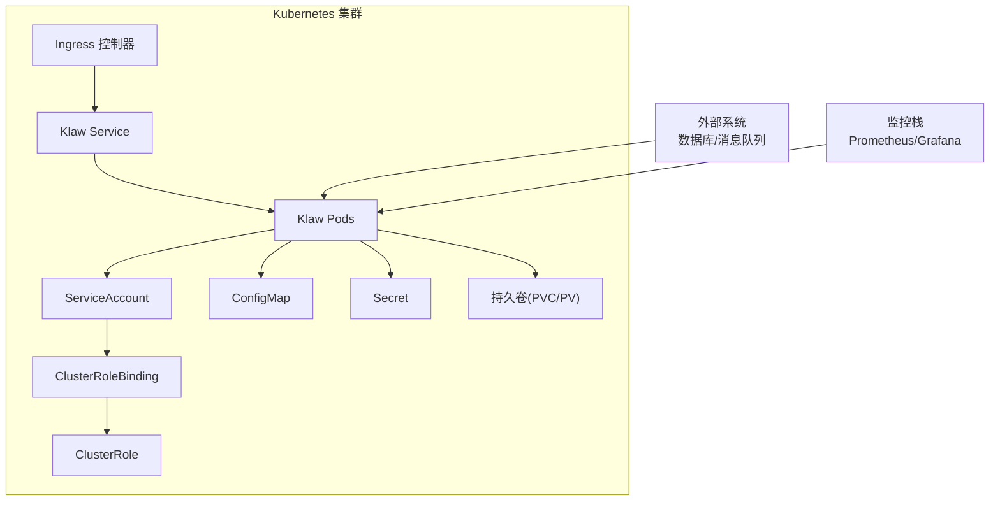
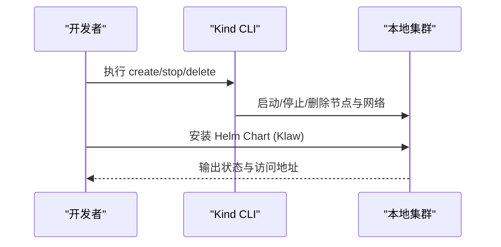
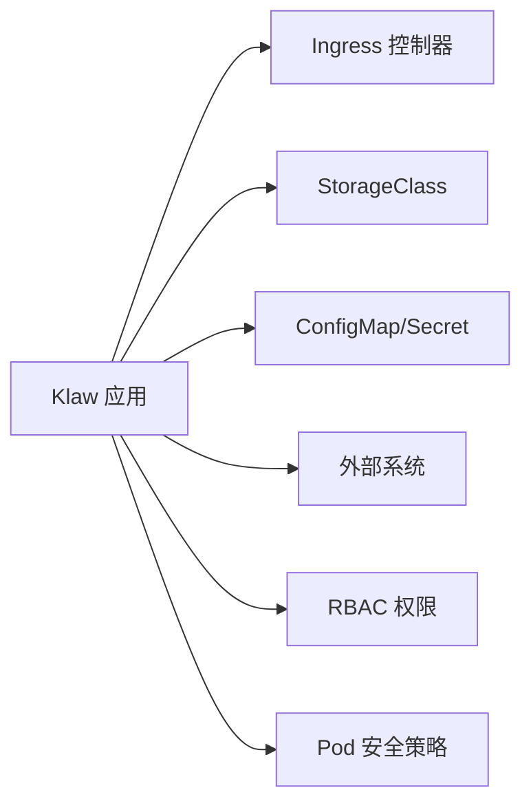

# Kubernetes集群部署

<cite>
**本文引用的文件**   
- [deployment/README.md](file://deployment/README.md)
- [deployment/kind/cluster-config.yaml](file://deployment/kind/cluster-config.yaml)
- [deployment/kind/manage.sh](file://deployment/kind/manage.sh)
- [helm/klaw/Chart.yaml](file://helm/klaw/Chart.yaml)
- [helm/klaw/values.yaml](file://helm/klaw/values.yaml)
- [helm/klaw/values-kind.yaml](file://helm/klaw/values-kind.yaml)
- [helm/klaw/templates/deployment.yaml](file://helm/klaw/templates/deployment.yaml)
- [helm/klaw/templates/rbac.yaml](file://helm/klaw/templates/rbac.yaml)
- [helm/klaw/templates/configmap.yaml](file://helm/klaw/templates/configmap.yaml)
- [helm/klaw/templates/secret.yaml](file://helm/klaw/templates/secret.yaml)
- [helm/klaw/templates/service.yaml](file://helm/klaw/templates/service.yaml)
- [helm/klaw/templates/pvc.yaml](file://helm/klaw/templates/pvc.yaml)
- [helm/klaw/templates/serviceaccount.yaml](file://helm/klaw/templates/serviceaccount.yaml)
- [configs/config.yaml.example](file://configs/config.yaml.example)
- [Dockerfile](file://Dockerfile)
- [Makefile](file://Makefile)
</cite>

## 更新摘要
**变更内容**   
- 新增 Klaw Helm Chart 安全配置章节，详细说明非 root 执行、只读文件系统、能力丢弃等安全特性
- 更新 In-cluster 与外部集群管理模式配置说明
- 增强 RBAC 权限配置章节，包含最小权限原则和具体权限范围
- 完善 Pod 安全上下文和容器安全上下文的配置选项
- 更新存储类配置，支持现有 PVC 引用和自定义存储类
- 增强 ConfigMap 和 Secret 管理，支持外部 Secret 引用

## 目录
1. [简介](#简介)
2. [项目结构](#项目结构)
3. [核心组件](#核心组件)
4. [架构总览](#架构总览)
5. [详细组件分析](#详细组件分析)
6. [依赖关系分析](#依赖关系分析)
7. [性能与扩缩容](#性能与扩缩容)
8. [故障排查指南](#故障排查指南)
9. [结论](#结论)
10. [附录：快速参考](#附录快速参考)

## 简介
本指南面向在 Kubernetes 集群中部署 Klaw 平台，覆盖从环境准备、RBAC 权限、存储类、Ingress、ConfigMap/Secret 管理，到使用 Kind 本地集群与生产环境的完整步骤。同时提供 Helm Chart 自定义配置、资源限制、扩缩容策略等高级选项。**新增**了对安全配置的全面支持，包括非 root 执行、只读文件系统、能力丢弃等安全最佳实践，以及 in-cluster 与外部集群管理模式的灵活配置。

## 项目结构
仓库中与部署相关的关键目录与文件如下：
- deployment/kind：Kind 本地集群的配置文件与脚本
- helm/klaw：Klaw 应用 Helm Chart（Chart.yaml、values.yaml、模板文件）
- configs：应用配置示例
- Dockerfile、Makefile：镜像构建与常用命令



**图表来源**
- [deployment/README.md](file://deployment/README.md)
- [deployment/kind/cluster-config.yaml](file://deployment/kind/cluster-config.yaml)
- [helm/klaw/values.yaml](file://helm/klaw/values.yaml)
- [helm/klaw/templates/deployment.yaml](file://helm/klaw/templates/deployment.yaml)
- [helm/klaw/templates/rbac.yaml](file://helm/klaw/templates/rbac.yaml)

**章节来源**
- [deployment/README.md](file://deployment/README.md)
- [deployment/kind/cluster-config.yaml](file://deployment/kind/cluster-config.yaml)
- [deployment/kind/manage.sh](file://deployment/kind/manage.sh)
- [helm/klaw/Chart.yaml](file://helm/klaw/Chart.yaml)
- [helm/klaw/values.yaml](file://helm/klaw/values.yaml)

## 核心组件
- Klaw 应用服务：通过 Helm Chart 部署，支持安全加固、RBAC 权限控制、持久化存储、健康检查等能力。
- 本地开发环境：基于 Kind 的快速集群搭建与管理脚本。
- **安全配置**：默认启用非 root 执行、只读文件系统、能力丢弃等安全最佳实践。
- **集群管理模式**：支持 in-cluster 模式和外部 kubeconfig 模式。

**章节来源**
- [helm/klaw/Chart.yaml](file://helm/klaw/Chart.yaml)
- [helm/klaw/values.yaml](file://helm/klaw/values.yaml)
- [deployment/kind/cluster-config.yaml](file://deployment/kind/cluster-config.yaml)

## 架构总览
下图展示 Klaw 在 Kubernetes 中的整体部署架构，包括安全上下文、RBAC 权限、配置管理和存储的关系。



**图表来源**
- [helm/klaw/values.yaml](file://helm/klaw/values.yaml)
- [helm/klaw/templates/rbac.yaml](file://helm/klaw/templates/rbac.yaml)
- [helm/klaw/templates/deployment.yaml](file://helm/klaw/templates/deployment.yaml)

## 详细组件分析

### 前置条件与环境要求
- Kubernetes 版本：建议使用与 Chart 兼容的最新稳定版（参见 Chart 元数据）。
- 必备组件：
  - Ingress 控制器（如 Nginx、Traefik）
  - 默认 StorageClass（或自定义）
  - kubectl、helm 客户端
- 网络与端口：确保 Ingress 域名解析与 TLS 证书可用（如需 HTTPS）。

**章节来源**
- [helm/klaw/Chart.yaml](file://helm/klaw/Chart.yaml)
- [helm/klaw/values.yaml](file://helm/klaw/values.yaml)

### RBAC 权限配置
**更新** Klaw 采用最小权限原则，仅授予必要的集群资源访问权限。

#### 权限范围
- **只读权限**：nodes、namespaces、events、services、endpoints、configmaps、resourcequotas、persistentvolumeclaims、secrets
- **Pod 管理**：pods、pods/log（查看、日志、删除）
- **Deployment 管理**：deployments、deployments/scale、replicasets、daemonsets、statefulsets
- **多租户管理**：namespaces、resourcequotas、networkpolicies、roles、rolebindings、clusterrolebindings、clusterroles

#### 权限配置流程


**章节来源**
- [helm/klaw/templates/rbac.yaml](file://helm/klaw/templates/rbac.yaml)

### 安全配置
**新增** Klaw 默认启用多项安全最佳实践，确保容器运行安全。

#### Pod 级安全上下文
- **非 root 执行**：`runAsNonRoot: true`，`runAsUser: 65532`
- **文件系统组**：`fsGroup: 65532`，确保文件访问权限正确
- **用户组**：`runAsGroup: 65532`

#### 容器级安全上下文
- **禁用特权升级**：`allowPrivilegeEscalation: false`
- **只读根文件系统**：`readOnlyRootFilesystem: true`
- **能力丢弃**：`capabilities.drop: ALL`，移除所有 Linux 能力

#### 安全配置示例
```yaml
# values.yaml 中的安全配置
podSecurityContext:
  runAsNonRoot: true
  runAsUser: 65532
  runAsGroup: 65532
  fsGroup: 65532

securityContext:
  allowPrivilegeEscalation: false
  readOnlyRootFilesystem: true
  capabilities:
    drop:
      - ALL
```

**章节来源**
- [helm/klaw/values.yaml](file://helm/klaw/values.yaml)
- [helm/klaw/templates/deployment.yaml](file://helm/klaw/templates/deployment.yaml)

### 存储类配置
**更新** 支持多种存储配置方式，包括现有 PVC 引用和自定义存储类。

#### 存储配置选项
- **现有 PVC 引用**：通过 `existingClaim` 指定已存在的 PVC
- **自动创建 PVC**：通过 `size`、`accessMode`、`storageClass` 配置
- **禁用持久化**：设置 `enabled: false` 使用 emptyDir

#### 存储类选择
- 确认集群已启用默认 StorageClass，或通过 values 指定自定义 StorageClass
- 根据业务需求选择读写模式（ReadWriteOnce/ReadWriteMany）与容量大小
- 对于高可用与备份，建议启用快照与保留策略（由 CSI 驱动支持）

**章节来源**
- [helm/klaw/values.yaml](file://helm/klaw/values.yaml)
- [helm/klaw/templates/pvc.yaml](file://helm/klaw/templates/pvc.yaml)

### Ingress 配置
- 通过 values 配置 Ingress 主机名、路径、TLS、注解等。
- 若使用多域名或多路径，需确保 Ingress 控制器支持相应特性。
- 推荐启用 HTTPS 并配置自动续期（如 cert-manager）。

**章节来源**
- [helm/klaw/values.yaml](file://helm/klaw/values.yaml)

### ConfigMap 与 Secret 管理
**更新** 支持外部 Secret 引用和更灵活的配置管理。

#### 配置管理
- 应用配置通过 ConfigMap 注入，敏感信息通过 Secret 注入
- 建议在 values 中集中管理键值，或使用外部密钥管理（如 Vault、云厂商 KMS）
- 更新策略：滚动更新避免中断，注意配置热加载能力

#### Secret 管理
- **内置 Secret**：通过 `secrets` 字段直接配置
- **外部 Secret**：通过 `existingSecret` 引用已存在的 Secret
- **环境变量注入**：Secret 中的数据以环境变量形式注入到容器中

#### 集群管理模式
- **in-cluster 模式**：使用 Pod 的 ServiceAccount 凭据访问所在集群（无需挂载 kubeconfig）
- **外部集群模式**：通过 kubeconfig 文件路径并自行挂载该文件

**章节来源**
- [helm/klaw/values.yaml](file://helm/klaw/values.yaml)
- [helm/klaw/templates/configmap.yaml](file://helm/klaw/templates/configmap.yaml)
- [helm/klaw/templates/secret.yaml](file://helm/klaw/templates/secret.yaml)
- [configs/config.yaml.example](file://configs/config.yaml.example)

### 使用 Kind 本地集群部署
**更新** 简化了本地部署流程，支持 in-cluster 模式。

#### 本地部署步骤
1. **创建 Kind 集群**：使用 cluster-config.yaml 定义节点数、网络与附加组件
2. **构建并加载镜像**：将本地构建的镜像加载到 Kind 集群
3. **部署应用**：使用 Helm 安装 Klaw，支持 values-kind.yaml 覆盖配置
4. **访问应用**：通过 port-forward 或 Ingress 访问

#### 本地配置特点
- **镜像策略**：`pullPolicy: Never`，使用本地加载的镜像
- **认证配置**：本地默认关闭 API 认证，便于开发调试
- **存储配置**：使用 kind 自带的 local-path StorageClass



**章节来源**
- [deployment/kind/cluster-config.yaml](file://deployment/kind/cluster-config.yaml)
- [deployment/kind/manage.sh](file://deployment/kind/manage.sh)
- [helm/klaw/values-kind.yaml](file://helm/klaw/values-kind.yaml)

### 生产环境集群部署
**更新** 增强了生产环境的安全配置和资源管理。

#### 生产环境最佳实践
- 规划命名空间、资源配额、网络策略与监控告警
- 使用 Helm values 管理多环境差异（dev/staging/prod）
- 配置 HPA/VPA、PodDisruptionBudget、健康探针与日志收集
- 引入 CI/CD 流水线进行自动化发布与回滚

#### 安全加固建议
- 启用 Pod 安全策略（Pod Security Policies 或 Pod Security Standards）
- 使用网络策略限制 Pod 间通信
- 配置资源限制防止资源耗尽
- 启用审计日志和监控告警

**章节来源**
- [helm/klaw/values.yaml](file://helm/klaw/values.yaml)
- [Makefile](file://Makefile)

### Helm Chart 自定义配置
**更新** 提供了更丰富的自定义配置选项。

#### Chart 元数据与依赖
- 查看 Chart.yaml 获取版本与依赖信息
- 支持依赖管理和版本约束

#### 参数化配置
- 通过 values.yaml 调整副本数、资源限制、存储、Ingress、环境变量等
- 支持多环境管理：使用 values files 或 Helm 变量区分不同环境
- 支持现有资源引用：如 existingSecret、existingClaim

#### 关键配置项
- **部署配置**：replicaCount、image、resources
- **安全配置**：podSecurityContext、securityContext
- **服务配置**：service type、port
- **健康检查**：livenessProbe、readinessProbe
- **配置管理**：config、secrets、existingSecret
- **存储配置**：persistence.enabled、size、accessMode、storageClass

**章节来源**
- [helm/klaw/Chart.yaml](file://helm/klaw/Chart.yaml)
- [helm/klaw/values.yaml](file://helm/klaw/values.yaml)

### 资源限制与扩缩容策略
**更新** 提供了更合理的默认资源限制配置。

#### 资源限制
- 设置 CPU/内存请求与限制，确保调度合理与稳定性
- 默认限制：CPU 1000m，内存 1Gi；请求：CPU 500m，内存 512Mi

#### 扩缩容策略
- 启用 HPA 基于 CPU/内存或自定义指标自动扩缩容
- 结合 VPA 动态调整资源请求，优化利用率
- 配置 PodDisruptionBudget 确保高可用性

**章节来源**
- [helm/klaw/values.yaml](file://helm/klaw/values.yaml)

### 服务账户与权限
**更新** 支持独立的服务账户配置。

#### 服务账户配置
- 支持创建独立的服务账户用于权限隔离
- 支持添加注解用于云提供商集成（如 AWS IAM Roles for Service Accounts）
- 与服务账户绑定的 RBAC 权限自动生效

#### 权限绑定
- 自动创建 ClusterRole 和 ClusterRoleBinding
- 遵循最小权限原则，仅授予必要权限
- 支持跨命名空间的集群资源访问

**章节来源**
- [helm/klaw/templates/serviceaccount.yaml](file://helm/klaw/templates/serviceaccount.yaml)
- [helm/klaw/templates/rbac.yaml](file://helm/klaw/templates/rbac.yaml)

### 服务暴露与健康检查
**更新** 提供了标准的服务暴露和健康检查配置。

#### 服务配置
- 默认使用 ClusterIP 类型服务
- 支持自定义服务类型（NodePort、LoadBalancer、Ingress）
- 标准 HTTP 端口 8080

#### 健康检查
- **存活探针**：HTTP GET `/healthz`，初始延迟 10 秒，周期 15 秒
- **就绪探针**：HTTP GET `/readyz`，初始延迟 5 秒，周期 10 秒
- 探针端点可用于负载均衡器健康检查和 Kubernetes 健康检查

**章节来源**
- [helm/klaw/templates/service.yaml](file://helm/klaw/templates/service.yaml)
- [helm/klaw/values.yaml](file://helm/klaw/values.yaml)

### 镜像构建与安全
**更新** 采用多阶段构建和安全镜像优化。

#### 多阶段构建
- **前端构建阶段**：使用 node:20-alpine 构建前端静态资源
- **后端构建阶段**：使用 golang:1.24-alpine 编译 Go 二进制文件
- **最终运行时镜像**：使用 alpine:3.20 最小化运行时环境

#### 安全优化
- **非 root 运行**：创建专用用户 klaw (UID 65532)
- **静态链接**：CGO_ENABLED=0 确保二进制文件无外部依赖
- **精简镜像**：移除不必要的工具和库文件
- **依赖缓存**：利用 Docker 层缓存加速构建

```dockerfile
# 最终镜像配置
FROM alpine:3.20
RUN apk --no-cache add ca-certificates \
    && addgroup -g 65532 klaw \
    && adduser -D -u 65532 -G klaw klaw
USER 65532:65532
EXPOSE 8080
CMD ["./klaw"]
```

**章节来源**
- [Dockerfile](file://Dockerfile)

### Makefile 工具链
**更新** 提供了完整的开发和部署工具链。

#### 开发工具
- **构建命令**：build、build-frontend、build-backend
- **开发环境**：dev、dev-frontend、dev-backend
- **测试命令**：test、test-go、test-frontend
- **代码质量**：fmt、lint

#### Docker 操作
- **镜像构建**：docker-build
- **容器运行**：docker-run（支持配置挂载）
- **容器管理**：docker-stop、docker-clean

#### Helm 操作
- **安装升级**：helm-install、helm-upgrade
- **卸载清理**：helm-uninstall
- **打包发布**：helm-package

**章节来源**
- [Makefile](file://Makefile)

## 依赖关系分析
**更新** 明确了各组件间的依赖关系。

### 主要依赖
- **Klaw 应用依赖**：
  - Ingress 控制器（HTTP/HTTPS 路由）
  - StorageClass（持久化存储）
  - ConfigMap/Secret（配置与密钥）
  - 可选：外部数据库、对象存储、消息队列
- **RBAC 依赖**：
  - Kubernetes API Server（CRD、控制器逻辑）
  - RBAC 权限（ClusterRole/ClusterRoleBinding）

### 安全依赖
- **Pod 安全策略**：需要集群支持 Pod Security Standards 或 Pod Security Policies
- **网络策略**：可选的网络隔离功能
- **存储策略**：CSI 驱动的快照和备份能力



**图表来源**
- [helm/klaw/values.yaml](file://helm/klaw/values.yaml)
- [helm/klaw/templates/rbac.yaml](file://helm/klaw/templates/rbac.yaml)

**章节来源**
- [helm/klaw/values.yaml](file://helm/klaw/values.yaml)
- [helm/klaw/templates/rbac.yaml](file://helm/klaw/templates/rbac.yaml)

## 性能与扩缩容
**更新** 提供了更优化的默认资源配置。

### 性能优化
- **资源规划**：根据 QPS、延迟与数据量估算 CPU/内存需求
- **水平扩展**：HPA 基于指标自动扩缩容，结合负载均衡器提升吞吐
- **垂直扩展**：VPA 动态调整资源请求，减少碎片与浪费
- **存储性能**：选择高性能 StorageClass，必要时使用本地盘或 SSD
- **缓存与连接池**：合理配置应用层缓存与数据库连接池

### 默认资源配置
- **生产环境**：CPU 限制 1000m，内存限制 1Gi
- **开发环境**：CPU 限制 500m，内存限制 512Mi
- **资源请求**：CPU 500m，内存 512Mi（生产），CPU 100m，内存 128Mi（开发）

[本节为通用指导，不直接分析具体文件]

## 故障排查指南
**更新** 增加了安全相关的故障排查方法。

### 常见问题定位
- **Ingress 无法访问**：检查域名解析、TLS 证书、Ingress 控制器日志
- **Pod 启动失败**：查看事件与日志，检查镜像拉取、配置挂载、权限问题
- **存储挂载失败**：确认 StorageClass、PVC/PV 状态、CSI 驱动可用性
- **RBAC 权限错误**：检查 ClusterRole、ClusterRoleBinding 配置
- **安全上下文错误**：验证 podSecurityContext 和 securityContext 配置

### 安全相关问题
- **权限不足**：检查 ServiceAccount 和 RBAC 权限配置
- **文件访问错误**：确认 fsGroup 和用户权限设置
- **只读文件系统错误**：检查需要写入的目录是否正确挂载
- **能力不足**：确认是否需要特定的 Linux 能力

### 诊断工具
- **kubectl 命令**：describe/get/logs 查看资源状态和日志
- **事件查看**：kubectl get events 查看集群事件
- **权限验证**：kubectl auth can-i 验证权限
- **安全上下文**：kubectl describe pod 查看安全配置

**章节来源**
- [helm/klaw/templates/rbac.yaml](file://helm/klaw/templates/rbac.yaml)
- [helm/klaw/values.yaml](file://helm/klaw/values.yaml)

## 结论
通过本指南，您可以在 Kind 本地集群与生产环境中完成 Klaw 平台的部署与运维。借助 Helm Chart 和安全加固配置，实现了可配置、可扩展、安全可靠的集群管理能力。**新增的安全配置**确保了容器运行的安全性，包括非 root 执行、只读文件系统、能力丢弃等最佳实践。**增强的集群管理模式**支持 in-cluster 和外部 kubeconfig 两种模式，满足不同场景需求。建议结合 CI/CD 与监控体系，持续提升交付效率与系统稳定性。

[本节为总结性内容，不直接分析具体文件]

## 附录：快速参考
- **本地部署**：使用 Kind 快速创建集群，安装 Klaw 与 Operator
- **生产部署**：规划命名空间、资源配额、Ingress、存储与监控
- **安全配置**：启用非 root 执行、只读文件系统、能力丢弃
- **集群管理**：支持 in-cluster 和外部 kubeconfig 模式
- **RBAC 权限**：最小权限原则，仅授予必要权限
- **存储配置**：支持现有 PVC 引用和自定义存储类
- **配置管理**：ConfigMap 和 Secret 管理，支持外部 Secret 引用
- **健康检查**：标准 HTTP 探针端点，支持负载均衡器集成
- **镜像构建**：多阶段构建，安全最小化运行时镜像
- **工具链**：Makefile 提供完整的开发和部署工具

[本节为概览性内容，不直接分析具体文件]