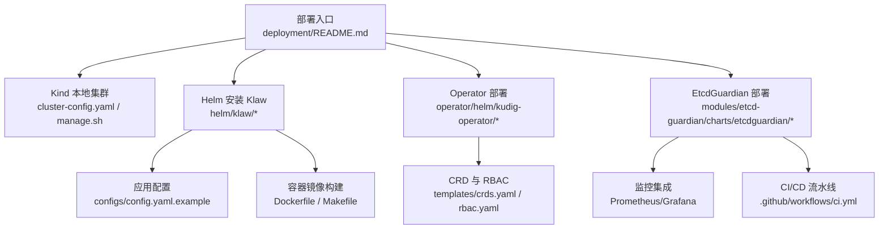
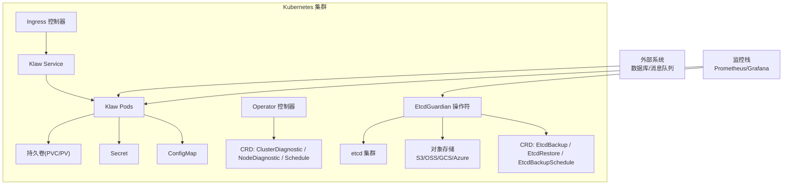
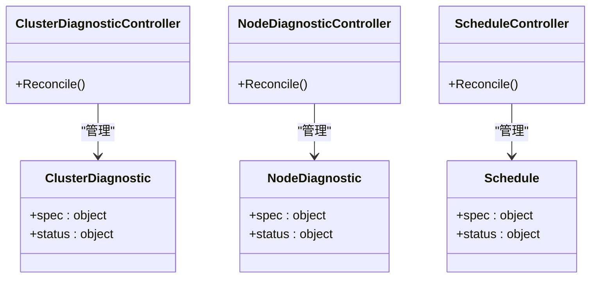
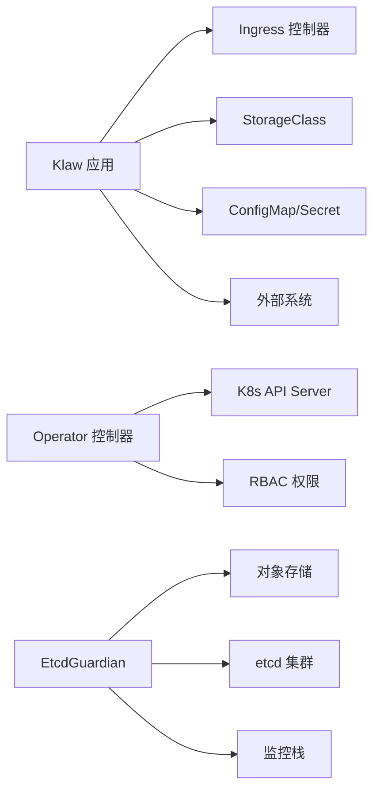

# Kubernetes集群部署

<cite>
**本文引用的文件**   
- [deployment/README.md](file://deployment/README.md)
- [deployment/kind/cluster-config.yaml](file://deployment/kind/cluster-config.yaml)
- [deployment/kind/manage.sh](file://deployment/kind/manage.sh)
- [helm/klaw/Chart.yaml](file://helm/klaw/Chart.yaml)
- [helm/klaw/values.yaml](file://helm/klaw/values.yaml)
- [operator/helm/kudig-operator/Chart.yaml](file://operator/helm/kudig-operator/Chart.yaml)
- [operator/helm/kudig-operator/values.yaml](file://operator/helm/kudig-operator/values.yaml)
- [operator/helm/kudig-operator/templates/deployment.yaml](file://operator/helm/kudig-operator/templates/deployment.yaml)
- [operator/helm/kudig-operator/templates/rbac.yaml](file://operator/helm/kudig-operator/templates/rbac.yaml)
- [operator/helm/kudig-operator/templates/crds.yaml](file://operator/helm/kudig-operator/templates/crds.yaml)
- [operator/api/v1/groupversion_info.go](file://operator/api/v1/groupversion_info.go)
- [operator/controllers/clusterdiagnostic_controller.go](file://operator/controllers/clusterdiagnostic_controller.go)
- [operator/controllers/nodediagnostic_controller.go](file://operator/controllers/nodediagnostic_controller.go)
- [operator/controllers/schedule_controller.go](file://operator/controllers/schedule_controller.go)
- [configs/config.yaml.example](file://configs/config.yaml.example)
- [Dockerfile](file://Dockerfile)
- [Makefile](file://Makefile)
- [modules/etcd-guardian/charts/etcdguardian/Chart.yaml](file://modules/etcd-guardian/charts/etcdguardian/Chart.yaml)
- [modules/etcd-guardian/charts/etcdguardian/values.yaml](file://modules/etcd-guardian/charts/etcdguardian/values.yaml)
- [modules/etcd-guardian/charts/etcdguardian/templates/deployment.yaml](file://modules/etcd-guardian/charts/etcdguardian/templates/deployment.yaml)
- [modules/etcd-guardian/charts/etcdguardian/templates/service.yaml](file://modules/etcd-guardian/charts/etcdguardian/templates/service.yaml)
- [modules/etcd-guardian/Dockerfile](file://modules/etcd-guardian/Dockerfile)
- [modules/etcd-guardian/Dockerfile.backend](file://modules/etcd-guardian/Dockerfile.backend)
- [.github/workflows/ci.yml](file://.github/workflows/ci.yml)
- [modules/etcd-guardian/pkg/metrics/metrics.go](file://modules/etcd-guardian/pkg/metrics/metrics.go)
- [modules/etcd-guardian/config/prometheus/prometheus.yml](file://modules/etcd-guardian/config/prometheus/prometheus.yml)
- [modules/etcd-guardian/config/grafana/provisioning/dashboards/dashboards.yml](file://modules/etcd-guardian/config/grafana/provisioning/dashboards/dashboards.yml)
</cite>

## 更新摘要
**变更内容**   
- 新增 EtcdGuardian Helm Chart 部署章节，包含完整的部署配置和自定义选项
- 更新 Docker 配置章节，涵盖 EtcdGuardian 的多阶段构建优化
- 扩展 CI/CD 流程章节，增加 EtcdGuardian 模块的自动化测试和构建
- 增强监控和可观测性章节，详细说明 Prometheus 指标收集和 Grafana 仪表板配置
- 更新架构图表，反映 EtcdGuardian 组件在整体架构中的位置

## 目录
1. [简介](#简介)
2. [项目结构](#项目结构)
3. [核心组件](#核心组件)
4. [架构总览](#架构总览)
5. [详细组件分析](#详细组件分析)
6. [依赖关系分析](#依赖关系分析)
7. [性能与扩缩容](#性能与扩缩容)
8. [故障排查指南](#故障排查指南)
9. [结论](#结论)
10. [附录：快速参考](#附录快速参考)

## 简介
本指南面向在 Kubernetes 集群中部署 Klaw 平台，覆盖从环境准备、RBAC 权限、存储类、Ingress、ConfigMap/Secret 管理，到使用 Kind 本地集群与生产环境的完整步骤。同时提供 Helm Chart 自定义配置、资源限制、扩缩容策略等高级选项，并包含 Operator 部署与 CRD 管理的说明。**新增**了对 EtcdGuardian 的完整支持，包括其独立的 Helm Chart 部署、监控集成和 CI/CD 流水线。

## 项目结构
仓库中与部署相关的关键目录与文件如下：
- deployment/kind：Kind 本地集群的配置文件与脚本
- helm/klaw：Klaw 应用 Helm Chart（Chart.yaml、values.yaml）
- operator/helm/kudig-operator：Operator Helm Chart（Chart.yaml、values.yaml、模板与 RBAC/CRD）
- **modules/etcd-guardian/charts/etcdguardian**：**新增** EtcdGuardian 专用 Helm Chart
- configs：应用配置示例
- Dockerfile、Makefile：镜像构建与常用命令
- **.github/workflows/ci.yml**：**更新** 包含 EtcdGuardian 模块的 CI/CD 流程



**图表来源**
- [deployment/README.md](file://deployment/README.md)
- [deployment/kind/cluster-config.yaml](file://deployment/kind/cluster-config.yaml)
- [deployment/kind/manage.sh](file://deployment/kind/manage.sh)
- [helm/klaw/Chart.yaml](file://helm/klaw/Chart.yaml)
- [operator/helm/kudig-operator/Chart.yaml](file://operator/helm/kudig-operator/Chart.yaml)
- [modules/etcd-guardian/charts/etcdguardian/Chart.yaml](file://modules/etcd-guardian/charts/etcdguardian/Chart.yaml)
- [.github/workflows/ci.yml](file://.github/workflows/ci.yml)

**章节来源**
- [deployment/README.md](file://deployment/README.md)
- [deployment/kind/cluster-config.yaml](file://deployment/kind/cluster-config.yaml)
- [deployment/kind/manage.sh](file://deployment/kind/manage.sh)
- [helm/klaw/Chart.yaml](file://helm/klaw/Chart.yaml)
- [operator/helm/kudig-operator/Chart.yaml](file://operator/helm/kudig-operator/Chart.yaml)
- [modules/etcd-guardian/charts/etcdguardian/Chart.yaml](file://modules/etcd-guardian/charts/etcdguardian/Chart.yaml)
- [.github/workflows/ci.yml](file://.github/workflows/ci.yml)

## 核心组件
- Klaw 应用服务：通过 Helm Chart 部署，支持 Ingress、ConfigMap/Secret、持久化存储、HPA/VPA 等能力。
- Operator：用于管理自定义资源（如 ClusterDiagnostic、NodeDiagnostic、Schedule），由 Helm Chart 安装 CRD、RBAC 与控制器。
- **EtcdGuardian**：**新增** etcd 备份与灾难恢复操作符，提供独立的 Helm Chart 部署和完整的监控集成。
- 本地开发环境：基于 Kind 的快速集群搭建与管理脚本。

**章节来源**
- [helm/klaw/Chart.yaml](file://helm/klaw/Chart.yaml)
- [operator/helm/kudig-operator/Chart.yaml](file://operator/helm/kudig-operator/Chart.yaml)
- [modules/etcd-guardian/charts/etcdguardian/Chart.yaml](file://modules/etcd-guardian/charts/etcdguardian/Chart.yaml)
- [deployment/kind/cluster-config.yaml](file://deployment/kind/cluster-config.yaml)

## 架构总览
下图展示 Klaw 在 Kubernetes 中的整体部署架构，包括 Ingress、应用 Pod、Operator、EtcdGuardian 与外部存储的关系。



**图表来源**
- [helm/klaw/values.yaml](file://helm/klaw/values.yaml)
- [operator/helm/kudig-operator/templates/crds.yaml](file://operator/helm/kudig-operator/templates/crds.yaml)
- [modules/etcd-guardian/charts/etcdguardian/values.yaml](file://modules/etcd-guardian/charts/etcdguardian/values.yaml)
- [modules/etcd-guardian/config/prometheus/prometheus.yml](file://modules/etcd-guardian/config/prometheus/prometheus.yml)

## 详细组件分析

### 前置条件与环境要求
- Kubernetes 版本：建议使用与 Chart 兼容的最新稳定版（参见 Chart 元数据）。
- 必备组件：
  - Ingress 控制器（如 Nginx、Traefik）
  - 默认 StorageClass（或自定义）
  - kubectl、helm 客户端
- 网络与端口：确保 Ingress 域名解析与 TLS 证书可用（如需 HTTPS）。

**章节来源**
- [helm/klaw/Chart.yaml](file://helm/klaw/Chart.yaml)
- [helm/klaw/values.yaml](file://helm/klaw/values.yaml)

### RBAC 权限配置
- Operator 需要访问 CRD、Deployment、Service、ConfigMap、Secret 等资源。
- 建议为 Operator 创建独立的 ServiceAccount、Role/ClusterRole 与绑定。
- 若仅允许操作特定命名空间，使用 Role；否则使用 ClusterRole。


**章节来源**
- [operator/helm/kudig-operator/templates/rbac.yaml](file://operator/helm/kudig-operator/templates/rbac.yaml)

### 存储类配置
- 确认集群已启用默认 StorageClass，或通过 values 指定自定义 StorageClass。
- 根据业务需求选择读写模式（ReadWriteOnce/ReadWriteMany）与容量大小。
- 对于高可用与备份，建议启用快照与保留策略（由 CSI 驱动支持）。

**章节来源**
- [helm/klaw/values.yaml](file://helm/klaw/values.yaml)

### Ingress 配置
- 通过 values 配置 Ingress 主机名、路径、TLS、注解等。
- 若使用多域名或多路径，需确保 Ingress 控制器支持相应特性。
- 推荐启用 HTTPS 并配置自动续期（如 cert-manager）。

**章节来源**
- [helm/klaw/values.yaml](file://helm/klaw/values.yaml)

### ConfigMap 与 Secret 管理
- 应用配置通过 ConfigMap 注入，敏感信息通过 Secret 注入。
- 建议在 values 中集中管理键值，或使用外部密钥管理（如 Vault、云厂商 KMS）。
- 更新策略：滚动更新避免中断，注意配置热加载能力。

**章节来源**
- [helm/klaw/values.yaml](file://helm/klaw/values.yaml)
- [configs/config.yaml.example](file://configs/config.yaml.example)

### 使用 Kind 本地集群部署
- 使用 cluster-config.yaml 定义节点数、网络与附加组件。
- 使用 manage.sh 脚本进行集群创建、删除、扩容等操作。
- 本地部署适合开发与测试，便于快速迭代。


**章节来源**
- [deployment/kind/cluster-config.yaml](file://deployment/kind/cluster-config.yaml)
- [deployment/kind/manage.sh](file://deployment/kind/manage.sh)

### 生产环境集群部署
- 规划命名空间、资源配额、网络策略与监控告警。
- 使用 Helm values 管理多环境差异（dev/staging/prod）。
- 配置 HPA/VPA、PodDisruptionBudget、健康探针与日志收集。
- 引入 CI/CD 流水线进行自动化发布与回滚。

**章节来源**
- [helm/klaw/values.yaml](file://helm/klaw/values.yaml)
- [Makefile](file://Makefile)

### Helm Chart 自定义配置
- Chart 元数据与依赖：查看 Chart.yaml 获取版本与依赖信息。
- 参数化配置：通过 values.yaml 调整副本数、资源限制、存储、Ingress、环境变量等。
- 多环境管理：使用 values files 或 Helm 变量区分不同环境。

**章节来源**
- [helm/klaw/Chart.yaml](file://helm/klaw/Chart.yaml)
- [helm/klaw/values.yaml](file://helm/klaw/values.yaml)

### 资源限制与扩缩容策略
- 设置 CPU/内存请求与限制，确保调度合理与稳定性。
- 启用 HPA 基于 CPU/内存或自定义指标自动扩缩容。
- 结合 VPA 动态调整资源请求，优化利用率。

**章节来源**
- [helm/klaw/values.yaml](file://helm/klaw/values.yaml)

### Operator 部署与 CRD 管理
- 安装 Operator Chart 将创建 CRD、RBAC 与控制器 Deployment。
- 控制器监听 CRD 事件并协调资源状态。
- 可通过 values 控制副本数、日志级别、资源限制等。



**图表来源**
- [operator/api/v1/groupversion_info.go](file://operator/api/v1/groupversion_info.go)
- [operator/controllers/clusterdiagnostic_controller.go](file://operator/controllers/clusterdiagnostic_controller.go)
- [operator/controllers/nodediagnostic_controller.go](file://operator/controllers/nodediagnostic_controller.go)
- [operator/controllers/schedule_controller.go](file://operator/controllers/schedule_controller.go)
- [operator/helm/kudig-operator/templates/crds.yaml](file://operator/helm/kudig-operator/templates/crds.yaml)

**章节来源**
- [operator/helm/kudig-operator/Chart.yaml](file://operator/helm/kudig-operator/Chart.yaml)
- [operator/helm/kudig-operator/values.yaml](file://operator/helm/kudig-operator/values.yaml)
- [operator/helm/kudig-operator/templates/deployment.yaml](file://operator/helm/kudig-operator/templates/deployment.yaml)
- [operator/helm/kudig-operator/templates/rbac.yaml](file://operator/helm/kudig-operator/templates/rbac.yaml)
- [operator/helm/kudig-operator/templates/crds.yaml](file://operator/helm/kudig-operator/templates/crds.yaml)
- [operator/api/v1/groupversion_info.go](file://operator/api/v1/groupversion_info.go)
- [operator/controllers/clusterdiagnostic_controller.go](file://operator/controllers/clusterdiagnostic_controller.go)
- [operator/controllers/nodediagnostic_controller.go](file://operator/controllers/nodediagnostic_controller.go)
- [operator/controllers/schedule_controller.go](file://operator/controllers/schedule_controller.go)

### **EtcdGuardian 部署与配置**
**新增** EtcdGuardian 是专为 etcd 备份与灾难恢复设计的 Kubernetes 操作符，提供完整的 Helm Chart 部署支持。

#### EtcdGuardian 核心功能
- **多存储后端支持**：S3、阿里云 OSS、GCS、Azure Blob
- **定时备份**：基于 CronJob 的自动化备份策略
- **在线/离线恢复**：支持多种恢复模式
- **完整监控**：内置 Prometheus 指标和 Grafana 仪表板
- **高可用部署**：支持 leader election 和多副本部署

#### EtcdGuardian Helm Chart 配置
```yaml
# 基本部署配置
replicas: 1
image:
  repository: etcdguardian/operator
  tag: "latest"
  pullPolicy: IfNotPresent

# 监控配置
metrics:
  enabled: true
  port: 8080
  serviceMonitor:
    enabled: false
    interval: 30s

# 存储配置
storage:
  defaultProvider: s3
  s3:
    enabled: true
    bucket: ""
    region: us-east-1
  
  oss:
    enabled: false
    bucket: ""
    region: cn-hangzhou
  
  gcs:
    enabled: false
    bucket: ""
    region: us-central1
  
  azure:
    enabled: false
    storageAccount: ""
    container: ""

# 安全配置
podSecurityContext:
  runAsNonRoot: true
  runAsUser: 65532

securityContext:
  allowPrivilegeEscalation: false
  capabilities:
    drop:
    - ALL
  readOnlyRootFilesystem: true
```

#### EtcdGuardian 部署步骤
1. **添加 Helm Repository**：
   ```bash
   helm repo add etcdguardian https://charts.etcdguardian.io
   helm repo update
   ```

2. **创建命名空间和配置**：
   ```bash
   kubectl create namespace etcd-guardian-system
   kubectl apply -f modules/etcd-guardian/config/rbac/
   ```

3. **安装 EtcdGuardian**：
   ```bash
   helm install etcdguardian modules/etcd-guardian/charts/etcdguardian \
     --namespace etcd-guardian-system \
     --set storage.s3.bucket=my-backup-bucket \
     --set metrics.enabled=true
   ```

4. **验证部署**：
   ```bash
   kubectl get pods -n etcd-guardian-system
   kubectl get services -n etcd-guardian-system
   ```

#### EtcdGuardian 监控集成
- **Prometheus 指标**：暴露 `/metrics` 端点，包含备份时长、大小、成功率等关键指标
- **健康检查**：提供 `/healthz` 和 `/readyz` 健康检查端点
- **Grafana 仪表板**：预配置的 etcd 备份监控仪表板
- **告警规则**：支持自定义告警规则配置

**章节来源**
- [modules/etcd-guardian/charts/etcdguardian/Chart.yaml](file://modules/etcd-guardian/charts/etcdguardian/Chart.yaml)
- [modules/etcd-guardian/charts/etcdguardian/values.yaml](file://modules/etcd-guardian/charts/etcdguardian/values.yaml)
- [modules/etcd-guardian/charts/etcdguardian/templates/deployment.yaml](file://modules/etcd-guardian/charts/etcdguardian/templates/deployment.yaml)
- [modules/etcd-guardian/charts/etcdguardian/templates/service.yaml](file://modules/etcd-guardian/charts/etcdguardian/templates/service.yaml)
- [modules/etcd-guardian/pkg/metrics/metrics.go](file://modules/etcd-guardian/pkg/metrics/metrics.go)
- [modules/etcd-guardian/config/prometheus/prometheus.yml](file://modules/etcd-guardian/config/prometheus/prometheus.yml)

### **Docker 配置优化**
**更新** 项目采用多阶段 Docker 构建优化，提升镜像安全性和构建效率。

#### Klaw 主应用镜像
- **基础镜像**：使用 `golang:1.22-alpine` 作为构建环境
- **最终镜像**：使用 `gcr.io/distroless/static:nonroot` 最小化运行时
- **安全加固**：以非 root 用户运行，禁用特权升级

#### EtcdGuardian 镜像配置
- **双镜像支持**：提供 manager 和 backend 两个独立镜像
- **静态编译**：使用 CGO_ENABLED=0 进行静态链接，减少依赖
- **优化构建**：利用 Go module 缓存和多阶段构建

```dockerfile
# EtcdGuardian Manager 镜像
FROM golang:1.22-alpine AS builder
WORKDIR /workspace
RUN apk add --no-cache git make gcc musl-dev
COPY go.mod go.sum ./
RUN go mod download
COPY . .
RUN CGO_ENABLED=0 GOOS=linux GOARCH=amd64 go build -a -installsuffix cgo -ldflags '-w -s -extldflags "-static"' -o bin/manager cmd/manager/main.go

FROM gcr.io/distroless/static:nonroot
WORKDIR /
COPY --from=builder /workspace/bin/manager .
COPY --from=builder /workspace/config/samples config/samples
USER nonroot:nonroot
ENTRYPOINT ["/manager"]
```

**章节来源**
- [Dockerfile](file://Dockerfile)
- [modules/etcd-guardian/Dockerfile](file://modules/etcd-guardian/Dockerfile)
- [modules/etcd-guardian/Dockerfile.backend](file://modules/etcd-guardian/Dockerfile.backend)

### **CI/CD 流程增强**
**更新** GitHub Actions 工作流现已包含完整的 EtcdGuardian 模块支持。

#### 新增的 CI/CD 作业
- **etcd-guardian-module**：专门针对 EtcdGuardian 的构建和测试
- **Helm 验证**：对所有 Helm Charts 进行 lint 和模板渲染检查
- **Docker 构建**：集成 Docker 镜像构建和缓存优化

#### CI/CD 流程特点
- **并行执行**：多个模块的构建和测试并行执行，提升效率
- **Go 版本管理**：针对不同模块使用合适的 Go 版本
- **缓存优化**：使用 GitHub Actions Cache 加速依赖下载
- **安全扫描**：集成漏洞扫描和质量检查

```yaml
# EtcdGuardian CI/CD 配置
etcd-guardian-module:
  runs-on: ubuntu-latest
  steps:
    - uses: actions/checkout@v4
    - uses: actions/setup-go@v5
      with:
        go-version: "1.26"
    - name: Build operator module
      working-directory: modules/etcd-guardian
      run: go build ./...
    - name: Test operator module
      working-directory: modules/etcd-guardian
      run: go test ./... -count=1
    - name: Build backend module
      working-directory: modules/etcd-guardian/backend
      run: go build ./...
    - name: Test backend module
      working-directory: modules/etcd-guardian/backend
      run: go test ./... -count=1
```

**章节来源**
- [.github/workflows/ci.yml](file://.github/workflows/ci.yml)

### **监控和可观测性增强**
**更新** 项目提供了完整的监控和可观测性解决方案，特别是 EtcdGuardian 的监控集成。

#### Prometheus 指标
EtcdGuardian 暴露以下关键指标：
- **备份指标**：`etcdguardian_backup_duration_seconds`、`etcdguardian_backup_size_bytes`、`etcdguardian_backup_total`
- **etcd 状态指标**：`etcdguardian_etcd_db_size_bytes`、`etcdguardian_etcd_revision`
- **操作指标**：`etcdguardian_restore_duration_seconds`、`etcdguardian_restore_total`
- **错误指标**：`etcdguardian_validation_failures_total`

#### 监控配置
```yaml
# Prometheus 配置
scrape_configs:
  - job_name: 'etcd-guardian-operator'
    kubernetes_sd_configs:
      - role: pod
        namespaces:
          names:
            - etcd-guardian-system
    relabel_configs:
      - source_labels: [__meta_kubernetes_pod_label_app]
        action: keep
        regex: etcdguardian
      - source_labels: [__meta_kubernetes_pod_annotation_prometheus_io_scrape]
        action: keep
        regex: true

  - job_name: 'etcd-guardian-backend'
    static_configs:
      - targets: ['backend:8080']

  - job_name: 'etcd'
    static_configs:
      - targets: ['etcd:2379']
```

#### Grafana 仪表板
- **预配置仪表板**：提供 etcd 备份和恢复的完整监控视图
- **数据源配置**：自动配置 Prometheus 数据源连接
- **实时更新**：支持仪表板的自动刷新和更新

**章节来源**
- [modules/etcd-guardian/pkg/metrics/metrics.go](file://modules/etcd-guardian/pkg/metrics/metrics.go)
- [modules/etcd-guardian/config/prometheus/prometheus.yml](file://modules/etcd-guardian/config/prometheus/prometheus.yml)
- [modules/etcd-guardian/config/grafana/provisioning/dashboards/dashboards.yml](file://modules/etcd-guardian/config/grafana/provisioning/dashboards/dashboards.yml)

### 镜像构建与发布
- 使用 Dockerfile 定义应用镜像构建流程。
- Makefile 封装常用命令（构建、推送、清理等）。
- 建议在 CI 中集成镜像扫描与安全校验。

**章节来源**
- [Dockerfile](file://Dockerfile)
- [Makefile](file://Makefile)

## 依赖关系分析
- Klaw 应用依赖：
  - Ingress 控制器（HTTP/HTTPS 路由）
  - StorageClass（持久化存储）
  - ConfigMap/Secret（配置与密钥）
  - 可选：外部数据库、对象存储、消息队列
- Operator 依赖：
  - Kubernetes API Server（CRD、控制器逻辑）
  - RBAC 权限（Role/ClusterRole）
- **EtcdGuardian 依赖**：
  - **对象存储服务**：S3、OSS、GCS、Azure Blob
  - **etcd 集群**：用于备份和恢复操作
  - **监控栈**：Prometheus 和 Grafana（可选）



**图表来源**
- [helm/klaw/values.yaml](file://helm/klaw/values.yaml)
- [operator/helm/kudig-operator/templates/rbac.yaml](file://operator/helm/kudig-operator/templates/rbac.yaml)
- [modules/etcd-guardian/charts/etcdguardian/values.yaml](file://modules/etcd-guardian/charts/etcdguardian/values.yaml)

**章节来源**
- [helm/klaw/values.yaml](file://helm/klaw/values.yaml)
- [operator/helm/kudig-operator/templates/rbac.yaml](file://operator/helm/kudig-operator/templates/rbac.yaml)
- [modules/etcd-guardian/charts/etcdguardian/values.yaml](file://modules/etcd-guardian/charts/etcdguardian/values.yaml)

## 性能与扩缩容
- 资源规划：根据 QPS、延迟与数据量估算 CPU/内存需求。
- 水平扩展：HPA 基于指标自动扩缩容，结合负载均衡器提升吞吐。
- 垂直扩展：VPA 动态调整资源请求，减少碎片与浪费。
- 存储性能：选择高性能 StorageClass，必要时使用本地盘或 SSD。
- 缓存与连接池：合理配置应用层缓存与数据库连接池。
- **EtcdGuardian 性能优化**：
  - **并发备份**：支持并行备份多个 etcd 实例
  - **增量备份**：减少网络传输和存储空间占用
  - **压缩存储**：自动压缩备份数据，节省存储空间

[本节为通用指导，不直接分析具体文件]

## 故障排查指南
- 常见问题定位：
  - Ingress 无法访问：检查域名解析、TLS 证书、Ingress 控制器日志。
  - Pod 启动失败：查看事件与日志，检查镜像拉取、配置挂载、权限问题。
  - 存储挂载失败：确认 StorageClass、PVC/PV 状态、CSI 驱动可用性。
  - Operator 未生效：检查 CRD 是否安装、RBAC 权限、控制器日志。
  - **EtcdGuardian 问题**：检查 etcd 连接、对象存储配置、备份任务状态。
- 诊断工具：kubectl describe/get/logs、事件查看、Prometheus/Grafana 监控。
- **EtcdGuardian 诊断**：
  - 使用 `kubectl get etcdbackups` 查看备份状态
  - 检查 `/metrics` 端点获取性能指标
  - 查看备份日志和错误信息

**章节来源**
- [operator/helm/kudig-operator/templates/rbac.yaml](file://operator/helm/kudig-operator/templates/rbac.yaml)
- [operator/helm/kudig-operator/templates/crds.yaml](file://operator/helm/kudig-operator/templates/crds.yaml)
- [modules/etcd-guardian/charts/etcdguardian/values.yaml](file://modules/etcd-guardian/charts/etcdguardian/values.yaml)

## 结论
通过本指南，您可以在 Kind 本地集群与生产环境中完成 Klaw 平台的部署与运维。借助 Helm 与 Operator，实现可配置、可扩展与可治理的集群管理能力。**新增的 EtcdGuardian 组件**为 etcd 数据提供了企业级的备份与灾难恢复能力，配合完善的监控和 CI/CD 流水线，确保了系统的稳定性和可维护性。建议结合 CI/CD 与监控体系，持续提升交付效率与系统稳定性。

[本节为总结性内容，不直接分析具体文件]

## 附录：快速参考
- 本地部署：使用 Kind 快速创建集群，安装 Klaw 与 Operator。
- 生产部署：规划命名空间、资源配额、Ingress、存储与监控。
- 自定义配置：通过 Helm values 管理多环境差异。
- 扩缩容：启用 HPA/VPA，结合指标与策略自动调整。
- Operator：安装 CRD 与控制器，管理自定义资源。
- **EtcdGuardian**：独立部署 etcd 备份操作符，支持多种存储后端和完整监控。
- **监控集成**：配置 Prometheus 和 Grafana，实现全面的可观测性。
- **CI/CD**：利用 GitHub Actions 实现自动化构建、测试和部署。

[本节为概览性内容，不直接分析具体文件]