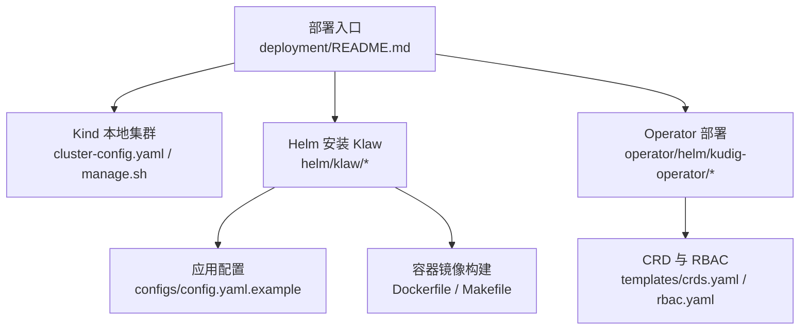
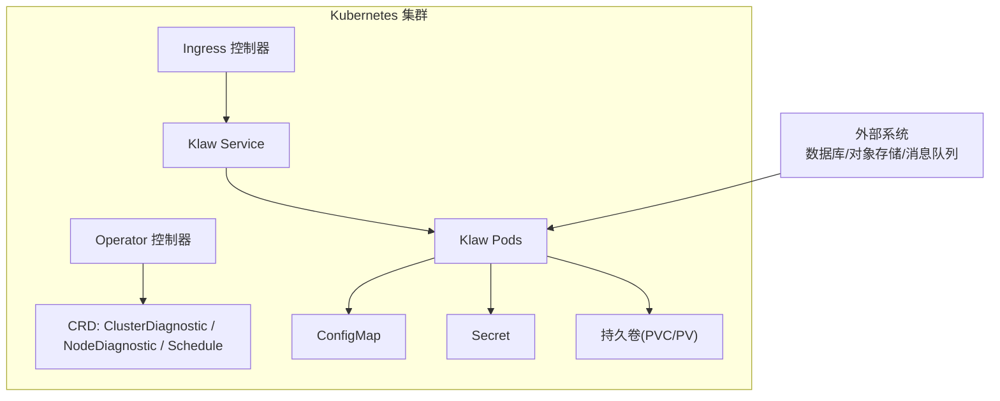
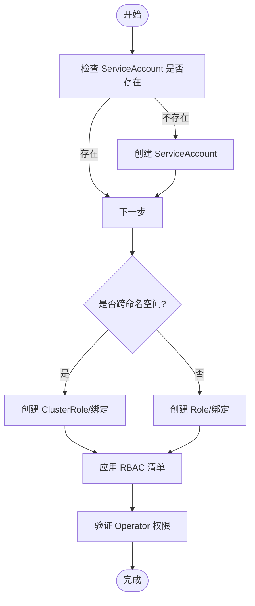
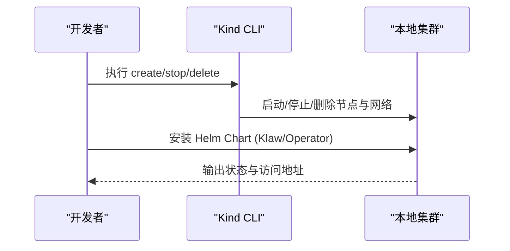
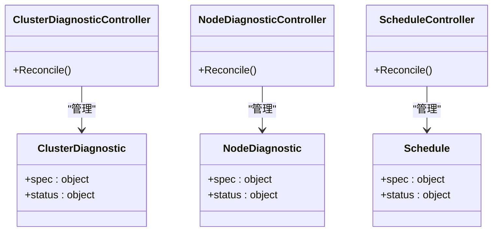
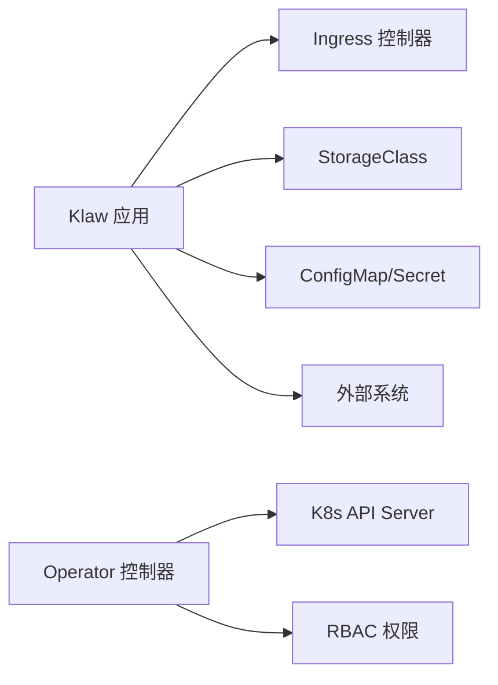

# Kubernetes集群部署

<cite>
**本文引用的文件**   
- [deployment/README.md](file://deployment/README.md)
- [deployment/kind/cluster-config.yaml](file://deployment/kind/cluster-config.yaml)
- [deployment/kind/manage.sh](file://deployment/kind/manage.sh)
- [helm/klaw/Chart.yaml](file://helm/klaw/Chart.yaml)
- [helm/klaw/values.yaml](file://helm/klaw/values.yaml)
- [operator/helm/kudig-operator/Chart.yaml](file://operator/helm/kudig-operator/Chart.yaml)
- [operator/helm/kudig-operator/values.yaml](file://operator/helm/kudig-operator/values.yaml)
- [operator/helm/kudig-operator/templates/deployment.yaml](file://operator/helm/kudig-operator/templates/deployment.yaml)
- [operator/helm/kudig-operator/templates/rbac.yaml](file://operator/helm/kudig-operator/templates/rbac.yaml)
- [operator/helm/kudig-operator/templates/crds.yaml](file://operator/helm/kudig-operator/templates/crds.yaml)
- [operator/api/v1/groupversion_info.go](file://operator/api/v1/groupversion_info.go)
- [operator/controllers/clusterdiagnostic_controller.go](file://operator/controllers/clusterdiagnostic_controller.go)
- [operator/controllers/nodediagnostic_controller.go](file://operator/controllers/nodediagnostic_controller.go)
- [operator/controllers/schedule_controller.go](file://operator/controllers/schedule_controller.go)
- [configs/config.yaml.example](file://configs/config.yaml.example)
- [Dockerfile](file://Dockerfile)
- [Makefile](file://Makefile)
</cite>

## 目录
1. [简介](#简介)
2. [项目结构](#项目结构)
3. [核心组件](#核心组件)
4. [架构总览](#架构总览)
5. [详细组件分析](#详细组件分析)
6. [依赖关系分析](#依赖关系分析)
7. [性能与扩缩容](#性能与扩缩容)
8. [故障排查指南](#故障排查指南)
9. [结论](#结论)
10. [附录：快速参考](#附录快速参考)

## 简介
本指南面向在 Kubernetes 集群中部署 Klaw 平台，覆盖从环境准备、RBAC 权限、存储类、Ingress、ConfigMap/Secret 管理，到使用 Kind 本地集群与生产环境的完整步骤。同时提供 Helm Chart 自定义配置、资源限制、扩缩容策略等高级选项，并包含 Operator 部署与 CRD 管理的说明。

## 项目结构
仓库中与部署相关的关键目录与文件如下：
- deployment/kind：Kind 本地集群的配置文件与脚本
- helm/klaw：Klaw 应用 Helm Chart（Chart.yaml、values.yaml）
- operator/helm/kudig-operator：Operator Helm Chart（Chart.yaml、values.yaml、模板与 RBAC/CRD）
- configs：应用配置示例
- Dockerfile、Makefile：镜像构建与常用命令

图表来源
- [deployment/README.md](file://deployment/README.md)
- [deployment/kind/cluster-config.yaml](file://deployment/kind/cluster-config.yaml)
- [deployment/kind/manage.sh](file://deployment/kind/manage.sh)
- [helm/klaw/Chart.yaml](file://helm/klaw/Chart.yaml)
- [helm/klaw/values.yaml](file://helm/klaw/values.yaml)
- [operator/helm/kudig-operator/Chart.yaml](file://operator/helm/kudig-operator/Chart.yaml)
- [operator/helm/kudig-operator/values.yaml](file://operator/helm/kudig-operator/values.yaml)
- [operator/helm/kudig-operator/templates/crds.yaml](file://operator/helm/kudig-operator/templates/crds.yaml)
- [operator/helm/kudig-operator/templates/rbac.yaml](file://operator/helm/kudig-operator/templates/rbac.yaml)

章节来源
- [deployment/README.md](file://deployment/README.md)
- [deployment/kind/cluster-config.yaml](file://deployment/kind/cluster-config.yaml)
- [deployment/kind/manage.sh](file://deployment/kind/manage.sh)
- [helm/klaw/Chart.yaml](file://helm/klaw/Chart.yaml)
- [helm/klaw/values.yaml](file://helm/klaw/values.yaml)
- [operator/helm/kudig-operator/Chart.yaml](file://operator/helm/kudig-operator/Chart.yaml)
- [operator/helm/kudig-operator/values.yaml](file://operator/helm/kudig-operator/values.yaml)
- [operator/helm/kudig-operator/templates/crds.yaml](file://operator/helm/kudig-operator/templates/crds.yaml)
- [operator/helm/kudig-operator/templates/rbac.yaml](file://operator/helm/kudig-operator/templates/rbac.yaml)
- [configs/config.yaml.example](file://configs/config.yaml.example)
- [Dockerfile](file://Dockerfile)
- [Makefile](file://Makefile)

## 核心组件
- Klaw 应用服务：通过 Helm Chart 部署，支持 Ingress、ConfigMap/Secret、持久化存储、HPA/VPA 等能力。
- Operator：用于管理自定义资源（如 ClusterDiagnostic、NodeDiagnostic、Schedule），由 Helm Chart 安装 CRD、RBAC 与控制器。
- 本地开发环境：基于 Kind 的快速集群搭建与管理脚本。

章节来源
- [helm/klaw/Chart.yaml](file://helm/klaw/Chart.yaml)
- [helm/klaw/values.yaml](file://helm/klaw/values.yaml)
- [operator/helm/kudig-operator/Chart.yaml](file://operator/helm/kudig-operator/Chart.yaml)
- [operator/helm/kudig-operator/values.yaml](file://operator/helm/kudig-operator/values.yaml)
- [operator/helm/kudig-operator/templates/crds.yaml](file://operator/helm/kudig-operator/templates/crds.yaml)
- [operator/helm/kudig-operator/templates/rbac.yaml](file://operator/helm/kudig-operator/templates/rbac.yaml)
- [deployment/kind/cluster-config.yaml](file://deployment/kind/cluster-config.yaml)
- [deployment/kind/manage.sh](file://deployment/kind/manage.sh)

## 架构总览
下图展示 Klaw 在 Kubernetes 中的整体部署架构，包括 Ingress、应用 Pod、Operator、CRD 与外部存储的关系。

图表来源
- [helm/klaw/values.yaml](file://helm/klaw/values.yaml)
- [operator/helm/kudig-operator/templates/crds.yaml](file://operator/helm/kudig-operator/templates/crds.yaml)
- [operator/helm/kudig-operator/templates/rbac.yaml](file://operator/helm/kudig-operator/templates/rbac.yaml)
- [operator/helm/kudig-operator/templates/deployment.yaml](file://operator/helm/kudig-operator/templates/deployment.yaml)

## 详细组件分析

### 前置条件与环境要求
- Kubernetes 版本：建议使用与 Chart 兼容的最新稳定版（参见 Chart 元数据）。
- 必备组件：
  - Ingress 控制器（如 Nginx、Traefik）
  - 默认 StorageClass（或自定义）
  - kubectl、helm 客户端
- 网络与端口：确保 Ingress 域名解析与 TLS 证书可用（如需 HTTPS）。

章节来源
- [helm/klaw/Chart.yaml](file://helm/klaw/Chart.yaml)
- [helm/klaw/values.yaml](file://helm/klaw/values.yaml)

### RBAC 权限配置
- Operator 需要访问 CRD、Deployment、Service、ConfigMap、Secret 等资源。
- 建议为 Operator 创建独立的 ServiceAccount、Role/ClusterRole 与绑定。
- 若仅允许操作特定命名空间，使用 Role；否则使用 ClusterRole。

章节来源
- [operator/helm/kudig-operator/templates/rbac.yaml](file://operator/helm/kudig-operator/templates/rbac.yaml)

### 存储类配置
- 确认集群已启用默认 StorageClass，或通过 values 指定自定义 StorageClass。
- 根据业务需求选择读写模式（ReadWriteOnce/ReadWriteMany）与容量大小。
- 对于高可用与备份，建议启用快照与保留策略（由 CSI 驱动支持）。

章节来源
- [helm/klaw/values.yaml](file://helm/klaw/values.yaml)

### Ingress 配置
- 通过 values 配置 Ingress 主机名、路径、TLS、注解等。
- 若使用多域名或多路径，需确保 Ingress 控制器支持相应特性。
- 推荐启用 HTTPS 并配置自动续期（如 cert-manager）。

章节来源
- [helm/klaw/values.yaml](file://helm/klaw/values.yaml)

### ConfigMap 与 Secret 管理
- 应用配置通过 ConfigMap 注入，敏感信息通过 Secret 注入。
- 建议在 values 中集中管理键值，或使用外部密钥管理（如 Vault、云厂商 KMS）。
- 更新策略：滚动更新避免中断，注意配置热加载能力。

章节来源
- [helm/klaw/values.yaml](file://helm/klaw/values.yaml)
- [configs/config.yaml.example](file://configs/config.yaml.example)

### 使用 Kind 本地集群部署
- 使用 cluster-config.yaml 定义节点数、网络与附加组件。
- 使用 manage.sh 脚本进行集群创建、删除、扩容等操作。
- 本地部署适合开发与测试，便于快速迭代。

章节来源
- [deployment/kind/cluster-config.yaml](file://deployment/kind/cluster-config.yaml)
- [deployment/kind/manage.sh](file://deployment/kind/manage.sh)

### 生产环境集群部署
- 规划命名空间、资源配额、网络策略与监控告警。
- 使用 Helm values 管理多环境差异（dev/staging/prod）。
- 配置 HPA/VPA、PodDisruptionBudget、健康探针与日志收集。
- 引入 CI/CD 流水线进行自动化发布与回滚。

章节来源
- [helm/klaw/values.yaml](file://helm/klaw/values.yaml)
- [Makefile](file://Makefile)

### Helm Chart 自定义配置
- Chart 元数据与依赖：查看 Chart.yaml 获取版本与依赖信息。
- 参数化配置：通过 values.yaml 调整副本数、资源限制、存储、Ingress、环境变量等。
- 多环境管理：使用 values files 或 Helm 变量区分不同环境。

章节来源
- [helm/klaw/Chart.yaml](file://helm/klaw/Chart.yaml)
- [helm/klaw/values.yaml](file://helm/klaw/values.yaml)

### 资源限制与扩缩容策略
- 设置 CPU/内存请求与限制，确保调度合理与稳定性。
- 启用 HPA 基于 CPU/内存或自定义指标自动扩缩容。
- 结合 VPA 动态调整资源请求，优化利用率。

章节来源
- [helm/klaw/values.yaml](file://helm/klaw/values.yaml)

### Operator 部署与 CRD 管理
- 安装 Operator Chart 将创建 CRD、RBAC 与控制器 Deployment。
- 控制器监听 CRD 事件并协调资源状态。
- 可通过 values 控制副本数、日志级别、资源限制等。

图表来源
- [operator/api/v1/groupversion_info.go](file://operator/api/v1/groupversion_info.go)
- [operator/controllers/clusterdiagnostic_controller.go](file://operator/controllers/clusterdiagnostic_controller.go)
- [operator/controllers/nodediagnostic_controller.go](file://operator/controllers/nodediagnostic_controller.go)
- [operator/controllers/schedule_controller.go](file://operator/controllers/schedule_controller.go)
- [operator/helm/kudig-operator/templates/crds.yaml](file://operator/helm/kudig-operator/templates/crds.yaml)

章节来源
- [operator/helm/kudig-operator/Chart.yaml](file://operator/helm/kudig-operator/Chart.yaml)
- [operator/helm/kudig-operator/values.yaml](file://operator/helm/kudig-operator/values.yaml)
- [operator/helm/kudig-operator/templates/deployment.yaml](file://operator/helm/kudig-operator/templates/deployment.yaml)
- [operator/helm/kudig-operator/templates/rbac.yaml](file://operator/helm/kudig-operator/templates/rbac.yaml)
- [operator/helm/kudig-operator/templates/crds.yaml](file://operator/helm/kudig-operator/templates/crds.yaml)
- [operator/api/v1/groupversion_info.go](file://operator/api/v1/groupversion_info.go)
- [operator/controllers/clusterdiagnostic_controller.go](file://operator/controllers/clusterdiagnostic_controller.go)
- [operator/controllers/nodediagnostic_controller.go](file://operator/controllers/nodediagnostic_controller.go)
- [operator/controllers/schedule_controller.go](file://operator/controllers/schedule_controller.go)

### 镜像构建与发布
- 使用 Dockerfile 定义应用镜像构建流程。
- Makefile 封装常用命令（构建、推送、清理等）。
- 建议在 CI 中集成镜像扫描与安全校验。

章节来源
- [Dockerfile](file://Dockerfile)
- [Makefile](file://Makefile)

## 依赖关系分析
- Klaw 应用依赖：
  - Ingress 控制器（HTTP/HTTPS 路由）
  - StorageClass（持久化存储）
  - ConfigMap/Secret（配置与密钥）
  - 可选：外部数据库、对象存储、消息队列
- Operator 依赖：
  - Kubernetes API Server（CRD、控制器逻辑）
  - RBAC 权限（Role/ClusterRole）

图表来源
- [helm/klaw/values.yaml](file://helm/klaw/values.yaml)
- [operator/helm/kudig-operator/templates/rbac.yaml](file://operator/helm/kudig-operator/templates/rbac.yaml)

章节来源
- [helm/klaw/values.yaml](file://helm/klaw/values.yaml)
- [operator/helm/kudig-operator/templates/rbac.yaml](file://operator/helm/kudig-operator/templates/rbac.yaml)

## 性能与扩缩容
- 资源规划：根据 QPS、延迟与数据量估算 CPU/内存需求。
- 水平扩展：HPA 基于指标自动扩缩容，结合负载均衡器提升吞吐。
- 垂直扩展：VPA 动态调整资源请求，减少碎片与浪费。
- 存储性能：选择高性能 StorageClass，必要时使用本地盘或 SSD。
- 缓存与连接池：合理配置应用层缓存与数据库连接池。

[本节为通用指导，不直接分析具体文件]

## 故障排查指南
- 常见问题定位：
  - Ingress 无法访问：检查域名解析、TLS 证书、Ingress 控制器日志。
  - Pod 启动失败：查看事件与日志，检查镜像拉取、配置挂载、权限问题。
  - 存储挂载失败：确认 StorageClass、PVC/PV 状态、CSI 驱动可用性。
  - Operator 未生效：检查 CRD 是否安装、RBAC 权限、控制器日志。
- 诊断工具：kubectl describe/get/logs、事件查看、Prometheus/Grafana 监控。

章节来源
- [operator/helm/kudig-operator/templates/rbac.yaml](file://operator/helm/kudig-operator/templates/rbac.yaml)
- [operator/helm/kudig-operator/templates/crds.yaml](file://operator/helm/kudig-operator/templates/crds.yaml)

## 结论
通过本指南，您可以在 Kind 本地集群与生产环境中完成 Klaw 平台的部署与运维。借助 Helm 与 Operator，实现可配置、可扩展与可治理的集群管理能力。建议结合 CI/CD 与监控体系，持续提升交付效率与系统稳定性。

[本节为总结性内容，不直接分析具体文件]

## 附录：快速参考
- 本地部署：使用 Kind 快速创建集群，安装 Klaw 与 Operator。
- 生产部署：规划命名空间、资源配额、Ingress、存储与监控。
- 自定义配置：通过 Helm values 管理多环境差异。
- 扩缩容：启用 HPA/VPA，结合指标与策略自动调整。
- Operator：安装 CRD 与控制器，管理自定义资源。

[本节为概览性内容，不直接分析具体文件]