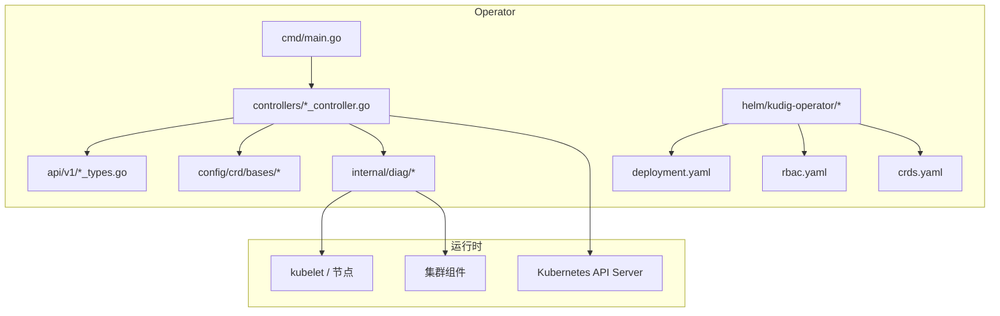
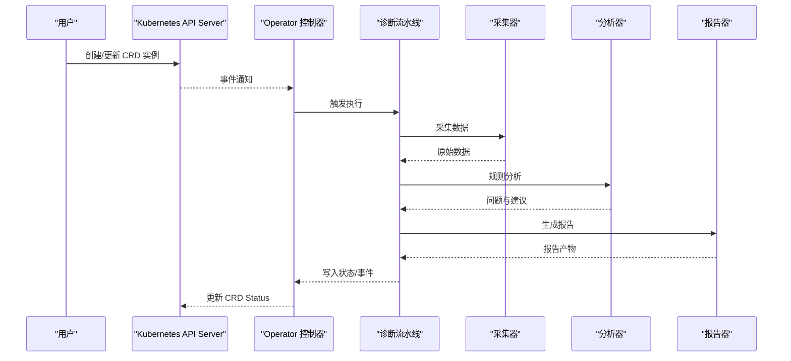
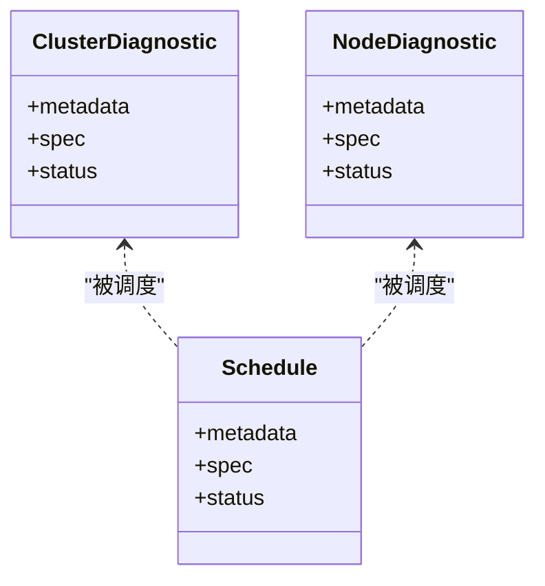
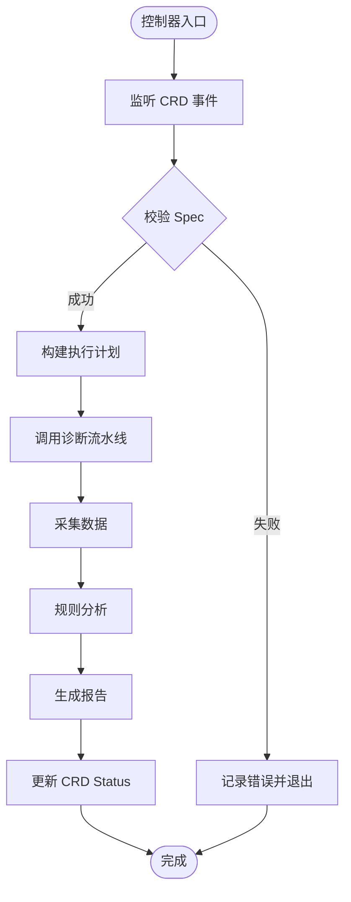
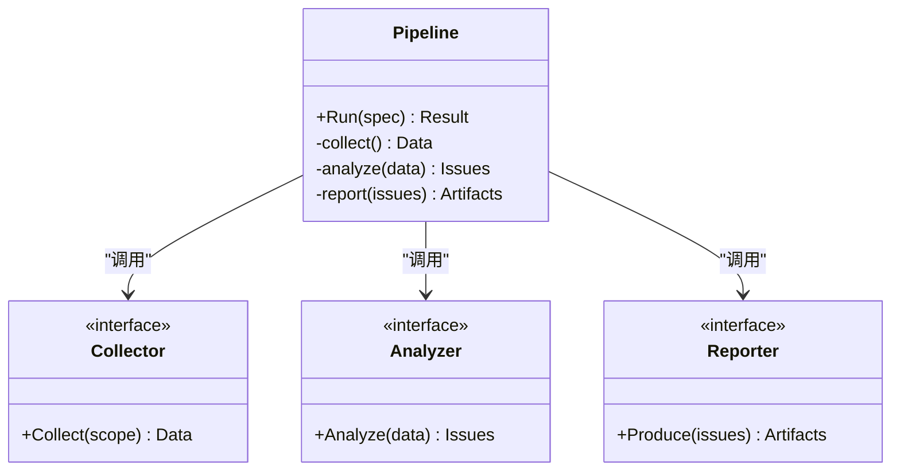
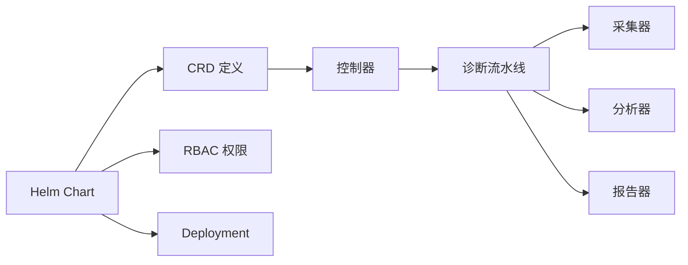

# Operator 部署和管理

<cite>
**本文引用的文件**   
- [operator/cmd/main.go](file://operator/cmd/main.go)
- [operator/api/v1/clusterdiagnostic_types.go](file://operator/api/v1/clusterdiagnostic_types.go)
- [operator/api/v1/nodediagnostic_types.go](file://operator/api/v1/nodediagnostic_types.go)
- [operator/api/v1/schedule_types.go](file://operator/api/v1/schedule_types.go)
- [operator/api/v1/groupversion_info.go](file://operator/api/v1/groupversion_info.go)
- [operator/controllers/clusterdiagnostic_controller.go](file://operator/controllers/clusterdiagnostic_controller.go)
- [operator/controllers/nodediagnostic_controller.go](file://operator/controllers/nodediagnostic_controller.go)
- [operator/controllers/schedule_controller.go](file://operator/controllers/schedule_controller.go)
- [operator/config/crd/bases/...](file://operator/config/crd/bases)
- [operator/config/examples/cluster-diagnostic.yaml](file://operator/config/examples/cluster-diagnostic.yaml)
- [operator/config/examples/node-diagnostic.yaml](file://operator/config/examples/node-diagnostic.yaml)
- [operator/config/examples/schedule.yaml](file://operator/config/examples/schedule.yaml)
- [operator/helm/kudig-operator/templates/deployment.yaml](file://operator/helm/kudig-operator/templates/deployment.yaml)
- [operator/helm/kudig-operator/templates/rbac.yaml](file://operator/helm/kudig-operator/templates/rbac.yaml)
- [operator/helm/kudig-operator/templates/crds.yaml](file://operator/helm/kudig-operator/templates/crds.yaml)
- [operator/helm/kudig-operator/values.yaml](file://operator/helm/kudig-operator/values.yaml)
- [internal/diag/pipeline.go](file://internal/diag/pipeline.go)
- [internal/diag/collector/interface.go](file://internal/diag/collector/interface.go)
- [internal/diag/analyzer/interface.go](file://internal/diag/analyzer/interface.go)
- [internal/diag/reporter/interface.go](file://internal/diag/reporter/interface.go)
- [internal/metrics/collector.go](file://internal/metrics/collector.go)
- [Makefile](file://Makefile)
</cite>

## 目录
1. [简介](#简介)
2. [项目结构](#项目结构)
3. [核心组件](#核心组件)
4. [架构总览](#架构总览)
5. [详细组件分析](#详细组件分析)
6. [依赖关系分析](#依赖关系分析)
7. [性能与扩缩容](#性能与扩缩容)
8. [监控与日志](#监控与日志)
9. [安装与配置](#安装与配置)
10. [故障排查指南](#故障排查指南)
11. [结论](#结论)
12. [附录：CRD 使用示例](#附录crd-使用示例)

## 简介
本指南面向 Kubernetes Operator 的部署与管理，覆盖 Operator 架构图、自定义资源（CRD）定义、控制器实现原理、RBAC 权限、日志收集、监控指标、扩缩容策略以及 ClusterDiagnostic、NodeDiagnostic、Schedule 等 CRD 的使用方法与最佳实践。文档力求在技术深度与可读性之间取得平衡，帮助运维与开发团队快速上手并稳定运行。

## 项目结构
Operator 子工程位于 operator 目录，包含 API 类型定义、控制器实现、Helm Chart、CRD 与示例 YAML。核心业务逻辑由 internal/diag 模块提供诊断流水线与分析器。

图表来源
- [operator/cmd/main.go](file://operator/cmd/main.go)
- [operator/controllers/clusterdiagnostic_controller.go](file://operator/controllers/clusterdiagnostic_controller.go)
- [operator/controllers/nodediagnostic_controller.go](file://operator/controllers/nodediagnostic_controller.go)
- [operator/controllers/schedule_controller.go](file://operator/controllers/schedule_controller.go)
- [operator/api/v1/clusterdiagnostic_types.go](file://operator/api/v1/clusterdiagnostic_types.go)
- [operator/api/v1/nodediagnostic_types.go](file://operator/api/v1/nodediagnostic_types.go)
- [operator/api/v1/schedule_types.go](file://operator/api/v1/schedule_types.go)
- [operator/helm/kudig-operator/templates/deployment.yaml](file://operator/helm/kudig-operator/templates/deployment.yaml)
- [operator/helm/kudig-operator/templates/rbac.yaml](file://operator/helm/kudig-operator/templates/rbac.yaml)
- [operator/helm/kudig-operator/templates/crds.yaml](file://operator/helm/kudig-operator/templates/crds.yaml)

章节来源
- [operator/cmd/main.go](file://operator/cmd/main.go)
- [operator/helm/kudig-operator/templates/deployment.yaml](file://operator/helm/kudig-operator/templates/deployment.yaml)
- [operator/helm/kudig-operator/templates/rbac.yaml](file://operator/helm/kudig-operator/templates/rbac.yaml)
- [operator/helm/kudig-operator/templates/crds.yaml](file://operator/helm/kudig-operator/templates/crds.yaml)

## 核心组件
- API 类型（CRD 定义）：ClusterDiagnostic、NodeDiagnostic、Schedule
- 控制器：ClusterDiagnosticController、NodeDiagnosticController、ScheduleController
- 诊断流水线：采集器、分析器、报告器、规则引擎、历史与通知
- Helm Chart：用于安装 Operator、CRD、RBAC 与 Deployment
- 指标与日志：Prometheus 指标导出、结构化日志输出

章节来源
- [operator/api/v1/clusterdiagnostic_types.go](file://operator/api/v1/clusterdiagnostic_types.go)
- [operator/api/v1/nodediagnostic_types.go](file://operator/api/v1/nodediagnostic_types.go)
- [operator/api/v1/schedule_types.go](file://operator/api/v1/schedule_types.go)
- [operator/controllers/clusterdiagnostic_controller.go](file://operator/controllers/clusterdiagnostic_controller.go)
- [operator/controllers/nodediagnostic_controller.go](file://operator/controllers/nodediagnostic_controller.go)
- [operator/controllers/schedule_controller.go](file://operator/controllers/schedule_controller.go)
- [internal/diag/pipeline.go](file://internal/diag/pipeline.go)

## 架构总览
Operator 通过控制器监听 CRD 事件，驱动内部诊断流水线执行数据采集、分析与报告生成，并将结果写回对象状态或外部系统。

图表来源
- [operator/controllers/clusterdiagnostic_controller.go](file://operator/controllers/clusterdiagnostic_controller.go)
- [operator/controllers/nodediagnostic_controller.go](file://operator/controllers/nodediagnostic_controller.go)
- [operator/controllers/schedule_controller.go](file://operator/controllers/schedule_controller.go)
- [internal/diag/pipeline.go](file://internal/diag/pipeline.go)
- [internal/diag/collector/interface.go](file://internal/diag/collector/interface.go)
- [internal/diag/analyzer/interface.go](file://internal/diag/analyzer/interface.go)
- [internal/diag/reporter/interface.go](file://internal/diag/reporter/interface.go)

## 详细组件分析

### CRD 定义与模型
- ClusterDiagnostic：针对整个集群的诊断任务，支持选择器、采集范围、分析规则、报告格式等配置。
- NodeDiagnostic：针对单节点的诊断任务，支持节点选择、内核/网络/存储等维度采集与分析。
- Schedule：调度 CRD，用于周期性或定时触发 ClusterDiagnostic/NodeDiagnostic 的执行。

图表来源
- [operator/api/v1/clusterdiagnostic_types.go](file://operator/api/v1/clusterdiagnostic_types.go)
- [operator/api/v1/nodediagnostic_types.go](file://operator/api/v1/nodediagnostic_types.go)
- [operator/api/v1/schedule_types.go](file://operator/api/v1/schedule_types.go)

章节来源
- [operator/api/v1/clusterdiagnostic_types.go](file://operator/api/v1/clusterdiagnostic_types.go)
- [operator/api/v1/nodediagnostic_types.go](file://operator/api/v1/nodediagnostic_types.go)
- [operator/api/v1/schedule_types.go](file://operator/api/v1/schedule_types.go)

### 控制器实现原理
- ClusterDiagnosticController：监听 ClusterDiagnostic 变更，编排诊断流水线，管理生命周期与重试策略，更新状态与事件。
- NodeDiagnosticController：监听 NodeDiagnostic 变更，按节点维度执行采集与分析，聚合结果。
- ScheduleController：基于 Cron 表达式或间隔策略，触发目标 CRD 实例执行。

图表来源
- [operator/controllers/clusterdiagnostic_controller.go](file://operator/controllers/clusterdiagnostic_controller.go)
- [operator/controllers/nodediagnostic_controller.go](file://operator/controllers/nodediagnostic_controller.go)
- [operator/controllers/schedule_controller.go](file://operator/controllers/schedule_controller.go)
- [internal/diag/pipeline.go](file://internal/diag/pipeline.go)

章节来源
- [operator/controllers/clusterdiagnostic_controller.go](file://operator/controllers/clusterdiagnostic_controller.go)
- [operator/controllers/nodediagnostic_controller.go](file://operator/controllers/nodediagnostic_controller.go)
- [operator/controllers/schedule_controller.go](file://operator/controllers/schedule_controller.go)

### 诊断流水线与扩展点
- 采集器接口：统一数据采集抽象，支持在线（Kubernetes）与离线（目录）模式。
- 分析器接口：规则引擎加载与执行，支持内核、网络、存储、工作负载、安全等多维度分析。
- 报告器接口：输出多种格式（HTML、JSON、SARIF、Grafana 等）。

图表来源
- [internal/diag/pipeline.go](file://internal/diag/pipeline.go)
- [internal/diag/collector/interface.go](file://internal/diag/collector/interface.go)
- [internal/diag/analyzer/interface.go](file://internal/diag/analyzer/interface.go)
- [internal/diag/reporter/interface.go](file://internal/diag/reporter/interface.go)

章节来源
- [internal/diag/pipeline.go](file://internal/diag/pipeline.go)
- [internal/diag/collector/interface.go](file://internal/diag/collector/interface.go)
- [internal/diag/analyzer/interface.go](file://internal/diag/analyzer/interface.go)
- [internal/diag/reporter/interface.go](file://internal/diag/reporter/interface.go)

## 依赖关系分析
- 控制器依赖 API 类型与 CRD 基础定义，通过 client-go 与 API Server 交互。
- 诊断流水线依赖采集器、分析器、报告器等扩展点，便于按需启用功能。
- Helm Chart 负责安装 CRD、RBAC 与 Deployment，确保权限与资源就绪。

图表来源
- [operator/api/v1/groupversion_info.go](file://operator/api/v1/groupversion_info.go)
- [operator/controllers/clusterdiagnostic_controller.go](file://operator/controllers/clusterdiagnostic_controller.go)
- [operator/controllers/nodediagnostic_controller.go](file://operator/controllers/nodediagnostic_controller.go)
- [operator/controllers/schedule_controller.go](file://operator/controllers/schedule_controller.go)
- [operator/helm/kudig-operator/templates/crds.yaml](file://operator/helm/kudig-operator/templates/crds.yaml)
- [operator/helm/kudig-operator/templates/rbac.yaml](file://operator/helm/kudig-operator/templates/rbac.yaml)
- [operator/helm/kudig-operator/templates/deployment.yaml](file://operator/helm/kudig-operator/templates/deployment.yaml)

章节来源
- [operator/api/v1/groupversion_info.go](file://operator/api/v1/groupversion_info.go)
- [operator/helm/kudig-operator/templates/crds.yaml](file://operator/helm/kudig-operator/templates/crds.yaml)
- [operator/helm/kudig-operator/templates/rbac.yaml](file://operator/helm/kudig-operator/templates/rbac.yaml)
- [operator/helm/kudig-operator/templates/deployment.yaml](file://operator/helm/kudig-operator/templates/deployment.yaml)

## 性能与扩缩容
- 水平扩缩容：通过调整 Deployment 副本数提升并发处理能力；结合队列与限流避免过载。
- 资源配额：为控制器与诊断任务设置合理的 CPU/内存请求与限制，防止资源争用。
- 并行化：按节点或任务粒度并行执行采集与分析，缩短整体耗时。
- 缓存与去重：对频繁读取的资源进行本地缓存，减少 API Server 压力。
- 背压与重试：对失败任务实施指数退避重试，避免雪崩。

[本节为通用指导，不直接分析具体文件]

## 监控与日志
- 指标暴露：通过 metrics 模块导出 Prometheus 指标，包括任务计数、耗时、错误率等。
- 结构化日志：控制器与流水线输出结构化日志，便于集中采集与检索。
- 告警集成：可对接钉钉、飞书等消息通道，将关键事件推送至协作平台。

章节来源
- [internal/metrics/collector.go](file://internal/metrics/collector.go)

## 安装与配置
- 前置条件：具备集群管理员权限、kubectl、Helm 客户端。
- 安装步骤：
  - 使用 Helm 安装 Operator，自动部署 CRD、RBAC 与 Deployment。
  - 验证 Pod 运行状态与控制器日志。
  - 创建示例 CRD 实例以验证功能。
- RBAC 权限：确保 ServiceAccount 具备必要的读/写权限，覆盖 Pods、Nodes、Events、CRD 等资源。
- 配置项：通过 values.yaml 或环境变量调整日志级别、并发度、超时等参数。

章节来源
- [operator/helm/kudig-operator/templates/deployment.yaml](file://operator/helm/kudig-operator/templates/deployment.yaml)
- [operator/helm/kudig-operator/templates/rbac.yaml](file://operator/helm/kudig-operator/templates/rbac.yaml)
- [operator/helm/kudig-operator/templates/crds.yaml](file://operator/helm/kudig-operator/templates/crds.yaml)
- [operator/helm/kudig-operator/values.yaml](file://operator/helm/kudig-operator/values.yaml)

## 故障排查指南
- 常见问题：
  - 控制器无法启动：检查 RBAC 权限、镜像拉取、资源配额。
  - 任务无进展：查看 CRD Status、事件与控制器日志，确认采集器与分析器是否可用。
  - 报告未生成：检查报告器配置与输出路径权限。
- 定位方法：
  - 使用 kubectl describe 查看 CRD 与 Pod 状态。
  - 收集控制器与任务容器日志，关注错误堆栈与超时信息。
  - 检查指标面板，识别异常峰值与错误率。

章节来源
- [operator/controllers/clusterdiagnostic_controller.go](file://operator/controllers/clusterdiagnostic_controller.go)
- [operator/controllers/nodediagnostic_controller.go](file://operator/controllers/nodediagnostic_controller.go)
- [operator/controllers/schedule_controller.go](file://operator/controllers/schedule_controller.go)

## 结论
本指南从架构、组件、安装、监控到排障提供了完整的 Operator 部署与管理方案。通过清晰的 CRD 设计与可扩展的诊断流水线，Operator 能够灵活适配不同集群环境，并提供稳定的诊断能力。建议在生产环境中结合监控与告警体系，持续优化性能与可靠性。

[本节为总结，不直接分析具体文件]

## 附录：CRD 使用示例
- ClusterDiagnostic：定义集群级诊断任务，指定采集范围与分析规则，提交后观察 Status 变化与报告产出。
- NodeDiagnostic：针对特定节点进行诊断，适用于节点性能、内核、网络与存储问题的定位。
- Schedule：配置 Cron 表达式或间隔策略，定期触发诊断任务，形成自动化巡检机制。

章节来源
- [operator/config/examples/cluster-diagnostic.yaml](file://operator/config/examples/cluster-diagnostic.yaml)
- [operator/config/examples/node-diagnostic.yaml](file://operator/config/examples/node-diagnostic.yaml)
- [operator/config/examples/schedule.yaml](file://operator/config/examples/schedule.yaml)