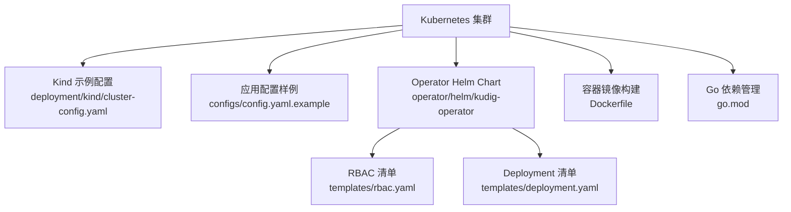
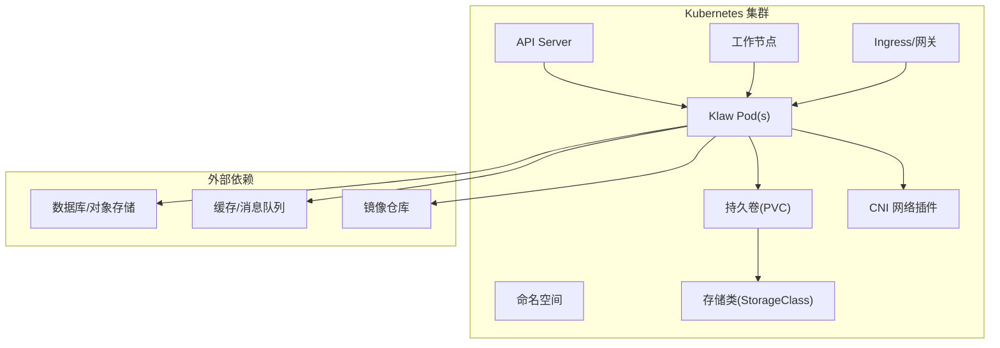
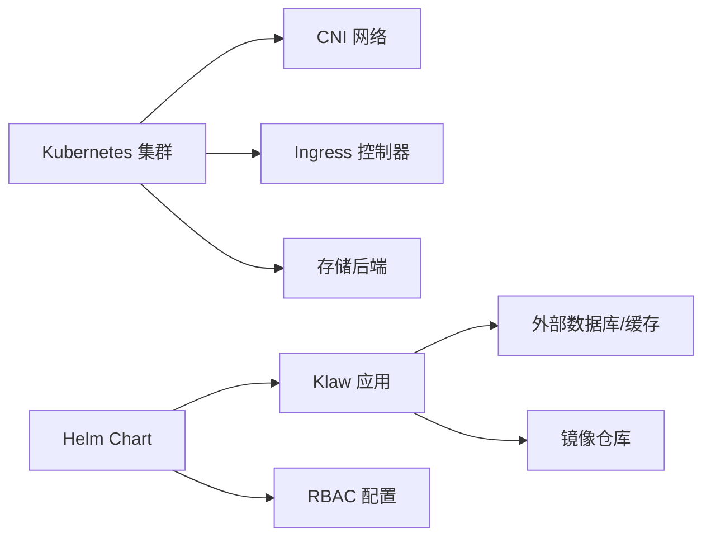

# 环境要求和前置条件

<cite>
**本文引用的文件**   
- [deployment/README.md](file://deployment/README.md)
- [deployment/kind/cluster-config.yaml](file://deployment/kind/cluster-config.yaml)
- [deployment/kind/manage.sh](file://deployment/kind/manage.sh)
- [configs/config.yaml.example](file://configs/config.yaml.example)
- [Dockerfile](file://Dockerfile)
- [go.mod](file://go.mod)
- [operator/helm/kudig-operator/values.yaml](file://operator/helm/kudig-operator/values.yaml)
- [operator/helm/kudig-operator/templates/deployment.yaml](file://operator/helm/kudig-operator/templates/deployment.yaml)
- [operator/helm/kudig-operator/templates/rbac.yaml](file://operator/helm/kudig-operator/templates/rbac.yaml)
</cite>

## 目录
1. [简介](#简介)
2. [项目结构](#项目结构)
3. [核心组件](#核心组件)
4. [架构总览](#架构总览)
5. [详细组件分析](#详细组件分析)
6. [依赖分析](#依赖分析)
7. [性能考虑](#性能考虑)
8. [故障排查指南](#故障排查指南)
9. [结论](#结论)
10. [附录](#附录)

## 简介
本文件面向在 Kubernetes 上部署 Klaw 平台的运维与平台工程团队，明确环境要求、前置条件与最佳实践。内容涵盖：
- Kubernetes 版本与集群资源需求（CPU、内存、存储）
- 网络插件与 CNI 要求
- RBAC 权限配置要点
- 存储类（StorageClass）配置建议
- Docker 与 kubectl 安装指引
- 集群健康检查方法
- 最小化生产环境配置建议
- 高可用集群架构推荐

## 项目结构
Klaw 项目在仓库中提供了多种部署方式与示例配置，便于在不同环境中快速验证与落地：
- deployment/kind：用于本地或测试环境的 Kind 集群示例配置与管理脚本
- configs：应用级配置样例（如 config.yaml.example）
- operator/helm：Operator 的 Helm Chart 模板与默认值，包含 RBAC、Deployment 等关键清单
- Dockerfile：容器镜像构建定义
- go.mod：Go 模块与依赖声明

图表来源 
- [deployment/kind/cluster-config.yaml:1-200](file://deployment/kind/cluster-config.yaml#L1-L200)
- [configs/config.yaml.example:1-200](file://configs/config.yaml.example#L1-L200)
- [operator/helm/kudig-operator/templates/rbac.yaml:1-200](file://operator/helm/kudig-operator/templates/rbac.yaml#L1-L200)
- [operator/helm/kudig-operator/templates/deployment.yaml:1-200](file://operator/helm/kudig-operator/templates/deployment.yaml#L1-L200)
- [Dockerfile:1-200](file://Dockerfile#L1-L200)
- [go.mod:1-200](file://go.mod#L1-L200)

章节来源
- [deployment/README.md:1-200](file://deployment/README.md#L1-L200)
- [deployment/kind/cluster-config.yaml:1-200](file://deployment/kind/cluster-config.yaml#L1-L200)
- [configs/config.yaml.example:1-200](file://configs/config.yaml.example#L1-L200)
- [operator/helm/kudig-operator/values.yaml:1-200](file://operator/helm/kudig-operator/values.yaml#L1-L200)
- [operator/helm/kudig-operator/templates/deployment.yaml:1-200](file://operator/helm/kudig-operator/templates/deployment.yaml#L1-L200)
- [operator/helm/kudig-operator/templates/rbac.yaml:1-200](file://operator/helm/kudig-operator/templates/rbac.yaml#L1-L200)
- [Dockerfile:1-200](file://Dockerfile#L1-L200)
- [go.mod:1-200](file://go.mod#L1-L200)

## 核心组件
- 应用配置：通过配置文件注入运行时参数（例如数据库连接、外部服务地址、功能开关等），详见配置样例文件。
- Operator 与 Helm：使用 Helm Chart 管理 Operator 及 CRD 相关资源的部署，提供 RBAC、Deployment 等模板。
- 容器镜像：基于 Dockerfile 构建应用镜像，确保运行环境与依赖一致。
- 依赖管理：Go 模块依赖由 go.mod 管理，保证可重复构建。

章节来源
- [configs/config.yaml.example:1-200](file://configs/config.yaml.example#L1-L200)
- [operator/helm/kudig-operator/values.yaml:1-200](file://operator/helm/kudig-operator/values.yaml#L1-L200)
- [operator/helm/kudig-operator/templates/deployment.yaml:1-200](file://operator/helm/kudig-operator/templates/deployment.yaml#L1-L200)
- [operator/helm/kudig-operator/templates/rbac.yaml:1-200](file://operator/helm/kudig-operator/templates/rbac.yaml#L1-L200)
- [Dockerfile:1-200](file://Dockerfile#L1-L200)
- [go.mod:1-200](file://go.mod#L1-L200)

## 架构总览
下图展示了 Klaw 在 Kubernetes 中的典型部署拓扑与关键依赖关系。实际部署时，请根据企业现有基础设施调整网络、存储与访问控制策略。

图表来源 
- [operator/helm/kudig-operator/templates/deployment.yaml:1-200](file://operator/helm/kudig-operator/templates/deployment.yaml#L1-L200)
- [operator/helm/kudig-operator/templates/rbac.yaml:1-200](file://operator/helm/kudig-operator/templates/rbac.yaml#L1-L200)
- [configs/config.yaml.example:1-200](file://configs/config.yaml.example#L1-L200)

## 详细组件分析

### Kubernetes 版本与集群资源需求
- 版本要求
  - 推荐使用 Kubernetes 1.20+ 以兼容常见特性与 API 版本。
  - 若使用 Operator 与 CRD，请确认集群已启用相应 API 组并支持所需版本。
- 资源需求（参考）
  - CPU：根据并发与负载规模规划，建议为每个副本预留足够的请求与限制。
  - 内存：依据应用与依赖（数据库、缓存等）的峰值内存占用进行估算。
  - 存储：根据数据持久化需求选择合适容量与 IOPS 的 StorageClass。
- 节点规格建议
  - 控制平面：至少 2 核 4GB，SSD 存储。
  - 工作节点：按副本数与资源请求计算，建议 4 核 8GB 起步，随规模扩展。

章节来源
- [deployment/kind/cluster-config.yaml:1-200](file://deployment/kind/cluster-config.yaml#L1-L200)
- [operator/helm/kudig-operator/values.yaml:1-200](file://operator/helm/kudig-operator/values.yaml#L1-L200)
- [operator/helm/kudig-operator/templates/deployment.yaml:1-200](file://operator/helm/kudig-operator/templates/deployment.yaml#L1-L200)

### 网络插件（CNI）要求
- 必须启用支持 Pod 间通信与 Service 暴露的 CNI（如 Calico、Flannel、Cilium）。
- 如需 Ingress，需部署对应控制器（Nginx、Traefik 等）并确保域名解析可达。
- 若使用 NodePort/LoadBalancer，请确认云厂商或底层网络支持。

章节来源
- [deployment/kind/cluster-config.yaml:1-200](file://deployment/kind/cluster-config.yaml#L1-L200)
- [operator/helm/kudig-operator/templates/deployment.yaml:1-200](file://operator/helm/kudig-operator/templates/deployment.yaml#L1-L200)

### RBAC 权限配置
- 为 Operator 与应用创建专用 ServiceAccount 与 Role/ClusterRole。
- 仅授予必要权限（最小权限原则），避免过度授权。
- 若跨命名空间访问，需使用 ClusterRoleBinding 或跨命名空间的 RoleBinding。

章节来源
- [operator/helm/kudig-operator/templates/rbac.yaml:1-200](file://operator/helm/kudig-operator/templates/rbac.yaml#L1-L200)

### 存储类（StorageClass）配置
- 选择与业务匹配的 StorageClass（如 SSD、高性能 NVMe、云盘等）。
- 为持久化数据准备 PVC，并设置合适的容量与回收策略。
- 若需要快照与备份，确保底层存储支持相应特性。

章节来源
- [operator/helm/kudig-operator/templates/deployment.yaml:1-200](file://operator/helm/kudig-operator/templates/deployment.yaml#L1-L200)
- [configs/config.yaml.example:1-200](file://configs/config.yaml.example#L1-L200)

### 应用配置与环境变量
- 通过配置文件或环境变量注入数据库连接、外部服务地址、功能开关等。
- 建议使用 ConfigMap/Secret 管理敏感信息与非敏感配置。
- 在生产环境开启必要的日志级别与监控指标。

章节来源
- [configs/config.yaml.example:1-200](file://configs/config.yaml.example#L1-L200)

### Docker 与 kubectl 工具安装
- Docker
  - 安装 Docker Engine（Linux/macOS/Windows 均可），确保版本满足镜像构建与推送需求。
  - 配置镜像加速器以提升拉取速度。
- kubectl
  - 安装与集群版本匹配的 kubectl 客户端。
  - 配置 kubeconfig 以访问目标集群。

章节来源
- [Dockerfile:1-200](file://Dockerfile#L1-L200)

### 集群健康检查方法
- 基础检查
  - 查看节点状态与就绪情况
  - 检查系统组件（kubelet、kube-proxy、CoreDNS）是否正常运行
- 应用检查
  - 验证 Pod 状态、事件与日志
  - 检查 Service、Ingress 与网络连通性
  - 验证 PVC 绑定与存储可用性
- 诊断工具
  - 使用 kubectl describe/logs 定位问题
  - 结合集群诊断能力（如内置分析器）进行深度排查

章节来源
- [deployment/kind/manage.sh:1-200](file://deployment/kind/manage.sh#L1-L200)
- [operator/helm/kudig-operator/templates/deployment.yaml:1-200](file://operator/helm/kudig-operator/templates/deployment.yaml#L1-L200)

### 最小化生产环境配置建议
- 单副本启动，合理设置资源请求与限制
- 使用稳定可靠的 StorageClass，并为关键数据启用备份
- 启用基本监控与告警（Prometheus/Grafana 或云监控）
- 配置合理的日志级别与集中式日志收集

章节来源
- [operator/helm/kudig-operator/values.yaml:1-200](file://operator/helm/kudig-operator/values.yaml#L1-L200)
- [configs/config.yaml.example:1-200](file://configs/config.yaml.example#L1-L200)

### 高可用集群架构推荐
- 多控制平面节点（至少 3 个）与 etcd 集群
- 多工作节点分布在不同可用区
- 使用负载均衡器暴露 Ingress，实现流量分发与故障转移
- 数据库与缓存采用主从或集群模式，确保数据冗余与高可用

章节来源
- [deployment/kind/cluster-config.yaml:1-200](file://deployment/kind/cluster-config.yaml#L1-L200)
- [operator/helm/kudig-operator/values.yaml:1-200](file://operator/helm/kudig-operator/values.yaml#L1-L200)

## 依赖分析
Klaw 的部署依赖包括 Kubernetes 集群、CNI、Ingress、存储后端以及可能的数据库/缓存等外部服务。Helm Chart 与配置文件是主要的集成点。

图表来源 
- [operator/helm/kudig-operator/values.yaml:1-200](file://operator/helm/kudig-operator/values.yaml#L1-L200)
- [operator/helm/kudig-operator/templates/deployment.yaml:1-200](file://operator/helm/kudig-operator/templates/deployment.yaml#L1-L200)
- [operator/helm/kudig-operator/templates/rbac.yaml:1-200](file://operator/helm/kudig-operator/templates/rbac.yaml#L1-L200)
- [configs/config.yaml.example:1-200](file://configs/config.yaml.example#L1-L200)

章节来源
- [operator/helm/kudig-operator/values.yaml:1-200](file://operator/helm/kudig-operator/values.yaml#L1-L200)
- [operator/helm/kudig-operator/templates/deployment.yaml:1-200](file://operator/helm/kudig-operator/templates/deployment.yaml#L1-L200)
- [operator/helm/kudig-operator/templates/rbac.yaml:1-200](file://operator/helm/kudig-operator/templates/rbac.yaml#L1-L200)
- [configs/config.yaml.example:1-200](file://configs/config.yaml.example#L1-L200)

## 性能考虑
- 资源配额与限制：为 Pod 设置合理的 requests/limits，避免资源争用。
- 水平扩展：根据负载动态扩缩容，提升吞吐与弹性。
- 存储 I/O：选择低延迟、高吞吐的存储类型，必要时启用本地缓存。
- 网络优化：选择合适的 CNI 与 Ingress 控制器，启用连接复用与缓存。
- 监控与调优：持续采集指标，识别瓶颈并进行针对性优化。

## 故障排查指南
- 常见问题
  - Pod 无法调度：检查资源不足、污点与亲和性配置
  - 网络不通：验证 CNI、Service、Ingress 与防火墙规则
  - 存储挂载失败：确认 StorageClass、PVC 与后端存储状态
  - 权限错误：检查 RBAC 与 ServiceAccount 配置
- 诊断步骤
  - 使用 kubectl describe/logs/events 获取详细信息
  - 检查集群组件状态与事件
  - 使用内置诊断工具或第三方工具进行深度分析

章节来源
- [deployment/kind/manage.sh:1-200](file://deployment/kind/manage.sh#L1-L200)
- [operator/helm/kudig-operator/templates/deployment.yaml:1-200](file://operator/helm/kudig-operator/templates/deployment.yaml#L1-L200)
- [operator/helm/kudig-operator/templates/rbac.yaml:1-200](file://operator/helm/kudig-operator/templates/rbac.yaml#L1-L200)

## 结论
为确保 Klaw 在 Kubernetes 上的稳定运行，需满足明确的版本、资源、网络与存储要求，并通过合理的 RBAC 与配置管理保障安全与可维护性。建议在生产环境采用高可用架构与完善的监控告警体系，持续优化性能与可靠性。

## 附录
- 参考命令（示例）
  - 查看节点与组件状态
  - 检查 Pod、Service、Ingress 与 PVC
  - 查看日志与事件
- 常用工具
  - kubectl、helm、docker
- 参考文档
  - Kubernetes 官方文档
  - 各 CNI 与 Ingress 控制器文档