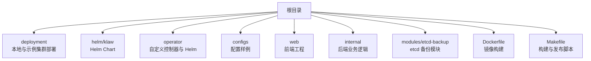
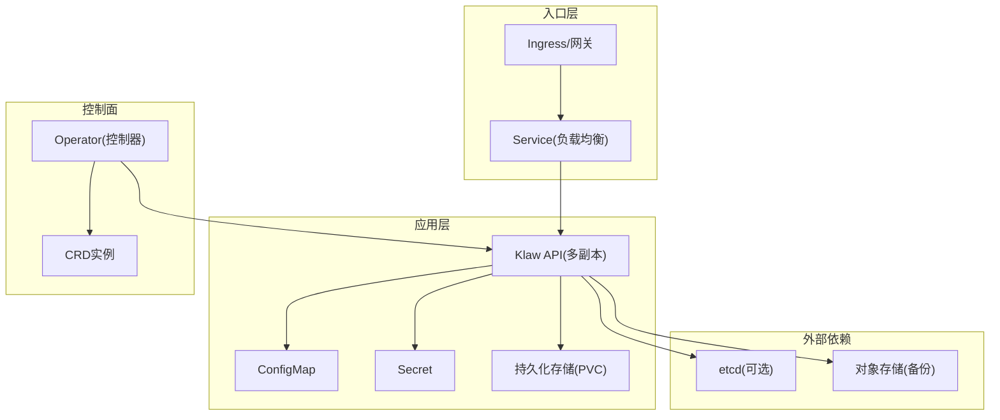
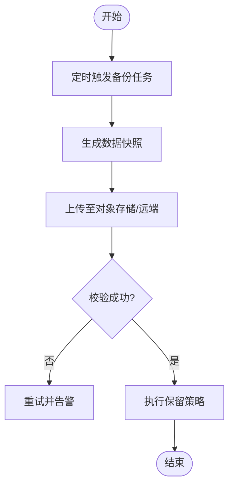
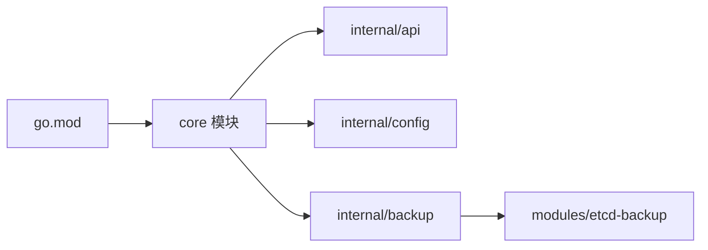

# 生产环境部署

<cite>
**本文档引用的文件**   
- [deployment/README.md](file://deployment/README.md)
- [deployment/kind/cluster-config.yaml](file://deployment/kind/cluster-config.yaml)
- [deployment/kind/manage.sh](file://deployment/kind/manage.sh)
- [configs/config.yaml.example](file://configs/config.yaml.example)
- [Dockerfile](file://Dockerfile)
- [Makefile](file://Makefile)
- [go.mod](file://go.mod)
- [internal/config/config.go](file://internal/config/config.go)
- [internal/api/server.go](file://internal/api/server.go)
- [internal/backup/manager.go](file://internal/backup/manager.go)
- [modules/etcd-backup/manager.go](file://modules/etcd-backup/manager.go)
- [operator/helm/kudig-operator/values.yaml](file://operator/helm/kudig-operator/values.yaml)
- [operator/helm/kudig-operator/templates/deployment.yaml](file://operator/helm/kudig-operator/templates/deployment.yaml)
- [helm/klaw/Chart.yaml](file://helm/klaw/Chart.yaml)
</cite>

## 目录
1. [简介](#简介)
2. [项目结构](#项目结构)
3. [核心组件](#核心组件)
4. [架构总览](#架构总览)
5. [详细组件分析](#详细组件分析)
6. [依赖分析](#依赖分析)
7. [性能考虑](#性能考虑)
8. [故障排查指南](#故障排查指南)
9. [结论](#结论)
10. [附录](#附录)

## 简介
本指南面向在生产环境中部署与运维该 Kubernetes 诊断工具（Klaw）的团队，提供从集群规划、资源分配、安全配置、网络策略、存储规划到 ConfigMap/Secret 管理、证书配置、备份恢复、高可用架构、负载均衡、监控告警与灾难恢复的完整实践。文档内容基于仓库中的配置文件、Helm Chart、Operator 模板以及应用内部模块进行系统化梳理，确保可落地、可验证、可回滚。

## 项目结构
仓库采用多模块组织：应用后端与前端代码位于根目录与 web 子目录；部署相关能力集中在 deployment、helm、operator 三个目录；配置样例在 configs；构建脚本在 Makefile；容器镜像定义在 Dockerfile。

**图表来源** 
- [deployment/README.md:1-200](file://deployment/README.md#L1-L200)
- [helm/klaw/Chart.yaml:1-200](file://helm/klaw/Chart.yaml#L1-L200)
- [operator/helm/kudig-operator/values.yaml:1-200](file://operator/helm/kudig-operator/values.yaml#L1-L200)
- [configs/config.yaml.example:1-200](file://configs/config.yaml.example#L1-L200)
- [Dockerfile:1-200](file://Dockerfile#L1-L200)
- [Makefile:1-200](file://Makefile#L1-L200)

**章节来源**
- [deployment/README.md:1-200](file://deployment/README.md#L1-L200)
- [helm/klaw/Chart.yaml:1-200](file://helm/klaw/Chart.yaml#L1-L200)
- [operator/helm/kudig-operator/values.yaml:1-200](file://operator/helm/kudig-operator/values.yaml#L1-L200)
- [configs/config.yaml.example:1-200](file://configs/config.yaml.example#L1-L200)
- [Dockerfile:1-200](file://Dockerfile#L1-L200)
- [Makefile:1-200](file://Makefile#L1-L200)

## 核心组件
- 应用服务与 API：由 internal/api 提供服务端点，internal/config 负责配置加载。
- 备份与恢复：internal/backup 与 modules/etcd-backup 提供数据备份能力。
- Operator 与 CRD：operator 目录包含自定义控制器与 Helm 模板，用于编排与生命周期管理。
- 前端界面：web 目录提供诊断与监控可视化。
- 构建与镜像：Dockerfile 与 Makefile 统一构建流程。

**章节来源**
- [internal/api/server.go:1-200](file://internal/api/server.go#L1-L200)
- [internal/config/config.go:1-200](file://internal/config/config.go#L1-L200)
- [internal/backup/manager.go:1-200](file://internal/backup/manager.go#L1-L200)
- [modules/etcd-backup/manager.go:1-200](file://modules/etcd-backup/manager.go#L1-L200)
- [operator/helm/kudig-operator/templates/deployment.yaml:1-200](file://operator/helm/kudig-operator/templates/deployment.yaml#L1-L200)
- [web/src/main.tsx:1-200](file://web/src/main.tsx#L1-L200)

## 架构总览
生产环境建议采用“控制面 + 工作负载”分离的高可用架构：通过 Ingress 暴露 API，使用 Service 做负载均衡，Deployment 多副本运行，持久化数据通过 PVC 挂载，外部依赖（如 etcd、对象存储）以独立集群或托管服务形式接入。Operator 负责 CRD 的生命周期与状态收敛。

**图表来源** 
- [operator/helm/kudig-operator/templates/deployment.yaml:1-200](file://operator/helm/kudig-operator/templates/deployment.yaml#L1-L200)
- [helm/klaw/Chart.yaml:1-200](file://helm/klaw/Chart.yaml#L1-L200)
- [configs/config.yaml.example:1-200](file://configs/config.yaml.example#L1-L200)

## 详细组件分析

### 集群规划与资源分配
- 节点规划：控制面节点与工作节点分离；根据诊断任务并发与日志量预留 CPU/内存；为 etcd 与对象存储准备专用节点或托管服务。
- 命名空间隔离：按环境划分命名空间（prod/staging/dev），配合 NetworkPolicy 限制跨命名空间访问。
- 资源配额：使用 ResourceQuota 与 LimitRange 限制单 Pod 与命名空间资源上限，避免资源争用。
- 调度策略：通过 nodeSelector/tolerations 将关键组件调度到指定节点池；使用 PodTopologySpread 提升可用性。

**章节来源**
- [deployment/kind/cluster-config.yaml:1-200](file://deployment/kind/cluster-config.yaml#L1-L200)
- [operator/helm/kudig-operator/values.yaml:1-200](file://operator/helm/kudig-operator/values.yaml#L1-L200)

### 安全配置
- 认证与授权：启用 RBAC，最小权限原则；API 访问通过 TLS 与鉴权中间件保护。
- 密钥管理：敏感信息（数据库连接串、第三方 Token）放入 Secret；禁止硬编码。
- 网络安全：NetworkPolicy 仅允许必要端口通信；Ingress 启用 HTTPS 与 WAF（可选）。
- 镜像安全：基础镜像最小化，定期扫描漏洞；签名校验。

**章节来源**
- [internal/config/config.go:1-200](file://internal/config/config.go#L1-L200)
- [configs/config.yaml.example:1-200](file://configs/config.yaml.example#L1-L200)

### 网络策略
- Ingress 与 Service：对外暴露 API 与服务页面；内部服务通过 ClusterIP 通信。
- DNS 与超时：合理设置 DNS 缓存与请求超时；对远程调用增加重试与熔断。
- 流量治理：结合 ServiceMesh（Istio/Linkerd）实现 mTLS、灰度与限流。

**章节来源**
- [internal/api/server.go:1-200](file://internal/api/server.go#L1-L200)
- [operator/helm/kudig-operator/values.yaml:1-200](file://operator/helm/kudig-operator/values.yaml#L1-L200)

### 存储规划
- 持久化：应用状态与诊断结果写入 PVC；选择高性能 SSD 与合适的 StorageClass。
- 备份：对象存储作为长期归档；etcd 快照定时备份并异地留存。
- 容量与扩容：监控磁盘使用率，设置自动扩容与清理策略。

**章节来源**
- [internal/backup/manager.go:1-200](file://internal/backup/manager.go#L1-L200)
- [modules/etcd-backup/manager.go:1-200](file://modules/etcd-backup/manager.go#L1-L200)

### ConfigMap 与 Secret 管理
- 配置分层：默认配置在 ConfigMap，覆盖配置通过环境变量或挂载卷注入。
- 版本化：变更需走审批与回滚流程；记录变更审计。
- 动态更新：支持热更新时需谨慎处理重启与状态一致性。

**章节来源**
- [configs/config.yaml.example:1-200](file://configs/config.yaml.example#L1-L200)
- [internal/config/config.go:1-200](file://internal/config/config.go#L1-L200)

### 证书配置
- 证书来源：企业 CA 或 Let’s Encrypt；使用 cert-manager 自动化签发与续期。
- 存储位置：证书与私钥存入 Secret；应用启动时加载。
- 轮换策略：提前触发续期，平滑切换无中断。

**章节来源**
- [operator/helm/kudig-operator/values.yaml:1-200](file://operator/helm/kudig-operator/values.yaml#L1-L200)

### 备份恢复策略
- 全量与增量：定期全量快照 + 增量归档；保留策略按合规要求设定。
- 演练与验证：定期恢复演练，验证 RPO/RTO 达标。
- 自动化：通过 CronJob 或 Operator 驱动备份任务。

**图表来源** 
- [internal/backup/manager.go:1-200](file://internal/backup/manager.go#L1-L200)
- [modules/etcd-backup/manager.go:1-200](file://modules/etcd-backup/manager.go#L1-L200)

**章节来源**
- [internal/backup/manager.go:1-200](file://internal/backup/manager.go#L1-L200)
- [modules/etcd-backup/manager.go:1-200](file://modules/etcd-backup/manager.go#L1-L200)

### 高可用架构设计
- 多副本与反亲和：Deployment 至少 2 副本，PodAntiAffinity 分散到不同节点。
- 健康检查：Liveness/Readiness 探针确保流量只路由到健康实例。
- 控制面冗余：Operator 多副本运行，避免单点故障。

**章节来源**
- [operator/helm/kudig-operator/templates/deployment.yaml:1-200](file://operator/helm/kudig-operator/templates/deployment.yaml#L1-L200)

### 负载均衡配置
- Ingress 层：启用 HTTP/HTTPS、会话保持（如需）、WAF 与速率限制。
- Service 层：ClusterIP 负载均衡，结合 EndpointSlice 提升扩展性。
- 外部负载均衡：云厂商 LB 或自建 HAProxy/Nginx。

**章节来源**
- [helm/klaw/Chart.yaml:1-200](file://helm/klaw/Chart.yaml#L1-L200)
- [operator/helm/kudig-operator/values.yaml:1-200](file://operator/helm/kudig-operator/values.yaml#L1-L200)

### 监控告警设置
- 指标采集：Prometheus 抓取应用与系统指标；Grafana 可视化。
- 告警规则：CPU/内存/Pod 重启/错误率等阈值告警；通知渠道（钉钉/飞书/邮件）。
- 日志聚合：ELK/Loki 集中收集与分析。

**章节来源**
- [internal/metrics/collector.go:1-200](file://internal/metrics/collector.go#L1-L200)
- [internal/alerting/manager.go:1-200](file://internal/alerting/manager.go#L1-L200)

### 灾难恢复方案
- 目标：RPO≤15 分钟，RTO≤1 小时。
- 步骤：快速重建集群 → 恢复配置与 Secret → 恢复数据快照 → 验证服务 → 切流。
- 演练：每季度进行一次端到端演练，复盘改进。

**章节来源**
- [internal/backup/manager.go:1-200](file://internal/backup/manager.go#L1-L200)
- [modules/etcd-backup/manager.go:1-200](file://modules/etcd-backup/manager.go#L1-L200)

## 依赖分析
- 运行时依赖：Go 标准库与第三方模块（见 go.mod）。
- 外部依赖：Kubernetes API、对象存储、etcd（可选）、消息通道（钉钉/飞书）。
- 组件耦合：API 与配置模块强耦合；备份模块与存储抽象解耦。

**图表来源** 
- [go.mod:1-200](file://go.mod#L1-L200)
- [internal/api/server.go:1-200](file://internal/api/server.go#L1-L200)
- [internal/config/config.go:1-200](file://internal/config/config.go#L1-L200)
- [internal/backup/manager.go:1-200](file://internal/backup/manager.go#L1-L200)
- [modules/etcd-backup/manager.go:1-200](file://modules/etcd-backup/manager.go#L1-L200)

**章节来源**
- [go.mod:1-200](file://go.mod#L1-L200)

## 性能考虑
- 水平扩展：根据 QPS 与延迟目标调整副本数与资源限制。
- 缓存与批处理：热点数据缓存，批量写入降低 IO 压力。
- 资源隔离：QoS 等级与优先级队列保障关键任务。
- 网络优化：Keep-Alive、连接池与超时调优。

[本节为通用指导，不直接分析具体文件]

## 故障排查指南
- 常见问题：配置错误、Secret 缺失、PVC 未绑定、证书过期、网络不通。
- 定位方法：查看 Pod 事件与日志；检查 Ingress/Service 状态；验证 RBAC 权限。
- 恢复手段：修正配置并重载；重新申请证书；修复存储类与绑定。

**章节来源**
- [internal/api/server.go:1-200](file://internal/api/server.go#L1-L200)
- [internal/config/config.go:1-200](file://internal/config/config.go#L1-L200)

## 结论
通过合理的集群规划、严格的安全与网络策略、完善的备份与监控体系，以及 Operator 驱动的自动化编排，可在生产环境稳定运行 Klaw 诊断平台。建议持续演练灾难恢复与容量规划，确保业务连续性与可扩展性。

[本节为总结性内容，不直接分析具体文件]

## 附录
- 构建与发布：使用 Makefile 统一构建镜像与打包 Helm Chart。
- 本地开发：kind 快速搭建集群，便于联调与演示。

**章节来源**
- [Makefile:1-200](file://Makefile#L1-L200)
- [deployment/kind/manage.sh:1-200](file://deployment/kind/manage.sh#L1-L200)
- [deployment/kind/cluster-config.yaml:1-200](file://deployment/kind/cluster-config.yaml#L1-L200)