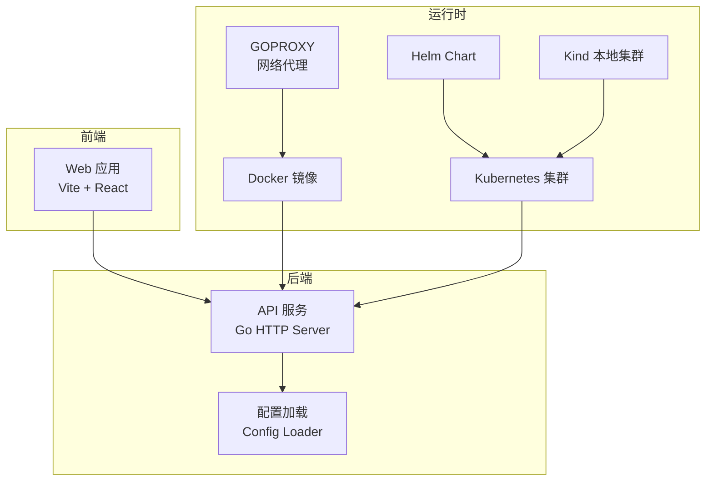
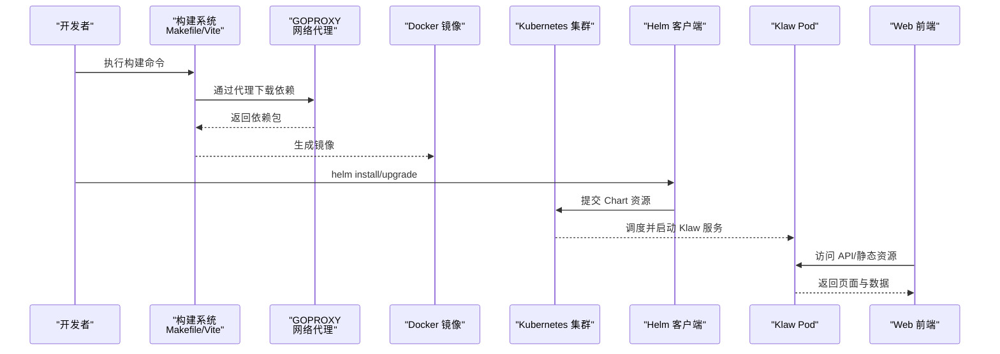
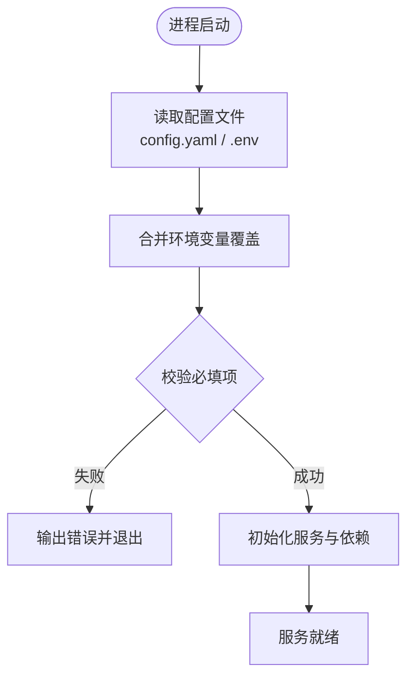
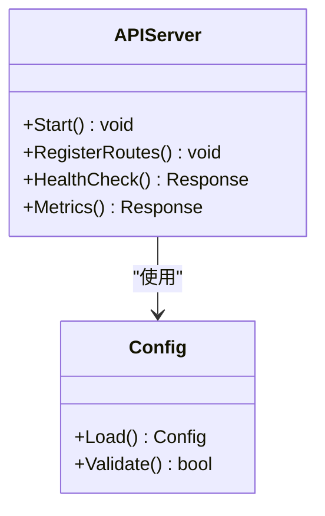
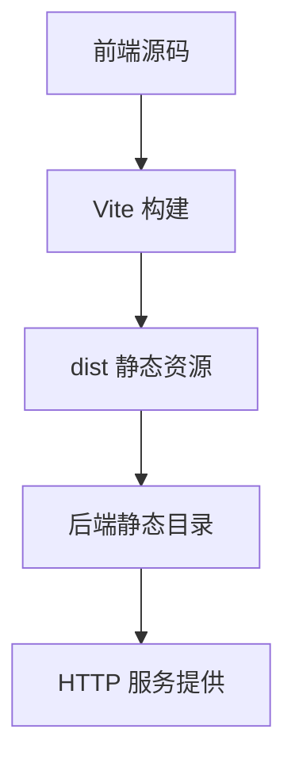
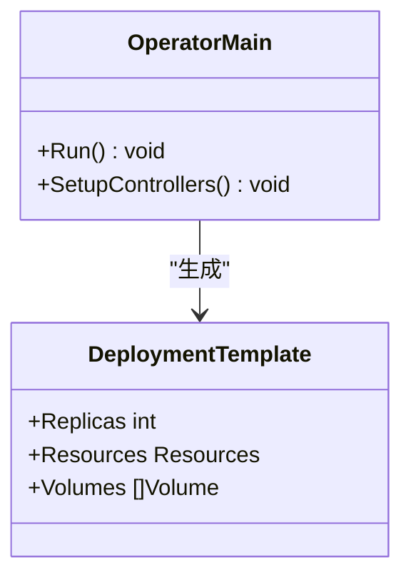
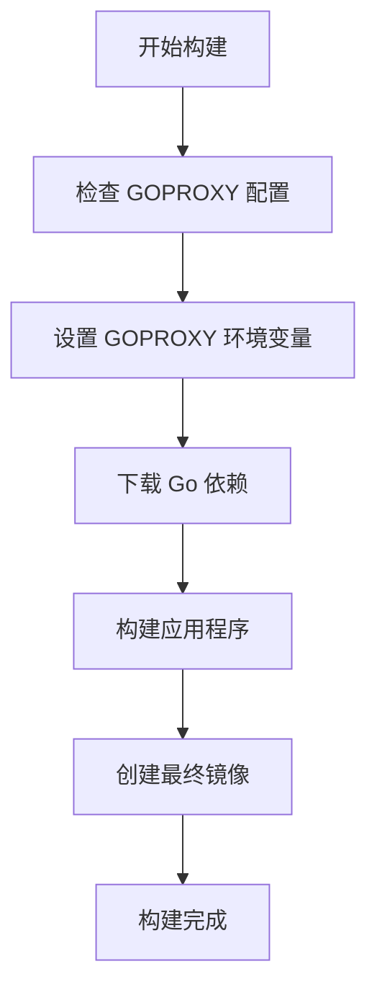
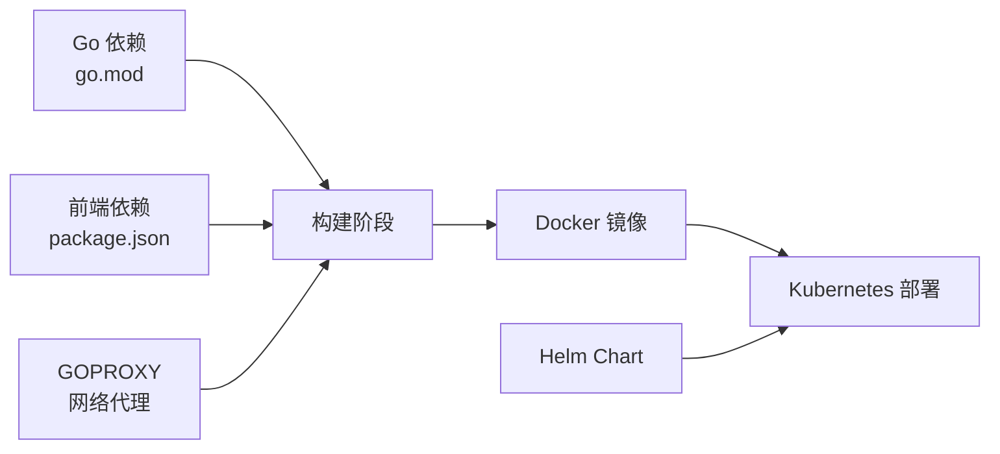

# 安装部署

<cite>
**本文引用的文件**   
- [Dockerfile](file://Dockerfile)
- [Makefile](file://Makefile)
- [go.mod](file://go.mod)
- [configs/config.yaml](file://configs/config.yaml)
- [configs/config.yaml.example](file://configs/config.yaml.example)
- [internal/config/config.go](file://internal/config/config.go)
- [internal/api/server.go](file://internal/api/server.go)
- [deployment/README.md](file://deployment/README.md)
- [deployment/kind/cluster-config.yaml](file://deployment/kind/cluster-config.yaml)
- [deployment/kind/manage.sh](file://deployment/kind/manage.sh)
- [helm/klaw/Chart.yaml](file://helm/klaw/Chart.yaml)
- [operator/helm/kudig-operator/Chart.yaml](file://operator/helm/kudig-operator/Chart.yaml)
- [operator/helm/kudig-operator/templates/deployment.yaml](file://operator/helm/kudig-operator/templates/deployment.yaml)
- [operator/cmd/main.go](file://operator/cmd/main.go)
- [web/package.json](file://web/package.json)
- [web/vite.config.ts](file://web/vite.config.ts)
</cite>

## 更新摘要
**变更内容**   
- 增强了网络受限环境支持，新增GOPROXY配置选项
- 完善了Kind本地集群部署指南和脚本
- 优化了Docker镜像构建流程，支持代理配置
- 更新了部署文档中的网络配置说明

## 目录
1. [简介](#简介)
2. [项目结构](#项目结构)
3. [核心组件](#核心组件)
4. [架构总览](#架构总览)
5. [详细组件分析](#详细组件分析)
6. [依赖分析](#依赖分析)
7. [性能考虑](#性能考虑)
8. [故障排查指南](#故障排查指南)
9. [结论](#结论)
10. [附录](#附录)

## 简介
本文件提供 Klaw 平台的完整安装与部署指南，覆盖本地开发、Docker 容器化、Kubernetes 集群与 Helm Chart 等多种部署方式。内容包含环境准备、依赖配置、参数调优以及生产最佳实践，并给出不同场景的配置文件示例路径与常见问题排查方法。**特别增强了对网络受限环境的支持，通过GOPROXY配置优化构建流程。**

## 项目结构
Klaw 由后端 Go 服务、前端 Web 应用、Operator（可选）以及多种部署脚本与模板组成：
- 后端服务：Go 模块，API 入口在 internal/api，配置加载在 internal/config
- 前端应用：基于 Vite + React，构建产物通过后端静态资源或反向代理发布
- Operator：用于管理诊断等自定义资源的控制器
- 部署相关：Dockerfile、Helm Chart、Kind 脚本、Makefile 等



图表来源
- [internal/api/server.go:1-200](file://internal/api/server.go#L1-L200)
- [internal/config/config.go:1-200](file://internal/config/config.go#L1-L200)
- [Dockerfile:1-200](file://Dockerfile#L1-L200)
- [helm/klaw/Chart.yaml:1-200](file://helm/klaw/Chart.yaml#L1-L200)
- [deployment/kind/cluster-config.yaml:1-200](file://deployment/kind/cluster-config.yaml#L1-L200)

章节来源
- [Makefile:1-200](file://Makefile#L1-L200)
- [go.mod:1-200](file://go.mod#L1-L200)
- [web/package.json:1-200](file://web/package.json#L1-L200)
- [web/vite.config.ts:1-200](file://web/vite.config.ts#L1-L200)

## 核心组件
- 配置系统：统一从配置文件与环境变量加载，支持多环境切换与热更新
- API 服务：HTTP 服务器暴露 RESTful 接口，承载平台核心功能
- 前端构建：Vite 构建静态资源，可被后端直接托管或通过 Nginx/Caddy 反向代理
- Operator（可选）：管理 ClusterDiagnostic、NodeDiagnostic、Schedule 等 CRD
- 部署工具：Dockerfile、Helm Chart、Kind 脚本、Makefile 目标
- **网络代理支持：GOPROXY配置，支持网络受限环境构建**

章节来源
- [internal/config/config.go:1-200](file://internal/config/config.go#L1-L200)
- [internal/api/server.go:1-200](file://internal/api/server.go#L1-L200)
- [web/package.json:1-200](file://web/package.json#L1-L200)
- [web/vite.config.ts:1-200](file://web/vite.config.ts#L1-L200)
- [operator/cmd/main.go:1-200](file://operator/cmd/main.go#L1-L200)
- [Dockerfile:23-25](file://Dockerfile#L23-L25)

## 架构总览
下图展示 Klaw 在不同部署形态下的整体交互关系：本地开发、Docker 镜像、Kubernetes 与 Helm 的安装流程，**包括网络代理支持**。



图表来源
- [Makefile:1-200](file://Makefile#L1-L200)
- [web/vite.config.ts:1-200](file://web/vite.config.ts#L1-L200)
- [Dockerfile:23-25](file://Dockerfile#L23-L25)
- [helm/klaw/Chart.yaml:1-200](file://helm/klaw/Chart.yaml#L1-L200)

## 详细组件分析

### 配置系统与参数说明
- 配置文件位置：configs/config.yaml 与 configs/config.yaml.example
- 配置加载逻辑：internal/config/config.go
- 关键参数类别：服务监听端口、日志级别、存储路径、外部集成（如消息通知）、安全选项等
- 环境变量覆盖：支持以环境变量形式覆盖配置项，便于不同环境差异化部署



图表来源
- [internal/config/config.go:1-200](file://internal/config/config.go#L1-L200)
- [configs/config.yaml:1-200](file://configs/config.yaml#L1-L200)
- [configs/config.yaml.example:1-200](file://configs/config.yaml.example#L1-L200)

章节来源
- [internal/config/config.go:1-200](file://internal/config/config.go#L1-L200)
- [configs/config.yaml:1-200](file://configs/config.yaml#L1-L200)
- [configs/config.yaml.example:1-200](file://configs/config.yaml.example#L1-L200)

### API 服务与路由
- 入口文件：internal/api/server.go
- 职责：注册路由、中间件、健康检查、指标暴露等
- 典型端点：RESTful 接口、诊断、备份、告警、租户管理等



图表来源
- [internal/api/server.go:1-200](file://internal/api/server.go#L1-L200)
- [internal/config/config.go:1-200](file://internal/config/config.go#L1-L200)

章节来源
- [internal/api/server.go:1-200](file://internal/api/server.go#L1-L200)

### 前端构建与集成
- 构建工具：Vite（web/vite.config.ts）
- 包管理：npm/yarn（web/package.json）
- 集成方式：后端直接托管静态资源或通过 Nginx/Caddy 反向代理



图表来源
- [web/vite.config.ts:1-200](file://web/vite.config.ts#L1-L200)
- [web/package.json:1-200](file://web/package.json#L1-L200)

章节来源
- [web/vite.config.ts:1-200](file://web/vite.config.ts#L1-L200)
- [web/package.json:1-200](file://web/package.json#L1-L200)

### Operator（可选）
- 控制器入口：operator/cmd/main.go
- Helm 模板：operator/helm/kudig-operator/templates/deployment.yaml
- CRD 类型：ClusterDiagnostic、NodeDiagnostic、Schedule



图表来源
- [operator/cmd/main.go:1-200](file://operator/cmd/main.go#L1-L200)
- [operator/helm/kudig-operator/templates/deployment.yaml:1-200](file://operator/helm/kudig-operator/templates/deployment.yaml#L1-L200)

章节来源
- [operator/cmd/main.go:1-200](file://operator/cmd/main.go#L1-L200)
- [operator/helm/kudig-operator/Chart.yaml:1-200](file://operator/helm/kudig-operator/Chart.yaml#L1-L200)
- [operator/helm/kudig-operator/values.yaml:1-200](file://operator/helm/kudig-operator/values.yaml#L1-L200)
- [operator/helm/kudig-operator/templates/deployment.yaml:1-200](file://operator/helm/kudig-operator/templates/deployment.yaml#L1-L200)

### Docker 镜像构建与 GOPROXY 支持
**新增功能**：Docker 镜像构建现在支持 GOPROXY 配置，适用于网络受限环境。

- 默认 GOPROXY：`https://proxy.golang.org,direct`
- 自定义代理：通过 `--build-arg GOPROXY=<your-proxy>` 指定
- 国内代理推荐：`https://goproxy.cn,direct`



图表来源
- [Dockerfile:23-25](file://Dockerfile#L23-L25)
- [Dockerfile:30-31](file://Dockerfile#L30-L31)

章节来源
- [Dockerfile:23-25](file://Dockerfile#L23-L25)
- [Dockerfile:30-31](file://Dockerfile#L30-L31)

## 依赖分析
- Go 模块依赖：go.mod
- 前端依赖：web/package.json
- 构建与打包：Makefile、Dockerfile
- 部署模板：helm/klaw 与 operator/helm/kudig-operator
- **网络依赖：GOPROXY 配置，支持代理加速**



图表来源
- [go.mod:1-200](file://go.mod#L1-L200)
- [web/package.json:1-200](file://web/package.json#L1-L200)
- [Makefile:1-200](file://Makefile#L1-L200)
- [Dockerfile:23-25](file://Dockerfile#L23-L25)
- [helm/klaw/Chart.yaml:1-200](file://helm/klaw/Chart.yaml#L1-L200)

章节来源
- [go.mod:1-200](file://go.mod#L1-L200)
- [web/package.json:1-200](file://web/package.json#L1-L200)
- [Makefile:1-200](file://Makefile#L1-L200)
- [Dockerfile:23-25](file://Dockerfile#L23-L25)
- [helm/klaw/Chart.yaml:1-200](file://helm/klaw/Chart.yaml#L1-L200)

## 性能考虑
- 资源配置：为 Pod 设置合理的 CPU/Memory 请求与限制，避免争用
- 水平扩展：根据 QPS 与延迟指标调整副本数与自动扩缩容策略
- 缓存与连接池：合理配置数据库与外部服务的连接池大小与超时
- 日志与监控：降低日志级别至 Info/Warn，启用结构化日志；接入 Prometheus/Grafana
- 静态资源优化：启用 Gzip/Brotli 压缩，CDN 加速前端资源
- **网络优化：配置合适的 GOPROXY 加速依赖下载，减少构建时间**

[本节为通用指导，不直接分析具体文件]

## 故障排查指南
- 启动失败
  - 检查配置文件语法与必填项是否齐全
  - 确认环境变量未冲突或未遗漏
  - 查看服务日志定位错误堆栈
- 网络不通
  - 验证 Service/Ingress 配置与端口映射
  - 检查防火墙与安全组规则
  - 使用 kubectl describe/pod logs 排查
- 资源不足
  - 调整 Requests/Limits 与 HPA 策略
  - 观察节点资源使用率与事件
- 前端无法访问
  - 确认静态资源路径与代理配置
  - 检查浏览器控制台与后端 CORS 设置
- **构建失败（网络问题）**
  - 检查 GOPROXY 配置是否正确
  - 验证网络连接和代理可达性
  - 尝试更换代理地址或使用直连模式

章节来源
- [internal/config/config.go:1-200](file://internal/config/config.go#L1-L200)
- [internal/api/server.go:1-200](file://internal/api/server.go#L1-L200)
- [deployment/README.md:1-200](file://deployment/README.md#L1-L200)
- [Dockerfile:23-25](file://Dockerfile#L23-L25)

## 结论
Klaw 平台提供了灵活的部署能力，涵盖本地开发到生产环境的多种方案。通过统一的配置系统与完善的部署模板，能够快速搭建稳定可靠的运行环境。**新增的 GOPROXY 支持使得在网络受限环境中也能高效构建和部署。**建议在生产环境中采用 Kubernetes + Helm 的方式，并结合监控与自动化运维提升稳定性与可观测性。

[本节为总结性内容，不直接分析具体文件]

## 附录

### 环境准备
- 基础环境
  - Go 版本：参考 go.mod 指定版本
  - Node.js 版本：参考 web/package.json 指定版本
  - Docker：用于构建镜像与本地运行
  - Kubernetes：用于集群部署（v1.24+ 推荐）
  - Helm：用于 Chart 安装与管理
- 依赖安装
  - 后端依赖：go mod tidy
  - 前端依赖：cd web && npm install
- **网络代理配置（可选）**
  - 设置 GOPROXY 环境变量：`export GOPROXY=https://goproxy.cn,direct`
  - 或在构建时通过 --build-arg 指定

章节来源
- [go.mod:1-200](file://go.mod#L1-L200)
- [web/package.json:1-200](file://web/package.json#L1-L200)
- [Dockerfile:23-25](file://Dockerfile#L23-L25)

### 本地开发环境
- 启动后端
  - 使用 Makefile 目标或直接运行二进制
  - 配置文件位于 configs/config.yaml
- 启动前端
  - cd web && npm run dev
  - 默认监听本地端口，可通过 vite.config.ts 修改
- 调试技巧
  - 使用 IDE 断点调试
  - 开启详细日志与追踪

章节来源
- [Makefile:1-200](file://Makefile#L1-L200)
- [web/vite.config.ts:1-200](file://web/vite.config.ts#L1-L200)
- [configs/config.yaml:1-200](file://configs/config.yaml#L1-L200)

### Docker 容器化部署
- 构建镜像
  - 使用 Dockerfile 构建多阶段镜像
  - 优化镜像体积与层缓存
  - **支持 GOPROXY 配置用于网络受限环境**
- 运行容器
  - 挂载配置文件与数据卷
  - 设置环境变量覆盖配置
- 健康检查
  - 配置 liveness/readiness 探针

**新增 GOPROXY 支持**：
```bash
# 使用国内代理加速构建
docker build --build-arg GOPROXY=https://goproxy.cn,direct -t kudig-io/klaw:dev .

# 使用默认代理
docker build -t kudig-io/klaw:dev .
```

章节来源
- [Dockerfile:23-25](file://Dockerfile#L23-L25)
- [Dockerfile:30-31](file://Dockerfile#L30-L31)
- [internal/config/config.go:1-200](file://internal/config/config.go#L1-L200)

### Kind 本地集群部署
**新增完整指南**：提供详细的 Kind 本地集群部署流程和脚本支持。

- 前置依赖
  - Docker、Kind、kubectl
  - 推荐使用 macOS Homebrew 安装
- 快速开始
  - 检查依赖：`./deployment/kind/manage.sh check`
  - 创建集群：`./deployment/kind/manage.sh create`
  - 部署测试应用：`./deployment/kind/manage.sh deploy-sample`
- 集群配置
  - 1个控制平面节点 + 2个工作节点
  - 端口映射：80->8081, 443->8443
  - 持久化数据目录：deployment/kind/data

**完整的集群管理脚本功能**：
```bash
./deployment/kind/manage.sh create          # 创建集群
./deployment/kind/manage.sh delete          # 删除集群  
./deployment/kind/manage.sh status          # 查看集群状态
./deployment/kind/manage.sh export-config   # 导出 kubeconfig
./deployment/kind/manage.sh deploy-sample   # 部署测试应用
./deployment/kind/manage.sh load-image <镜像>  # 加载本地镜像
./deployment/kind/manage.sh install-tools   # 安装 metrics-server
./deployment/kind/manage.sh check           # 检查依赖
```

章节来源
- [deployment/README.md:1-200](file://deployment/README.md#L1-L200)
- [deployment/kind/cluster-config.yaml:1-200](file://deployment/kind/cluster-config.yaml#L1-L200)
- [deployment/kind/manage.sh:1-200](file://deployment/kind/manage.sh#L1-L200)

### Kubernetes 集群部署
- 创建集群
  - 使用 Kind 快速搭建本地集群
  - 或使用云厂商托管集群
- 部署应用
  - 直接应用 YAML 或使用 Helm
  - 配置 Ingress/Service
- 持久化与存储
  - 配置 PVC 与 StorageClass
  - 备份策略与恢复演练

章节来源
- [deployment/kind/cluster-config.yaml:1-200](file://deployment/kind/cluster-config.yaml#L1-L200)
- [deployment/kind/manage.sh:1-200](file://deployment/kind/manage.sh#L1-L200)
- [deployment/README.md:1-200](file://deployment/README.md#L1-L200)

### Helm Chart 安装
- 安装 Klaw
  - helm install klaw ./helm/klaw --namespace klaw --create-namespace
- 升级与回滚
  - helm upgrade/rollback 管理版本
- 值覆盖
  - 通过 values.yaml 或 --set 参数定制部署

章节来源
- [helm/klaw/Chart.yaml:1-200](file://helm/klaw/Chart.yaml#L1-L200)

### 参数调优与生产最佳实践
- 资源配额
  - 设置合理的 Requests/Limits
  - 启用 Vertical Pod Autoscaler
- 安全加固
  - 启用 TLS 与认证
  - 最小权限原则与 RBAC
- 可观测性
  - 接入日志收集与链路追踪
  - 配置告警与仪表盘
- 高可用
  - 多副本与跨可用区部署
  - 数据备份与灾难恢复
- **网络优化**
  - 配置合适的 GOPROXY 加速构建
  - 设置镜像仓库镜像加速
  - 优化网络延迟和带宽

[本节为通用指导，不直接分析具体文件]

### 配置文件示例
- 后端配置
  - 参考 configs/config.yaml.example 进行定制
- 前端配置
  - 参考 web/vite.config.ts 调整构建与代理
- Helm 值
  - 参考 helm/klaw/values.yaml 与 operator/helm/kudig-operator/values.yaml

章节来源
- [configs/config.yaml.example:1-200](file://configs/config.yaml.example#L1-L200)
- [web/vite.config.ts:1-200](file://web/vite.config.ts#L1-L200)

### 网络受限环境部署指南
**新增功能**：专门针对网络受限环境的部署优化。

- GOPROXY 配置
  - 国内代理：`https://goproxy.cn,direct`
  - 企业代理：配置公司内部的 Go 模块代理
  - 环境变量：`export GOPROXY=<your-proxy>`
- 镜像预拉取
  - 使用镜像加速器预拉取基础镜像
  - 通过 `kind load docker-image` 导入到集群
- 构建优化
  - 使用 `--build-arg GOPROXY=` 指定代理
  - 利用 Docker 层缓存加速重复构建

**推荐的代理配置**：
```bash
# 设置全局 GOPROXY
export GOPROXY=https://goproxy.cn,direct

# 构建时使用代理
docker build --build-arg GOPROXY=https://goproxy.cn,direct -t klaw:dev .

# 在 CI/CD 中配置
ENV GOPROXY=https://goproxy.cn,direct
```

章节来源
- [Dockerfile:23-25](file://Dockerfile#L23-L25)
- [deployment/README.md:108-109](file://deployment/README.md#L108-L109)