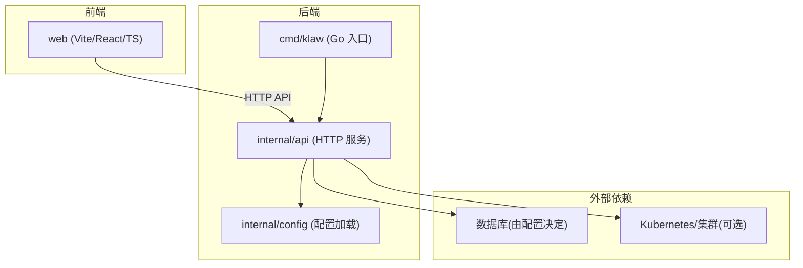
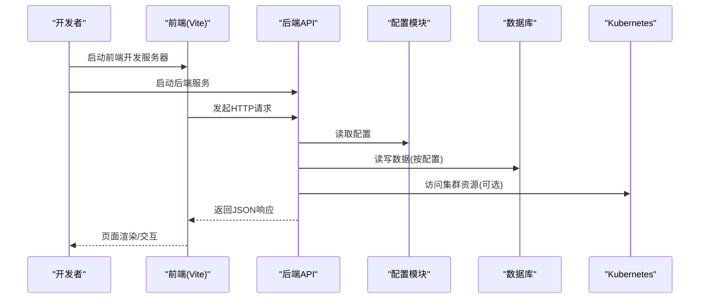
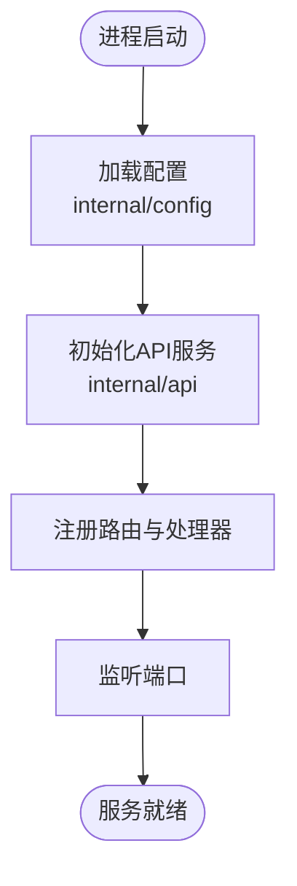
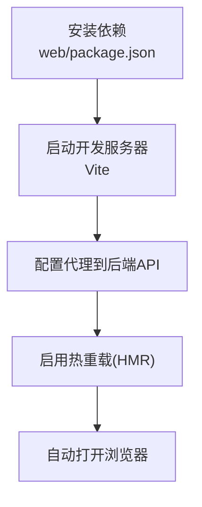
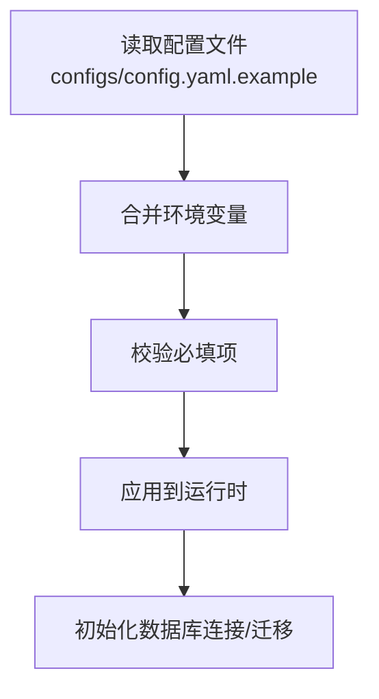
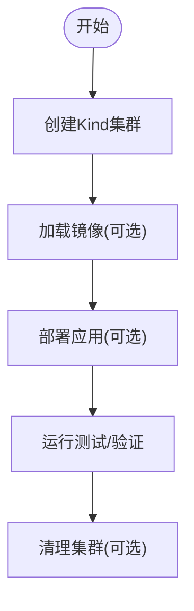
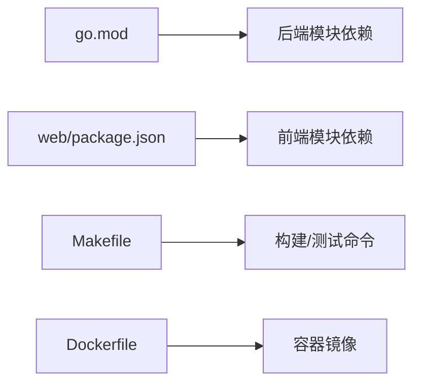

# 本地开发环境

<cite>
**本文引用的文件**   
- [Makefile](file://Makefile)
- [go.mod](file://go.mod)
- [Dockerfile](file://Dockerfile)
- [configs/config.yaml.example](file://configs/config.yaml.example)
- [web/package.json](file://web/package.json)
- [web/vite.config.ts](file://web/vite.config.ts)
- [cmd/klaw/main.go](file://cmd/klaw/main.go)
- [internal/api/server.go](file://internal/api/server.go)
- [internal/config/config.go](file://internal/config/config.go)
- [deployment/kind/manage.sh](file://deployment/kind/manage.sh)
</cite>

## 目录
1. [简介](#简介)
2. [项目结构](#项目结构)
3. [核心组件](#核心组件)
4. [架构总览](#架构总览)
5. [详细组件分析](#详细组件分析)
6. [依赖关系分析](#依赖关系分析)
7. [性能注意事项](#性能注意事项)
8. [故障排查指南](#故障排查指南)
9. [结论](#结论)
10. [附录：快速上手清单](#附录快速上手清单)

## 简介
本指南面向希望在本地快速搭建并运行 Klaw 平台的开发者，涵盖环境要求、克隆与初始化、配置准备、数据库与依赖服务、前端与后端启动、以及常见问题定位与调试技巧。目标是让开发者在尽可能少的步骤内获得一个可交互的开发环境。

## 项目结构
Klaw 采用前后端分离的架构：
- 后端：Go 语言实现，入口位于 cmd/klaw，API 路由与服务启动位于 internal/api，配置加载位于 internal/config。
- 前端：React + Vite + TypeScript，位于 web 目录，通过 Vite 提供开发服务器与热重载。
- 部署与工具：包含 Dockerfile、Makefile、Kind 脚本等辅助开发与测试。

图表来源
- [cmd/klaw/main.go](file://cmd/klaw/main.go)
- [internal/api/server.go](file://internal/api/server.go)
- [internal/config/config.go](file://internal/config/config.go)
- [web/vite.config.ts](file://web/vite.config.ts)

章节来源
- [Makefile](file://Makefile)
- [go.mod](file://go.mod)
- [Dockerfile](file://Dockerfile)

## 核心组件
- Go 后端服务：负责 HTTP API、业务逻辑、配置读取、与外部系统（如数据库、Kubernetes）交互。
- 前端应用：提供可视化界面，通过 API 与后端通信，使用 Vite 进行开发时构建与热更新。
- 配置系统：集中管理运行时参数，支持从配置文件与环境变量注入。
- 构建与部署：Makefile 统一常用命令；Dockerfile 用于容器化；Kind 脚本用于本地 Kubernetes 环境。

章节来源
- [cmd/klaw/main.go](file://cmd/klaw/main.go)
- [internal/api/server.go](file://internal/api/server.go)
- [internal/config/config.go](file://internal/config/config.go)
- [web/package.json](file://web/package.json)
- [web/vite.config.ts](file://web/vite.config.ts)

## 架构总览
下图展示了本地开发时的主要交互流程：前端通过 Vite 启动开发服务器，向后端发起 API 请求；后端加载配置，连接数据库或集群，返回数据供前端渲染。

图表来源
- [web/vite.config.ts](file://web/vite.config.ts)
- [internal/api/server.go](file://internal/api/server.go)
- [internal/config/config.go](file://internal/config/config.go)

## 详细组件分析

### 后端服务启动流程
后端以 Go 程序启动，入口在 cmd/klaw，内部通过 internal/api 注册路由与中间件，并通过 internal/config 加载配置。典型流程如下：

图表来源
- [cmd/klaw/main.go](file://cmd/klaw/main.go)
- [internal/api/server.go](file://internal/api/server.go)
- [internal/config/config.go](file://internal/config/config.go)

章节来源
- [cmd/klaw/main.go](file://cmd/klaw/main.go)
- [internal/api/server.go](file://internal/api/server.go)
- [internal/config/config.go](file://internal/config/config.go)

### 前端开发服务器
前端基于 Vite，开发时通过 npm/yarn/pnpm 启动。关键要点：
- 安装依赖后，执行开发脚本启动 Vite 服务器。
- 代理设置通常指向后端地址，便于跨域与联调。
- 环境变量可通过 .env 文件或 vite.config.ts 中的定义注入。

图表来源
- [web/package.json](file://web/package.json)
- [web/vite.config.ts](file://web/vite.config.ts)

章节来源
- [web/package.json](file://web/package.json)
- [web/vite.config.ts](file://web/vite.config.ts)

### 配置系统与数据库初始化
配置由 internal/config 模块负责加载，常见来源包括配置文件与运行时环境变量。数据库相关初始化通常由后端在启动阶段完成，或通过迁移脚本执行。

图表来源
- [internal/config/config.go](file://internal/config/config.go)
- [configs/config.yaml.example](file://configs/config.yaml.example)

章节来源
- [internal/config/config.go](file://internal/config/config.go)
- [configs/config.yaml.example](file://configs/config.yaml.example)

### Kind 本地集群（可选）
若需要本地 Kubernetes 环境，可使用 deployment/kind/manage.sh 脚本快速创建与管理 Kind 集群，便于集成测试与演示。

图表来源
- [deployment/kind/manage.sh](file://deployment/kind/manage.sh)

章节来源
- [deployment/kind/manage.sh](file://deployment/kind/manage.sh)

## 依赖关系分析
- 后端依赖：Go 标准库与第三方模块（见 go.mod），HTTP 框架、数据库驱动、Kubernetes 客户端等。
- 前端依赖：React、TypeScript、Vite、TailwindCSS 等（见 web/package.json）。
- 构建与容器：Makefile 封装常用命令；Dockerfile 定义镜像构建流程。

图表来源
- [go.mod](file://go.mod)
- [web/package.json](file://web/package.json)
- [Makefile](file://Makefile)
- [Dockerfile](file://Dockerfile)

章节来源
- [go.mod](file://go.mod)
- [web/package.json](file://web/package.json)
- [Makefile](file://Makefile)
- [Dockerfile](file://Dockerfile)

## 性能注意事项
- 前端开发服务器：开启 Vite 的 HMR 与按需编译，避免全量打包。
- 后端日志：开发环境建议输出详细日志，生产环境降低级别以提升性能。
- 数据库连接池：根据并发需求调整连接数与超时，避免连接耗尽。
- 缓存策略：对热点数据增加缓存层，减少数据库压力。
- 资源限制：为容器与进程设置合理的 CPU/内存限制，防止资源争用。

## 故障排查指南
- 端口冲突
  - 现象：后端或前端无法启动，提示端口被占用。
  - 处理：修改监听端口或释放占用进程。
- 配置缺失或错误
  - 现象：后端启动失败或功能异常。
  - 处理：对照 configs/config.yaml.example 检查必填项，确保环境变量正确注入。
- 数据库连接失败
  - 现象：后端报错无法连接数据库。
  - 处理：检查连接字符串、网络可达性与权限；确认已执行必要的初始化或迁移。
- 前端代理失败
  - 现象：浏览器控制台出现跨域或 404。
  - 处理：确认 vite.config.ts 中代理目标与后端地址一致；检查后端是否正常运行。
- Kind 集群不可用
  - 现象：无法访问集群或部署失败。
  - 处理：使用 deployment/kind/manage.sh 重建集群；检查镜像拉取与节点资源。

章节来源
- [internal/config/config.go](file://internal/config/config.go)
- [web/vite.config.ts](file://web/vite.config.ts)
- [deployment/kind/manage.sh](file://deployment/kind/manage.sh)

## 结论
通过以上步骤，你可以在本地快速搭建并运行 Klaw 平台的前后端环境。建议在开发过程中保持配置与依赖版本稳定，结合日志与调试工具定位问题，逐步完善功能与性能。

## 附录：快速上手清单
- 环境与工具
  - Go：参考 go.mod 指定版本
  - Node.js：参考 web/package.json 指定版本
  - 包管理器：npm/yarn/pnpm（任选其一）
  - Docker（可选）：用于容器化与镜像构建
  - Kind（可选）：用于本地 Kubernetes 集群
- 克隆与初始化
  - 克隆仓库
  - 进入项目根目录
- 后端
  - 复制并编辑配置文件（configs/config.yaml.example -> configs/config.yaml）
  - 初始化数据库（按实际驱动与迁移脚本执行）
  - 启动后端服务（参考 Makefile 或 go run 命令）
- 前端
  - 进入 web 目录
  - 安装依赖
  - 启动开发服务器（参考 package.json scripts）
- 联调与验证
  - 打开浏览器访问前端地址
  - 检查 API 调用与页面渲染是否正常
- 常见问题
  - 端口冲突、配置错误、数据库连接失败、代理配置错误、Kind 集群不可用等，参考“故障排查指南”