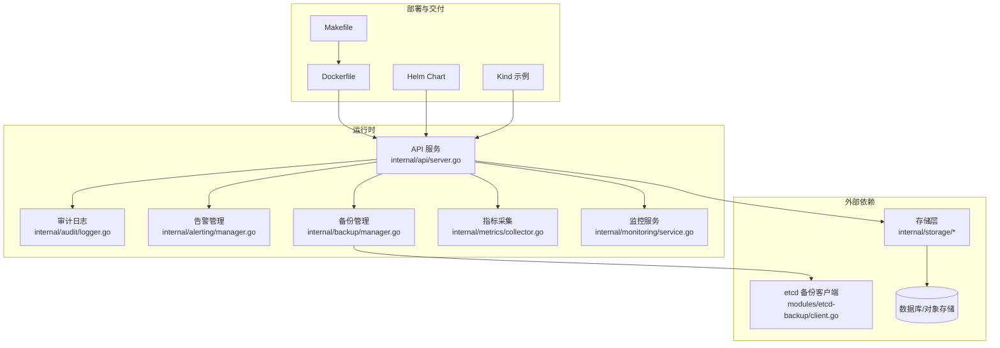
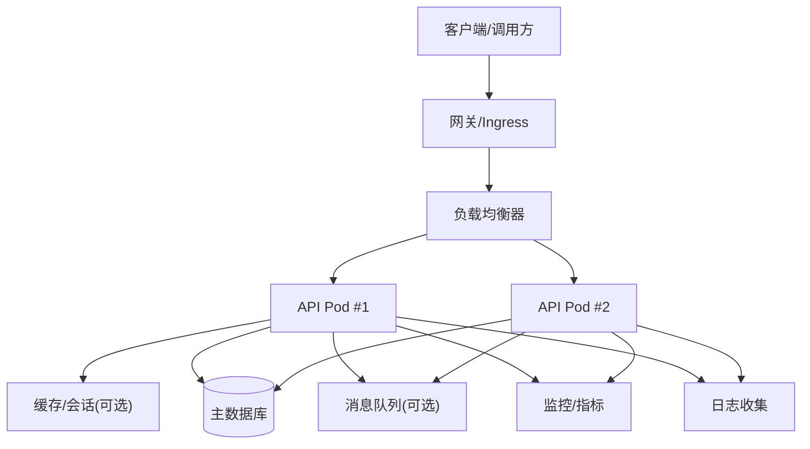
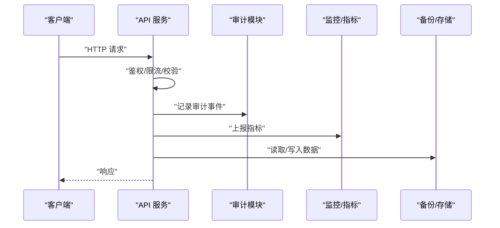
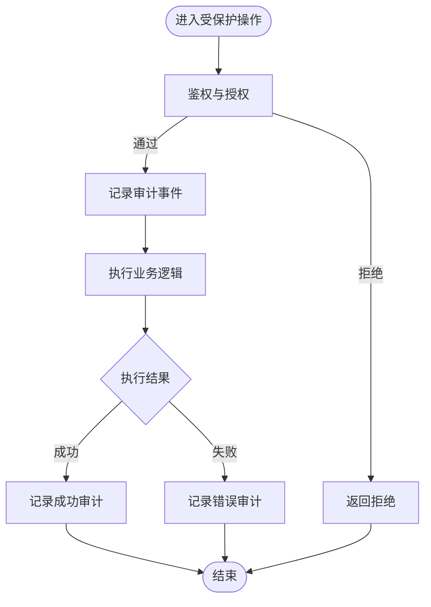
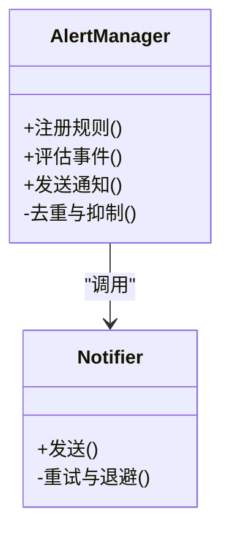
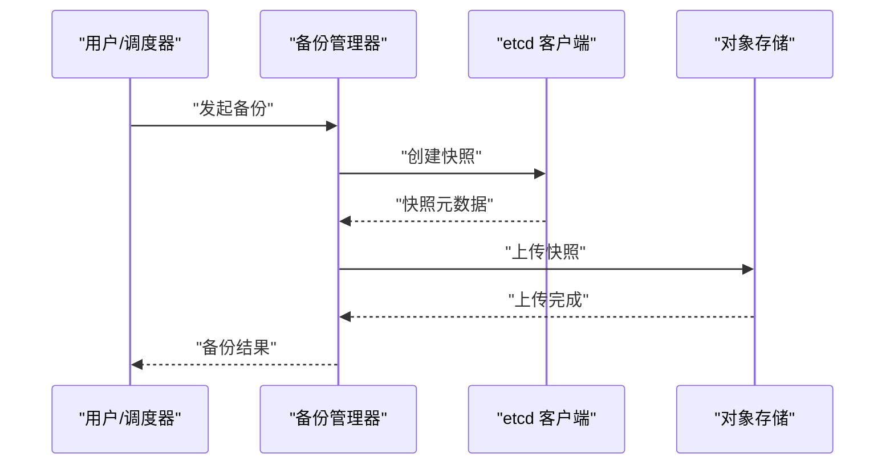
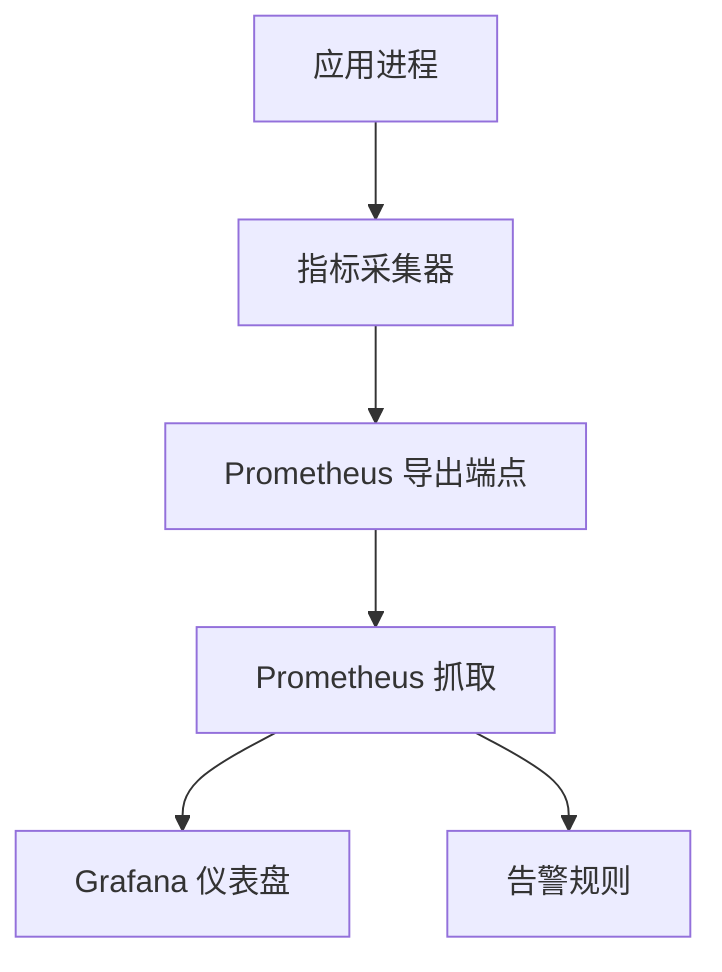
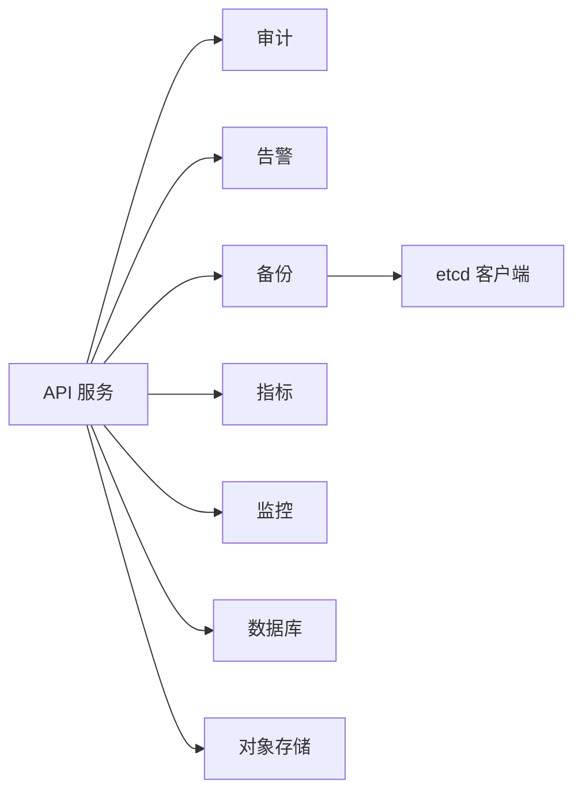

# 生产环境最佳实践

<cite>
**本文档引用的文件**   
- [config.yaml](file://configs/config.yaml)
- [config.yaml.example](file://configs/config.yaml.example)
- [server.go](file://internal/api/server.go)
- [alerting_manager.go](file://internal/alerting/manager.go)
- [audit_logger.go](file://internal/audit/logger.go)
- [backup_manager.go](file://internal/backup/manager.go)
- [metrics_collector.go](file://internal/metrics/collector.go)
- [monitoring_service.go](file://internal/monitoring/service.go)
- [etcd_backup_client.go](file://modules/etcd-backup/client.go)
- [Dockerfile](file://Dockerfile)
- [Makefile](file://Makefile)
- [go.mod](file://go.mod)
</cite>

## 目录
1. [简介](#简介)
2. [项目结构](#项目结构)
3. [核心组件](#核心组件)
4. [架构总览](#架构总览)
5. [详细组件分析](#详细组件分析)
6. [依赖分析](#依赖分析)
7. [性能考虑](#性能考虑)
8. [故障排查指南](#故障排查指南)
9. [结论](#结论)
10. [附录](#附录)

## 简介
本指南面向在生产环境中部署与运行 Klaw 平台的运维与平台工程团队，聚焦安全配置、性能调优、监控告警、日志收集、备份恢复、高可用与负载均衡、容量规划、合规与审计等关键主题。文档基于仓库中的配置、API 服务、审计、备份、指标采集与监控模块进行系统性梳理，并提供可操作的流程与检查清单，帮助构建稳定、可观测、可恢复的生产系统。

## 项目结构
Klaw 采用模块化设计，后端以 Go 实现，提供 API 服务、审计、告警、备份、指标与监控等能力；前端为 React/Vite 应用；容器化通过 Dockerfile 构建镜像；部署可通过 Helm 或 Kubernetes Kind 示例进行编排。

图表来源
- [server.go](file://internal/api/server.go)
- [audit_logger.go](file://internal/audit/logger.go)
- [alerting_manager.go](file://internal/alerting/manager.go)
- [backup_manager.go](file://internal/backup/manager.go)
- [metrics_collector.go](file://internal/metrics/collector.go)
- [monitoring_service.go](file://internal/monitoring/service.go)
- [etcd_backup_client.go](file://modules/etcd-backup/client.go)
- [Dockerfile](file://Dockerfile)
- [Makefile](file://Makefile)

章节来源
- [config.yaml](file://configs/config.yaml)
- [config.yaml.example](file://configs/config.yaml.example)
- [Dockerfile](file://Dockerfile)
- [Makefile](file://Makefile)
- [go.mod](file://go.mod)

## 核心组件
- API 服务：统一入口，承载业务接口、诊断与运维端点，负责路由分发与中间件（鉴权、限流、审计）集成。
- 审计日志：记录关键操作与访问行为，支持结构化输出与合规审计。
- 告警管理：聚合事件与规则引擎，对接多种通知渠道。
- 备份管理：协调数据备份任务，支持 etcd 等关键状态源。
- 指标采集：暴露 Prometheus 兼容指标，支撑监控大盘与告警。
- 监控服务：封装健康检查、探针与状态上报。

章节来源
- [server.go](file://internal/api/server.go)
- [audit_logger.go](file://internal/audit/logger.go)
- [alerting_manager.go](file://internal/alerting/manager.go)
- [backup_manager.go](file://internal/backup/manager.go)
- [metrics_collector.go](file://internal/metrics/collector.go)
- [monitoring_service.go](file://internal/monitoring/service.go)

## 架构总览
生产环境推荐将 Klaw 部署在 Kubernetes 集群中，使用 Ingress/Gateway 作为统一入口，配合 Service、Deployment、HPA、PDB、ConfigMap/Secret、持久卷与网络策略等实现高可用与安全隔离。

图表来源
- [server.go](file://internal/api/server.go)
- [metrics_collector.go](file://internal/metrics/collector.go)
- [monitoring_service.go](file://internal/monitoring/service.go)

## 详细组件分析

### API 服务与路由
- 职责：注册 HTTP/REST 路由、处理请求生命周期、集成鉴权与审计、暴露健康与诊断端点。
- 关键点：
  - 健康检查端点用于就绪/存活探针。
  - 诊断与运维端点需限制访问范围并启用审计。
  - 中间件链应包含速率限制、请求校验、审计记录。

图表来源
- [server.go](file://internal/api/server.go)
- [audit_logger.go](file://internal/audit/logger.go)
- [metrics_collector.go](file://internal/metrics/collector.go)
- [backup_manager.go](file://internal/backup/manager.go)

章节来源
- [server.go](file://internal/api/server.go)

### 审计日志与合规
- 目标：满足合规审计要求，记录用户身份、操作类型、资源、时间戳、结果与上下文。
- 建议：
  - 开启结构化审计日志，按级别分类（INFO/WARN/ERROR）。
  - 对敏感字段脱敏，避免泄露密钥与个人信息。
  - 将审计日志集中到日志平台，设置保留策略与访问控制。

图表来源
- [audit_logger.go](file://internal/audit/logger.go)

章节来源
- [audit_logger.go](file://internal/audit/logger.go)

### 告警管理
- 功能：聚合事件、匹配规则、触发通知（如钉钉、飞书等）。
- 建议：
  - 定义清晰的告警级别与抑制/合并策略，避免告警风暴。
  - 将告警通道配置放入 Secret，动态加载。
  - 建立告警升级与值班轮转机制。

图表来源
- [alerting_manager.go](file://internal/alerting/manager.go)

章节来源
- [alerting_manager.go](file://internal/alerting/manager.go)

### 备份与恢复
- 能力：协调备份任务、管理快照、支持 etcd 等关键状态源。
- 建议：
  - 制定 RPO/RTO 目标，选择增量/全量策略。
  - 备份数据落盘至对象存储或异地存储，加密传输与静态加密。
  - 定期演练恢复流程，验证完整性与可用性。

图表来源
- [backup_manager.go](file://internal/backup/manager.go)
- [etcd_backup_client.go](file://modules/etcd-backup/client.go)

章节来源
- [backup_manager.go](file://internal/backup/manager.go)
- [etcd_backup_client.go](file://modules/etcd-backup/client.go)

### 指标采集与监控
- 指标：进程、HTTP、业务关键指标、资源使用率。
- 建议：
  - 暴露标准 Prometheus 端点，合理采样频率。
  - 结合 Grafana 构建仪表盘，设置阈值与趋势分析。
  - 健康检查端点用于 Liveness/Readiness 探针。

图表来源
- [metrics_collector.go](file://internal/metrics/collector.go)
- [monitoring_service.go](file://internal/monitoring/service.go)

章节来源
- [metrics_collector.go](file://internal/metrics/collector.go)
- [monitoring_service.go](file://internal/monitoring/service.go)

### 配置管理
- 配置文件：集中化管理环境变量、数据库连接、第三方服务凭据等。
- 建议：
  - 使用 ConfigMap 管理非敏感配置，Secret 管理敏感信息。
  - 启动时校验必填项与格式，失败快速退出。
  - 支持热更新与灰度发布时的配置切换。

章节来源
- [config.yaml](file://configs/config.yaml)
- [config.yaml.example](file://configs/config.yaml.example)

## 依赖分析
- 内部依赖：API 服务依赖审计、告警、备份、指标与监控模块。
- 外部依赖：数据库、对象存储、消息队列、etcd、第三方通知渠道。
- 风险点：
  - 循环依赖应避免。
  - 外部依赖超时与熔断策略需完善。
  - 版本兼容性需纳入 CI/CD 检查。

图表来源
- [server.go](file://internal/api/server.go)
- [audit_logger.go](file://internal/audit/logger.go)
- [alerting_manager.go](file://internal/alerting/manager.go)
- [backup_manager.go](file://internal/backup/manager.go)
- [metrics_collector.go](file://internal/metrics/collector.go)
- [monitoring_service.go](file://internal/monitoring/service.go)
- [etcd_backup_client.go](file://modules/etcd-backup/client.go)

章节来源
- [go.mod](file://go.mod)

## 性能考虑
- 容器与运行时：
  - 设置合理的 CPU/Memory 请求与限制，启用 HPA 自动扩缩容。
  - 使用 PDB 保障滚动更新期间可用性。
- 网络与 I/O：
  - 优化连接池大小与超时参数，避免连接耗尽。
  - 启用压缩与缓存减少带宽与延迟。
- 数据库与存储：
  - 读写分离、索引优化、慢查询治理。
  - 备份与恢复演练降低 RTO。
- 监控与调优：
  - 基于指标与日志定位瓶颈，持续迭代。

[本节为通用指导，不直接分析具体文件]

## 故障排查指南
- 常见问题：
  - 启动失败：检查配置项、依赖服务连通性、权限与证书。
  - 请求超时：查看链路追踪、下游依赖耗时、连接池与线程池。
  - 内存泄漏：观察堆栈与 GC 指标，定位热点路径。
  - 备份失败：核对权限、存储空间、网络与快照一致性。
- 应急流程：
  - 快速回滚：基于镜像标签与配置版本回滚。
  - 降级策略：关闭非核心功能，优先保障主流程。
  - 扩容与隔离：隔离异常节点，临时扩容缓解压力。

章节来源
- [server.go](file://internal/api/server.go)
- [audit_logger.go](file://internal/audit/logger.go)
- [backup_manager.go](file://internal/backup/manager.go)
- [metrics_collector.go](file://internal/metrics/collector.go)

## 结论
通过模块化设计与完善的可观测性、备份与审计能力，Klaw 可在生产环境实现高可用、安全合规与高效运维。建议结合企业现有平台（Kubernetes、日志/监控/审计体系）进行集成，持续演练与优化，确保稳定性与可恢复性。

[本节为总结性内容，不直接分析具体文件]

## 附录
- 安全配置建议：
  - 最小权限原则，RBAC 精细化控制。
  - 传输与静态加密，证书轮换与密钥管理。
  - 网络安全策略与访问白名单。
- 高可用与负载均衡：
  - 多副本部署、跨可用区分布。
  - 健康检查与优雅停机。
- 容量规划：
  - 基于峰值与增长预测规划资源。
  - 弹性伸缩与成本优化。
- 合规与审计：
  - 审计日志不可篡改与留存周期。
  - 定期合规扫描与报告。

[本节为补充说明，不直接分析具体文件]