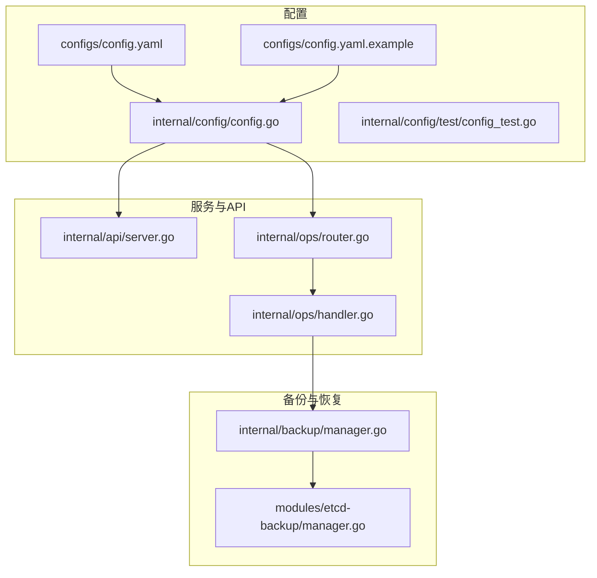
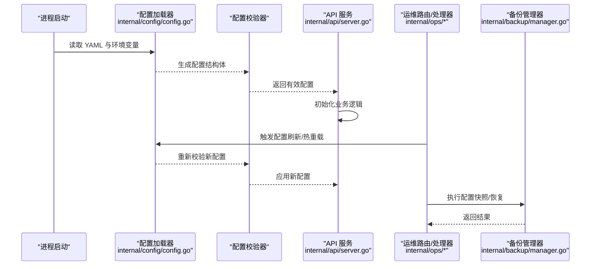
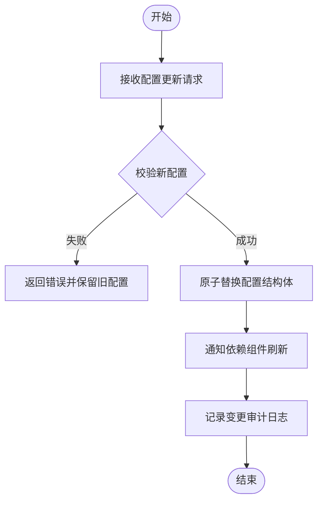
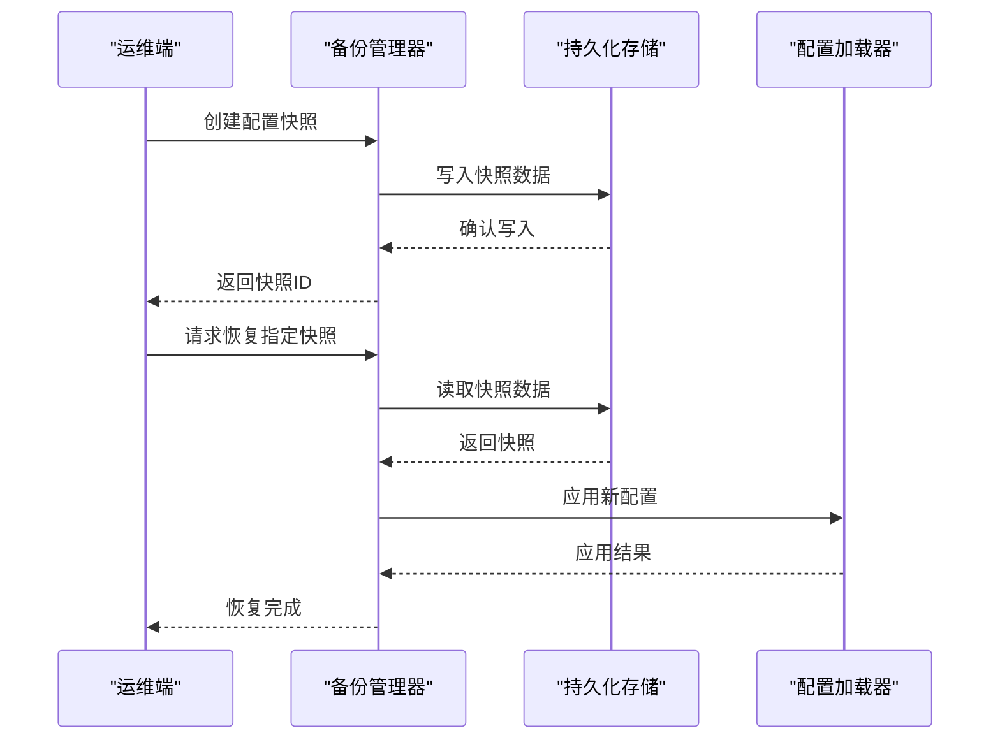
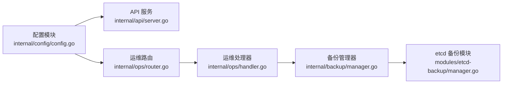

# 配置管理

<cite>
**本文引用的文件**   
- [configs/config.yaml](file://configs/config.yaml)
- [configs/config.yaml.example](file://configs/config.yaml.example)
- [internal/config/config.go](file://internal/config/config.go)
- [internal/config/test/config_test.go](file://internal/config/test/config_test.go)
- [internal/api/server.go](file://internal/api/server.go)
- [internal/ops/handler.go](file://internal/ops/handler.go)
- [internal/ops/router.go](file://internal/ops/router.go)
- [internal/backup/manager.go](file://internal/backup/manager.go)
- [modules/etcd-backup/manager.go](file://modules/etcd-backup/manager.go)
</cite>

## 目录
1. [简介](#简介)
2. [项目结构](#项目结构)
3. [核心组件](#核心组件)
4. [架构总览](#架构总览)
5. [详细组件分析](#详细组件分析)
6. [依赖关系分析](#依赖关系分析)
7. [性能考量](#性能考量)
8. [故障排查指南](#故障排查指南)
9. [结论](#结论)
10. [附录](#附录)

## 简介
本文件面向 Klaw 平台的配置管理，系统性说明配置文件结构、环境变量注入、动态配置更新机制与校验规则；详述各配置项的作用、默认值、取值范围与示例；提供开发、测试、生产环境的配置模板与最佳实践；并给出热重载、迁移、备份恢复等运维操作指南。文档内容基于仓库中的配置模块、API 服务、运维路由与备份模块的实现进行梳理与总结。

## 项目结构
Klaw 的配置相关代码主要分布在以下位置：
- 配置文件与示例：configs 目录
- 配置加载与解析：internal/config
- 运行时暴露的 API 与服务入口：internal/api
- 运维能力（含配置相关接口）：internal/ops
- 备份与恢复：internal/backup 与 modules/etcd-backup

**图表来源** 
- [configs/config.yaml](file://configs/config.yaml)
- [configs/config.yaml.example](file://configs/config.yaml.example)
- [internal/config/config.go](file://internal/config/config.go)
- [internal/api/server.go](file://internal/api/server.go)
- [internal/ops/router.go](file://internal/ops/router.go)
- [internal/ops/handler.go](file://internal/ops/handler.go)
- [internal/backup/manager.go](file://internal/backup/manager.go)
- [modules/etcd-backup/manager.go](file://modules/etcd-backup/manager.go)

**章节来源**
- [configs/config.yaml](file://configs/config.yaml)
- [configs/config.yaml.example](file://configs/config.yaml.example)
- [internal/config/config.go](file://internal/config/config.go)
- [internal/config/test/config_test.go](file://internal/config/test/config_test.go)
- [internal/api/server.go](file://internal/api/server.go)
- [internal/ops/router.go](file://internal/ops/router.go)
- [internal/ops/handler.go](file://internal/ops/handler.go)
- [internal/backup/manager.go](file://internal/backup/manager.go)
- [modules/etcd-backup/manager.go](file://modules/etcd-backup/manager.go)

## 核心组件
- 配置加载器：负责从 YAML 文件与环境变量中读取配置，合并为统一的结构体，并进行基础校验。
- 配置校验器：对必填字段、类型、取值范围进行验证，确保运行期安全可用。
- 动态配置更新：通过 API 或运维路由触发配置刷新，支持热重载关键参数。
- 备份与恢复：对配置与运行时状态进行快照与回滚，保障可恢复性。

**章节来源**
- [internal/config/config.go](file://internal/config/config.go)
- [internal/config/test/config_test.go](file://internal/config/test/config_test.go)
- [internal/api/server.go](file://internal/api/server.go)
- [internal/ops/router.go](file://internal/ops/router.go)
- [internal/ops/handler.go](file://internal/ops/handler.go)
- [internal/backup/manager.go](file://internal/backup/manager.go)
- [modules/etcd-backup/manager.go](file://modules/etcd-backup/manager.go)

## 架构总览
下图展示了配置在启动与运行期的整体流程：从配置文件与环境变量加载到内存结构，经校验后由服务层使用；运维端通过路由与处理器触发配置更新与备份恢复。

**图表来源** 
- [internal/config/config.go](file://internal/config/config.go)
- [internal/api/server.go](file://internal/api/server.go)
- [internal/ops/router.go](file://internal/ops/router.go)
- [internal/ops/handler.go](file://internal/ops/handler.go)
- [internal/backup/manager.go](file://internal/backup/manager.go)

## 详细组件分析

### 配置结构与加载
- 配置文件来源
  - YAML 文件：configs/config.yaml 与 configs/config.yaml.example
  - 环境变量：覆盖或补充 YAML 中的键值
- 加载顺序与优先级
  - 先加载 YAML 基础配置
  - 再按命名约定合并环境变量（例如前缀映射）
  - 最终形成统一的配置结构体供运行时使用
- 典型结构域
  - 通用：日志级别、调试开关、监听端口等
  - 存储：后端连接信息、超时、重试策略
  - 外部集成：消息通道、告警、诊断工具等
  - 安全：认证、鉴权、TLS 相关参数
- 默认值策略
  - 对可选字段设置合理默认值，保证最小可用配置
  - 对敏感字段不设置默认值，强制显式配置

**章节来源**
- [configs/config.yaml](file://configs/config.yaml)
- [configs/config.yaml.example](file://configs/config.yaml.example)
- [internal/config/config.go](file://internal/config/config.go)

### 配置校验规则
- 必填校验：关键字段缺失时拒绝启动或报错
- 类型校验：数值、布尔、字符串格式检查
- 取值范围：端口、超时、并发数等边界限制
- 一致性校验：关联字段之间的约束（如依赖开启才允许配置）
- 错误处理：收集所有错误并一次性返回，便于修复

**章节来源**
- [internal/config/config.go](file://internal/config/config.go)
- [internal/config/test/config_test.go](file://internal/config/test/config_test.go)

### 动态配置更新与热重载
- 触发方式
  - 通过运维路由暴露的接口触发配置刷新
  - 支持部分热重载（仅影响运行态的参数）
- 更新流程
  - 接收新配置请求
  - 校验新配置有效性
  - 原子替换内存中的配置结构体
  - 通知依赖该配置的组件重新初始化
- 注意事项
  - 非线程安全的资源需在切换前释放
  - 失败时回滚至上一版本配置
  - 记录变更审计日志

**图表来源** 
- [internal/ops/router.go](file://internal/ops/router.go)
- [internal/ops/handler.go](file://internal/ops/handler.go)
- [internal/config/config.go](file://internal/config/config.go)

**章节来源**
- [internal/ops/router.go](file://internal/ops/router.go)
- [internal/ops/handler.go](file://internal/ops/handler.go)
- [internal/config/config.go](file://internal/config/config.go)

### 配置备份与恢复
- 备份目标
  - 当前生效的配置快照
  - 关键运行时状态（如需）
- 备份策略
  - 全量快照与增量差异结合
  - 多副本与过期清理策略
- 恢复流程
  - 选择目标快照
  - 校验快照完整性
  - 应用配置并重启必要组件
- 与 etcd 集成
  - 通过 etcd 模块进行分布式存储与一致性保障

**图表来源** 
- [internal/backup/manager.go](file://internal/backup/manager.go)
- [modules/etcd-backup/manager.go](file://modules/etcd-backup/manager.go)
- [internal/config/config.go](file://internal/config/config.go)

**章节来源**
- [internal/backup/manager.go](file://internal/backup/manager.go)
- [modules/etcd-backup/manager.go](file://modules/etcd-backup/manager.go)

### 不同环境配置模板与最佳实践
- 开发环境
  - 启用详细日志与调试模式
  - 使用本地或轻量级后端存储
  - 关闭严格的安全校验以便快速迭代
- 测试环境
  - 模拟外部依赖（消息、告警、诊断）
  - 启用自动化测试所需的断言与钩子
  - 限制并发与资源占用以稳定测试
- 生产环境
  - 启用 TLS、强密码与最小权限原则
  - 合理设置超时、重试与熔断参数
  - 开启审计日志与监控指标采集
- 通用最佳实践
  - 使用环境变量注入敏感信息
  - 通过配置中心或密钥管理服务集中管理
  - 变更前进行预检与灰度发布

[本节为概念性指导，不直接分析具体文件]

## 依赖关系分析
配置模块与 API、运维、备份模块之间存在明确的依赖关系：
- 配置模块被 API 与运维模块消费
- 运维模块通过处理器调用备份管理器
- 备份管理器依赖 etcd 模块进行持久化

**图表来源** 
- [internal/config/config.go](file://internal/config/config.go)
- [internal/api/server.go](file://internal/api/server.go)
- [internal/ops/router.go](file://internal/ops/router.go)
- [internal/ops/handler.go](file://internal/ops/handler.go)
- [internal/backup/manager.go](file://internal/backup/manager.go)
- [modules/etcd-backup/manager.go](file://modules/etcd-backup/manager.go)

**章节来源**
- [internal/config/config.go](file://internal/config/config.go)
- [internal/api/server.go](file://internal/api/server.go)
- [internal/ops/router.go](file://internal/ops/router.go)
- [internal/ops/handler.go](file://internal/ops/handler.go)
- [internal/backup/manager.go](file://internal/backup/manager.go)
- [modules/etcd-backup/manager.go](file://modules/etcd-backup/manager.go)

## 性能考量
- 配置加载
  - 避免重复解析，缓存已加载的配置结构体
  - 大对象按需懒加载
- 校验开销
  - 将耗时校验移至启动阶段或异步后台任务
- 热重载
  - 使用原子替换减少锁竞争
  - 对频繁更新的参数采用无锁数据结构
- 备份与恢复
  - 压缩与分片传输
  - 读写分离与并行 I/O

[本节为通用性能建议，不直接分析具体文件]

## 故障排查指南
- 常见错误
  - 配置缺失或类型错误导致启动失败
  - 热重载失败引发服务抖动
  - 备份恢复失败导致状态不一致
- 定位方法
  - 查看配置校验错误日志
  - 对比期望与实际配置差异
  - 检查备份快照完整性与时间戳
- 恢复步骤
  - 回滚至上一个已知良好的配置快照
  - 逐步缩小问题范围，隔离外部依赖
  - 复测并验证恢复效果

**章节来源**
- [internal/config/config.go](file://internal/config/config.go)
- [internal/config/test/config_test.go](file://internal/config/test/config_test.go)
- [internal/backup/manager.go](file://internal/backup/manager.go)
- [modules/etcd-backup/manager.go](file://modules/etcd-backup/manager.go)

## 结论
Klaw 平台的配置管理围绕“加载—校验—使用—更新—备份”的闭环设计，兼顾灵活性与安全性。通过清晰的配置结构、严格的校验规则、可靠的热重载与备份恢复机制，能够在多环境下稳定运行并提供高效的运维能力。建议在生产环境中遵循最小权限、集中管理与灰度发布的最佳实践，确保配置变更的可控与可追溯。

[本节为总结性内容，不直接分析具体文件]

## 附录
- 常用命令与脚本
  - 生成配置快照
  - 列出历史快照
  - 恢复指定快照
- 环境变量清单
  - 列举关键环境变量及其作用
- 配置迁移指南
  - 版本间字段变更对照表
  - 自动迁移脚本与手动操作步骤

[本节为扩展信息，不直接分析具体文件]