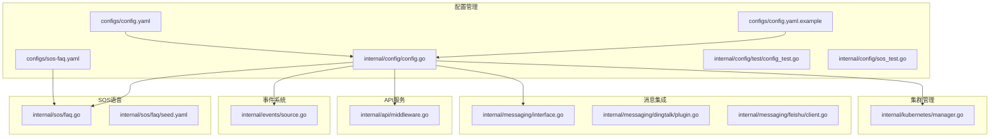
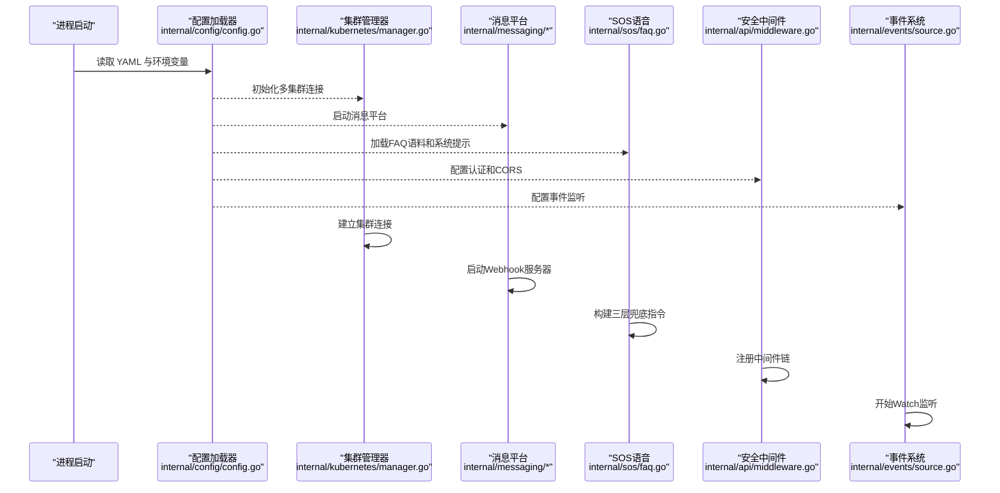
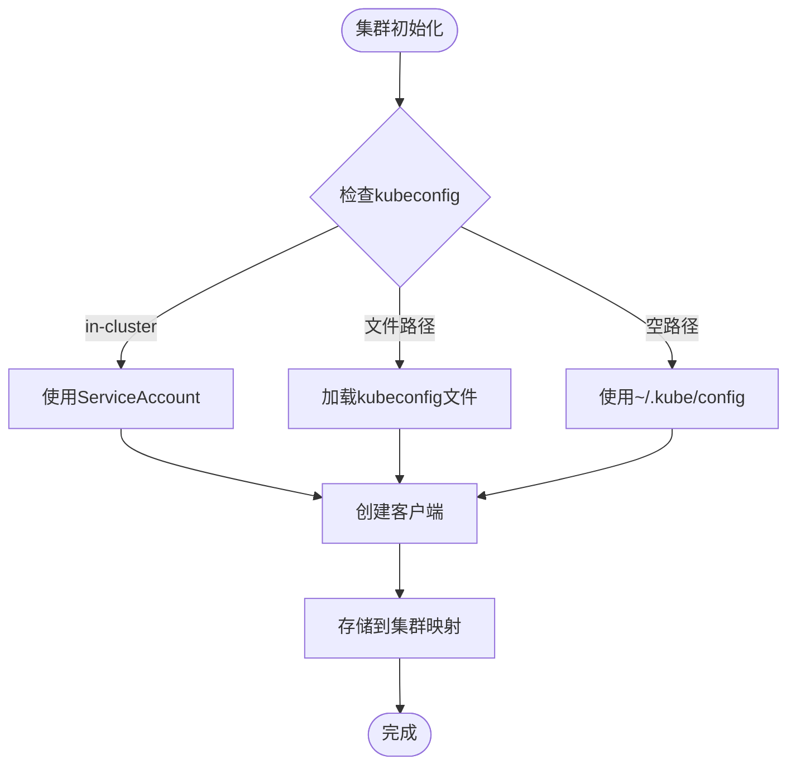
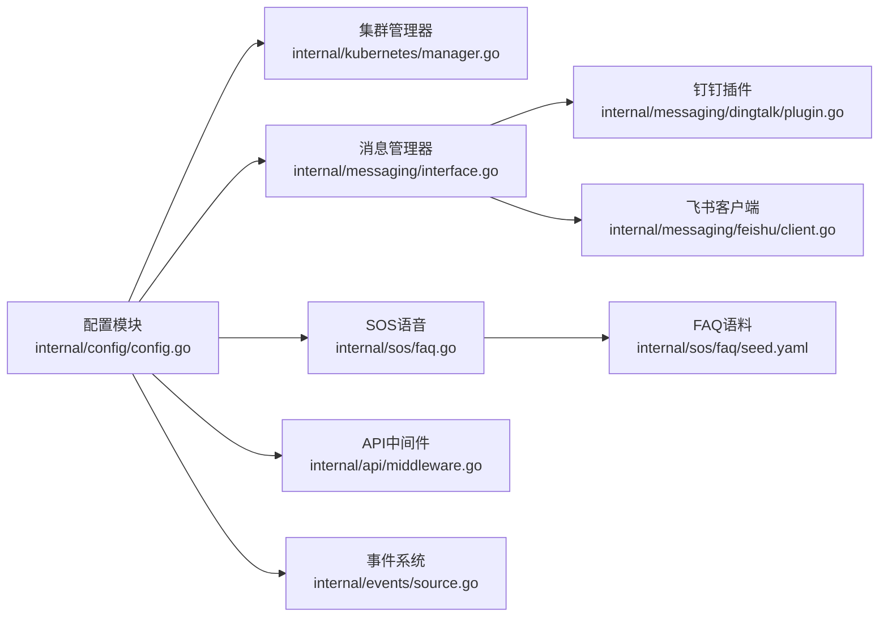

# 配置管理

<cite>
**本文引用的文件**   
- [configs/config.yaml](file://configs/config.yaml)
- [configs/config.yaml.example](file://configs/config.yaml.example)
- [configs/sos-faq.yaml](file://configs/sos-faq.yaml)
- [internal/config/config.go](file://internal/config/config.go)
- [internal/config/test/config_test.go](file://internal/config/test/config_test.go)
- [internal/config/sos_test.go](file://internal/config/sos_test.go)
- [internal/kubernetes/manager.go](file://internal/kubernetes/manager.go)
- [internal/messaging/interface.go](file://internal/messaging/interface.go)
- [internal/messaging/dingtalk/plugin.go](file://internal/messaging/dingtalk/plugin.go)
- [internal/messaging/feishu/client.go](file://internal/messaging/feishu/client.go)
- [internal/api/middleware.go](file://internal/api/middleware.go)
- [internal/events/source.go](file://internal/events/source.go)
- [internal/sos/faq.go](file://internal/sos/faq.go)
- [internal/sos/faq/seed.yaml](file://internal/sos/faq/seed.yaml)
</cite>

## 更新摘要
**所做更改**   
- 新增多集群连接支持，支持多个Kubernetes集群配置
- 增强服务器配置，包含认证和CORS跨域配置
- 添加钉钉和飞书消息平台集成配置
- 完善事件监听配置，支持Watch模式实时推送
- 增强环境变量覆盖机制，支持敏感信息注入
- **新增SOS模式配置**：支持DashScope API密钥、工作区ID、区域设置、模型选择等环境变量支持

## 目录
1. [简介](#简介)
2. [项目结构](#项目结构)
3. [核心组件](#核心组件)
4. [架构总览](#架构总览)
5. [详细组件分析](#详细组件分析)
6. [依赖关系分析](#依赖关系分析)
7. [性能考量](#性能考量)
8. [故障排查指南](#故障排查指南)
9. [结论](#结论)
10. [附录](#附录)

## 简介
本文件面向 Klaw 平台的配置管理，系统性说明配置文件结构、环境变量注入、动态配置更新机制与校验规则；详述各配置项的作用、默认值、取值范围与示例；提供开发、测试、生产环境的配置模板与最佳实践；并给出热重载、迁移、备份恢复等运维操作指南。文档内容基于仓库中的配置模块、API 服务、运维路由与备份模块的实现进行梳理与总结。

**更新** 本次更新重点增强了多集群连接能力、服务器安全配置、消息平台集成、事件监听功能和SOS语音应急对话能力。

## 项目结构
Klaw 的配置相关代码主要分布在以下位置：
- 配置文件与示例：configs 目录
- 配置加载与解析：internal/config
- Kubernetes集群管理：internal/kubernetes
- 消息平台集成：internal/messaging
- SOS语音应急：internal/sos
- API服务中间件：internal/api
- 事件监听系统：internal/events

**图表来源** 
- [configs/config.yaml](file://configs/config.yaml)
- [configs/config.yaml.example](file://configs/config.yaml.example)
- [configs/sos-faq.yaml](file://configs/sos-faq.yaml)
- [internal/config/config.go](file://internal/config/config.go)
- [internal/config/test/config_test.go](file://internal/config/test/config_test.go)
- [internal/config/sos_test.go](file://internal/config/sos_test.go)
- [internal/kubernetes/manager.go](file://internal/kubernetes/manager.go)
- [internal/messaging/interface.go](file://internal/messaging/interface.go)
- [internal/messaging/dingtalk/plugin.go](file://internal/messaging/dingtalk/plugin.go)
- [internal/messaging/feishu/client.go](file://internal/messaging/feishu/client.go)
- [internal/sos/faq.go](file://internal/sos/faq.go)
- [internal/sos/faq/seed.yaml](file://internal/sos/faq/seed.yaml)
- [internal/api/middleware.go](file://internal/api/middleware.go)
- [internal/events/source.go](file://internal/events/source.go)

**章节来源**
- [configs/config.yaml](file://configs/config.yaml)
- [configs/config.yaml.example](file://configs/config.yaml.example)
- [configs/sos-faq.yaml](file://configs/sos-faq.yaml)
- [internal/config/config.go](file://internal/config/config.go)
- [internal/config/test/config_test.go](file://internal/config/test/config_test.go)
- [internal/config/sos_test.go](file://internal/config/sos_test.go)
- [internal/kubernetes/manager.go](file://internal/kubernetes/manager.go)
- [internal/messaging/interface.go](file://internal/messaging/interface.go)
- [internal/messaging/dingtalk/plugin.go](file://internal/messaging/dingtalk/plugin.go)
- [internal/messaging/feishu/client.go](file://internal/messaging/feishu/client.go)
- [internal/sos/faq.go](file://internal/sos/faq.go)
- [internal/sos/faq/seed.yaml](file://internal/sos/faq/seed.yaml)
- [internal/api/middleware.go](file://internal/api/middleware.go)
- [internal/events/source.go](file://internal/events/source.go)

## 核心组件
- 配置加载器：负责从 YAML 文件与环境变量中读取配置，合并为统一的结构体，并进行基础校验。
- 多集群管理器：支持连接多个Kubernetes集群，每个集群可独立配置kubeconfig路径和上下文。
- 消息平台集成：支持钉钉和飞书消息平台，提供统一的通信接口。
- SOS语音应急：支持DashScope Realtime语音对话，包含FAQ语料管理和系统提示构建。
- 服务器安全：包含API认证和CORS跨域控制中间件。
- 事件监听系统：支持Watch模式实时监听Kubernetes事件，具备速率限制和去重功能。

**更新** 新增了多集群连接、消息平台集成、SOS语音应急、服务器安全配置和事件监听等核心组件。

**章节来源**
- [internal/config/config.go](file://internal/config/config.go)
- [internal/kubernetes/manager.go](file://internal/kubernetes/manager.go)
- [internal/messaging/interface.go](file://internal/messaging/interface.go)
- [internal/sos/faq.go](file://internal/sos/faq.go)
- [internal/api/middleware.go](file://internal/api/middleware.go)
- [internal/events/source.go](file://internal/events/source.go)

## 架构总览
下图展示了配置在启动与运行期的整体流程：从配置文件与环境变量加载到内存结构，经校验后由服务层使用；支持多集群连接、消息平台集成、SOS语音对话和安全中间件。

**图表来源** 
- [internal/config/config.go](file://internal/config/config.go)
- [internal/kubernetes/manager.go](file://internal/kubernetes/manager.go)
- [internal/messaging/interface.go](file://internal/messaging/interface.go)
- [internal/sos/faq.go](file://internal/sos/faq.go)
- [internal/api/middleware.go](file://internal/api/middleware.go)
- [internal/events/source.go](file://internal/events/source.go)

## 详细组件分析

### 配置结构与加载
- 配置文件来源
  - YAML 文件：configs/config.yaml 与 configs/config.yaml.example
  - 环境变量：覆盖或补充 YAML 中的键值
- 加载顺序与优先级
  - 先加载 YAML 基础配置
  - 再按命名约定合并环境变量（例如前缀映射）
  - 最终形成统一的配置结构体供运行时使用
- 典型结构域
  - **Kubernetes集群**：支持多集群配置，每个集群包含名称、kubeconfig路径和上下文
  - **消息平台**：钉钉和飞书配置，支持启用开关和各种认证参数
  - **SOS语音应急**：DashScope配置、FAQ语料管理、系统提示构建
  - **服务器设置**：端口、认证、CORS跨域配置
  - **事件监听**：Watch模式配置，支持资源类型过滤、命名空间过滤、严重级别等
  - **OpenClaw**：AI助手功能配置
- 默认值策略
  - 对可选字段设置合理默认值，保证最小可用配置
  - 对敏感字段不设置默认值，强制显式配置或通过环境变量注入
  - SOS模式默认关闭，避免未使用功能的开销

**更新** 新增了多集群配置、消息平台配置、SOS语音应急配置、服务器安全配置和事件监听配置。

**章节来源**
- [configs/config.yaml](file://configs/config.yaml)
- [configs/config.yaml.example](file://configs/config.yaml.example)
- [configs/sos-faq.yaml](file://configs/sos-faq.yaml)
- [internal/config/config.go](file://internal/config/config.go)

### 多集群连接配置
- 集群配置结构
  - `name`：集群唯一标识符
  - `kubeconfig`：kubeconfig文件路径，支持特殊值 `in-cluster` 表示使用Pod内ServiceAccount
  - `context`：kubeconfig中的上下文名称
- 连接管理
  - 支持同时连接多个Kubernetes集群
  - 自动检测是否在Pod环境中运行
  - 提供集群客户端获取和管理接口
- 环境适配
  - 开发环境：使用本地kubeconfig文件
  - 生产环境：使用in-cluster模式或挂载的kubeconfig

**图表来源** 
- [internal/kubernetes/manager.go:44-98](file://internal/kubernetes/manager.go#L44-L98)

**章节来源**
- [internal/kubernetes/manager.go](file://internal/kubernetes/manager.go)

### 消息平台集成配置
- 钉钉配置
  - `enabled`：是否启用钉钉消息
  - `app_key` 和 `app_secret`：应用凭证
  - `webhook`：Webhook URL地址
  - `secret`：签名验证密钥
  - `webhook_port`：接收消息的端口（默认8081）
- 飞书配置
  - `enabled`：是否启用飞书消息
  - `app_id` 和 `app_secret`：应用凭证
- 统一接口
  - 支持发送文本、Markdown、图片等多种格式消息
  - 提供消息处理器注册机制
  - 支持健康检查和错误处理

**更新** 新增了完整的消息平台集成配置，支持钉钉和飞书两种平台。

**章节来源**
- [internal/config/config.go](file://internal/config/config.go)
- [internal/messaging/dingtalk/plugin.go](file://internal/messaging/dingtalk/plugin.go)
- [internal/messaging/feishu/client.go](file://internal/messaging/feishu/client.go)

### SOS语音应急配置
- DashScope配置
  - `enabled`：是否启用SOS语音功能
  - `dashscope.api_key`：DashScope API密钥，优先通过环境变量 `KLAW_SOS_DASHSCOPE_API_KEY` 注入
  - `dashscope.workspace_id`：百炼 Workspace ID（端点子域名）
  - `dashscope.region`：区域设置，默认 `cn-beijing`，支持 `ap-southeast-1`
  - `dashscope.model`：模型选择，默认 `qwen3.5-omni-plus-realtime`
  - `dashscope.voice`：语音音色，默认 `Ethan`
- FAQ语料配置
  - `faq_file`：外部语料文件路径，为空时使用内嵌默认语料
  - `instructions_prefix`：自定义系统提示前缀，追加在默认系统提示之前
- 三层兜底回答逻辑
  - 第一层：命中标准问答语料时严格按语料口径回答
  - 第二层：涉及集群状态时调用工具查询真实数据
  - 第三层：通用知识回答，明确说明非实测数据
- 安全特性
  - API密钥只存在于后端，浏览器不接触
  - 会话WebSocket走现有Bearer Token鉴权中间件
  - 音频与字幕不持久化、不落审计库

**更新** 新增了完整的SOS语音应急配置，支持DashScope Realtime语音对话和FAQ语料管理。

**章节来源**
- [internal/config/config.go](file://internal/config/config.go)
- [internal/sos/faq.go](file://internal/sos/faq.go)
- [internal/sos/faq/seed.yaml](file://internal/sos/faq/seed.yaml)
- [configs/sos-faq.yaml](file://configs/sos-faq.yaml)

### 服务器安全配置
- 认证配置
  - `auth.enabled`：是否启用API认证
  - `auth.token`：API访问令牌，建议通过环境变量 `KLAW_API_TOKEN` 注入
- CORS跨域配置
  - `cors.allowed_origins`：允许的源域名列表
  - 支持通配符 `*` 允许所有源
  - 未配置时仅允许同源请求
- 中间件链
  - 指标收集 -> CORS控制 -> 认证验证 -> 路由处理
  - 健康检查和指标端点不受认证保护

**更新** 新增了完整的服务器安全配置，包含认证和CORS跨域控制。

**章节来源**
- [internal/config/config.go](file://internal/config/config.go)
- [internal/api/middleware.go](file://internal/api/middleware.go)

### 事件监听配置
- Watch模式配置
  - `events.enabled`：是否启用事件监听
  - `watch_types`：监听的资源类型（Pod、Deployment、Service、Node等）
  - `namespaces`：监听的命名空间，为空表示所有
  - `event_types`：监听的事件类型（Normal、Warning、Error）
- 过滤和限制
  - `reasons`：关注的原因列表
  - `exclude_reasons`：排除的原因列表
  - `min_severity`：最小严重级别（info、warning、critical）
  - `rate_limit`：每秒最大事件数
  - `dedup_window`：去重窗口时间（秒）
  - `mute_duration`：相同事件静音时长（分钟）
- 推送配置
  - `channels`：推送的频道列表，为空则发送到所有平台

**更新** 新增了完整的事件监听配置，支持Watch模式实时推送。

**章节来源**
- [internal/config/config.go](file://internal/config/config.go)
- [internal/events/source.go](file://internal/events/source.go)

### 配置校验规则
- 必填校验：关键字段缺失时拒绝启动或报错
- 类型校验：数值、布尔、字符串格式检查
- 取值范围：端口、超时、并发数等边界限制
- 一致性校验：关联字段之间的约束（如依赖开启才允许配置）
- 错误处理：收集所有错误并一次性返回，便于修复
- SOS模式特定校验：确保DashScope API密钥存在且有效

**章节来源**
- [internal/config/config.go](file://internal/config/config.go)
- [internal/config/test/config_test.go](file://internal/config/test/config_test.go)
- [internal/config/sos_test.go](file://internal/config/sos_test.go)

### 环境变量覆盖机制
- 支持的覆盖变量
  - `KLAW_API_TOKEN`：API访问令牌
  - `KLAW_DINGTALK_APP_KEY`：钉钉应用密钥
  - `KLAW_DINGTALK_APP_SECRET`：钉钉应用密码
  - `KLAW_DINGTALK_WEBHOOK`：钉钉Webhook地址
  - `KLAW_DINGTALK_SECRET`：钉钉签名密钥
  - `KLAW_FEISHU_APP_ID`：飞书应用ID
  - `KLAW_FEISHU_APP_SECRET`：飞书应用密码
  - **`KLAW_SOS_DASHSCOPE_API_KEY`**：SOS模式DashScope API密钥
- 覆盖优先级：环境变量 > 配置文件
- 安全考虑：敏感信息优先通过环境变量注入，避免落盘

**更新** 新增了SOS模式的环境变量覆盖机制，支持DashScope API密钥的安全注入。

**章节来源**
- [internal/config/config.go](file://internal/config/config.go)
- [internal/config/sos_test.go](file://internal/config/sos_test.go)

### 不同环境配置模板与最佳实践
- 开发环境
  - 启用详细日志与调试模式
  - 使用本地或轻量级后端存储
  - 关闭严格的安全校验以便快速迭代
  - 配置单集群连接，使用本地kubeconfig
  - 禁用SOS模式或配置测试用的DashScope密钥
- 测试环境
  - 模拟外部依赖（消息、告警、诊断）
  - 启用自动化测试所需的断言与钩子
  - 限制并发与资源占用以稳定测试
  - 配置测试集群连接
  - 使用Mock服务测试SOS语音功能
- 生产环境
  - 启用 TLS、强密码与最小权限原则
  - 合理设置超时、重试与熔断参数
  - 开启审计日志与监控指标采集
  - 配置多集群连接和高可用部署
  - 启用API认证和严格的CORS配置
  - 配置消息平台用于告警通知
  - 配置SOS模式用于应急语音对话
  - 使用环境变量注入所有敏感信息
- 通用最佳实践
  - 使用环境变量注入敏感信息
  - 通过配置中心或密钥管理服务集中管理
  - 变更前进行预检与灰度发布
  - 定期备份和恢复测试
  - 遵循最小权限原则

[本节为概念性指导，不直接分析具体文件]

## 依赖关系分析
配置模块与各个子系统之间存在明确的依赖关系：
- 配置模块被所有子系统消费
- 集群管理器依赖配置中的多集群设置
- 消息平台依赖配置中的平台认证信息
- SOS语音依赖配置中的DashScope设置和FAQ语料
- API中间件依赖配置中的安全设置
- 事件系统依赖配置中的监听规则

**图表来源** 
- [internal/config/config.go](file://internal/config/config.go)
- [internal/kubernetes/manager.go](file://internal/kubernetes/manager.go)
- [internal/messaging/interface.go](file://internal/messaging/interface.go)
- [internal/sos/faq.go](file://internal/sos/faq.go)
- [internal/sos/faq/seed.yaml](file://internal/sos/faq/seed.yaml)
- [internal/messaging/dingtalk/plugin.go](file://internal/messaging/dingtalk/plugin.go)
- [internal/messaging/feishu/client.go](file://internal/messaging/feishu/client.go)
- [internal/api/middleware.go](file://internal/api/middleware.go)
- [internal/events/source.go](file://internal/events/source.go)

**章节来源**
- [internal/config/config.go](file://internal/config/config.go)
- [internal/kubernetes/manager.go](file://internal/kubernetes/manager.go)
- [internal/messaging/interface.go](file://internal/messaging/interface.go)
- [internal/sos/faq.go](file://internal/sos/faq.go)
- [internal/sos/faq/seed.yaml](file://internal/sos/faq/seed.yaml)
- [internal/messaging/dingtalk/plugin.go](file://internal/messaging/dingtalk/plugin.go)
- [internal/messaging/feishu/client.go](file://internal/messaging/feishu/client.go)
- [internal/api/middleware.go](file://internal/api/middleware.go)
- [internal/events/source.go](file://internal/events/source.go)

## 性能考量
- 配置加载
  - 避免重复解析，缓存已加载的配置结构体
  - 大对象按需懒加载
- 多集群连接
  - 复用HTTP连接池
  - 连接失败时快速失败
  - 支持连接健康检查
- 消息平台
  - 异步消息发送
  - 连接池管理
  - 失败重试机制
- SOS语音
  - FAQ语料内嵌减少I/O开销
  - WebSocket连接复用
  - 音频流式处理降低延迟
- 事件监听
  - Watch模式减少API调用
  - 事件聚合和去重
  - 速率限制防止消息风暴
- 安全中间件
  - 高效的令牌验证
  - 缓存CORS配置
  - 最小化中间件开销

[本节为通用性能建议，不直接分析具体文件]

## 故障排查指南
- 常见错误
  - 配置缺失或类型错误导致启动失败
  - 多集群连接失败
  - 消息平台认证失败
  - SOS语音DashScope连接失败
  - 事件监听连接中断
  - 认证或CORS配置错误
- 定位方法
  - 查看配置校验错误日志
  - 对比期望与实际配置差异
  - 检查集群连接状态
  - 验证消息平台配置
  - 检查SOS模式DashScope配置和环境变量
  - 检查API认证和CORS设置
- 恢复步骤
  - 回滚至上一个已知良好的配置
  - 逐步缩小问题范围，隔离外部依赖
  - 复测并验证恢复效果
  - 使用环境变量覆盖临时修复
  - 检查SOS模式的FAQ语料文件完整性

**更新** 新增了多集群连接、消息平台、SOS语音和API安全相关的故障排查指南。

**章节来源**
- [internal/config/config.go](file://internal/config/config.go)
- [internal/config/test/config_test.go](file://internal/config/test/config_test.go)
- [internal/config/sos_test.go](file://internal/config/sos_test.go)
- [internal/kubernetes/manager.go](file://internal/kubernetes/manager.go)
- [internal/messaging/dingtalk/plugin.go](file://internal/messaging/dingtalk/plugin.go)
- [internal/sos/faq.go](file://internal/sos/faq.go)
- [internal/api/middleware.go](file://internal/api/middleware.go)

## 结论
Klaw 平台的配置管理围绕"加载—校验—使用—更新—备份"的闭环设计，兼顾灵活性与安全性。通过清晰的配置结构、严格的校验规则、可靠的多集群连接、消息平台集成、SOS语音应急能力、安全中间件和事件监听机制，能够在多环境下稳定运行并提供高效的运维能力。建议在生产环境中遵循最小权限、集中管理与灰度发布的最佳实践，确保配置变更的可控与可追溯。

**更新** 本次更新显著增强了平台的多集群管理能力、消息集成能力、SOS语音应急能力和安全配置选项，为复杂的生产环境提供了更强大的配置支持。

[本节为总结性内容，不直接分析具体文件]

## 附录
- 常用命令与脚本
  - 生成配置快照
  - 列出历史快照
  - 恢复指定快照
- 环境变量清单
  - KLAW_API_TOKEN：API访问令牌
  - KLAW_DINGTALK_*：钉钉相关环境变量
  - KLAW_FEISHU_*：飞书相关环境变量
  - **KLAW_SOS_DASHSCOPE_API_KEY**：SOS模式DashScope API密钥
- 配置迁移指南
  - 版本间字段变更对照表
  - 自动迁移脚本与手动操作步骤
- 多集群配置示例
  - 开发环境单集群配置
  - 生产环境多集群高可用配置
- 消息平台配置示例
  - 钉钉机器人配置
  - 飞书应用配置
- SOS语音配置示例
  - DashScope基本配置
  - FAQ语料文件配置
  - 系统提示定制配置
- 安全配置示例
  - API认证配置
  - CORS跨域配置
  - 环境变量注入示例

[本节为扩展信息，不直接分析具体文件]