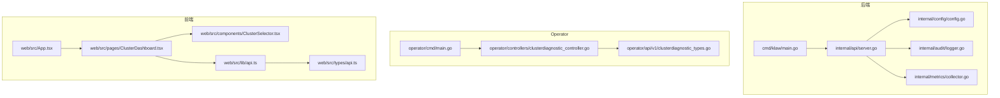
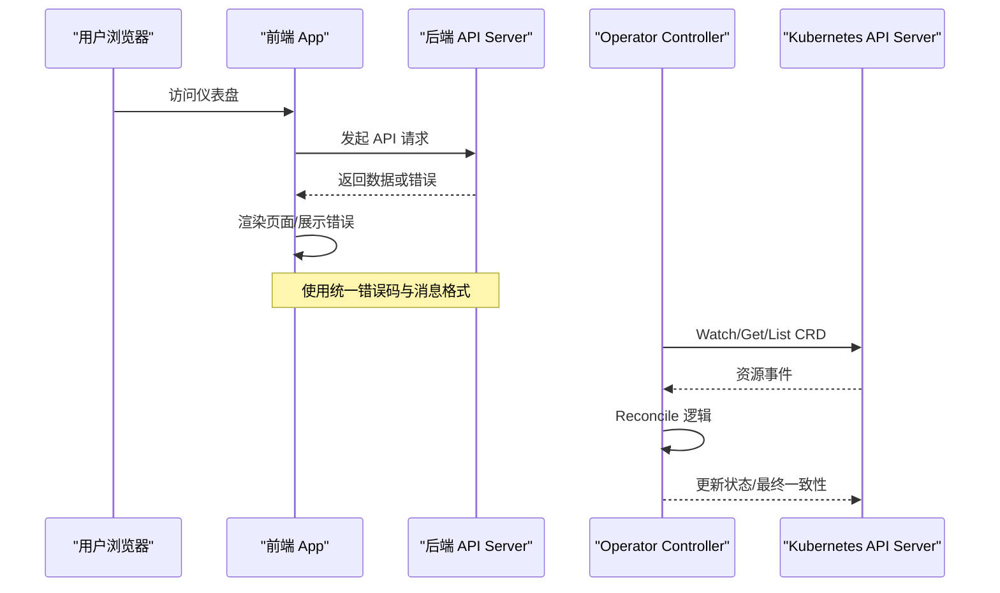
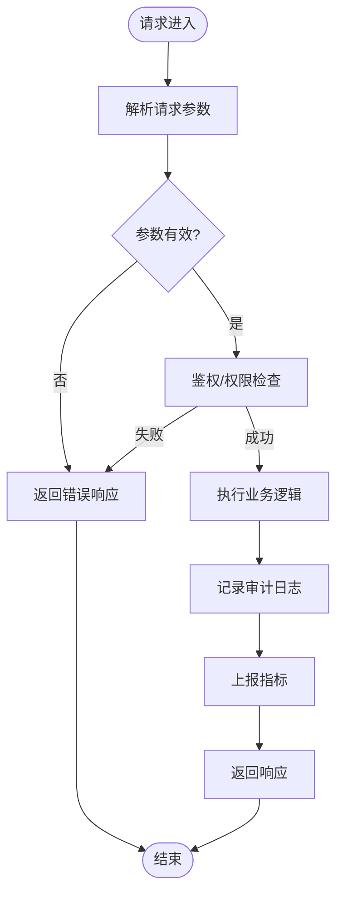
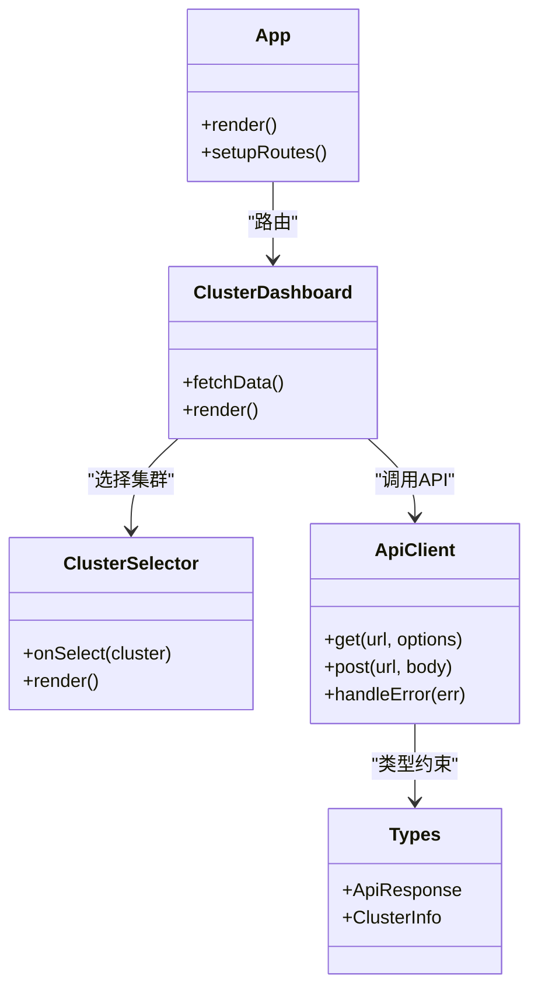
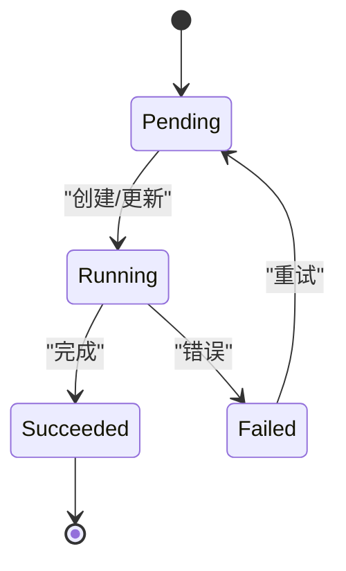
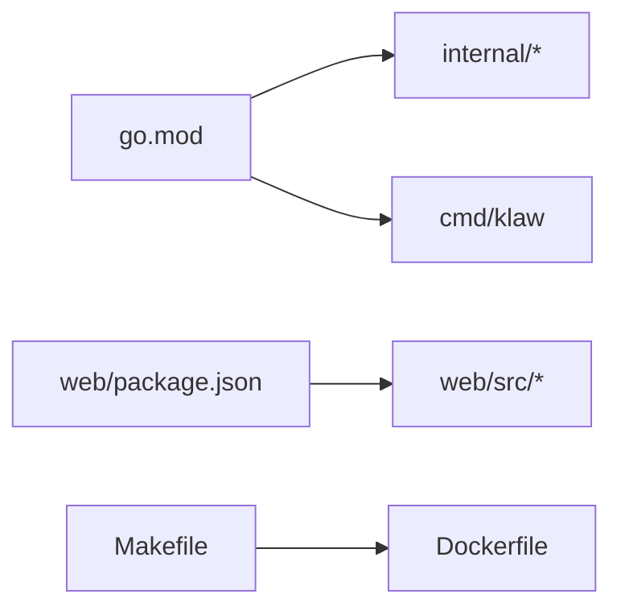

# 代码规范与最佳实践

<cite>
**本文引用的文件**   
- [go.mod](file://go.mod)
- [Makefile](file://Makefile)
- [Dockerfile](file://Dockerfile)
- [cmd/klaw/main.go](file://cmd/klaw/main.go)
- [internal/api/server.go](file://internal/api/server.go)
- [internal/config/config.go](file://internal/config/config.go)
- [internal/audit/logger.go](file://internal/audit/logger.go)
- [internal/metrics/collector.go](file://internal/metrics/collector.go)
- [operator/api/v1/clusterdiagnostic_types.go](file://operator/api/v1/clusterdiagnostic_types.go)
- [operator/controllers/clusterdiagnostic_controller.go](file://operator/controllers/clusterdiagnostic_controller.go)
- [operator/cmd/main.go](file://operator/cmd/main.go)
- [web/src/App.tsx](file://web/src/App.tsx)
- [web/src/pages/ClusterDashboard.tsx](file://web/src/pages/ClusterDashboard.tsx)
- [web/src/components/ClusterSelector.tsx](file://web/src/components/ClusterSelector.tsx)
- [web/src/lib/api.ts](file://web/src/lib/api.ts)
- [web/src/types/api.ts](file://web/src/types/api.ts)
- [web/package.json](file://web/package.json)
</cite>

## 目录
1. [简介](#简介)
2. [项目结构](#项目结构)
3. [核心组件](#核心组件)
4. [架构总览](#架构总览)
5. [详细组件分析](#详细组件分析)
6. [依赖关系分析](#依赖关系分析)
7. [性能考量](#性能考量)
8. [故障排查指南](#故障排查指南)
9. [结论](#结论)
10. [附录](#附录)

## 简介
本文件为 Klaw 平台的代码规范与最佳实践指南，覆盖 Go 后端、TypeScript/React 前端以及 Kubernetes Operator 开发。目标包括：
- 统一命名约定、错误处理、接口设计
- 前端组件设计、状态管理、样式规范
- Operator CRD 设计与控制器实现规范
- 代码组织结构、包依赖管理、注释规范、日志记录标准与安全编码实践
- 提供具体示例路径与反模式避免建议

## 项目结构
Klaw 采用多模块、分层组织：
- cmd/klaw：Go 应用入口
- internal/*：内部业务逻辑（API、配置、审计、指标等）
- operator/*：Kubernetes Operator（CRD、控制器、Helm）
- web/*：TypeScript/React 前端
- configs：运行时配置
- Makefile/Dockerfile：构建与镜像

**图示来源** 
- [cmd/klaw/main.go](file://cmd/klaw/main.go)
- [internal/api/server.go](file://internal/api/server.go)
- [internal/config/config.go](file://internal/config/config.go)
- [internal/audit/logger.go](file://internal/audit/logger.go)
- [internal/metrics/collector.go](file://internal/metrics/collector.go)
- [operator/cmd/main.go](file://operator/cmd/main.go)
- [operator/controllers/clusterdiagnostic_controller.go](file://operator/controllers/clusterdiagnostic_controller.go)
- [operator/api/v1/clusterdiagnostic_types.go](file://operator/api/v1/clusterdiagnostic_types.go)
- [web/src/App.tsx](file://web/src/App.tsx)
- [web/src/pages/ClusterDashboard.tsx](file://web/src/pages/ClusterDashboard.tsx)
- [web/src/components/ClusterSelector.tsx](file://web/src/components/ClusterSelector.tsx)
- [web/src/lib/api.ts](file://web/src/lib/api.ts)
- [web/src/types/api.ts](file://web/src/types/api.ts)

**章节来源**
- [Makefile](file://Makefile)
- [Dockerfile](file://Dockerfile)
- [go.mod](file://go.mod)

## 核心组件
- Go 后端
  - API 服务：HTTP 路由、中间件、请求生命周期
  - 配置加载：配置文件与环境变量合并
  - 审计日志：结构化日志、敏感信息脱敏
  - 指标采集：Prometheus 指标暴露
- Operator
  - CRD 类型定义：字段、版本化、默认值
  - 控制器：Reconcile 循环、事件处理、状态同步
- 前端
  - 页面与组件：职责单一、可复用
  - API 客户端：统一封装、错误处理、重试策略
  - 类型定义：前后端契约一致

**章节来源**
- [internal/api/server.go](file://internal/api/server.go)
- [internal/config/config.go](file://internal/config/config.go)
- [internal/audit/logger.go](file://internal/audit/logger.go)
- [internal/metrics/collector.go](file://internal/metrics/collector.go)
- [operator/api/v1/clusterdiagnostic_types.go](file://operator/api/v1/clusterdiagnostic_types.go)
- [operator/controllers/clusterdiagnostic_controller.go](file://operator/controllers/clusterdiagnostic_controller.go)
- [web/src/lib/api.ts](file://web/src/lib/api.ts)
- [web/src/types/api.ts](file://web/src/types/api.ts)

## 架构总览
Klaw 由后端 API、Operator 与前端组成，通过 HTTP 通信；Operator 负责 CRD 生命周期管理；前端通过 API 获取数据并渲染 UI。

**图示来源** 
- [internal/api/server.go](file://internal/api/server.go)
- [operator/controllers/clusterdiagnostic_controller.go](file://operator/controllers/clusterdiagnostic_controller.go)
- [web/src/App.tsx](file://web/src/App.tsx)
- [web/src/lib/api.ts](file://web/src/lib/api.ts)

## 详细组件分析

### Go 后端代码规范
- 命名约定
  - 包名短小、全小写、无下划线
  - 函数/方法名动词+名词，首字母大写对外导出
  - 常量使用 UPPER_SNAKE_CASE，变量 camelCase
- 错误处理
  - 使用 sentinel error 与 errors.Is/As
  - 包装错误时保留上下文（fmt.Errorf("...: %w", err)）
  - 对上层调用返回明确错误类型，便于分类处理
- 接口设计
  - 面向接口编程，最小化接口方法集
  - 接口定义在独立文件中，实现放在对应包内
  - 使用泛型替代重复的容器类型
- 日志与审计
  - 结构化日志，包含 traceId、请求ID、关键参数
  - 敏感字段脱敏（密码、Token）
  - 审计日志与业务日志分离
- 配置管理
  - 支持 YAML/ENV 双源，优先级清晰
  - 启动时校验必填项，失败快速退出
- 指标与可观测性
  - 暴露 Prometheus 指标，命名遵循前缀规范
  - 关键路径埋点耗时、错误率

**图示来源** 
- [internal/api/server.go](file://internal/api/server.go)
- [internal/audit/logger.go](file://internal/audit/logger.go)
- [internal/metrics/collector.go](file://internal/metrics/collector.go)

**章节来源**
- [internal/api/server.go](file://internal/api/server.go)
- [internal/audit/logger.go](file://internal/audit/logger.go)
- [internal/metrics/collector.go](file://internal/metrics/collector.go)
- [internal/config/config.go](file://internal/config/config.go)

### TypeScript/React 前端代码规范
- 组件设计
  - 单职责、可组合、受控与非受控组件分离
  - 使用 React Hooks 管理状态，避免过度嵌套
  - 公共组件放入 components，页面级组件放入 pages
- 状态管理
  - 局部状态用 useState/useReducer，跨组件共享用 Context
  - 异步状态使用自定义 Hook 封装，统一错误与加载态
- 样式规范
  - Tailwind CSS 优先，原子类组合，避免全局样式污染
  - 主题色、间距、圆角统一在配置中集中管理
- API 客户端
  - 统一封装 fetch/axios，拦截器处理错误与重试
  - 类型安全：请求/响应类型与后端契约一致
- 测试
  - 单元测试覆盖工具函数与 Hook
  - 集成测试模拟网络与 Mock 数据

**图示来源** 
- [web/src/App.tsx](file://web/src/App.tsx)
- [web/src/pages/ClusterDashboard.tsx](file://web/src/pages/ClusterDashboard.tsx)
- [web/src/components/ClusterSelector.tsx](file://web/src/components/ClusterSelector.tsx)
- [web/src/lib/api.ts](file://web/src/lib/api.ts)
- [web/src/types/api.ts](file://web/src/types/api.ts)

**章节来源**
- [web/src/App.tsx](file://web/src/App.tsx)
- [web/src/pages/ClusterDashboard.tsx](file://web/src/pages/ClusterDashboard.tsx)
- [web/src/components/ClusterSelector.tsx](file://web/src/components/ClusterSelector.tsx)
- [web/src/lib/api.ts](file://web/src/lib/api.ts)
- [web/src/types/api.ts](file://web/src/types/api.ts)
- [web/package.json](file://web/package.json)

### Kubernetes Operator 开发规范
- CRD 设计
  - 版本化 API（v1），字段变更保持向后兼容
  - 合理拆分 Spec/Status，Spec 描述期望状态，Status 描述实际状态
  - 使用默认值与验证规则（validation rules）
- 控制器实现
  - Reconcile 幂等，处理删除、更新、创建事件
  - 使用条件判断与最终一致性，避免无限重入
  - 错误处理区分可重试与不可重试
- 权限与 RBAC
  - 最小权限原则，仅授予必要权限
  - 使用 ServiceAccount 与 Role/RoleBinding
- Helm 部署
  - Chart 模板化，values.yaml 管理环境差异
  - 健康检查探针就绪/存活

**图示来源** 
- [operator/api/v1/clusterdiagnostic_types.go](file://operator/api/v1/clusterdiagnostic_types.go)
- [operator/controllers/clusterdiagnostic_controller.go](file://operator/controllers/clusterdiagnostic_controller.go)
- [operator/cmd/main.go](file://operator/cmd/main.go)

**章节来源**
- [operator/api/v1/clusterdiagnostic_types.go](file://operator/api/v1/clusterdiagnostic_types.go)
- [operator/controllers/clusterdiagnostic_controller.go](file://operator/controllers/clusterdiagnostic_controller.go)
- [operator/cmd/main.go](file://operator/cmd/main.go)

## 依赖关系分析
- Go 模块
  - go.mod 声明主模块与依赖版本，使用 go.sum 锁定
  - 内部包通过 internal 隔离，外部不可直接引用
- 前端依赖
  - package.json 管理依赖版本，建议使用 pnpm/yarn 锁定
  - 第三方库选择稳定版本，定期升级
- 构建与镜像
  - Makefile 统一构建命令，Dockerfile 多阶段构建减小镜像体积

**图示来源** 
- [go.mod](file://go.mod)
- [web/package.json](file://web/package.json)
- [Makefile](file://Makefile)
- [Dockerfile](file://Dockerfile)

**章节来源**
- [go.mod](file://go.mod)
- [web/package.json](file://web/package.json)
- [Makefile](file://Makefile)
- [Dockerfile](file://Dockerfile)

## 性能考量
- Go 后端
  - 避免热点路径上的反射与频繁 GC
  - 使用连接池与缓存减少 IO 开销
  - 并发控制与限流保护系统稳定性
- 前端
  - 懒加载路由与组件，减少首屏体积
  - 列表虚拟化与分页加载大数据
  - 图片与静态资源 CDN 加速
- Operator
  - 合理设置 Reconcile 间隔与队列长度
  - 使用 informer 缓存减少 API 压力

[本节为通用指导，不直接分析具体文件]

## 故障排查指南
- 日志定位
  - 启用结构化日志，包含 traceId 与请求上下文
  - 审计日志与业务日志分离，便于合规审计
- 错误分类
  - 区分客户端错误（4xx）、服务端错误（5xx）、业务错误
  - 统一错误码与消息格式，便于前端提示
- 监控告警
  - 关键指标：QPS、延迟、错误率、资源使用率
  - 告警阈值合理设置，避免误报与漏报

**章节来源**
- [internal/audit/logger.go](file://internal/audit/logger.go)
- [internal/metrics/collector.go](file://internal/metrics/collector.go)

## 结论
本规范旨在提升 Klaw 平台代码质量与可维护性，确保前后端与 Operator 的一致性。建议团队在 PR 审查中严格执行，持续优化与演进。

[本节为总结，不直接分析具体文件]

## 附录
- 命名约定速查表
  - 包名：小写、简短
  - 函数：动词+名词，首字母大写导出
  - 常量：UPPER_SNAKE_CASE
- 错误处理清单
  - 是否包装错误？是否保留上下文？是否分类处理？
- 前端组件 Checklist
  - 是否单一职责？是否可复用？是否类型安全？
- Operator 开发 Checklist
  - CRD 是否版本化？控制器是否幂等？RBAC 是否最小权限？

[本节为补充说明，不直接分析具体文件]