# 开发指南

<cite>
**本文引用的文件**   
- [ci.yml](file://.github/workflows/ci.yml)
- [config.yaml](file://configs/config.yaml)
- [config.yaml.example](file://configs/config.yaml.example)
- [Makefile](file://Makefile)
- [Dockerfile](file://Dockerfile)
- [go.mod](file://go.mod)
- [server.go](file://internal/api/server.go)
- [unified_v1.go](file://internal/api/unified_v1.go)
- [handlers_test.go](file://internal/api/handlers_test.go)
- [unified_v1_test.go](file://internal/api/unified_v1_test.go)
- [manager.go](file://internal/alerting/manager.go)
- [manager_test.go](file://internal/alerting/manager_test.go)
- [logger.go](file://internal/audit/logger.go)
- [logger_test.go](file://internal/audit/logger_test.go)
- [manager.go](file://internal/automation/manager.go)
- [manager_test.go](file://internal/automation/manager_test.go)
- [manager.go](file://internal/backup/manager.go)
- [manager_test.go](file://internal/backup/manager_test.go)
- [config.go](file://internal/config/config.go)
- [pipeline.go](file://internal/diag/pipeline.go)
- [pipeline_test.go](file://internal/diag/pipeline_test.go)
- [analyzer.go](file://internal/diag/rules/analyzer.go)
- [engine.go](file://internal/diag/rules/engine.go)
- [types.go](file://internal/diag/rules/types.go)
- [collector.go](file://internal/metrics/collector.go)
- [service.go](file://internal/monitoring/service.go)
- [handler.go](file://internal/ops/handler.go)
- [router.go](file://internal/ops/router.go)
- [store.go](file://internal/storage/store.go)
- [schema.go](file://internal/storage/schema.go)
- [main.go](file://operator/cmd/main.go)
- [clusterdiagnostic_controller.go](file://operator/controllers/clusterdiagnostic_controller.go)
- [nodediagnostic_controller.go](file://operator/controllers/nodediagnostic_controller.go)
- [schedule_controller.go](file://operator/controllers/schedule_controller.go)
- [Chart.yaml](file://helm/klaw/Chart.yaml)
- [values.yaml](file://helm/klaw/values.yaml)
- [package.json](file://web/package.json)
- [vitest.config.ts](file://web/vitest.config.ts)
- [test.sh](file://web/test.sh)
- [api.test.ts](file://web/src/__tests__/integration/api.test.ts)
- [error-handling.test.tsx](file://web/src/__tests__/integration/error-handling.test.tsx)
- [ClusterDashboard.test.tsx](file://web/src/__tests__/unit/ClusterDashboard.test.tsx)
- [DeploymentsPage.test.tsx](file://web/src/__tests__/unit/DeploymentsPage.test.tsx)
- [NodesPage.test.tsx](file://web/src/__tests__/unit/NodesPage.test.tsx)
- [PodsPage.test.tsx](file://web/src/__tests__/unit/PodsPage.test.tsx)
</cite>

## 目录
1. [简介](#简介)
2. [项目结构](#项目结构)
3. [核心组件](#核心组件)
4. [架构总览](#架构总览)
5. [详细组件分析](#详细组件分析)
6. [依赖分析](#依赖分析)
7. [性能考虑](#性能考虑)
8. [故障排查指南](#故障排查指南)
9. [结论](#结论)
10. [附录](#附录)

## 简介
本指南面向 Klaw 平台的开发者，提供从环境搭建、代码规范与最佳实践、测试策略（单元与集成）、持续集成配置、调试技巧、性能分析到贡献流程的完整说明。Klaw 是一个以 Go 为核心的后端平台，包含诊断、自动化、备份、监控、审计等能力，并提供 Web 前端与 Kubernetes Operator。文档将帮助你在本地高效开发、稳定提交并通过 CI。

## 项目结构
Klaw 采用多模块、分层清晰的工程组织：
- 根目录：构建脚本、容器镜像定义、Go 模块声明、CI 工作流
- configs：运行时配置与示例
- internal：后端核心逻辑，按功能域划分（API、诊断、自动化、备份、存储、监控、审计等）
- operator：Kubernetes Operator，管理集群诊断任务
- helm：Helm Chart，用于部署 Klaw
- web：React + TypeScript 前端，使用 Vite 和 Vitest
- docs：项目文档与实现总结

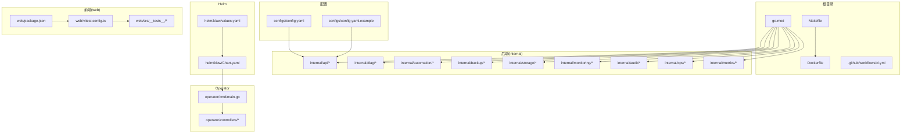

图表来源
- [Makefile](file://Makefile)
- [Dockerfile](file://Dockerfile)
- [go.mod](file://go.mod)
- [ci.yml](file://.github/workflows/ci.yml)
- [config.yaml](file://configs/config.yaml)
- [config.yaml.example](file://configs/config.yaml.example)
- [server.go](file://internal/api/server.go)
- [pipeline.go](file://internal/diag/pipeline.go)
- [manager.go](file://internal/automation/manager.go)
- [manager.go](file://internal/backup/manager.go)
- [store.go](file://internal/storage/store.go)
- [service.go](file://internal/monitoring/service.go)
- [logger.go](file://internal/audit/logger.go)
- [handler.go](file://internal/ops/handler.go)
- [router.go](file://internal/ops/router.go)
- [collector.go](file://internal/metrics/collector.go)
- [main.go](file://operator/cmd/main.go)
- [clusterdiagnostic_controller.go](file://operator/controllers/clusterdiagnostic_controller.go)
- [nodediagnostic_controller.go](file://operator/controllers/nodediagnostic_controller.go)
- [schedule_controller.go](file://operator/controllers/schedule_controller.go)
- [Chart.yaml](file://helm/klaw/Chart.yaml)
- [values.yaml](file://helm/klaw/values.yaml)
- [package.json](file://web/package.json)
- [vitest.config.ts](file://web/vitest.config.ts)

章节来源
- [Makefile](file://Makefile)
- [Dockerfile](file://Dockerfile)
- [go.mod](file://go.mod)
- [ci.yml](file://.github/workflows/ci.yml)
- [config.yaml](file://configs/config.yaml)
- [config.yaml.example](file://configs/config.yaml.example)

## 核心组件
- API 服务层：HTTP 路由与处理器，统一版本接口，鉴权与审计日志
- 诊断管道：规则引擎、采集器、分析器、报告生成器
- 自动化管理器：内置动作与扩展点
- 备份管理器：集群状态备份与恢复
- 存储层：Schema 定义与持久化存储
- 监控与指标：服务健康检查与指标收集
- 审计与安全：操作日志与安全策略
- 运维接口：内部运维端点与路由
- Operator：Kubernetes CRD 控制器，编排诊断任务
- Helm：应用打包与部署
- Web 前端：页面、组件、单元测试与集成测试

章节来源
- [server.go](file://internal/api/server.go)
- [unified_v1.go](file://internal/api/unified_v1.go)
- [pipeline.go](file://internal/diag/pipeline.go)
- [analyzer.go](file://internal/diag/rules/analyzer.go)
- [engine.go](file://internal/diag/rules/engine.go)
- [types.go](file://internal/diag/rules/types.go)
- [manager.go](file://internal/automation/manager.go)
- [manager.go](file://internal/backup/manager.go)
- [store.go](file://internal/storage/store.go)
- [schema.go](file://internal/storage/schema.go)
- [service.go](file://internal/monitoring/service.go)
- [logger.go](file://internal/audit/logger.go)
- [handler.go](file://internal/ops/handler.go)
- [router.go](file://internal/ops/router.go)
- [collector.go](file://internal/metrics/collector.go)
- [main.go](file://operator/cmd/main.go)
- [clusterdiagnostic_controller.go](file://operator/controllers/clusterdiagnostic_controller.go)
- [nodediagnostic_controller.go](file://operator/controllers/nodediagnostic_controller.go)
- [schedule_controller.go](file://operator/controllers/schedule_controller.go)
- [Chart.yaml](file://helm/klaw/Chart.yaml)
- [values.yaml](file://helm/klaw/values.yaml)
- [package.json](file://web/package.json)

## 架构总览
Klaw 的整体架构由“API 服务 + 诊断管道 + 存储 + 监控 + Operator + Helm + Web”构成。请求进入 API 层后，根据路由分发至具体处理器；业务逻辑调用诊断管道、自动化、备份等子系统；结果通过存储持久化，并通过监控与审计进行观测与记录；Operator 负责在 Kubernetes 中调度与执行诊断任务；Web 前端通过 API 与后端交互。

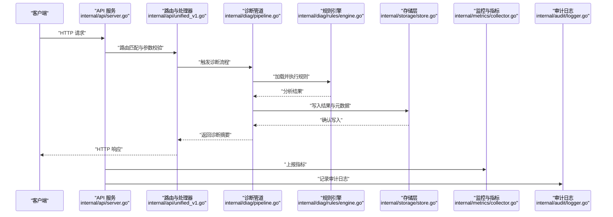

图表来源
- [server.go](file://internal/api/server.go)
- [unified_v1.go](file://internal/api/unified_v1.go)
- [pipeline.go](file://internal/diag/pipeline.go)
- [engine.go](file://internal/diag/rules/engine.go)
- [store.go](file://internal/storage/store.go)
- [collector.go](file://internal/metrics/collector.go)
- [logger.go](file://internal/audit/logger.go)

## 详细组件分析

### API 服务与统一版本接口
- HTTP 服务器初始化、中间件、路由注册
- 统一版本接口定义与处理器实现
- 错误处理与响应封装

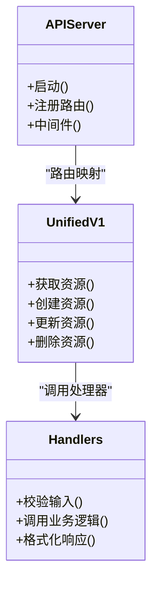

图表来源
- [server.go](file://internal/api/server.go)
- [unified_v1.go](file://internal/api/unified_v1.go)

章节来源
- [server.go](file://internal/api/server.go)
- [unified_v1.go](file://internal/api/unified_v1.go)
- [handlers_test.go](file://internal/api/handlers_test.go)
- [unified_v1_test.go](file://internal/api/unified_v1_test.go)

### 诊断管道与规则引擎
- 管道编排：采集、分析、报告
- 规则加载与执行：类型定义、引擎调度、分析器
- 错误与边界处理：超时、重试、降级

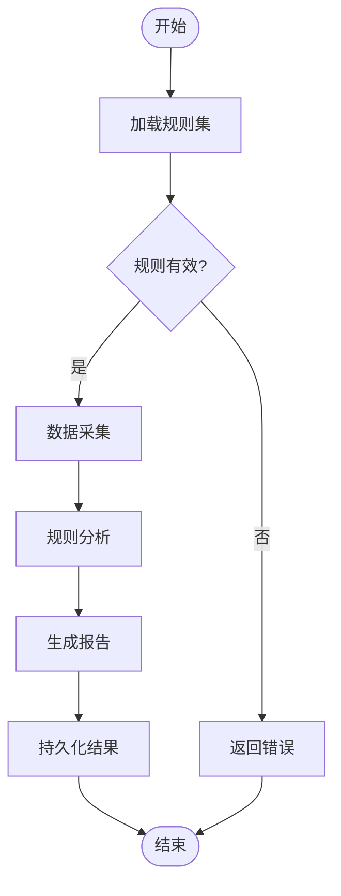

图表来源
- [pipeline.go](file://internal/diag/pipeline.go)
- [analyzer.go](file://internal/diag/rules/analyzer.go)
- [engine.go](file://internal/diag/rules/engine.go)
- [types.go](file://internal/diag/rules/types.go)

章节来源
- [pipeline.go](file://internal/diag/pipeline.go)
- [pipeline_test.go](file://internal/diag/pipeline_test.go)
- [analyzer.go](file://internal/diag/rules/analyzer.go)
- [engine.go](file://internal/diag/rules/engine.go)
- [types.go](file://internal/diag/rules/types.go)

### 自动化与备份管理器
- 自动化：内置动作、扩展点、任务编排
- 备份：集群状态快照、恢复流程、一致性保障

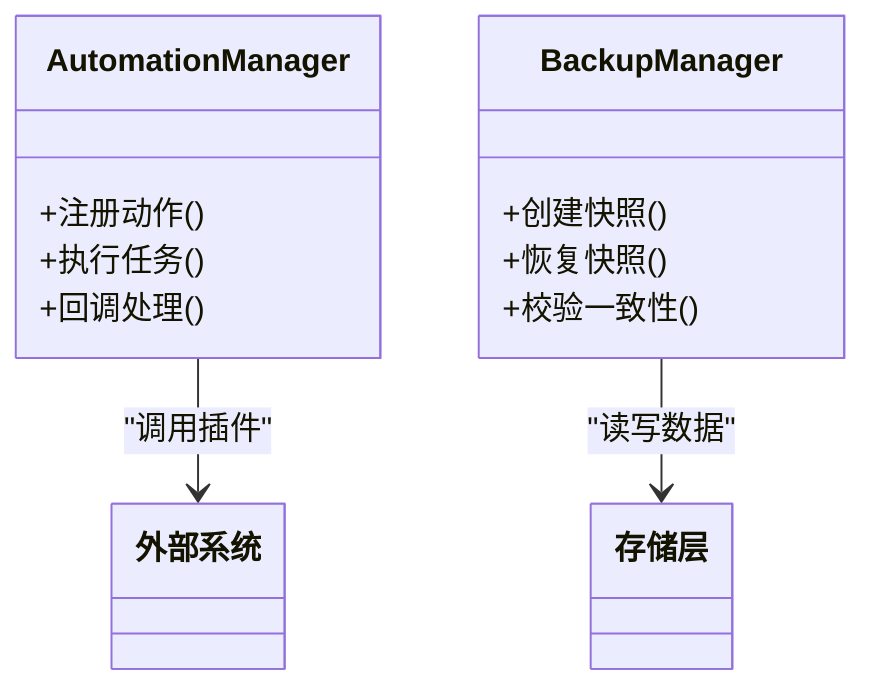

图表来源
- [manager.go](file://internal/automation/manager.go)
- [manager.go](file://internal/backup/manager.go)

章节来源
- [manager.go](file://internal/automation/manager.go)
- [manager_test.go](file://internal/automation/manager_test.go)
- [manager.go](file://internal/backup/manager.go)
- [manager_test.go](file://internal/backup/manager_test.go)

### 存储层与 Schema
- Schema 定义：表结构、索引、约束
- 存储实现：CRUD 操作、事务、错误处理

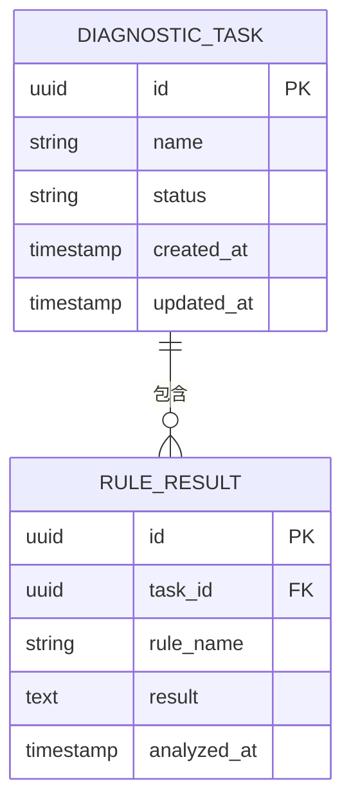

图表来源
- [schema.go](file://internal/storage/schema.go)
- [store.go](file://internal/storage/store.go)

章节来源
- [schema.go](file://internal/storage/schema.go)
- [store.go](file://internal/storage/store.go)

### 监控与指标
- 指标收集：服务健康、QPS、延迟、错误率
- 监控服务：聚合与上报

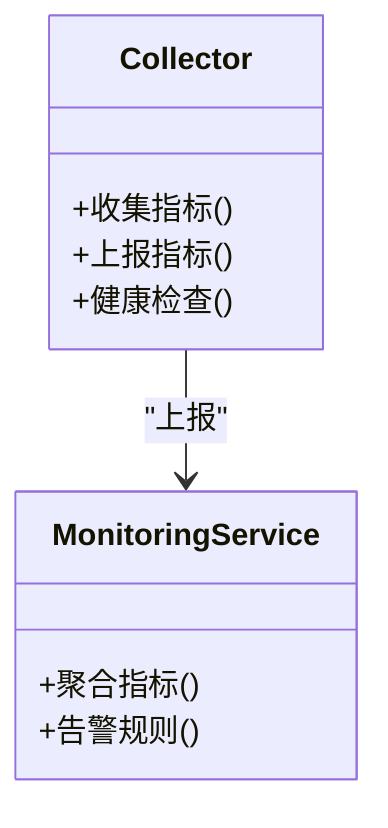

图表来源
- [collector.go](file://internal/metrics/collector.go)
- [service.go](file://internal/monitoring/service.go)

章节来源
- [collector.go](file://internal/metrics/collector.go)
- [service.go](file://internal/monitoring/service.go)

### 审计与安全
- 审计日志：操作记录、安全事件
- 安全策略：访问控制、敏感信息脱敏

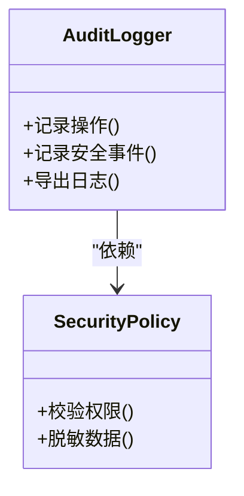

图表来源
- [logger.go](file://internal/audit/logger.go)

章节来源
- [logger.go](file://internal/audit/logger.go)
- [logger_test.go](file://internal/audit/logger_test.go)

### 运维接口
- 内部运维端点：健康检查、调试信息
- 路由与处理器：权限控制、限流

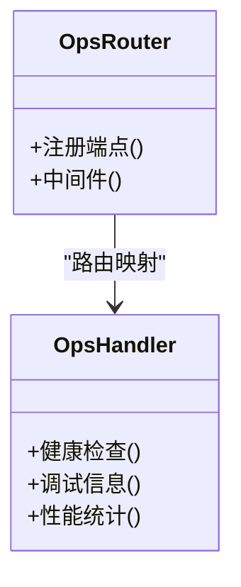

图表来源
- [handler.go](file://internal/ops/handler.go)
- [router.go](file://internal/ops/router.go)

章节来源
- [handler.go](file://internal/ops/handler.go)
- [router.go](file://internal/ops/router.go)

### Operator 与控制器
- 主程序：初始化控制器、启动管理器
- 控制器：集群诊断、节点诊断、定时任务

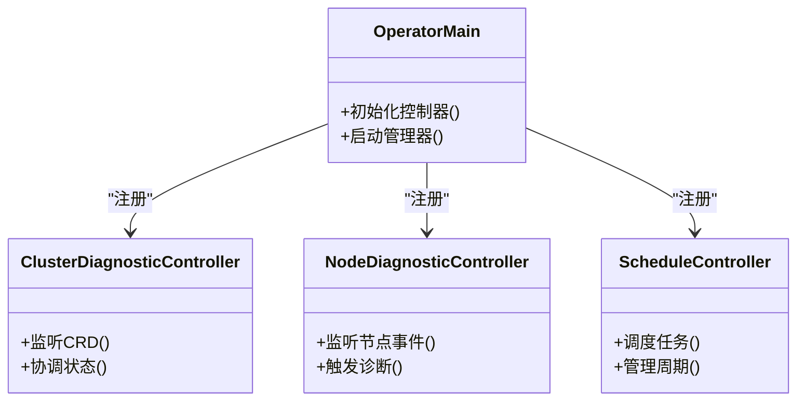

图表来源
- [main.go](file://operator/cmd/main.go)
- [clusterdiagnostic_controller.go](file://operator/controllers/clusterdiagnostic_controller.go)
- [nodediagnostic_controller.go](file://operator/controllers/nodediagnostic_controller.go)
- [schedule_controller.go](file://operator/controllers/schedule_controller.go)

章节来源
- [main.go](file://operator/cmd/main.go)
- [clusterdiagnostic_controller.go](file://operator/controllers/clusterdiagnostic_controller.go)
- [nodediagnostic_controller.go](file://operator/controllers/nodediagnostic_controller.go)
- [schedule_controller.go](file://operator/controllers/schedule_controller.go)

### Helm 部署
- Chart 定义：应用元数据、依赖、模板
- Values：可配置参数、默认值

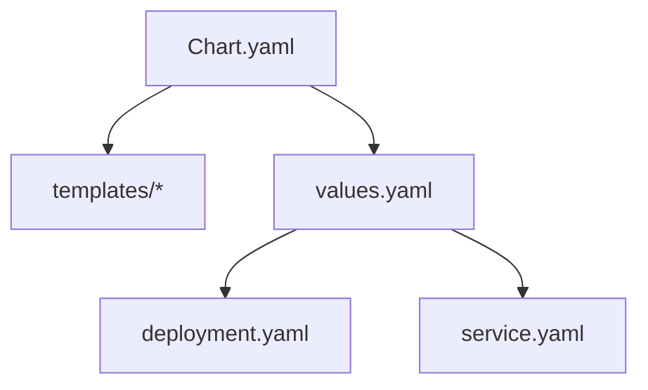

图表来源
- [Chart.yaml](file://helm/klaw/Chart.yaml)
- [values.yaml](file://helm/klaw/values.yaml)

章节来源
- [Chart.yaml](file://helm/klaw/Chart.yaml)
- [values.yaml](file://helm/klaw/values.yaml)

### Web 前端与测试
- 包管理：依赖、脚本、构建配置
- 测试框架：Vitest 配置、单元测试、集成测试

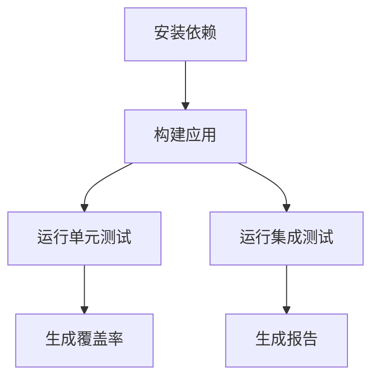

图表来源
- [package.json](file://web/package.json)
- [vitest.config.ts](file://web/vitest.config.ts)
- [test.sh](file://web/test.sh)

章节来源
- [package.json](file://web/package.json)
- [vitest.config.ts](file://web/vitest.config.ts)
- [test.sh](file://web/test.sh)
- [api.test.ts](file://web/src/__tests__/integration/api.test.ts)
- [error-handling.test.tsx](file://web/src/__tests__/integration/error-handling.test.tsx)
- [ClusterDashboard.test.tsx](file://web/src/__tests__/unit/ClusterDashboard.test.tsx)
- [DeploymentsPage.test.tsx](file://web/src/__tests__/unit/DeploymentsPage.test.tsx)
- [NodesPage.test.tsx](file://web/src/__tests__/unit/NodesPage.test.tsx)
- [PodsPage.test.tsx](file://web/src/__tests__/unit/PodsPage.test.tsx)

## 依赖分析
- Go 模块依赖：后端各子模块通过 go.mod 管理版本与依赖关系
- 前端依赖：web/package.json 管理 JavaScript/TypeScript 依赖
- 构建与部署：Makefile 与 Dockerfile 定义构建流程，Helm 定义部署模板

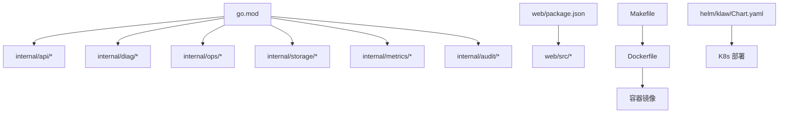

图表来源
- [go.mod](file://go.mod)
- [package.json](file://web/package.json)
- [Makefile](file://Makefile)
- [Dockerfile](file://Dockerfile)
- [Chart.yaml](file://helm/klaw/Chart.yaml)

章节来源
- [go.mod](file://go.mod)
- [package.json](file://web/package.json)
- [Makefile](file://Makefile)
- [Dockerfile](file://Dockerfile)
- [Chart.yaml](file://helm/klaw/Chart.yaml)

## 性能考虑
- API 层：连接池、缓存、异步处理、限流
- 诊断管道：并行采集、增量分析、结果缓存
- 存储层：索引优化、批量写入、事务隔离级别
- 监控与指标：采样、聚合、降采样
- 前端：懒加载、虚拟滚动、请求合并

[本节为通用指导，不直接分析具体文件]

## 故障排查指南
- API 错误：检查路由、参数校验、业务逻辑异常
- 诊断失败：查看规则加载、采集器状态、分析器输出
- 存储问题：验证 Schema、连接字符串、权限
- 监控缺失：检查指标上报、健康检查端点
- 审计日志：确认日志级别、输出路径、权限
- Operator 控制器：查看事件、状态、日志

章节来源
- [handlers_test.go](file://internal/api/handlers_test.go)
- [unified_v1_test.go](file://internal/api/unified_v1_test.go)
- [pipeline_test.go](file://internal/diag/pipeline_test.go)
- [logger.go](file://internal/audit/logger.go)
- [collector.go](file://internal/metrics/collector.go)
- [main.go](file://operator/cmd/main.go)

## 结论
Klaw 平台通过清晰的分层架构与模块化设计，提供了强大的诊断、自动化、备份与监控能力。遵循本文的代码规范、测试策略与 CI 流程，可以确保代码质量与交付稳定性。建议在新功能开发时同步完善单元测试与集成测试，并在 PR 中附上性能分析与故障排查记录。

[本节为总结性内容，不直接分析具体文件]

## 附录
- 开发环境搭建：安装 Go、Node.js、Kubernetes 工具链，配置环境变量
- 代码规范：命名约定、注释风格、错误处理模式
- 单元测试：覆盖关键逻辑、模拟外部依赖、断言策略
- 集成测试：端到端流程、数据库与 API 交互、Mock 服务
- 持续集成：GitHub Actions 配置、构建、测试、发布
- 代码审查：PR 模板、检查清单、评审要点
- 调试技巧：日志级别、堆栈跟踪、性能剖析
- 贡献流程：分支策略、提交规范、版本发布

[本节为补充信息，不直接分析具体文件]