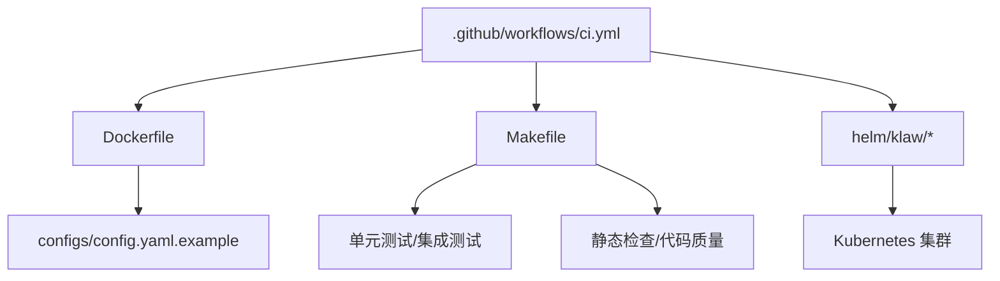
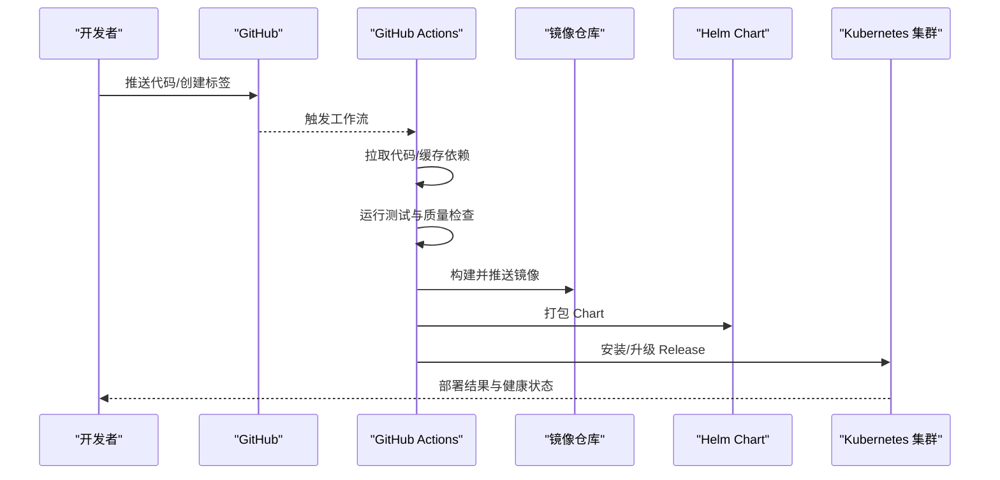
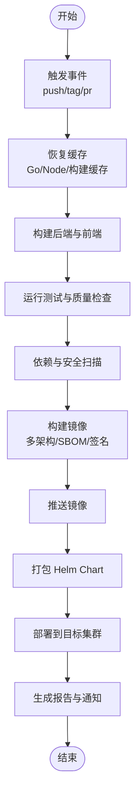
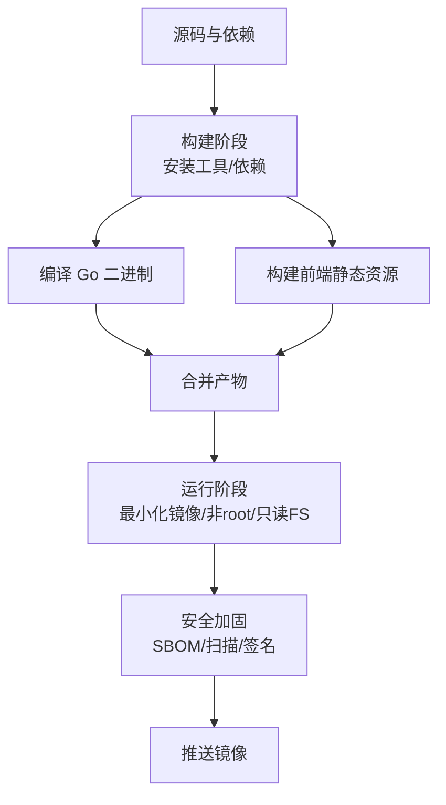
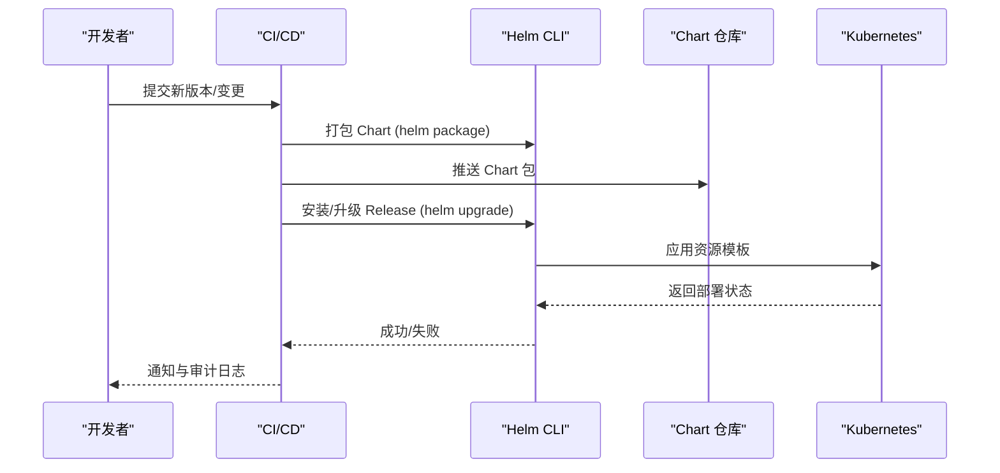
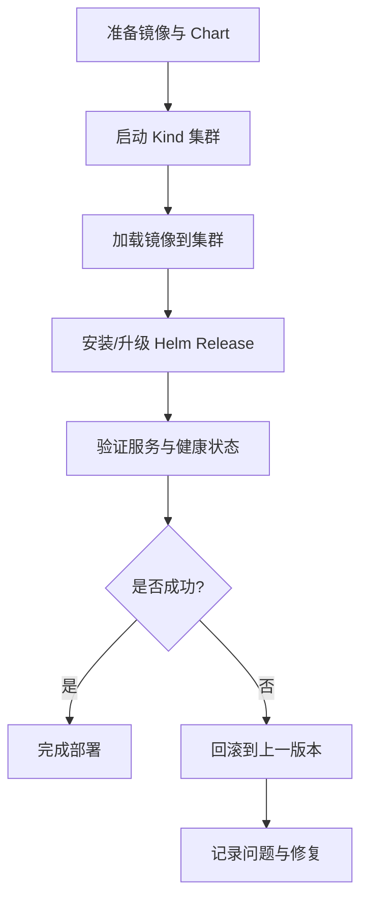
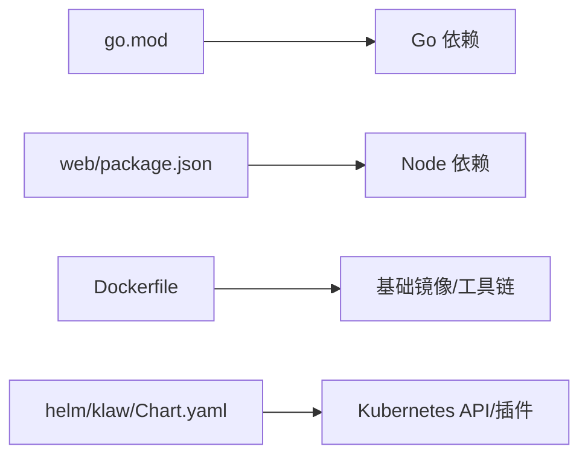

# 持续集成与部署

<cite>
**本文引用的文件**
- [ci.yml](file://.github/workflows/ci.yml)
- [Dockerfile](file://Dockerfile)
- [Makefile](file://Makefile)
- [config.yaml.example](file://configs/config.yaml.example)
- [README.md](file://deployment/README.md)
- [cluster-config.yaml](file://deployment/kind/cluster-config.yaml)
- [manage.sh](file://deployment/kind/manage.sh)
- [Chart.yaml](file://helm/klaw/Chart.yaml)
- [values.yaml](file://helm/klaw/values.yaml)
- [go.mod](file://go.mod)
</cite>

## 目录
1. [简介](#简介)
2. [项目结构](#项目结构)
3. [核心组件](#核心组件)
4. [架构总览](#架构总览)
5. [详细组件分析](#详细组件分析)
6. [依赖关系分析](#依赖关系分析)
7. [性能考虑](#性能考虑)
8. [故障排查指南](#故障排查指南)
9. [结论](#结论)
10. [附录](#附录)

## 简介
本文件面向 Klaw 平台的持续集成与持续交付（CI/CD）实践，覆盖 GitHub Actions 工作流、Docker 多阶段构建优化、Helm Chart 发布流程、Kubernetes 集群自动化部署、环境变量与密钥管理、版本管理与回滚策略，以及本地开发环境搭建与调试配置。文档以仓库现有工件为依据，提供可操作的步骤与最佳实践建议，帮助团队快速建立稳定可靠的交付流水线。

## 项目结构
围绕 CI/CD 的关键目录与文件：
- .github/workflows/ci.yml：GitHub Actions 工作流定义
- Dockerfile：容器镜像构建脚本
- Makefile：常用构建与测试命令封装
- configs/config.yaml.example：应用配置示例
- deployment/README.md 与 deployment/kind/*：本地 Kind 集群与部署说明
- helm/klaw/*：Helm Chart 定义与值模板
- go.mod：Go 模块依赖声明

图表来源
- [ci.yml:1-200](file://.github/workflows/ci.yml#L1-L200)
- [Dockerfile:1-200](file://Dockerfile#L1-L200)
- [Makefile:1-200](file://Makefile#L1-L200)
- [Chart.yaml:1-200](file://helm/klaw/Chart.yaml#L1-L200)
- [values.yaml:1-200](file://helm/klaw/values.yaml#L1-L200)

章节来源
- [.github/workflows/ci.yml:1-200](file://.github/workflows/ci.yml#L1-L200)
- [Dockerfile:1-200](file://Dockerfile#L1-L200)
- [Makefile:1-200](file://Makefile#L1-L200)
- [deployment/README.md:1-200](file://deployment/README.md#L1-L200)
- [helm/klaw/Chart.yaml:1-200](file://helm/klaw/Chart.yaml#L1-L200)
- [helm/klaw/values.yaml:1-200](file://helm/klaw/values.yaml#L1-L200)

## 核心组件
- GitHub Actions 工作流（ci.yml）
  - 触发条件：分支推送、标签、PR 事件
  - 任务矩阵：多 Go 版本、前端构建与测试并行执行
  - 缓存：Go 模块缓存、Node 依赖缓存加速构建
  - 产物：二进制、前端静态资源、容器镜像、Helm Chart 包
  - 安全：Secrets 注入、签名校验、镜像扫描
- Docker 多阶段构建（Dockerfile）
  - 构建阶段：安装依赖、编译 Go 与前端
  - 运行阶段：最小化基础镜像、非 root 用户、只读根文件系统
  - 安全：SBOM 生成、漏洞扫描、镜像签名
- Helm Chart（helm/klaw）
  - 模板参数化：服务端口、副本数、资源限制、外部依赖
  - 环境隔离：values 分层与环境变量注入
  - 发布策略：滚动更新、健康检查、回滚
- Kubernetes 部署（deployment/kind）
  - 本地集群：Kind 配置文件与脚本
  - 部署流程：加载镜像、安装 Chart、验证服务
- 配置与密钥
  - 应用配置：config.yaml 与 configmap
  - 密钥管理：GitHub Secrets、Kubernetes Secret、外部密钥服务

章节来源
- [.github/workflows/ci.yml:1-200](file://.github/workflows/ci.yml#L1-L200)
- [Dockerfile:1-200](file://Dockerfile#L1-L200)
- [helm/klaw/Chart.yaml:1-200](file://helm/klaw/Chart.yaml#L1-L200)
- [helm/klaw/values.yaml:1-200](file://helm/klaw/values.yaml#L1-L200)
- [deployment/README.md:1-200](file://deployment/README.md#L1-L200)
- [deployment/kind/cluster-config.yaml:1-200](file://deployment/kind/cluster-config.yaml#L1-L200)
- [deployment/kind/manage.sh:1-200](file://deployment/kind/manage.sh#L1-L200)
- [configs/config.yaml.example:1-200](file://configs/config.yaml.example#L1-L200)

## 架构总览
下图展示从代码提交到生产部署的端到端流水线，包括构建、测试、镜像打包、Helm 发布与集群部署。

图表来源
- [.github/workflows/ci.yml:1-200](file://.github/workflows/ci.yml#L1-L200)
- [Dockerfile:1-200](file://Dockerfile#L1-L200)
- [helm/klaw/Chart.yaml:1-200](file://helm/klaw/Chart.yaml#L1-L200)
- [helm/klaw/values.yaml:1-200](file://helm/klaw/values.yaml#L1-L200)

## 详细组件分析

### GitHub Actions 工作流（构建流水线、测试执行、代码质量检查、容器镜像构建）
- 触发与矩阵
  - 支持 push、tag、pull_request 事件
  - 使用 Go 版本矩阵与 Node 版本矩阵并行执行
- 缓存与加速
  - Go 模块缓存、Node 依赖缓存、构建缓存
- 测试与质量
  - Go 单元测试/集成测试、覆盖率收集
  - 前端测试与构建产物校验
  - 静态检查（lint）、安全扫描（依赖漏洞）
- 镜像构建与发布
  - 多架构镜像构建、SBOM 生成、漏洞扫描
  - 镜像签名与推送至镜像仓库
- 产物归档与通知
  - 测试结果、覆盖率报告、镜像元数据归档
  - 失败告警与成功通知

图表来源
- [.github/workflows/ci.yml:1-200](file://.github/workflows/ci.yml#L1-L200)

章节来源
- [.github/workflows/ci.yml:1-200](file://.github/workflows/ci.yml#L1-L200)

### Docker 多阶段构建优化
- 构建阶段
  - 安装 Go/Node 工具链与依赖
  - 编译 Go 二进制与前端静态资源
  - 启用构建缓存层与增量编译
- 运行阶段
  - 使用精简基础镜像（如 distroless/alpine）
  - 非 root 用户运行、只读根文件系统
  - 仅包含运行时必要文件
- 安全加固
  - 生成 SBOM 与镜像清单
  - 漏洞扫描与阈值控制
  - 镜像签名与可信仓库

图表来源
- [Dockerfile:1-200](file://Dockerfile#L1-L200)

章节来源
- [Dockerfile:1-200](file://Dockerfile#L1-L200)

### Helm Chart 发布流程
- Chart 结构
  - Chart.yaml：版本、API 版本、依赖描述
  - values.yaml：默认参数与环境变量映射
  - templates：Kubernetes 资源模板（Deployment、Service、ConfigMap、Secret）
- 发布策略
  - 使用 --set 或 values 文件覆盖参数
  - 滚动更新与就绪探针
  - 失败自动回滚与保留历史
- 环境隔离
  - 通过 values 分层（dev/staging/prod）
  - ConfigMap/Secret 注入敏感信息
  - 命名空间与资源配额隔离

图表来源
- [helm/klaw/Chart.yaml:1-200](file://helm/klaw/Chart.yaml#L1-L200)
- [helm/klaw/values.yaml:1-200](file://helm/klaw/values.yaml#L1-L200)

章节来源
- [helm/klaw/Chart.yaml:1-200](file://helm/klaw/Chart.yaml#L1-L200)
- [helm/klaw/values.yaml:1-200](file://helm/klaw/values.yaml#L1-L200)

### Kubernetes 集群部署自动化
- 本地开发环境
  - 使用 Kind 创建本地集群
  - 加载镜像与安装 Chart
  - 端口转发与服务访问
- 生产部署
  - 使用 kubectl/helm 进行发布
  - 蓝绿/金丝雀策略（可选）
  - 健康检查与自动回滚
- 运维脚本
  - manage.sh 提供集群生命周期管理
  - cluster-config.yaml 定义节点与网络配置

图表来源
- [deployment/kind/cluster-config.yaml:1-200](file://deployment/kind/cluster-config.yaml#L1-L200)
- [deployment/kind/manage.sh:1-200](file://deployment/kind/manage.sh#L1-L200)
- [deployment/README.md:1-200](file://deployment/README.md#L1-L200)

章节来源
- [deployment/README.md:1-200](file://deployment/README.md#L1-L200)
- [deployment/kind/cluster-config.yaml:1-200](file://deployment/kind/cluster-config.yaml#L1-L200)
- [deployment/kind/manage.sh:1-200](file://deployment/kind/manage.sh#L1-L200)

### 环境变量管理与密钥安全存储
- 环境变量
  - 应用配置通过 config.yaml 与 ConfigMap 注入
  - 区分不同环境的值（dev/staging/prod）
- 密钥管理
  - GitHub Secrets 存储 CI/CD 密钥（镜像仓库、云厂商、扫描工具）
  - Kubernetes Secret 存储运行时敏感信息（数据库密码、API Key）
  - 外部密钥服务（Vault/KMS）集成（可选）
- 安全最佳实践
  - 最小权限原则与角色分离
  - 定期轮换密钥与审计日志
  - 禁止在日志与制品中泄露敏感信息

章节来源
- [configs/config.yaml.example:1-200](file://configs/config.yaml.example#L1-L200)
- [.github/workflows/ci.yml:1-200](file://.github/workflows/ci.yml#L1-L200)

### 版本管理与回滚策略
- 版本管理
  - Git Tag 驱动镜像与 Chart 版本
  - 语义化版本（SemVer）规范
  - 构建产物与镜像标签关联
- 回滚策略
  - Helm 保留历史版本，一键回滚
  - 镜像不可变标签与快照回退
  - 灰度发布与快速回切
- 审计与追踪
  - 变更记录与发布日志
  - 健康检查与告警联动

章节来源
- [helm/klaw/Chart.yaml:1-200](file://helm/klaw/Chart.yaml#L1-L200)
- [.github/workflows/ci.yml:1-200](file://.github/workflows/ci.yml#L1-L200)

### 本地开发环境搭建与调试配置
- 前置要求
  - Go、Node.js、Docker、kubectl、Helm、Kind
- 快速启动
  - 使用 make 命令构建与测试
  - 启动本地 Kind 集群并加载镜像
  - 安装 Helm Chart 并访问服务
- 调试技巧
  - 启用详细日志与调试端口
  - 使用 kubectl logs/port-forward 查看服务
  - 模拟外部依赖（Mock/Stub）

章节来源
- [Makefile:1-200](file://Makefile#L1-200)
- [deployment/README.md:1-200](file://deployment/README.md#L1-200)
- [deployment/kind/manage.sh:1-200](file://deployment/kind/manage.sh#L1-200)

## 依赖关系分析
- 模块依赖
  - Go 模块依赖由 go.mod 管理
  - 前端依赖由 package.json 管理（位于 web 目录）
- 构建依赖
  - Docker 构建依赖基础镜像与工具链
  - Helm Chart 依赖 Kubernetes API 版本与插件
- 外部依赖
  - 镜像仓库、云厂商 SDK、监控与日志服务

图表来源
- [go.mod:1-200](file://go.mod#L1-L200)
- [Dockerfile:1-200](file://Dockerfile#L1-L200)
- [helm/klaw/Chart.yaml:1-200](file://helm/klaw/Chart.yaml#L1-L200)

章节来源
- [go.mod:1-200](file://go.mod#L1-L200)

## 性能考虑
- 构建优化
  - 使用多阶段构建减少镜像体积
  - 启用依赖缓存与并行构建
  - 按需安装依赖与清理临时文件
- 测试优化
  - 并行执行测试用例
  - 增量测试与跳过无关测试
  - 使用 Mock 与 Stub 减少外部依赖
- 部署优化
  - 滚动更新与就绪探针
  - 资源限制与水平扩展
  - 镜像分层与内容寻址

[本节为通用指导，不直接分析具体文件]

## 故障排查指南
- 常见问题
  - 构建失败：检查依赖缓存与工具链版本
  - 测试失败：确认环境变量与外部依赖可用性
  - 镜像推送失败：验证仓库权限与网络连通性
  - Helm 部署失败：检查模板参数与集群权限
- 诊断方法
  - 查看 CI/CD 日志与构建产物
  - 使用 kubectl describe/logs 排查 Pod/Service
  - 启用详细日志与调试模式
- 回滚与恢复
  - 使用 Helm rollback 回退到上一版本
  - 切换镜像标签到已知稳定版本
  - 恢复备份与数据一致性校验

章节来源
- [.github/workflows/ci.yml:1-200](file://.github/workflows/ci.yml#L1-L200)
- [deployment/README.md:1-200](file://deployment/README.md#L1-200)

## 结论
通过 GitHub Actions、Docker 多阶段构建、Helm Chart 与 Kubernetes 的协同，Klaw 平台实现了高效、安全、可追溯的 CI/CD 流水线。结合严格的环境变量与密钥管理、完善的版本与回滚策略，以及便捷的本地开发体验，团队能够快速迭代并稳定交付高质量软件。

[本节为总结性内容，不直接分析具体文件]

## 附录
- 参考命令
  - 构建与测试：make build test
  - 启动本地集群：kind create cluster
  - 安装 Chart：helm install klaw ./helm/klaw -f values.yaml
  - 查看日志：kubectl logs -l app=klaw
- 最佳实践清单
  - 使用语义化版本与不可变镜像标签
  - 最小权限与密钥轮换
  - 自动化测试与质量门禁
  - 灰度发布与快速回滚

[本节为补充信息，不直接分析具体文件]