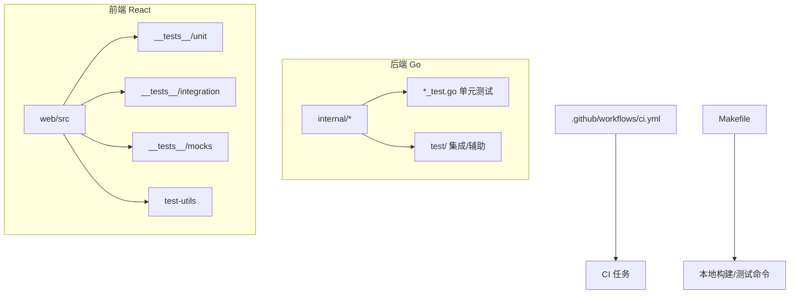
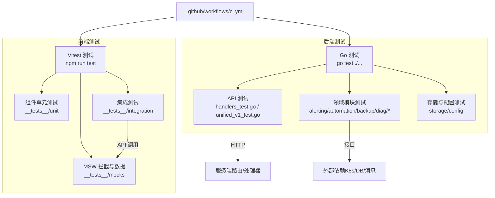
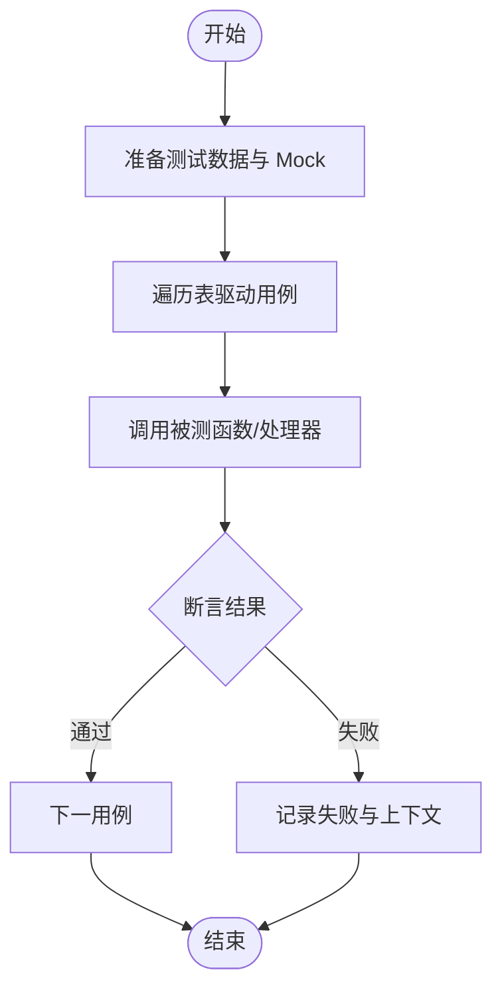
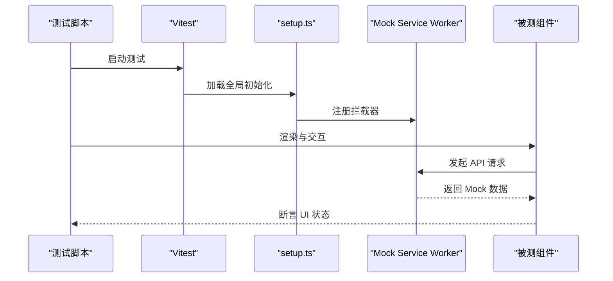
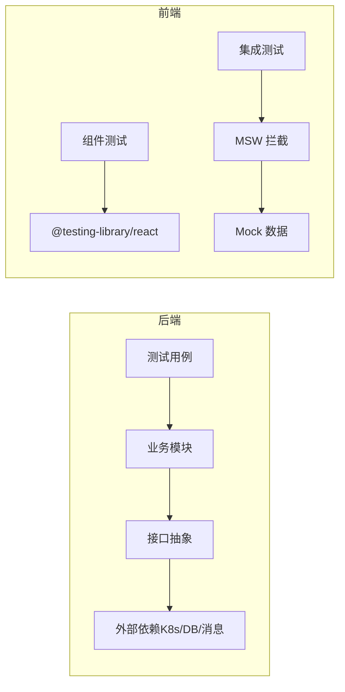

# 测试指南

<cite>
**本文引用的文件**   
- [go.mod](file://go.mod)
- [Makefile](file://Makefile)
- [ci.yml](file://.github/workflows/ci.yml)
- [handlers_test.go](file://internal/api/handlers_test.go)
- [unified_v1_test.go](file://internal/api/unified_v1_test.go)
- [manager_test.go](file://internal/alerting/manager_test.go)
- [logger_test.go](file://internal/audit/logger_test.go)
- [manager_test.go](file://internal/automation/manager_test.go)
- [manager_test.go](file://internal/backup/manager_test.go)
- [config_test.go](file://internal/config/test/config_test.go)
- [provider_test.go](file://internal/diag/ai/provider_test.go)
- [kernel_test.go](file://internal/diag/analyzer/kernel/kernel_test.go)
- [controlplane_test.go](file://internal/diag/analyzer/kubernetes/controlplane_test.go)
- [dns_test.go](file://internal/diag/analyzer/kubernetes/dns_test.go)
- [gpu_test.go](file://internal/diag/analyzer/kubernetes/gpu_test.go)
- [kubernetes_test.go](file://internal/diag/analyzer/kubernetes/kubernetes_test.go)
- [storage_test.go](file://internal/diag/analyzer/kubernetes/storage_test.go)
- [workload_test.go](file://internal/diag/analyzer/kubernetes/workload_test.go)
- [log_test.go](file://internal/diag/analyzer/log/log_test.go)
- [network_test.go](file://internal/diag/analyzer/network/network_test.go)
- [service_test.go](file://internal/diag/analyzer/process/service_test.go)
- [runtime_test.go](file://internal/diag/analyzer/runtime/runtime_test.go)
- [cis_test.go](file://internal/diag/analyzer/security/cis_test.go)
- [rbac_test.go](file://internal/diag/analyzer/security/rbac_test.go)
- [servicemesh_test.go](file://internal/diag/analyzer/servicemesh/servicemesh_test.go)
- [resource_test.go](file://internal/diag/analyzer/system/resource_test.go)
- [benchmark_test.go](file://internal/diag/analyzer/benchmark_test.go)
- [interface_test.go](file://internal/diag/analyzer/interface_test.go)
- [registry_test.go](file://internal/diag/analyzer/registry_test.go)
- [engine_test.go](file://internal/diag/autofix/engine_test.go)
- [directory_test.go](file://internal/diag/collector/offline/directory_test.go)
- [kubernetes_test.go](file://internal/diag/collector/online/kubernetes_test.go)
- [interface_test.go](file://internal/diag/collector/interface_test.go)
- [analyzer_test.go](file://internal/diag/cost/analyzer_test.go)
- [tcp_analyzer_test.go](file://internal/diag/ebpf/analyzer/tcp_analyzer_test.go)
- [probe_test.go](file://internal/diag/ebpf/probe/probe_test.go)
- [history_test.go](file://internal/diag/history/history_test.go)
- [notifier_test.go](file://internal/diag/notifier/notifier_test.go)
- [engine_test.go](file://internal/diag/rca/engine_test.go)
- [html_test.go](file://internal/diag/reporter/html_test.go)
- [json_test.go](file://internal/diag/reporter/json_test.go)
- [text_test.go](file://internal/diag/reporter/text_test.go)
- [interface_test.go](file://internal/diag/reporter/interface_test.go)
- [engine_test.go](file://internal/diag/rules/engine_test.go)
- [loader_test.go](file://internal/diag/rules/loader_test.go)
- [types_test.go](file://internal/diag/rules/types_test.go)
- [image_test.go](file://internal/diag/scanner/image_test.go)
- [model_test.go](file://internal/diag/tui/model_test.go)
- [issue_test.go](file://internal/diag/types/issue_test.go)
- [severity_test.go](file://internal/diag/types/severity_test.go)
- [pipeline_test.go](file://internal/diag/pipeline_test.go)
- [handler_test.go](file://internal/ops/test/handler_test.go)
- [router_test.go](file://internal/ops/test/router_test.go)
- [schema_test.go](file://internal/storage/schema_test.go)
- [store_test.go](file://internal/storage/store_test.go)
- [analyzer_test.go](file://internal/loganalysis/analyzer_test.go)
- [analyzer_test.go](file://internal/networkanalysis/analyzer_test.go)
- [analyzer_test.go](file://internal/rbacanalysis/analyzer_test.go)
- [analyzer_test.go](file://internal/storageanalysis/analyzer_test.go)
- [manager_test.go](file://internal/tenancy/manager_test.go)
- [test.sh](file://web/test.sh)
- [vitest.config.ts](file://web/vitest.config.ts)
- [vitest.setup.ts](file://web/vitest.setup.ts)
- [api.test.ts](file://web/src/__tests__/integration/api.test.ts)
- [error-handling.test.tsx](file://web/src/__tests__/integration/error-handling.test.tsx)
- [browser.ts](file://web/src/__tests__/mocks/browser.ts)
- [data.ts](file://web/src/__tests__/mocks/data.ts)
- [handlers.ts](file://web/src/__tests__/mocks/handlers.ts)
- [server.ts](file://web/src/__tests__/mocks/server.ts)
- [ClusterDashboard.test.tsx](file://web/src/__tests__/unit/ClusterDashboard.test.tsx)
- [DeploymentsPage.test.tsx](file://web/src/__tests__/unit/DeploymentsPage.test.tsx)
- [NodesPage.test.tsx](file://web/src/__tests__/unit/NodesPage.test.tsx)
- [PodsPage.test.tsx](file://web/src/__tests__/unit/PodsPage.test.tsx)
- [README.md](file://web/src/__tests__/README.md)
- [test-utils.tsx](file://web/src/test-utils/test-utils.tsx)
</cite>

## 目录
1. [简介](#简介)
2. [项目结构](#项目结构)
3. [核心组件](#核心组件)
4. [架构总览](#架构总览)
5. [详细组件分析](#详细组件分析)
6. [依赖分析](#依赖分析)
7. [性能考虑](#性能考虑)
8. [故障排查指南](#故障排查指南)
9. [结论](#结论)
10. [附录](#附录)

## 简介
本指南面向 Klaw 平台的开发与测试人员，系统化阐述后端 Go 测试、前端 React/Vitest 测试、集成与 E2E 测试、测试数据与环境管理、覆盖率与性能测试的最佳实践。内容基于仓库现有测试实现与配置进行提炼，并提供可操作的示例路径与调试技巧，帮助团队建立稳定、高效、可维护的测试体系。

## 项目结构
Klaw 采用多模块与前后端分离的组织方式：
- 后端（Go）：按功能域划分 internal/*，每个子包通常包含 *_test.go 单元测试；部分子包提供 test/ 辅助或集成测试。
- 前端（React + Vite + Vitest）：src/__tests__ 下组织 unit、integration、mocks 等；根级 vitest.config.ts 与 vitest.setup.ts 统一配置。
- CI/CD：.github/workflows/ci.yml 定义流水线任务；Makefile 封装常用命令。

图表来源
- [ci.yml](file://.github/workflows/ci.yml)
- [Makefile](file://Makefile)

章节来源
- [ci.yml](file://.github/workflows/ci.yml)
- [Makefile](file://Makefile)

## 核心组件
- 后端测试框架与约定
  - 使用 Go 标准 testing 包，遵循 go test 默认发现规则（*_test.go）。
  - 推荐 Table-driven tests 组织用例，便于扩展与维护。
  - 对外部依赖（HTTP、K8s、存储、消息队列等）通过接口抽象与 Mock 隔离。
- 前端测试栈
  - Vitest 作为运行器与断言库，配合 @testing-library/react 进行组件测试。
  - MSW 用于 API 拦截与 Mock 数据，保障 UI 层独立于后端。
  - 通过 vitest.setup.ts 初始化全局环境（如 DOM、Mock 服务）。
- 集成与 E2E
  - 后端 API 测试通过 http.TestServer 或路由注入进行测试。
  - 数据库与 Kubernetes 相关测试建议使用内存/临时实例或 Kind 集群。
  - 前端 E2E 可通过 Playwright/Cypress（按需引入），当前仓库以 Vitest + MSW 为主。

章节来源
- [handlers_test.go](file://internal/api/handlers_test.go)
- [unified_v1_test.go](file://internal/api/unified_v1_test.go)
- [vitest.config.ts](file://web/vitest.config.ts)
- [vitest.setup.ts](file://web/vitest.setup.ts)
- [api.test.ts](file://web/src/__tests__/integration/api.test.ts)
- [error-handling.test.tsx](file://web/src/__tests__/integration/error-handling.test.tsx)

## 架构总览
下图展示 Klaw 测试在 CI、后端、前端的整体交互关系与职责边界。

图表来源
- [ci.yml](file://.github/workflows/ci.yml)
- [handlers_test.go](file://internal/api/handlers_test.go)
- [unified_v1_test.go](file://internal/api/unified_v1_test.go)
- [api.test.ts](file://web/src/__tests__/integration/api.test.ts)
- [handlers.ts](file://web/src/__tests__/mocks/handlers.ts)

## 详细组件分析

### 后端 Go 测试规范与实践
- 测试组织与命名
  - 单测文件统一 *_test.go，与源码同目录，便于定位。
  - 复杂逻辑建议拆分为多个表驱动用例，覆盖正常、异常、边界条件。
- Table-driven tests 模式
  - 将输入、期望输出、错误信息组织为切片结构体，循环执行，提升可读性与复用性。
- Mock 策略
  - 对 HTTP、K8s Client、存储、消息通道等外部依赖，优先通过接口抽象与替换实现。
  - 避免直接依赖真实网络/集群，保证测试快速、稳定、可重复。
- API 测试
  - 使用 http.TestServer 或路由注入，构造请求并断言响应码与 JSON 结构。
  - 针对鉴权、权限、租户隔离等场景补充用例。
- 典型参考
  - API 层：[handlers_test.go](file://internal/api/handlers_test.go)、[unified_v1_test.go](file://internal/api/unified_v1_test.go)
  - 业务模块：[manager_test.go](file://internal/alerting/manager_test.go)、[manager_test.go](file://internal/automation/manager_test.go)、[manager_test.go](file://internal/backup/manager_test.go)
  - 诊断与分析：大量 *_test.go 位于 internal/diag/**，如 [kernel_test.go](file://internal/diag/analyzer/kernel/kernel_test.go)、[kubernetes_test.go](file://internal/diag/analyzer/kubernetes/kubernetes_test.go)
  - 存储与配置：[schema_test.go](file://internal/storage/schema_test.go)、[store_test.go](file://internal/storage/store_test.go)、[config_test.go](file://internal/config/test/config_test.go)

图表来源
- [handlers_test.go](file://internal/api/handlers_test.go)
- [unified_v1_test.go](file://internal/api/unified_v1_test.go)

章节来源
- [handlers_test.go](file://internal/api/handlers_test.go)
- [unified_v1_test.go](file://internal/api/unified_v1_test.go)
- [manager_test.go](file://internal/alerting/manager_test.go)
- [manager_test.go](file://internal/automation/manager_test.go)
- [manager_test.go](file://internal/backup/manager_test.go)
- [schema_test.go](file://internal/storage/schema_test.go)
- [store_test.go](file://internal/storage/store_test.go)
- [config_test.go](file://internal/config/test/config_test.go)

### 前端测试方法（React + Vitest）
- 测试分层
  - 单元：组件渲染与交互、Hook 行为、工具函数。
  - 集成：页面级流程、状态联动、API 调用（MSW 拦截）。
  - E2E：浏览器端到端流程（可选，按需引入 Playwright/Cypress）。
- 配置与启动
  - vitest.config.ts 定义测试入口、覆盖率、环境等。
  - vitest.setup.ts 初始化全局环境（如 MSW server、DOM）。
- 组件测试
  - 使用 @testing-library/react 进行查询与断言，模拟用户交互。
  - 通过 props 与 context 控制组件状态，确保可测试性。
- 集成测试
  - 使用 MSW 拦截 fetch/XHR，返回固定数据，验证页面行为。
  - 参考 [api.test.ts](file://web/src/__tests__/integration/api.test.ts)、[error-handling.test.tsx](file://web/src/__tests__/integration/error-handling.test.tsx)。
- Mock 数据与服务
  - __tests__/mocks 中集中管理 handlers、data、server、browser。
  - 参考 [handlers.ts](file://web/src/__tests__/mocks/handlers.ts)、[data.ts](file://web/src/__tests__/mocks/data.ts)、[server.ts](file://web/src/__tests__/mocks/server.ts)、[browser.ts](file://web/src/__tests__/mocks/browser.ts)。
- 工具与辅助
  - test-utils.tsx 提供通用渲染、等待、断言封装。
  - 参考 [test-utils.tsx](file://web/src/test-utils/test-utils.tsx)。

图表来源
- [vitest.config.ts](file://web/vitest.config.ts)
- [vitest.setup.ts](file://web/vitest.setup.ts)
- [handlers.ts](file://web/src/__tests__/mocks/handlers.ts)
- [server.ts](file://web/src/__tests__/mocks/server.ts)
- [api.test.ts](file://web/src/__tests__/integration/api.test.ts)

章节来源
- [vitest.config.ts](file://web/vitest.config.ts)
- [vitest.setup.ts](file://web/vitest.setup.ts)
- [api.test.ts](file://web/src/__tests__/integration/api.test.ts)
- [error-handling.test.tsx](file://web/src/__tests__/integration/error-handling.test.tsx)
- [handlers.ts](file://web/src/__tests__/mocks/handlers.ts)
- [data.ts](file://web/src/__tests__/mocks/data.ts)
- [server.ts](file://web/src/__tests__/mocks/server.ts)
- [browser.ts](file://web/src/__tests__/mocks/browser.ts)
- [test-utils.tsx](file://web/src/test-utils/test-utils.tsx)

### 集成测试策略（API、数据库、Kubernetes）
- API 测试
  - 使用 http.TestServer 或路由注入，构造请求并断言响应。
  - 覆盖成功、参数校验失败、鉴权失败、超时与重试等场景。
  - 参考：[handlers_test.go](file://internal/api/handlers_test.go)、[unified_v1_test.go](file://internal/api/unified_v1_test.go)。
- 数据库测试
  - 优先使用内存数据库或临时文件存储，避免污染真实数据。
  - 对 schema 与迁移逻辑编写用例，确保一致性。
  - 参考：[schema_test.go](file://internal/storage/schema_test.go)、[store_test.go](file://internal/storage/store_test.go)。
- Kubernetes 环境测试
  - 使用 Kind 或 Minikube 搭建轻量集群，或通过 Mock K8s Client。
  - 对控制器与资源操作编写用例，确保幂等与回滚。
  - 参考：[kubernetes_test.go](file://internal/diag/analyzer/kubernetes/kubernetes_test.go)、[controlplane_test.go](file://internal/diag/analyzer/kubernetes/controlplane_test.go)、[workload_test.go](file://internal/diag/analyzer/kubernetes/workload_test.go)。

章节来源
- [handlers_test.go](file://internal/api/handlers_test.go)
- [unified_v1_test.go](file://internal/api/unified_v1_test.go)
- [schema_test.go](file://internal/storage/schema_test.go)
- [store_test.go](file://internal/storage/store_test.go)
- [kubernetes_test.go](file://internal/diag/analyzer/kubernetes/kubernetes_test.go)
- [controlplane_test.go](file://internal/diag/analyzer/kubernetes/controlplane_test.go)
- [workload_test.go](file://internal/diag/analyzer/kubernetes/workload_test.go)

### 测试数据管理
- 后端
  - 使用结构化表驱动数据，集中管理输入/期望/错误。
  - 对复杂对象使用工厂函数生成，减少样板代码。
  - 参考：各 *_test.go 中的表驱动结构与数据构造。
- 前端
  - MSW 的 data.ts 集中管理 Mock 数据，handlers.ts 映射 URL 到数据。
  - 通过 test-utils 封装常见断言与等待逻辑。
  - 参考：[data.ts](file://web/src/__tests__/mocks/data.ts)、[handlers.ts](file://web/src/__tests__/mocks/handlers.ts)、[test-utils.tsx](file://web/src/test-utils/test-utils.tsx)。

章节来源
- [data.ts](file://web/src/__tests__/mocks/data.ts)
- [handlers.ts](file://web/src/__tests__/mocks/handlers.ts)
- [test-utils.tsx](file://web/src/test-utils/test-utils.tsx)

### 测试环境搭建
- 后端
  - 使用 go test 默认机制，必要时设置环境变量或配置文件。
  - 对需要外部资源的测试，使用内存/临时文件或 Mock。
- 前端
  - 通过 vitest.config.ts 指定测试环境与插件。
  - vitest.setup.ts 初始化 MSW、DOM、全局常量。
  - 参考：[vitest.config.ts](file://web/vitest.config.ts)、[vitest.setup.ts](file://web/vitest.setup.ts)。

章节来源
- [vitest.config.ts](file://web/vitest.config.ts)
- [vitest.setup.ts](file://web/vitest.setup.ts)

### 覆盖率要求
- 后端
  - 使用 go test -cover 统计覆盖率，建议在 CI 中设定阈值。
  - 重点关注关键路径、错误分支与并发安全。
- 前端
  - 在 vitest.config.ts 中启用 coverage，设定最小覆盖率阈值。
  - 关注组件渲染、交互与异步流程的覆盖。

章节来源
- [vitest.config.ts](file://web/vitest.config.ts)

### 性能测试
- 后端
  - 使用 go test -bench 编写基准测试，评估热点路径性能。
  - 结合 pprof 定位瓶颈，优化算法与 I/O。
  - 参考：[benchmark_test.go](file://internal/diag/analyzer/benchmark_test.go)。
- 前端
  - 使用 Vitest 的性能钩子或 Lighthouse（E2E）评估渲染与网络开销。
  - 对大数据列表、频繁重渲染进行优化。

章节来源
- [benchmark_test.go](file://internal/diag/analyzer/benchmark_test.go)

## 依赖分析
- 后端依赖
  - 测试对业务模块的耦合度较低，主要通过接口与 Mock 解耦。
  - 对 K8s、存储、消息等外部依赖，优先使用 Mock 或内存实现。
- 前端依赖
  - 组件测试依赖 @testing-library/react 与 MSW，保持 UI 与 API 解耦。
  - 集成测试通过 MSW 统一拦截，避免真实网络调用。

图表来源
- [handlers_test.go](file://internal/api/handlers_test.go)
- [api.test.ts](file://web/src/__tests__/integration/api.test.ts)
- [handlers.ts](file://web/src/__tests__/mocks/handlers.ts)

章节来源
- [handlers_test.go](file://internal/api/handlers_test.go)
- [api.test.ts](file://web/src/__tests__/integration/api.test.ts)
- [handlers.ts](file://web/src/__tests__/mocks/handlers.ts)

## 性能考虑
- 后端
  - 避免在测试中创建重型资源；使用内存/临时文件替代。
  - 合理拆分大表驱动用例，缩短单次测试时间。
  - 使用并行测试（t.Parallel）提升吞吐，注意竞态与共享状态。
- 前端
  - 减少不必要的渲染与重绘，使用 memoization。
  - 对长列表与复杂组件进行虚拟化与懒加载。
  - 通过 MSW 缓存与批量响应降低网络开销。

## 故障排查指南
- 后端
  - 使用 go test -v 查看详细日志，结合 t.Logf 输出上下文。
  - 对并发问题，使用 race detector（-race）检测数据竞争。
  - 对 API 测试失败，打印请求/响应体与中间状态。
- 前端
  - 使用 Vitest 的 --reporter=verbose 与 --watch 模式快速迭代。
  - 对 MSW 拦截失败，检查 handlers 匹配规则与请求路径。
  - 对组件渲染问题，使用 Testing Library 的 debug 工具定位节点。

章节来源
- [handlers_test.go](file://internal/api/handlers_test.go)
- [api.test.ts](file://web/src/__tests__/integration/api.test.ts)
- [handlers.ts](file://web/src/__tests__/mocks/handlers.ts)

## 结论
通过统一的测试规范、清晰的依赖隔离与完善的 CI 集成，Klaw 平台能够持续交付高质量、可维护的代码。建议团队在日常开发中坚持表驱动测试、Mock 优先、覆盖率与性能并重，逐步完善测试资产与最佳实践。

## 附录
- 常用命令
  - 后端：go test ./... -v -cover
  - 前端：npm run test（基于 vitest）
- 参考文件
  - 后端测试样例：[handlers_test.go](file://internal/api/handlers_test.go)、[unified_v1_test.go](file://internal/api/unified_v1_test.go)
  - 前端测试样例：[api.test.ts](file://web/src/__tests__/integration/api.test.ts)、[error-handling.test.tsx](file://web/src/__tests__/integration/error-handling.test.tsx)
  - 配置与脚本：[vitest.config.ts](file://web/vitest.config.ts)、[vitest.setup.ts](file://web/vitest.setup.ts)、[test.sh](file://web/test.sh)