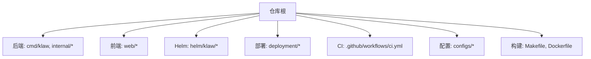
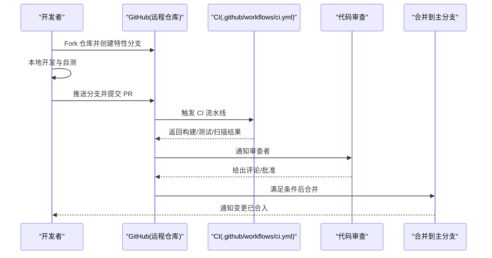
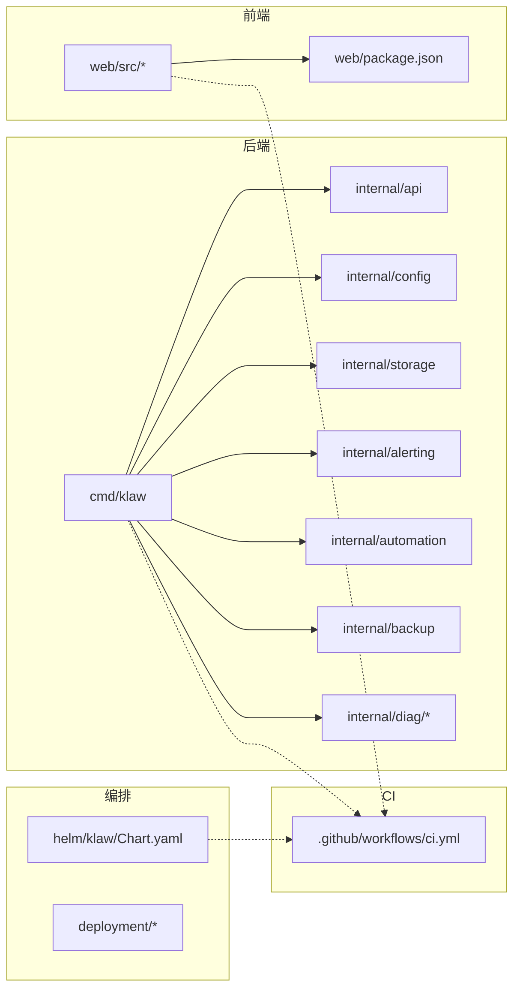

# 贡献流程与协作

<cite>
**本文引用的文件**   
- [README.md](file://README.md)
- [Makefile](file://Makefile)
- [.github/workflows/ci.yml](file://.github/workflows/ci.yml)
- [go.mod](file://go.mod)
- [Dockerfile](file://Dockerfile)
- [configs/config.yaml.example](file://configs/config.yaml.example)
- [web/package.json](file://web/package.json)
- [helm/klaw/Chart.yaml](file://helm/klaw/Chart.yaml)
- [deployment/README.md](file://deployment/README.md)
</cite>

## 目录
1. [简介](#简介)
2. [项目结构](#项目结构)
3. [核心组件](#核心组件)
4. [架构总览](#架构总览)
5. [详细组件分析](#详细组件分析)
6. [依赖分析](#依赖分析)
7. [性能考虑](#性能考虑)
8. [故障排查指南](#故障排查指南)
9. [结论](#结论)
10. [附录](#附录)

## 简介
本文件为 Klaw 平台的贡献流程与协作规范，面向新贡献者与长期维护者。内容涵盖：
- Fork 与 Pull Request 工作流
- 分支管理策略（Git Flow）
- 代码审查标准
- Issue 报告模板与功能请求流程
- 开发环境设置、依赖管理与构建说明
- 文档更新要求与许可证合规性检查
- 社区参与规范与沟通渠道

目标：让每位贡献者都能快速上手、稳定协作、高质量交付。

## 项目结构
Klaw 采用多模块、前后端分离的仓库结构：
- 后端服务与内部包位于根目录与 internal/
- Web 前端位于 web/
- Helm Chart 与部署脚本位于 helm/ 与 deployment/
- CI 流水线在 .github/workflows/
- 配置示例在 configs/

图表来源
- [Makefile](file://Makefile)
- [Dockerfile](file://Dockerfile)
- [.github/workflows/ci.yml](file://.github/workflows/ci.yml)
- [configs/config.yaml.example](file://configs/config.yaml.example)
- [web/package.json](file://web/package.json)
- [helm/klaw/Chart.yaml](file://helm/klaw/Chart.yaml)
- [deployment/README.md](file://deployment/README.md)

章节来源
- [README.md](file://README.md)
- [Makefile](file://Makefile)
- [Dockerfile](file://Dockerfile)
- [.github/workflows/ci.yml](file://.github/workflows/ci.yml)
- [configs/config.yaml.example](file://configs/config.yaml.example)
- [web/package.json](file://web/package.json)
- [helm/klaw/Chart.yaml](file://helm/klaw/Chart.yaml)
- [deployment/README.md](file://deployment/README.md)

## 核心组件
- 后端服务与 API：由 Go 模块组织，入口位于 cmd/klaw，业务逻辑集中在 internal/ 各子包。
- Web 前端：基于 React/Vite 的前端工程，位于 web/。
- 编排与发布：Helm Chart 位于 helm/klaw；本地与集群部署参考 deployment/。
- 持续集成：GitHub Actions 流水线定义于 .github/workflows/ci.yml。
- 配置管理：配置文件示例位于 configs/config.yaml.example。

章节来源
- [go.mod](file://go.mod)
- [web/package.json](file://web/package.json)
- [helm/klaw/Chart.yaml](file://helm/klaw/Chart.yaml)
- [configs/config.yaml.example](file://configs/config.yaml.example)
- [.github/workflows/ci.yml](file://.github/workflows/ci.yml)

## 架构总览
下图展示贡献者在本地完成改动后，如何通过 CI 验证并提交流程到主分支。

图表来源
- [.github/workflows/ci.yml](file://.github/workflows/ci.yml)

## 详细组件分析

### 分支管理策略（Git Flow）
- 分支模型
  - main：受保护的主分支，仅允许通过 PR 合并。
  - develop：集成分支，用于日常集成与测试。
  - feature/*：新功能开发分支。
  - bugfix/*：缺陷修复分支。
  - release/*：发布候选分支。
  - hotfix/*：线上紧急修复分支。
- 命名规范
  - 使用小写字母、数字与短横线，语义清晰，如 feature/add-alerting、bugfix/fix-rbac-check。
- 提交信息规范
  - 建议遵循 Conventional Commits：type(scope): description
  - 类型包括 feat、fix、docs、style、refactor、test、chore 等。
- 分支生命周期
  - 从 develop 拉取最新代码，完成开发后发起 PR 至 develop/main（按场景）。
  - 合并前需通过 CI 并通过至少一名维护者审查。

章节来源
- [.github/workflows/ci.yml](file://.github/workflows/ci.yml)

### 代码审查标准
- 必须项
  - CI 全部通过（构建、单元测试、集成测试、静态检查）。
  - 至少一名维护者批准。
  - 变更影响范围明确，包含必要文档更新。
- 质量要求
  - 代码风格一致，避免过度复杂逻辑。
  - 新增/修改接口需补充测试用例。
  - 敏感信息不得入库或硬编码。
- 审查清单
  - 功能正确性与边界条件
  - 性能与资源占用
  - 安全与权限控制
  - 可观测性与日志
  - 兼容性与回滚方案

章节来源
- [.github/workflows/ci.yml](file://.github/workflows/ci.yml)

### Issue 报告模板
- Bug 报告
  - 标题：简明扼要描述问题
  - 复现步骤：逐步说明如何复现
  - 期望行为 vs 实际行为
  - 环境与版本：操作系统、Go/Node 版本、镜像/Chart 版本
  - 日志与截图：关键日志片段、错误堆栈、界面截图
  - 影响范围：是否阻塞、影响用户数
- 功能请求
  - 背景与动机
  - 需求描述与验收标准
  - 替代方案与权衡
  - 优先级与里程碑建议

章节来源
- [README.md](file://README.md)

### 功能请求流程
- 提出需求：先创建 Issue 讨论，确认价值与范围。
- 设计评审：必要时输出技术方案与接口草案。
- 实现与测试：在 feature/* 分支实现，补充单测与集成测试。
- 文档更新：同步更新 README、API 文档与部署指南。
- 合并与发布：PR 通过后合并，纳入下一个 release 计划。

章节来源
- [README.md](file://README.md)

### 开发环境设置
- 前置依赖
  - Go 工具链（版本以 go.mod 为准）
  - Node.js 与 pnpm/yarn/npm（前端构建）
  - Docker（可选，用于容器化运行）
  - kubectl/kind（可选，用于本地集群调试）
- 克隆与初始化
  - 克隆仓库后进入项目根目录
  - 安装后端依赖与前端依赖
- 启动服务
  - 后端：根据 Makefile 目标启动服务
  - 前端：启动 Vite 开发服务器
  - 配置：复制 configs/config.yaml.example 为 config.yaml 并按需调整
- 本地验证
  - 运行测试套件
  - 构建镜像并本地运行
  - 使用 kind 部署到本地集群（参考 deployment/README.md）

章节来源
- [Makefile](file://Makefile)
- [go.mod](file://go.mod)
- [web/package.json](file://web/package.json)
- [configs/config.yaml.example](file://configs/config.yaml.example)
- [Dockerfile](file://Dockerfile)
- [deployment/README.md](file://deployment/README.md)

### 依赖管理
- 后端（Go）
  - 使用 go.mod/go.sum 管理依赖
  - 新增依赖需确保可重现构建
- 前端（Web）
  - 使用 package.json 与 lock 文件管理依赖
  - 保持依赖版本稳定，避免破坏性升级
- 容器镜像
  - Dockerfile 中固定基础镜像版本
- Helm Chart
  - Chart.yaml 中声明版本与依赖

章节来源
- [go.mod](file://go.mod)
- [web/package.json](file://web/package.json)
- [Dockerfile](file://Dockerfile)
- [helm/klaw/Chart.yaml](file://helm/klaw/Chart.yaml)

### 文档更新要求
- 变更涉及 API、配置、部署方式时，需同步更新相关文档
- 新增功能需在 README 或 docs/ 下补充使用说明
- 变更前后对比应清晰，便于审阅与回溯

章节来源
- [README.md](file://README.md)

### 许可证合规性检查
- 新增依赖需确认许可证兼容性
- 禁止引入 GPL 等强传染性许可证（除非项目整体采用相应许可）
- 建议在 CI 中加入许可证扫描任务（如 license-checker）

章节来源
- [README.md](file://README.md)

### 新贡献者入门指导
- 首次贡献建议
  - 从 good-first-issue 或小型 bugfix 开始
  - 阅读 README 与部署说明，搭建本地环境
  - 熟悉测试与构建命令
- 常见问题
  - 依赖安装失败：检查网络与代理
  - 构建失败：核对 Go/Node 版本与缓存
  - 端口冲突：调整本地端口或停止占用进程

章节来源
- [README.md](file://README.md)
- [Makefile](file://Makefile)
- [web/package.json](file://web/package.json)

### 社区参与规范
- 尊重与包容：遵守社区行为准则
- 有效沟通：Issue/PR 描述清晰，提供复现与上下文
- 及时反馈：对审查意见积极回应与迭代
- 知识共享：鼓励分享经验与最佳实践

章节来源
- [README.md](file://README.md)

## 依赖分析
下图展示主要模块间的依赖关系与职责划分。

图表来源
- [go.mod](file://go.mod)
- [web/package.json](file://web/package.json)
- [helm/klaw/Chart.yaml](file://helm/klaw/Chart.yaml)
- [.github/workflows/ci.yml](file://.github/workflows/ci.yml)

章节来源
- [go.mod](file://go.mod)
- [web/package.json](file://web/package.json)
- [helm/klaw/Chart.yaml](file://helm/klaw/Chart.yaml)
- [.github/workflows/ci.yml](file://.github/workflows/ci.yml)

## 性能考虑
- 后端
  - 合理设计并发与锁粒度
  - 数据库与存储访问路径优化
  - 日志与监控采样策略
- 前端
  - 组件懒加载与按需打包
  - 减少重渲染与状态同步开销
- 构建与 CI
  - 并行化测试与构建
  - 缓存依赖与中间产物

[本节为通用指导，不直接分析具体文件]

## 故障排查指南
- 常见构建问题
  - Go 版本不一致：使用 go.mod 指定版本
  - Node 依赖缺失：清理缓存后重新安装
  - Docker 构建失败：检查基础镜像与网络
- 常见问题定位
  - 查看 CI 日志定位失败阶段
  - 使用本地最小复现实例
  - 开启调试日志与指标采集
- 回滚与应急
  - 保留历史版本镜像与配置
  - 优先恢复服务，再定位根因

章节来源
- [.github/workflows/ci.yml](file://.github/workflows/ci.yml)
- [Makefile](file://Makefile)
- [Dockerfile](file://Dockerfile)

## 结论
通过明确的分支策略、严格的代码审查、完善的 CI 与清晰的文档规范，Klaw 能够高效地吸纳社区贡献并保持高质量交付。新贡献者可按照本指南快速上手，老成员可据此统一协作节奏，共同推动项目演进。

[本节为总结性内容，不直接分析具体文件]

## 附录
- 常用命令速查
  - 后端构建与运行：参考 Makefile 目标
  - 前端开发与测试：参考 web/package.json scripts
  - 构建镜像：参考 Dockerfile
  - 本地集群部署：参考 deployment/README.md
- 参考链接
  - Git Flow 最佳实践
  - Conventional Commits 规范
  - 许可证兼容性清单

[本节为补充信息，不直接分析具体文件]