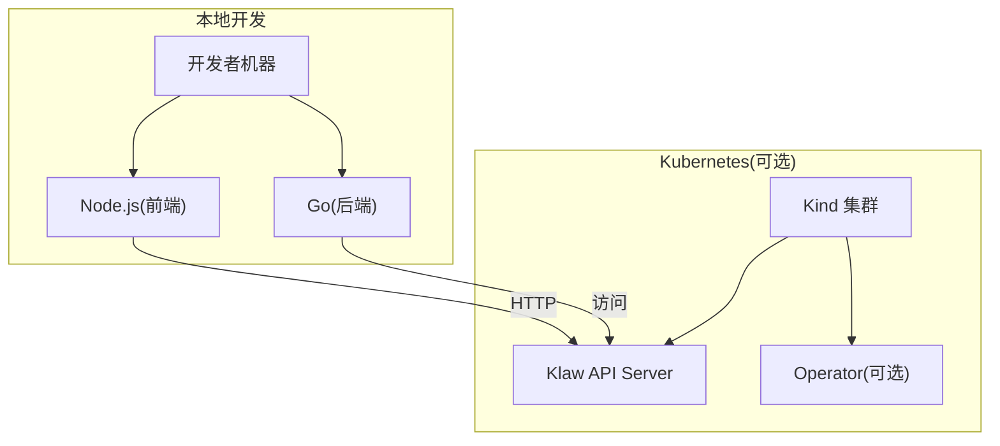
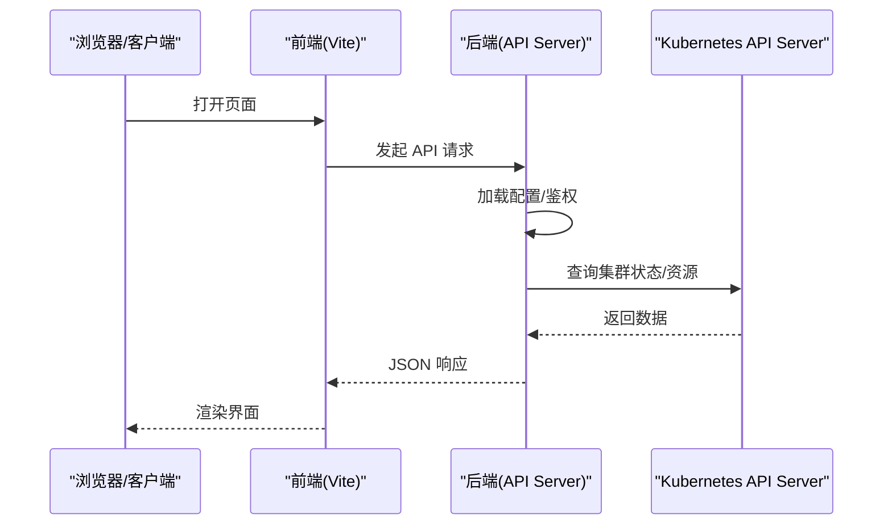
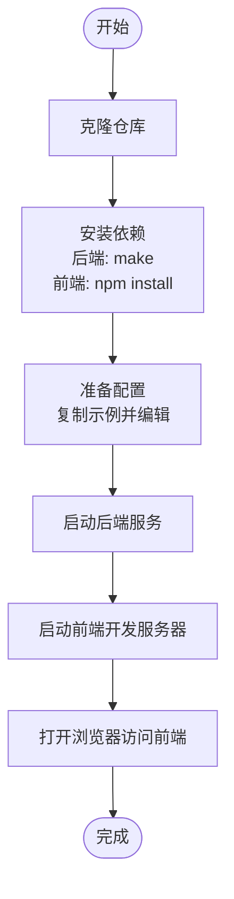
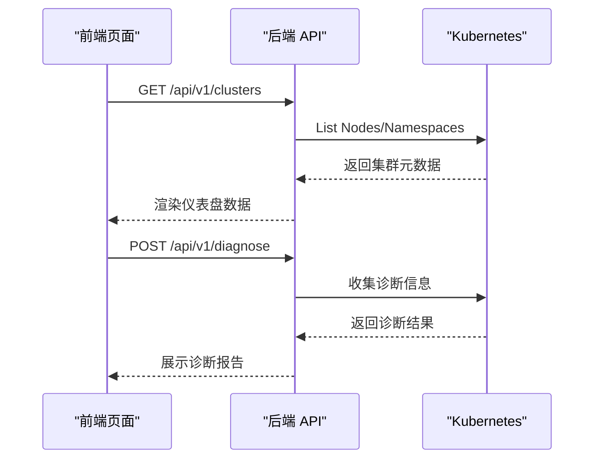
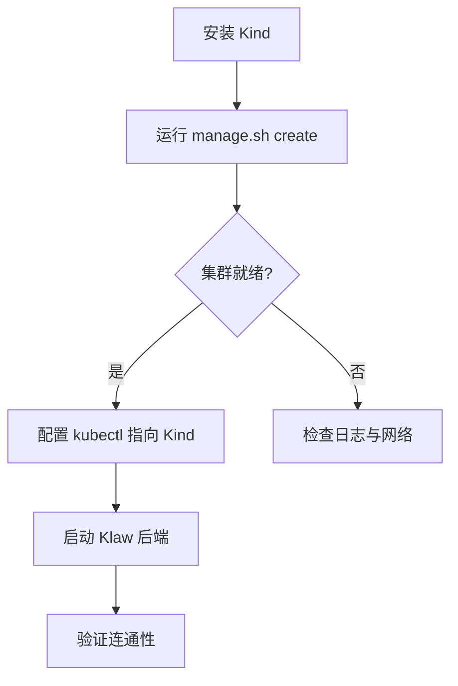
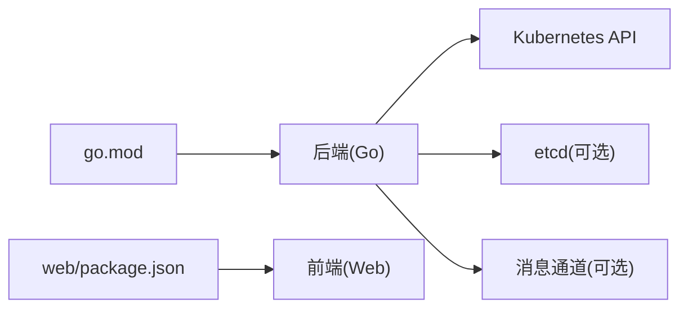

# 快速开始

<cite>
**本文引用的文件**   
- [Makefile](file://Makefile)
- [Dockerfile](file://Dockerfile)
- [go.mod](file://go.mod)
- [configs/config.yaml.example](file://configs/config.yaml.example)
- [deployment/README.md](file://deployment/README.md)
- [deployment/kind/manage.sh](file://deployment/kind/manage.sh)
- [deployment/kind/cluster-config.yaml](file://deployment/kind/cluster-config.yaml)
- [web/package.json](file://web/package.json)
- [cmd/klaw/main.go](file://cmd/klaw/main.go)
- [internal/api/server.go](file://internal/api/server.go)
- [internal/config/config.go](file://internal/config/config.go)
</cite>

## 目录
1. [简介](#简介)
2. [项目结构](#项目结构)
3. [核心组件](#核心组件)
4. [架构总览](#架构总览)
5. [详细组件分析](#详细组件分析)
6. [依赖分析](#依赖分析)
7. [性能考虑](#性能考虑)
8. [故障排查指南](#故障排查指南)
9. [结论](#结论)
10. [附录](#附录)

## 简介
本指南面向首次接触 Klaw 平台的用户，提供从零开始的完整部署流程。你将了解环境要求、依赖安装、本地开发环境搭建、配置文件设置、服务启动与基本使用示例，并附带常见问题与排错建议。目标是帮助你在最短时间内运行并体验平台功能。

## 项目结构
Klaw 采用 Go 后端 + Web 前端（Vite/React）+ Kubernetes Operator 的混合架构：
- cmd/klaw：Go 应用入口
- internal/*：后端业务模块（API、配置、诊断、存储等）
- web：前端工程（Vite、TypeScript、React）
- deployment/kind：基于 Kind 的本地 Kubernetes 集群管理脚本与配置
- configs：运行时配置模板与示例
- operator：Kubernetes Operator（可选，用于 CR 管理）
- Makefile/Dockerfile：构建与镜像打包

[本图为概念性结构示意，不直接映射具体源码文件]

## 核心组件
- 后端服务（Go）
  - 入口：cmd/klaw/main.go
  - HTTP 服务器与路由：internal/api/server.go
  - 配置加载：internal/config/config.go
- 前端（Web）
  - 包管理与脚本：web/package.json
- 构建与容器化
  - 构建命令：Makefile
  - 镜像定义：Dockerfile
- 本地 K8s 环境
  - Kind 集群脚本与配置：deployment/kind/manage.sh, deployment/kind/cluster-config.yaml
  - 部署说明：deployment/README.md

**章节来源**
- [cmd/klaw/main.go](file://cmd/klaw/main.go)
- [internal/api/server.go](file://internal/api/server.go)
- [internal/config/config.go](file://internal/config/config.go)
- [web/package.json](file://web/package.json)
- [Makefile](file://Makefile)
- [Dockerfile](file://Dockerfile)
- [deployment/kind/manage.sh](file://deployment/kind/manage.sh)
- [deployment/kind/cluster-config.yaml](file://deployment/kind/cluster-config.yaml)
- [deployment/README.md](file://deployment/README.md)

## 架构总览
Klaw 的典型运行方式：
- 本地开发：前端通过 Vite 代理到后端 API；后端读取配置并连接外部系统（如 Kubernetes）。
- 生产部署：将后端打包为镜像，在 Kubernetes 中运行；可通过 Operator 管理自定义资源。

[本图为概念性调用序列示意，不直接映射具体源码文件]

## 详细组件分析

### 环境要求
- Go：建议使用与 go.mod 中声明一致的版本（参见 go.mod）
- Node.js：建议使用与 web/package.json 中 engines 字段一致或更高版本
- Kubernetes：本地可用 Kind 或任意兼容 v1.24+ 的集群（推荐）
- 工具链：make、docker、kubectl、kind（可选）

**章节来源**
- [go.mod](file://go.mod)
- [web/package.json](file://web/package.json)
- [deployment/README.md](file://deployment/README.md)

### 依赖安装
- 后端依赖
  - 使用 make 进行依赖拉取与校验（参考 Makefile 中的目标）
- 前端依赖
  - 进入 web 目录，执行 npm install 或 yarn install（参考 package.json scripts）

**章节来源**
- [Makefile](file://Makefile)
- [web/package.json](file://web/package.json)

### 本地开发环境搭建
步骤概览：
1. 克隆仓库并进入根目录
2. 安装后端依赖（make 相关目标）
3. 安装前端依赖（npm/yarn）
4. 准备配置文件（复制示例并修改）
5. 启动后端服务
6. 启动前端开发服务器
7. 访问前端页面并与后端交互

[本图为概念性流程示意，不直接映射具体源码文件]

**章节来源**
- [Makefile](file://Makefile)
- [web/package.json](file://web/package.json)
- [configs/config.yaml.example](file://configs/config.yaml.example)

### 配置文件设置
- 配置文件位置：configs/config.yaml（由 internal/config/config.go 加载）
- 示例配置：configs/config.yaml.example
- 关键配置项（常见）：
  - 服务监听端口、日志级别
  - Kubernetes 连接信息（kubeconfig 路径或内联配置）
  - 存储与备份相关参数（按需启用）
  - 通知渠道（如钉钉、飞书）集成参数（按需启用）

操作建议：
- 从示例复制一份 config.yaml 并填写实际值
- 确保后端进程能读取该文件路径（或通过环境变量覆盖）

**章节来源**
- [internal/config/config.go](file://internal/config/config.go)
- [configs/config.yaml.example](file://configs/config.yaml.example)

### 服务启动与基本使用
- 启动后端
  - 使用 make run 或直接运行编译产物（参考 Makefile 目标）
  - 确认日志输出正常，无配置错误
- 启动前端
  - 进入 web 目录，执行 npm run dev（或对应脚本）
  - 默认访问 http://localhost:3000（以实际端口为准）
- 基本使用
  - 在“集群仪表盘”查看节点/Pod/Deployment 状态
  - 在“诊断”页面触发一次诊断任务
  - 在“备份”页面创建一次 etcd 备份（若已启用）

[本图为概念性调用序列示意，不直接映射具体源码文件]

**章节来源**
- [internal/api/server.go](file://internal/api/server.go)
- [Makefile](file://Makefile)
- [web/package.json](file://web/package.json)

### 使用 Kind 快速搭建本地 Kubernetes 环境（可选）
- 使用 deployment/kind/manage.sh 一键创建/销毁集群
- 使用 deployment/kind/cluster-config.yaml 调整集群特性（如 Ingress、StorageClass）
- 将 kubeconfig 指向 Kind 集群后，后端即可连接

**章节来源**
- [deployment/kind/manage.sh](file://deployment/kind/manage.sh)
- [deployment/kind/cluster-config.yaml](file://deployment/kind/cluster-config.yaml)
- [deployment/README.md](file://deployment/README.md)

### 构建与容器化（可选）
- 构建镜像：使用 Dockerfile 或 make build（参考 Makefile）
- 推送镜像：按你的镜像仓库策略推送
- 部署到 K8s：使用 helm 或 kubectl apply 部署（如有 Chart）

**章节来源**
- [Dockerfile](file://Dockerfile)
- [Makefile](file://Makefile)

## 依赖分析
- 后端依赖
  - Go 标准库与第三方库（由 go.mod/go.sum 管理）
  - Kubernetes client-go（用于与 K8s API 交互）
- 前端依赖
  - React、Vite、TypeScript、TailwindCSS（由 web/package.json 管理）
- 外部依赖
  - Kubernetes API Server（必需）
  - etcd（备份场景）
  - 消息通道（钉钉/飞书，可选）

**章节来源**
- [go.mod](file://go.mod)
- [web/package.json](file://web/package.json)

## 性能考虑
- 合理设置日志级别，避免生产环境输出过多调试日志
- 对频繁读写的接口增加缓存（如集群元数据）
- 限制并发诊断任务的规模，避免压垮 K8s API Server
- 前端按需加载页面与组件，减少首屏体积

[本节为通用建议，不直接分析具体文件]

## 故障排查指南
- 无法连接 Kubernetes
  - 检查 kubeconfig 是否正确，权限是否足够
  - 确认网络可达且未受防火墙限制
- 后端启动失败
  - 检查配置文件路径与权限
  - 查看启动日志定位错误（端口占用、配置缺失等）
- 前端无法访问后端
  - 确认 Vite 代理配置正确
  - 检查 CORS 与跨域设置
- 诊断任务失败
  - 检查规则与采集器配置
  - 查看诊断日志与 K8s 事件

**章节来源**
- [internal/config/config.go](file://internal/config/config.go)
- [internal/api/server.go](file://internal/api/server.go)
- [deployment/README.md](file://deployment/README.md)

## 结论
通过以上步骤，你可以在本地快速搭建 Klaw 的开发与演示环境，并在 Kubernetes 上运行生产级服务。建议结合 Helm/Operator 实现更稳定的部署与生命周期管理。遇到问题时优先检查配置与日志，逐步缩小范围定位问题。

## 附录
- 常用命令速查
  - 后端：make run / make build
  - 前端：npm run dev / npm run build
  - Kind：./deployment/kind/manage.sh create / delete
- 参考文档
  - 内部文档：docs/ 下的集成与实现说明

[本节为补充信息，不直接分析具体文件]