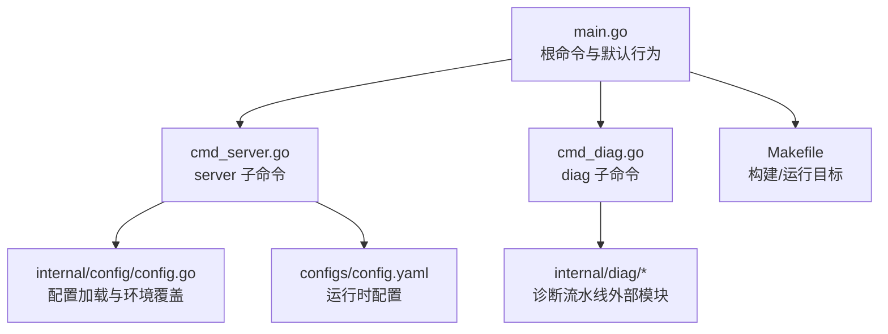
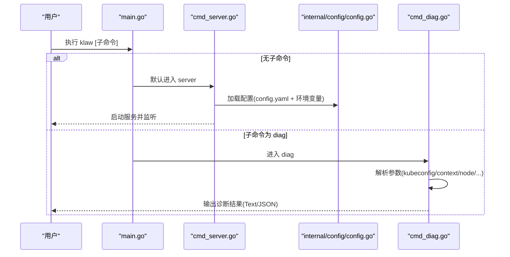
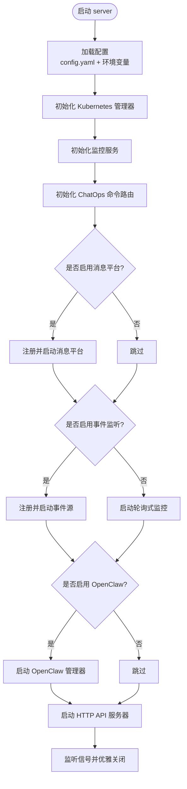
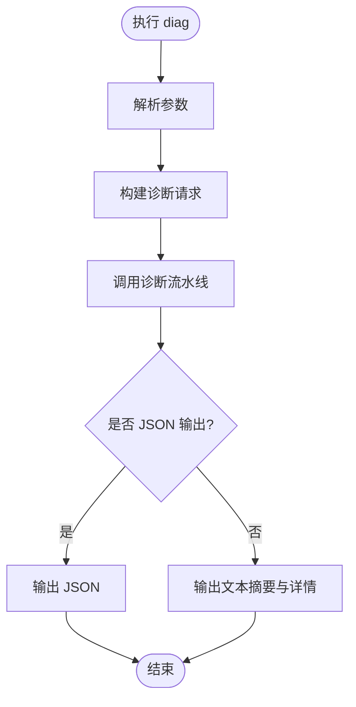
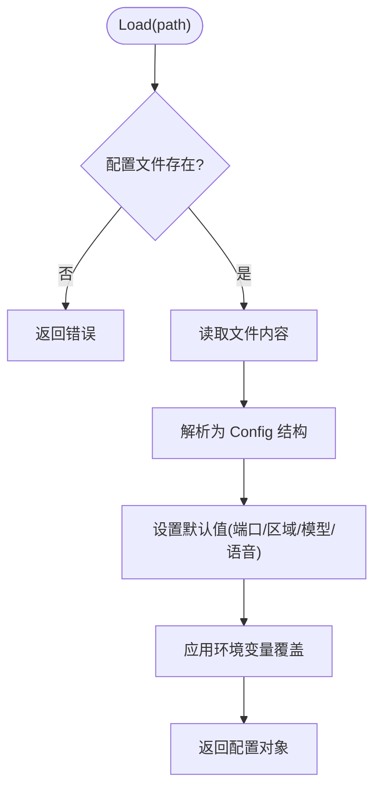
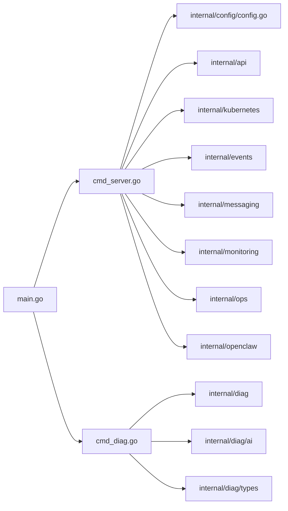

# Klaw CLI 命令行接口

<cite>
**本文引用的文件**
- [cmd/klaw/main.go](file://cmd/klaw/main.go)
- [cmd/klaw/cmd_server.go](file://cmd/klaw/cmd_server.go)
- [cmd/klaw/cmd_diag.go](file://cmd/klaw/cmd_diag.go)
- [configs/config.yaml](file://configs/config.yaml)
- [internal/config/config.go](file://internal/config/config.go)
- [Makefile](file://Makefile)
- [README.md](file://README.md)
</cite>

## 目录
1. [简介](#简介)
2. [项目结构](#项目结构)
3. [核心组件](#核心组件)
4. [架构总览](#架构总览)
5. [详细组件分析](#详细组件分析)
6. [依赖关系分析](#依赖关系分析)
7. [性能与可用性](#性能与可用性)
8. [故障排查指南](#故障排查指南)
9. [结论](#结论)
10. [附录：CLI 参考](#附录cli-参考)

## 简介
Klaw CLI 提供统一的入口，将“Web API + ChatOps 服务”和“集群诊断分析”两个能力封装在同一个二进制中。通过 Cobra 子命令组织命令树，支持 server、diag、version 等子命令；默认无参数时自动进入 server 模式。配置通过 YAML 与环境变量组合加载，敏感信息优先从环境变量注入。

## 项目结构
CLI 相关代码集中在 cmd/klaw 目录下，包含主程序与子命令实现；配置位于 configs/config.yaml；配置解析逻辑在 internal/config；构建与运行脚本在 Makefile。

图表来源
- [cmd/klaw/main.go:10-44](file://cmd/klaw/main.go#L10-L44)
- [cmd/klaw/cmd_server.go:28-48](file://cmd/klaw/cmd_server.go#L28-L48)
- [cmd/klaw/cmd_diag.go:26-49](file://cmd/klaw/cmd_diag.go#L26-L49)
- [internal/config/config.go:94-131](file://internal/config/config.go#L94-L131)
- [configs/config.yaml:1-74](file://configs/config.yaml#L1-L74)
- [Makefile:1-26](file://Makefile#L1-L26)

章节来源
- [cmd/klaw/main.go:10-44](file://cmd/klaw/main.go#L10-L44)
- [cmd/klaw/cmd_server.go:28-48](file://cmd/klaw/cmd_server.go#L28-L48)
- [cmd/klaw/cmd_diag.go:26-49](file://cmd/klaw/cmd_diag.go#L26-L49)
- [internal/config/config.go:94-131](file://internal/config/config.go#L94-L131)
- [configs/config.yaml:1-74](file://configs/config.yaml#L1-L74)
- [Makefile:1-26](file://Makefile#L1-L26)

## 核心组件
- 根命令与版本命令：定义应用名、帮助文本、版本输出，并注册 version 子命令。
- server 子命令：启动 Web API、ChatOps、事件监听、OpenClaw 技能与 HTTP 服务器，支持 --port 覆盖端口。
- diag 子命令：执行在线诊断流水线，支持 kubeconfig/context/node/namespace/analyzer/exclude/no-ai/json 等参数。
- 配置系统：YAML 配置文件 + 环境变量覆盖，提供默认值与校验。

章节来源
- [cmd/klaw/main.go:10-44](file://cmd/klaw/main.go#L10-L44)
- [cmd/klaw/cmd_server.go:28-48](file://cmd/klaw/cmd_server.go#L28-L48)
- [cmd/klaw/cmd_diag.go:26-49](file://cmd/klaw/cmd_diag.go#L26-L49)
- [internal/config/config.go:94-131](file://internal/config/config.go#L94-L131)

## 架构总览
CLI 作为统一入口，根据子命令分发到不同子系统：
- server：初始化配置、Kubernetes 客户端、监控服务、ChatOps 路由、消息平台插件、事件源、OpenClaw、HTTP 服务器，并优雅关闭。
- diag：构造诊断请求，调用诊断流水线，输出文本或 JSON。

图表来源
- [cmd/klaw/main.go:34-44](file://cmd/klaw/main.go#L34-L44)
- [cmd/klaw/cmd_server.go:41-160](file://cmd/klaw/cmd_server.go#L41-L160)
- [cmd/klaw/cmd_diag.go:51-79](file://cmd/klaw/cmd_diag.go#L51-L79)
- [internal/config/config.go:94-131](file://internal/config/config.go#L94-L131)

## 详细组件分析

### 根命令与版本命令
- 根命令定义应用名称、简短描述与长帮助，列出子命令。
- 版本命令打印版本字符串。
- main 函数在无参数时自动补全为 server 子命令，并对未知子命令进行兜底处理。

章节来源
- [cmd/klaw/main.go:10-28](file://cmd/klaw/main.go#L10-L28)
- [cmd/klaw/main.go:34-44](file://cmd/klaw/main.go#L34-L44)

### server 子命令
- 功能：加载配置、初始化 Kubernetes 管理器、监控服务、ChatOps 命令路由、消息平台（钉钉/飞书）、事件监听（Watch 模式）、OpenClaw 技能管理、HTTP 服务器，并监听信号优雅退出。
- 参数：--port 用于覆盖 server.port。
- 关键流程：
  - 读取配置并应用环境变量覆盖。
  - 根据配置启用消息平台与事件监听。
  - 启动 OpenClaw 技能管理器。
  - 启动 API 服务器并在收到终止信号时执行超时关闭。

图表来源
- [cmd/klaw/cmd_server.go:41-160](file://cmd/klaw/cmd_server.go#L41-L160)

章节来源
- [cmd/klaw/cmd_server.go:28-179](file://cmd/klaw/cmd_server.go#L28-L179)
- [configs/config.yaml:1-74](file://configs/config.yaml#L1-L74)
- [internal/config/config.go:94-131](file://internal/config/config.go#L94-L131)

### diag 子命令
- 功能：对 Kubernetes 集群执行深度诊断，支持节点/命名空间/上下文过滤，可选择仅运行指定分析器或排除某些分析器，可选禁用 AI 摘要，支持 JSON 输出。
- 参数：
  - --kubeconfig：kubeconfig 路径（默认 ~/.kube/config）。
  - --context：kubeconfig context。
  - --node：聚焦特定节点。
  - --namespace：聚焦特定命名空间。
  - --analyzer：仅运行指定分析器（逗号分隔）。
  - --exclude-analyzer：排除指定分析器（逗号分隔）。
  - --no-ai：禁用 AI 摘要分析。
  - --json：以 JSON 格式输出。
- 输出：
  - 文本模式：统计严重/警告/信息数量，问题详情，AI 摘要（若启用）。
  - JSON 模式：issues、totalAnalyzers、totalIssues、aiSummary。

图表来源
- [cmd/klaw/cmd_diag.go:26-79](file://cmd/klaw/cmd_diag.go#L26-L79)
- [cmd/klaw/cmd_diag.go:82-171](file://cmd/klaw/cmd_diag.go#L82-L171)

章节来源
- [cmd/klaw/cmd_diag.go:26-171](file://cmd/klaw/cmd_diag.go#L26-L171)

### 配置加载与环境覆盖
- 配置文件：configs/config.yaml，包含 kubernetes、messaging、events、openclaw、server、sos 等段。
- 加载流程：检查文件存在 → 读取 → 解析 → 设置默认值 → 环境变量覆盖。
- 环境变量覆盖项：API Token、钉钉/飞书凭据、SOS DashScope API Key 等。

图表来源
- [internal/config/config.go:94-131](file://internal/config/config.go#L94-L131)
- [internal/config/config.go:134-159](file://internal/config/config.go#L134-L159)

章节来源
- [internal/config/config.go:94-159](file://internal/config/config.go#L94-L159)
- [configs/config.yaml:1-74](file://configs/config.yaml#L1-L74)

## 依赖关系分析
- main.go 依赖 cobra 框架，注册 rootCmd 与 versionCmd。
- cmd_server.go 依赖 internal/api、internal/config、internal/events、internal/kubernetes、internal/messaging（含 dingtalk/feishu）、internal/monitoring、internal/openclaw、internal/ops。
- cmd_diag.go 依赖 internal/diag、internal/diag/ai、internal/diag/types。
- 配置由 internal/config 统一加载，被 server 使用。

图表来源
- [cmd/klaw/main.go:3-8](file://cmd/klaw/main.go#L3-L8)
- [cmd/klaw/cmd_server.go:3-24](file://cmd/klaw/cmd_server.go#L3-L24)
- [cmd/klaw/cmd_diag.go:3-13](file://cmd/klaw/cmd_diag.go#L3-L13)
- [internal/config/config.go:1-18](file://internal/config/config.go#L1-L18)

章节来源
- [cmd/klaw/main.go:3-8](file://cmd/klaw/main.go#L3-L8)
- [cmd/klaw/cmd_server.go:3-24](file://cmd/klaw/cmd_server.go#L3-L24)
- [cmd/klaw/cmd_diag.go:3-13](file://cmd/klaw/cmd_diag.go#L3-L13)
- [internal/config/config.go:1-18](file://internal/config/config.go#L1-L18)

## 性能与可用性
- 事件监听：支持 Watch 模式实时推送，具备速率限制、去重、聚合与静音窗口，避免消息风暴。
- 优雅关闭：server 在接收到 SIGINT/SIGTERM 后，先停止事件管理器，再以超时方式关闭 API 服务器。
- 可观测性：提供 /healthz、/readyz、/metrics 端点，便于健康检查与指标采集。

章节来源
- [cmd/klaw/cmd_server.go:94-160](file://cmd/klaw/cmd_server.go#L94-L160)
- [README.md:440-447](file://README.md#L440-L447)

## 故障排查指南
- 无法加载配置：检查配置文件路径是否存在、YAML 语法是否正确；确认必要字段已配置。
- 端口冲突：使用 --port 覆盖默认端口，或修改 config.yaml 中的 server.port。
- 认证失败：确保 KLAW_API_TOKEN 已正确注入；生产环境建议开启 auth.enabled。
- 事件未推送：检查 events.enabled、watch_types、namespaces、event_types、reasons/exclude_reasons、min_severity 等配置；确认消息平台已启用且凭据正确。
- 诊断失败：确认 kubeconfig 与 context 可达；必要时使用 --node/--namespace 缩小范围；使用 --json 获取结构化输出以便定位。

章节来源
- [internal/config/config.go:94-131](file://internal/config/config.go#L94-L131)
- [configs/config.yaml:22-50](file://configs/config.yaml#L22-L50)
- [cmd/klaw/cmd_diag.go:51-79](file://cmd/klaw/cmd_diag.go#L51-L79)

## 结论
Klaw CLI 通过简洁的命令结构与灵活的配置机制，将集群管理与深度诊断能力整合于单一入口。server 子命令负责服务化能力，diag 子命令提供强大的离线/在线诊断工具链。配合环境变量覆盖与多平台消息集成，满足本地开发、容器化部署与集群内运行的多种场景。

## 附录：CLI 参考
- 可用命令
  - server：启动 Web API + ChatOps 服务（默认命令），支持 --port。
  - diag：对集群运行诊断分析（70+ 分析器），支持 --kubeconfig、--context、--node、--namespace、--analyzer、--exclude-analyzer、--no-ai、--json。
  - version：打印版本信息。

- 常用用法
  - 直接运行：./klaw（等价于 ./klaw server）。
  - 指定端口：./klaw server --port 9090。
  - 全集群诊断：./klaw diag。
  - 聚焦节点：./klaw diag --node worker-1。
  - JSON 输出：./klaw diag --json。

- 构建与运行
  - 构建前端与后端：make build。
  - 仅构建后端：make build-backend。
  - 运行：make run。

章节来源
- [cmd/klaw/main.go:10-44](file://cmd/klaw/main.go#L10-L44)
- [cmd/klaw/cmd_server.go:28-48](file://cmd/klaw/cmd_server.go#L28-L48)
- [cmd/klaw/cmd_diag.go:26-49](file://cmd/klaw/cmd_diag.go#L26-L49)
- [Makefile:11-48](file://Makefile#L11-L48)
- [README.md:390-431](file://README.md#L390-L431)