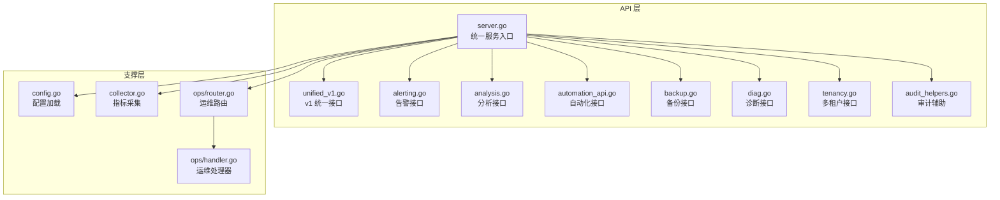
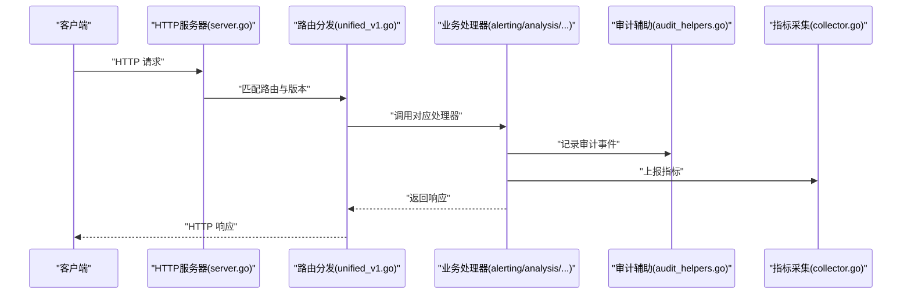
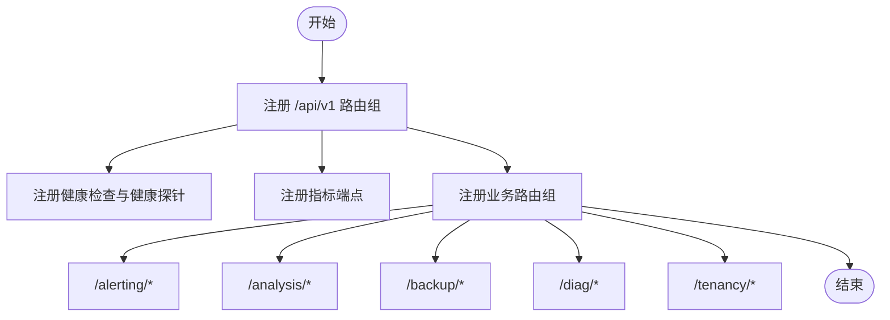
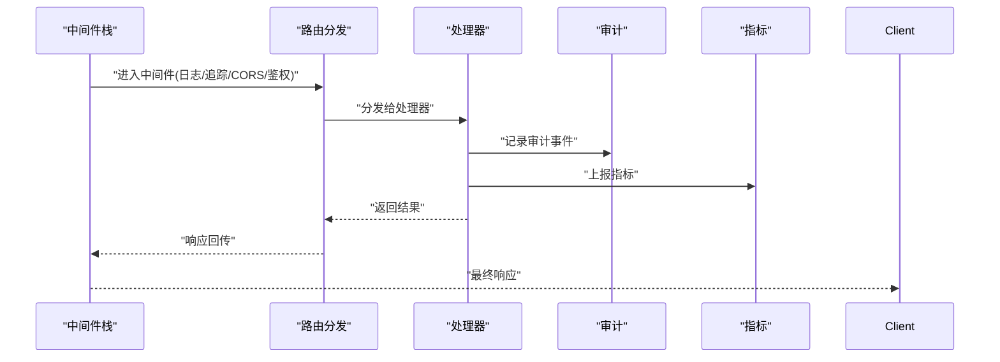
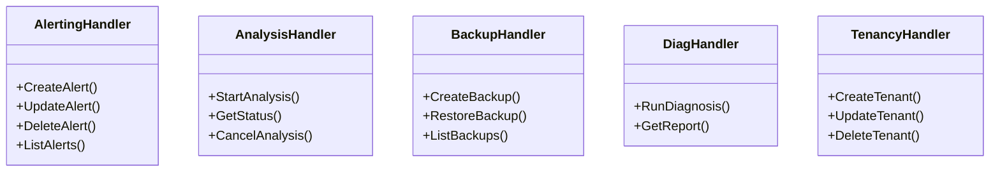
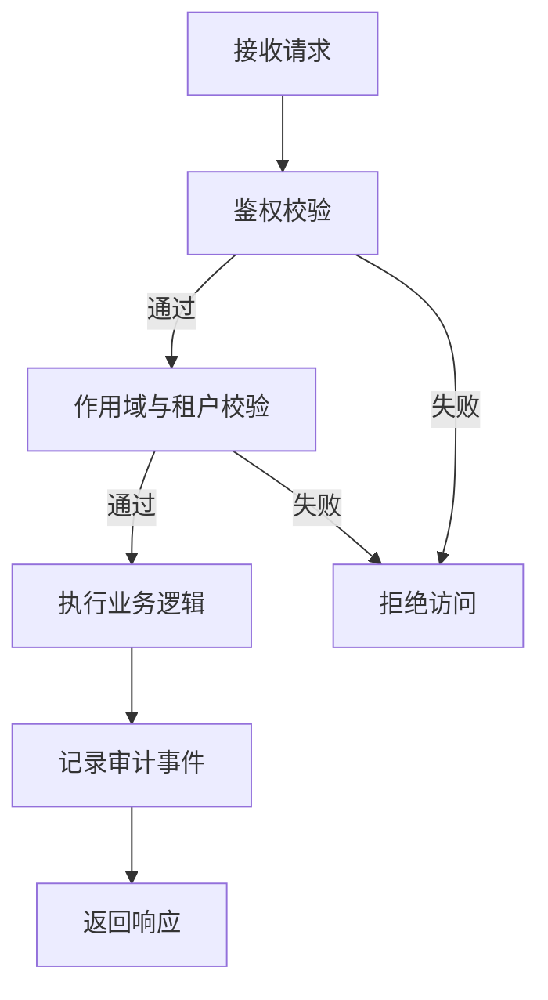
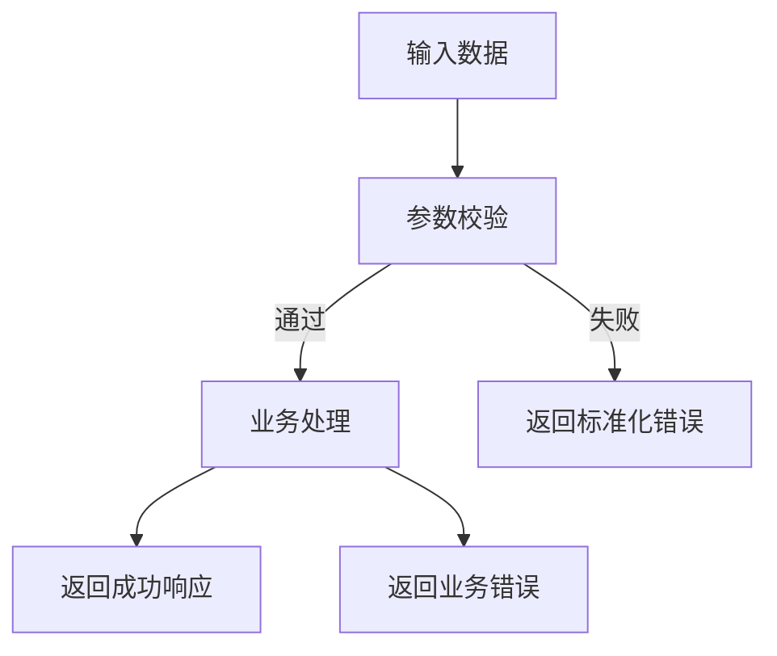
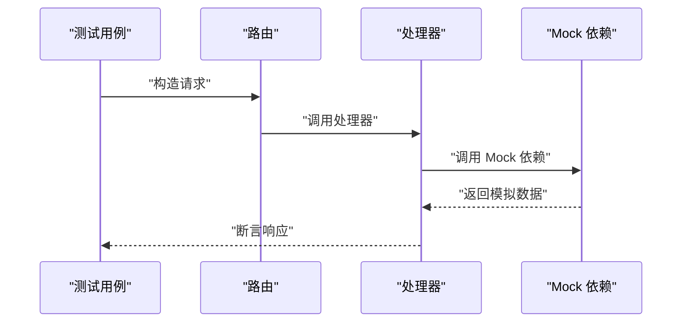
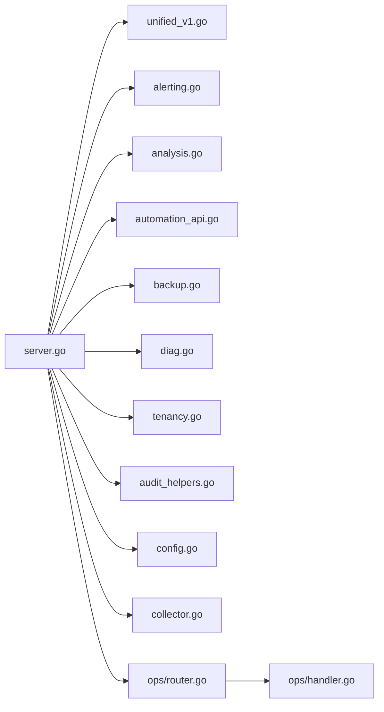

# API扩展开发

<cite>
**本文档引用的文件**   
- [internal/api/server.go](file://internal/api/server.go)
- [internal/api/unified_v1.go](file://internal/api/unified_v1.go)
- [internal/api/alerting.go](file://internal/api/alerting.go)
- [internal/api/analysis.go](file://internal/api/analysis.go)
- [internal/api/automation_api.go](file://internal/api/automation_api.go)
- [internal/api/backup.go](file://internal/api/backup.go)
- [internal/api/diag.go](file://internal/api/diag.go)
- [internal/api/handlers_test.go](file://internal/api/handlers_test.go)
- [internal/api/unified_v1_test.go](file://internal/api/unified_v1_test.go)
- [internal/api/tenancy.go](file://internal/api/tenancy.go)
- [internal/api/audit_helpers.go](file://internal/api/audit_helpers.go)
- [internal/config/config.go](file://internal/config/config.go)
- [internal/metrics/collector.go](file://internal/metrics/collector.go)
- [internal/ops/router.go](file://internal/ops/router.go)
- [internal/ops/handler.go](file://internal/ops/handler.go)
- [go.mod](file://go.mod)
</cite>

## 目录
1. [简介](#简介)
2. [项目结构](#项目结构)
3. [核心组件](#核心组件)
4. [架构总览](#架构总览)
5. [详细组件分析](#详细组件分析)
6. [依赖关系分析](#依赖关系分析)
7. [性能考虑](#性能考虑)
8. [故障排查指南](#故障排查指南)
9. [结论](#结论)
10. [附录](#附录)

## 简介
本指南面向需要在项目中扩展 RESTful API 的开发者，围绕路由注册、中间件、请求处理器、版本管理、参数校验、权限控制、文档自动生成、测试与监控等主题，提供从设计到落地的完整实践。内容基于仓库中 internal/api 及相关模块的实现模式进行总结与提炼，帮助你在不破坏既有架构的前提下，快速、安全地新增 API 端点并完善配套能力。

## 项目结构
本项目采用按功能域划分的模块化组织方式，API 层集中在 internal/api 下，每个业务域一个文件（如 alerting、analysis、backup、diag 等），并通过统一的服务器入口进行路由装配。配置位于 internal/config，指标采集在 internal/metrics，运维相关路由在 internal/ops。

**图示来源** 
- [internal/api/server.go](file://internal/api/server.go)
- [internal/api/unified_v1.go](file://internal/api/unified_v1.go)
- [internal/api/alerting.go](file://internal/api/alerting.go)
- [internal/api/analysis.go](file://internal/api/analysis.go)
- [internal/api/automation_api.go](file://internal/api/automation_api.go)
- [internal/api/backup.go](file://internal/api/backup.go)
- [internal/api/diag.go](file://internal/api/diag.go)
- [internal/api/tenancy.go](file://internal/api/tenancy.go)
- [internal/api/audit_helpers.go](file://internal/api/audit_helpers.go)
- [internal/config/config.go](file://internal/config/config.go)
- [internal/metrics/collector.go](file://internal/metrics/collector.go)
- [internal/ops/router.go](file://internal/ops/router.go)
- [internal/ops/handler.go](file://internal/ops/handler.go)

**章节来源**
- [internal/api/server.go](file://internal/api/server.go)
- [internal/config/config.go](file://internal/config/config.go)
- [internal/metrics/collector.go](file://internal/metrics/collector.go)
- [internal/ops/router.go](file://internal/ops/router.go)

## 核心组件
- 统一服务器与路由装配：负责 HTTP 服务器启动、全局中间件挂载、各业务路由组注册以及健康检查与指标暴露。
- 版本化 API：通过路径前缀或头信息区分 API 版本，当前实现以 v1 为主，便于后续演进。
- 业务处理器：按领域拆分，每个文件定义一组相关的端点与处理逻辑，保持高内聚低耦合。
- 审计与鉴权辅助：提供统一的审计记录与鉴权辅助方法，确保可追溯与安全合规。
- 指标与监控：集中采集关键指标，为性能分析与容量规划提供数据基础。
- 运维路由：独立于业务的路由分组，用于系统级操作与调试。

**章节来源**
- [internal/api/server.go](file://internal/api/server.go)
- [internal/api/unified_v1.go](file://internal/api/unified_v1.go)
- [internal/api/audit_helpers.go](file://internal/api/audit_helpers.go)
- [internal/metrics/collector.go](file://internal/metrics/collector.go)
- [internal/ops/router.go](file://internal/ops/router.go)

## 架构总览
下图展示了从客户端请求到业务处理的典型调用链，包括中间件、路由分发、处理器执行、指标采集与审计记录。

**图示来源** 
- [internal/api/server.go](file://internal/api/server.go)
- [internal/api/unified_v1.go](file://internal/api/unified_v1.go)
- [internal/api/alerting.go](file://internal/api/alerting.go)
- [internal/api/analysis.go](file://internal/api/analysis.go)
- [internal/api/audit_helpers.go](file://internal/api/audit_helpers.go)
- [internal/metrics/collector.go](file://internal/metrics/collector.go)

## 详细组件分析

### 路由注册与版本管理
- 路由分组：建议按业务域划分路由组，例如 /api/v1/alerting、/api/v1/analysis 等，便于权限与限流策略的细粒度控制。
- 版本策略：优先使用 URL 前缀版本化（如 /api/v1），避免频繁变更导致兼容性问题；如需灰度发布，可在 Header 中引入特性开关。
- 注册顺序：将健康检查与指标端点置于最外层，业务路由置于其后，确保基础设施端点始终可用。

**图示来源** 
- [internal/api/server.go](file://internal/api/server.go)
- [internal/api/unified_v1.go](file://internal/api/unified_v1.go)

**章节来源**
- [internal/api/server.go](file://internal/api/server.go)
- [internal/api/unified_v1.go](file://internal/api/unified_v1.go)

### 中间件开发与请求生命周期
- 通用中间件：建议在服务器层统一挂载日志、追踪、CORS、速率限制、认证授权等中间件，保证一致性与可观测性。
- 请求上下文：通过上下文传递用户身份、租户信息、请求 ID 等，贯穿整个处理链路。
- 错误处理：统一错误码与消息格式，结合审计记录定位问题。

**图示来源** 
- [internal/api/server.go](file://internal/api/server.go)
- [internal/api/audit_helpers.go](file://internal/api/audit_helpers.go)
- [internal/metrics/collector.go](file://internal/metrics/collector.go)

**章节来源**
- [internal/api/server.go](file://internal/api/server.go)
- [internal/api/audit_helpers.go](file://internal/api/audit_helpers.go)
- [internal/metrics/collector.go](file://internal/metrics/collector.go)

### 请求处理器实现规范
- 职责单一：每个处理器只负责单一资源或操作的 CRUD 与编排，复杂流程应拆分为子步骤或服务调用。
- 输入校验：对路径参数、查询参数、请求体进行严格校验，失败时返回标准化错误。
- 输出规范：统一响应结构，包含状态码、消息、数据体与追踪 ID。
- 幂等与事务：写操作需保证幂等性，必要时使用事务或补偿机制。

**图示来源** 
- [internal/api/alerting.go](file://internal/api/alerting.go)
- [internal/api/analysis.go](file://internal/api/analysis.go)
- [internal/api/backup.go](file://internal/api/backup.go)
- [internal/api/diag.go](file://internal/api/diag.go)
- [internal/api/tenancy.go](file://internal/api/tenancy.go)

**章节来源**
- [internal/api/alerting.go](file://internal/api/alerting.go)
- [internal/api/analysis.go](file://internal/api/analysis.go)
- [internal/api/backup.go](file://internal/api/backup.go)
- [internal/api/diag.go](file://internal/api/diag.go)
- [internal/api/tenancy.go](file://internal/api/tenancy.go)

### 权限控制与审计
- 鉴权策略：基于角色或能力的访问控制，结合租户隔离确保数据安全。
- 审计记录：所有敏感操作均需记录审计事件，包含操作者、时间、资源与结果。
- 合规要求：遵循最小权限原则，定期审查权限分配与审计日志。

**图示来源** 
- [internal/api/audit_helpers.go](file://internal/api/audit_helpers.go)

**章节来源**
- [internal/api/audit_helpers.go](file://internal/api/audit_helpers.go)

### 文档自动生成
- OpenAPI/Swagger：建议在处理器或路由层添加注解，生成 OpenAPI 描述文件，前端与工具链可直接消费。
- 示例与约束：在文档中明确请求体结构、枚举值、必填字段与错误码，提升集成效率。
- 版本同步：每次 API 变更需同步更新文档，确保一致性。

[本节为概念性说明，不直接分析具体文件]

### 参数验证与错误响应
- 校验规则：使用结构化校验器对输入进行强类型校验，支持自定义校验函数。
- 错误格式：统一错误响应结构，包含 code、message、details 与 traceId。
- 可观测性：错误发生时记录堆栈与上下文，便于快速定位。

**图示来源** 
- [internal/api/unified_v1.go](file://internal/api/unified_v1.go)

**章节来源**
- [internal/api/unified_v1.go](file://internal/api/unified_v1.go)

### 测试方法与最佳实践
- 单元测试：针对处理器与校验逻辑编写单测，覆盖正常与异常分支。
- 集成测试：模拟真实请求链路，验证路由、中间件与处理器协作。
- Mock 外部依赖：对数据库、Kubernetes、第三方服务进行 Mock，确保测试稳定性。

**图示来源** 
- [internal/api/handlers_test.go](file://internal/api/handlers_test.go)
- [internal/api/unified_v1_test.go](file://internal/api/unified_v1_test.go)

**章节来源**
- [internal/api/handlers_test.go](file://internal/api/handlers_test.go)
- [internal/api/unified_v1_test.go](file://internal/api/unified_v1_test.go)

## 依赖关系分析
API 层依赖配置、指标采集与运维路由等支撑模块，形成清晰的分层与解耦。

**图示来源** 
- [internal/api/server.go](file://internal/api/server.go)
- [internal/api/unified_v1.go](file://internal/api/unified_v1.go)
- [internal/api/alerting.go](file://internal/api/alerting.go)
- [internal/api/analysis.go](file://internal/api/analysis.go)
- [internal/api/automation_api.go](file://internal/api/automation_api.go)
- [internal/api/backup.go](file://internal/api/backup.go)
- [internal/api/diag.go](file://internal/api/diag.go)
- [internal/api/tenancy.go](file://internal/api/tenancy.go)
- [internal/api/audit_helpers.go](file://internal/api/audit_helpers.go)
- [internal/config/config.go](file://internal/config/config.go)
- [internal/metrics/collector.go](file://internal/metrics/collector.go)
- [internal/ops/router.go](file://internal/ops/router.go)
- [internal/ops/handler.go](file://internal/ops/handler.go)

**章节来源**
- [internal/api/server.go](file://internal/api/server.go)
- [internal/config/config.go](file://internal/config/config.go)
- [internal/metrics/collector.go](file://internal/metrics/collector.go)
- [internal/ops/router.go](file://internal/ops/router.go)

## 性能考虑
- 连接池与超时：合理设置 HTTP 客户端与服务端超时，避免资源耗尽。
- 并发与限流：对热点接口实施限流与熔断，保护后端服务。
- 缓存策略：对读多写少的数据引入缓存，降低下游压力。
- 指标与告警：通过指标采集与告警规则及时发现性能瓶颈。

[本节为通用指导，不直接分析具体文件]

## 故障排查指南
- 日志与追踪：启用结构化日志与分布式追踪，记录请求全链路。
- 错误分类：区分客户端错误、服务端错误与上游错误，针对性处理。
- 健康检查：提供就绪与存活探针，配合编排平台自动恢复。
- 审计回溯：通过审计事件定位问题根因与影响范围。

**章节来源**
- [internal/api/audit_helpers.go](file://internal/api/audit_helpers.go)
- [internal/metrics/collector.go](file://internal/metrics/collector.go)

## 结论
通过统一的路由装配、规范的处理器实现、完善的中间件与审计机制，以及健壮的测试与监控体系，可以在现有架构基础上高效扩展新的 API 端点。建议遵循版本化管理、严格参数校验、细粒度权限控制与自动化文档生成，确保 API 的可维护性与可扩展性。

[本节为总结性内容，不直接分析具体文件]

## 附录
- 配置项参考：查看配置文件以了解运行时参数与环境变量。
- 模块依赖：通过 go.mod 了解项目依赖与版本约束。

**章节来源**
- [internal/config/config.go](file://internal/config/config.go)
- [go.mod](file://go.mod)