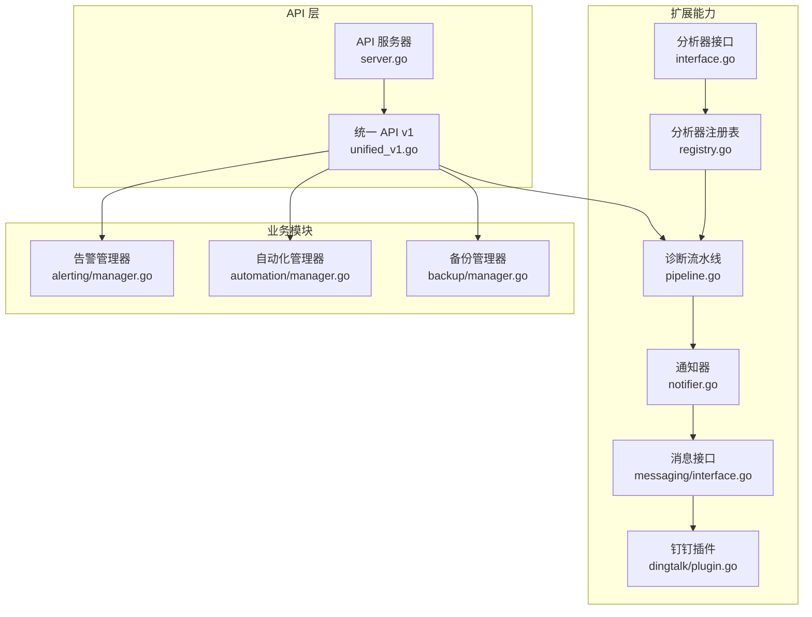
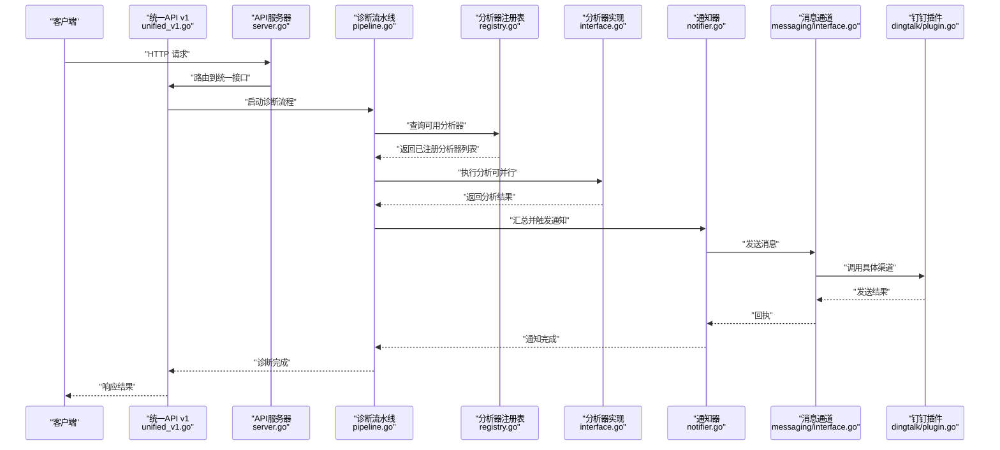
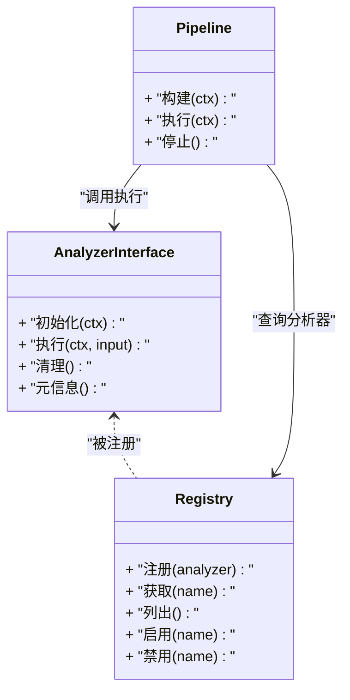
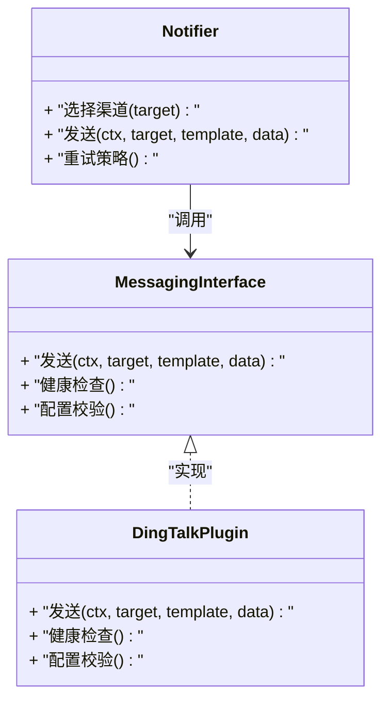
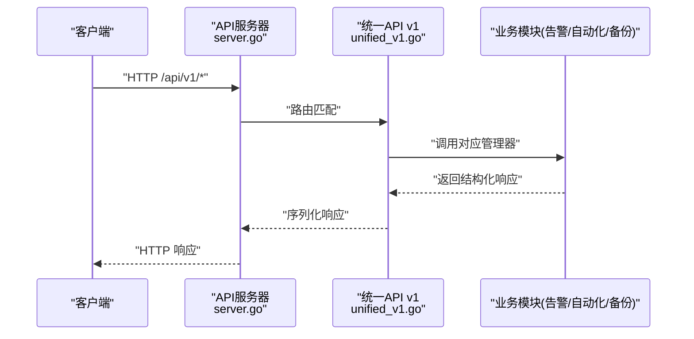
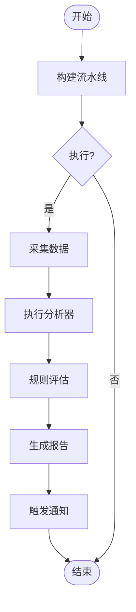
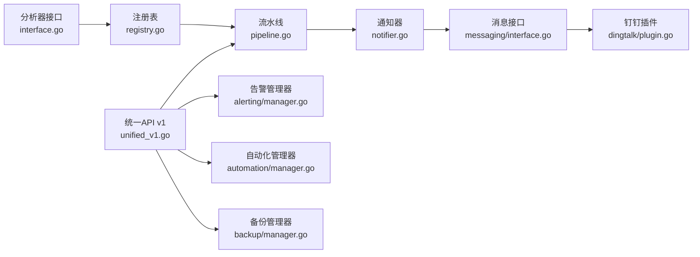

# 扩展开发

<cite>
**本文引用的文件**   
- [internal/diag/analyzer/interface.go](file://internal/diag/analyzer/interface.go)
- [internal/diag/analyzer/registry.go](file://internal/diag/analyzer/registry.go)
- [internal/diag/pipeline.go](file://internal/diag/pipeline.go)
- [internal/diag/notifier/notifier.go](file://internal/diag/notifier/notifier.go)
- [internal/messaging/interface.go](file://internal/messaging/interface.go)
- [internal/messaging/dingtalk/plugin.go](file://internal/messaging/dingtalk/plugin.go)
- [internal/api/server.go](file://internal/api/server.go)
- [internal/api/unified_v1.go](file://internal/api/unified_v1.go)
- [internal/alerting/manager.go](file://internal/alerting/manager.go)
- [internal/automation/manager.go](file://internal/automation/manager.go)
- [internal/backup/manager.go](file://internal/backup/manager.go)
- [configs/config.yaml.example](file://configs/config.yaml.example)
</cite>

## 目录
1. [简介](#简介)
2. [项目结构](#项目结构)
3. [核心组件](#核心组件)
4. [架构总览](#架构总览)
5. [详细组件分析](#详细组件分析)
6. [依赖关系分析](#依赖关系分析)
7. [性能考量](#性能考量)
8. [故障排查指南](#故障排查指南)
9. [结论](#结论)
10. [附录](#附录)

## 简介
本指南面向希望在 Klaw 平台上进行扩展开发的工程师，围绕以下能力提供系统化说明：
- 插件开发接口与注册机制
- 自定义分析器（Analyzer）开发与生命周期管理
- 通知渠道扩展（Messaging）实现与集成
- API 扩展与统一版本化接入
- 错误处理、可观测性与测试方法
- 完整示例与最佳实践建议

Klaw 的扩展体系以“接口定义 + 注册表 + 管道编排”为核心，通过清晰的边界和统一的契约，使第三方或内部团队能够以最小成本接入新的分析能力、通知渠道与 API 端点。

## 项目结构
从扩展视角看，关键目录与职责如下：
- internal/diag/analyzer：分析器接口与注册表，定义可扩展的分析能力
- internal/diag/pipeline：诊断流水线编排，串联采集、分析、报告等阶段
- internal/diag/notifier：诊断结果的通知分发
- internal/messaging：消息通道抽象与具体实现（如钉钉）
- internal/api：HTTP API 服务与路由、统一版本化接口
- internal/alerting：告警管理与触发
- internal/automation：自动化任务编排
- internal/backup：备份相关能力
- configs：配置样例与环境变量

图表来源
- [internal/diag/analyzer/interface.go](file://internal/diag/analyzer/interface.go)
- [internal/diag/analyzer/registry.go](file://internal/diag/analyzer/registry.go)
- [internal/diag/pipeline.go](file://internal/diag/pipeline.go)
- [internal/diag/notifier/notifier.go](file://internal/diag/notifier/notifier.go)
- [internal/messaging/interface.go](file://internal/messaging/interface.go)
- [internal/messaging/dingtalk/plugin.go](file://internal/messaging/dingtalk/plugin.go)
- [internal/api/server.go](file://internal/api/server.go)
- [internal/api/unified_v1.go](file://internal/api/unified_v1.go)
- [internal/alerting/manager.go](file://internal/alerting/manager.go)
- [internal/automation/manager.go](file://internal/automation/manager.go)
- [internal/backup/manager.go](file://internal/backup/manager.go)

章节来源
- [internal/diag/analyzer/interface.go](file://internal/diag/analyzer/interface.go)
- [internal/diag/analyzer/registry.go](file://internal/diag/analyzer/registry.go)
- [internal/diag/pipeline.go](file://internal/diag/pipeline.go)
- [internal/diag/notifier/notifier.go](file://internal/diag/notifier/notifier.go)
- [internal/messaging/interface.go](file://internal/messaging/interface.go)
- [internal/messaging/dingtalk/plugin.go](file://internal/messaging/dingtalk/plugin.go)
- [internal/api/server.go](file://internal/api/server.go)
- [internal/api/unified_v1.go](file://internal/api/unified_v1.go)
- [internal/alerting/manager.go](file://internal/alerting/manager.go)
- [internal/automation/manager.go](file://internal/automation/manager.go)
- [internal/backup/manager.go](file://internal/backup/manager.go)

## 核心组件
- 分析器接口与注册表：定义分析器的标准契约，并提供集中式注册与发现机制，便于动态加载与组合。
- 诊断流水线：将采集、分析、规则评估、报告生成与通知等环节串接起来，支持并行与容错。
- 通知器与消息通道：抽象通知目标，对接多种消息平台（如钉钉），支持模板与重试。
- API 层：提供 HTTP 入口，统一版本化管理，暴露诊断、告警、自动化、备份等能力。
- 告警/自动化/备份管理器：封装领域逻辑，供 API 层调用，形成完整的扩展生态。

章节来源
- [internal/diag/analyzer/interface.go](file://internal/diag/analyzer/interface.go)
- [internal/diag/analyzer/registry.go](file://internal/diag/analyzer/registry.go)
- [internal/diag/pipeline.go](file://internal/diag/pipeline.go)
- [internal/diag/notifier/notifier.go](file://internal/diag/notifier/notifier.go)
- [internal/messaging/interface.go](file://internal/messaging/interface.go)
- [internal/messaging/dingtalk/plugin.go](file://internal/messaging/dingtalk/plugin.go)
- [internal/api/server.go](file://internal/api/server.go)
- [internal/api/unified_v1.go](file://internal/api/unified_v1.go)
- [internal/alerting/manager.go](file://internal/alerting/manager.go)
- [internal/automation/manager.go](file://internal/automation/manager.go)
- [internal/backup/manager.go](file://internal/backup/manager.go)

## 架构总览
下图展示了扩展在 Klaw 中的整体交互：API 请求进入后，由统一版本化接口调度至诊断流水线；流水线根据注册表启用相应分析器；结果经通知器通过消息通道下发；同时可与告警、自动化、备份等模块联动。

图表来源
- [internal/api/unified_v1.go](file://internal/api/unified_v1.go)
- [internal/api/server.go](file://internal/api/server.go)
- [internal/diag/pipeline.go](file://internal/diag/pipeline.go)
- [internal/diag/analyzer/registry.go](file://internal/diag/analyzer/registry.go)
- [internal/diag/analyzer/interface.go](file://internal/diag/analyzer/interface.go)
- [internal/diag/notifier/notifier.go](file://internal/diag/notifier/notifier.go)
- [internal/messaging/interface.go](file://internal/messaging/interface.go)
- [internal/messaging/dingtalk/plugin.go](file://internal/messaging/dingtalk/plugin.go)

## 详细组件分析

### 分析器扩展（Analyzer）
- 接口契约：定义分析器的输入输出、上下文、错误处理与生命周期钩子。
- 注册机制：通过注册表集中管理，支持按名称或标签启用/禁用。
- 生命周期：初始化、运行、清理；支持超时与取消。
- 错误处理：区分可恢复与不可恢复错误，记录上下文以便定位。
- 性能：支持并发执行与结果聚合，避免阻塞主流程。

图表来源
- [internal/diag/analyzer/interface.go](file://internal/diag/analyzer/interface.go)
- [internal/diag/analyzer/registry.go](file://internal/diag/analyzer/registry.go)
- [internal/diag/pipeline.go](file://internal/diag/pipeline.go)

章节来源
- [internal/diag/analyzer/interface.go](file://internal/diag/analyzer/interface.go)
- [internal/diag/analyzer/registry.go](file://internal/diag/analyzer/registry.go)
- [internal/diag/pipeline.go](file://internal/diag/pipeline.go)

### 通知渠道扩展（Messaging）
- 抽象接口：定义发送消息的统一方法、模板渲染、重试策略与状态上报。
- 插件实现：以钉钉为例，展示如何基于接口实现具体渠道。
- 集成方式：通过配置选择启用的渠道，支持多目标与优先级。
- 错误处理：网络异常、限流、鉴权失败等场景的分类与重试。

图表来源
- [internal/messaging/interface.go](file://internal/messaging/interface.go)
- [internal/messaging/dingtalk/plugin.go](file://internal/messaging/dingtalk/plugin.go)
- [internal/diag/notifier/notifier.go](file://internal/diag/notifier/notifier.go)

章节来源
- [internal/messaging/interface.go](file://internal/messaging/interface.go)
- [internal/messaging/dingtalk/plugin.go](file://internal/messaging/dingtalk/plugin.go)
- [internal/diag/notifier/notifier.go](file://internal/diag/notifier/notifier.go)

### API 扩展（Unified v1）
- 路由与服务：API 服务器负责监听端口、路由分发与中间件。
- 统一版本化：v1 接口作为稳定契约，屏蔽底层实现差异。
- 扩展点：新增端点时遵循版本化规范，保持向后兼容。
- 鉴权与限流：结合认证与速率限制，保障安全与稳定性。

图表来源
- [internal/api/server.go](file://internal/api/server.go)
- [internal/api/unified_v1.go](file://internal/api/unified_v1.go)
- [internal/alerting/manager.go](file://internal/alerting/manager.go)
- [internal/automation/manager.go](file://internal/automation/manager.go)
- [internal/backup/manager.go](file://internal/backup/manager.go)

章节来源
- [internal/api/server.go](file://internal/api/server.go)
- [internal/api/unified_v1.go](file://internal/api/unified_v1.go)
- [internal/alerting/manager.go](file://internal/alerting/manager.go)
- [internal/automation/manager.go](file://internal/automation/manager.go)
- [internal/backup/manager.go](file://internal/backup/manager.go)

### 诊断流水线（Pipeline）
- 编排模式：将采集、分析、规则评估、报告生成与通知串联，支持阶段级并行。
- 生命周期：构建、执行、停止；支持优雅关闭与上下文取消。
- 容错：单阶段失败不影响其他分支，支持降级与回退。
- 可观测性：阶段耗时、错误计数、指标上报。

图表来源
- [internal/diag/pipeline.go](file://internal/diag/pipeline.go)

章节来源
- [internal/diag/pipeline.go](file://internal/diag/pipeline.go)

## 依赖关系分析
- 低耦合高内聚：分析器、通知、API 均通过接口解耦，便于替换与扩展。
- 注册表驱动：分析器通过注册表集中管理，避免硬编码依赖。
- 版本化 API：统一接口保证向前兼容，降低升级成本。
- 外部依赖：消息通道对接第三方平台，需关注鉴权、限流与可用性。

图表来源
- [internal/diag/analyzer/interface.go](file://internal/diag/analyzer/interface.go)
- [internal/diag/analyzer/registry.go](file://internal/diag/analyzer/registry.go)
- [internal/diag/pipeline.go](file://internal/diag/pipeline.go)
- [internal/diag/notifier/notifier.go](file://internal/diag/notifier/notifier.go)
- [internal/messaging/interface.go](file://internal/messaging/interface.go)
- [internal/messaging/dingtalk/plugin.go](file://internal/messaging/dingtalk/plugin.go)
- [internal/api/unified_v1.go](file://internal/api/unified_v1.go)
- [internal/alerting/manager.go](file://internal/alerting/manager.go)
- [internal/automation/manager.go](file://internal/automation/manager.go)
- [internal/backup/manager.go](file://internal/backup/manager.go)

章节来源
- [internal/diag/analyzer/interface.go](file://internal/diag/analyzer/interface.go)
- [internal/diag/analyzer/registry.go](file://internal/diag/analyzer/registry.go)
- [internal/diag/pipeline.go](file://internal/diag/pipeline.go)
- [internal/diag/notifier/notifier.go](file://internal/diag/notifier/notifier.go)
- [internal/messaging/interface.go](file://internal/messaging/interface.go)
- [internal/messaging/dingtalk/plugin.go](file://internal/messaging/dingtalk/plugin.go)
- [internal/api/unified_v1.go](file://internal/api/unified_v1.go)
- [internal/alerting/manager.go](file://internal/alerting/manager.go)
- [internal/automation/manager.go](file://internal/automation/manager.go)
- [internal/backup/manager.go](file://internal/backup/manager.go)

## 性能考量
- 分析器并发：对 IO 密集型分析器采用并发执行与结果聚合，减少端到端延迟。
- 流水线背压：在高负载下通过队列与限流控制吞吐，避免内存膨胀。
- 通知重试：指数退避与幂等设计，降低重复发送与抖动。
- 资源隔离：为不同分析器分配独立上下文与超时，防止相互影响。
- 指标与日志：记录关键路径耗时与错误率，辅助容量规划与问题定位。

[本节为通用指导，不直接分析具体文件]

## 故障排查指南
- 分析器未生效：检查注册表是否成功注册、名称与标签是否匹配、是否被禁用。
- 通知失败：确认消息通道配置正确、鉴权有效、目标可达；查看重试与降级策略。
- API 报错：核对路由与版本化路径、参数校验、鉴权与限流设置。
- 流水线卡住：检查上下文取消、超时设置、死锁与资源泄漏。
- 日志与追踪：开启详细日志，收集阶段指标与堆栈，快速定位根因。

章节来源
- [internal/diag/analyzer/registry.go](file://internal/diag/analyzer/registry.go)
- [internal/diag/notifier/notifier.go](file://internal/diag/notifier/notifier.go)
- [internal/messaging/interface.go](file://internal/messaging/interface.go)
- [internal/api/server.go](file://internal/api/server.go)
- [internal/api/unified_v1.go](file://internal/api/unified_v1.go)
- [internal/diag/pipeline.go](file://internal/diag/pipeline.go)

## 结论
Klaw 的扩展体系以接口为中心、注册表为枢纽、流水线为编排载体，提供了清晰且强大的扩展能力。通过遵循接口契约、完善错误处理与测试覆盖，开发者可以快速接入新的分析能力、通知渠道与 API 端点，构建稳定高效的诊断与运维生态。

[本节为总结性内容，不直接分析具体文件]

## 附录

### 插件注册与生命周期最佳实践
- 明确元信息：名称、版本、描述、依赖与兼容性矩阵。
- 健壮初始化：校验配置、准备资源、建立连接池。
- 优雅退出：释放资源、刷新缓冲、上报状态。
- 可测试性：提供 Mock 与桩函数，覆盖正常与异常路径。

章节来源
- [internal/diag/analyzer/interface.go](file://internal/diag/analyzer/interface.go)
- [internal/diag/analyzer/registry.go](file://internal/diag/analyzer/registry.go)

### 自定义分析器开发步骤
- 实现接口：定义输入输出、上下文与错误语义。
- 注册分析器：在合适的初始化位置调用注册表。
- 配置启用：通过配置文件或环境变量启用/禁用。
- 单元测试：覆盖边界条件与异常路径。
- 集成测试：在流水线中验证端到端行为。

章节来源
- [internal/diag/analyzer/interface.go](file://internal/diag/analyzer/interface.go)
- [internal/diag/analyzer/registry.go](file://internal/diag/analyzer/registry.go)
- [internal/diag/pipeline.go](file://internal/diag/pipeline.go)

### 通知渠道扩展步骤
- 实现消息接口：发送、健康检查、配置校验。
- 插件装配：在消息通道中注册新渠道。
- 模板与变量：支持富文本与动态数据填充。
- 重试与降级：应对网络波动与限流。
- 监控与告警：跟踪发送成功率与延迟。

章节来源
- [internal/messaging/interface.go](file://internal/messaging/interface.go)
- [internal/messaging/dingtalk/plugin.go](file://internal/messaging/dingtalk/plugin.go)
- [internal/diag/notifier/notifier.go](file://internal/diag/notifier/notifier.go)

### API 扩展步骤
- 新增端点：遵循统一版本化规范，定义请求/响应模型。
- 路由注册：在服务器中注册路由与中间件。
- 鉴权与限流：确保安全性与稳定性。
- 文档与示例：提供 OpenAPI 与调用示例。
- 回归测试：覆盖正向与反向用例。

章节来源
- [internal/api/server.go](file://internal/api/server.go)
- [internal/api/unified_v1.go](file://internal/api/unified_v1.go)

### 配置与环境
- 使用配置样例：参考示例配置，按需调整参数。
- 环境变量优先：敏感信息通过环境变量注入。
- 热更新支持：在不重启的情况下切换渠道与分析器。

章节来源
- [configs/config.yaml.example](file://configs/config.yaml.example)