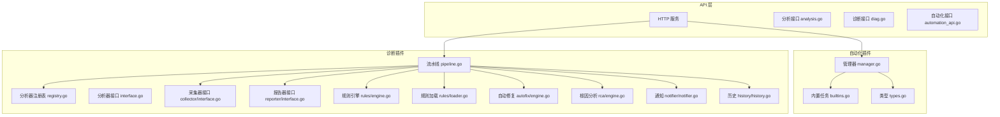
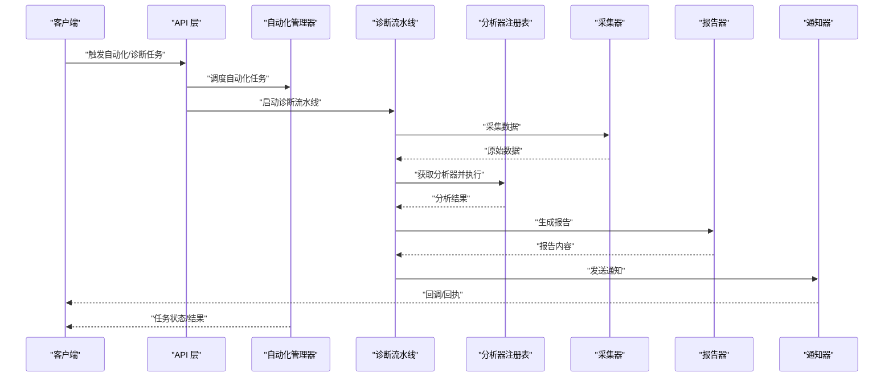
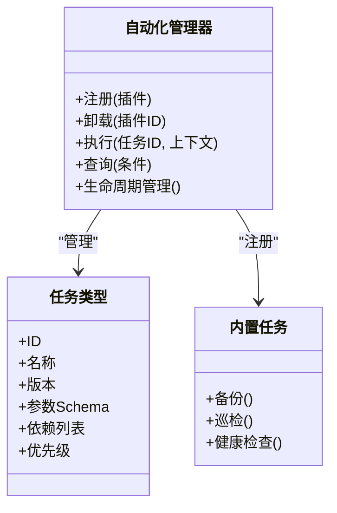
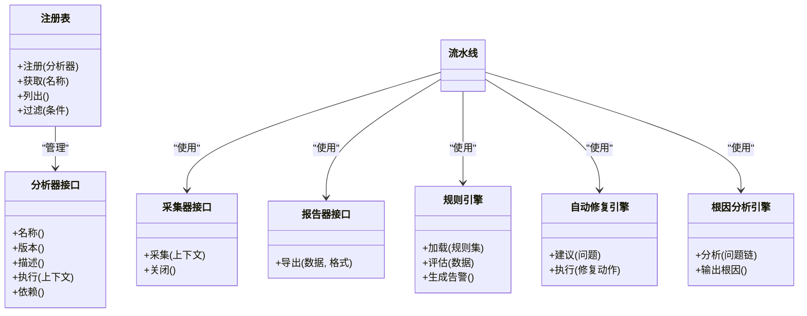
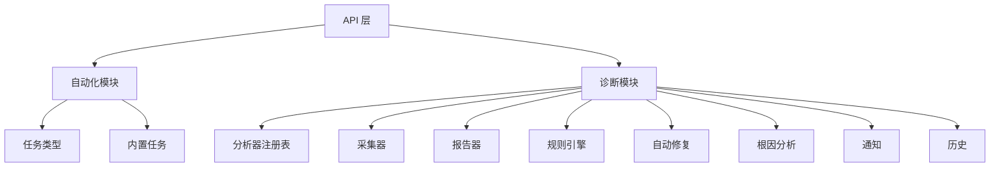

# 插件架构设计

<cite>
**本文引用的文件**
- [internal/automation/manager.go](file://internal/automation/manager.go)
- [internal/automation/builtins.go](file://internal/automation/builtins.go)
- [internal/automation/types.go](file://internal/automation/types.go)
- [internal/diag/pipeline.go](file://internal/diag/pipeline.go)
- [internal/diag/analyzer/interface.go](file://internal/diag/analyzer/interface.go)
- [internal/diag/analyzer/registry.go](file://internal/diag/analyzer/registry.go)
- [internal/diag/analyzer/kubernetes/kubernetes.go](file://internal/diag/analyzer/kubernetes/kubernetes.go)
- [internal/diag/analyzer/kernel/kernel.go](file://internal/diag/analyzer/kernel/kernel.go)
- [internal/diag/analyzer/network/network.go](file://internal/diag/analyzer/network/network.go)
- [internal/diag/analyzer/system/resource.go](file://internal/diag/analyzer/system/resource.go)
- [internal/diag/analyzer/security/rbac.go](file://internal/diag/analyzer/security/rbac.go)
- [internal/diag/analyzer/servicemesh/istio.go](file://internal/diag/analyzer/servicemesh/istio.go)
- [internal/diag/analyzer/runtime/runtime.go](file://internal/diag/analyzer/runtime/runtime.go)
- [internal/diag/analyzer/log/log.go](file://internal/diag/analyzer/log/log.go)
- [internal/diag/analyzer/process/service.go](file://internal/diag/analyzer/process/service.go)
- [internal/diag/analyzer/storage/storage.go](file://internal/diag/analyzer/storage/storage.go)
- [internal/diag/analyzer/workload/workload.go](file://internal/diag/analyzer/workload/workload.go)
- [internal/diag/analyzer/gpu/gpu.go](file://internal/diag/analyzer/gpu/gpu.go)
- [internal/diag/analyzer/dns/dns.go](file://internal/diag/analyzer/dns/dns.go)
- [internal/diag/analyzer/controlplane/controlplane.go](file://internal/diag/analyzer/controlplane/controlplane.go)
- [internal/diag/collector/interface.go](file://internal/diag/collector/interface.go)
- [internal/diag/collector/online/kubernetes.go](file://internal/diag/collector/online/kubernetes.go)
- [internal/diag/collector/offline/directory.go](file://internal/diag/collector/offline/directory.go)
- [internal/diag/reporter/interface.go](file://internal/diag/reporter/interface.go)
- [internal/diag/reporter/html.go](file://internal/diag/reporter/html.go)
- [internal/diag/reporter/json.go](file://internal/diag/reporter/json.go)
- [internal/diag/reporter/text.go](file://internal/diag/reporter/text.go)
- [internal/diag/reporter/grafana.go](file://internal/diag/reporter/grafana.go)
- [internal/diag/reporter/sarif.go](file://internal/diag/reporter/sarif.go)
- [internal/diag/types/diagnostic_data.go](file://internal/diag/types/diagnostic_data.go)
- [internal/diag/types/issue.go](file://internal/diag/types/issue.go)
- [internal/diag/types/severity.go](file://internal/diag/types/severity.go)
- [internal/diag/rules/engine.go](file://internal/diag/rules/engine.go)
- [internal/diag/rules/loader.go](file://internal/diag/rules/loader.go)
- [internal/diag/rules/types.go](file://internal/diag/rules/types.go)
- [internal/diag/autofix/engine.go](file://internal/diag/autofix/engine.go)
- [internal/diag/rca/engine.go](file://internal/diag/rca/engine.go)
- [internal/diag/notifier/notifier.go](file://internal/diag/notifier/notifier.go)
- [internal/diag/history/history.go](file://internal/diag/history/history.go)
- [internal/diag/import.go](file://internal/diag/import.go)
- [internal/api/server.go](file://internal/api/server.go)
- [internal/api/analysis.go](file://internal/api/analysis.go)
- [internal/api/diag.go](file://internal/api/diag.go)
- [internal/api/automation_api.go](file://internal/api/automation_api.go)
- [internal/config/config.go](file://internal/config/config.go)
</cite>

## 目录
1. [简介](#简介)
2. [项目结构](#项目结构)
3. [核心组件](#核心组件)
4. [架构总览](#架构总览)
5. [详细组件分析](#详细组件分析)
6. [依赖关系分析](#依赖关系分析)
7. [性能考量](#性能考量)
8. [故障排查指南](#故障排查指南)
9. [结论](#结论)
10. [附录](#附录)

## 简介
本文件系统性阐述 Klaw 平台的插件架构设计，覆盖整体设计模式、插件注册机制、生命周期管理、依赖注入、内置插件实现（自动化任务与诊断分析器）、接口规范、扩展点定义、插件间通信、加载顺序、错误处理与资源管理策略。文档面向不同技术背景的读者，提供从高层概览到代码级细节的分层说明，并辅以可视化图示帮助理解。

## 项目结构
Klaw 的插件体系主要分布在以下模块：
- 自动化任务插件：位于 internal/automation，提供任务编排、调度与内置任务实现。
- 诊断分析器插件：位于 internal/diag，包含采集器、分析器、规则引擎、报告器、自动修复与根因分析等子模块。
- API 层：internal/api 暴露 REST 接口，驱动自动化与诊断流程。
- 配置：internal/config 提供运行时配置与插件开关。

图表来源
- [internal/api/server.go](file://internal/api/server.go)
- [internal/api/analysis.go](file://internal/api/analysis.go)
- [internal/api/diag.go](file://internal/api/diag.go)
- [internal/api/automation_api.go](file://internal/api/automation_api.go)
- [internal/automation/manager.go](file://internal/automation/manager.go)
- [internal/automation/builtins.go](file://internal/automation/builtins.go)
- [internal/automation/types.go](file://internal/automation/types.go)
- [internal/diag/pipeline.go](file://internal/diag/pipeline.go)
- [internal/diag/analyzer/registry.go](file://internal/diag/analyzer/registry.go)
- [internal/diag/analyzer/interface.go](file://internal/diag/analyzer/interface.go)
- [internal/diag/collector/interface.go](file://internal/diag/collector/interface.go)
- [internal/diag/reporter/interface.go](file://internal/diag/reporter/interface.go)
- [internal/diag/rules/engine.go](file://internal/diag/rules/engine.go)
- [internal/diag/rules/loader.go](file://internal/diag/rules/loader.go)
- [internal/diag/autofix/engine.go](file://internal/diag/autofix/engine.go)
- [internal/diag/rca/engine.go](file://internal/diag/rca/engine.go)
- [internal/diag/notifier/notifier.go](file://internal/diag/notifier/notifier.go)
- [internal/diag/history/history.go](file://internal/diag/history/history.go)

章节来源
- [internal/api/server.go](file://internal/api/server.go)
- [internal/api/analysis.go](file://internal/api/analysis.go)
- [internal/api/diag.go](file://internal/api/diag.go)
- [internal/api/automation_api.go](file://internal/api/automation_api.go)
- [internal/automation/manager.go](file://internal/automation/manager.go)
- [internal/automation/builtins.go](file://internal/automation/builtins.go)
- [internal/automation/types.go](file://internal/automation/types.go)
- [internal/diag/pipeline.go](file://internal/diag/pipeline.go)

## 核心组件
- 自动化任务插件管理器：负责插件发现、注册、生命周期管理与执行编排。
- 诊断分析器注册表：集中管理分析器实例，支持按名称或标签检索与批量执行。
- 采集器接口：统一数据采集入口，支持在线（如 Kubernetes）与离线（如目录快照）两种模式。
- 报告器接口：将诊断结果导出为多种格式（HTML、JSON、文本、SARIF、Grafana）。
- 规则引擎：基于可加载的规则集对分析结果进行判定与告警。
- 自动修复与根因分析：在诊断基础上提供修复建议与根因定位能力。
- 通知与历史：将结果推送至外部系统并持久化历史记录。

章节来源
- [internal/automation/manager.go](file://internal/automation/manager.go)
- [internal/diag/analyzer/registry.go](file://internal/diag/analyzer/registry.go)
- [internal/diag/collector/interface.go](file://internal/diag/collector/interface.go)
- [internal/diag/reporter/interface.go](file://internal/diag/reporter/interface.go)
- [internal/diag/rules/engine.go](file://internal/diag/rules/engine.go)
- [internal/diag/autofix/engine.go](file://internal/diag/autofix/engine.go)
- [internal/diag/rca/engine.go](file://internal/diag/rca/engine.go)
- [internal/diag/notifier/notifier.go](file://internal/diag/notifier/notifier.go)
- [internal/diag/history/history.go](file://internal/diag/history/history.go)

## 架构总览
Klaw 插件架构采用“接口抽象 + 注册表 + 流水线”的模式：
- 接口抽象：通过统一的接口定义（分析器、采集器、报告器等）屏蔽具体实现差异。
- 注册表：集中式注册与查找，支持插件动态发现与版本兼容。
- 流水线：以阶段化的方式组织采集、分析、规则判定、修复建议、报告生成与通知。

图表来源
- [internal/api/automation_api.go](file://internal/api/automation_api.go)
- [internal/api/analysis.go](file://internal/api/analysis.go)
- [internal/api/diag.go](file://internal/api/diag.go)
- [internal/automation/manager.go](file://internal/automation/manager.go)
- [internal/diag/pipeline.go](file://internal/diag/pipeline.go)
- [internal/diag/analyzer/registry.go](file://internal/diag/analyzer/registry.go)
- [internal/diag/collector/interface.go](file://internal/diag/collector/interface.go)
- [internal/diag/reporter/interface.go](file://internal/diag/reporter/interface.go)
- [internal/diag/notifier/notifier.go](file://internal/diag/notifier/notifier.go)

## 详细组件分析

### 自动化任务插件
- 设计要点
  - 插件类型与元数据：通过类型定义描述任务能力、参数、依赖与优先级。
  - 注册与发现：管理器维护插件清单，支持热插拔与按需加载。
  - 生命周期：初始化、运行、取消、清理四个阶段，确保资源释放与幂等性。
  - 依赖注入：通过上下文传递共享对象（配置、日志、事件总线等）。
  - 错误处理：统一错误包装与重试策略，支持部分失败与补偿。
- 内置任务示例
  - 备份、巡检、健康检查等常见运维任务作为内置插件提供开箱即用能力。

图表来源
- [internal/automation/manager.go](file://internal/automation/manager.go)
- [internal/automation/types.go](file://internal/automation/types.go)
- [internal/automation/builtins.go](file://internal/automation/builtins.go)

章节来源
- [internal/automation/manager.go](file://internal/automation/manager.go)
- [internal/automation/types.go](file://internal/automation/types.go)
- [internal/automation/builtins.go](file://internal/automation/builtins.go)

### 诊断分析器插件
- 设计要点
  - 分析器接口：定义标准方法用于采集、分析与输出问题。
  - 注册表：集中管理分析器实例，支持按名称、标签、版本筛选。
  - 流水线：串联采集、分析、规则判定、修复建议、报告生成与通知。
  - 采集器：支持在线（Kubernetes）与离线（目录快照）两种模式。
  - 报告器：多格式输出，便于集成与展示。
  - 规则引擎：可加载规则集，灵活定义检测逻辑与告警阈值。
  - 自动修复与根因分析：在诊断基础上提供修复动作与根因推断。
  - 通知与历史：将结果推送至外部系统并持久化历史记录。
- 内置分析器示例
  - Kubernetes、内核、网络、系统资源、安全（RBAC/CIS）、服务网格（Istio）、运行时、日志、进程、存储、工作负载、GPU、DNS、控制面等。

图表来源
- [internal/diag/analyzer/interface.go](file://internal/diag/analyzer/interface.go)
- [internal/diag/analyzer/registry.go](file://internal/diag/analyzer/registry.go)
- [internal/diag/collector/interface.go](file://internal/diag/collector/interface.go)
- [internal/diag/reporter/interface.go](file://internal/diag/reporter/interface.go)
- [internal/diag/rules/engine.go](file://internal/diag/rules/engine.go)
- [internal/diag/autofix/engine.go](file://internal/diag/autofix/engine.go)
- [internal/diag/rca/engine.go](file://internal/diag/rca/engine.go)

章节来源
- [internal/diag/analyzer/interface.go](file://internal/diag/analyzer/interface.go)
- [internal/diag/analyzer/registry.go](file://internal/diag/analyzer/registry.go)
- [internal/diag/collector/interface.go](file://internal/diag/collector/interface.go)
- [internal/diag/reporter/interface.go](file://internal/diag/reporter/interface.go)
- [internal/diag/rules/engine.go](file://internal/diag/rules/engine.go)
- [internal/diag/autofix/engine.go](file://internal/diag/autofix/engine.go)
- [internal/diag/rca/engine.go](file://internal/diag/rca/engine.go)

#### 内置分析器实现示例
- Kubernetes 分析器：采集集群状态、节点、Pod、Service 等资源，识别异常与风险。
- 内核分析器：检查内核参数、模块、性能计数器，定位内核相关问题。
- 网络分析器：探测连通性、延迟、丢包、DNS 解析等问题。
- 系统资源分析器：监控 CPU、内存、磁盘、IO 等指标，识别瓶颈。
- 安全分析器：检查 RBAC 权限、CIS 基线、漏洞扫描结果。
- 服务网格分析器：分析 Istio 流量、策略、证书与健康状态。
- 运行时分析器：检查容器运行时状态、镜像、资源限制。
- 日志分析器：聚合与分析应用日志，提取错误模式。
- 进程分析器：监控关键进程存活、资源占用、依赖关系。
- 存储分析器：检查卷挂载、容量、IOPS、配额。
- 工作负载分析器：分析 Deployment、StatefulSet、Job 等状态。
- GPU 分析器：监控 GPU 利用率、显存、温度、驱动版本。
- DNS 分析器：解析延迟、缓存命中率、域名可达性。
- 控制面分析器：检查 API Server、etcd、Scheduler、Controller Manager 健康。

章节来源
- [internal/diag/analyzer/kubernetes/kubernetes.go](file://internal/diag/analyzer/kubernetes/kubernetes.go)
- [internal/diag/analyzer/kernel/kernel.go](file://internal/diag/analyzer/kernel/kernel.go)
- [internal/diag/analyzer/network/network.go](file://internal/diag/analyzer/network/network.go)
- [internal/diag/analyzer/system/resource.go](file://internal/diag/analyzer/system/resource.go)
- [internal/diag/analyzer/security/rbac.go](file://internal/diag/analyzer/security/rbac.go)
- [internal/diag/analyzer/servicemesh/istio.go](file://internal/diag/analyzer/servicemesh/istio.go)
- [internal/diag/analyzer/runtime/runtime.go](file://internal/diag/analyzer/runtime/runtime.go)
- [internal/diag/analyzer/log/log.go](file://internal/diag/analyzer/log/log.go)
- [internal/diag/analyzer/process/service.go](file://internal/diag/analyzer/process/service.go)
- [internal/diag/analyzer/storage/storage.go](file://internal/diag/analyzer/storage/storage.go)
- [internal/diag/analyzer/workload/workload.go](file://internal/diag/analyzer/workload/workload.go)
- [internal/diag/analyzer/gpu/gpu.go](file://internal/diag/analyzer/gpu/gpu.go)
- [internal/diag/analyzer/dns/dns.go](file://internal/diag/analyzer/dns/dns.go)
- [internal/diag/analyzer/controlplane/controlplane.go](file://internal/diag/analyzer/controlplane/controlplane.go)

#### 采集器与报告器
- 采集器
  - 在线采集器：通过 Kubernetes API 实时获取集群信息。
  - 离线采集器：从本地目录读取快照数据，适用于无网环境。
- 报告器
  - HTML：交互式报告，适合浏览器查看。
  - JSON：结构化数据，便于程序消费。
  - 文本：简洁文本，适合终端输出。
  - SARIF：静态分析结果交换格式，便于集成工具链。
  - Grafana：推送指标与面板数据，便于可视化。

章节来源
- [internal/diag/collector/online/kubernetes.go](file://internal/diag/collector/online/kubernetes.go)
- [internal/diag/collector/offline/directory.go](file://internal/diag/collector/offline/directory.go)
- [internal/diag/reporter/html.go](file://internal/diag/reporter/html.go)
- [internal/diag/reporter/json.go](file://internal/diag/reporter/json.go)
- [internal/diag/reporter/text.go](file://internal/diag/reporter/text.go)
- [internal/diag/reporter/sarif.go](file://internal/diag/reporter/sarif.go)
- [internal/diag/reporter/grafana.go](file://internal/diag/reporter/grafana.go)

#### 规则引擎与数据模型
- 规则引擎
  - 加载：从配置文件或远程源加载规则集。
  - 评估：对分析结果进行匹配与评分。
  - 告警：生成标准化告警事件。
- 数据模型
  - 诊断数据：统一的数据结构，承载采集与分析结果。
  - 问题：标准化的问题描述，包含严重级别、影响范围、修复建议。
  - 严重级别：定义问题的严重程度等级。

章节来源
- [internal/diag/rules/loader.go](file://internal/diag/rules/loader.go)
- [internal/diag/rules/engine.go](file://internal/diag/rules/engine.go)
- [internal/diag/types/diagnostic_data.go](file://internal/diag/types/diagnostic_data.go)
- [internal/diag/types/issue.go](file://internal/diag/types/issue.go)
- [internal/diag/types/severity.go](file://internal/diag/types/severity.go)

#### 自动修复与根因分析
- 自动修复
  - 建议：根据问题生成修复步骤。
  - 执行：在授权范围内执行修复动作，支持回滚。
- 根因分析
  - 分析：构建问题链，定位根本原因。
  - 输出：提供根因报告与改进建议。

章节来源
- [internal/diag/autofix/engine.go](file://internal/diag/autofix/engine.go)
- [internal/diag/rca/engine.go](file://internal/diag/rca/engine.go)

#### 通知与历史
- 通知
  - 支持多种渠道（如企业微信、钉钉、邮件等），将诊断结果推送给相关人员。
- 历史
  - 记录每次诊断的执行时间、结果摘要与详情，便于回溯与对比。

章节来源
- [internal/diag/notifier/notifier.go](file://internal/diag/notifier/notifier.go)
- [internal/diag/history/history.go](file://internal/diag/history/history.go)

### 插件接口规范与扩展点
- 分析器接口
  - 定义名称、版本、描述、执行方法与依赖声明。
- 采集器接口
  - 定义采集与关闭方法，确保资源释放。
- 报告器接口
  - 定义导出方法，支持多种格式。
- 扩展点
  - 注册表：用于动态注册与查找插件。
  - 流水线阶段：允许插入自定义阶段（如预处理、后处理）。
  - 规则集：允许用户自定义规则，增强检测能力。

章节来源
- [internal/diag/analyzer/interface.go](file://internal/diag/analyzer/interface.go)
- [internal/diag/collector/interface.go](file://internal/diag/collector/interface.go)
- [internal/diag/reporter/interface.go](file://internal/diag/reporter/interface.go)
- [internal/diag/analyzer/registry.go](file://internal/diag/analyzer/registry.go)
- [internal/diag/rules/loader.go](file://internal/diag/rules/loader.go)

### 插件间通信机制
- 上下文传递：通过上下文对象传递配置、日志、事件总线等共享资源。
- 事件总线：插件之间通过事件进行解耦通信，支持发布订阅模式。
- 共享存储：使用统一的存储接口访问持久化数据。
- 回调机制：异步任务完成后通过回调通知调用方。

章节来源
- [internal/diag/pipeline.go](file://internal/diag/pipeline.go)
- [internal/diag/notifier/notifier.go](file://internal/diag/notifier/notifier.go)
- [internal/diag/history/history.go](file://internal/diag/history/history.go)

### 插件加载顺序与依赖管理
- 加载顺序
  - 按依赖拓扑排序，确保被依赖的插件先加载。
  - 支持优先级字段，调整加载顺序。
- 依赖管理
  - 声明式依赖：插件通过元数据声明依赖。
  - 版本兼容：检查依赖版本是否满足要求。
  - 循环依赖检测：防止循环依赖导致启动失败。

章节来源
- [internal/automation/manager.go](file://internal/automation/manager.go)
- [internal/diag/analyzer/registry.go](file://internal/diag/analyzer/registry.go)

### 错误处理与资源管理策略
- 错误处理
  - 统一错误包装：提供丰富的错误信息与上下文。
  - 重试策略：对临时性错误进行指数退避重试。
  - 部分失败：允许流水线中单个阶段失败不影响整体执行。
- 资源管理
  - 连接池：复用数据库、HTTP 等连接。
  - 超时控制：设置合理的超时时间，避免阻塞。
  - 优雅关闭：确保资源正确释放，避免泄漏。

章节来源
- [internal/diag/pipeline.go](file://internal/diag/pipeline.go)
- [internal/diag/collector/interface.go](file://internal/diag/collector/interface.go)
- [internal/diag/reporter/interface.go](file://internal/diag/reporter/interface.go)

## 依赖关系分析
Klaw 插件体系的依赖关系清晰且低耦合：
- API 层依赖自动化与诊断模块。
- 自动化模块依赖任务类型与内置任务。
- 诊断模块依赖分析器注册表、采集器、报告器、规则引擎、自动修复、根因分析、通知与历史。
- 各插件通过接口抽象与注册表解耦，便于替换与扩展。

图表来源
- [internal/api/server.go](file://internal/api/server.go)
- [internal/automation/manager.go](file://internal/automation/manager.go)
- [internal/automation/types.go](file://internal/automation/types.go)
- [internal/automation/builtins.go](file://internal/automation/builtins.go)
- [internal/diag/pipeline.go](file://internal/diag/pipeline.go)
- [internal/diag/analyzer/registry.go](file://internal/diag/analyzer/registry.go)
- [internal/diag/collector/interface.go](file://internal/diag/collector/interface.go)
- [internal/diag/reporter/interface.go](file://internal/diag/reporter/interface.go)
- [internal/diag/rules/engine.go](file://internal/diag/rules/engine.go)
- [internal/diag/autofix/engine.go](file://internal/diag/autofix/engine.go)
- [internal/diag/rca/engine.go](file://internal/diag/rca/engine.go)
- [internal/diag/notifier/notifier.go](file://internal/diag/notifier/notifier.go)
- [internal/diag/history/history.go](file://internal/diag/history/history.go)

章节来源
- [internal/api/server.go](file://internal/api/server.go)
- [internal/automation/manager.go](file://internal/automation/manager.go)
- [internal/diag/pipeline.go](file://internal/diag/pipeline.go)

## 性能考量
- 并发执行：分析器与采集器支持并发执行，提升吞吐。
- 增量采集：仅采集变更数据，减少开销。
- 缓存策略：对频繁访问的数据进行缓存，降低重复计算。
- 批处理：对大量数据进行批处理，提高 I/O 效率。
- 资源限制：设置合理的资源上限，避免过载。

[本节为通用指导，不直接分析具体文件]

## 故障排查指南
- 常见问题
  - 插件未加载：检查注册表与依赖声明。
  - 采集失败：验证采集器配置与权限。
  - 规则不生效：检查规则语法与优先级。
  - 报告为空：确认报告器配置与数据流。
- 调试技巧
  - 启用详细日志：输出关键路径的调试信息。
  - 单元测试：针对插件编写测试用例，验证行为。
  - 模拟数据：使用模拟数据快速定位问题。

章节来源
- [internal/diag/analyzer/registry.go](file://internal/diag/analyzer/registry.go)
- [internal/diag/collector/interface.go](file://internal/diag/collector/interface.go)
- [internal/diag/rules/loader.go](file://internal/diag/rules/loader.go)
- [internal/diag/reporter/interface.go](file://internal/diag/reporter/interface.go)

## 结论
Klaw 插件架构通过接口抽象、注册表与流水线实现了高内聚、低耦合的设计，支持灵活的扩展与组合。自动化任务与诊断分析器插件提供了强大的运维能力，满足复杂场景需求。通过清晰的依赖管理、错误处理与资源管理策略，确保了系统的稳定性与可维护性。

[本节为总结，不直接分析具体文件]

## 附录
- 配置项：通过配置文件启用/禁用插件、设置参数与优先级。
- 最佳实践：遵循接口规范、合理声明依赖、充分测试与文档化。
- 扩展指南：参考内置插件实现，开发自定义插件。

章节来源
- [internal/config/config.go](file://internal/config/config.go)