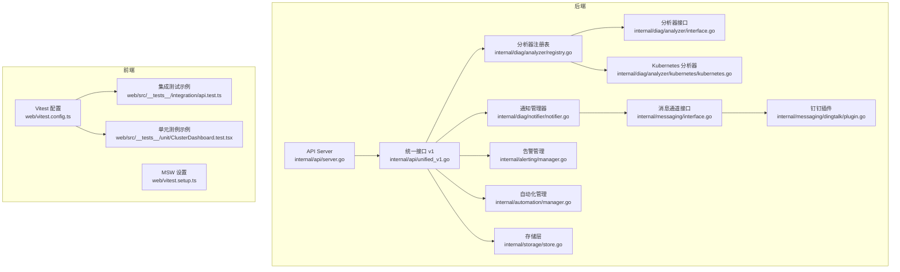
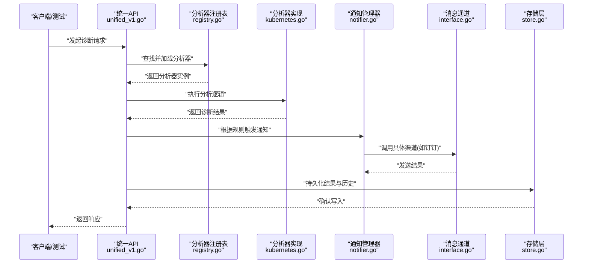
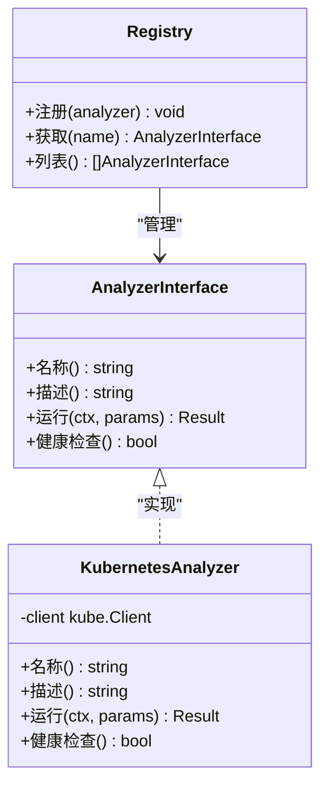
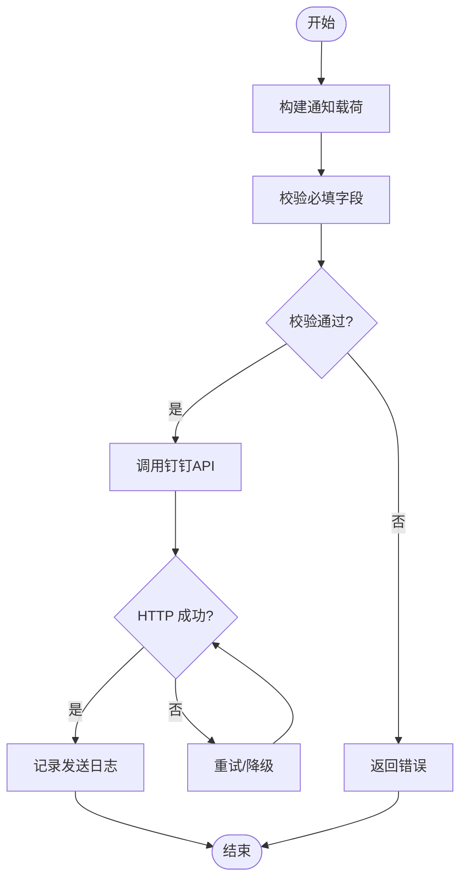
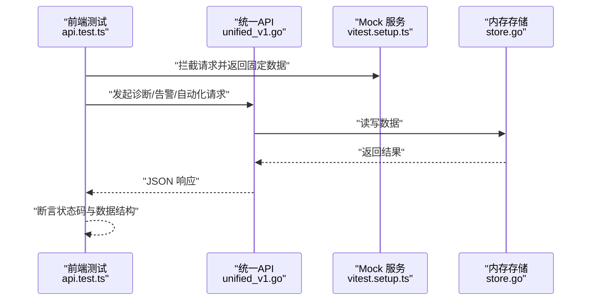
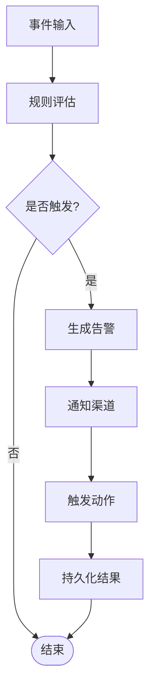
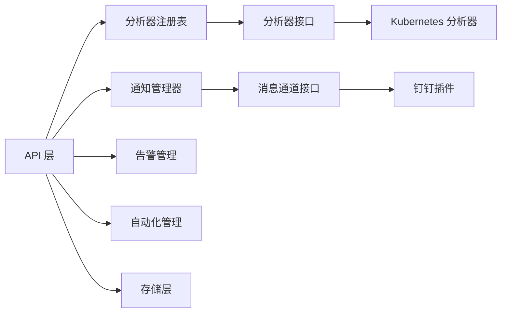

# 插件测试与调试

<cite>
**本文档引用的文件**   
- [internal/diag/analyzer/interface.go](file://internal/diag/analyzer/interface.go)
- [internal/diag/analyzer/registry.go](file://internal/diag/analyzer/registry.go)
- [internal/diag/analyzer/kubernetes/kubernetes.go](file://internal/diag/analyzer/kubernetes/kubernetes.go)
- [internal/diag/analyzer/kubernetes/kubernetes_test.go](file://internal/diag/analyzer/kubernetes/kubernetes_test.go)
- [internal/diag/notifier/notifier.go](file://internal/diag/notifier/notifier.go)
- [internal/diag/notifier/notifier_test.go](file://internal/diag/notifier/notifier_test.go)
- [internal/messaging/interface.go](file://internal/messaging/interface.go)
- [internal/messaging/dingtalk/plugin.go](file://internal/messaging/dingtalk/plugin.go)
- [internal/api/server.go](file://internal/api/server.go)
- [internal/api/unified_v1.go](file://internal/api/unified_v1.go)
- [internal/api/unified_v1_test.go](file://internal/api/unified_v1_test.go)
- [internal/config/config.go](file://internal/config/config.go)
- [internal/alerting/manager.go](file://internal/alerting/manager.go)
- [internal/alerting/manager_test.go](file://internal/alerting/manager_test.go)
- [internal/automation/manager.go](file://internal/automation/manager.go)
- [internal/automation/manager_test.go](file://internal/automation/manager_test.go)
- [internal/storage/store.go](file://internal/storage/store.go)
- [internal/storage/store_test.go](file://internal/storage/store_test.go)
- [.github/workflows/ci.yml](file://.github/workflows/ci.yml)
- [web/vitest.config.ts](file://web/vitest.config.ts)
- [web/vitest.setup.ts](file://web/vitest.setup.ts)
- [web/src/__tests__/integration/api.test.ts](file://web/src/__tests__/integration/api.test.ts)
- [web/src/__tests__/unit/ClusterDashboard.test.tsx](file://web/src/__tests__/unit/ClusterDashboard.test.tsx)
</cite>

## 目录
1. [简介](#简介)
2. [项目结构](#项目结构)
3. [核心组件](#核心组件)
4. [架构总览](#架构总览)
5. [详细组件分析](#详细组件分析)
6. [依赖关系分析](#依赖关系分析)
7. [性能考量](#性能考量)
8. [故障排查指南](#故障排查指南)
9. [结论](#结论)
10. [附录](#附录)

## 简介
本指南面向插件化诊断、通知与自动化扩展的测试与调试，覆盖单元测试、集成测试与端到端测试的编写方法，包括模拟对象的使用、测试环境搭建、覆盖率要求、持续集成配置与常见问题的排查策略。文档以仓库中的分析器、通知渠道与 API 扩展为例，提供可操作的实践路径与可视化图示，帮助读者快速建立稳定可靠的测试体系。

## 项目结构
本项目采用 Go 后端与 Web 前端并行的结构：
- 后端（Go）：按功能域划分 internal 子包，包含分析器、规则引擎、采集器、报告器、通知、存储、API 等；测试文件与源码同目录或 test 子目录。
- 前端（Web）：使用 Vitest 进行单元与集成测试，mock 服务通过 MSW 提供。
- CI：GitHub Actions 定义流水线任务，统一执行构建与测试。

**图表来源** 
- [internal/api/server.go](file://internal/api/server.go)
- [internal/api/unified_v1.go](file://internal/api/unified_v1.go)
- [internal/diag/analyzer/interface.go](file://internal/diag/analyzer/interface.go)
- [internal/diag/analyzer/registry.go](file://internal/diag/analyzer/registry.go)
- [internal/diag/analyzer/kubernetes/kubernetes.go](file://internal/diag/analyzer/kubernetes/kubernetes.go)
- [internal/diag/notifier/notifier.go](file://internal/diag/notifier/notifier.go)
- [internal/messaging/interface.go](file://internal/messaging/interface.go)
- [internal/messaging/dingtalk/plugin.go](file://internal/messaging/dingtalk/plugin.go)
- [internal/alerting/manager.go](file://internal/alerting/manager.go)
- [internal/automation/manager.go](file://internal/automation/manager.go)
- [internal/storage/store.go](file://internal/storage/store.go)
- [web/vitest.config.ts](file://web/vitest.config.ts)
- [web/vitest.setup.ts](file://web/vitest.setup.ts)
- [web/src/__tests__/integration/api.test.ts](file://web/src/__tests__/integration/api.test.ts)
- [web/src/__tests__/unit/ClusterDashboard.test.tsx](file://web/src/__tests__/unit/ClusterDashboard.test.tsx)

**章节来源**
- [internal/api/server.go](file://internal/api/server.go)
- [internal/api/unified_v1.go](file://internal/api/unified_v1.go)
- [internal/diag/analyzer/interface.go](file://internal/diag/analyzer/interface.go)
- [internal/diag/analyzer/registry.go](file://internal/diag/analyzer/registry.go)
- [internal/diag/analyzer/kubernetes/kubernetes.go](file://internal/diag/analyzer/kubernetes/kubernetes.go)
- [internal/diag/notifier/notifier.go](file://internal/diag/notifier/notifier.go)
- [internal/messaging/interface.go](file://internal/messaging/interface.go)
- [internal/messaging/dingtalk/plugin.go](file://internal/messaging/dingtalk/plugin.go)
- [internal/alerting/manager.go](file://internal/alerting/manager.go)
- [internal/automation/manager.go](file://internal/automation/manager.go)
- [internal/storage/store.go](file://internal/storage/store.go)
- [web/vitest.config.ts](file://web/vitest.config.ts)
- [web/vitest.setup.ts](file://web/vitest.setup.ts)
- [web/src/__tests__/integration/api.test.ts](file://web/src/__tests__/integration/api.test.ts)
- [web/src/__tests__/unit/ClusterDashboard.test.tsx](file://web/src/__tests__/unit/ClusterDashboard.test.tsx)

## 核心组件
- 分析器接口与注册表：定义统一的分析器契约与动态注册机制，便于扩展自定义分析器。
- Kubernetes 分析器：实现针对集群资源的诊断逻辑，作为典型的可插拔分析器示例。
- 通知管理器与消息通道：抽象通知发送能力，支持多种渠道（如钉钉）。
- API 层：暴露统一接口，协调分析、告警、自动化与存储等子系统。
- 告警与自动化：基于规则与事件驱动，触发后续动作。
- 存储层：持久化诊断结果、配置与历史数据。

**章节来源**
- [internal/diag/analyzer/interface.go](file://internal/diag/analyzer/interface.go)
- [internal/diag/analyzer/registry.go](file://internal/diag/analyzer/registry.go)
- [internal/diag/analyzer/kubernetes/kubernetes.go](file://internal/diag/analyzer/kubernetes/kubernetes.go)
- [internal/diag/notifier/notifier.go](file://internal/diag/notifier/notifier.go)
- [internal/messaging/interface.go](file://internal/messaging/interface.go)
- [internal/messaging/dingtalk/plugin.go](file://internal/messaging/dingtalk/plugin.go)
- [internal/api/unified_v1.go](file://internal/api/unified_v1.go)
- [internal/alerting/manager.go](file://internal/alerting/manager.go)
- [internal/automation/manager.go](file://internal/automation/manager.go)
- [internal/storage/store.go](file://internal/storage/store.go)

## 架构总览
下图展示从 API 请求到分析器执行、通知发送与存储落盘的完整流程，以及前端集成测试对 API 的验证路径。

**图表来源** 
- [internal/api/unified_v1.go](file://internal/api/unified_v1.go)
- [internal/diag/analyzer/registry.go](file://internal/diag/analyzer/registry.go)
- [internal/diag/analyzer/kubernetes/kubernetes.go](file://internal/diag/analyzer/kubernetes/kubernetes.go)
- [internal/diag/notifier/notifier.go](file://internal/diag/notifier/notifier.go)
- [internal/messaging/interface.go](file://internal/messaging/interface.go)
- [internal/storage/store.go](file://internal/storage/store.go)

## 详细组件分析

### 分析器插件：接口、注册与实现
- 接口设计：定义分析器的标准方法与上下文参数，确保不同分析器具备一致的行为。
- 注册表：集中管理分析器生命周期，支持按需加载与版本兼容。
- 实现示例：Kubernetes 分析器演示如何读取集群资源、执行检查并输出结构化结果。

**图表来源** 
- [internal/diag/analyzer/interface.go](file://internal/diag/analyzer/interface.go)
- [internal/diag/analyzer/registry.go](file://internal/diag/analyzer/registry.go)
- [internal/diag/analyzer/kubernetes/kubernetes.go](file://internal/diag/analyzer/kubernetes/kubernetes.go)

**章节来源**
- [internal/diag/analyzer/interface.go](file://internal/diag/analyzer/interface.go)
- [internal/diag/analyzer/registry.go](file://internal/diag/analyzer/registry.go)
- [internal/diag/analyzer/kubernetes/kubernetes.go](file://internal/diag/analyzer/kubernetes/kubernetes.go)
- [internal/diag/analyzer/kubernetes/kubernetes_test.go](file://internal/diag/analyzer/kubernetes/kubernetes_test.go)

### 通知渠道插件：抽象与钉钉实现
- 抽象层：定义通知发送的统一接口，屏蔽不同渠道差异。
- 钉钉插件：封装 HTTP 调用与签名校验，提供重试与错误处理。
- 测试要点：模拟网络响应、断言消息体、验证失败场景。

**图表来源** 
- [internal/diag/notifier/notifier.go](file://internal/diag/notifier/notifier.go)
- [internal/messaging/interface.go](file://internal/messaging/interface.go)
- [internal/messaging/dingtalk/plugin.go](file://internal/messaging/dingtalk/plugin.go)

**章节来源**
- [internal/diag/notifier/notifier.go](file://internal/diag/notifier/notifier.go)
- [internal/diag/notifier/notifier_test.go](file://internal/diag/notifier/notifier_test.go)
- [internal/messaging/interface.go](file://internal/messaging/interface.go)
- [internal/messaging/dingtalk/plugin.go](file://internal/messaging/dingtalk/plugin.go)

### API 扩展：统一接口与测试
- 统一接口：聚合分析、告警、自动化与存储操作，对外暴露 RESTful 端点。
- 测试策略：使用内存存储与 mock 外部依赖，保证隔离性与稳定性。
- 端到端验证：前端集成测试通过 MSW 拦截请求，验证页面交互与数据流。

**图表来源** 
- [internal/api/unified_v1.go](file://internal/api/unified_v1.go)
- [internal/api/unified_v1_test.go](file://internal/api/unified_v1_test.go)
- [web/src/__tests__/integration/api.test.ts](file://web/src/__tests__/integration/api.test.ts)
- [web/vitest.setup.ts](file://web/vitest.setup.ts)
- [internal/storage/store.go](file://internal/storage/store.go)

**章节来源**
- [internal/api/unified_v1.go](file://internal/api/unified_v1.go)
- [internal/api/unified_v1_test.go](file://internal/api/unified_v1_test.go)
- [web/src/__tests__/integration/api.test.ts](file://web/src/__tests__/integration/api.test.ts)
- [web/vitest.setup.ts](file://web/vitest.setup.ts)
- [internal/storage/store.go](file://internal/storage/store.go)

### 告警与自动化：规则驱动的执行链
- 告警管理：基于事件与阈值触发告警，支持多渠道通知。
- 自动化管理：将告警与修复动作编排为工作流，确保一致性。
- 测试要点：模拟事件源、断言动作执行顺序与副作用。

**图表来源** 
- [internal/alerting/manager.go](file://internal/alerting/manager.go)
- [internal/automation/manager.go](file://internal/automation/manager.go)
- [internal/diag/notifier/notifier.go](file://internal/diag/notifier/notifier.go)

**章节来源**
- [internal/alerting/manager.go](file://internal/alerting/manager.go)
- [internal/alerting/manager_test.go](file://internal/alerting/manager_test.go)
- [internal/automation/manager.go](file://internal/automation/manager.go)
- [internal/automation/manager_test.go](file://internal/automation/manager_test.go)

### 存储层：持久化与测试隔离
- 存储抽象：定义统一的数据存取接口，支持多后端实现。
- 测试隔离：使用内存存储或临时目录，避免污染真实数据。
- 性能考量：批量写入、事务与索引优化。

**章节来源**
- [internal/storage/store.go](file://internal/storage/store.go)
- [internal/storage/store_test.go](file://internal/storage/store_test.go)

## 依赖关系分析
- 低耦合：分析器、通知、告警、自动化均通过接口解耦，便于替换与扩展。
- 集中注册：分析器通过注册表统一管理，降低 API 层的复杂度。
- 外部依赖：Kubernetes 客户端、HTTP 客户端与存储后端需通过 mock 或测试容器隔离。

**图表来源** 
- [internal/api/unified_v1.go](file://internal/api/unified_v1.go)
- [internal/diag/analyzer/registry.go](file://internal/diag/analyzer/registry.go)
- [internal/diag/analyzer/interface.go](file://internal/diag/analyzer/interface.go)
- [internal/diag/analyzer/kubernetes/kubernetes.go](file://internal/diag/analyzer/kubernetes/kubernetes.go)
- [internal/diag/notifier/notifier.go](file://internal/diag/notifier/notifier.go)
- [internal/messaging/interface.go](file://internal/messaging/interface.go)
- [internal/messaging/dingtalk/plugin.go](file://internal/messaging/dingtalk/plugin.go)
- [internal/alerting/manager.go](file://internal/alerting/manager.go)
- [internal/automation/manager.go](file://internal/automation/manager.go)
- [internal/storage/store.go](file://internal/storage/store.go)

**章节来源**
- [internal/api/unified_v1.go](file://internal/api/unified_v1.go)
- [internal/diag/analyzer/registry.go](file://internal/diag/analyzer/registry.go)
- [internal/diag/analyzer/interface.go](file://internal/diag/analyzer/interface.go)
- [internal/diag/analyzer/kubernetes/kubernetes.go](file://internal/diag/analyzer/kubernetes/kubernetes.go)
- [internal/diag/notifier/notifier.go](file://internal/diag/notifier/notifier.go)
- [internal/messaging/interface.go](file://internal/messaging/interface.go)
- [internal/messaging/dingtalk/plugin.go](file://internal/messaging/dingtalk/plugin.go)
- [internal/alerting/manager.go](file://internal/alerting/manager.go)
- [internal/automation/manager.go](file://internal/automation/manager.go)
- [internal/storage/store.go](file://internal/storage/store.go)

## 性能考量
- 分析器并行执行：对无依赖的分析器进行并发执行，缩短整体耗时。
- 缓存热点数据：对频繁查询的集群资源进行短期缓存，减少重复 IO。
- 限流与退避：对外部 API 调用实施速率限制与指数退避，避免雪崩。
- 存储批处理：合并小写操作，提升吞吐。
- 前端渲染优化：分页与虚拟列表，减少 DOM 压力。

[本节为通用指导，不直接分析具体文件]

## 故障排查指南
- 单元测试失败：优先检查 mock 数据与边界条件，确保断言精确。
- 集成测试不稳定：确认外部依赖（数据库、K8s、HTTP）已正确 mock 或启动测试容器。
- 通知发送失败：检查签名、超时与重试策略，查看日志链路。
- API 响应异常：核对请求体结构与鉴权头，定位中间件与处理器。
- 性能瓶颈：使用 pprof 与火焰图定位热点函数，结合指标监控。

**章节来源**
- [internal/diag/notifier/notifier_test.go](file://internal/diag/notifier/notifier_test.go)
- [internal/api/unified_v1_test.go](file://internal/api/unified_v1_test.go)
- [internal/alerting/manager_test.go](file://internal/alerting/manager_test.go)
- [internal/automation/manager_test.go](file://internal/automation/manager_test.go)
- [internal/storage/store_test.go](file://internal/storage/store_test.go)

## 结论
通过接口抽象与注册机制，项目实现了高度可扩展的分析器与通知渠道。配合完善的单测、集成测与端到端测，以及 CI 流水线，能够保障插件质量与系统稳定性。建议持续完善覆盖率与性能基准，强化错误恢复与可观测性，进一步提升交付效率与可靠性。

[本节为总结，不直接分析具体文件]

## 附录

### 测试类型与示例
- 单元测试：针对分析器、通知、告警与自动化的最小单元进行测试，使用内存与 mock 隔离外部依赖。
- 集成测试：串联 API、存储与插件，验证端到端数据流与副作用。
- 端到端测试：前端通过 MSW 拦截请求，模拟用户操作与页面交互。

**章节来源**
- [internal/diag/analyzer/kubernetes/kubernetes_test.go](file://internal/diag/analyzer/kubernetes/kubernetes_test.go)
- [internal/diag/notifier/notifier_test.go](file://internal/diag/notifier/notifier_test.go)
- [internal/alerting/manager_test.go](file://internal/alerting/manager_test.go)
- [internal/automation/manager_test.go](file://internal/automation/manager_test.go)
- [internal/storage/store_test.go](file://internal/storage/store_test.go)
- [web/src/__tests__/integration/api.test.ts](file://web/src/__tests__/integration/api.test.ts)
- [web/src/__tests__/unit/ClusterDashboard.test.tsx](file://web/src/__tests__/unit/ClusterDashboard.test.tsx)

### 测试环境搭建
- Go 测试：使用 go test，必要时引入测试容器或内存存储。
- 前端测试：Vitest 配置与 MSW 设置，确保请求拦截与数据回放。
- 环境变量：通过配置文件注入测试密钥与端点地址。

**章节来源**
- [web/vitest.config.ts](file://web/vitest.config.ts)
- [web/vitest.setup.ts](file://web/vitest.setup.ts)
- [internal/config/config.go](file://internal/config/config.go)

### 覆盖率要求与持续集成
- 覆盖率目标：核心模块单测覆盖率不低于 80%，关键路径不低于 90%。
- CI 配置：在 GitHub Actions 中执行构建、测试与覆盖率上报，失败即阻断合并。

**章节来源**
- [.github/workflows/ci.yml](file://.github/workflows/ci.yml)

### 调试技巧与日志记录
- 结构化日志：统一日志格式，包含请求 ID、时间戳与上下文。
- 追踪链路：为每个请求分配唯一标识，贯穿 API、分析器与通知。
- 性能剖析：启用 pprof 与指标收集，定期生成性能报告。

**章节来源**
- [internal/api/server.go](file://internal/api/server.go)
- [internal/diag/notifier/notifier.go](file://internal/diag/notifier/notifier.go)