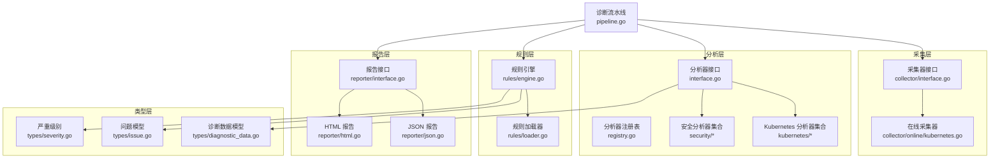
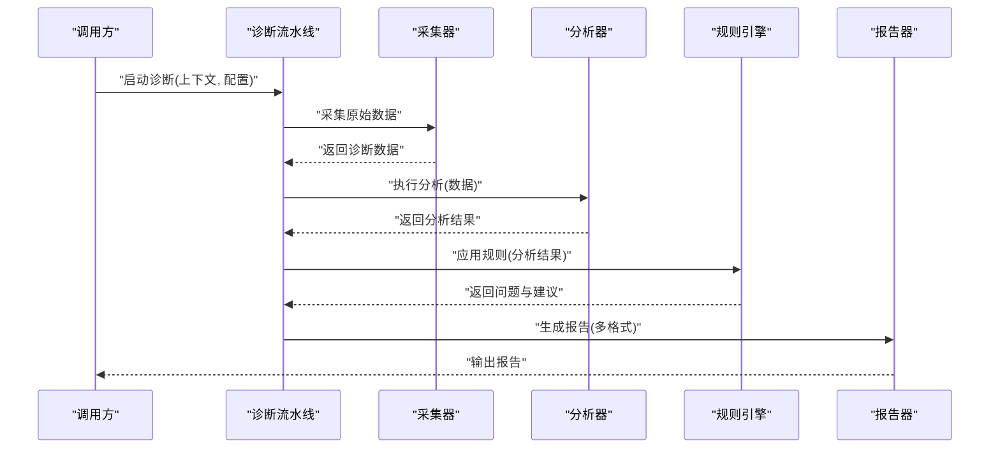
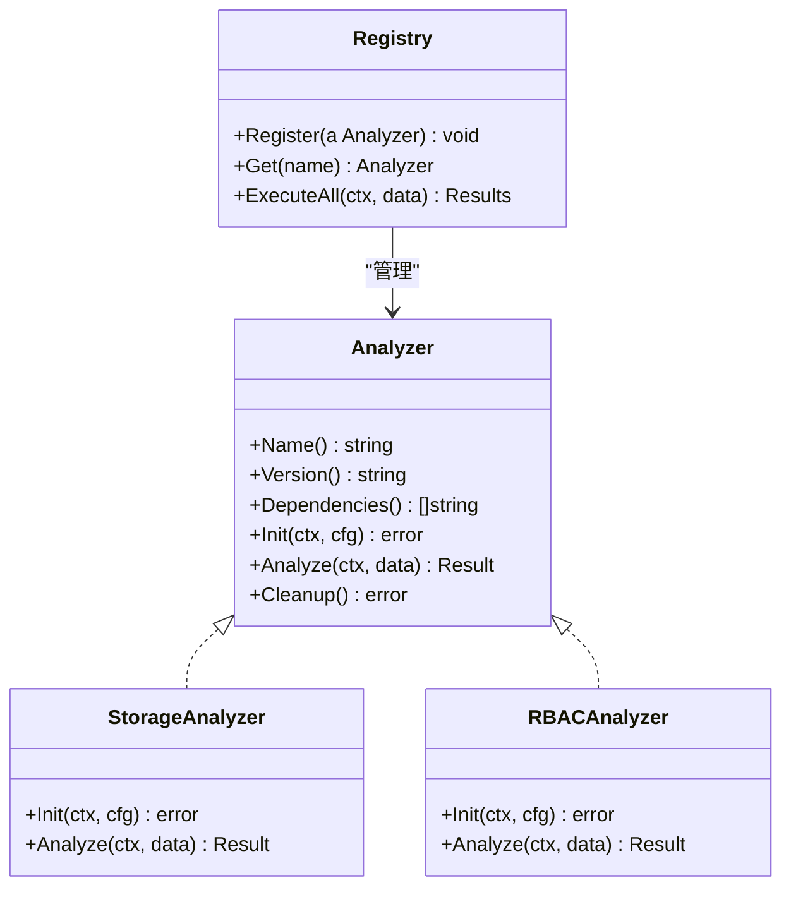
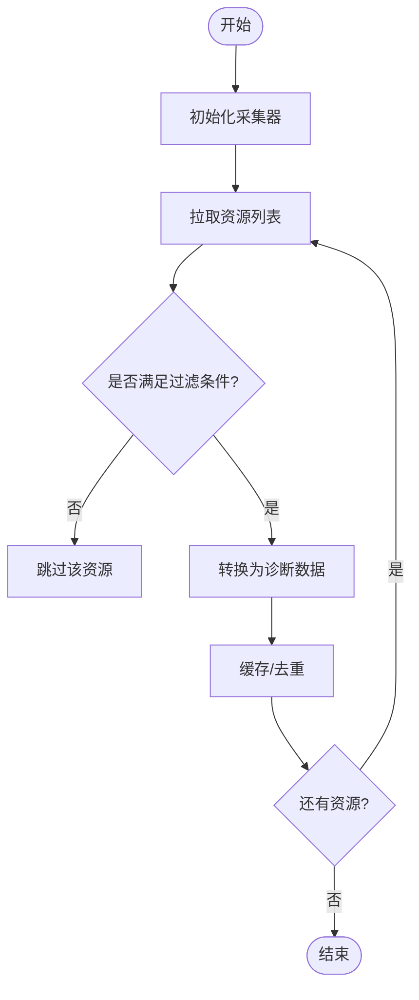
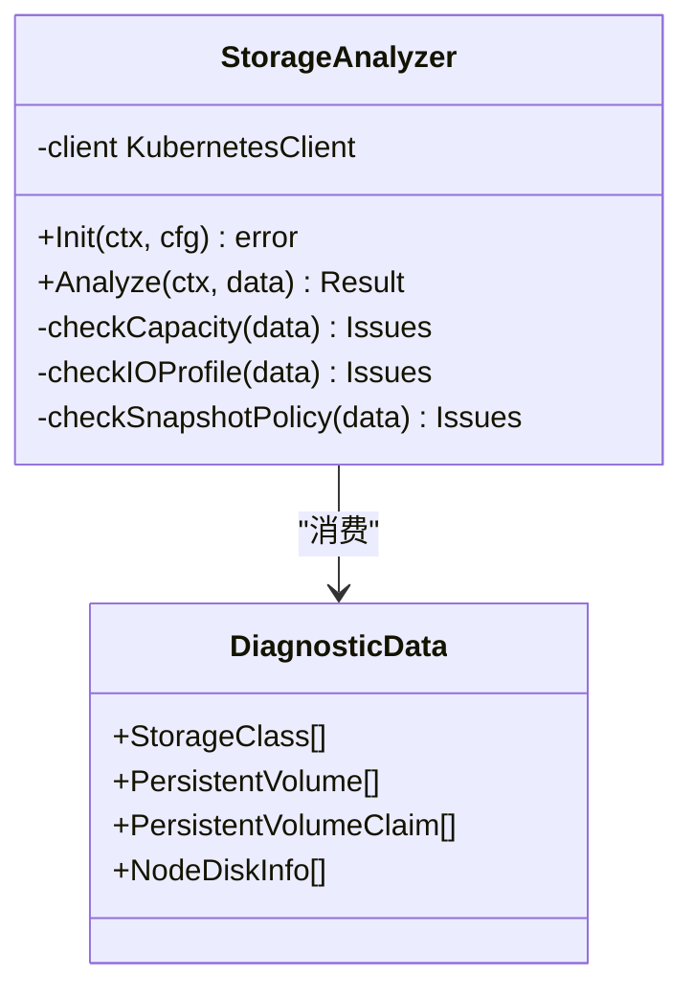
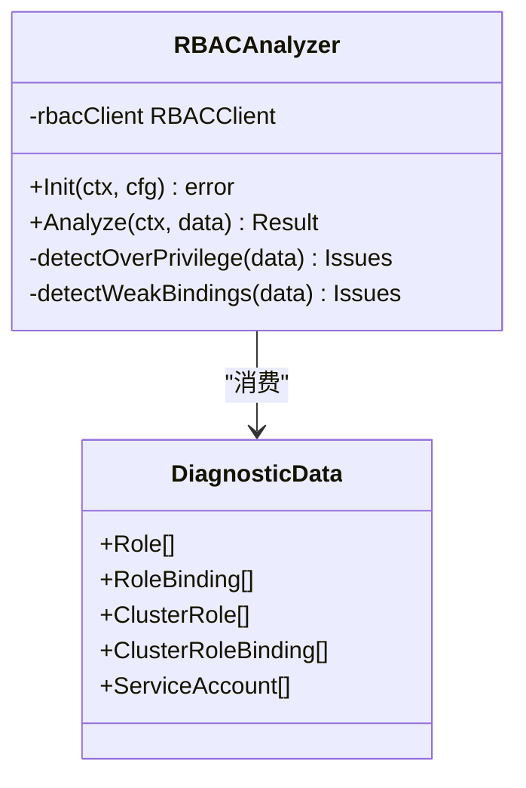
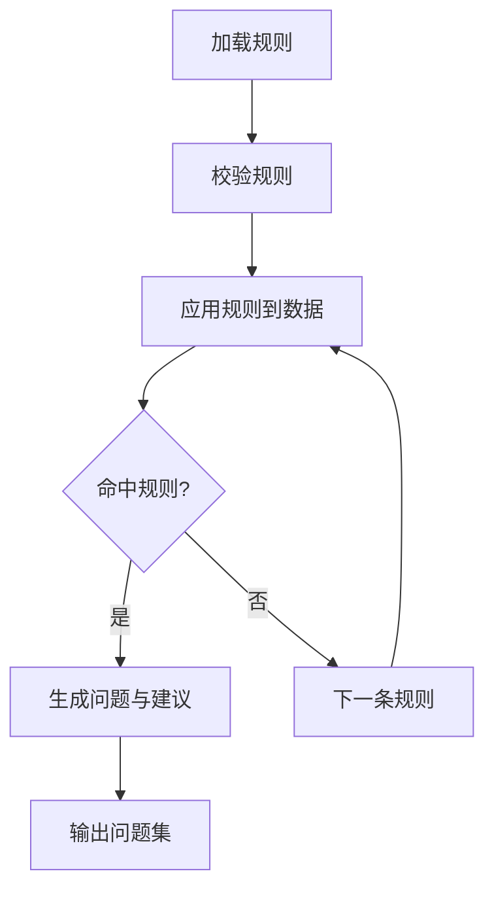
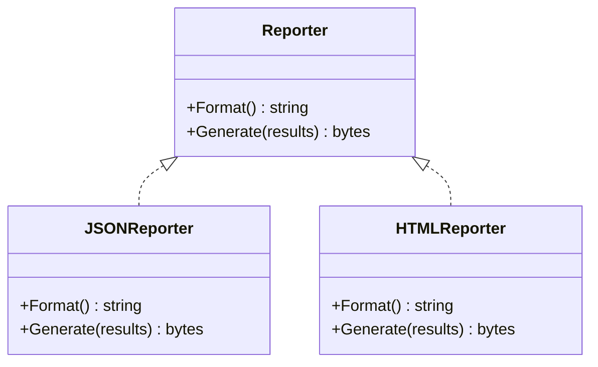
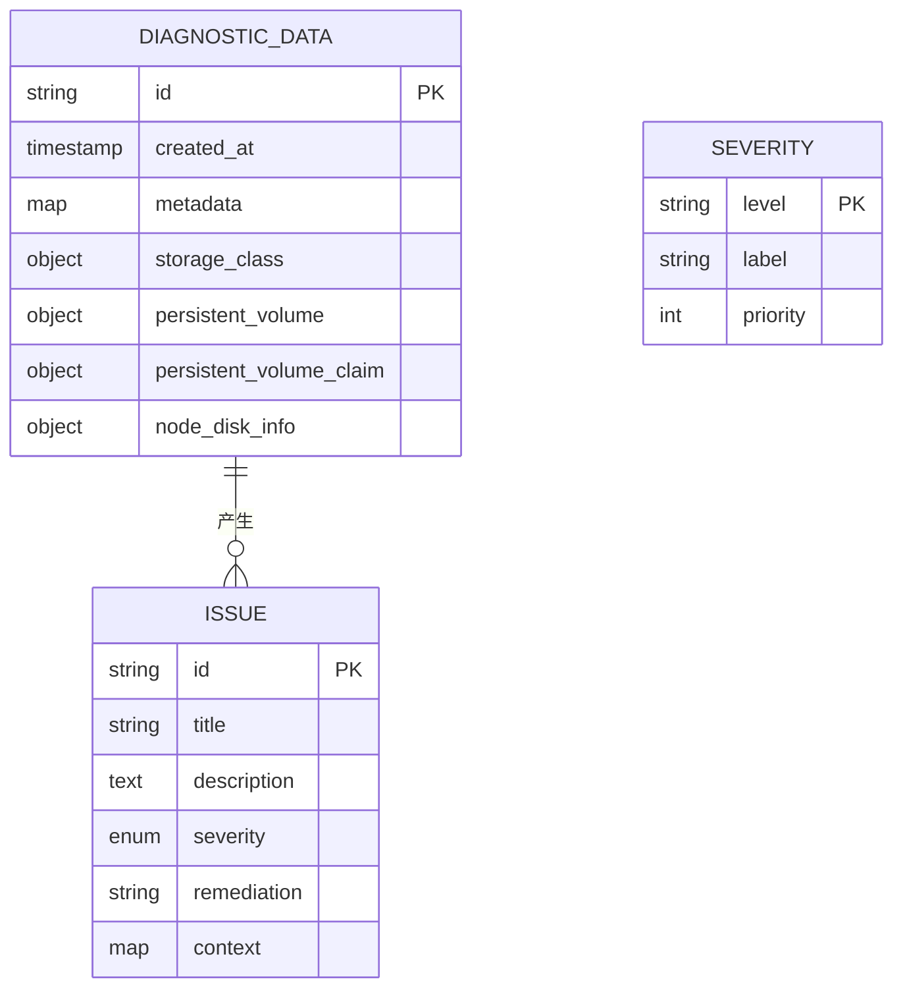
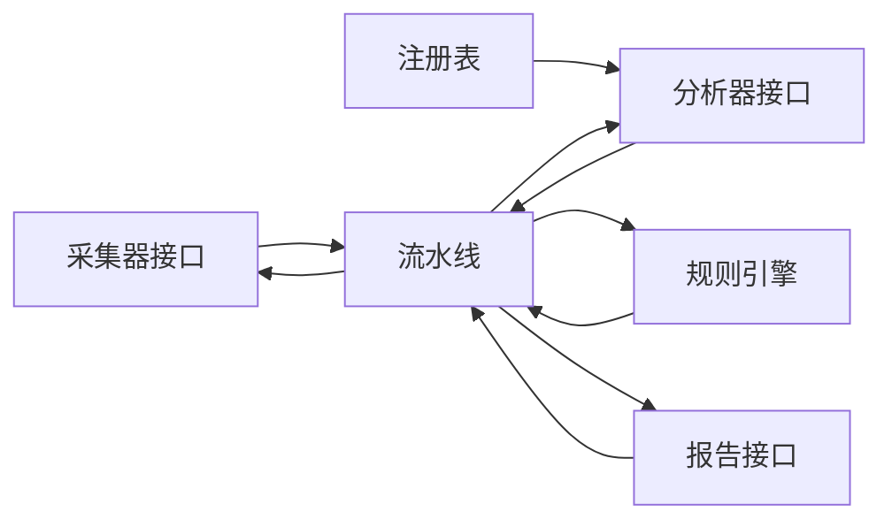

# 自定义分析器开发

<cite>
**本文档引用的文件**   
- [internal/diag/analyzer/interface.go](file://internal/diag/analyzer/interface.go)
- [internal/diag/analyzer/registry.go](file://internal/diag/analyzer/registry.go)
- [internal/diag/analyzer/kubernetes/storage.go](file://internal/diag/analyzer/kubernetes/storage.go)
- [internal/diag/analyzer/security/rbac.go](file://internal/diag/analyzer/security/rbac.go)
- [internal/diag/analyzer/types.go](file://internal/diag/analyzer/types.go)
- [internal/diag/pipeline.go](file://internal/diag/pipeline.go)
- [internal/diag/rules/engine.go](file://internal/diag/rules/engine.go)
- [internal/diag/rules/loader.go](file://internal/diag/rules/loader.go)
- [internal/diag/reporter/interface.go](file://internal/diag/reporter/interface.go)
- [internal/diag/reporter/json.go](file://internal/diag/reporter/json.go)
- [internal/diag/reporter/html.go](file://internal/diag/reporter/html.go)
- [internal/diag/types/diagnostic_data.go](file://internal/diag/types/diagnostic_data.go)
- [internal/diag/types/issue.go](file://internal/diag/types/issue.go)
- [internal/diag/types/severity.go](file://internal/diag/types/severity.go)
- [internal/diag/collector/interface.go](file://internal/diag/collector/interface.go)
- [internal/diag/collector/online/kubernetes.go](file://internal/diag/collector/online/kubernetes.go)
</cite>

## 目录
1. [简介](#简介)
2. [项目结构](#项目结构)
3. [核心组件](#核心组件)
4. [架构总览](#架构总览)
5. [详细组件分析](#详细组件分析)
6. [依赖关系分析](#依赖关系分析)
7. [性能考虑](#性能考虑)
8. [故障排查指南](#故障排查指南)
9. [结论](#结论)
10. [附录](#附录)

## 简介
本指南面向希望在 Klaw 中开发“自定义分析器”的工程师，覆盖从接口实现、数据采集、规则匹配、结果分析到报告生成的完整流程。文档以 Kubernetes 存储分析器与安全分析器为示例，提供数据模型定义、分析规则配置、性能优化与测试方法，并说明分析器的注册流程、依赖管理与错误处理策略。读者无需深入源码即可上手扩展新的分析能力。

## 项目结构
Klaw 的诊断与分析子系统位于 internal/diag 下，采用分层与按领域划分相结合的组织方式：
- analyzer：分析器抽象与具体实现（如 kubernetes、security）
- collector：数据采集器（在线/离线）
- rules：规则引擎与加载器
- reporter：报告生成器（JSON/HTML/SARIF 等）
- types：统一的数据模型（诊断数据、问题、严重级别等）
- pipeline：编排采集、分析、报告的主流程

图表来源
- [internal/diag/analyzer/interface.go](file://internal/diag/analyzer/interface.go)
- [internal/diag/analyzer/registry.go](file://internal/diag/analyzer/registry.go)
- [internal/diag/analyzer/kubernetes/storage.go](file://internal/diag/analyzer/kubernetes/storage.go)
- [internal/diag/analyzer/security/rbac.go](file://internal/diag/analyzer/security/rbac.go)
- [internal/diag/collector/interface.go](file://internal/diag/collector/interface.go)
- [internal/diag/collector/online/kubernetes.go](file://internal/diag/collector/online/kubernetes.go)
- [internal/diag/rules/engine.go](file://internal/diag/rules/engine.go)
- [internal/diag/rules/loader.go](file://internal/diag/rules/loader.go)
- [internal/diag/reporter/interface.go](file://internal/diag/reporter/interface.go)
- [internal/diag/reporter/json.go](file://internal/diag/reporter/json.go)
- [internal/diag/reporter/html.go](file://internal/diag/reporter/html.go)
- [internal/diag/types/diagnostic_data.go](file://internal/diag/types/diagnostic_data.go)
- [internal/diag/types/issue.go](file://internal/diag/types/issue.go)
- [internal/diag/types/severity.go](file://internal/diag/types/severity.go)
- [internal/diag/pipeline.go](file://internal/diag/pipeline.go)

章节来源
- [internal/diag/pipeline.go](file://internal/diag/pipeline.go)

## 核心组件
- 分析器接口：定义分析生命周期（初始化、执行、清理）、输入输出契约与错误语义
- 分析器注册表：集中管理分析器实例，支持按名称或类别启用/禁用
- 采集器接口与实现：封装对目标环境（如 Kubernetes API）的数据获取
- 规则引擎与加载器：解析规则配置、匹配诊断数据、产出问题与建议
- 报告接口与实现：将分析结果序列化为多种格式
- 数据模型：统一的诊断数据、问题与严重级别定义，确保跨模块一致性

章节来源
- [internal/diag/analyzer/interface.go](file://internal/diag/analyzer/interface.go)
- [internal/diag/analyzer/registry.go](file://internal/diag/analyzer/registry.go)
- [internal/diag/collector/interface.go](file://internal/diag/collector/interface.go)
- [internal/diag/rules/engine.go](file://internal/diag/rules/engine.go)
- [internal/diag/rules/loader.go](file://internal/diag/rules/loader.go)
- [internal/diag/reporter/interface.go](file://internal/diag/reporter/interface.go)
- [internal/diag/types/diagnostic_data.go](file://internal/diag/types/diagnostic_data.go)
- [internal/diag/types/issue.go](file://internal/diag/types/issue.go)
- [internal/diag/types/severity.go](file://internal/diag/types/severity.go)

## 架构总览
下图展示一次完整的诊断执行流程：流水线协调采集、分析、规则匹配与报告生成，各组件通过接口解耦，便于替换与扩展。

图表来源
- [internal/diag/pipeline.go](file://internal/diag/pipeline.go)
- [internal/diag/collector/interface.go](file://internal/diag/collector/interface.go)
- [internal/diag/analyzer/interface.go](file://internal/diag/analyzer/interface.go)
- [internal/diag/rules/engine.go](file://internal/diag/rules/engine.go)
- [internal/diag/reporter/interface.go](file://internal/diag/reporter/interface.go)

## 详细组件分析

### 分析器接口与注册机制
- 分析器接口定义了统一的初始化、执行与清理方法，以及元数据描述（名称、版本、依赖）。
- 注册表负责维护分析器实例，支持按名称查找、批量执行与依赖排序。
- 典型用法：在包初始化时完成注册，或在配置驱动下按需加载。

图表来源
- [internal/diag/analyzer/interface.go](file://internal/diag/analyzer/interface.go)
- [internal/diag/analyzer/registry.go](file://internal/diag/analyzer/registry.go)
- [internal/diag/analyzer/kubernetes/storage.go](file://internal/diag/analyzer/kubernetes/storage.go)
- [internal/diag/analyzer/security/rbac.go](file://internal/diag/analyzer/security/rbac.go)

章节来源
- [internal/diag/analyzer/interface.go](file://internal/diag/analyzer/interface.go)
- [internal/diag/analyzer/registry.go](file://internal/diag/analyzer/registry.go)

### 数据采集器（在线 Kubernetes）
- 采集器接口抽象了数据来源，屏蔽底层差异。
- 在线采集器通过 Kubernetes API 拉取集群对象（如节点、存储类、卷、工作负载等），并进行基础校验与过滤。
- 建议对大对象进行分页与并发控制，避免超时与内存峰值。

图表来源
- [internal/diag/collector/interface.go](file://internal/diag/collector/interface.go)
- [internal/diag/collector/online/kubernetes.go](file://internal/diag/collector/online/kubernetes.go)

章节来源
- [internal/diag/collector/interface.go](file://internal/diag/collector/interface.go)
- [internal/diag/collector/online/kubernetes.go](file://internal/diag/collector/online/kubernetes.go)

### Kubernetes 存储分析器
- 职责：基于采集到的存储相关数据，识别容量不足、I/O 瓶颈、快照策略缺失等问题。
- 输入：存储类、卷、持久化声明、节点磁盘信息等。
- 输出：结构化问题与建议，附带严重级别与修复指引。

图表来源
- [internal/diag/analyzer/kubernetes/storage.go](file://internal/diag/analyzer/kubernetes/storage.go)
- [internal/diag/types/diagnostic_data.go](file://internal/diag/types/diagnostic_data.go)

章节来源
- [internal/diag/analyzer/kubernetes/storage.go](file://internal/diag/analyzer/kubernetes/storage.go)

### 安全分析器（RBAC）
- 职责：检查角色绑定、权限过宽、服务账户滥用等风险。
- 输入：角色、角色绑定、集群角色、集群角色绑定、服务账户等。
- 输出：安全问题清单与缓解建议。

图表来源
- [internal/diag/analyzer/security/rbac.go](file://internal/diag/analyzer/security/rbac.go)
- [internal/diag/types/diagnostic_data.go](file://internal/diag/types/diagnostic_data.go)

章节来源
- [internal/diag/analyzer/security/rbac.go](file://internal/diag/analyzer/security/rbac.go)

### 规则引擎与加载器
- 规则加载器：从配置或文件中读取规则集，校验语法与依赖。
- 规则引擎：遍历诊断数据，应用规则，生成问题与建议；支持优先级与短路逻辑。

图表来源
- [internal/diag/rules/loader.go](file://internal/diag/rules/loader.go)
- [internal/diag/rules/engine.go](file://internal/diag/rules/engine.go)

章节来源
- [internal/diag/rules/loader.go](file://internal/diag/rules/loader.go)
- [internal/diag/rules/engine.go](file://internal/diag/rules/engine.go)

### 报告生成器
- 报告接口：定义统一的序列化方法，支持 JSON、HTML、SARIF 等。
- 实现：根据配置选择输出格式，填充模板或数据结构。

图表来源
- [internal/diag/reporter/interface.go](file://internal/diag/reporter/interface.go)
- [internal/diag/reporter/json.go](file://internal/diag/reporter/json.go)
- [internal/diag/reporter/html.go](file://internal/diag/reporter/html.go)

章节来源
- [internal/diag/reporter/interface.go](file://internal/diag/reporter/interface.go)
- [internal/diag/reporter/json.go](file://internal/diag/reporter/json.go)
- [internal/diag/reporter/html.go](file://internal/diag/reporter/html.go)

### 数据模型
- 诊断数据：承载采集与分析后的结构化信息，供规则与报告使用。
- 问题与建议：描述发现的问题、严重级别、影响范围与修复步骤。
- 严重级别：标准化严重程度，便于排序与告警阈值判断。

图表来源
- [internal/diag/types/diagnostic_data.go](file://internal/diag/types/diagnostic_data.go)
- [internal/diag/types/issue.go](file://internal/diag/types/issue.go)
- [internal/diag/types/severity.go](file://internal/diag/types/severity.go)

章节来源
- [internal/diag/types/diagnostic_data.go](file://internal/diag/types/diagnostic_data.go)
- [internal/diag/types/issue.go](file://internal/diag/types/issue.go)
- [internal/diag/types/severity.go](file://internal/diag/types/severity.go)

## 依赖关系分析
- 分析器依赖采集器提供的诊断数据，并通过规则引擎进行问题判定。
- 报告器依赖问题与建议的结构化输出。
- 注册表统一管理分析器实例，避免循环依赖。

图表来源
- [internal/diag/pipeline.go](file://internal/diag/pipeline.go)
- [internal/diag/collector/interface.go](file://internal/diag/collector/interface.go)
- [internal/diag/analyzer/interface.go](file://internal/diag/analyzer/interface.go)
- [internal/diag/analyzer/registry.go](file://internal/diag/analyzer/registry.go)
- [internal/diag/rules/engine.go](file://internal/diag/rules/engine.go)
- [internal/diag/reporter/interface.go](file://internal/diag/reporter/interface.go)

章节来源
- [internal/diag/pipeline.go](file://internal/diag/pipeline.go)

## 性能考虑
- 采集阶段
  - 使用分页与并发限制，避免 API 限流与内存暴涨
  - 对大对象进行裁剪与延迟加载
- 分析阶段
  - 将可复用的计算结果缓存，减少重复计算
  - 对规则进行短路评估，优先命中高价值规则
- 报告阶段
  - 按需生成格式，避免不必要的序列化开销
  - 对大规模结果进行分块输出

[本节为通用指导，不直接分析具体文件]

## 故障排查指南
- 常见问题
  - 采集失败：检查网络连通性、API 权限与配额限制
  - 规则未命中：确认规则语法与数据字段映射
  - 报告为空：检查问题集是否为空或过滤条件过严
- 调试建议
  - 开启详细日志，定位异常堆栈
  - 使用最小数据集复现问题
  - 逐步关闭分析器隔离问题域

章节来源
- [internal/diag/pipeline.go](file://internal/diag/pipeline.go)
- [internal/diag/rules/engine.go](file://internal/diag/rules/engine.go)

## 结论
通过统一的接口与清晰的层次划分，Klaw 的分析器体系易于扩展与维护。按照本文档的步骤，你可以快速实现 Kubernetes 存储分析器与安全分析器等自定义分析器，并在流水线中无缝集成。建议在开发过程中重视数据模型规范、规则配置的可读性与性能优化，同时完善测试与错误处理策略。

[本节为总结，不直接分析具体文件]

## 附录
- 开发步骤清单
  - 定义数据模型字段与约束
  - 实现采集器（如需）
  - 实现分析器接口，编写分析逻辑
  - 编写规则配置并接入规则引擎
  - 选择报告格式并验证输出
  - 注册分析器并加入流水线
  - 编写单元测试与集成测试
  - 性能压测与调优
- 最佳实践
  - 保持分析器无状态，依赖外部客户端进行 I/O
  - 规则配置与代码分离，便于热更新
  - 严格错误分类与恢复策略
  - 使用上下文传递取消信号与超时控制

[本节为补充内容，不直接分析具体文件]