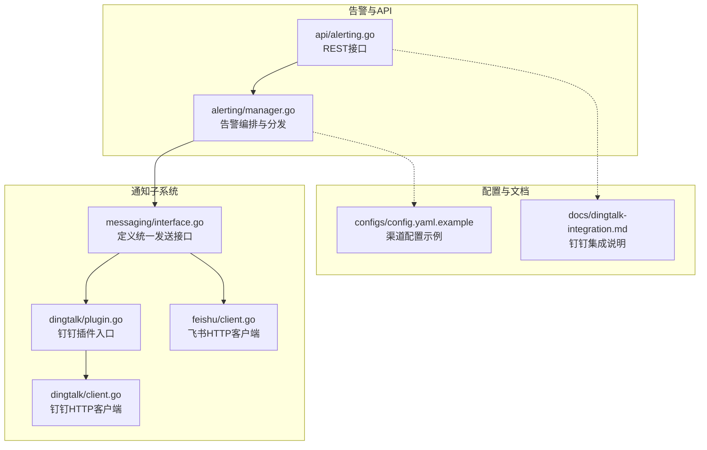
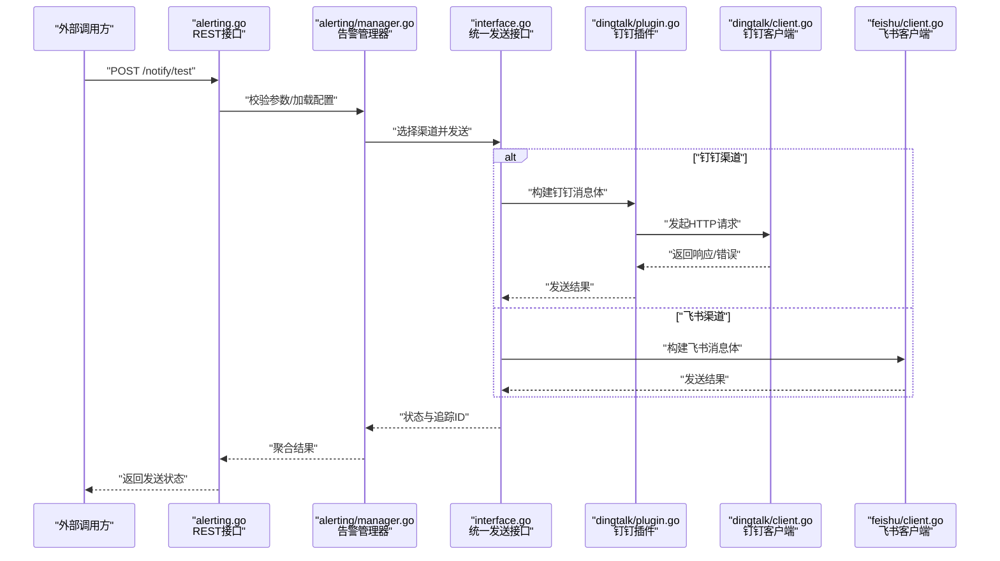
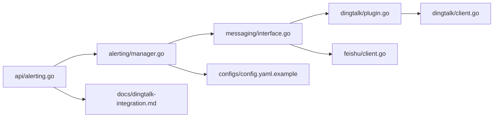

# 通知渠道扩展

<cite>
**本文引用的文件**   
- [internal/messaging/interface.go](file://internal/messaging/interface.go)
- [internal/messaging/dingtalk/plugin.go](file://internal/messaging/dingtalk/plugin.go)
- [internal/messaging/dingtalk/client.go](file://internal/messaging/dingtalk/client.go)
- [internal/messaging/feishu/client.go](file://internal/messaging/feishu/client.go)
- [internal/alerting/manager.go](file://internal/alerting/manager.go)
- [internal/api/alerting.go](file://internal/api/alerting.go)
- [configs/config.yaml.example](file://configs/config.yaml.example)
- [docs/dingtalk-integration.md](file://docs/dingtalk-integration.md)
</cite>

## 目录
1. [简介](#简介)
2. [项目结构](#项目结构)
3. [核心组件](#核心组件)
4. [架构总览](#架构总览)
5. [详细组件分析](#详细组件分析)
6. [依赖关系分析](#依赖关系分析)
7. [性能考虑](#性能考虑)
8. [故障排查指南](#故障排查指南)
9. [结论](#结论)
10. [附录](#附录)

## 简介
本文件面向希望为系统新增或定制“通知渠道”的开发者，围绕消息通知接口的设计与实现进行系统性说明。内容涵盖：
- 统一的消息发送接口与插件化架构
- 钉钉、飞书等第三方平台的集成方式
- 新渠道插件的创建步骤（含模板定制、认证配置、错误重试、状态跟踪）
- 渠道注册流程、配置管理与性能优化策略

通过本指南，读者可快速理解现有通知子系统的设计，并基于统一接口扩展新的通知渠道。

## 项目结构
通知相关代码主要位于 internal/messaging 目录，按渠道划分子模块；告警与 API 层在 internal/alerting 与 internal/api 中；配置示例在 configs；钉钉集成文档在 docs。

图表来源
- [internal/messaging/interface.go](file://internal/messaging/interface.go)
- [internal/messaging/dingtalk/plugin.go](file://internal/messaging/dingtalk/plugin.go)
- [internal/messaging/dingtalk/client.go](file://internal/messaging/dingtalk/client.go)
- [internal/messaging/feishu/client.go](file://internal/messaging/feishu/client.go)
- [internal/alerting/manager.go](file://internal/alerting/manager.go)
- [internal/api/alerting.go](file://internal/api/alerting.go)
- [configs/config.yaml.example](file://configs/config.yaml.example)
- [docs/dingtalk-integration.md](file://docs/dingtalk-integration.md)

章节来源
- [internal/messaging/interface.go](file://internal/messaging/interface.go)
- [internal/messaging/dingtalk/plugin.go](file://internal/messaging/dingtalk/plugin.go)
- [internal/messaging/dingtalk/client.go](file://internal/messaging/dingtalk/client.go)
- [internal/messaging/feishu/client.go](file://internal/messaging/feishu/client.go)
- [internal/alerting/manager.go](file://internal/alerting/manager.go)
- [internal/api/alerting.go](file://internal/api/alerting.go)
- [configs/config.yaml.example](file://configs/config.yaml.example)
- [docs/dingtalk-integration.md](file://docs/dingtalk-integration.md)

## 核心组件
- 统一消息接口
  - 定义统一的发送能力抽象，屏蔽不同渠道差异，便于扩展与替换。
  - 典型职责：构建请求体、签名/鉴权、调用远端API、解析响应、上报状态。
- 钉钉插件
  - 作为钉钉渠道的实现载体，封装钉钉特有的消息格式、Webhook/机器人配置、重试策略等。
- 飞书客户端
  - 提供飞书消息发送能力，处理鉴权、消息体构造与响应处理。
- 告警管理器
  - 负责将告警事件路由到具体通知渠道，协调模板渲染、参数组装与发送结果汇总。
- API 层
  - 暴露管理接口，用于配置渠道、触发测试发送、查询发送状态等。

章节来源
- [internal/messaging/interface.go](file://internal/messaging/interface.go)
- [internal/messaging/dingtalk/plugin.go](file://internal/messaging/dingtalk/plugin.go)
- [internal/messaging/dingtalk/client.go](file://internal/messaging/dingtalk/client.go)
- [internal/messaging/feishu/client.go](file://internal/messaging/feishu/client.go)
- [internal/alerting/manager.go](file://internal/alerting/manager.go)
- [internal/api/alerting.go](file://internal/api/alerting.go)

## 架构总览
下图展示从API到渠道的完整调用链，以及配置与文档的支撑关系。

图表来源
- [internal/api/alerting.go](file://internal/api/alerting.go)
- [internal/alerting/manager.go](file://internal/alerting/manager.go)
- [internal/messaging/interface.go](file://internal/messaging/interface.go)
- [internal/messaging/dingtalk/plugin.go](file://internal/messaging/dingtalk/plugin.go)
- [internal/messaging/dingtalk/client.go](file://internal/messaging/dingtalk/client.go)
- [internal/messaging/feishu/client.go](file://internal/messaging/feishu/client.go)

## 详细组件分析

### 统一消息接口设计
- 目标
  - 以最小抽象定义跨渠道的发送能力，确保新增渠道无需改动上层逻辑。
- 关键职责
  - 消息体构建：根据渠道特性生成请求体（如Markdown、富文本、卡片）。
  - 鉴权与签名：支持Token、AppKey/Secret、OAuth等机制。
  - 发送与重试：封装网络调用、超时控制、指数退避重试。
  - 状态与追踪：返回发送状态码、错误信息、唯一追踪ID。
- 扩展点
  - 新增渠道需实现统一接口，并在插件中完成初始化与注册。

章节来源
- [internal/messaging/interface.go](file://internal/messaging/interface.go)

### 钉钉渠道插件
- 角色
  - 插件负责钉钉专属的消息格式、Webhook/机器人配置、重试策略与错误分类。
- 典型流程
  - 接收统一接口调用 -> 组装钉钉消息体 -> 调用钉钉客户端 -> 解析响应 -> 返回发送状态。
- 重试与错误
  - 对网络抖动、限流等场景采用指数退避重试；区分可重试与不可重试错误。
- 模板定制
  - 支持变量替换、多语言、富文本卡片等。

章节来源
- [internal/messaging/dingtalk/plugin.go](file://internal/messaging/dingtalk/plugin.go)
- [internal/messaging/dingtalk/client.go](file://internal/messaging/dingtalk/client.go)
- [docs/dingtalk-integration.md](file://docs/dingtalk-integration.md)

### 飞书渠道客户端
- 角色
  - 提供飞书消息发送能力，处理鉴权、消息体构造与响应处理。
- 典型流程
  - 接收统一接口调用 -> 组装飞书消息体 -> 调用飞书API -> 解析响应 -> 返回发送状态。
- 重试与错误
  - 针对限流、临时失败进行重试；对非法参数直接失败。

章节来源
- [internal/messaging/feishu/client.go](file://internal/messaging/feishu/client.go)

### 告警管理器与API
- 告警管理器
  - 负责渠道选择、模板渲染、参数组装、并发发送与结果聚合。
  - 维护渠道实例缓存、配置热更新与指标上报。
- API 层
  - 提供渠道配置、测试发送、状态查询等REST接口。
  - 校验输入、权限检查、审计日志记录。

章节来源
- [internal/alerting/manager.go](file://internal/alerting/manager.go)
- [internal/api/alerting.go](file://internal/api/alerting.go)

### 配置管理与注册流程
- 配置项
  - 渠道开关、Webhook/密钥、超时、重试次数、并发度、模板路径等。
- 注册流程
  - 启动时扫描插件 -> 读取配置 -> 初始化客户端 -> 注册到统一接口调度器。
- 动态更新
  - 支持热重载配置，避免重启影响。

章节来源
- [configs/config.yaml.example](file://configs/config.yaml.example)
- [internal/alerting/manager.go](file://internal/alerting/manager.go)

### 消息模板定制
- 模板引擎
  - 支持变量注入、条件分支、多语言切换。
- 渠道适配
  - 同一业务语义在不同渠道渲染为不同格式（如Markdown vs 卡片）。
- 版本管理
  - 模板版本化与灰度发布，保证稳定性。

章节来源
- [internal/alerting/manager.go](file://internal/alerting/manager.go)
- [internal/messaging/dingtalk/plugin.go](file://internal/messaging/dingtalk/plugin.go)

### 认证配置
- 支持的认证方式
  - Token、AppKey/Secret、OAuth2、签名算法等。
- 安全建议
  - 敏感信息加密存储、最小权限原则、定期轮换。

章节来源
- [internal/messaging/dingtalk/client.go](file://internal/messaging/dingtalk/client.go)
- [internal/messaging/feishu/client.go](file://internal/messaging/feishu/client.go)
- [configs/config.yaml.example](file://configs/config.yaml.example)

### 错误重试机制
- 重试策略
  - 指数退避、最大重试次数、抖动随机化。
- 错误分类
  - 网络错误、服务端限流、业务校验失败等。
- 降级与熔断
  - 连续失败触发熔断，快速失败保护下游。

章节来源
- [internal/messaging/dingtalk/client.go](file://internal/messaging/dingtalk/client.go)
- [internal/messaging/feishu/client.go](file://internal/messaging/feishu/client.go)
- [internal/alerting/manager.go](file://internal/alerting/manager.go)

### 发送状态跟踪
- 追踪标识
  - 每次发送生成唯一追踪ID，贯穿全链路。
- 状态模型
  - 待发送、发送中、成功、失败、重试中、已取消。
- 查询与审计
  - 提供查询接口与审计日志，便于问题定位。

章节来源
- [internal/alerting/manager.go](file://internal/alerting/manager.go)
- [internal/api/alerting.go](file://internal/api/alerting.go)

## 依赖关系分析
- 松耦合设计
  - 统一接口隔离上层与渠道实现，降低耦合。
- 插件化扩展
  - 新增渠道只需实现接口并注册，不影响既有逻辑。
- 外部依赖
  - HTTP客户端、模板引擎、配置中心、日志与监控。

图表来源
- [internal/api/alerting.go](file://internal/api/alerting.go)
- [internal/alerting/manager.go](file://internal/alerting/manager.go)
- [internal/messaging/interface.go](file://internal/messaging/interface.go)
- [internal/messaging/dingtalk/plugin.go](file://internal/messaging/dingtalk/plugin.go)
- [internal/messaging/dingtalk/client.go](file://internal/messaging/dingtalk/client.go)
- [internal/messaging/feishu/client.go](file://internal/messaging/feishu/client.go)
- [configs/config.yaml.example](file://configs/config.yaml.example)
- [docs/dingtalk-integration.md](file://docs/dingtalk-integration.md)

章节来源
- [internal/api/alerting.go](file://internal/api/alerting.go)
- [internal/alerting/manager.go](file://internal/alerting/manager.go)
- [internal/messaging/interface.go](file://internal/messaging/interface.go)
- [internal/messaging/dingtalk/plugin.go](file://internal/messaging/dingtalk/plugin.go)
- [internal/messaging/dingtalk/client.go](file://internal/messaging/dingtalk/client.go)
- [internal/messaging/feishu/client.go](file://internal/messaging/feishu/client.go)
- [configs/config.yaml.example](file://configs/config.yaml.example)
- [docs/dingtalk-integration.md](file://docs/dingtalk-integration.md)

## 性能考虑
- 并发与批处理
  - 合理设置并发度，批量发送减少握手开销。
- 连接池与超时
  - 复用HTTP连接，设置合理的超时与重试上限。
- 模板渲染优化
  - 预编译模板、缓存渲染结果。
- 背压与限流
  - 对下游平台限流进行自适应控制，避免雪崩。
- 监控与度量
  - 采集发送耗时、成功率、重试率等指标。

[本节为通用指导，不直接分析具体文件]

## 故障排查指南
- 常见问题
  - 认证失败：检查密钥、权限、签名算法。
  - 限流/配额不足：调整重试策略与发送频率。
  - 模板渲染错误：校验变量与语法。
- 诊断手段
  - 查看发送状态与追踪ID，定位失败阶段。
  - 启用调试日志，捕获请求与响应。
- 恢复策略
  - 自动重试、熔断降级、回滚模板版本。

章节来源
- [internal/alerting/manager.go](file://internal/alerting/manager.go)
- [internal/api/alerting.go](file://internal/api/alerting.go)
- [internal/messaging/dingtalk/client.go](file://internal/messaging/dingtalk/client.go)
- [internal/messaging/feishu/client.go](file://internal/messaging/feishu/client.go)

## 结论
通过统一接口与插件化架构，系统实现了高内聚、低耦合的通知能力。开发者可基于该框架快速扩展新的通知渠道，并通过完善的配置管理、重试机制与状态跟踪保障可靠性与可观测性。建议在扩展过程中遵循模板版本化、安全配置与性能优化的最佳实践。

[本节为总结性内容，不直接分析具体文件]

## 附录

### 新增通知渠道插件的步骤
- 实现统一接口
  - 定义消息体构造、鉴权、发送与错误处理逻辑。
- 编写客户端
  - 封装HTTP调用、重试策略、超时与连接池配置。
- 注册插件
  - 在启动流程中扫描并注册新渠道。
- 配置管理
  - 在配置文件中添加渠道参数，支持热更新。
- 模板适配
  - 为新渠道提供模板渲染与变量映射。
- 测试与验证
  - 单元测试覆盖边界情况，集成测试验证端到端流程。

章节来源
- [internal/messaging/interface.go](file://internal/messaging/interface.go)
- [internal/messaging/dingtalk/plugin.go](file://internal/messaging/dingtalk/plugin.go)
- [internal/messaging/dingtalk/client.go](file://internal/messaging/dingtalk/client.go)
- [internal/messaging/feishu/client.go](file://internal/messaging/feishu/client.go)
- [internal/alerting/manager.go](file://internal/alerting/manager.go)
- [configs/config.yaml.example](file://configs/config.yaml.example)

### 钉钉集成要点
- Webhook/机器人配置
  - 获取访问令牌、签名配置、群组/用户ID。
- 消息格式
  - Markdown、富文本、卡片消息的字段与限制。
- 错误处理
  - 限流、签名失败、权限不足的处理策略。

章节来源
- [docs/dingtalk-integration.md](file://docs/dingtalk-integration.md)
- [internal/messaging/dingtalk/client.go](file://internal/messaging/dingtalk/client.go)
- [internal/messaging/dingtalk/plugin.go](file://internal/messaging/dingtalk/plugin.go)