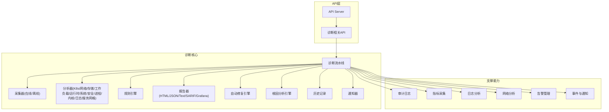
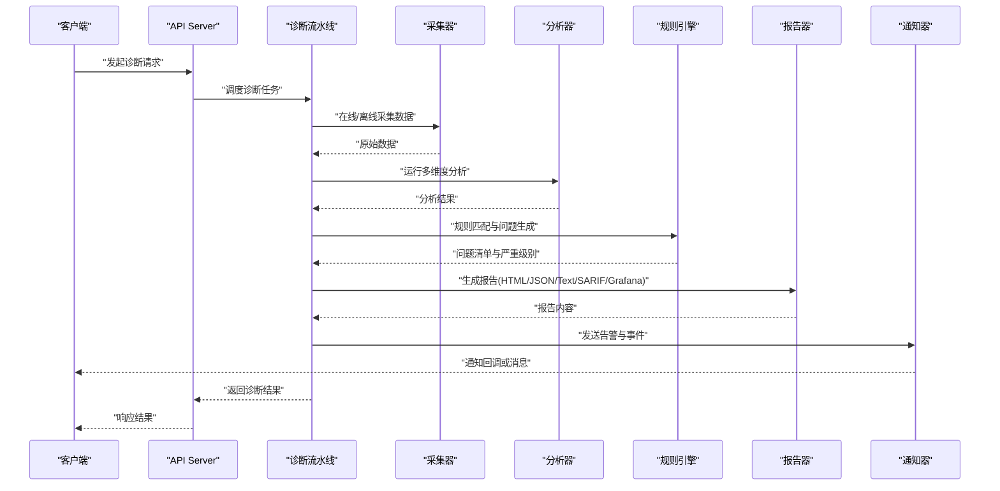
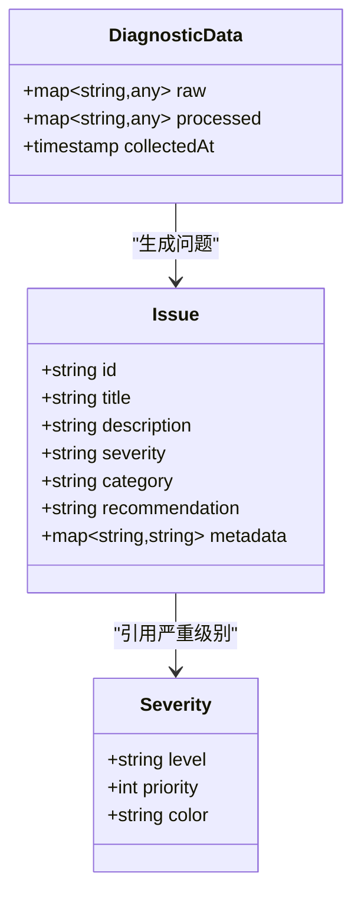
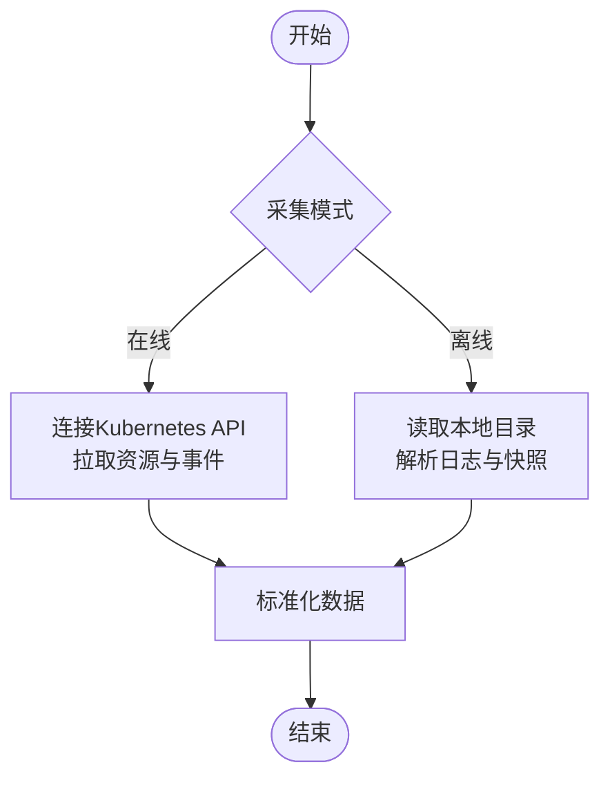
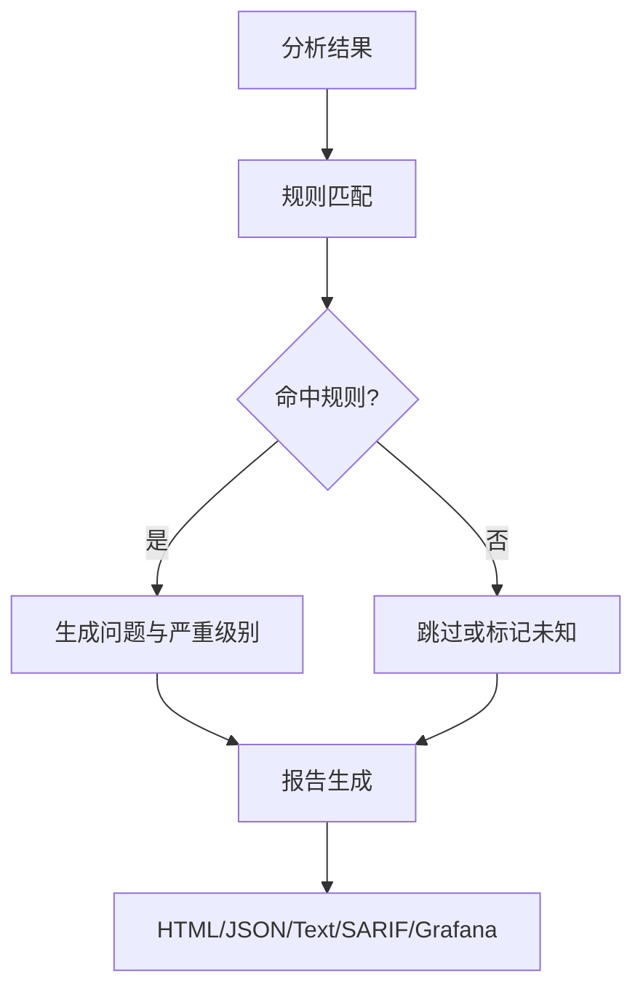
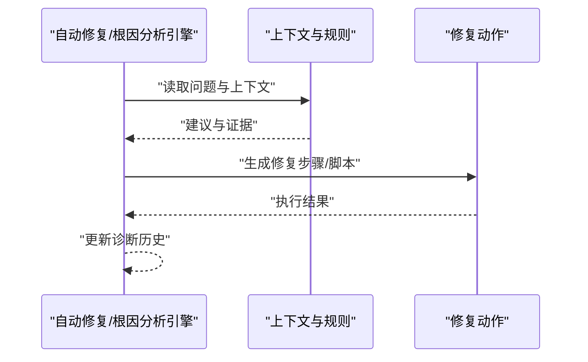
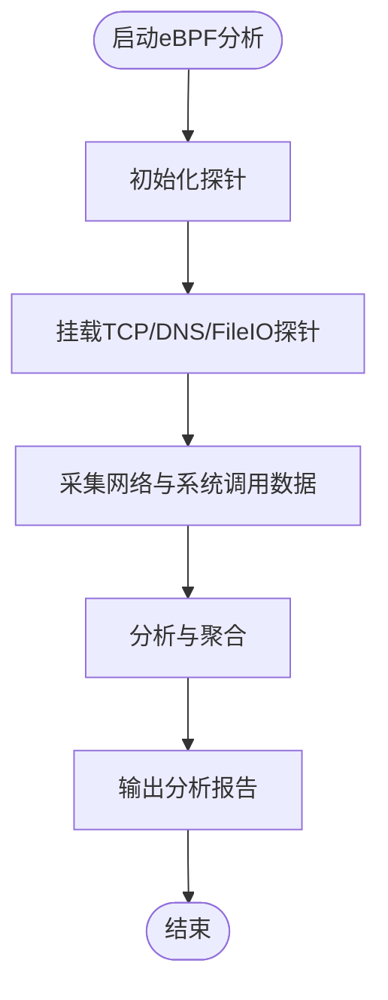
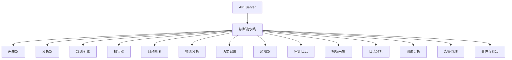
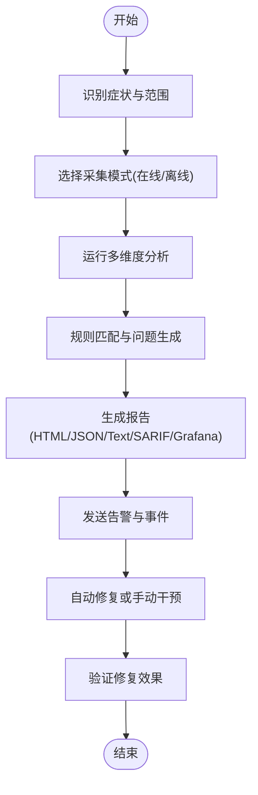

# 故障排查

<cite>
**本文引用的文件**   
- [internal/api/server.go](file://internal/api/server.go)
- [internal/api/diag.go](file://internal/api/diag.go)
- [internal/audit/logger.go](file://internal/audit/logger.go)
- [internal/config/config.go](file://internal/config/config.go)
- [internal/loganalysis/analyzer.go](file://internal/loganalysis/analyzer.go)
- [internal/networkanalysis/analyzer.go](file://internal/networkanalysis/analyzer.go)
- [internal/metrics/collector.go](file://internal/metrics/collector.go)
- [internal/events/notifier.go](file://internal/events/notifier.go)
- [internal/alerting/manager.go](file://internal/alerting/manager.go)
- [internal/diag/pipeline.go](file://internal/diag/pipeline.go)
- [internal/diag/types/issue.go](file://internal/diag/types/issue.go)
- [internal/diag/types/severity.go](file://internal/diag/types/severity.go)
- [internal/diag/rules/engine.go](file://internal/diag/rules/engine.go)
- [internal/diag/rules/types.go](file://internal/diag/rules/types.go)
- [internal/diag/reporter/html.go](file://internal/diag/reporter/html.go)
- [internal/diag/reporter/json.go](file://internal/diag/reporter/json.go)
- [internal/diag/reporter/text.go](file://internal/diag/reporter/text.go)
- [internal/diag/reporter/sarif.go](file://internal/diag/reporter/sarif.go)
- [internal/diag/reporter/grafana.go](file://internal/diag/reporter/grafana.go)
- [internal/diag/autofix/engine.go](file://internal/diag/autofix/engine.go)
- [internal/diag/rca/engine.go](file://internal/diag/rca/engine.go)
- [internal/diag/collector/interface.go](file://internal/diag/collector/interface.go)
- [internal/diag/collector/online/kubernetes.go](file://internal/diag/collector/online/kubernetes.go)
- [internal/diag/collector/offline/directory.go](file://internal/diag/collector/offline/directory.go)
- [internal/diag/analyzer/kubernetes/kubernetes.go](file://internal/diag/analyzer/kubernetes/kubernetes.go)
- [internal/diag/analyzer/network/network.go](file://internal/diag/analyzer/network/network.go)
- [internal/diag/analyzer/storage/storage.go](file://internal/diag/analyzer/storage/storage.go)
- [internal/diag/analyzer/workload/workload.go](file://internal/diag/analyzer/workload/workload.go)
- [internal/diag/analyzer/runtime/runtime.go](file://internal/diag/analyzer/runtime/runtime.go)
- [internal/diag/analyzer/system/resource.go](file://internal/diag/analyzer/system/resource.go)
- [internal/diag/analyzer/security/rbac.go](file://internal/diag/analyzer/security/rbac.go)
- [internal/diag/analyzer/security/cis.go](file://internal/diag/analyzer/security/cis.go)
- [internal/diag/analyzer/process/service.go](file://internal/diag/analyzer/process/service.go)
- [internal/diag/analyzer/kernel/kernel.go](file://internal/diag/analyzer/kernel/kernel.go)
- [internal/diag/analyzer/log/log.go](file://internal/diag/analyzer/log/log.go)
- [internal/diag/analyzer/servicemesh/istio.go](file://internal/diag/analyzer/servicemesh/istio.go)
- [internal/diag/analyzer/servicemesh/linkerd.go](file://internal/diag/analyzer/servicemesh/linkerd.go)
- [internal/diag/history/history.go](file://internal/diag/history/history.go)
- [internal/diag/notifier/notifier.go](file://internal/diag/notifier/notifier.go)
- [internal/diag/import.go](file://internal/diag/import.go)
- [internal/diag/tui/diagnosis.go](file://internal/diag/tui/diagnosis.go)
- [internal/diag/tui/model.go](file://internal/diag/tui/model.go)
- [internal/diag/cost/analyzer.go](file://internal/diag/cost/analyzer.go)
- [internal/diag/scanner/image.go](file://internal/diag/scanner/image.go)
- [internal/diag/ebpf/analyzer/tcp_analyzer.go](file://internal/diag/ebpf/analyzer/tcp_analyzer.go)
- [internal/diag/ebpf/analyzer/dns_analyzer.go](file://internal/diag/ebfiler/analyzer/dns_analyzer.go)
- [internal/diag/ebpf/probe/manager_linux.go](file://internal/diag/ebpf/probe/manager_linux.go)
- [internal/diag/ebpf/probe/types.go](file://internal/diag/ebpf/probe/types.go)
- [internal/diag/analyzer/benchmark_test.go](file://internal/diag/analyzer/benchmark_test.go)
- [internal/diag/analyzer/interface.go](file://internal/diag/analyzer/interface.go)
- [internal/diag/analyzer/registry.go](file://internal/diag/analyzer/registry.go)
- [internal/diag/analyzer/interface_test.go](file://internal/diag/analyzer/interface_test.go)
- [internal/diag/analyzer/registry_test.go](file://internal/diag/analyzer/registry_test.go)
- [internal/diag/analyzer/kubernetes/controlplane.go](file://internal/diag/analyzer/kubernetes/controlplane.go)
- [internal/diag/analyzer/kubernetes/dns.go](file://internal/diag/analyzer/kubernetes/dns.go)
- [internal/diag/analyzer/kubernetes/gpu.go](file://internal/diag/analyzer/kubernetes/gpu.go)
- [internal/diag/analyzer/kubernetes/storage_test.go](file://internal/diag/analyzer/kubernetes/storage_test.go)
- [internal/diag/analyzer/kubernetes/workload_test.go](file://internal/diag/analyzer/kubernetes/workload_test.go)
- [internal/diag/analyzer/kubernetes/kubernetes_test.go](file://internal/diag/analyzer/kubernetes/kubernetes_test.go)
- [internal/diag/analyzer/network/network_test.go](file://internal/diag/analyzer/network/network_test.go)
- [internal/diag/analyzer/storage/storage_test.go](file://internal/diag/analyzer/storage/storage_test.go)
- [internal/diag/analyzer/runtime/runtime_test.go](file://internal/diag/analyzer/runtime/runtime_test.go)
- [internal/diag/analyzer/system/resource_test.go](file://internal/internal/diag/analyzer/system/resource_test.go)
- [internal/diag/analyzer/security/rbac_test.go](file://internal/diag/analyzer/security/rbac_test.go)
- [internal/diag/analyzer/security/cis_test.go](file://internal/diag/analyzer/security/cis_test.go)
- [internal/diag/analyzer/process/service_test.go](file://internal/diag/analyzer/process/service_test.go)
- [internal/diag/analyzer/kernel/kernel_test.go](file://internal/diag/analyzer/kernel/kernel_test.go)
- [internal/diag/analyzer/log/log_test.go](file://internal/diag/analyzer/log/log_test.go)
- [internal/diag/analyzer/servicemesh/servicemesh_test.go](file://internal/diag/analyzer/servicemesh/servicemesh_test.go)
- [internal/diag/collector/online/kubernetes_test.go](file://internal/diag/collector/online/kubernetes_test.go)
- [internal/diag/collector/offline/directory_test.go](file://internal/diag/collector/offline/directory_test.go)
- [internal/diag/collector/interface_test.go](file://internal/diag/collector/interface_test.go)
- [internal/diag/rules/engine_test.go](file://internal/diag/rules/engine_test.go)
- [internal/diag/rules/loader.go](file://internal/diag/rules/loader.go)
- [internal/diag/rules/loader_test.go](file://internal/diag/rules/loader_test.go)
- [internal/diag/rules/types_test.go](file://internal/diag/rules/types_test.go)
- [internal/diag/reporter/html_test.go](file://internal/diag/reporter/html_test.go)
- [internal/diag/reporter/json_test.go](file://internal/diag/reporter/json_test.go)
- [internal/diag/reporter/text_test.go](file://internal/diag/reporter/text_test.go)
- [internal/diag/reporter/interface.go](file://internal/diag/reporter/interface.go)
- [internal/diag/reporter/interface_test.go](file://internal/diag/reporter/interface_test.go)
- [internal/diag/autofix/engine_test.go](file://internal/diag/autofix/engine_test.go)
- [internal/diag/rca/engine_test.go](file://internal/diag/rca/engine_test.go)
- [internal/diag/history/history_test.go](file://internal/diag/history/history_test.go)
- [internal/diag/notifier/notifier_test.go](file://internal/diag/notifier/notifier_test.go)
- [internal/diag/pipeline_test.go](file://internal/diag/pipeline_test.go)
- [internal/diag/types/issue_test.go](file://internal/diag/types/issue_test.go)
- [internal/diag/types/severity_test.go](file://internal/diag/types/severity_test.go)
- [internal/diag/types/diagnostic_data.go](file://internal/diag/types/diagnostic_data.go)
- [internal/diag/types/servicemesh.go](file://internal/diag/types/servicemesh.go)
- [internal/diag/ebpf/analyzer/fileio_analyzer.go](file://internal/diag/ebpf/analyzer/fileio_analyzer.go)
- [internal/diag/ebpf/analyzer/init.go](file://internal/diag/ebpf/analyzer/init.go)
- [internal/diag/ebpf/bpf/manager_linux.go](file://internal/diag/ebpf/bpf/manager_linux.go)
- [internal/diag/ebpf/bpf/probe_test.go](file://internal/diag/ebpf/bpf/probe_test.go)
- [internal/diag/ebpf/probe/manager_other.go](file://internal/diag/ebpf/probe/manager_other.go)
- [internal/diag/ebpf/probe/probe_test.go](file://internal/diag/ebpf/probe/probe_test.go)
- [internal/diag/analyzer/benchmark_test.go](file://internal/diag/analyzer/benchmark_test.go)
- [internal/diag/analyzer/interface.go](file://internal/diag/analyzer/interface.go)
- [internal/diag/analyzer/registry.go](file://internal/diag/analyzer/registry.go)
- [internal/diag/analyzer/interface_test.go](file://internal/diag/analyzer/interface_test.go)
- [internal/diag/analyzer/registry_test.go](file://internal/diag/analyzer/registry_test.go)
- [internal/diag/analyzer/kubernetes/controlplane.go](file://internal/diag/analyzer/kubernetes/controlplane.go)
- [internal/diag/analyzer/kubernetes/dns.go](file://internal/diag/analyzer/kubernetes/dns.go)
- [internal/diag/analyzer/kubernetes/gpu.go](file://internal/diag/analyzer/kubernetes/gpu.go)
- [internal/diag/analyzer/kubernetes/storage_test.go](file://internal/diag/analyzer/kubernetes/storage_test.go)
- [internal/diag/analyzer/kubernetes/workload_test.go](file://internal/diag/analyzer/kubernetes/workload_test.go)
- [internal/diag/analyzer/kubernetes/kubernetes_test.go](file://internal/diag/analyzer/kubernetes/kubernetes_test.go)
- [internal/diag/analyzer/network/network_test.go](file://internal/diag/analyzer/network/network_test.go)
- [internal/diag/analyzer/storage/storage_test.go](file://internal/diag/analyzer/storage/storage_test.go)
- [internal/diag/analyzer/runtime/runtime_test.go](file://internal/diag/analyzer/runtime/runtime_test.go)
- [internal/diag/analyzer/system/resource_test.go](file://internal/diag/analyzer/system/resource_test.go)
- [internal/diag/analyzer/security/rbac_test.go](file://internal/diag/analyzer/security/rbac_test.go)
- [internal/diag/analyzer/security/cis_test.go](file://internal/diag/analyzer/security/cis_test.go)
- [internal/diag/analyzer/process/service_test.go](file://internal/diag/analyzer/process/service_test.go)
- [internal/diag/analyzer/kernel/kernel_test.go](file://internal/diag/analyzer/kernel/kernel_test.go)
- [internal/diag/analyzer/log/log_test.go](file://internal/diag/analyzer/log/log_test.go)
- [internal/diag/analyzer/servicemesh/servicemesh_test.go](file://internal/diag/analyzer/servicemesh/servicemesh_test.go)
- [internal/diag/collector/online/kubernetes_test.go](file://internal/diag/collector/online/kubernetes_test.go)
- [internal/diag/collector/offline/directory_test.go](file://internal/diag/collector/collector/offline/directory_test.go)
- [internal/diag/collector/interface_test.go](file://internal/diag/collector/interface_test.go)
- [internal/diag/rules/engine_test.go](file://internal/diag/rules/engine_test.go)
- [internal/diag/rules/loader.go](file://internal/diag/rules/loader.go)
- [internal/diag/rules/loader_test.go](file://internal/diag/rules/loader_test.go)
- [internal/diag/rules/types_test.go](file://internal/diag/rules/types_test.go)
- [internal/diag/reporter/html_test.go](file://internal/diag/reporter/html_test.go)
- [internal/diag/reporter/json_test.go](file://internal/diag/reporter/json_test.go)
- [internal/diag/reporter/text_test.go](file://internal/diag/reporter/text_test.go)
- [internal/diag/reporter/interface.go](file://internal/diag/reporter/interface.go)
- [internal/diag/reporter/interface_test.go](file://internal/diag/reporter/interface_test.go)
- [internal/diag/autofix/engine_test.go](file://internal/diag/autofix/engine_test.go)
- [internal/diag/rca/engine_test.go](file://internal/diag/rca/engine_test.go)
- [internal/diag/history/history_test.go](file://internal/diag/history/history_test.go)
- [internal/diag/notifier/notifier_test.go](file://internal/diag/notifier/notifier_test.go)
- [internal/diag/pipeline_test.go](file://internal/diag/pipeline_test.go)
- [internal/diag/types/issue_test.go](file://internal/diag/types/issue_test.go)
- [internal/diag/types/severity_test.go](file://internal/diag/types/severity_test.go)
- [internal/diag/types/diagnostic_data.go](file://internal/diag/types/diagnostic_data.go)
- [internal/diag/types/servicemesh.go](file://internal/diag/types/servicemesh.go)
- [internal/diag/ebpf/analyzer/fileio_analyzer.go](file://internal/diag/ebpf/analyzer/fileio_analyzer.go)
- [internal/diag/ebpf/analyzer/init.go](file://internal/diag/ebpf/analyzer/init.go)
- [internal/diag/ebpf/bpf/manager_linux.go](file://internal/diag/ebpf/bpf/manager_linux.go)
- [internal/diag/ebpf/bpf/probe_test.go](file://internal/diag/ebpf/bpf/probe_test.go)
- [internal/diag/ebpf/probe/manager_other.go](file://internal/diag/ebpf/probe/manager_other.go)
- [internal/diag/ebpf/probe/probe_test.go](file://internal/diag/ebpf/probe/probe_test.go)
</cite>

## 目录
1. [简介](#简介)
2. [项目结构](#项目结构)
3. [核心组件](#核心组件)
4. [架构总览](#架构总览)
5. [详细组件分析](#详细组件分析)
6. [依赖关系分析](#依赖关系分析)
7. [性能考量](#性能考量)
8. [故障排查指南](#故障排查指南)
9. [结论](#结论)
10. [附录](#附录)

## 简介
本指南面向 Klaw 平台的运维与开发人员，提供系统化的故障排查方法。内容涵盖常见问题定位、日志分析方法、性能问题诊断、网络问题排查、错误码说明、调试工具使用以及性能优化建议。文档基于代码库中的诊断管道、规则引擎、采集器、报告器、审计日志、告警与事件通知等模块进行梳理，帮助读者快速定位并解决问题。

## 项目结构
Klaw 平台围绕“采集—分析—规则—报告—修复”的诊断流水线构建，关键目录包括：
- internal/api：HTTP API 与服务入口
- internal/diag：诊断核心（采集、分析、规则、报告、自动修复、根因分析、历史与通知）
- internal/loganalysis：日志分析引擎
- internal/networkanalysis：网络分析引擎
- internal/metrics：指标采集
- internal/audit：审计日志
- internal/alerting：告警管理
- internal/events：事件与通知

**图表来源** 
- [internal/api/server.go](file://internal/api/server.go)
- [internal/api/diag.go](file://internal/api/diag.go)
- [internal/diag/pipeline.go](file://internal/diag/pipeline.go)
- [internal/diag/collector/interface.go](file://internal/diag/collector/interface.go)
- [internal/diag/analyzer/interface.go](file://internal/diag/analyzer/interface.go)
- [internal/diag/rules/engine.go](file://internal/diag/rules/engine.go)
- [internal/diag/reporter/interface.go](file://internal/diag/reporter/interface.go)
- [internal/diag/autofix/engine.go](file://internal/diag/autofix/engine.go)
- [internal/diag/rca/engine.go](file://internal/diag/rca/engine.go)
- [internal/diag/history/history.go](file://internal/diag/history/history.go)
- [internal/diag/notifier/notifier.go](file://internal/diag/notifier/notifier.go)
- [internal/audit/logger.go](file://internal/audit/logger.go)
- [internal/metrics/collector.go](file://internal/metrics/collector.go)
- [internal/loganalysis/analyzer.go](file://internal/loganalysis/analyzer.go)
- [internal/networkanalysis/analyzer.go](file://internal/networkanalysis/analyzer.go)
- [internal/alerting/manager.go](file://internal/alerting/manager.go)
- [internal/events/notifier.go](file://internal/events/notifier.go)

**章节来源**
- [internal/api/server.go](file://internal/api/server.go)
- [internal/api/diag.go](file://internal/api/diag.go)
- [internal/diag/pipeline.go](file://internal/diag/pipeline.go)

## 核心组件
- 诊断流水线：编排采集、分析、规则匹配、报告生成、自动修复与根因分析，支持多阶段执行与结果汇总。
- 采集器：在线采集（Kubernetes）与离线采集（目录），统一接口抽象。
- 分析器：覆盖 K8s 控制面、DNS、GPU、存储、工作负载、运行时、系统资源、安全（RBAC/CIS）、进程、内核、日志、服务网格（Istio/Linkerd）。
- 规则引擎：加载规则、匹配问题、输出结构化问题与严重级别。
- 报告器：HTML、JSON、Text、SARIF、Grafana 多种格式输出。
- 自动修复与根因分析：根据规则与上下文生成修复建议与根因推断。
- 审计与指标：记录操作与系统指标，辅助问题回溯与性能分析。
- 告警与事件：将问题与状态变化推送至外部系统。

**章节来源**
- [internal/diag/pipeline.go](file://internal/diag/pipeline.go)
- [internal/diag/collector/interface.go](file://internal/diag/collector/interface.go)
- [internal/diag/analyzer/interface.go](file://internal/diag/analyzer/interface.go)
- [internal/diag/rules/engine.go](file://internal/diag/rules/engine.go)
- [internal/diag/reporter/interface.go](file://internal/diag/reporter/interface.go)
- [internal/diag/autofix/engine.go](file://internal/diag/autofix/engine.go)
- [internal/diag/rca/engine.go](file://internal/diag/rca/engine.go)
- [internal/audit/logger.go](file://internal/audit/logger.go)
- [internal/metrics/collector.go](file://internal/metrics/collector.go)
- [internal/alerting/manager.go](file://internal/alerting/manager.go)
- [internal/events/notifier.go](file://internal/events/notifier.go)

## 架构总览
下图展示从 API 请求到诊断结果输出的完整流程，包含采集、分析、规则匹配、报告生成与通知环节。

**图表来源** 
- [internal/api/server.go](file://internal/api/server.go)
- [internal/api/diag.go](file://internal/api/diag.go)
- [internal/diag/pipeline.go](file://internal/diag/pipeline.go)
- [internal/diag/collector/interface.go](file://internal/diag/collector/interface.go)
- [internal/diag/analyzer/interface.go](file://internal/diag/analyzer/interface.go)
- [internal/diag/rules/engine.go](file://internal/diag/rules/engine.go)
- [internal/diag/reporter/interface.go](file://internal/diag/reporter/interface.go)
- [internal/diag/notifier/notifier.go](file://internal/diag/notifier/notifier.go)

## 详细组件分析

### 诊断流水线与类型定义
- 流水线负责协调各阶段，确保数据采集、分析、规则匹配与报告生成的顺序与一致性。
- 类型定义包括问题、严重级别、诊断数据模型等，为后续处理提供统一数据结构。

**图表来源** 
- [internal/diag/types/issue.go](file://internal/diag/types/issue.go)
- [internal/diag/types/severity.go](file://internal/diag/types/severity.go)
- [internal/diag/types/diagnostic_data.go](file://internal/diag/types/diagnostic_data.go)

**章节来源**
- [internal/diag/pipeline.go](file://internal/diag/pipeline.go)
- [internal/diag/types/issue.go](file://internal/diag/types/issue.go)
- [internal/diag/types/severity.go](file://internal/diag/types/severity.go)
- [internal/diag/types/diagnostic_data.go](file://internal/diag/types/diagnostic_data.go)

### 采集器（在线与离线）
- 在线采集器通过 Kubernetes API 获取集群信息、资源状态与事件。
- 离线采集器从本地目录读取预收集的日志与配置快照。

**图表来源** 
- [internal/diag/collector/online/kubernetes.go](file://internal/diag/collector/online/kubernetes.go)
- [internal/diag/collector/offline/directory.go](file://internal/diag/collector/offline/directory.go)
- [internal/diag/collector/interface.go](file://internal/diag/collector/interface.go)

**章节来源**
- [internal/diag/collector/interface.go](file://internal/diag/collector/interface.go)
- [internal/diag/collector/online/kubernetes.go](file://internal/diag/collector/online/kubernetes.go)
- [internal/diag/collector/offline/directory.go](file://internal/diag/collector/offline/directory.go)

### 分析器（多维分析）
- 覆盖 K8s 控制面、DNS、GPU、存储、工作负载、运行时、系统资源、安全（RBAC/CIS）、进程、内核、日志、服务网格（Istio/Linkerd）等维度。
- 每个分析器实现统一接口，便于扩展与组合。

```mermaid
classDiagram
class AnalyzerInterface {
+analyze(data) Result
+name() string
}
class K8sAnalyzer {
+analyze(data) Result
+name() string
}
class NetworkAnalyzer {
+analyze(data) Result
+name() string
}
class StorageAnalyzer {
+analyze(data) Result
+name() string
}
class WorkloadAnalyzer {
+analyze(data) Result
+name() string
}
class RuntimeAnalyzer {
+analyze(data) Result
+name() string
}
class SystemResourceAnalyzer {
+analyze(data) Result
+name() string
}
class SecurityAnalyzer {
+analyze(data) Result
+name() string
}
class ProcessAnalyzer {
+analyze(data) Result
+name() string
}
class KernelAnalyzer {
+analyze(data) Result
+name() string
}
class LogAnalyzer {
+analyze(data) Result
+name() string
}
class ServiceMeshAnalyzer {
+analyze(data) Result
+name() string
}
AnalyzerInterface <|.. K8sAnalyzer
AnalyzerInterface <|.. NetworkAnalyzer
AnalyzerInterface <|.. StorageAnalyzer
AnalyzerInterface <|.. WorkloadAnalyzer
AnalyzerInterface <|.. RuntimeAnalyzer
AnalyzerInterface <|.. SystemResourceAnalyzer
AnalyzerInterface <|.. SecurityAnalyzer
AnalyzerInterface <|.. ProcessAnalyzer
AnalyzerInterface <|.. KernelAnalyzer
AnalyzerInterface <|.. LogAnalyzer
AnalyzerInterface <|.. ServiceMeshAnalyzer
```

**图表来源** 
- [internal/diag/analyzer/interface.go](file://internal/diag/analyzer/interface.go)
- [internal/diag/analyzer/kubernetes/kubernetes.go](file://internal/diag/analyzer/kubernetes/kubernetes.go)
- [internal/diag/analyzer/network/network.go](file://internal/diag/analyzer/network/network.go)
- [internal/diag/analyzer/storage/storage.go](file://internal/diag/analyzer/storage/storage.go)
- [internal/diag/analyzer/workload/workload.go](file://internal/diag/analyzer/workload/workload.go)
- [internal/diag/analyzer/runtime/runtime.go](file://internal/diag/analyzer/runtime/runtime.go)
- [internal/diag/analyzer/system/resource.go](file://internal/diag/analyzer/system/resource.go)
- [internal/diag/analyzer/security/rbac.go](file://internal/diag/analyzer/security/rbac.go)
- [internal/diag/analyzer/security/cis.go](file://internal/diag/analyzer/security/cis.go)
- [internal/diag/analyzer/process/service.go](file://internal/diag/analyzer/process/service.go)
- [internal/diag/analyzer/kernel/kernel.go](file://internal/diag/analyzer/kernel/kernel.go)
- [internal/diag/analyzer/log/log.go](file://internal/diag/analyzer/log/log.go)
- [internal/diag/analyzer/servicemesh/istio.go](file://internal/diag/analyzer/servicemesh/istio.go)
- [internal/diag/analyzer/servicemesh/linkerd.go](file://internal/diag/analyzer/servicemesh/linkerd.go)

**章节来源**
- [internal/diag/analyzer/interface.go](file://internal/diag/analyzer/interface.go)
- [internal/diag/analyzer/kubernetes/kubernetes.go](file://internal/diag/analyzer/kubernetes/kubernetes.go)
- [internal/diag/analyzer/network/network.go](file://internal/diag/analyzer/network/network.go)
- [internal/diag/analyzer/storage/storage.go](file://internal/diag/analyzer/storage/storage.go)
- [internal/diag/analyzer/workload/workload.go](file://internal/diag/analyzer/workload/workload.go)
- [internal/diag/analyzer/runtime/runtime.go](file://internal/diag/analyzer/runtime/runtime.go)
- [internal/diag/analyzer/system/resource.go](file://internal/diag/analyzer/system/resource.go)
- [internal/diag/analyzer/security/rbac.go](file://internal/diag/analyzer/security/rbac.go)
- [internal/diag/analyzer/security/cis.go](file://internal/diag/analyzer/security/cis.go)
- [internal/diag/analyzer/process/service.go](file://internal/diag/analyzer/process/service.go)
- [internal/diag/analyzer/kernel/kernel.go](file://internal/diag/analyzer/kernel/kernel.go)
- [internal/diag/analyzer/log/log.go](file://internal/diag/analyzer/log/log.go)
- [internal/diag/analyzer/servicemesh/istio.go](file://internal/diag/analyzer/servicemesh/istio.go)
- [internal/diag/analyzer/servicemesh/linkerd.go](file://internal/diag/analyzer/servicemesh/linkerd.go)

### 规则引擎与报告器
- 规则引擎加载规则集，对分析结果进行匹配，生成问题与严重级别。
- 报告器支持 HTML、JSON、Text、SARIF、Grafana 等多种输出格式。

**图表来源** 
- [internal/diag/rules/engine.go](file://internal/diag/rules/engine.go)
- [internal/diag/rules/types.go](file://internal/diag/rules/types.go)
- [internal/diag/reporter/html.go](file://internal/diag/reporter/html.go)
- [internal/diag/reporter/json.go](file://internal/diag/reporter/json.go)
- [internal/diag/reporter/text.go](file://internal/diag/reporter/text.go)
- [internal/diag/reporter/sarif.go](file://internal/diag/reporter/sarif.go)
- [internal/diag/reporter/grafana.go](file://internal/diag/reporter/grafana.go)

**章节来源**
- [internal/diag/rules/engine.go](file://internal/diag/rules/engine.go)
- [internal/diag/rules/types.go](file://internal/diag/rules/types.go)
- [internal/diag/reporter/html.go](file://internal/diag/reporter/html.go)
- [internal/diag/reporter/json.go](file://internal/diag/reporter/json.go)
- [internal/diag/reporter/text.go](file://internal/diag/reporter/text.go)
- [internal/diag/reporter/sarif.go](file://internal/diag/reporter/sarif.go)
- [internal/diag/reporter/grafana.go](file://internal/diag/reporter/grafana.go)

### 自动修复与根因分析
- 自动修复引擎根据问题与建议生成修复动作或脚本。
- 根因分析引擎结合上下文与规则，推断潜在根因并提供证据链。

**图表来源** 
- [internal/diag/autofix/engine.go](file://internal/diag/autofix/engine.go)
- [internal/diag/rca/engine.go](file://internal/diag/rca/engine.go)
- [internal/diag/history/history.go](file://internal/diag/history/history.go)

**章节来源**
- [internal/diag/autofix/engine.go](file://internal/diag/autofix/engine.go)
- [internal/diag/rca/engine.go](file://internal/diag/rca/engine.go)
- [internal/diag/history/history.go](file://internal/diag/history/history.go)

### eBPF 网络分析
- eBPF 提供 TCP/DNS/文件IO 等维度的低开销网络与系统调用分析。
- 探针管理器负责 Linux 环境下的 eBPF 生命周期管理。

**图表来源** 
- [internal/diag/ebpf/analyzer/tcp_analyzer.go](file://internal/diag/ebpf/analyzer/tcp_analyzer.go)
- [internal/diag/ebpf/analyzer/dns_analyzer.go](file://internal/diag/ebpf/analyzer/dns_analyzer.go)
- [internal/diag/ebpf/analyzer/fileio_analyzer.go](file://internal/diag/ebpf/analyzer/fileio_analyzer.go)
- [internal/diag/ebpf/probe/manager_linux.go](file://internal/diag/ebpf/probe/manager_linux.go)
- [internal/diag/ebpf/probe/types.go](file://internal/diag/ebpf/probe/types.go)

**章节来源**
- [internal/diag/ebpf/analyzer/tcp_analyzer.go](file://internal/diag/ebpf/analyzer/tcp_analyzer.go)
- [internal/diag/ebpf/analyzer/dns_analyzer.go](file://internal/diag/ebpf/analyzer/dns_analyzer.go)
- [internal/diag/ebpf/analyzer/fileio_analyzer.go](file://internal/diag/ebpf/analyzer/fileio_analyzer.go)
- [internal/diag/ebpf/probe/manager_linux.go](file://internal/diag/ebpf/probe/manager_linux.go)
- [internal/diag/ebpf/probe/types.go](file://internal/diag/ebpf/probe/types.go)

## 依赖关系分析
- API 层依赖诊断流水线，流水线依赖采集器、分析器、规则引擎、报告器、自动修复与根因分析、历史记录与通知。
- 审计、指标、日志分析、网络分析、告警与事件作为支撑能力被广泛复用。

**图表来源** 
- [internal/api/server.go](file://internal/api/server.go)
- [internal/diag/pipeline.go](file://internal/diag/pipeline.go)
- [internal/diag/collector/interface.go](file://internal/diag/collector/interface.go)
- [internal/diag/analyzer/interface.go](file://internal/diag/analyzer/interface.go)
- [internal/diag/rules/engine.go](file://internal/diag/rules/engine.go)
- [internal/diag/reporter/interface.go](file://internal/diag/reporter/interface.go)
- [internal/diag/autofix/engine.go](file://internal/diag/autofix/engine.go)
- [internal/diag/rca/engine.go](file://internal/diag/rca/engine.go)
- [internal/diag/history/history.go](file://internal/diag/history/history.go)
- [internal/diag/notifier/notifier.go](file://internal/diag/notifier/notifier.go)
- [internal/audit/logger.go](file://internal/audit/logger.go)
- [internal/metrics/collector.go](file://internal/metrics/collector.go)
- [internal/loganalysis/analyzer.go](file://internal/loganalysis/analyzer.go)
- [internal/networkanalysis/analyzer.go](file://internal/networkanalysis/analyzer.go)
- [internal/alerting/manager.go](file://internal/alerting/manager.go)
- [internal/events/notifier.go](file://internal/events/notifier.go)

**章节来源**
- [internal/api/server.go](file://internal/api/server.go)
- [internal/diag/pipeline.go](file://internal/diag/pipeline.go)

## 性能考量
- 采集阶段避免频繁轮询，采用增量与事件驱动方式减少负载。
- 分析器应并行化执行，限制并发度以避免资源争用。
- 规则匹配使用索引与缓存提升命中率。
- 报告生成按需选择轻量格式，避免大对象序列化。
- eBPF 分析需关注内核版本兼容性与探针加载开销。
- 指标采集与审计日志异步写入，降低主路径延迟。

[本节为通用指导，不直接分析具体文件]

## 故障排查指南

### 常见问题与定位流程
- 启动失败
  - 检查配置文件加载与参数校验。
  - 查看审计日志与错误堆栈。
  - 验证依赖服务（如 Kubernetes API）可达性。
- 诊断任务无结果
  - 确认采集器模式与权限。
  - 检查分析器是否启用与规则是否匹配。
  - 查看报告器输出路径与权限。
- 性能退化
  - 观察指标采集的 CPU/内存趋势。
  - 分析 eBPF 网络与系统调用热点。
  - 审查规则引擎复杂度与匹配次数。
- 网络异常
  - 使用 eBPF 的 TCP/DNS 分析定位丢包与超时。
  - 检查服务网格（Istio/Linkerd）策略与流量镜像。
  - 核对 DNS 解析与证书配置。

**章节来源**
- [internal/config/config.go](file://internal/config/config.go)
- [internal/audit/logger.go](file://internal/audit/logger.go)
- [internal/diag/collector/interface.go](file://internal/diag/collector/interface.go)
- [internal/diag/analyzer/interface.go](file://internal/diag/analyzer/interface.go)
- [internal/diag/rules/engine.go](file://internal/diag/rules/engine.go)
- [internal/diag/reporter/interface.go](file://internal/diag/reporter/interface.go)
- [internal/metrics/collector.go](file://internal/metrics/collector.go)
- [internal/diag/ebpf/analyzer/tcp_analyzer.go](file://internal/diag/ebpf/analyzer/tcp_analyzer.go)
- [internal/diag/ebpf/analyzer/dns_analyzer.go](file://internal/diag/ebpf/analyzer/dns_analyzer.go)
- [internal/diag/analyzer/servicemesh/istio.go](file://internal/diag/analyzer/servicemesh/istio.go)
- [internal/diag/analyzer/servicemesh/linkerd.go](file://internal/diag/analyzer/servicemesh/linkerd.go)

### 日志分析方法
- 启用审计日志，记录关键操作与错误上下文。
- 使用日志分析引擎对错误模式进行聚类与统计。
- 结合时间戳与请求ID追踪跨模块调用链。
- 将日志导出至集中式存储以便检索与关联分析。

**章节来源**
- [internal/audit/logger.go](file://internal/audit/logger.go)
- [internal/loganalysis/analyzer.go](file://internal/loganalysis/analyzer.go)

### 性能问题诊断
- 监控指标采集的延迟与吞吐，识别瓶颈点。
- 分析 eBPF 采集的网络与系统调用热点。
- 评估规则引擎匹配成本，优化规则结构与索引。
- 调整并发与批处理策略，平衡资源占用与响应时间。

**章节来源**
- [internal/metrics/collector.go](file://internal/metrics/collector.go)
- [internal/diag/ebpf/analyzer/tcp_analyzer.go](file://internal/diag/ebpf/analyzer/tcp_analyzer.go)
- [internal/diag/rules/engine.go](file://internal/diag/rules/engine.go)

### 网络问题排查
- 使用 eBPF 的 TCP/DNS 分析定位连接建立失败、重传与超时。
- 检查服务网格策略、路由与证书配置。
- 核对 DNS 解析链路与上游服务器可用性。
- 结合网络分析引擎输出，生成可视化报告。

**章节来源**
- [internal/diag/ebpf/analyzer/tcp_analyzer.go](file://internal/diag/ebpf/analyzer/tcp_analyzer.go)
- [internal/diag/ebpf/analyzer/dns_analyzer.go](file://internal/diag/ebpf/analyzer/dns_analyzer.go)
- [internal/diag/analyzer/servicemesh/istio.go](file://internal/diag/analyzer/servicemesh/istio.go)
- [internal/diag/analyzer/servicemesh/linkerd.go](file://internal/diag/analyzer/servicemesh/linkerd.go)
- [internal/networkanalysis/analyzer.go](file://internal/networkanalysis/analyzer.go)

### 错误码说明
- 严重级别：用于标识问题的影响程度与优先级，便于分级处理。
- 问题分类：按维度（K8s/网络/存储/工作负载/运行时/系统/安全/进程/内核/日志/服务网格）归类，便于定位责任域。
- 建议字段：提供修复建议与操作步骤，辅助自动化修复。

**章节来源**
- [internal/diag/types/severity.go](file://internal/diag/types/severity.go)
- [internal/diag/types/issue.go](file://internal/diag/types/issue.go)

### 调试工具使用
- TUI 诊断界面：交互式查看诊断结果与历史。
- 报告器：选择合适格式（HTML/JSON/Text/SARIF/Grafana）进行导出与分析。
- 自动修复与根因分析：根据问题与建议生成修复脚本与证据链。

**章节来源**
- [internal/diag/tui/diagnosis.go](file://internal/diag/tui/diagnosis.go)
- [internal/diag/tui/model.go](file://internal/diag/tui/model.go)
- [internal/diag/reporter/html.go](file://internal/diag/reporter/html.go)
- [internal/diag/reporter/json.go](file://internal/diag/reporter/json.go)
- [internal/diag/reporter/text.go](file://internal/diag/reporter/text.go)
- [internal/diag/reporter/sarif.go](file://internal/diag/reporter/sarif.go)
- [internal/diag/reporter/grafana.go](file://internal/diag/reporter/grafana.go)
- [internal/diag/autofix/engine.go](file://internal/diag/autofix/engine.go)
- [internal/diag/rca/engine.go](file://internal/diag/rca/engine.go)

### 系统性问题定位流程

**图表来源** 
- [internal/diag/pipeline.go](file://internal/diag/pipeline.go)
- [internal/diag/collector/interface.go](file://internal/diag/collector/interface.go)
- [internal/diag/analyzer/interface.go](file://internal/diag/analyzer/interface.go)
- [internal/diag/rules/engine.go](file://internal/diag/rules/engine.go)
- [internal/diag/reporter/interface.go](file://internal/diag/reporter/interface.go)
- [internal/diag/notifier/notifier.go](file://internal/diag/notifier/notifier.go)
- [internal/diag/autofix/engine.go](file://internal/diag/autofix/engine.go)

**章节来源**
- [internal/diag/pipeline.go](file://internal/diag/pipeline.go)

## 结论
Klaw 平台以统一的诊断流水线为核心，整合采集、分析、规则、报告、自动修复与根因分析等能力，形成闭环的问题定位与解决流程。通过审计日志、指标采集、eBPF 网络分析与服务网格集成，平台能够高效识别与处理性能与网络问题。建议在生产环境中启用全量采集与规则匹配，结合报告器与通知机制，实现可观测性与自动化运维。

[本节为总结，不直接分析具体文件]

## 附录
- 配置参考：检查配置文件加载与参数校验逻辑。
- 测试用例：利用单元测试与基准测试验证分析器与规则引擎行为。
- 扩展开发：遵循分析器与采集器接口规范，新增自定义维度与采集源。

**章节来源**
- [internal/config/config.go](file://internal/config/config.go)
- [internal/diag/analyzer/interface.go](file://internal/diag/analyzer/interface.go)
- [internal/diag/collector/interface.go](file://internal/diag/collector/interface.go)