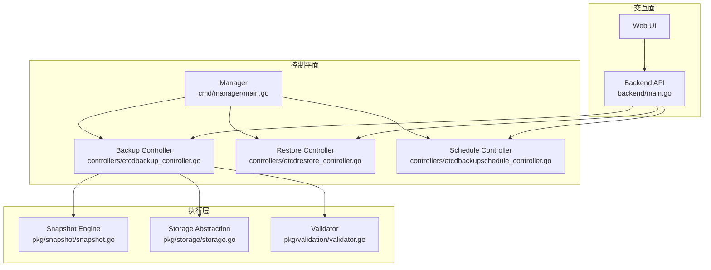
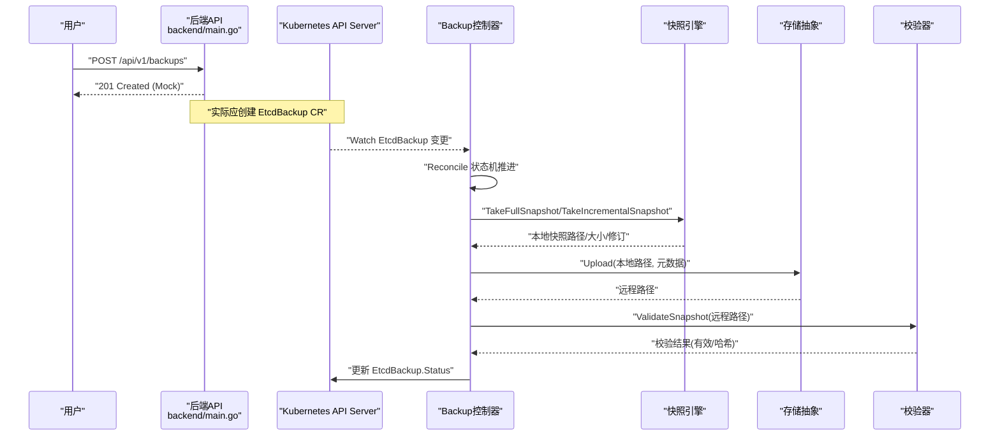
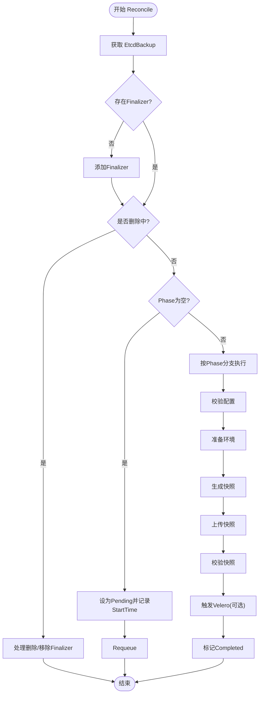
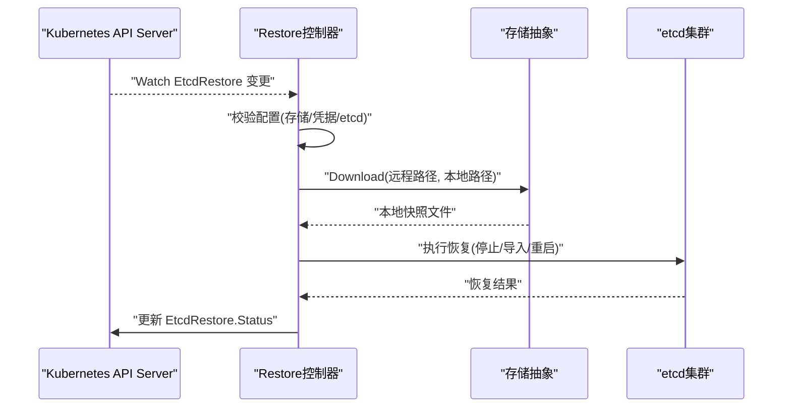
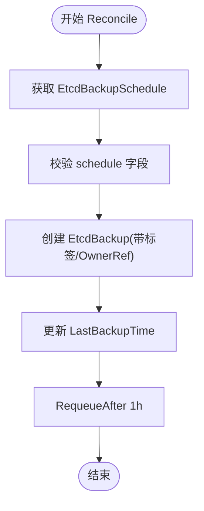
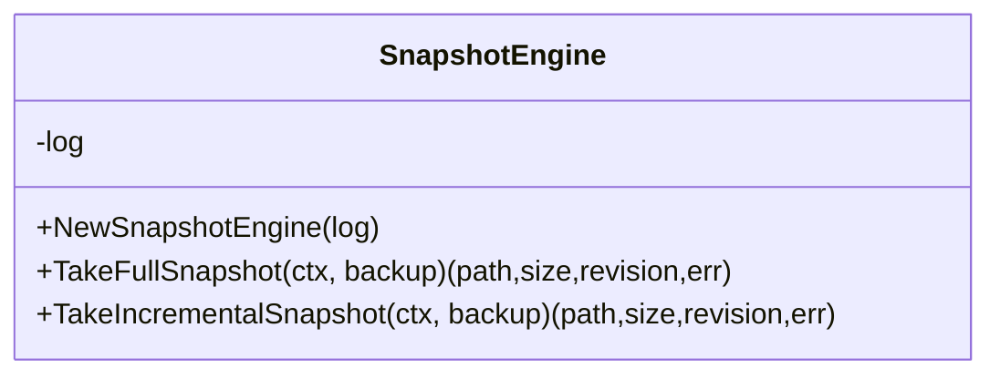
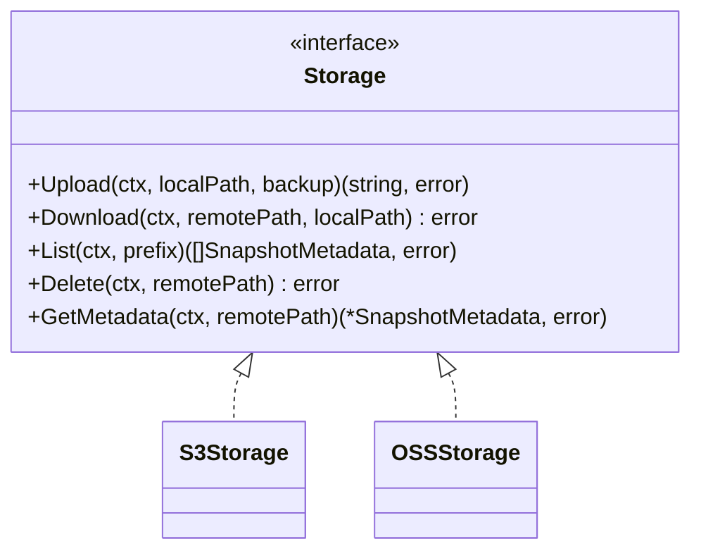
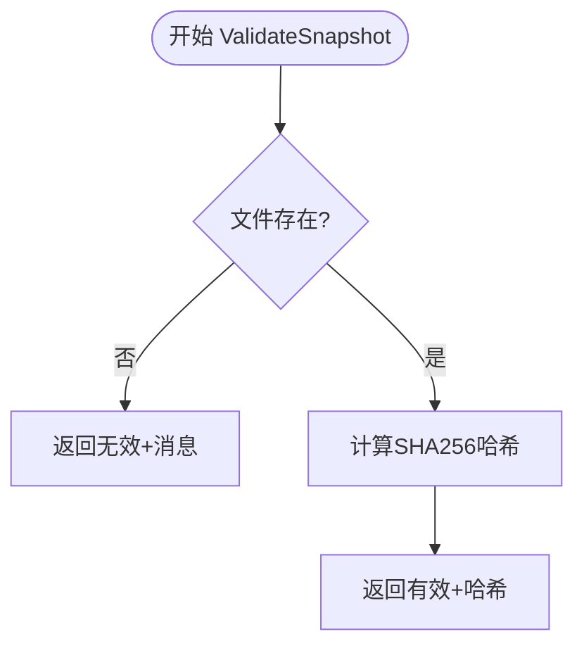
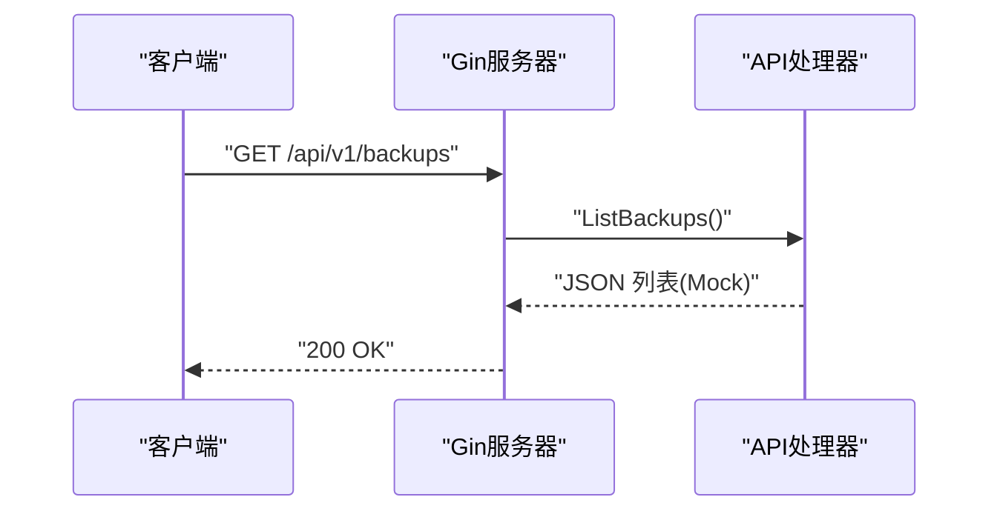
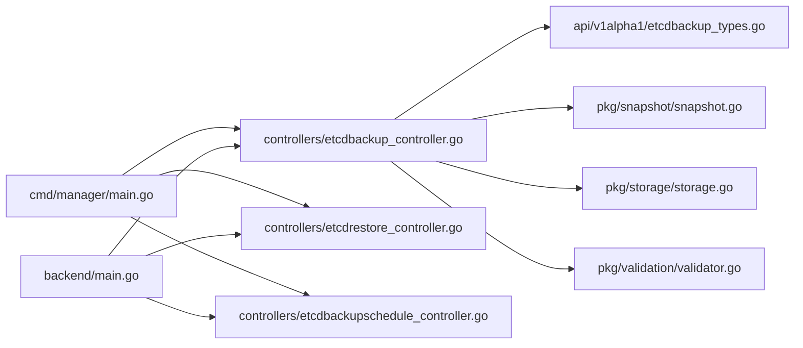

# EtcdGuardian 模块

<cite>
**本文引用的文件**
- [README.md](file://modules/etcd-guardian/README.md)
- [go.mod](file://modules/etcd-guardian/go.mod)
- [manager/main.go](file://modules/etcd-guardian/cmd/manager/main.go)
- [backend/main.go](file://modules/etcd-guardian/backend/main.go)
- [api/v1alpha1/etcdbackup_types.go](file://modules/etcd-guardian/api/v1alpha1/etcdbackup_types.go)
- [controllers/etcdbackup_controller.go](file://modules/etcd-guardian/controllers/etcdbackup_controller.go)
- [controllers/etcdrestore_controller.go](file://modules/etcd-guardian/controllers/etcdrestore_controller.go)
- [controllers/etcdbackupschedule_controller.go](file://modules/etcd-guardian/controllers/etcdbackupschedule_controller.go)
- [pkg/snapshot/snapshot.go](file://modules/etcd-guardian/pkg/snapshot/snapshot.go)
- [pkg/storage/storage.go](file://modules/etcd-guardian/pkg/storage/storage.go)
- [pkg/validation/validator.go](file://modules/etcd-guardian/pkg/validation/validator.go)
- [backend/api/backup.go](file://modules/etcd-guardian/backend/api/backup.go)
- [charts/etcdguardian/values.yaml](file://modules/etcd-guardian/charts/etcdguardian/values.yaml)
- [scripts/integrate-etcd-guardian.sh](file://scripts/integrate-etcd-guardian.sh)
</cite>

## 目录
1. [简介](#简介)
2. [项目结构](#项目结构)
3. [核心组件](#核心组件)
4. [架构总览](#架构总览)
5. [详细组件分析](#详细组件分析)
6. [依赖分析](#依赖分析)
7. [性能考虑](#性能考虑)
8. [故障排查指南](#故障排查指南)
9. [结论](#结论)
10. [附录](#附录)

## 简介
EtcdGuardian 是一个生产级 Kubernetes Operator，专注于 etcd 备份与恢复。它提供完整快照、增量快照、多租户隔离、托管 Kubernetes 兼容、自动验证、多云存储（S3/OSS/GCS/Azure）、加密与 KMS 集成、Velero 集成、监控告警以及 Web UI 管理。该模块已作为子模块并入 Klaw，位于 modules/etcd-guardian，后端 API 为独立子模块，二者配合使用。

## 项目结构
EtcdGuardian 采用典型的 Operator + 后端 API + Web UI 的三层结构：
- 控制平面：Operator Manager 启动并注册三个控制器（Backup、Restore、Schedule），通过 CRD 驱动状态机推进备份/恢复流程。
- 执行层：快照引擎负责生成 etcd 快照；存储抽象支持多种对象存储；校验器对快照进行完整性检查。
- 交互面：Gin 后端暴露 RESTful API，供 Web UI 或外部系统调用；Helm Chart 提供部署配置。

图表来源
- [manager/main.go:33-115](file://modules/etcd-guardian/cmd/manager/main.go#L33-L115)
- [backend/main.go:12-61](file://modules/etcd-guardian/backend/main.go#L12-L61)

章节来源
- [README.md:1-433](file://modules/etcd-guardian/README.md#L1-L433)
- [go.mod:1-86](file://modules/etcd-guardian/go.mod#L1-L86)

## 核心组件
- CRD 与类型定义：EtcdBackup、EtcdRestore、EtcdBackupSchedule 及其 Spec/Status 字段，定义了备份模式、存储位置、加密、保留策略、校验、Hook、Velero 集成等能力。
- 控制器：
  - Backup 控制器：实现从 Pending -> Validating -> Preparing -> Snapshotting -> Uploading -> Validating_Snapshot -> TriggeringVelero -> Completed/Failed 的状态机流转。
  - Restore 控制器：实现从 Pending -> Validating -> Preparing -> Downloading -> Restoring -> Completed/Failed 的状态机流转。
  - Schedule 控制器：根据调度模板创建 EtcdBackup 资源，并维护最近执行时间。
- 执行库：
  - 快照引擎：封装全量/增量快照逻辑（当前为占位实现）。
  - 存储抽象：统一 Upload/Download/List/Delete/GetMetadata 接口，按 Provider 路由到具体实现（S3/OSS 已预留）。
  - 校验器：计算快照哈希并返回校验结果。
- 后端 API：基于 Gin 的 REST 服务，提供备份、恢复、调度的 CRUD 与健康检查接口（当前为 Mock 数据）。
- Helm Chart：提供 Operator 部署参数（镜像、安全上下文、资源限制、存储、监控、RBAC、CRD 安装等）。

章节来源
- [api/v1alpha1/etcdbackup_types.go:23-320](file://modules/etcd-guardian/api/v1alpha1/etcdbackup_types.go#L23-L320)
- [controllers/etcdbackup_controller.go:57-121](file://modules/etcd-guardian/controllers/etcdbackup_controller.go#L57-L121)
- [controllers/etcdrestore_controller.go:52-113](file://modules/etcd-guardian/controllers/etcdrestore_controller.go#L52-L113)
- [controllers/etcdbackupschedule_controller.go:51-102](file://modules/etcd-guardian/controllers/etcdbackupschedule_controller.go#L51-L102)
- [pkg/snapshot/snapshot.go:31-86](file://modules/etcd-guardian/pkg/snapshot/snapshot.go#L31-L86)
- [pkg/storage/storage.go:27-69](file://modules/etcd-guardian/pkg/storage/storage.go#L27-L69)
- [pkg/validation/validator.go:29-91](file://modules/etcd-guardian/pkg/validation/validator.go#L29-L91)
- [backend/main.go:12-61](file://modules/etcd-guardian/backend/main.go#L12-L61)
- [charts/etcdguardian/values.yaml:5-167](file://modules/etcd-guardian/charts/etcdguardian/values.yaml#L5-L167)

## 架构总览
EtcdGuardian 以 Kubernetes 原生方式运行：用户通过 CRD 声明期望状态，Operator 控制器持续 reconcile，驱动底层快照、存储、校验等执行步骤，并将结果写回 Status。后端 API 提供面向用户的操作入口，Web UI 可视化展示与交互。

图表来源
- [backend/main.go:29-54](file://modules/etcd-guardian/backend/main.go#L29-L54)
- [controllers/etcdbackup_controller.go:103-118](file://modules/etcd-guardian/controllers/etcdbackup_controller.go#L103-L118)
- [pkg/snapshot/snapshot.go:42-86](file://modules/etcd-guardian/pkg/snapshot/snapshot.go#L42-L86)
- [pkg/storage/storage.go:55-69](file://modules/etcd-guardian/pkg/storage/storage.go#L55-L69)
- [pkg/validation/validator.go:48-74](file://modules/etcd-guardian/pkg/validation/validator.go#L48-L74)

## 详细组件分析

### 备份控制器（EtcdBackupReconciler）
- 职责：监听 EtcdBackup 资源，按阶段推进备份流程，处理删除与最终器清理。
- 关键阶段：
  - 配置校验：检查存储桶与凭据 Secret。
  - 准备环境：预留预钩子扩展点。
  - 快照：调用快照引擎生成全量/增量快照。
  - 上传：通过存储抽象将快照上传至对象存储。
  - 校验：可选地执行一致性/哈希校验。
  - Velero 集成：预留触发点。
  - 完成：标记 Completed 并记录时间戳。
- 错误处理：失败时设置 Phase=Failed 并写入 Message。

图表来源
- [controllers/etcdbackup_controller.go:57-121](file://modules/etcd-guardian/controllers/etcdbackup_controller.go#L57-L121)
- [controllers/etcdbackup_controller.go:123-167](file://modules/etcd-guardian/controllers/etcdbackup_controller.go#L123-L167)
- [controllers/etcdbackup_controller.go:169-229](file://modules/etcd-guardian/controllers/etcdbackup_controller.go#L169-L229)
- [controllers/etcdbackup_controller.go:231-294](file://modules/etcd-guardian/controllers/etcdbackup_controller.go#L231-L294)
- [controllers/etcdbackup_controller.go:296-324](file://modules/etcd-guardian/controllers/etcdbackup_controller.go#L296-L324)

章节来源
- [controllers/etcdbackup_controller.go:57-332](file://modules/etcd-guardian/controllers/etcdbackup_controller.go#L57-L332)

### 恢复控制器（EtcdRestoreReconciler）
- 职责：监听 EtcdRestore 资源，按阶段推进恢复流程，处理删除与最终器清理。
- 关键阶段：
  - 配置校验：检查存储桶、凭据 Secret、etcd 端点与数据目录。
  - 准备环境：预留预钩子扩展点。
  - 下载快照：从对象存储拉取快照。
  - 执行恢复：将快照恢复到 etcd。
  - 完成：标记 Completed 并记录时间戳。
- 错误处理：失败时设置 Phase=Failed 并写入 Message。

图表来源
- [controllers/etcdrestore_controller.go:52-113](file://modules/etcd-guardian/controllers/etcdrestore_controller.go#L52-L113)
- [controllers/etcdrestore_controller.go:115-198](file://modules/etcd-guardian/controllers/etcdrestore_controller.go#L115-L198)
- [controllers/etcdrestore_controller.go:200-252](file://modules/etcd-guardian/controllers/etcdrestore_controller.go#L200-L252)

章节来源
- [controllers/etcdrestore_controller.go:52-252](file://modules/etcd-guardian/controllers/etcdrestore_controller.go#L52-L252)

### 调度控制器（EtcdBackupScheduleReconciler）
- 职责：周期性根据模板创建 EtcdBackup 资源，并记录最近执行时间。
- 行为：当前实现为立即创建一次备份并定时 Requeue 模拟 Cron。

图表来源
- [controllers/etcdbackupschedule_controller.go:51-102](file://modules/etcd-guardian/controllers/etcdbackupschedule_controller.go#L51-L102)
- [controllers/etcdbackupschedule_controller.go:104-137](file://modules/etcd-guardian/controllers/etcdbackupschedule_controller.go#L104-L137)

章节来源
- [controllers/etcdbackupschedule_controller.go:51-162](file://modules/etcd-guardian/controllers/etcdbackupschedule_controller.go#L51-L162)

### 快照引擎（SnapshotEngine）
- 职责：生成 etcd 快照（全量/增量），返回本地路径、大小与 etcd 修订号。
- 现状：当前为占位实现，创建临时文件并写入描述信息；增量快照暂委托全量。

图表来源
- [pkg/snapshot/snapshot.go:31-86](file://modules/etcd-guardian/pkg/snapshot/snapshot.go#L31-L86)

章节来源
- [pkg/snapshot/snapshot.go:31-86](file://modules/etcd-guardian/pkg/snapshot/snapshot.go#L31-L86)

### 存储抽象（Storage）
- 职责：统一对象存储接口（Upload/Download/List/Delete/GetMetadata），按 Provider 路由到具体实现。
- 现状：S3/OSS 已预留工厂方法；GCS/Azure 尚未实现。

图表来源
- [pkg/storage/storage.go:27-69](file://modules/etcd-guardian/pkg/storage/storage.go#L27-L69)

章节来源
- [pkg/storage/storage.go:27-69](file://modules/etcd-guardian/pkg/storage/storage.go#L27-L69)

### 校验器（Validator）
- 职责：校验快照文件是否存在并计算 SHA256 哈希，返回有效性、哈希与消息。
- 现状：当前仅做文件存在性与哈希计算，后续可扩展 etcdctl snapshot status 检查。

图表来源
- [pkg/validation/validator.go:48-91](file://modules/etcd-guardian/pkg/validation/validator.go#L48-L91)

章节来源
- [pkg/validation/validator.go:48-91](file://modules/etcd-guardian/pkg/validation/validator.go#L48-L91)

### 后端 API（Gin）
- 职责：提供备份、恢复、调度与健康检查的 REST 接口，启用 CORS 与日志/恢复中间件。
- 现状：当前为 Mock 数据，便于前端联调。

图表来源
- [backend/main.go:12-61](file://modules/etcd-guardian/backend/main.go#L12-L61)
- [backend/api/backup.go:22-68](file://modules/etcd-guardian/backend/api/backup.go#L22-L68)

章节来源
- [backend/main.go:12-61](file://modules/etcd-guardian/backend/main.go#L12-L61)
- [backend/api/backup.go:22-114](file://modules/etcd-guardian/backend/api/backup.go#L22-L114)

### Helm 值（values.yaml）
- 覆盖范围：镜像与安全上下文、资源限制、指标与探针端口、Webhook、Leader Election、默认 etcd 证书、存储提供者（S3/OSS/GCS/Azure）、Velero 集成、监控与告警、AI 优化、RBAC、CRD 安装等。
- 用途：通过 Helm 快速部署与定制 EtcdGuardian。

章节来源
- [charts/etcdguardian/values.yaml:5-167](file://modules/etcd-guardian/charts/etcdguardian/values.yaml#L5-L167)

## 依赖分析
- 运行时依赖：controller-runtime、k8s.io/*、prometheus/client_golang、gin、cobra 等。
- 模块关系：
  - cmd/manager 初始化 Manager 并注册三个控制器。
  - controllers 依赖 api/v1alpha1 类型定义，调用 pkg/snapshot、pkg/storage、pkg/validation。
  - backend 提供 HTTP API，与控制器解耦（可通过 K8s API 间接协作）。
  - charts 提供部署配置。

图表来源
- [manager/main.go:69-97](file://modules/etcd-guardian/cmd/manager/main.go#L69-L97)
- [controllers/etcdbackup_controller.go:19-37](file://modules/etcd-guardian/controllers/etcdbackup_controller.go#L19-L37)
- [backend/main.go:29-54](file://modules/etcd-guardian/backend/main.go#L29-L54)

章节来源
- [go.mod:1-86](file://modules/etcd-guardian/go.mod#L1-L86)
- [manager/main.go:33-115](file://modules/etcd-guardian/cmd/manager/main.go#L33-L115)

## 性能考虑
- 快照传输：建议在生产环境中启用流式传输与并发处理，以支持大规模 etcd（10GB+）。
- 增量备份：利用 etcd watch API 减少重复数据传输，降低带宽与 I/O 压力。
- 存储后端：优先选择就近区域与高性能对象存储，合理分片上传与重试策略。
- 校验开销：大文件哈希计算可能带来 CPU 与 I/O 压力，可异步化或采样校验。
- 资源限制：通过 Helm values 调整 CPU/Memory 限制与请求，避免资源争用。

[本节为通用指导，不直接分析具体文件]

## 故障排查指南
- 备份失败常见原因：
  - 存储桶未配置或凭据 Secret 不存在：控制器在配置校验阶段会失败并写入错误消息。
  - 快照生成失败：快照引擎抛错，需检查 etcd 连接与权限。
  - 上传失败：对象存储网络或鉴权问题，检查 Endpoint、Bucket、Region 与凭据。
  - 校验失败：快照文件缺失或哈希不一致，检查存储路径与完整性。
- 恢复失败常见原因：
  - etcd 端点或数据目录未配置：控制器在配置校验阶段会失败。
  - 下载失败：对象存储访问异常或路径错误。
  - 恢复过程异常：需检查 etcd 服务状态与磁盘空间。
- 调度问题：
  - 未配置 schedule 字段：控制器会报错。
  - 模板引用错误：确认 BackupTemplate.Spec 正确。
- 日志与指标：
  - 查看 Manager 与控制器日志定位阶段与错误。
  - 通过 Prometheus 指标观察备份耗时、大小与失败次数。

章节来源
- [controllers/etcdbackup_controller.go:123-167](file://modules/etcd-guardian/controllers/etcdbackup_controller.go#L123-L167)
- [controllers/etcdbackup_controller.go:169-229](file://modules/etcd-guardian/controllers/etcdbackup_controller.go#L169-L229)
- [controllers/etcdbackup_controller.go:231-294](file://modules/etcd-guardian/controllers/etcdbackup_controller.go#L231-L294)
- [controllers/etcdrestore_controller.go:115-198](file://modules/etcd-guardian/controllers/etcdrestore_controller.go#L115-L198)
- [controllers/etcdbackupschedule_controller.go:80-102](file://modules/etcd-guardian/controllers/etcdbackupschedule_controller.go#L80-L102)

## 结论
EtcdGuardian 提供了完整的 etcd 备份与恢复能力，具备生产级特性与良好的扩展性。当前版本已实现核心状态机与基础执行库，部分高级功能（如 GCS/Azure 存储、Velero 深度集成、真实 etcd 快照与恢复）仍为占位或待完善。建议在生产环境中逐步补齐这些能力，并结合监控与告警确保可靠性。

[本节为总结，不直接分析具体文件]

## 附录
- 集成脚本：用于将独立仓库源码整合进 Klaw 模块，重写 module 路径与 import 引用。
- 快速开始与示例：参考 README 中的安装、创建备份与恢复示例，以及 Web UI 使用说明。

章节来源
- [scripts/integrate-etcd-guardian.sh:1-35](file://scripts/integrate-etcd-guardian.sh#L1-L35)
- [README.md:36-179](file://modules/etcd-guardian/README.md#L36-L179)