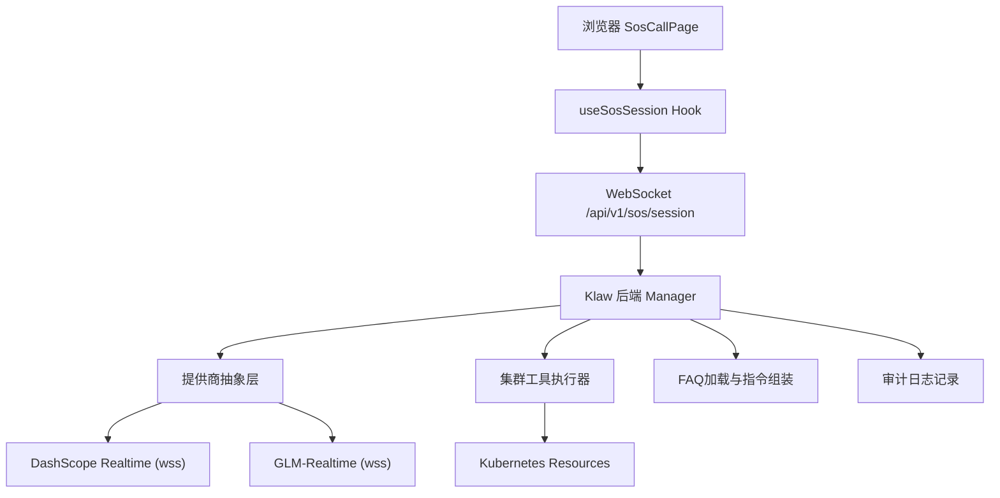
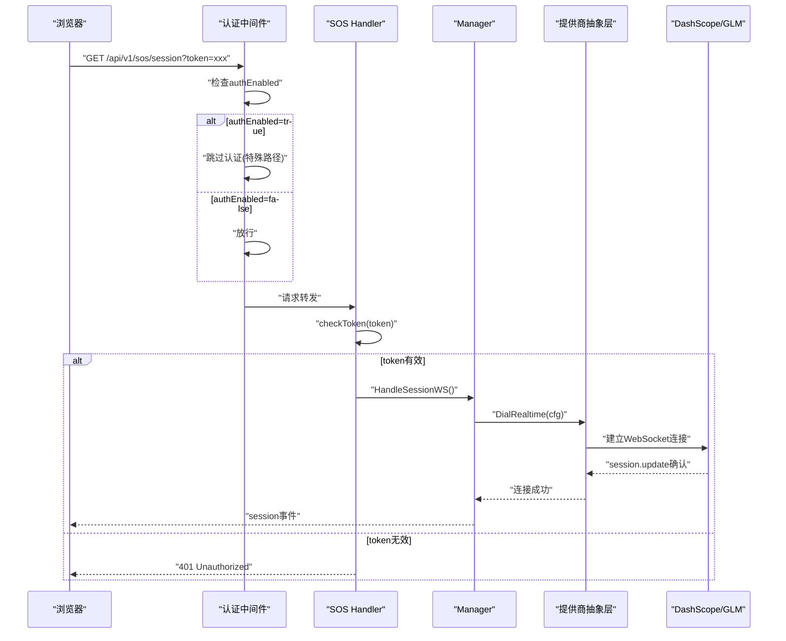
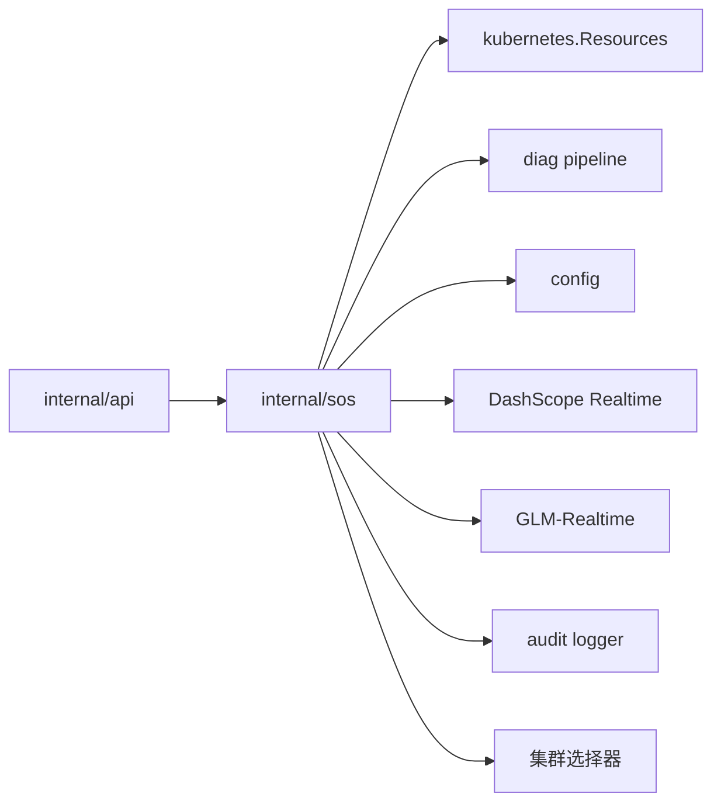

# SOS紧急语音对话模式

<cite>
**本文引用的文件**
- [README.md](file://README.md)
- [2026-08-25-sos-mode-design.md](file://docs/superpowers/specs/2026-08-25-sos-mode-design.md)
- [2026-08-25-sos-mode.md](file://docs/superpowers/plans/2026-08-25-sos-mode.md)
- [dashscope.go](file://internal/sos/dashscope.go)
- [session.go](file://internal/sos/session.go)
- [tools.go](file://internal/sos/tools.go)
- [faq.go](file://internal/sos/faq.go)
- [sos.go](file://internal/api/sos.go)
- [config.go](file://internal/config/config.go)
- [SosCallPage.tsx](file://web/src/pages/SosCallPage.tsx)
- [useSosSession.ts](file://web/src/hooks/useSosSession.ts)
- [sosProtocol.ts](file://web/src/lib/sosProtocol.ts)
- [sosApi.ts](file://web/src/lib/sosApi.ts)
- [sos-faq.yaml](file://configs/sos-faq.yaml)
- [config.yaml.example](file://configs/config.yaml.example)
</cite>

## 更新摘要
**变更内容**
- **多提供商支持**：新增智谱 GLM-Realtime 提供商支持，与现有阿里云 DashScope 提供商并存
- **提供商抽象层**：实现统一的提供商接口，支持动态路由到不同的上游服务
- **配置管理增强**：支持通过 provider 字段切换不同语音服务提供商
- **会话配置适配**：针对不同提供商的 session.update 配置差异进行自动适配
- **测试覆盖扩展**：新增多提供商场景的完整测试覆盖

## 目录
1. [简介](#简介)
2. [项目结构](#项目结构)
3. [核心组件](#核心组件)
4. [架构总览](#架构总览)
5. [详细组件分析](#详细组件分析)
6. [依赖关系分析](#依赖关系分析)
7. [性能与可用性](#性能与可用性)
8. [故障排查指南](#故障排查指南)
9. [结论](#结论)
10. [附录](#附录)

## 简介
Klaw的"SOS紧急语音对话模式"是一个经过全面安全加固和可靠性增强的实时语音应急系统。该系统通过Web控制台提供全屏语音通话入口，现已支持多家AI语音服务提供商，包括阿里云百炼DashScope Qwen-Omni-Realtime和智谱AI GLM-Realtime。最新版本引入了多提供商支持、提供商抽象层、智能路由等关键特性，确保在不同供应商环境下都能获得稳定可靠的语音对话能力，同时满足企业级安全要求。

## 项目结构
SOS相关代码分布在以下关键位置：
- **后端核心**：`internal/sos/` - 多提供商集成、会话管理、工具执行器
- **API层**：`internal/api/sos.go` - HTTP路由和WebSocket升级
- **配置管理**：`internal/config/config.go` - SOS配置结构和环境变量覆盖
- **前端界面**：`web/src/pages/SosCallPage.tsx` - 全屏语音通话页面
- **前端逻辑**：`web/src/hooks/useSosSession.ts` - WebSocket会话管理
- **协议定义**：`web/src/lib/sosProtocol.ts` - 前后端通信协议

**图表来源**
- [SosCallPage.tsx:17-127](file://web/src/pages/SosCallPage.tsx#L17-L127)
- [useSosSession.ts:12-124](file://web/src/hooks/useSosSession.ts#L12-L124)
- [session.go:37-110](file://internal/sos/session.go#L37-L110)
- [dashscope.go:24-70](file://internal/sos/dashscope.go#L24-L70)

**章节来源**
- [README.md:92-134](file://README.md#L92-L134)
- [2026-08-25-sos-mode-design.md:60-78](file://docs/superpowers/specs/2026-08-25-sos-mode-design.md#L60-L78)

## 核心组件
- **多提供商集成模块**：支持DashScope和GLM-Realtime两种语音服务提供商，提供统一的连接建立和事件处理接口
- **提供商抽象层**：实现BuildUpstreamURL、DialRealtime、BuildSessionUpdateFor等统一接口，屏蔽底层提供商差异
- **会话管理器**：维护浏览器WS与上游WS的双向桥接，处理智能打断、重连和超时清理，具备完整的审计日志功能
- **集群工具执行器**：注册5个只读/诊断工具，封装Kubernetes资源查询和诊断流水线调用，支持异步执行和集群选择
- **FAQ语料系统**：加载内嵌或外部FAQ文件，构建系统提示和标准问答语料
- **前端会话Hook**：管理AudioWorklet采集、PCM编解码、播放队列和状态管理，包含toolCall跟踪
- **安全认证模块**：实现Bearer Token和查询参数双重认证，防止认证绕过攻击

**章节来源**
- [dashscope.go:15-198](file://internal/sos/dashscope.go#L15-L198)
- [session.go:37-291](file://internal/sos/session.go#L37-L291)
- [tools.go:14-322](file://internal/sos/tools.go#L14-L322)
- [useSosSession.ts:12-124](file://web/src/hooks/useSosSession.ts#L12-L124)
- [sos.go:25-49](file://internal/api/sos.go#L25-L49)

## 架构总览
SOS采用"浏览器 ↔ Klaw后端 ↔ 多提供商Realtime"的多路复用架构，通过提供商抽象层实现动态路由：

### 通信协议
- **浏览器 ↔ Klaw**：同源WebSocket `/api/v1/sos/session`，复用Bearer Token鉴权中间件，支持查询参数token传递
- **Klaw ↔ 提供商**：根据配置动态选择DashScope或GLM-Realtime WebSocket端点

### 提供商配置
- **DashScope**：`wss://{workspace-id}.{region}.maas.aliyuncs.com/api-ws/v1/realtime?model={model}`
- **GLM-Realtime**：`wss://open.bigmodel.cn/api/paas/v4/realtime?model=glm-realtime`

### 会话配置适配
- **DashScope设置**：voice、turn_detection.type=semantic_vad、audio.input/output格式配置
- **GLM设置**：input_audio_format、output_audio_format、turn_detection.type=server_vad
- **通用配置**：instructions（系统提示+语料）、tools（集群工具schema）

### 智能打断机制
根据不同提供商的VAD类型自动适配：DashScope使用semantic_vad，GLM使用server_vad，均能实现用户开口即中断的功能。

### 安全认证流程

**图表来源**
- [session.go:127-169](file://internal/sos/session.go#L127-L169)
- [dashscope.go:36-70](file://internal/sos/dashscope.go#L36-L70)
- [sos.go:25-49](file://internal/api/sos.go#L25-L49)

## 详细组件分析

### 多提供商支持架构
**职责**：提供统一的提供商抽象层，支持动态路由到不同的语音服务提供商

**关键特性**：
- **提供商枚举**：支持"dashscope"（默认）和"glm"两种提供商
- **URL构建抽象**：BuildUpstreamURL函数根据provider生成对应的WebSocket地址
- **连接建立抽象**：DialRealtime函数统一处理不同提供商的连接建立和认证
- **会话配置适配**：BuildSessionUpdateFor函数为不同提供商生成合适的session.update配置

**实现方式**：
- 配置文件中的`provider`字段指定目标提供商
- 环境变量`KLAW_SOS_DASHSCOPE_API_KEY`和`KLAW_SOS_GLM_API_KEY`分别注入对应密钥
- 提供商归一化处理支持大小写不敏感的配置

**章节来源**
- [dashscope.go:24-70](file://internal/sos/dashscope.go#L24-L70)
- [config.go:163-173](file://internal/config/config.go#L163-L173)

### DashScope提供商实现
**职责**：实现阿里云百炼DashScope Realtime服务的完整集成

**关键特性**：
- **端点构建**：BuildRealtimeURL函数生成百炼专属WebSocket地址
- **语义VAD**：使用semantic_vad实现智能打断
- **音频转写**：支持input_audio_transcription开启用户语音转写
- **音色支持**：支持多种预设音色如"Ethan"

**配置要求**：
- workspace_id：百炼Workspace ID（端点子域名）
- api_key：通过环境变量KLAW_SOS_DASHSCOPE_API_KEY注入
- region：区域配置，默认cn-beijing
- model：模型版本，默认qwen3.5-omni-plus-realtime

**章节来源**
- [dashscope.go:18-22](file://internal/sos/dashscope.go#L18-L22)
- [dashscope.go:94-114](file://internal/sos/dashscope.go#L94-L114)

### GLM-Realtime提供商实现
**职责**：实现智谱AI GLM-Realtime服务的完整集成

**关键特性**：
- **标准端点**：使用固定的wss://open.bigmodel.cn/api/paas/v4/realtime端点
- **服务器VAD**：使用server_vad实现打断机制
- **简化配置**：仅需API Key和Model配置
- **心跳处理**：静默忽略heartbeat事件

**配置要求**：
- api_key：形如{id}.{secret}，通过环境变量KLAW_SOS_GLM_API_KEY注入
- model：模型版本，默认glm-realtime
- voice：可选音色配置

**章节来源**
- [dashscope.go:15-16](file://internal/sos/dashscope.go#L15-L16)
- [dashscope.go:72-92](file://internal/sos/dashscope.go#L72-L92)

### 会话配置动态适配
**职责**：根据目标提供商自动生成合适的会话配置

**关键特性**：
- **DashScope配置**：包含voice、semantic_vad、audio.input/output、input_audio_transcription
- **GLM配置**：包含input_audio_format、output_audio_format、server_vad
- **工具支持**：两种提供商都支持function call工具调用
- **指令系统**：统一的instructions格式

**配置差异处理**：
- DashScope使用audio对象嵌套格式
- GLM使用扁平的input_audio_format和output_audio_format字段
- VAD类型根据提供商自动选择semantic_vad或server_vad

**章节来源**
- [dashscope.go:72-92](file://internal/sos/dashscope.go#L72-L92)
- [dashscope.go:94-114](file://internal/sos/dashscope.go#L94-L114)

### 集群特定工具执行能力
**职责**：支持在多集群环境中精确查询指定集群的资源信息

**关键特性**：
- **会话级集群选择**：通过start指令携带cluster参数选定目标集群
- **工具执行上下文**：所有工具调用自动继承选定的集群上下文
- **默认集群回退**：未指定集群时回退到默认集群
- **线程安全访问**：使用互斥锁保护集群上下文切换

**实现方式**：
- 前端发送`{type: 'start', cluster: 'cluster-name'}`指令
- 后端session结构体维护cluster字段
- ToolExecutor.ExecuteForCluster方法支持集群参数传递

**章节来源**
- [session.go:155](file://internal/sos/session.go#L155)
- [tools.go:93-117](file://internal/sos/tools.go#L93-L117)

### 工具执行超时保护机制
**职责**：防止Kubernetes API调用长时间阻塞导致goroutine泄漏和资源耗尽

**关键特性**：
- **20秒默认超时**：单个工具执行最大耗时限制
- **上下文取消传播**：超时后通过context.Context取消信号中断底层调用
- **goroutine安全退出**：使用缓冲channel确保goroutine正常退出
- **优雅错误处理**：超时错误以JSON格式返回，符合OpenAI协议规范

**实现方式**：
- `toolExecTimeout = 20 * time.Second`包级常量
- ExecuteForCluster方法使用select语句监听ctx.Done()
- 超时返回格式化错误消息，便于前端展示

**章节来源**
- [session.go:25](file://internal/sos/session.go#L25)
- [tools.go:106-117](file://internal/sos/tools.go#L106-L117)

### 增强的错误处理与中文消息
**职责**：提供用户友好的错误信息和清晰的错误分类

**关键特性**：
- **中文错误消息**：所有用户可见的错误信息均使用中文
- **错误分类处理**：区分网络错误、配置错误、权限错误等
- **前端状态映射**：错误状态正确反映到UI组件
- **调试信息保留**：开发环境下保留详细错误堆栈

**错误类型示例**：
- "语音服务连接失败，请检查 SOS 配置与网络"
- "连接已断开，请刷新页面重试"
- "会话长时间无操作，已自动结束"

**章节来源**
- [session.go:126-127](file://internal/sos/session.go#L126-L127)
- [session.go:196-197](file://internal/sos/session.go#L196-L197)
- [session.go:176-177](file://internal/sos/session.go#L176-L177)

### 前端状态管理改进
**职责**：提供实时的工具执行状态反馈和用户交互体验

**关键特性**：
- **toolCall跟踪**：实时显示当前正在执行的集群工具名称
- **状态同步机制**：后端tool_call事件触发前端状态更新
- **UI反馈组件**：工具执行时显示加载动画和工具名称
- **状态清理机制**：response.done事件清除toolCall状态

**实现细节**：
- `SosSessionState.toolCall`字段跟踪当前工具
- `reduceEvent`函数处理tool_call事件类型
- SosCallPage组件显示工具执行状态

**章节来源**
- [sosProtocol.ts:19](file://web/src/lib/sosProtocol.ts#L19)
- [sosProtocol.ts:83-84](file://web/src/lib/sosProtocol.ts#L83-L84)
- [SosCallPage.tsx:80-86](file://web/src/pages/SosCallPage.tsx#L80-L86)

### 审计日志安全增强
**职责**：确保审计日志系统的稳定性和安全性

**关键特性**：
- **Panic恢复机制**：审计回调异常不会导致会话崩溃
- **元数据隔离**：仅记录操作元数据，不包含敏感音频内容
- **线程安全设计**：并发安全的审计日志写入
- **可选回调注入**：审计功能可插拔，不影响核心功能

**安全设计**：
- `audit`方法使用defer recover捕获panic
- 审计回调函数签名限制为纯函数式接口
- 审计事件类型明确定义，便于后续扩展

**章节来源**
- [session.go:72-83](file://internal/sos/session.go#L72-L83)
- [session.go:325-326](file://internal/sos/session.go#L325-L326)
- [session.go:356-357](file://internal/sos/session.go#L356-L357)

### 异步工具执行架构
**职责**：确保工具执行不会阻塞WebSocket主循环

**关键特性**：
- **协程隔离**：每个工具调用在独立goroutine中执行
- **结果通道**：使用channel收集工具执行结果
- **超时控制**：结合context.Context实现超时保护
- **错误传播**：工具错误以JSON格式返回，符合协议规范

**执行流程**：
1. 接收工具调用请求
2. 启动后台goroutine执行工具
3. 发送tool_call事件通知前端
4. 等待工具执行完成或超时
5. 返回结果并触发模型继续作答

**章节来源**
- [session.go:316-344](file://internal/sos/session.go#L316-L344)
- [tools.go:106-117](file://internal/sos/tools.go#L106-L117)

### OpenAI Realtime协议合规
**职责**：确保与OpenAI Realtime Protocol的完全兼容性

**协议实现**：
- 会话配置：`session.update`包含voice、instructions、tools、turn_detection、audio配置
- 音频传输：`input_audio_buffer.append`上行，`response.audio.delta`下行
- 工具调用：`response.function_call_arguments.done`接收，`conversation.item.create(function_call_output)`回传
- 会话控制：`response.create`触发模型继续作答

**兼容性保证**：
- 严格遵循OpenAI Realtime消息格式
- 支持语义VAD打断机制
- 完整的错误处理和事件转换

**章节来源**
- [dashscope.go:36-76](file://internal/sos/dashscope.go#L36-L76)
- [dashscope.go:100-140](file://internal/sos/dashscope.go#L100-L140)

### 测试覆盖增强
**职责**：提供全面的测试覆盖，确保功能正确性和稳定性

**测试范围**：
- **会话桥接测试**：验证双向数据传输和事件转发
- **工具调用测试**：测试成功和失败路径，确保JSON格式正确
- **重连机制测试**：验证上游断线后的自动重连
- **空闲超时测试**：验证会话空闲超时机制
- **审计回调测试**：验证审计日志的正确记录和panic恢复
- **认证测试**：验证Bearer Token和查询参数的双重认证
- **超时保护测试**：验证工具执行超时机制
- **多提供商测试**：验证DashScope和GLM-Realtime的完整功能

**测试特点**：
- 使用mock上游服务模拟DashScope行为
- 可注入的依赖便于单元测试
- 完整的错误路径覆盖
- 并发安全性验证
- 多提供商场景覆盖

**章节来源**
- [session_test.go:132-201](file://internal/sos/session_test.go#L132-L201)
- [session_test.go:217-266](file://internal/sos/session_test.go#L217-L266)
- [session_test.go:268-340](file://internal/sos/session_test.go#L268-L340)
- [session_test.go:495-567](file://internal/sos/session_test.go#L495-L567)
- [session_test.go:703-752](file://internal/sos/session_test.go#L703-L752)
- [sos_test.go:51-78](file://internal/api/sos_test.go#L51-L78)
- [dashscope_test.go:125-180](file://internal/sos/dashscope_test.go#L125-L180)

## 依赖关系分析
**模块依赖方向**：
- `api` → `sos` → `kubernetes.Manager` / `diag pipeline` / `config`
- 单向依赖，不反向引用api包，保持松耦合

**外部依赖**：
- DashScope Realtime（OpenAI Realtime兼容协议）
- GLM-Realtime（OpenAI Realtime兼容协议）
- Kubernetes client-go（通过Resources接口）
- SQLite（平台持久化能力）

**潜在风险**：
- 上游服务不可用导致会话中断
- 工具执行耗时需超时保护，避免阻塞会话
- 多集群环境下的资源竞争和一致性
- 多提供商配置复杂性增加

**图表来源**
- [2026-08-25-sos-mode-design.md:88-99](file://docs/superpowers/specs/2026-08-25-sos-mode-design.md#L88-L99)

**章节来源**
- [2026-08-25-sos-mode-design.md:88-99](file://docs/superpowers/specs/2026-08-25-sos-mode-design.md#L88-L99)

## 性能与可用性
**延迟特性**：
- 全双工实时对话，端到端响应延迟<1.8秒（设计目标）
- 语义打断降低交互等待时间
- 异步工具执行避免阻塞主循环
- 20秒工具超时保护防止长时间阻塞

**吞吐与资源**：
- 工具执行限制返回大小（日志截断、事件摘要上限）
- 避免大对象影响网络与内存
- 连接池和goroutine管理优化
- 超时保护防止goroutine泄漏

**可用性保障**：
- 未启用sos时零开销
- 上游断线自动重连一次
- 空闲超时释放资源
- 错误事件清晰上报
- 优雅关闭防止资源泄漏
- 集群选择支持多集群环境
- 多提供商冗余支持

**可观测性**：
- 复用平台metrics与审计
- 仅记录会话元数据与工具调用，不含音频与转写内容
- 完整的审计日志支持
- Panic恢复确保系统稳定性

## 故障排查指南
**配置问题**：
- **现象**：`/api/v1/sos/status`返回ready=false；通话页展示配置引导
- **处理**：检查`sos.enabled`和`sos.provider`配置，确认对应提供商的API Key已正确配置

**认证问题**：
- **现象**：401 Unauthorized错误
- **处理**：检查token参数或Authorization头部是否正确传递

**连接问题**：
- **现象**：会话中断，前端提示"服务中断，请重试"
- **处理**：后端自动重连一次；若仍失败，检查网络与密钥有效性

**浏览器问题**：
- **现象**：会话结束，资源释放
- **处理**：检查浏览器权限与安全上下文（HTTPS/localhost），重新进入通话页

**工具执行问题**：
- **现象**：模型口头告知错误；`run_diagnosis`超30秒返回"诊断超时"
- **处理**：检查集群连通性与诊断流水线状态

**麦克风问题**：
- **现象**：无法建连，显示引导文案
- **处理**：授予麦克风权限，确保安全上下文

**审计日志问题**：
- **现象**：审计日志缺失
- **处理**：检查审计回调是否正确注入，确认日志存储配置

**集群选择问题**：
- **现象**：工具调用返回空结果或错误集群数据
- **处理**：确认start指令中的cluster参数是否正确传递

**工具超时问题**：
- **现象**：工具调用长时间无响应后报错
- **处理**：检查Kubernetes API响应时间，考虑调整超时配置

**提供商切换问题**：
- **现象**：切换到新提供商后连接失败
- **处理**：检查对应提供商的API Key配置和网络连通性

**章节来源**
- [2026-08-25-sos-mode-design.md:172-181](file://docs/superpowers/specs/2026-08-25-sos-mode-design.md#L172-L181)

## 结论
SOS紧急语音对话模式经过全面的安全加固和可靠性增强，现已支持多家AI语音服务提供商，为Klaw提供了灵活的企业级实时语音应急解决方案。新版本引入的多提供商支持、提供商抽象层、智能路由等关键特性，既满足了即时问答的业务需求，又符合企业级安全合规要求。系统具备完善的测试覆盖，确保在生产环境中的稳定运行。

## 附录
**API端点**：
- `GET /api/v1/sos/status`：返回{enabled, ready, model, voice, faq_count}
- `GET /api/v1/sos/session`：WebSocket Upgrade，支持Bearer Token和查询参数token鉴权

**配置示例**：
- `sos.enabled`：启用开关
- `sos.provider`：提供商选择（dashscope | glm）
- `dashscope.api_key/workspace_id/region/model/voice`：DashScope配置
- `glm.api_key/model/voice`：GLM-Realtime配置
- `faq_file`：外部FAQ文件路径
- `instructions_prefix`：自定义系统提示前缀

**安全配置**：
- `authEnabled`：是否启用认证中间件
- `authToken`：认证令牌
- CORS白名单配置

**测试要点**：
- FAQ加载（embed/外部覆盖/错误路径）
- 工具执行（schema/错误/截断）
- 会话桥接（事件翻译/重连/超时）
- 认证流程（Bearer Token/查询参数）
- 审计日志（会话开始/工具调用/会话结束）
- 集群选择（start指令/上下文传递）
- 超时保护（工具执行/上下文取消）
- Panic恢复（审计回调异常处理）
- 多提供商支持（DashScope/GLM-Realtime切换）

**章节来源**
- [2026-08-25-sos-mode-design.md:119-141](file://docs/superpowers/specs/2026-08-25-sos-mode-design.md#L119-L141)
- [config.yaml.example:37-53](file://configs/config.yaml.example#L37-L53)
- [2026-08-25-sos-mode.md:189-203](file://docs/superpowers/plans/2026-08-25-sos-mode.md#L189-L203)