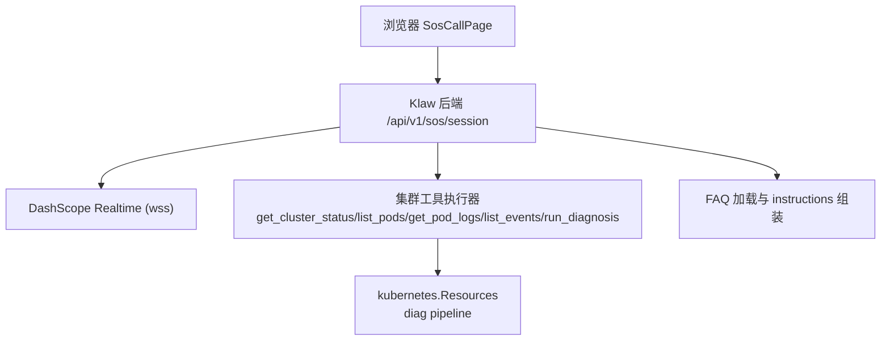
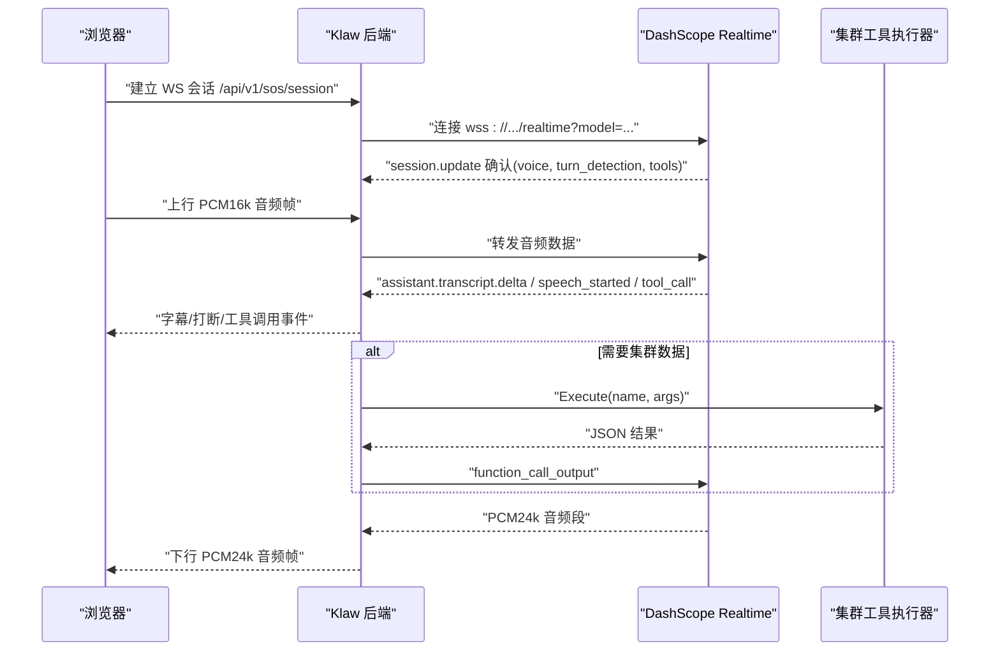
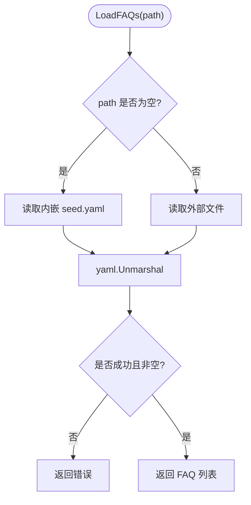
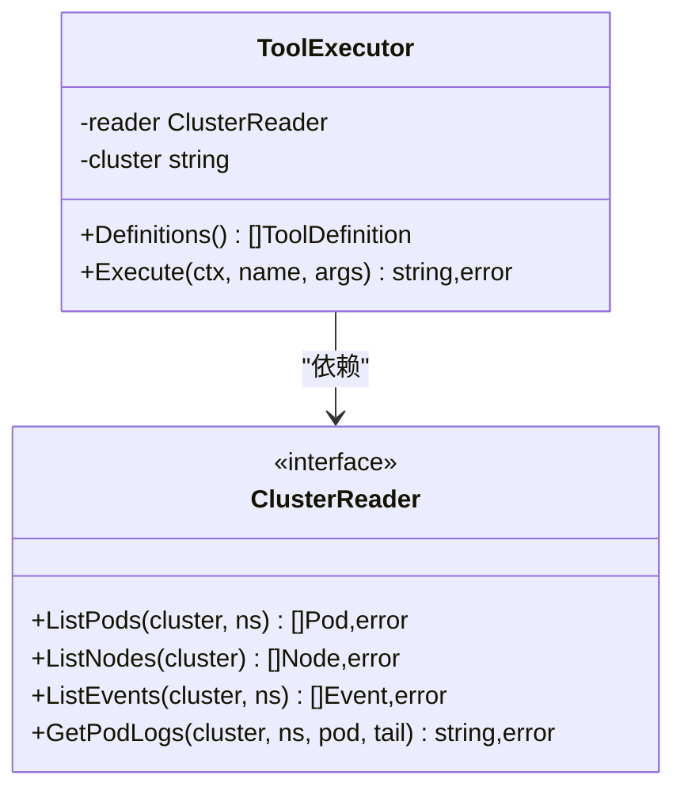
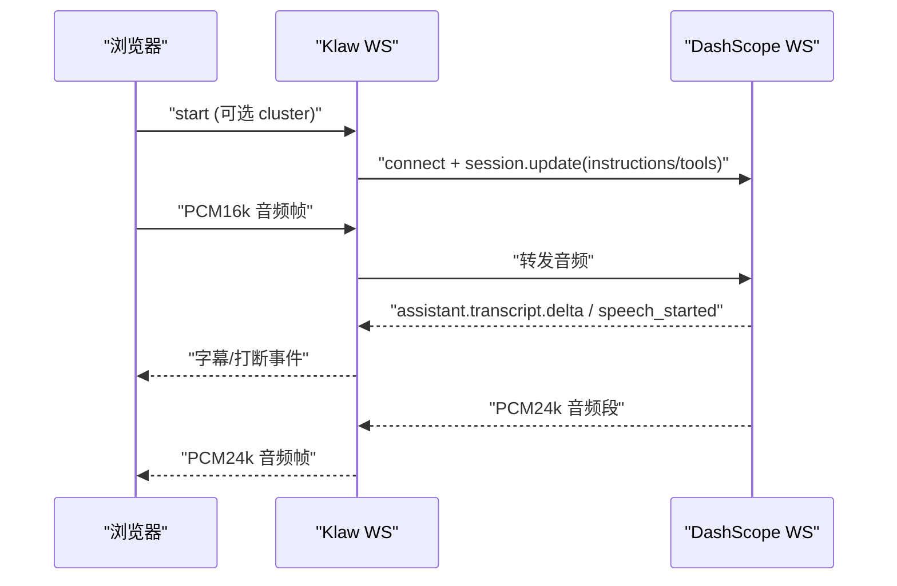
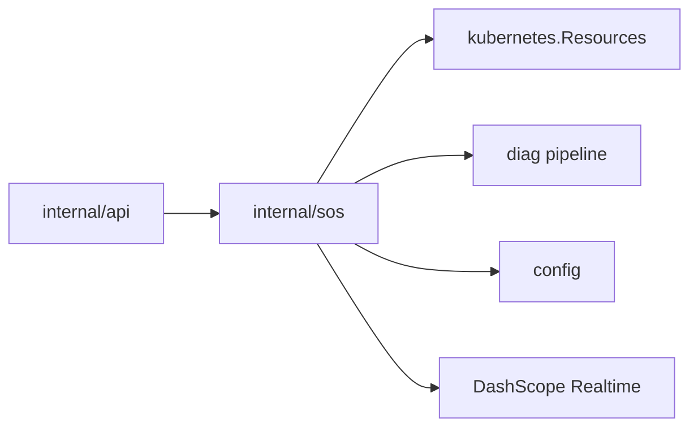

# SOS紧急语音对话模式

<cite>
**本文引用的文件**
- [README.md](file://README.md)
- [2026-08-25-sos-mode-design.md](file://docs/superpowers/specs/2026-08-25-sos-mode-design.md)
- [2026-08-25-sos-mode.md](file://docs/superpowers/plans/2026-08-25-sos-mode.md)
- [faq.go](file://internal/sos/faq.go)
- [faq_test.go](file://internal/sos/faq_test.go)
- [sos-faq.yaml](file://configs/sos-faq.yaml)
- [config.yaml.example](file://configs/config.yaml.example)
</cite>

## 目录
1. [简介](#简介)
2. [项目结构](#项目结构)
3. [核心组件](#核心组件)
4. [架构总览](#架构总览)
5. [详细组件分析](#详细组件分析)
6. [依赖关系分析](#依赖关系分析)
7. [性能与可用性](#性能与可用性)
8. [故障排查指南](#故障排查指南)
9. [结论](#结论)
10. [附录](#附录)

## 简介
本文件聚焦 Klaw 的“SOS 紧急语音对话模式”，即通过 Web 控制台提供全屏语音通话入口，与阿里云百炼 DashScope Qwen-Omni-Realtime 实时全双工语音模型进行低延迟对话。其核心目标是：在事故现场快速获得答案——既能秒答产品与运维常识类问题，也能实时查询集群真实状态并触发应急诊断。回答遵循三层兜底策略：预置语料 → 集群工具（function calling）→ 模型通用知识。密钥与集群访问全部收敛在后端，浏览器不接触 DashScope API Key。

## 项目结构
SOS 相关代码与配置主要分布在以下位置：
- internal/sos：SOS 后端模块（FAQ 加载、instructions 组装等）
- configs/sos-faq.yaml：外部可覆盖的 FAQ 语料文件
- docs/superpowers/specs/2026-08-25-sos-mode-design.md：SOS 设计规格
- docs/superpowers/plans/2026-08-25-sos-mode.md：实施计划（含任务分解、接口约束、测试计划）
- configs/config.yaml.example：示例配置（包含 sos 段）
- README.md：项目整体说明（含架构、API、ChatOps、部署等）

图表来源
- [2026-08-25-sos-mode-design.md:60-78](file://docs/superpowers/specs/2026-08-25-sos-mode-design.md#L60-L78)
- [2026-08-25-sos-mode.md:19-27](file://docs/superpowers/plans/2026-08-25-sos-mode.md#L19-L27)

章节来源
- [README.md:92-134](file://README.md#L92-L134)
- [2026-08-25-sos-mode-design.md:60-78](file://docs/superpowers/specs/2026-08-25-sos-mode-design.md#L60-L78)

## 核心组件
- FAQ 语料与指令注入
  - 内嵌种子语料 + 可选外部覆盖；构建系统提示与标准问答语料片段，注入到 Realtime 会话的 instructions 中，实现第 1 层兜底。
- 集群工具执行器
  - 定义 5 个只读/诊断工具，封装对 Kubernetes 资源与诊断流水线的调用，返回 JSON 结果给模型，实现第 2 层兜底。
- 会话桥接与事件翻译
  - 将浏览器 WS 帧与 DashScope Realtime 事件相互转换，处理音频 PCM 编码、智能打断、错误与超时等。
- 配置与环境变量
  - 新增 sos 配置段，支持环境变量覆盖（如 KLAW_SOS_DASHSCOPE_API_KEY），默认关闭以零开销接入。

章节来源
- [faq.go:1-69](file://internal/sos/faq.go#L1-L69)
- [2026-08-25-sos-mode-design.md:100-118](file://docs/superpowers/specs/2026-08-25-sos-mode-design.md#L100-L118)
- [2026-08-25-sos-mode.md:31-188](file://docs/superpowers/plans/2026-08-25-sos-mode.md#L31-L188)

## 架构总览
SOS 采用“浏览器 ↔ Klaw 后端 ↔ DashScope Realtime”的双 WebSocket 链路：
- 链路 1（浏览器 ↔ Klaw）：同源 WebSocket /api/v1/sos/session，复用现有 Bearer Token 鉴权中间件；文本帧用于控制与事件，二进制帧用于 PCM 音频。
- 链路 2（Klaw ↔ DashScope）：wss://{workspace-id}.{region}.maas.aliyuncs.com/api-ws/v1/realtime?model={model}，Authorization: Bearer {DASHSCOPE_API_KEY}。
- 会话配置：voice、turn_detection.type=semantic_vad、输入 pcm/16000、输出 pcm/24000、instructions（系统提示+语料）、tools（集群工具 schema）。
- 智能打断：服务端 semantic_vad 检测到用户开口即下发 input_audio_buffer.speech_started，后端转发给浏览器，立即停播本地音频队列并清空缓冲。

图表来源
- [2026-08-25-sos-mode-design.md:60-78](file://docs/superpowers/specs/2026-08-25-sos-mode-design.md#L60-L78)
- [2026-08-25-sos-mode-design.md:112-118](file://docs/superpowers/specs/2026-08-25-sos-mode-design.md#L112-L118)

## 详细组件分析

### FAQ 语料与指令注入
- 职责
  - 加载 FAQ 语料（内嵌种子或外部文件），校验非空，拼装 system instructions 片段，注入到 Realtime 会话。
- 数据结构
  - FAQEntry：id、question、answer、tags。
  - faqFile：faqs 数组。
- 关键行为
  - LoadFAQs(path)：path 为空使用内嵌 seed.yaml，否则读取外部文件；解析失败或无条目时报错。
  - BuildInstructions(prefix, faqs)：拼接默认系统提示前缀、可选自定义前缀与标准问答语料，形成最终 instructions。
- 复杂度
  - 加载与解析为 O(N)（N 为 FAQ 条目数），字符串构建为 O(L)（L 为总字符长度）。
- 错误处理
  - 文件读取失败、YAML 解析失败、空语料均返回错误，便于上层统一处理。

图表来源
- [faq.go:28-46](file://internal/sos/faq.go#L28-L46)

章节来源
- [faq.go:1-69](file://internal/sos/faq.go#L1-L69)
- [faq_test.go:1-58](file://internal/sos/faq_test.go#L1-L58)
- [sos-faq.yaml:1-9](file://configs/sos-faq.yaml#L1-L9)

### 集群工具执行器（第 2 层兜底）
- 职责
  - 注册 5 个只读/诊断工具，定义 OpenAI Realtime 兼容的 function schema，并在后端进程内执行，返回 JSON 结果。
- 工具清单
  - get_cluster_status：节点/Pod 统计、异常计数、最近 Warning 事件摘要。
  - list_pods：列出 Pod，默认仅异常（Pending/CrashLoopBackOff/OOMKilled 等），支持 namespace/status 过滤。
  - get_pod_logs：获取指定 Pod 最近日志，tail_lines 默认 100，上限 500，结果截断防大包。
  - list_events：最近 Warning/Error 事件列表，支持 namespace 过滤。
  - run_diagnosis：触发诊断流水线，同步等待（上限 30s），返回问题摘要与修复建议。
- 关键行为
  - Definitions()：返回工具 schema 列表。
  - Execute(ctx, name, args)：根据名称路由到具体实现，参数解码与校验，错误包装返回。
- 复杂度
  - 各工具多为 I/O 密集（K8s API 调用），CPU 计算较少；日志与事件摘要有固定上限，避免大对象。
- 错误处理
  - 未知工具名直接报错；K8s 调用失败包装错误；日志截断与事件摘要限制防止响应过大。

图表来源
- [2026-08-25-sos-mode.md:373-515](file://docs/superpowers/plans/2026-08-25-sos-mode.md#L373-L515)

章节来源
- [2026-08-25-sos-mode.md:373-515](file://docs/superpowers/plans/2026-08-25-sos-mode.md#L373-L515)

### 会话桥接与事件翻译
- 职责
  - 维护浏览器 WS 与 DashScope WS 的生命周期，翻译事件与音频帧，处理智能打断、重连与超时清理。
- 帧协议
  - 文本帧：start/mute/unmute/end；session/error 及事件转发（user.transcript.delta、assistant.transcript.delta、tool_call、speech_started 等）。
  - 二进制帧：上行 PCM16k 单声道裸数据；下行 PCM24k 音频段。
- 关键行为
  - session.update：voice、turn_detection.type=semantic_vad、instructions、tools。
  - 智能打断：收到 input_audio_buffer.speech_started 时，前端停播并清空缓冲。
  - 错误与超时：DashScope 建连失败/断开自动重连一次；空闲超时结束会话释放资源。
- 复杂度
  - 事件翻译为 O(1) 每帧；重连与超时管理为后台协程，不影响主流程。

图表来源
- [2026-08-25-sos-mode-design.md:112-118](file://docs/superpowers/specs/2026-08-25-sos-mode-design.md#L112-L118)

章节来源
- [2026-08-25-sos-mode-design.md:112-118](file://docs/superpowers/specs/2026-08-25-sos-mode-design.md#L112-L118)

### 配置与环境变量
- 新增 sos 配置段，默认关闭，未启用时对现有功能零行为变化。
- 环境变量优先覆盖：KLAW_SOS_DASHSCOPE_API_KEY 优先于 YAML 中的 api_key。
- 默认值：region=cn-beijing、model=qwen3.5-omni-plus-realtime、voice=Ethan。
- 外部 FAQ 文件：faq_file 为空时使用内嵌种子，否则读取指定路径。

章节来源
- [config.yaml.example:37-48](file://configs/config.yaml.example#L37-L48)
- [2026-08-25-sos-mode.md:31-188](file://docs/superpowers/plans/2026-08-25-sos-mode.md#L31-L188)

## 依赖关系分析
- 模块依赖方向
  - api → sos → kubernetes.Manager / diag pipeline / config
  - 单向依赖，不反向引用 api 包，保持松耦合。
- 外部依赖
  - DashScope Realtime（OpenAI Realtime 兼容协议）
  - Kubernetes client-go（通过 Resources 接口）
  - SQLite（持久化，与 SOS 无关但属于平台能力）
- 潜在风险
  - 上游 DashScope 服务不可用导致会话中断；已设计一次重连与错误事件上报。
  - 工具执行耗时（run_diagnosis 上限 30s）需超时保护，避免阻塞会话。

图表来源
- [2026-08-25-sos-mode-design.md:88-99](file://docs/superpowers/specs/2026-08-25-sos-mode-design.md#L88-L99)

章节来源
- [2026-08-25-sos-mode-design.md:88-99](file://docs/superpowers/specs/2026-08-25-sos-mode-design.md#L88-L99)

## 性能与可用性
- 延迟特性
  - 全双工实时对话，端到端响应延迟 < 1.8s（设计目标），语义打断降低交互等待。
- 吞吐与资源
  - 工具执行限制返回大小（日志截断、事件摘要上限），避免大对象影响网络与内存。
- 可用性保障
  - 未启用 sos 时零开销；DashScope 断线自动重连一次；空闲超时释放资源；错误事件清晰上报。
- 可观测性
  - 复用平台 metrics 与审计（仅记录会话元数据与工具调用，不含音频与转写内容）。

[本节为一般性指导，无需特定文件来源]

## 故障排查指南
- 未配置/无效 DashScope Key
  - 现象：/api/v1/sos/status 返回 ready=false；通话页展示配置引导。
  - 处理：检查 sos.dashscope.* 配置项与环境变量 KLAW_SOS_DASHSCOPE_API_KEY。
- DashScope 建连失败/中途断开
  - 现象：会话中断，前端提示“服务中断，请重试”。
  - 处理：后端自动重连一次；若仍失败，检查网络与密钥有效性。
- 浏览器 WS 断开
  - 现象：会话结束，资源释放。
  - 处理：检查浏览器权限与安全上下文（HTTPS/localhost），重新进入通话页。
- 工具执行失败/超时
  - 现象：模型口头告知错误；run_diagnosis 超 30s 返回“诊断超时，建议到诊断页查看”。
  - 处理：检查集群连通性与诊断流水线状态。
- 麦克风不可用
  - 现象：无法建连，显示引导文案。
  - 处理：授予麦克风权限，确保安全上下文。

章节来源
- [2026-08-25-sos-mode-design.md:172-181](file://docs/superpowers/specs/2026-08-25-sos-mode-design.md#L172-L181)

## 结论
SOS 紧急语音对话模式为 Klaw 提供了面向事故现场的快速语音入口，通过三层兜底策略确保回答准确与可靠。后端集中管理密钥与集群访问，前端专注交互体验；结合语义打断与只读/诊断工具，既满足即时问答又避免误操作。设计上兼顾低延迟、高可用与安全合规，具备在生产环境落地的基础。

[本节为总结性内容，无需特定文件来源]

## 附录
- API 端点
  - GET /api/v1/sos/status：{enabled, ready, model, voice, faq_count}
  - GET /api/v1/sos/session：WebSocket Upgrade，复用 Bearer Token 鉴权
- 配置示例
  - sos.enabled、dashscope.api_key/workspace_id/region/model/voice、faq_file、instructions_prefix
- 测试要点
  - FAQ 加载（embed/外部覆盖/错误路径）、工具执行（schema/错误/截断）、会话桥接（事件翻译/重连/超时）

章节来源
- [2026-08-25-sos-mode-design.md:119-141](file://docs/superpowers/specs/2026-08-25-sos-mode-design.md#L119-L141)
- [config.yaml.example:37-48](file://configs/config.yaml.example#L37-L48)
- [2026-08-25-sos-mode.md:189-203](file://docs/superpowers/plans/2026-08-25-sos-mode.md#L189-L203)