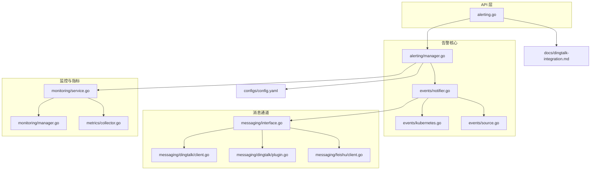
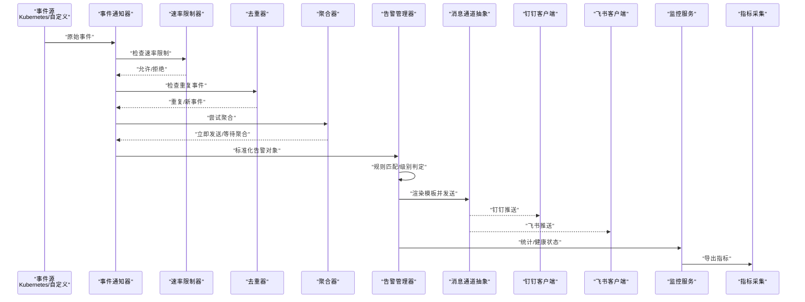
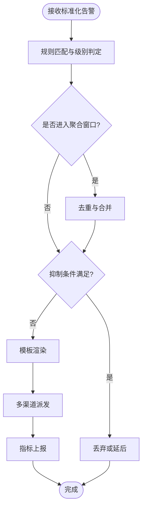
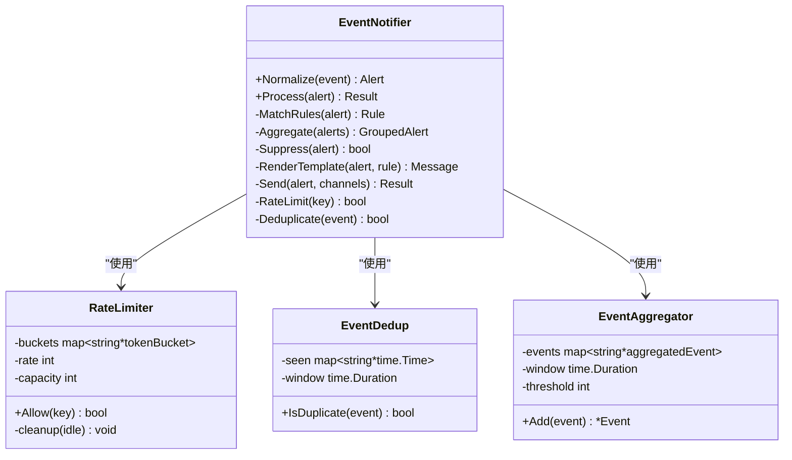
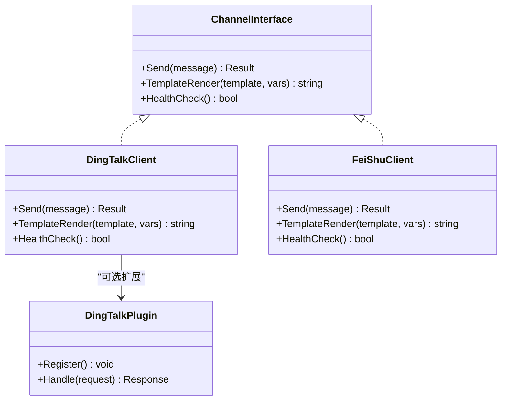
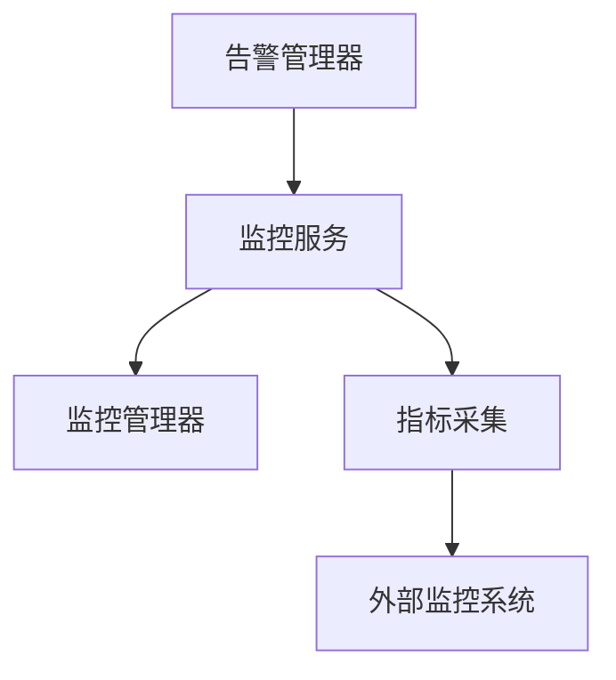
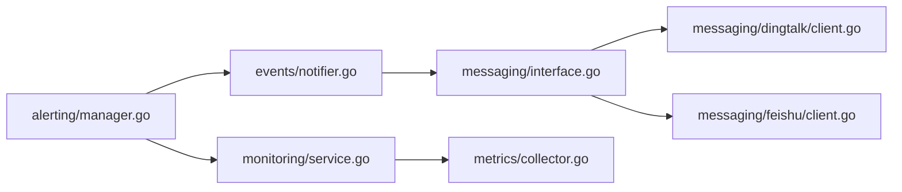

# 告警管理通知

<cite>
**本文引用的文件**   
- [internal/alerting/manager.go](file://internal/alerting/manager.go)
- [internal/api/alerting.go](file://internal/api/alerting.go)
- [internal/messaging/interface.go](file://internal/messaging/interface.go)
- [internal/messaging/dingtalk/client.go](file://internal/messaging/dingtalk/client.go)
- [internal/messaging/dingtalk/plugin.go](file://internal/messaging/dingtalk/plugin.go)
- [internal/messaging/feishu/client.go](file://internal/messaging/feishu/client.go)
- [internal/events/notifier.go](file://internal/events/notifier.go)
- [internal/events/kubernetes.go](file://internal/events/kubernetes.go)
- [internal/events/source.go](file://internal/events/source.go)
- [internal/monitoring/service.go](file://internal/monitoring/service.go)
- [internal/monitoring/manager.go](file://internal/monitoring/manager.go)
- [internal/metrics/collector.go](file://internal/metrics/collector.go)
- [configs/config.yaml](file://configs/config.yaml)
- [configs/config.yaml.example](file://configs/config.yaml.example)
- [docs/dingtalk-integration.md](file://docs/dingtalk-integration.md)
</cite>

## 更新摘要
**所做更改**
- 增强了事件通知系统，新增速率限制、去重和聚合功能
- 添加了可配置的速率限制器（默认10个事件/秒）
- 实现了事件去重窗口机制，防止重复通知
- 引入了智能聚合阈值，避免通知风暴
- 更新了配置结构和通知流程

## 目录
1. [简介](#简介)
2. [项目结构](#项目结构)
3. [核心组件](#核心组件)
4. [架构总览](#架构总览)
5. [详细组件分析](#详细组件分析)
6. [依赖关系分析](#依赖关系分析)
7. [性能考虑](#性能考虑)
8. [故障排查指南](#故障排查指南)
9. [结论](#结论)
10. [附录](#附录)

## 简介
本文件面向 Klaw 的告警管理通知能力，系统性阐述告警规则引擎、智能聚合机制与多通道通知能力。内容覆盖：
- 告警级别定义与抑制策略
- 钉钉、飞书等消息平台集成方式
- 通知模板定制与渠道管理
- 告警规则配置、历史查询与监控指标对接
- 典型告警规则示例、渠道配置与优化建议

**最新更新**：系统现已支持增强的事件通知处理能力，包括速率限制、事件去重和智能聚合，有效防止通知风暴同时确保关键告警及时送达。

## 项目结构
与告警通知相关的代码主要分布在以下模块：
- internal/alerting：告警管理器与生命周期控制
- internal/api：对外暴露的告警相关 API（路由与处理器）
- internal/messaging：统一的消息发送接口及具体渠道实现（钉钉、飞书）
- internal/events：事件源接入与事件到告警的转换、分发，包含增强的通知处理逻辑
- internal/monitoring：监控服务与管理器
- internal/metrics：指标采集
- configs：运行时配置（含渠道与告警相关参数）
- docs：集成文档（如钉钉集成说明）

**图表来源**
- [internal/api/alerting.go](file://internal/api/alerting.go)
- [internal/alerting/manager.go](file://internal/alerting/manager.go)
- [internal/events/notifier.go](file://internal/events/notifier.go)
- [internal/events/kubernetes.go](file://internal/events/kubernetes.go)
- [internal/events/source.go](file://internal/events/source.go)
- [internal/messaging/interface.go](file://internal/messaging/interface.go)
- [internal/messaging/dingtalk/client.go](file://internal/messaging/dingtalk/client.go)
- [internal/messaging/dingtalk/plugin.go](file://internal/messaging/dingtalk/plugin.go)
- [internal/messaging/feishu/client.go](file://internal/messaging/feishu/client.go)
- [internal/monitoring/service.go](file://internal/monitoring/service.go)
- [internal/monitoring/manager.go](file://internal/monitoring/manager.go)
- [internal/metrics/collector.go](file://internal/metrics/collector.go)
- [configs/config.yaml](file://configs/config.yaml)
- [docs/dingtalk-integration.md](file://docs/dingtalk-integration.md)

## 核心组件
- 告警管理器（Alerting Manager）
  - 职责：加载与运行告警规则、触发告警事件、协调聚合与抑制、调度通知发送、对接监控与指标。
  - 关键行为：规则注册与热更新、事件入队与消费、聚合窗口与去重、抑制策略评估、多渠道派发。
- **增强的事件通知器（Event Notifier）**
  - 职责：将内部事件转换为标准告警对象，执行聚合与抑制，调用消息通道发送。
  - **新功能**：内置速率限制器、事件去重窗口、智能聚合机制。
  - 关键行为：事件标准化、时间窗口聚合、重复告警合并、抑制条件判断、通道选择与重试。
- 消息通道抽象与实现
  - 抽象：统一的 Send/TemplateRender/HealthCheck 接口。
  - 实现：钉钉（Webhook/插件）、飞书（Webhook）。
- 监控与指标
  - 监控服务：暴露健康检查、统计计数、延迟与失败率。
  - 指标采集：Prometheus 风格指标导出，便于外部监控系统抓取。

**章节来源**
- [internal/alerting/manager.go](file://internal/alerting/manager.go)
- [internal/events/notifier.go](file://internal/events/notifier.go)
- [internal/messaging/interface.go](file://internal/messaging/interface.go)
- [internal/messaging/dingtalk/client.go](file://internal/messaging/dingtalk/client.go)
- [internal/messaging/dingtalk/plugin.go](file://internal/messaging/dingtalk/plugin.go)
- [internal/messaging/feishu/client.go](file://internal/messaging/feishu/client.go)
- [internal/monitoring/service.go](file://internal/monitoring/service.go)
- [internal/metrics/collector.go](file://internal/metrics/collector.go)

## 架构总览
整体流程：事件源产生事件 → 事件标准化为告警 → **速率限制与去重** → **智能聚合** → 规则匹配与级别判定 → 抑制 → 模板渲染 → 多渠道发送 → 指标上报与审计。

**图表来源**
- [internal/events/notifier.go](file://internal/events/notifier.go)
- [internal/alerting/manager.go](file://internal/alerting/manager.go)
- [internal/messaging/interface.go](file://internal/messaging/interface.go)
- [internal/messaging/dingtalk/client.go](file://internal/messaging/dingtalk/client.go)
- [internal/messaging/feishu/client.go](file://internal/messaging/feishu/client.go)
- [internal/monitoring/service.go](file://internal/monitoring/service.go)
- [internal/metrics/collector.go](file://internal/metrics/collector.go)

## 详细组件分析

### 告警管理器（Alerting Manager）
- 功能要点
  - 规则加载与校验：支持动态加载、版本化与回滚。
  - 事件处理流水线：标准化 → 匹配 → 级别 → 聚合 → 抑制 → 派发。
  - 聚合策略：基于维度（如命名空间、资源类型、标签）的时间窗口聚合与去重。
  - 抑制策略：基于规则优先级、静默期、依赖关系的抑制。
  - 通知派发：按渠道能力选择最优通道，支持并发与限流。
  - 监控集成：记录成功率、失败率、延迟分位、队列长度等。
- 关键数据结构
  - 告警对象：包含来源、级别、摘要、详情、维度键值、时间戳、关联 ID。
  - 规则对象：包含匹配表达式、动作、级别映射、抑制条件、聚合窗口。
  - 通道配置：包含认证信息、超时、重试策略、模板变量。
- 错误处理
  - 网络异常：指数退避重试与熔断降级。
  - 模板渲染失败：回退默认模板并记录审计日志。
  - 规则解析错误：隔离坏规则并告警管理员。

**图表来源**
- [internal/alerting/manager.go](file://internal/alerting/manager.go)
- [internal/events/notifier.go](file://internal/events/notifier.go)

**章节来源**
- [internal/alerting/manager.go](file://internal/alerting/manager.go)
- [internal/events/notifier.go](file://internal/events/notifier.go)

### 增强的事件通知器（Event Notifier）
- **新功能特性**
  - **速率限制器**：基于令牌桶算法，按集群/资源类型/原因维度进行限速，默认10个事件/秒。
  - **事件去重**：在指定时间窗口内对相同事件进行去重，防止重复通知。
  - **智能聚合**：在时间窗口内将同类事件聚合为一条通知，达到阈值后发送聚合消息。
  - **首条透传**：确保严重问题不被延迟，首条事件立即发送。
- 功能要点
  - 事件标准化：将 Kubernetes 事件或其他来源事件转换为统一告警模型。
  - 管道编排：顺序执行标准化、匹配、聚合、抑制、渲染、发送。
  - 可观测性：埋点关键阶段耗时与错误码。
- 关键行为
  - 事件源适配：Kubernetes 事件监听与过滤。
  - 上下文传递：租户、命名空间、集群等元数据贯穿全链路。
  - 幂等保障：基于关联 ID 的去重与重试安全。

**图表来源**
- [internal/events/notifier.go](file://internal/events/notifier.go)
- [internal/events/kubernetes.go](file://internal/events/kubernetes.go)
- [internal/events/source.go](file://internal/events/source.go)

**章节来源**
- [internal/events/notifier.go](file://internal/events/notifier.go)
- [internal/events/kubernetes.go](file://internal/events/kubernetes.go)
- [internal/events/source.go](file://internal/events/source.go)

### 消息通道抽象与实现（钉钉、飞书）
- 抽象接口
  - Send：发送消息体，返回成功/失败与原因。
  - TemplateRender：根据模板与变量生成最终消息。
  - HealthCheck：健康检查与连通性探测。
- 钉钉实现
  - Webhook 模式：通过签名与回调地址推送。
  - 插件模式：通过插件扩展能力（如卡片、富文本）。
- 飞书实现
  - Webhook 模式：通过机器人 Webhook 推送。
- 通用特性
  - 重试与退避、超时控制、限流、模板变量注入、敏感信息脱敏。

**图表来源**
- [internal/messaging/interface.go](file://internal/messaging/interface.go)
- [internal/messaging/dingtalk/client.go](file://internal/messaging/dingtalk/client.go)
- [internal/messaging/dingtalk/plugin.go](file://internal/messaging/dingtalk/plugin.go)
- [internal/messaging/feishu/client.go](file://internal/messaging/feishu/client.go)

**章节来源**
- [internal/messaging/interface.go](file://internal/messaging/interface.go)
- [internal/messaging/dingtalk/client.go](file://internal/messaging/dingtalk/client.go)
- [internal/messaging/dingtalk/plugin.go](file://internal/messaging/dingtalk/plugin.go)
- [internal/messaging/feishu/client.go](file://internal/messaging/feishu/client.go)

### 监控与指标
- 监控服务
  - 健康检查：通道可用性、队列长度、最近错误。
  - 统计计数：发送成功/失败、平均延迟、峰值 QPS。
- 指标采集
  - Prometheus 指标：告警数量、通道错误率、规则命中率、聚合效率。
  - 暴露端点：HTTP 抓取路径，支持鉴权与采样。

**图表来源**
- [internal/monitoring/service.go](file://internal/monitoring/service.go)
- [internal/monitoring/manager.go](file://internal/monitoring/manager.go)
- [internal/metrics/collector.go](file://internal/metrics/collector.go)

**章节来源**
- [internal/monitoring/service.go](file://internal/monitoring/service.go)
- [internal/monitoring/manager.go](file://internal/monitoring/manager.go)
- [internal/metrics/collector.go](file://internal/metrics/collector.go)

## 依赖关系分析
- 组件耦合
  - 告警管理器依赖事件通知器进行事件处理；事件通知器依赖消息通道抽象；通道实现解耦于上层逻辑。
  - 监控与指标作为横切关注点，被管理器与服务层共同使用。
- 外部依赖
  - 钉钉、飞书 Webhook/插件 API。
  - Kubernetes 事件 API（用于事件源接入）。
- 潜在循环依赖
  - 通过接口抽象避免直接循环引用；通道实现仅依赖抽象接口。

**图表来源**
- [internal/alerting/manager.go](file://internal/alerting/manager.go)
- [internal/events/notifier.go](file://internal/events/notifier.go)
- [internal/messaging/interface.go](file://internal/messaging/interface.go)
- [internal/messaging/dingtalk/client.go](file://internal/messaging/dingtalk/client.go)
- [internal/messaging/feishu/client.go](file://internal/messaging/feishu/client.go)
- [internal/monitoring/service.go](file://internal/monitoring/service.go)
- [internal/metrics/collector.go](file://internal/metrics/collector.go)

**章节来源**
- [internal/alerting/manager.go](file://internal/alerting/manager.go)
- [internal/events/notifier.go](file://internal/events/notifier.go)
- [internal/messaging/interface.go](file://internal/messaging/interface.go)
- [internal/messaging/dingtalk/client.go](file://internal/messaging/dingtalk/client.go)
- [internal/messaging/feishu/client.go](file://internal/messaging/feishu/client.go)
- [internal/monitoring/service.go](file://internal/monitoring/service.go)
- [internal/metrics/collector.go](file://internal/metrics/collector.go)

## 性能考虑
- **增强的性能优化**
  - **速率限制**：基于令牌桶算法的速率限制，防止系统过载，默认10个事件/秒。
  - **事件去重**：在指定时间窗口内去重相同事件，减少不必要的处理开销。
  - **智能聚合**：将同类事件聚合为一条通知，显著降低通知量。
  - **首条透传**：确保严重问题不被延迟，平衡性能与及时性。
- 聚合与去重
  - 合理设置聚合窗口与维度键，降低重复通知量。
  - 使用内存缓存与滑动窗口算法提升去重效率。
- 通道发送
  - 并发限制与背压：按通道配置最大并发与令牌桶限流。
  - 重试与熔断：指数退避、快速失败与降级策略。
- 模板渲染
  - 预编译模板与变量缓存，减少 CPU 开销。
- 监控与可观测性
  - 关键路径埋点：规则匹配、聚合、抑制、渲染、发送各阶段耗时。
  - 指标导出：QPS、延迟分位、错误率、队列长度。

## 故障排查指南
- **新增功能的故障排查**
  - **速率限制问题**：检查 `rate_limit` 配置，调整令牌桶容量和速率。
  - **去重过度**：调整 `dedup_window` 时间窗口，避免误去重重要事件。
  - **聚合延迟**：调整 `aggregate_threshold` 和 `aggregate_window`，平衡实时性与聚合效果。
- 常见问题定位
  - 通道不可用：检查 Webhook 地址、签名、权限与网络连通性。
  - 模板渲染失败：核对模板语法与变量映射，查看审计日志。
  - 规则未命中：验证表达式与维度键值，确认规则生效范围。
  - 告警风暴：调整聚合窗口与抑制策略，启用静默期。
- 诊断步骤
  - 查看监控服务健康状态与最近错误。
  - 拉取指标观察延迟与错误率趋势。
  - 检索审计日志定位具体告警 ID 与通道响应。
- 恢复建议
  - 临时禁用问题通道，切换备用通道。
  - 回滚有问题的规则版本，优先保证稳定性。

**章节来源**
- [internal/monitoring/service.go](file://internal/monitoring/service.go)
- [internal/metrics/collector.go](file://internal/metrics/collector.go)

## 结论
Klaw 的告警管理通知体系以"事件标准化 → **速率限制与去重** → **智能聚合** → 规则匹配 → 抑制 → 模板渲染 → 多渠道派发"为核心流水线，结合监控与指标实现高可用与可观测性。**新增的速率限制、去重和聚合功能**有效防止了通知风暴，同时确保关键告警能够及时送达。通过统一通道抽象与灵活的规则配置，能够高效支撑钉钉、飞书等多平台通知场景，并提供完善的性能优化与故障排查手段。

## 附录

### 告警级别定义
- 级别语义
  - 紧急：需立即处置，影响生产可用性。
  - 严重：影响部分功能或性能，需尽快处理。
  - 警告：潜在风险或轻微异常，建议关注。
  - 信息：一般性提示，无需立即行动。
- 级别映射
  - 规则中定义级别映射，依据事件特征与阈值自动升级或降级。

### 通知模板定制
- 模板变量
  - 基础变量：告警 ID、级别、摘要、详情、时间、来源。
  - 维度变量：命名空间、资源类型、标签键值。
  - 通道变量：平台特定字段（如卡片标题、按钮链接）。
- 模板语法
  - 支持条件分支、列表遍历与格式化函数。
- 最佳实践
  - 保持简洁明确，突出关键信息与处置指引。
  - 对敏感信息进行脱敏处理。

### 告警抑制策略
- 抑制条件
  - 基于规则优先级与依赖关系抑制低优先级告警。
  - 基于时间窗口的静默期抑制重复告警。
  - 基于环境或维护窗口的全局抑制。
- 配置建议
  - 明确抑制链路与优先级，避免误抑制重要告警。
  - 定期审查抑制规则有效性。

### 告警规则配置示例
- 示例一：Pod 重启频繁
  - 匹配：容器重启次数在 5 分钟内超过阈值。
  - 级别：严重。
  - 聚合：按命名空间与 Pod 名称聚合。
  - 抑制：同一 Pod 在 10 分钟内只发一次。
- 示例二：节点磁盘使用率高
  - 匹配：磁盘使用率持续高于 90% 超过 5 分钟。
  - 级别：紧急。
  - 聚合：按节点名称聚合。
  - 抑制：同节点 30 分钟内抑制重复。

### 通知渠道配置示例
- 钉钉
  - 配置项：Webhook 地址、签名密钥、消息类型、超时、重试次数。
  - 参考：钉钉集成文档。
- 飞书
  - 配置项：Webhook 地址、机器人权限、消息格式、超时、重试次数。
- 通用
  - 模板变量映射、通道健康检查、限流与并发。

**章节来源**
- [configs/config.yaml](file://configs/config.yaml)
- [configs/config.yaml.example](file://configs/config.yaml.example)
- [docs/dingtalk-integration.md](file://docs/dingtalk-integration.md)

### 告警历史查询
- 查询维度
  - 时间范围、级别、来源、命名空间、资源类型、标签。
- 返回字段
  - 告警 ID、级别、摘要、详情、时间、通道、状态。
- 使用建议
  - 分页与索引优化，避免大查询阻塞。
  - 结合指标与审计日志进行根因分析。

### 性能监控集成
- 指标清单
  - 告警总数、发送成功/失败数、平均延迟、P95/P99 延迟、通道错误率、队列长度。
- 监控面板
  - 概览：当前活跃告警、通道健康、错误趋势。
  - 细节：规则命中率、聚合效率、抑制比例。
- 告警联动
  - 当通道错误率或延迟超阈值时，触发系统级告警。

**章节来源**
- [internal/monitoring/service.go](file://internal/monitoring/service.go)
- [internal/metrics/collector.go](file://internal/metrics/collector.go)

### 告警优化建议
- 规则层面
  - 细化匹配条件，减少误报；合并相似规则，降低复杂度。
- **增强的聚合与抑制**
  - 合理设置速率限制（默认10事件/秒），防止系统过载。
  - 配置适当的事件去重窗口，避免重复通知。
  - 调整聚合阈值和窗口，平衡实时性与通知量。
  - 启用静默期与依赖抑制，减少噪音。
- 通道层面
  - 配置合适的并发与限流；启用重试与熔断；模板预编译。
- 可观测性
  - 完善埋点与指标；建立告警自愈与降级策略。

### 新增：速率限制与聚合配置
- **速率限制器配置**
  - `rate_limit`：每秒最大事件数，默认10。
  - `burst`：令牌桶容量，默认2×rate_limit。
  - 按集群/资源类型/原因维度独立限速。
- **事件去重配置**
  - `dedup_window`：去重时间窗口（秒），默认300。
  - 基于集群/命名空间/资源/原因生成去重键。
- **智能聚合配置**
  - `aggregate_window`：聚合时间窗口，默认1分钟。
  - `aggregate_threshold`：聚合阈值，达到后发送聚合消息。
  - 首条事件立即透传，确保及时性。

**章节来源**
- [internal/events/notifier.go:12-24](file://internal/events/notifier.go#L12-L24)
- [internal/events/notifier.go:103-130](file://internal/events/notifier.go#L103-L130)
- [configs/config.yaml:26-54](file://configs/config.yaml#L26-L54)