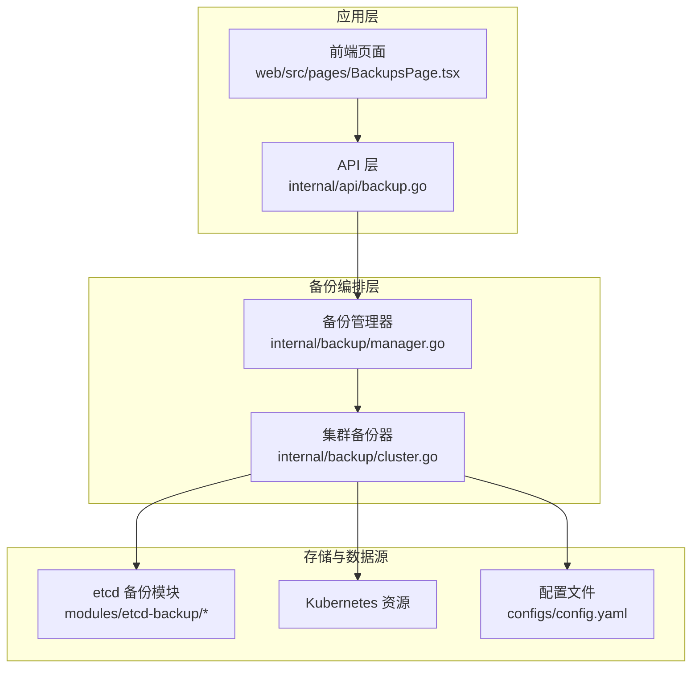
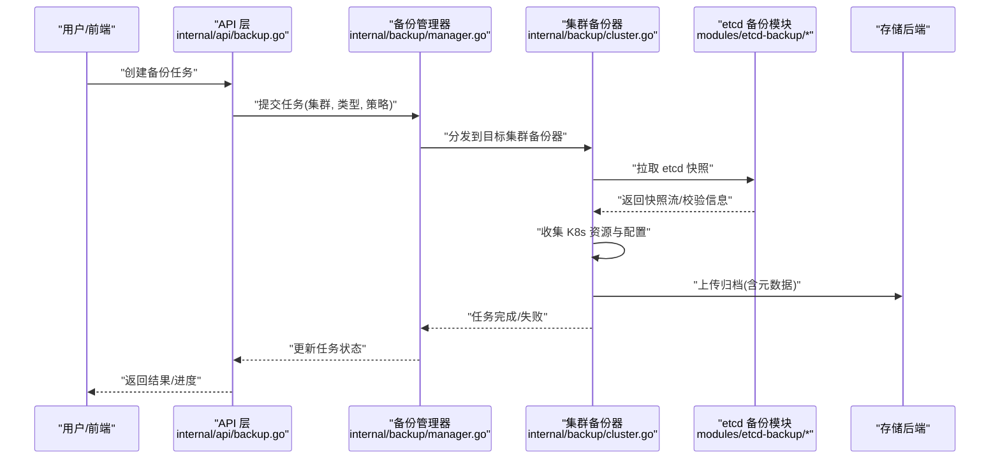
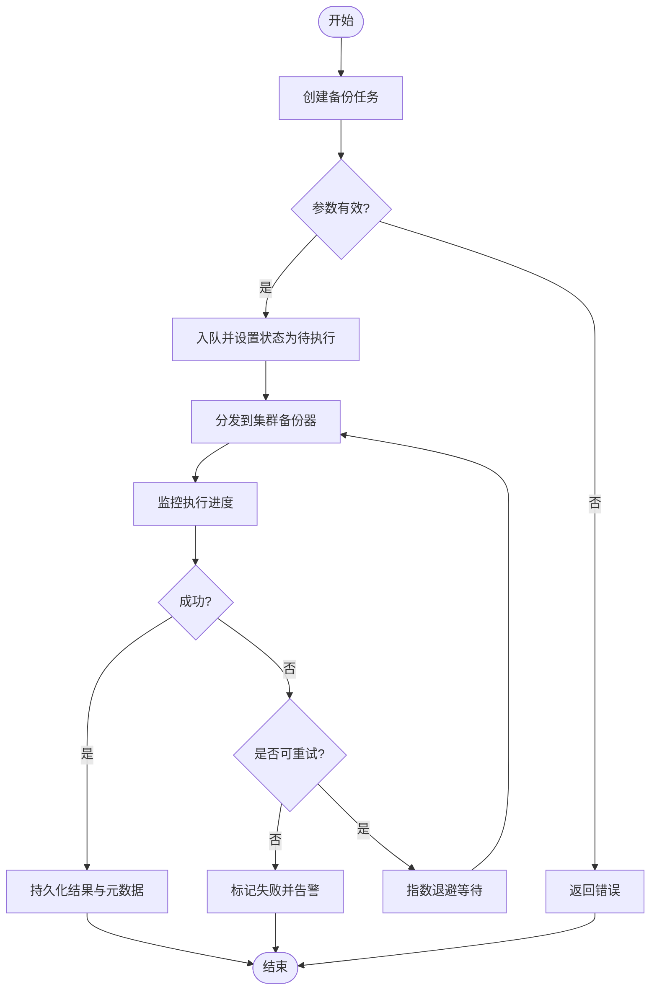
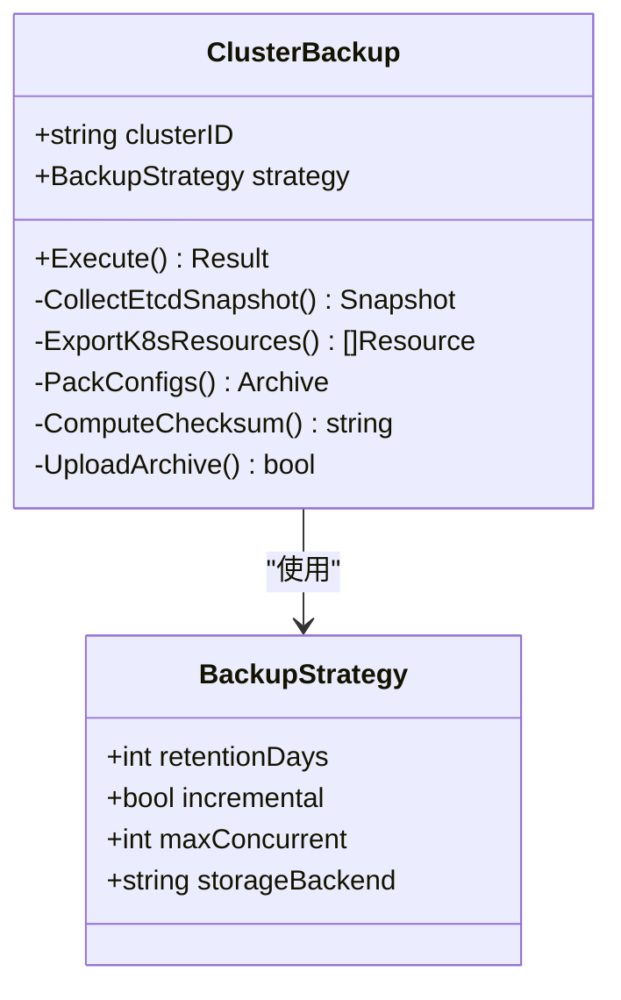
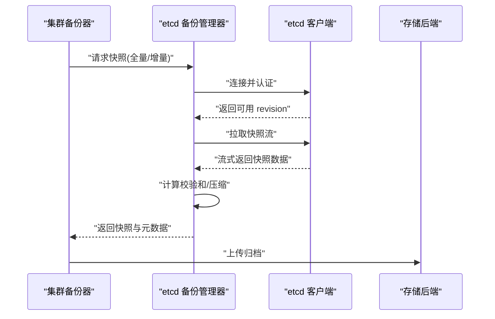
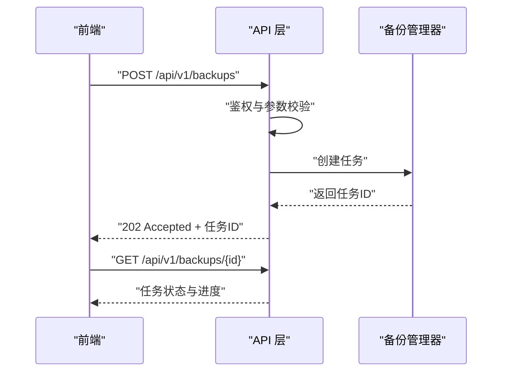
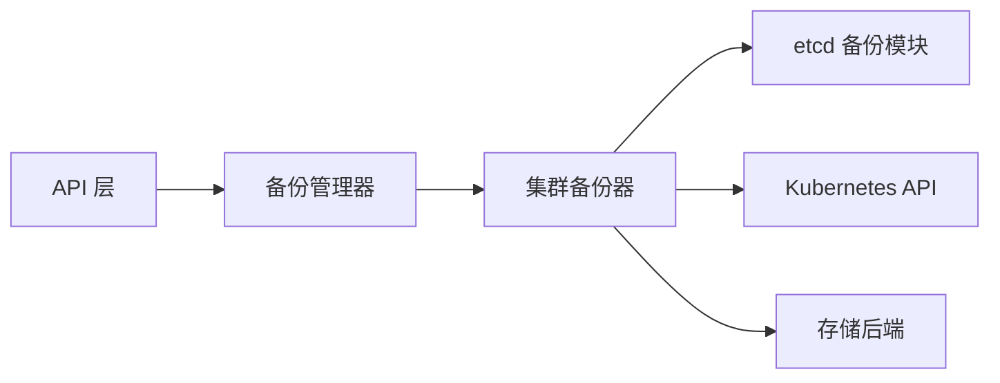

# 备份恢复管理

<cite>
**本文引用的文件**   
- [internal/backup/manager.go](file://internal/backup/manager.go)
- [internal/backup/cluster.go](file://internal/backup/cluster.go)
- [internal/api/backup.go](file://internal/api/backup.go)
- [modules/etcd-backup/manager.go](file://modules/etcd-backup/manager.go)
- [modules/etcd-backup/client.go](file://modules/etcd-backup/client.go)
- [modules/etcd-backup/types.go](file://modules/etcd-backup/types.go)
- [configs/config.yaml](file://configs/config.yaml)
- [web/src/pages/BackupsPage.tsx](file://web/src/pages/BackupsPage.tsx)
</cite>

## 目录
1. [简介](#简介)
2. [项目结构](#项目结构)
3. [核心组件](#核心组件)
4. [架构总览](#架构总览)
5. [详细组件分析](#详细组件分析)
6. [依赖关系分析](#依赖关系分析)
7. [性能考虑](#性能考虑)
8. [故障排查指南](#故障排查指南)
9. [结论](#结论)
10. [附录](#附录) 

## 简介
本文件面向 Klaw 的备份与恢复管理能力，系统性阐述数据备份策略、增量备份机制、多集群备份管理与灾难恢复流程。内容覆盖 etcd 数据备份、Kubernetes 资源备份、配置文件备份与状态数据同步，并给出备份任务调度、存储空间管理、备份验证与恢复演练的具体方案与实践建议。文档同时提供可操作的备份策略配置要点、恢复操作流程和数据一致性保证方案，帮助读者在复杂生产环境中构建高可用的备份恢复体系。

## 项目结构
备份恢复相关代码主要分布在以下位置：
- internal/backup：备份编排与管理逻辑（集群维度、任务生命周期）
- modules/etcd-backup：etcd 客户端与备份管理器
- internal/api：备份相关的 API 接口定义与处理
- configs：全局配置（包含备份相关参数）
- web/src/pages：前端备份页面，用于触发与查看备份任务

**图表来源** 
- [internal/api/backup.go](file://internal/api/backup.go)
- [internal/backup/manager.go](file://internal/backup/manager.go)
- [internal/backup/cluster.go](file://internal/backup/cluster.go)
- [modules/etcd-backup/manager.go](file://modules/etcd-backup/manager.go)
- [modules/etcd-backup/client.go](file://modules/etcd-backup/client.go)
- [modules/etcd-backup/types.go](file://modules/etcd-backup/types.go)
- [configs/config.yaml](file://configs/config.yaml)
- [web/src/pages/BackupsPage.tsx](file://web/src/pages/BackupsPage.tsx)

**章节来源**
- [internal/backup/manager.go](file://internal/backup/manager.go)
- [internal/backup/cluster.go](file://internal/backup/cluster.go)
- [internal/api/backup.go](file://internal/api/backup.go)
- [modules/etcd-backup/manager.go](file://modules/etcd-backup/manager.go)
- [modules/etcd-backup/client.go](file://modules/etcd-backup/client.go)
- [modules/etcd-backup/types.go](file://modules/etcd-backup/types.go)
- [configs/config.yaml](file://configs/config.yaml)
- [web/src/pages/BackupsPage.tsx](file://web/src/pages/BackupsPage.tsx)

## 核心组件
- 备份管理器（internal/backup/manager.go）
  - 职责：统一协调备份任务的生命周期、调度与结果聚合；维护任务状态机与重试策略；对接多集群备份器。
  - 关键能力：任务创建、执行、取消、查询；失败重试与告警；存储空间清理策略。
- 集群备份器（internal/backup/cluster.go）
  - 职责：按集群维度组织备份流程，包括 etcd 快照、Kubernetes 资源导出、配置文件打包与校验。
  - 关键能力：并发采集、增量判断、元数据生成、完整性校验、归档上传。
- etcd 备份模块（modules/etcd-backup/*）
  - 职责：封装 etcd 客户端连接、快照创建、版本探测与压缩传输。
  - 关键能力：快照拉取、断点续传、压缩与分片、校验和计算。
- API 层（internal/api/backup.go）
  - 职责：暴露 RESTful 接口，供前端或外部系统调用；负责鉴权、参数校验、异步任务编排与状态查询。
- 前端页面（web/src/pages/BackupsPage.tsx）
  - 职责：展示备份列表、触发备份、查看进度与结果、发起恢复演练。

**章节来源**
- [internal/backup/manager.go](file://internal/backup/manager.go)
- [internal/backup/cluster.go](file://internal/backup/cluster.go)
- [modules/etcd-backup/manager.go](file://modules/etcd-backup/manager.go)
- [modules/etcd-backup/client.go](file://modules/etcd-backup/client.go)
- [modules/etcd-backup/types.go](file://modules/etcd-backup/types.go)
- [internal/api/backup.go](file://internal/api/backup.go)
- [web/src/pages/BackupsPage.tsx](file://web/src/pages/BackupsPage.tsx)

## 架构总览
整体采用分层解耦设计：API 层接收请求并编排任务，备份管理器负责跨集群调度，集群备份器执行具体数据采集与归档，etcd 备份模块专注 etcd 快照操作。配置集中管理，前端提供可视化交互。

**图表来源** 
- [internal/api/backup.go](file://internal/api/backup.go)
- [internal/backup/manager.go](file://internal/backup/manager.go)
- [internal/backup/cluster.go](file://internal/backup/cluster.go)
- [modules/etcd-backup/manager.go](file://modules/etcd-backup/manager.go)
- [modules/etcd-backup/client.go](file://modules/etcd-backup/client.go)
- [modules/etcd-backup/types.go](file://modules/etcd-backup/types.go)

## 详细组件分析

### 备份管理器（internal/backup/manager.go）
- 设计要点
  - 任务队列与状态机：支持 Pending、Running、Success、Failed、Cancelled 等状态转换。
  - 并发控制：限制同一时间运行的任务数，避免资源争用。
  - 重试与退避：对瞬时错误进行指数退避重试，达到阈值后标记失败并告警。
  - 多集群路由：根据集群标识选择对应集群备份器实例。
- 关键流程
  - 任务创建：校验输入参数、分配任务 ID、写入持久化状态。
  - 任务执行：调度至集群备份器，监控进度，聚合结果。
  - 空间治理：定期扫描归档元数据，依据保留策略删除过期备份。
- 异常处理
  - 网络超时、存储不可用、权限不足等场景均有明确错误码与恢复建议。

**图表来源** 
- [internal/backup/manager.go](file://internal/backup/manager.go)

**章节来源**
- [internal/backup/manager.go](file://internal/backup/manager.go)

### 集群备份器（internal/backup/cluster.go）
- 设计要点
  - 模块化采集：etcd 快照、Kubernetes 资源清单、配置文件打包各自独立。
  - 增量机制：基于上次备份的元数据（如 etcd revision、资源变更时间戳）判断差异，仅采集变化部分。
  - 校验与签名：生成校验和与签名文件，确保归档完整性与可信性。
  - 并发与限流：对大规模资源采集进行并发控制与速率限制，降低对集群压力。
- 关键流程
  - 准备阶段：解析策略、准备临时目录、初始化元数据。
  - 采集阶段：并行拉取 etcd 快照与 K8s 资源，合并配置。
  - 归档阶段：压缩、上传、记录元数据与校验信息。
  - 清理阶段：释放临时资源，更新最近一次备份索引。

**图表来源** 
- [internal/backup/cluster.go](file://internal/backup/cluster.go)

**章节来源**
- [internal/backup/cluster.go](file://internal/backup/cluster.go)

### etcd 备份模块（modules/etcd-backup/*）
- 设计要点
  - 客户端封装：连接 etcd 端点、认证、TLS、超时与重试。
  - 快照管理：支持全量与增量快照（通过 revision 定位），压缩与分片传输。
  - 版本兼容：自动探测 etcd 版本，适配不同版本的快照格式。
- 关键流程
  - 建立连接：加载证书与令牌，建立安全通道。
  - 获取快照：根据策略决定全量或增量，拉取快照流。
  - 校验与压缩：计算校验和，压缩输出，回写元数据。

**图表来源** 
- [modules/etcd-backup/manager.go](file://modules/etcd-backup/manager.go)
- [modules/etcd-backup/client.go](file://modules/etcd-backup/client.go)
- [modules/etcd-backup/types.go](file://modules/etcd-backup/types.go)

**章节来源**
- [modules/etcd-backup/manager.go](file://modules/etcd-backup/manager.go)
- [modules/etcd-backup/client.go](file://modules/etcd-backup/client.go)
- [modules/etcd-backup/types.go](file://modules/etcd-backup/types.go)

### API 层（internal/api/backup.go）
- 设计要点
  - 接口规范：RESTful 风格，统一响应结构与错误码。
  - 鉴权与审计：访问控制、操作审计日志。
  - 异步任务：创建任务后立即返回任务 ID，前端轮询或订阅状态。
- 关键接口
  - 创建备份：POST /api/v1/backups
  - 查询任务：GET /api/v1/backups/{id}
  - 列出备份：GET /api/v1/backups
  - 删除备份：DELETE /api/v1/backups/{id}
  - 恢复演练：POST /api/v1/backups/{id}/dry-run

**图表来源** 
- [internal/api/backup.go](file://internal/api/backup.go)

**章节来源**
- [internal/api/backup.go](file://internal/api/backup.go)

### 前端页面（web/src/pages/BackupsPage.tsx）
- 功能概览
  - 展示备份列表与状态
  - 触发新备份任务
  - 查看任务详情与日志
  - 发起恢复演练与结果展示

**章节来源**
- [web/src/pages/BackupsPage.tsx](file://web/src/pages/BackupsPage.tsx)

## 依赖关系分析
- 组件耦合
  - API 层依赖备份管理器，不直接感知集群细节。
  - 备份管理器依赖集群备份器，屏蔽多集群差异。
  - 集群备份器依赖 etcd 备份模块与 Kubernetes 客户端。
- 外部依赖
  - etcd 服务：提供快照能力。
  - 存储后端：对象存储或文件系统，用于归档持久化。
  - Kubernetes API Server：用于资源清单导出。
- 潜在风险
  - 循环依赖：当前无循环导入。
  - 单点故障：etcd 与存储后端需具备高可用与冗余。

**图表来源** 
- [internal/api/backup.go](file://internal/api/backup.go)
- [internal/backup/manager.go](file://internal/backup/manager.go)
- [internal/backup/cluster.go](file://internal/backup/cluster.go)
- [modules/etcd-backup/manager.go](file://modules/etcd-backup/manager.go)

**章节来源**
- [internal/api/backup.go](file://internal/api/backup.go)
- [internal/backup/manager.go](file://internal/backup/manager.go)
- [internal/backup/cluster.go](file://internal/backup/cluster.go)
- [modules/etcd-backup/manager.go](file://modules/etcd-backup/manager.go)

## 性能考虑
- 并发与限流
  - 合理设置最大并发度，避免对 etcd 与 K8s API 造成过大压力。
  - 对大对象（快照、资源清单）启用分块传输与压缩。
- 增量优化
  - 基于 revision 与资源时间戳减少重复采集。
  - 缓存上次备份元数据，加速差异计算。
- 存储优化
  - 启用去重与压缩，降低存储空间占用。
  - 分片与并行上传提升吞吐。
- 监控与可观测性
  - 指标采集：任务耗时、成功率、存储用量、带宽占用。
  - 日志与审计：关键步骤留痕，便于问题定位。

[本节为通用指导，无需特定文件引用]

## 故障排查指南
- 常见问题
  - etcd 连接失败：检查证书、网络连通性与端口。
  - 存储上传失败：确认权限、配额与网络稳定性。
  - 任务长时间运行：检查并发设置与资源瓶颈。
  - 校验失败：核对校验和与签名文件是否完整。
- 诊断步骤
  - 查看任务状态与错误码。
  - 检索相关日志与指标。
  - 复现最小用例，隔离问题范围。
- 恢复建议
  - 优先从最近成功备份恢复。
  - 分阶段恢复：先 etcd，再 K8s 资源，最后配置。
  - 恢复后进行一致性校验与业务验证。

**章节来源**
- [internal/backup/manager.go](file://internal/backup/manager.go)
- [internal/backup/cluster.go](file://internal/backup/cluster.go)
- [modules/etcd-backup/client.go](file://modules/etcd-backup/client.go)

## 结论
Klaw 的备份恢复管理通过分层解耦与模块化设计，实现了 etcd 快照、Kubernetes 资源与配置文件的统一备份与恢复。结合增量机制、并发控制与校验签名，能够在多集群环境下提供高效、可靠的数据保护能力。配合完善的监控与故障排查流程，可有效支撑生产环境的灾难恢复需求。

[本节为总结性内容，无需特定文件引用]

## 附录

### 备份策略配置要点（参考）
- 保留策略：按天数或数量保留，自动清理过期备份。
- 增量开关：开启增量以减少带宽与存储消耗。
- 并发度：根据集群规模与资源上限调整。
- 存储后端：选择稳定可靠的对象存储或文件系统。
- 校验与签名：强制启用，确保归档完整性与可信性。

**章节来源**
- [configs/config.yaml](file://configs/config.yaml)

### 恢复操作流程（参考）
- 选择目标备份：按时间或标签筛选。
- 预检与演练：执行 dry-run 验证兼容性。
- 执行恢复：按顺序恢复 etcd、K8s 资源与配置。
- 验证一致性：对比校验和与关键业务指标。
- 回滚预案：准备快速回滚路径。

**章节来源**
- [internal/api/backup.go](file://internal/api/backup.go)
- [internal/backup/cluster.go](file://internal/backup/cluster.go)

### 数据一致性保证方案（参考）
- 事务快照：etcd 基于 revision 的一致性快照。
- 原子归档：元数据与数据一起提交，避免半完成状态。
- 校验链：端到端校验和与签名，防止篡改与损坏。
- 幂等恢复：支持重复执行而不产生副作用。

**章节来源**
- [modules/etcd-backup/types.go](file://modules/etcd-backup/types.go)
- [internal/backup/cluster.go](file://internal/backup/cluster.go)