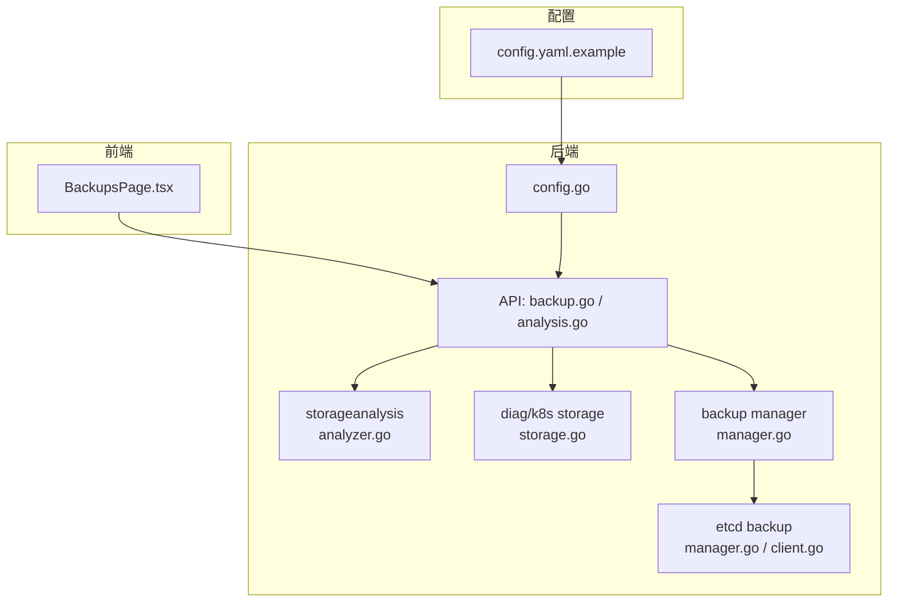
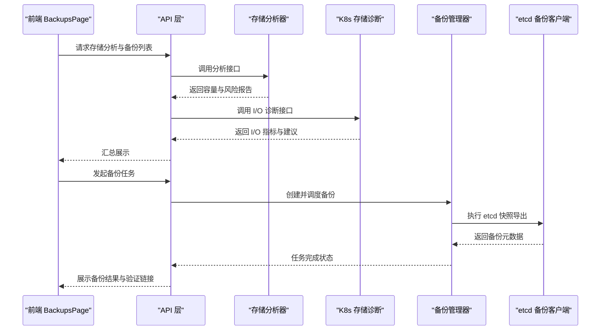
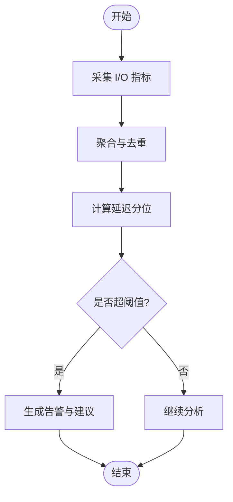
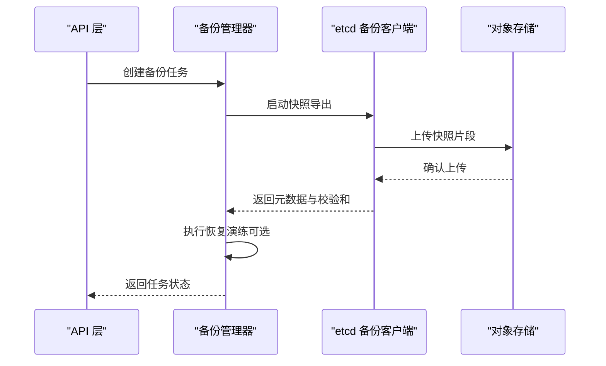
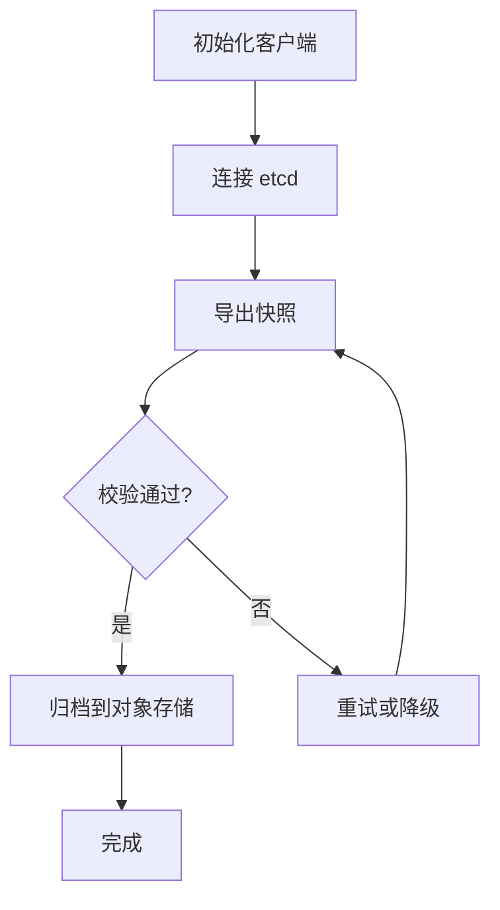
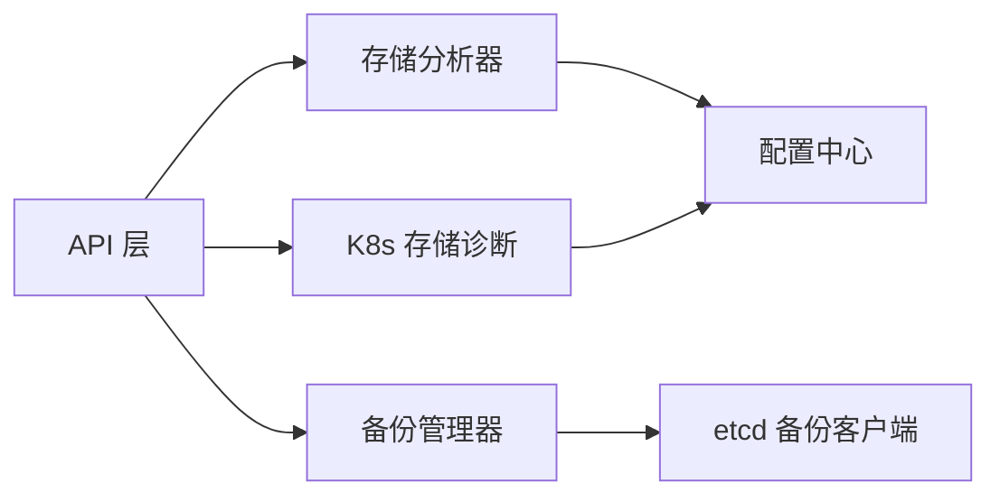

# 存储分析优化

<cite>
**本文引用的文件**   
- [internal/storageanalysis/analyzer.go](file://internal/storageanalysis/analyzer.go)
- [internal/storageanalysis/analyzer_test.go](file://internal/storageanalysis/analyzer_test.go)
- [internal/diag/analyzer/kubernetes/storage.go](file://internal/diag/analyzer/kubernetes/storage.go)
- [internal/diag/analyzer/kubernetes/storage_test.go](file://internal/diag/analyzer/kubernetes/storage_test.go)
- [internal/backup/manager.go](file://internal/backup/manager.go)
- [internal/backup/cluster.go](file://internal/backup/cluster.go)
- [internal/backup/manager_test.go](file://internal/backup/manager_test.go)
- [modules/etcd-backup/manager.go](file://modules/etcd-backup/manager.go)
- [modules/etcd-backup/client.go](file://modules/etcd-backup/client.go)
- [modules/etcd-backup/types.go](file://modules/etcd-backup/types.go)
- [internal/api/backup.go](file://internal/api/backup.go)
- [internal/api/analysis.go](file://internal/api/analysis.go)
- [internal/config/config.go](file://internal/config/config.go)
- [configs/config.yaml.example](file://configs/config.yaml.example)
- [web/src/pages/BackupsPage.tsx](file://web/src/pages/BackupsPage.tsx)
</cite>

## 目录
1. [简介](#简介)
2. [项目结构](#项目结构)
3. [核心组件](#核心组件)
4. [架构总览](#架构总览)
5. [详细组件分析](#详细组件分析)
6. [依赖关系分析](#依赖关系分析)
7. [性能考虑](#性能考虑)
8. [故障排查指南](#故障排查指南)
9. [结论](#结论)
10. [附录](#附录)

## 简介
本文件面向 Klaw 的“存储分析优化”能力，围绕以下目标展开：
- 存储容量规划：基于集群与命名空间维度的持久卷使用分析，识别增长趋势与热点。
- I/O 性能监控：结合 eBPF 与系统指标，定位磁盘 I/O 瓶颈、延迟与吞吐异常。
- 备份恢复策略：提供 etcd 与关键资源备份、自动化调度与恢复验证流程。
- 数据迁移管理：在 StorageClass 变更、节点池扩容/缩容等场景下的迁移建议与风险控制。
- 预警与告警：容量阈值、I/O 拥塞、备份失败等事件的自动检测与通知。
- 运维实践：给出可操作的监控指标、调优建议与操作手册。

## 项目结构
与存储分析优化相关的代码主要分布在以下模块：
- 存储分析器：internal/storageanalysis 与 internal/diag/analyzer/kubernetes/storage
- 备份与恢复：internal/backup、modules/etcd-backup
- API 层：internal/api（备份与分析接口）
- 配置：internal/config 与 configs/config.yaml.example
- 前端：web/src/pages/BackupsPage.tsx



图表来源
- [internal/storageanalysis/analyzer.go](file://internal/storageanalysis/analyzer.go)
- [internal/diag/analyzer/kubernetes/storage.go](file://internal/diag/analyzer/kubernetes/storage.go)
- [internal/backup/manager.go](file://internal/backup/manager.go)
- [modules/etcd-backup/manager.go](file://modules/etcd-backup/manager.go)
- [modules/etcd-backup/client.go](file://modules/etcd-backup/client.go)
- [internal/api/backup.go](file://internal/api/backup.go)
- [internal/api/analysis.go](file://internal/api/analysis.go)
- [internal/config/config.go](file://internal/config/config.go)
- [configs/config.yaml.example](file://configs/config.yaml.example)
- [web/src/pages/BackupsPage.tsx](file://web/src/pages/BackupsPage.tsx)

章节来源
- [internal/storageanalysis/analyzer.go](file://internal/storageanalysis/analyzer.go)
- [internal/diag/analyzer/kubernetes/storage.go](file://internal/diag/analyzer/kubernetes/storage.go)
- [internal/backup/manager.go](file://internal/backup/manager.go)
- [modules/etcd-backup/manager.go](file://modules/etcd-backup/manager.go)
- [internal/api/backup.go](file://internal/api/backup.go)
- [internal/api/analysis.go](file://internal/api/analysis.go)
- [internal/config/config.go](file://internal/config/config.go)
- [configs/config.yaml.example](file://configs/config.yaml.example)
- [web/src/pages/BackupsPage.tsx](file://web/src/pages/BackupsPage.tsx)

## 核心组件
- 存储分析器（StorageAnalyzer）
  - 职责：采集并聚合 PersistentVolume、PVC、PV 使用量、分配率、回收状态；按命名空间与应用维度统计；输出容量规划建议与风险项。
  - 关键能力：容量利用率计算、增长趋势估算、热点识别、告警规则匹配。
- Kubernetes 存储诊断（K8s Storage Analyzer）
  - 职责：读取 PV/PVC/SC/Node 等资源，评估 I/O 队列深度、延迟分布、吞吐瓶颈；关联工作负载与 Pod 挂载点。
  - 关键能力：I/O 指标采集、延迟分位统计、SC 参数校验、节点磁盘健康检查。
- 备份管理器（Backup Manager）
  - 职责：编排备份任务、调度执行、结果记录与重试；支持 etcd 全量/增量备份与恢复验证。
  - 关键能力：任务生命周期管理、并发控制、失败回滚、审计日志。
- etcd 备份客户端（etcd Backup Client）
  - 职责：与 etcd 交互进行快照导出/导入、一致性校验、压缩与加密。
  - 关键能力：流式导出、断点续传、完整性校验、版本兼容。
- API 层（Backup/Analysis APIs）
  - 职责：对外暴露备份与分析接口，统一鉴权、限流、审计。
  - 关键能力：REST 路由、请求校验、响应封装、错误码规范。
- 配置中心（Config）
  - 职责：加载运行时配置，包括存储分析阈值、备份策略、超时与并发限制。
  - 关键能力：YAML/环境变量注入、热更新、默认值兜底。

章节来源
- [internal/storageanalysis/analyzer.go](file://internal/storageanalysis/analyzer.go)
- [internal/diag/analyzer/kubernetes/storage.go](file://internal/diag/analyzer/kubernetes/storage.go)
- [internal/backup/manager.go](file://internal/backup/manager.go)
- [modules/etcd-backup/manager.go](file://modules/etcd-backup/manager.go)
- [modules/etcd-backup/client.go](file://modules/etcd-backup/client.go)
- [internal/api/backup.go](file://internal/api/backup.go)
- [internal/api/analysis.go](file://internal/api/analysis.go)
- [internal/config/config.go](file://internal/config/config.go)

## 架构总览
整体架构以“采集—分析—决策—执行—反馈”闭环为核心：
- 采集：通过 Kubernetes API 与 eBPF 探针获取 PV/PVC/SC、I/O 指标与事件。
- 分析：存储分析器与诊断引擎对数据进行聚合、建模与规则匹配。
- 决策：生成容量规划建议、I/O 调优方案、备份策略与迁移计划。
- 执行：备份管理器调度 etcd 备份、触发迁移脚本或变更审批。
- 反馈：将结果写入审计日志、推送告警、更新仪表盘。



图表来源
- [internal/api/backup.go](file://internal/api/backup.go)
- [internal/api/analysis.go](file://internal/api/analysis.go)
- [internal/storageanalysis/analyzer.go](file://internal/storageanalysis/analyzer.go)
- [internal/diag/analyzer/kubernetes/storage.go](file://internal/diag/analyzer/kubernetes/storage.go)
- [internal/backup/manager.go](file://internal/backup/manager.go)
- [modules/etcd-backup/manager.go](file://modules/etcd-backup/manager.go)
- [modules/etcd-backup/client.go](file://modules/etcd-backup/client.go)
- [web/src/pages/BackupsPage.tsx](file://web/src/pages/BackupsPage.tsx)

## 详细组件分析

### 存储分析器（StorageAnalyzer）
- 功能要点
  - 聚合 PVC 已用/分配/保留容量，计算利用率与增长速率。
  - 识别长期未释放的 PVC、低利用率 PV、跨节点迁移成本高的卷。
  - 输出容量规划建议：扩容阈值、预留比例、归档策略。
- 数据结构与复杂度
  - 典型输入为 PVC/PV 列表与历史用量时间序列；聚合阶段 O(N log N)，趋势拟合 O(N)。
- 依赖链
  - 依赖 Kubernetes API 获取资源清单，依赖配置中心读取阈值与窗口。
- 错误处理
  - 网络超时、权限不足、资源缺失时降级为部分可用，并记录审计日志。
- 性能优化
  - 批量查询、缓存最近一次快照、增量对比减少重复计算。

```mermaid
classDiagram
class StorageAnalyzer {
+Analyze() Report
+EstimateGrowth(namespace, window) Trend
+IdentifyHotspots() []Hotspot
+RecommendCapacity() Plan
}
class Config {
+Load() map[string]interface{}
+GetThreshold(key) float64
}
StorageAnalyzer --> Config : "读取阈值与窗口"
```

图表来源
- [internal/storageanalysis/analyzer.go](file://internal/storageanalysis/analyzer.go)
- [internal/config/config.go](file://internal/config/config.go)

章节来源
- [internal/storageanalysis/analyzer.go](file://internal/storageanalysis/analyzer.go)
- [internal/storageanalysis/analyzer_test.go](file://internal/storageanalysis/analyzer_test.go)
- [internal/config/config.go](file://internal/config/config.go)

### Kubernetes 存储诊断（K8s Storage Analyzer）
- 功能要点
  - 采集 I/O 指标：吞吐、延迟分位、队列深度、错误率。
  - 关联 Pod 与 PVC 挂载路径，定位应用级 I/O 热点。
  - 校验 StorageClass 参数（如 IOPS、带宽上限、快照策略）。
- 算法与流程
  - 指标采集→去重聚合→分位统计→阈值判定→建议生成。
- 错误处理
  - 节点不可达、cgroup 权限不足时跳过该节点并标记不健康。
- 性能考量
  - 采样频率与批大小可调；避免高频轮询导致控制面压力。



图表来源
- [internal/diag/analyzer/kubernetes/storage.go](file://internal/diag/analyzer/kubernetes/storage.go)
- [internal/diag/analyzer/kubernetes/storage_test.go](file://internal/diag/analyzer/kubernetes/storage_test.go)

章节来源
- [internal/diag/analyzer/kubernetes/storage.go](file://internal/diag/analyzer/kubernetes/storage.go)
- [internal/diag/analyzer/kubernetes/storage_test.go](file://internal/diag/analyzer/kubernetes/storage_test.go)

### 备份管理器（Backup Manager）
- 功能要点
  - 定义备份任务类型（全量/增量）、调度周期、保留策略。
  - 协调 etcd 备份客户端执行快照导出与上传。
  - 支持恢复演练与一致性校验，记录审计轨迹。
- 任务生命周期
  - 创建→调度→执行→校验→归档→清理。
- 并发与重试
  - 最大并发数限制、指数退避重试、幂等性保证。
- 错误处理
  - 备份失败分类（网络、权限、空间不足），触发告警与回滚。



图表来源
- [internal/backup/manager.go](file://internal/backup/manager.go)
- [internal/backup/cluster.go](file://internal/backup/cluster.go)
- [modules/etcd-backup/manager.go](file://modules/etcd-backup/manager.go)
- [modules/etcd-backup/client.go](file://modules/etcd-backup/client.go)
- [internal/api/backup.go](file://internal/api/backup.go)

章节来源
- [internal/backup/manager.go](file://internal/backup/manager.go)
- [internal/backup/cluster.go](file://internal/backup/cluster.go)
- [internal/backup/manager_test.go](file://internal/backup/manager_test.go)
- [modules/etcd-backup/manager.go](file://modules/etcd-backup/manager.go)
- [modules/etcd-backup/client.go](file://modules/etcd-backup/client.go)
- [internal/api/backup.go](file://internal/api/backup.go)

### etcd 备份客户端（etcd Backup Client）
- 功能要点
  - 与 etcd 建立连接，执行快照导出/导入。
  - 支持压缩、加密、断点续传与完整性校验。
- 关键流程
  - 初始化→会话建立→快照导出→校验→归档。
- 错误处理
  - 版本不兼容、证书过期、存储空间不足时的明确错误码与提示。



图表来源
- [modules/etcd-backup/client.go](file://modules/etcd-backup/client.go)
- [modules/etcd-backup/types.go](file://modules/etcd-backup/types.go)

章节来源
- [modules/etcd-backup/client.go](file://modules/etcd-backup/client.go)
- [modules/etcd-backup/types.go](file://modules/etcd-backup/types.go)
- [modules/etcd-backup/manager.go](file://modules/etcd-backup/manager.go)

### API 层（Backup/Analysis APIs）
- 功能要点
  - 暴露存储分析与备份相关 REST 接口。
  - 统一鉴权、限流、审计与错误码。
- 路由与校验
  - 请求体校验、分页与过滤参数、响应结构标准化。
- 集成点
  - 调用存储分析器与备份管理器，返回结构化结果。

章节来源
- [internal/api/backup.go](file://internal/api/backup.go)
- [internal/api/analysis.go](file://internal/api/analysis.go)

### 配置（Config）
- 功能要点
  - 加载 YAML 与环境变量，提供运行时配置访问。
  - 包含存储分析阈值、备份策略、超时与并发限制。
- 热更新与默认值
  - 支持动态刷新，缺省值保障稳定性。

章节来源
- [internal/config/config.go](file://internal/config/config.go)
- [configs/config.yaml.example](file://configs/config.yaml.example)

### 前端（BackupsPage）
- 功能要点
  - 展示备份任务列表、状态与详情。
  - 提供创建备份、查看结果与恢复演练入口。
- 交互流程
  - 拉取任务列表→用户操作→调用 API→刷新状态。

章节来源
- [web/src/pages/BackupsPage.tsx](file://web/src/pages/BackupsPage.tsx)

## 依赖关系分析
- 组件耦合
  - API 层对存储分析器与备份管理器存在直接依赖；备份管理器依赖 etcd 备份客户端。
  - 存储分析器与 K8s 存储诊断均依赖配置中心。
- 外部依赖
  - Kubernetes API、对象存储（用于备份归档）、etcd 集群。
- 潜在循环依赖
  - 当前设计无循环依赖；API 层作为编排者，避免反向引用。



图表来源
- [internal/api/backup.go](file://internal/api/backup.go)
- [internal/api/analysis.go](file://internal/api/analysis.go)
- [internal/storageanalysis/analyzer.go](file://internal/storageanalysis/analyzer.go)
- [internal/diag/analyzer/kubernetes/storage.go](file://internal/diag/analyzer/kubernetes/storage.go)
- [internal/backup/manager.go](file://internal/backup/manager.go)
- [modules/etcd-backup/manager.go](file://modules/etcd-backup/manager.go)
- [internal/config/config.go](file://internal/config/config.go)

章节来源
- [internal/api/backup.go](file://internal/api/backup.go)
- [internal/api/analysis.go](file://internal/api/analysis.go)
- [internal/storageanalysis/analyzer.go](file://internal/storageanalysis/analyzer.go)
- [internal/diag/analyzer/kubernetes/storage.go](file://internal/diag/analyzer/kubernetes/storage.go)
- [internal/backup/manager.go](file://internal/backup/manager.go)
- [modules/etcd-backup/manager.go](file://modules/etcd-backup/manager.go)
- [internal/config/config.go](file://internal/config/config.go)

## 性能考虑
- 存储容量规划
  - 建议按命名空间与应用维度设置容量阈值（如 70% 利用率预警、85% 强制扩容）。
  - 对增长速率采用滑动窗口与线性回归，避免短期波动误判。
- I/O 性能监控
  - 关注 p95/p99 延迟、队列深度、吞吐饱和点；结合 cgroup 与内核指标定位瓶颈。
  - 对高延迟 Pod 进行隔离与限流，必要时调整 StorageClass 的 IOPS/带宽参数。
- 备份与恢复
  - 备份窗口避开业务高峰；启用压缩与并行上传；定期恢复演练验证 RTO/RPO。
- 存储类优化
  - 根据工作负载选择合适 SC（如高性能 SSD、冷数据归档）；开启快照与自动扩容。
- 监控指标建议
  - PV 使用率、PVC 分配率、I/O 延迟分位、错误率、备份成功率与时长。

[本节为通用指导，不直接分析具体文件]

## 故障排查指南
- 常见问题
  - 备份失败：检查 etcd 连接、证书有效期、对象存储权限与空间。
  - I/O 延迟高：核对节点磁盘健康、SC 参数、Pod 挂载方式与并发写模式。
  - 容量告警误报：调整阈值与窗口，排除临时峰值与测试流量。
- 排查步骤
  - 查看备份任务日志与审计记录；复现 I/O 问题并采集快照。
  - 使用诊断工具输出报告，定位热点与瓶颈。
  - 逐步缩小范围（命名空间→工作负载→Pod→容器→进程）。
- 恢复验证
  - 在隔离环境执行恢复演练，校验数据一致性与服务可用性。

章节来源
- [internal/backup/manager.go](file://internal/backup/manager.go)
- [modules/etcd-backup/client.go](file://modules/etcd-backup/client.go)
- [internal/diag/analyzer/kubernetes/storage.go](file://internal/diag/analyzer/kubernetes/storage.go)

## 结论
Klaw 的存储分析优化通过“采集—分析—决策—执行—反馈”的闭环，覆盖容量规划、I/O 监控、备份恢复与迁移管理。借助存储分析器与 K8s 存储诊断，能够精准识别瓶颈与风险；通过备份管理器与 etcd 备份客户端，实现可靠的备份与恢复验证。配合合理的配置与监控指标，可有效提升集群存储的稳定性与可观测性。

[本节为总结，不直接分析具体文件]

## 附录
- 操作建议
  - 制定容量阈值与预警策略，定期审查增长趋势。
  - 配置备份策略与恢复演练计划，确保 RTO/RPO 达标。
  - 根据工作负载选择合适的 StorageClass，并持续优化参数。
- 参考文件
  - 配置示例与默认值参见配置文件与示例文件。
  - 前端页面提供备份任务管理与可视化。

章节来源
- [configs/config.yaml.example](file://configs/config.yaml.example)
- [web/src/pages/BackupsPage.tsx](file://web/src/pages/BackupsPage.tsx)