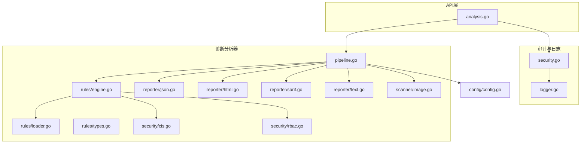
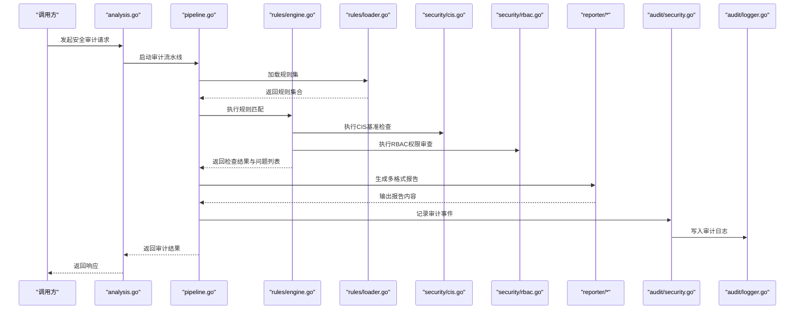
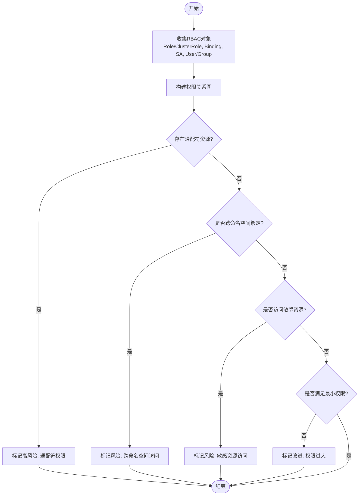
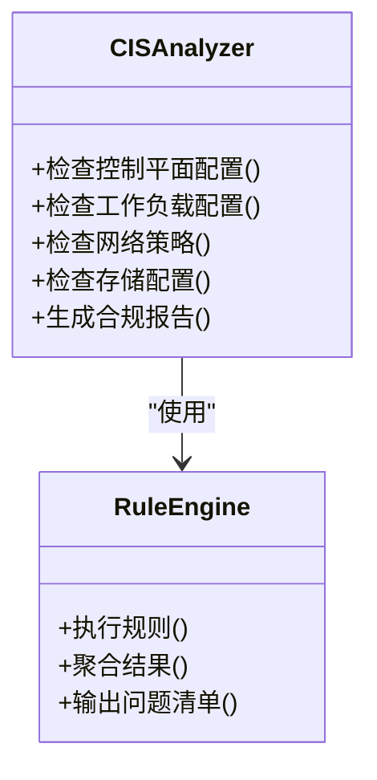
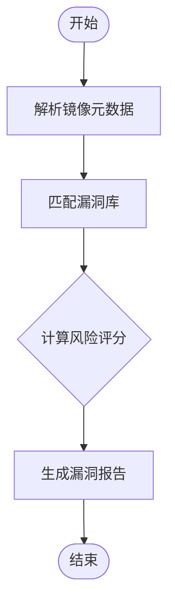
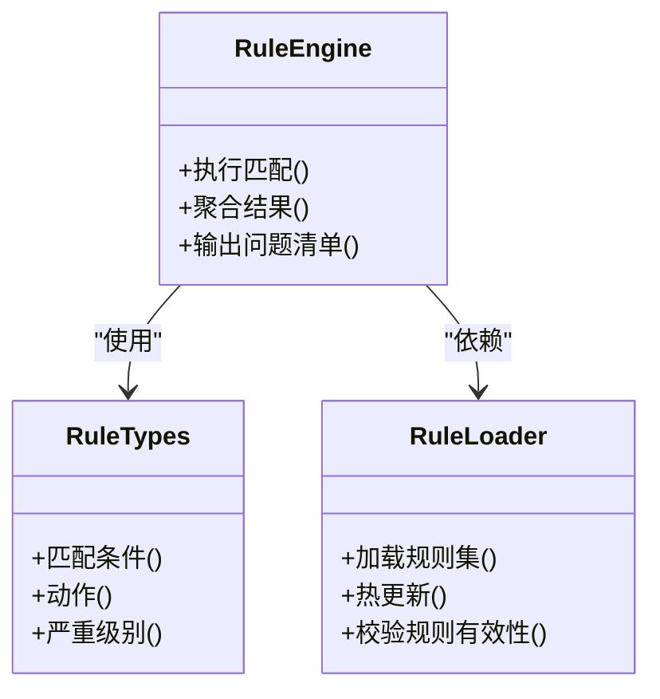
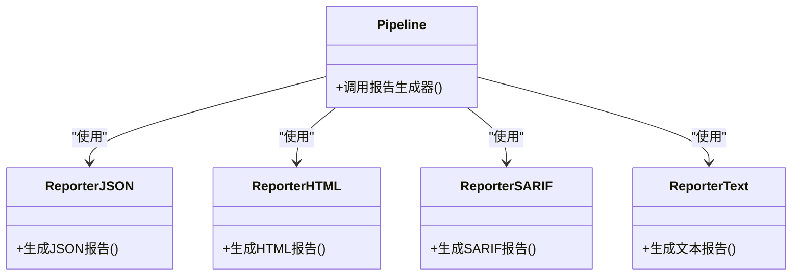
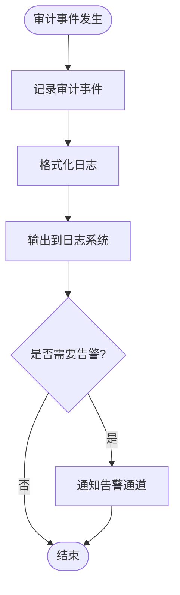
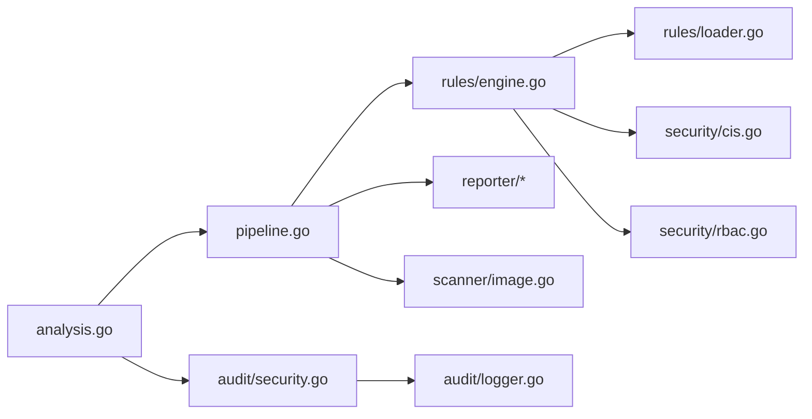

# 安全审计分析

<cite>
**本文引用的文件**   
- [internal/audit/security.go](file://internal/audit/security.go)
- [internal/diag/analyzer/security/cis.go](file://internal/diag/analyzer/security/cis.go)
- [internal/diag/analyzer/security/rbac.go](file://internal/diag/analyzer/security/rbac.go)
- [internal/diag/analyzer/rules/engine.go](file://internal/diag/analyzer/rules/engine.go)
- [internal/diag/analyzer/rules/loader.go](file://internal/diag/analyzer/rules/loader.go)
- [internal/diag/analyzer/rules/types.go](file://internal/diag/analyzer/rules/types.go)
- [internal/diag/analyzer/reporter/json.go](file://internal/diag/analyzer/reporter/json.go)
- [internal/diag/analyzer/reporter/html.go](file://internal/diag/analyzer/reporter/html.go)
- [internal/diag/analyzer/reporter/sarif.go](file://internal/diag/analyzer/reporter/sarif.go)
- [internal/diag/analyzer/reporter/text.go](file://internal/diag/analyzer/reporter/text.go)
- [internal/diag/analyzer/pipeline.go](file://internal/diag/analyzer/pipeline.go)
- [internal/diag/analyzer/scanner/image.go](file://internal/diag/analyzer/scanner/image.go)
- [internal/api/analysis.go](file://internal/api/analysis.go)
- [internal/audit/logger.go](file://internal/audit/logger.go)
- [internal/config/config.go](file://internal/config/config.go)
</cite>

## 目录
1. [简介](#简介)
2. [项目结构](#项目结构)
3. [核心组件](#核心组件)
4. [架构总览](#架构总览)
5. [详细组件分析](#详细组件分析)
6. [依赖分析](#依赖分析)
7. [性能考虑](#性能考虑)
8. [故障排查指南](#故障排查指南)
9. [结论](#结论)
10. [附录](#附录)

## 简介
本文件面向 Klaw 的安全审计分析能力，系统性说明 RBAC 权限审查、CIS 安全基准检查、镜像漏洞扫描与安全审计报告生成等关键功能。文档覆盖 Kubernetes 安全最佳实践检查、权限最小化验证、敏感资源配置检测与安全合规性评估；并提供安全规则配置、自定义安全策略、审计日志管理与安全事件响应的实践建议与示例。

## 项目结构
Klaw 的安全审计相关代码主要分布在以下模块：
- 审计与日志：internal/audit
- 诊断与分析器：internal/diag/analyzer（含 security、rules、reporter、scanner 等子包）
- API 入口：internal/api
- 配置管理：internal/config

图表来源
- [internal/api/analysis.go](file://internal/api/analysis.go)
- [internal/diag/analyzer/pipeline.go](file://internal/diag/analyzer/pipeline.go)
- [internal/diag/analyzer/rules/engine.go](file://internal/diag/analyzer/rules/engine.go)
- [internal/diag/analyzer/rules/loader.go](file://internal/diag/analyzer/rules/loader.go)
- [internal/diag/analyzer/rules/types.go](file://internal/diag/analyzer/rules/types.go)
- [internal/diag/analyzer/security/cis.go](file://internal/diag/analyzer/security/cis.go)
- [internal/diag/analyzer/security/rbac.go](file://internal/diag/analyzer/security/rbac.go)
- [internal/diag/analyzer/reporter/json.go](file://internal/diag/analyzer/reporter/json.go)
- [internal/diag/analyzer/reporter/html.go](file://internal/diag/analyzer/reporter/html.go)
- [internal/diag/analyzer/reporter/sarif.go](file://internal/diag/analyzer/reporter/sarif.go)
- [internal/diag/analyzer/reporter/text.go](file://internal/diag/analyzer/reporter/text.go)
- [internal/diag/analyzer/scanner/image.go](file://internal/diag/analyzer/scanner/image.go)
- [internal/audit/security.go](file://internal/audit/security.go)
- [internal/audit/logger.go](file://internal/audit/logger.go)
- [internal/config/config.go](file://internal/config/config.go)

章节来源
- [internal/api/analysis.go](file://internal/api/analysis.go)
- [internal/diag/analyzer/pipeline.go](file://internal/diag/analyzer/pipeline.go)
- [internal/audit/security.go](file://internal/audit/security.go)
- [internal/audit/logger.go](file://internal/audit/logger.go)
- [internal/config/config.go](file://internal/config/config.go)

## 核心组件
- 安全审计入口与记录
  - 安全审计封装：提供统一的安全审计上下文与结果聚合能力。
  - 审计日志：结构化记录审计事件，支持分级与可检索字段。
- 规则引擎与加载器
  - 规则引擎：执行规则匹配、评分与告警生成。
  - 规则加载器：从配置或内置策略中加载规则集，支持动态更新。
  - 规则类型定义：统一的规则模型、严重级别与匹配条件。
- 安全分析器
  - CIS 基准检查：对照 CIS Kubernetes 基准进行配置项校验与合规判定。
  - RBAC 权限审查：识别过度授权、宽泛角色绑定与潜在风险路径。
- 报告生成器
  - JSON/HTML/SARIF/Text 多格式输出，适配不同下游系统。
- 镜像漏洞扫描
  - 基于镜像元数据与已知漏洞库进行扫描与风险评级。
- 编排流水线
  - 串联采集、分析、规则匹配、报告生成与审计记录。

章节来源
- [internal/audit/security.go](file://internal/audit/security.go)
- [internal/audit/logger.go](file://internal/audit/logger.go)
- [internal/diag/analyzer/rules/engine.go](file://internal/diag/analyzer/rules/engine.go)
- [internal/diag/analyzer/rules/loader.go](file://internal/diag/analyzer/rules/loader.go)
- [internal/diag/analyzer/rules/types.go](file://internal/diag/analyzer/rules/types.go)
- [internal/diag/analyzer/security/cis.go](file://internal/diag/analyzer/security/cis.go)
- [internal/diag/analyzer/security/rbac.go](file://internal/diag/analyzer/security/rbac.go)
- [internal/diag/analyzer/reporter/json.go](file://internal/diag/analyzer/reporter/json.go)
- [internal/diag/analyzer/reporter/html.go](file://internal/diag/analyzer/reporter/html.go)
- [internal/diag/analyzer/reporter/sarif.go](file://internal/diag/analyzer/reporter/sarif.go)
- [internal/diag/analyzer/reporter/text.go](file://internal/diag/analyzer/reporter/text.go)
- [internal/diag/analyzer/scanner/image.go](file://internal/diag/analyzer/scanner/image.go)
- [internal/diag/analyzer/pipeline.go](file://internal/diag/analyzer/pipeline.go)

## 架构总览
下图展示了从 API 触发到规则执行、报告生成与审计记录的完整流程。

图表来源
- [internal/api/analysis.go](file://internal/api/analysis.go)
- [internal/diag/analyzer/pipeline.go](file://internal/diag/analyzer/pipeline.go)
- [internal/diag/analyzer/rules/engine.go](file://internal/diag/analyzer/rules/engine.go)
- [internal/diag/analyzer/rules/loader.go](file://internal/diag/analyzer/rules/loader.go)
- [internal/diag/analyzer/security/cis.go](file://internal/diag/analyzer/security/cis.go)
- [internal/diag/analyzer/security/rbac.go](file://internal/diag/analyzer/security/rbac.go)
- [internal/diag/analyzer/reporter/json.go](file://internal/diag/analyzer/reporter/json.go)
- [internal/diag/analyzer/reporter/html.go](file://internal/diag/analyzer/reporter/html.go)
- [internal/diag/analyzer/reporter/sarif.go](file://internal/diag/analyzer/reporter/sarif.go)
- [internal/diag/analyzer/reporter/text.go](file://internal/diag/analyzer/reporter/text.go)
- [internal/audit/security.go](file://internal/audit/security.go)
- [internal/audit/logger.go](file://internal/audit/logger.go)

## 详细组件分析

### RBAC 权限审查
- 目标
  - 识别过度授权、宽泛角色绑定、跨命名空间访问风险。
  - 验证权限最小化原则，定位高权限账户与 ServiceAccount。
- 实现要点
  - 通过 RBAC 分析器对 Role/ClusterRole、RoleBinding/ClusterRoleBinding、ServiceAccount、User/Group 进行关系建模与路径推导。
  - 结合规则引擎对“是否具备敏感资源访问”“是否存在通配符权限”“是否跨命名空间绑定”等条件进行判定。
- 典型检查项
  - 使用通配符资源的角色绑定
  - ClusterRole 直接绑定至用户或组
  - ServiceAccount 拥有持久卷、Secret 或节点级访问权限
  - 未限制资源名称的细粒度访问控制
- 输出
  - 问题清单、风险等级、修复建议与关联对象引用。

图表来源
- [internal/diag/analyzer/security/rbac.go](file://internal/diag/analyzer/security/rbac.go)
- [internal/diag/analyzer/rules/engine.go](file://internal/diag/analyzer/rules/engine.go)

章节来源
- [internal/diag/analyzer/security/rbac.go](file://internal/diag/analyzer/security/rbac.go)
- [internal/diag/analyzer/rules/engine.go](file://internal/diag/analyzer/rules/engine.go)

### CIS 安全基准检查
- 目标
  - 依据 CIS Kubernetes 基准对集群与工作负载配置进行合规性评估。
- 实现要点
  - 将 CIS 控制项映射为可执行规则，逐项检查控制平面、网络、存储、工作负载等配置。
  - 支持按严重级别分类与汇总统计，便于合规报告生成。
- 典型检查项
  - 控制面组件参数安全配置
  - 网络策略与默认拒绝策略
  - 存储类与 Secret 管理策略
  - 工作负载运行上下文与特权模式限制
- 输出
  - 合规状态、不合规项详情、修复指引与参考标准编号。

图表来源
- [internal/diag/analyzer/security/cis.go](file://internal/diag/analyzer/security/cis.go)
- [internal/diag/analyzer/rules/engine.go](file://internal/diag/analyzer/rules/engine.go)

章节来源
- [internal/diag/analyzer/security/cis.go](file://internal/diag/analyzer/security/cis.go)
- [internal/diag/analyzer/rules/engine.go](file://internal/diag/analyzer/rules/engine.go)

### 镜像漏洞扫描
- 目标
  - 基于镜像元数据与漏洞库进行扫描，识别高危漏洞与不合规镜像。
- 实现要点
  - 解析镜像标签、Digest 与基础镜像信息，匹配已知漏洞数据库。
  - 根据严重级别与影响范围生成风险评分与修复建议。
- 典型检查项
  - 基础镜像版本过旧
  - 包含高危 CVE 漏洞
  - 镜像签名与完整性校验缺失
- 输出
  - 漏洞清单、风险等级、受影响镜像与修复优先级。

图表来源
- [internal/diag/analyzer/scanner/image.go](file://internal/diag/analyzer/scanner/image.go)

章节来源
- [internal/diag/analyzer/scanner/image.go](file://internal/diag/analyzer/scanner/image.go)

### 规则引擎与自定义策略
- 目标
  - 提供可扩展的规则模型与执行框架，支持内置与自定义安全策略。
- 实现要点
  - 规则类型定义：统一描述匹配条件、动作与严重级别。
  - 规则加载器：从配置文件或内置策略中加载规则集，支持热更新。
  - 规则引擎：遍历规则并执行匹配，聚合问题与评分。
- 典型用法
  - 新增自定义规则：定义匹配条件与修复建议，注册到加载器。
  - 调整严重级别：根据组织策略调整风险阈值与告警级别。
- 输出
  - 规则命中清单、问题详情、修复建议与合规统计。

图表来源
- [internal/diag/analyzer/rules/types.go](file://internal/diag/analyzer/rules/types.go)
- [internal/diag/analyzer/rules/loader.go](file://internal/diag/analyzer/rules/loader.go)
- [internal/diag/analyzer/rules/engine.go](file://internal/diag/analyzer/rules/engine.go)

章节来源
- [internal/diag/analyzer/rules/types.go](file://internal/diag/analyzer/rules/types.go)
- [internal/diag/analyzer/rules/loader.go](file://internal/diag/analyzer/rules/loader.go)
- [internal/diag/analyzer/rules/engine.go](file://internal/diag/analyzer/rules/engine.go)

### 报告生成器
- 目标
  - 将审计结果以多种格式输出，满足不同下游系统的消费需求。
- 实现要点
  - JSON：结构化数据，便于自动化处理与集成。
  - HTML：可视化报告，适合人工审阅与归档。
  - SARIF：静态分析结果交换格式，便于与工具链集成。
  - Text：简洁文本，便于快速查看与日志记录。
- 输出
  - 报告内容、问题清单、风险统计与修复建议。

图表来源
- [internal/diag/analyzer/reporter/json.go](file://internal/diag/analyzer/reporter/json.go)
- [internal/diag/analyzer/reporter/html.go](file://internal/diag/analyzer/reporter/html.go)
- [internal/diag/analyzer/reporter/sarif.go](file://internal/diag/analyzer/reporter/sarif.go)
- [internal/diag/analyzer/reporter/text.go](file://internal/diag/analyzer/reporter/text.go)
- [internal/diag/analyzer/pipeline.go](file://internal/diag/analyzer/pipeline.go)

章节来源
- [internal/diag/analyzer/reporter/json.go](file://internal/diag/analyzer/reporter/json.go)
- [internal/diag/analyzer/reporter/html.go](file://internal/diag/analyzer/reporter/html.go)
- [internal/diag/analyzer/reporter/sarif.go](file://internal/diag/analyzer/reporter/sarif.go)
- [internal/diag/analyzer/reporter/text.go](file://internal/diag/analyzer/reporter/text.go)
- [internal/diag/analyzer/pipeline.go](file://internal/diag/analyzer/pipeline.go)

### 审计日志与事件响应
- 目标
  - 记录安全审计事件，支持追踪、检索与响应。
- 实现要点
  - 审计事件：包含时间戳、操作主体、资源对象、结果与严重级别。
  - 日志输出：结构化格式，便于集中式日志平台采集与分析。
  - 事件响应：结合告警通道与工单系统，触发自动响应流程。
- 输出
  - 审计日志条目、事件摘要与响应建议。

图表来源
- [internal/audit/security.go](file://internal/audit/security.go)
- [internal/audit/logger.go](file://internal/audit/logger.go)

章节来源
- [internal/audit/security.go](file://internal/audit/security.go)
- [internal/audit/logger.go](file://internal/audit/logger.go)

## 依赖分析
- 组件耦合
  - API 层依赖流水线编排，流水线依赖规则引擎与报告生成器。
  - 规则引擎依赖规则加载器与具体安全分析器（CIS、RBAC）。
  - 审计模块独立于分析器，负责事件记录与日志输出。
- 外部依赖
  - 镜像漏洞库、CIS 基准规范、日志系统与告警通道。
- 潜在循环依赖
  - 当前设计避免循环依赖，各模块职责清晰。

图表来源
- [internal/api/analysis.go](file://internal/api/analysis.go)
- [internal/diag/analyzer/pipeline.go](file://internal/diag/analyzer/pipeline.go)
- [internal/diag/analyzer/rules/engine.go](file://internal/diag/analyzer/rules/engine.go)
- [internal/diag/analyzer/rules/loader.go](file://internal/diag/analyzer/rules/loader.go)
- [internal/diag/analyzer/security/cis.go](file://internal/diag/analyzer/security/cis.go)
- [internal/diag/analyzer/security/rbac.go](file://internal/diag/analyzer/security/rbac.go)
- [internal/diag/analyzer/reporter/json.go](file://internal/diag/analyzer/reporter/json.go)
- [internal/diag/analyzer/reporter/html.go](file://internal/diag/analyzer/reporter/html.go)
- [internal/diag/analyzer/reporter/sarif.go](file://internal/diag/analyzer/reporter/sarif.go)
- [internal/diag/analyzer/reporter/text.go](file://internal/diag/analyzer/reporter/text.go)
- [internal/diag/analyzer/scanner/image.go](file://internal/diag/analyzer/scanner/image.go)
- [internal/audit/security.go](file://internal/audit/security.go)
- [internal/audit/logger.go](file://internal/audit/logger.go)

章节来源
- [internal/api/analysis.go](file://internal/api/analysis.go)
- [internal/diag/analyzer/pipeline.go](file://internal/diag/analyzer/pipeline.go)
- [internal/diag/analyzer/rules/engine.go](file://internal/diag/analyzer/rules/engine.go)
- [internal/diag/analyzer/rules/loader.go](file://internal/diag/analyzer/rules/loader.go)
- [internal/diag/analyzer/security/cis.go](file://internal/diag/analyzer/security/cis.go)
- [internal/diag/analyzer/security/rbac.go](file://internal/diag/analyzer/security/rbac.go)
- [internal/diag/analyzer/reporter/json.go](file://internal/diag/analyzer/reporter/json.go)
- [internal/diag/analyzer/reporter/html.go](file://internal/diag/analyzer/reporter/html.go)
- [internal/diag/analyzer/reporter/sarif.go](file://internal/diag/analyzer/reporter/sarif.go)
- [internal/diag/analyzer/reporter/text.go](file://internal/diag/analyzer/reporter/text.go)
- [internal/diag/analyzer/scanner/image.go](file://internal/diag/analyzer/scanner/image.go)
- [internal/audit/security.go](file://internal/audit/security.go)
- [internal/audit/logger.go](file://internal/audit/logger.go)

## 性能考虑
- 规则匹配优化
  - 预编译规则条件，减少运行时开销。
  - 批量处理对象，降低 I/O 与序列化成本。
- 并发与并行
  - 并行执行多个分析器（CIS、RBAC、镜像扫描），提升吞吐。
  - 控制并发度，避免资源争用与内存峰值。
- 缓存与增量
  - 缓存规则集与已分析对象，支持增量更新。
  - 对频繁变化的对象（如 Pod 列表）采用差异比较。
- 报告生成
  - 流式输出大报告，避免一次性加载全部数据。
  - 按需生成特定格式，减少不必要的转换。

[本节为通用指导，无需列出具体文件来源]

## 故障排查指南
- 常见问题
  - 规则加载失败：检查规则文件格式与语法，确认加载器配置正确。
  - 分析器超时：调整超时与重试策略，检查外部依赖可用性。
  - 报告为空：确认流水线步骤是否全部执行，检查输入数据完整性。
  - 审计日志缺失：确认日志输出路径与权限，检查日志系统连通性。
- 调试建议
  - 启用详细日志，定位问题阶段与错误堆栈。
  - 使用最小数据集复现问题，逐步缩小范围。
  - 检查规则命中情况与匹配条件是否正确。

章节来源
- [internal/diag/analyzer/rules/loader.go](file://internal/diag/analyzer/rules/loader.go)
- [internal/diag/analyzer/pipeline.go](file://internal/diag/analyzer/pipeline.go)
- [internal/audit/logger.go](file://internal/audit/logger.go)

## 结论
Klaw 的安全审计分析功能通过规则引擎与专用分析器（CIS、RBAC、镜像扫描）实现了全面的安全检查与合规评估。多格式报告与审计日志为自动化集成与人工审阅提供了良好支撑。建议在生产环境中持续迭代规则集，结合告警与响应机制，形成闭环的安全治理流程。

[本节为总结性内容，无需列出具体文件来源]

## 附录
- 安全检查示例
  - RBAC：识别通配符角色绑定与跨命名空间访问。
  - CIS：检查控制面参数、网络策略与工作负载安全上下文。
  - 镜像：扫描基础镜像版本与高危 CVE。
- 合规性报告格式
  - JSON：结构化数据，便于自动化处理。
  - HTML：可视化报告，适合人工审阅。
  - SARIF：静态分析结果交换格式。
  - Text：简洁文本，便于快速查看。
- 安全加固建议
  - 遵循最小权限原则，定期审查角色与绑定。
  - 启用网络策略与默认拒绝策略。
  - 使用受信任的基础镜像与签名验证。
  - 定期更新规则集与漏洞库，保持合规性。

[本节为补充信息，无需列出具体文件来源]