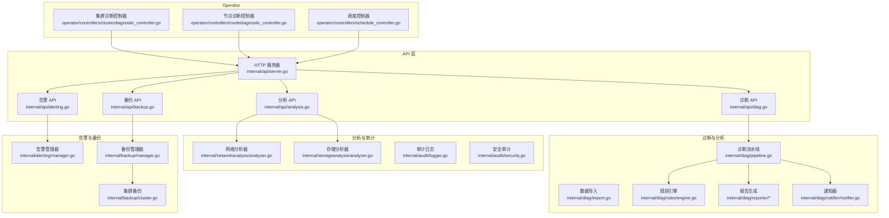
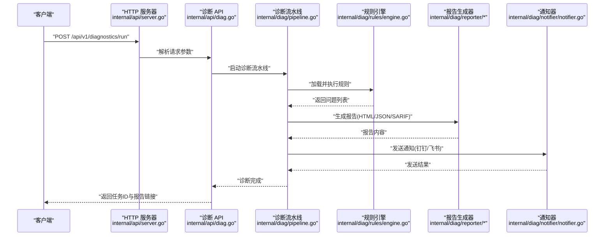
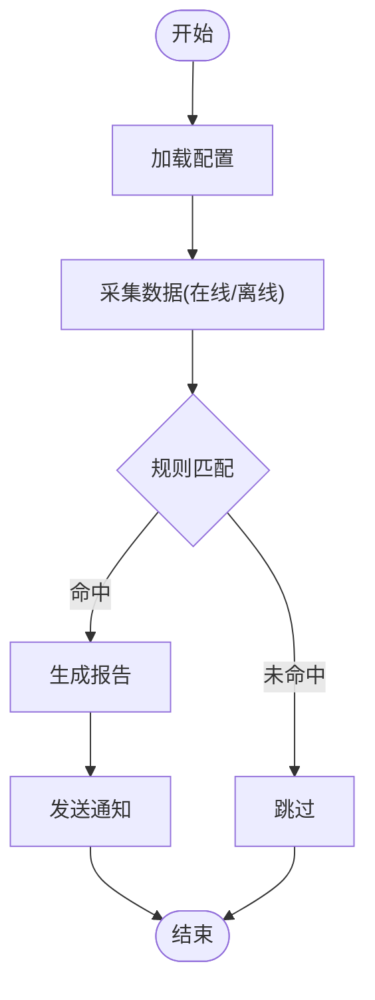
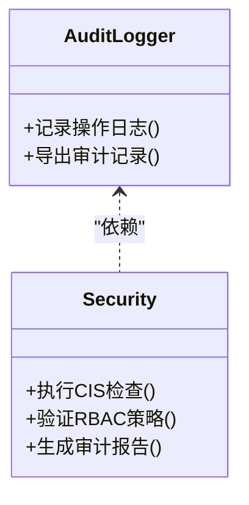
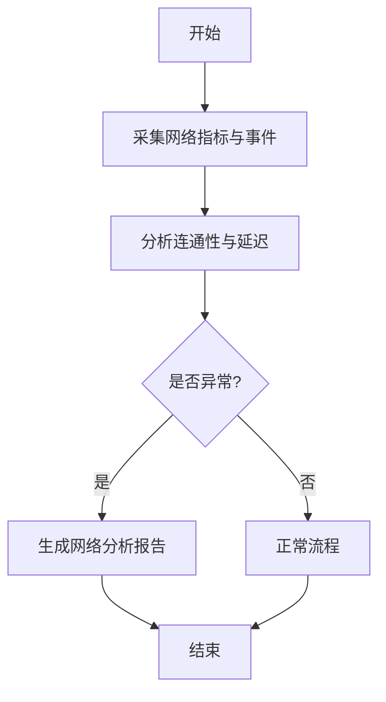
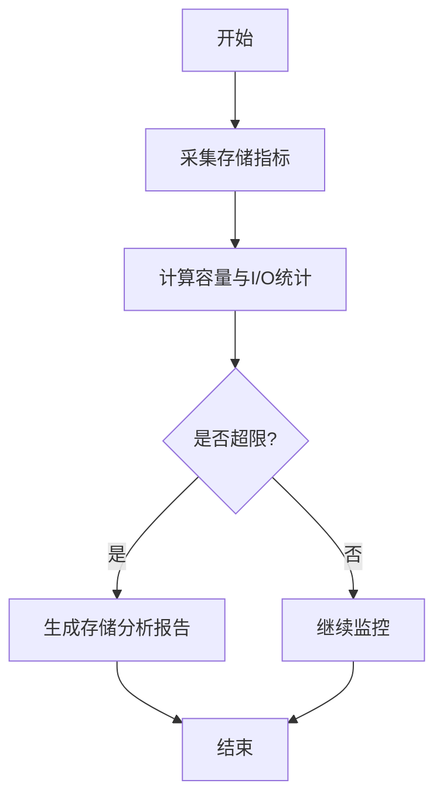
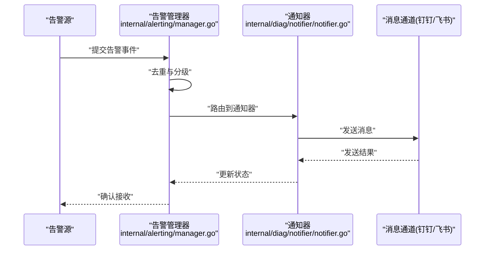
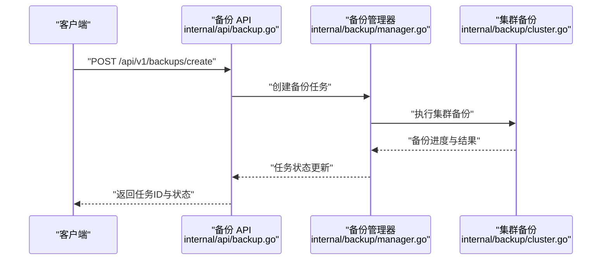
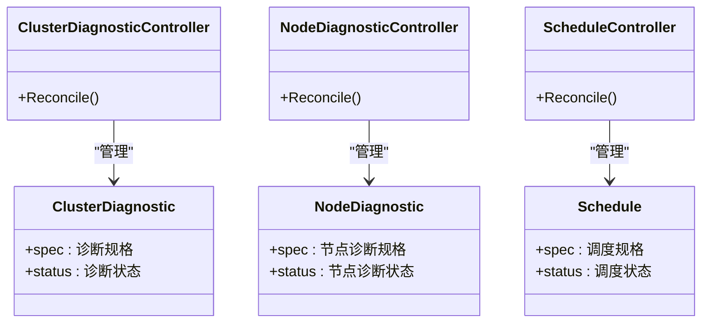
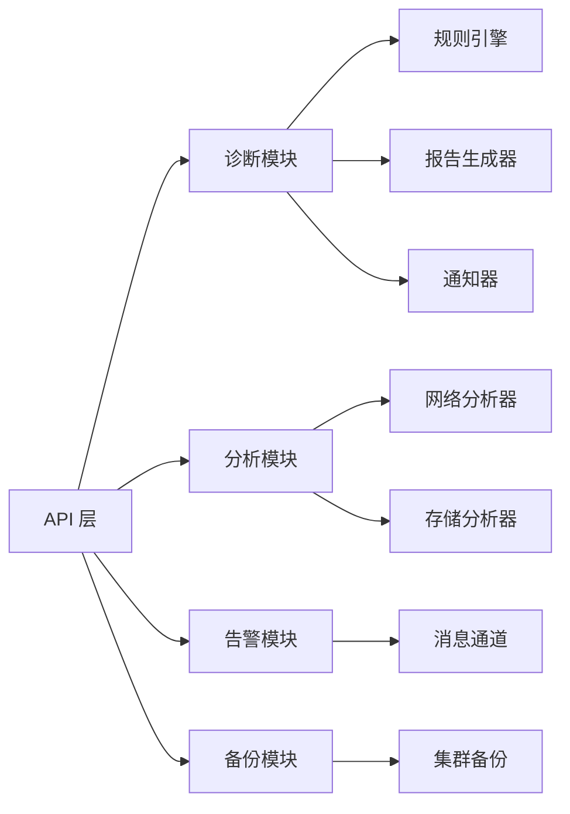

# 核心功能

<cite>
**本文引用的文件**   
- [internal/api/server.go](file://internal/api/server.go)
- [internal/api/diag.go](file://internal/api/diag.go)
- [internal/api/analysis.go](file://internal/api/analysis.go)
- [internal/api/alerting.go](file://internal/api/alerting.go)
- [internal/api/backup.go](file://internal/api/backup.go)
- [internal/audit/logger.go](file://internal/audit/logger.go)
- [internal/audit/security.go](file://internal/audit/security.go)
- [internal/networkanalysis/analyzer.go](file://internal/networkanalysis/analyzer.go)
- [internal/storageanalysis/analyzer.go](file://internal/storageanalysis/analyzer.go)
- [internal/alerting/manager.go](file://internal/alerting/manager.go)
- [internal/backup/manager.go](file://internal/backup/manager.go)
- [internal/backup/cluster.go](file://internal/backup/cluster.go)
- [internal/diag/pipeline.go](file://internal/diag/pipeline.go)
- [internal/diag/import.go](file://internal/diag/import.go)
- [internal/diag/types/diagnostic_data.go](file://internal/diag/types/diagnostic_data.go)
- [internal/diag/types/issue.go](file://internal/diag/types/issue.go)
- [internal/diag/types/severity.go](file://internal/diag/types/severity.go)
- [internal/diag/rules/engine.go](file://internal/diag/rules/engine.go)
- [internal/diag/rules/loader.go](file://internal/diag/rules/loader.go)
- [internal/diag/rules/types.go](file://internal/diag/rules/types.go)
- [internal/diag/reporter/html.go](file://internal/diag/reporter/html.go)
- [internal/diag/reporter/json.go](file://internal/diag/reporter/json.go)
- [internal/diag/reporter/text.go](file://internal/diag/reporter/text.go)
- [internal/diag/reporter/sarif.go](file://internal/diag/reporter/sarif.go)
- [internal/diag/notifier/notifier.go](file://internal/diag/notifier/notifier.go)
- [internal/messaging/interface.go](file://internal/messaging/interface.go)
- [internal/messaging/dingtalk/client.go](file://internal/messaging/dingtalk/client.go)
- [internal/messaging/feishu/client.go](file://internal/messaging/feishu/client.go)
- [configs/config.yaml.example](file://configs/config.yaml.example)
- [operator/controllers/clusterdiagnostic_controller.go](file://operator/controllers/clusterdiagnostic_controller.go)
- [operator/controllers/nodediagnostic_controller.go](file://operator/controllers/nodediagnostic_controller.go)
- [operator/controllers/schedule_controller.go](file://operator/controllers/schedule_controller.go)
- [operator/api/v1/clusterdiagnostic_types.go](file://operator/api/v1/clusterdiagnostic_types.go)
- [operator/api/v1/nodediagnostic_types.go](file://operator/api/v1/nodediagnostic_types.go)
- [operator/api/v1/schedule_types.go](file://operator/api/v1/schedule_types.go)
</cite>

## 目录
1. [简介](#简介)
2. [项目结构](#项目结构)
3. [核心组件](#核心组件)
4. [架构总览](#架构总览)
5. [详细组件分析](#详细组件分析)
6. [依赖关系分析](#依赖关系分析)
7. [性能考量](#性能考量)
8. [故障排查指南](#故障排查指南)
9. [结论](#结论)
10. [附录](#附录)

## 简介
本文件面向 Klaw 平台的核心功能模块，系统性阐述集群诊断分析、安全审计、网络分析、存储分析、告警管理、备份恢复等能力的实现原理、配置方法、使用场景与最佳实践。文档同时提供 API 调用示例、关键配置参数说明以及常见问题解决方案，帮助读者快速上手并高效运维。

## 项目结构
Klaw 采用模块化设计，后端以 Go 为主，前端位于 web 目录，Operator 负责 Kubernetes 资源编排与调度。核心能力通过 internal 下的子包组织：
- API 层：统一 HTTP 接口与路由注册
- 诊断与分析：规则引擎、采集器、报告生成、通知
- 审计与安全：日志记录与安全策略检查
- 网络与存储分析：专用分析器
- 告警与备份：告警管理与备份执行
- Operator：CRD 控制器与调度

**图表来源** 
- [internal/api/server.go](file://internal/api/server.go)
- [internal/api/diag.go](file://internal/api/diag.go)
- [internal/api/analysis.go](file://internal/api/analysis.go)
- [internal/api/alerting.go](file://internal/api/alerting.go)
- [internal/api/backup.go](file://internal/api/backup.go)
- [internal/diag/pipeline.go](file://internal/diag/pipeline.go)
- [internal/diag/import.go](file://internal/diag/import.go)
- [internal/diag/rules/engine.go](file://internal/diag/rules/engine.go)
- [internal/diag/reporter/html.go](file://internal/diag/reporter/html.go)
- [internal/diag/reporter/json.go](file://internal/diag/reporter/json.go)
- [internal/diag/reporter/text.go](file://internal/diag/reporter/text.go)
- [internal/diag/reporter/sarif.go](file://internal/diag/reporter/sarif.go)
- [internal/diag/notifier/notifier.go](file://internal/diag/notifier/notifier.go)
- [internal/networkanalysis/analyzer.go](file://internal/networkanalysis/analyzer.go)
- [internal/storageanalysis/analyzer.go](file://internal/storageanalysis/analyzer.go)
- [internal/alerting/manager.go](file://internal/alerting/manager.go)
- [internal/backup/manager.go](file://internal/backup/manager.go)
- [internal/backup/cluster.go](file://internal/backup/cluster.go)
- [operator/controllers/clusterdiagnostic_controller.go](file://operator/controllers/clusterdiagnostic_controller.go)
- [operator/controllers/nodediagnostic_controller.go](file://operator/controllers/nodediagnostic_controller.go)
- [operator/controllers/schedule_controller.go](file://operator/controllers/schedule_controller.go)

**章节来源**
- [internal/api/server.go](file://internal/api/server.go)
- [internal/api/diag.go](file://internal/api/diag.go)
- [internal/api/analysis.go](file://internal/api/analysis.go)
- [internal/api/alerting.go](file://internal/api/alerting.go)
- [internal/api/backup.go](file://internal/api/backup.go)
- [internal/diag/pipeline.go](file://internal/diag/pipeline.go)
- [internal/diag/import.go](file://internal/diag/import.go)
- [internal/diag/rules/engine.go](file://internal/diag/rules/engine.go)
- [internal/diag/reporter/html.go](file://internal/diag/reporter/html.go)
- [internal/diag/reporter/json.go](file://internal/diag/reporter/json.go)
- [internal/diag/reporter/text.go](file://internal/diag/reporter/text.go)
- [internal/diag/reporter/sarif.go](file://internal/diag/reporter/sarif.go)
- [internal/diag/notifier/notifier.go](file://internal/diag/notifier/notifier.go)
- [internal/networkanalysis/analyzer.go](file://internal/networkanalysis/analyzer.go)
- [internal/storageanalysis/analyzer.go](file://internal/storageanalysis/analyzer.go)
- [internal/alerting/manager.go](file://internal/alerting/manager.go)
- [internal/backup/manager.go](file://internal/backup/manager.go)
- [internal/backup/cluster.go](file://internal/backup/cluster.go)
- [operator/controllers/clusterdiagnostic_controller.go](file://operator/controllers/clusterdiagnostic_controller.go)
- [operator/controllers/nodediagnostic_controller.go](file://operator/controllers/nodediagnostic_controller.go)
- [operator/controllers/schedule_controller.go](file://operator/controllers/schedule_controller.go)

## 核心组件
- 诊断流水线：负责编排数据采集、规则匹配、问题识别、报告生成与通知发送。
- 规则引擎：加载并执行诊断规则，支持多格式规则定义与扩展。
- 报告生成器：输出 HTML、JSON、Text、SARIF 等多种格式的诊断报告。
- 通知器：对接钉钉、飞书等消息通道进行告警推送。
- 网络分析器：基于网络指标与事件进行连通性、延迟、丢包等分析。
- 存储分析器：评估存储容量、I/O 性能、配额与访问模式。
- 审计日志与安全：记录操作审计、敏感操作追踪与安全策略校验。
- 告警管理器：聚合告警源、去重、分级、路由与抑制。
- 备份管理器：协调集群备份任务、状态跟踪与结果上报。

**章节来源**
- [internal/diag/pipeline.go](file://internal/diag/pipeline.go)
- [internal/diag/rules/engine.go](file://internal/diag/rules/engine.go)
- [internal/diag/reporter/html.go](file://internal/diag/reporter/html.go)
- [internal/diag/reporter/json.go](file://internal/diag/reporter/json.go)
- [internal/diag/reporter/text.go](file://internal/diag/reporter/text.go)
- [internal/diag/reporter/sarif.go](file://internal/diag/reporter/sarif.go)
- [internal/diag/notifier/notifier.go](file://internal/diag/notifier/notifier.go)
- [internal/networkanalysis/analyzer.go](file://internal/networkanalysis/analyzer.go)
- [internal/storageanalysis/analyzer.go](file://internal/storageanalysis/analyzer.go)
- [internal/audit/logger.go](file://internal/audit/logger.go)
- [internal/audit/security.go](file://internal/audit/security.go)
- [internal/alerting/manager.go](file://internal/alerting/manager.go)
- [internal/backup/manager.go](file://internal/backup/manager.go)

## 架构总览
Klaw 的 API 层暴露统一的 RESTful 接口，内部通过服务管理器与子系统交互。Operator 通过 CRD 触发诊断与备份任务，控制器将事件转化为 API 调用或后台任务。

**图表来源** 
- [internal/api/server.go](file://internal/api/server.go)
- [internal/api/diag.go](file://internal/api/diag.go)
- [internal/diag/pipeline.go](file://internal/diag/pipeline.go)
- [internal/diag/rules/engine.go](file://internal/diag/rules/engine.go)
- [internal/diag/reporter/html.go](file://internal/diag/reporter/html.go)
- [internal/diag/reporter/json.go](file://internal/diag/reporter/json.go)
- [internal/diag/reporter/text.go](file://internal/diag/reporter/text.go)
- [internal/diag/reporter/sarif.go](file://internal/diag/reporter/sarif.go)
- [internal/diag/notifier/notifier.go](file://internal/diag/notifier/notifier.go)

## 详细组件分析

### 集群诊断分析
- 实现原理：通过流水线编排采集器（在线/离线）获取系统、Kubernetes、网络、存储等数据；规则引擎对数据进行匹配与评分；报告生成器输出多种格式；通知器推送结果。
- 配置方法：在配置文件中启用相应采集器与规则集，设置报告输出路径与通知渠道。
- 使用场景：定期健康检查、故障定位、合规审计。
- 最佳实践：按需启用高开销采集器；使用规则过滤减少误报；结合 Operator 定时任务自动化运行。

**图表来源** 
- [internal/diag/pipeline.go](file://internal/diag/pipeline.go)
- [internal/diag/import.go](file://internal/diag/import.go)
- [internal/diag/rules/engine.go](file://internal/diag/rules/engine.go)
- [internal/diag/reporter/html.go](file://internal/diag/reporter/html.go)
- [internal/diag/reporter/json.go](file://internal/diag/reporter/json.go)
- [internal/diag/reporter/text.go](file://internal/diag/reporter/text.go)
- [internal/diag/reporter/sarif.go](file://internal/diag/reporter/sarif.go)
- [internal/diag/notifier/notifier.go](file://internal/diag/notifier/notifier.go)

**章节来源**
- [internal/diag/pipeline.go](file://internal/diag/pipeline.go)
- [internal/diag/import.go](file://internal/diag/import.go)
- [internal/diag/rules/engine.go](file://internal/diag/rules/engine.go)
- [internal/diag/rules/loader.go](file://internal/diag/rules/loader.go)
- [internal/diag/rules/types.go](file://internal/diag/rules/types.go)
- [internal/diag/reporter/html.go](file://internal/diag/reporter/html.go)
- [internal/diag/reporter/json.go](file://internal/diag/reporter/json.go)
- [internal/diag/reporter/text.go](file://internal/diag/reporter/text.go)
- [internal/diag/reporter/sarif.go](file://internal/diag/reporter/sarif.go)
- [internal/diag/notifier/notifier.go](file://internal/diag/notifier/notifier.go)

### 安全审计
- 实现原理：审计日志记录关键操作与变更；安全模块执行 CIS/RBAC 等策略检查；结果可导出为报告。
- 配置方法：开启审计日志、配置策略规则集与输出目标。
- 使用场景：合规检查、权限审计、变更追溯。
- 最佳实践：最小权限原则；定期扫描并修复高风险项；结合告警及时响应。

**图表来源** 
- [internal/audit/logger.go](file://internal/audit/logger.go)
- [internal/audit/security.go](file://internal/audit/security.go)

**章节来源**
- [internal/audit/logger.go](file://internal/audit/logger.go)
- [internal/audit/security.go](file://internal/audit/security.go)

### 网络分析
- 实现原理：收集网络事件与指标，分析连通性、延迟、丢包、DNS 解析等问题；输出分析报告。
- 配置方法：指定监控范围（命名空间/节点）、采样频率与阈值。
- 使用场景：应用网络故障定位、服务质量评估。
- 最佳实践：结合 eBPF 探针提升精度；避免高频采样影响性能。

**图表来源** 
- [internal/networkanalysis/analyzer.go](file://internal/networkanalysis/analyzer.go)

**章节来源**
- [internal/networkanalysis/analyzer.go](file://internal/networkanalysis/analyzer.go)

### 存储分析
- 实现原理：评估存储容量、I/O 性能、配额使用情况；识别热点与瓶颈。
- 配置方法：配置存储后端、采样周期与阈值。
- 使用场景：容量规划、性能调优。
- 最佳实践：结合 IOPS 与吞吐指标综合判断；关注慢查询与锁竞争。

**图表来源** 
- [internal/storageanalysis/analyzer.go](file://internal/storageanalysis/analyzer.go)

**章节来源**
- [internal/storageanalysis/analyzer.go](file://internal/storageanalysis/analyzer.go)

### 告警管理
- 实现原理：聚合多源告警，进行去重、分级、路由与抑制；支持多渠道通知。
- 配置方法：定义告警规则、阈值、通知渠道与抑制策略。
- 使用场景：实时监控、故障自愈、值班排班。
- 最佳实践：合理设置抑制窗口避免告警风暴；按业务域划分路由。

**图表来源** 
- [internal/alerting/manager.go](file://internal/alerting/manager.go)
- [internal/diag/notifier/notifier.go](file://internal/diag/notifier/notifier.go)
- [internal/messaging/interface.go](file://internal/messaging/interface.go)
- [internal/messaging/dingtalk/client.go](file://internal/messaging/dingtalk/client.go)
- [internal/messaging/feishu/client.go](file://internal/messaging/feishu/client.go)

**章节来源**
- [internal/alerting/manager.go](file://internal/alerting/manager.go)
- [internal/diag/notifier/notifier.go](file://internal/diag/notifier/notifier.go)
- [internal/messaging/interface.go](file://internal/messaging/interface.go)
- [internal/messaging/dingtalk/client.go](file://internal/messaging/dingtalk/client.go)
- [internal/messaging/feishu/client.go](file://internal/messaging/feishu/client.go)

### 备份恢复
- 实现原理：协调备份任务、状态跟踪与结果上报；支持集群级备份与恢复。
- 配置方法：配置备份目标、保留策略与调度计划。
- 使用场景：灾难恢复、版本回滚、数据迁移。
- 最佳实践：定期演练恢复流程；加密传输与存储；分片备份提升可靠性。

**图表来源** 
- [internal/api/backup.go](file://internal/api/backup.go)
- [internal/backup/manager.go](file://internal/backup/manager.go)
- [internal/backup/cluster.go](file://internal/backup/cluster.go)

**章节来源**
- [internal/api/backup.go](file://internal/api/backup.go)
- [internal/backup/manager.go](file://internal/backup/manager.go)
- [internal/backup/cluster.go](file://internal/backup/cluster.go)

### Operator 集成
- 实现原理：通过 CRD 定义诊断与调度资源，控制器监听并执行对应逻辑。
- 配置方法：部署 CRD 与控制器，创建 ClusterDiagnostic/NodeDiagnostic/Schedule 资源。
- 使用场景：声明式任务编排、自动化巡检。
- 最佳实践：合理设置重试与超时；使用标签选择器精确控制范围。

**图表来源** 
- [operator/api/v1/clusterdiagnostic_types.go](file://operator/api/v1/clusterdiagnostic_types.go)
- [operator/api/v1/nodediagnostic_types.go](file://operator/api/v1/nodediagnostic_types.go)
- [operator/api/v1/schedule_types.go](file://operator/api/v1/schedule_types.go)
- [operator/controllers/clusterdiagnostic_controller.go](file://operator/controllers/clusterdiagnostic_controller.go)
- [operator/controllers/nodediagnostic_controller.go](file://operator/controllers/nodediagnostic_controller.go)
- [operator/controllers/schedule_controller.go](file://operator/controllers/schedule_controller.go)

**章节来源**
- [operator/api/v1/clusterdiagnostic_types.go](file://operator/api/v1/clusterdiagnostic_types.go)
- [operator/api/v1/nodediagnostic_types.go](file://operator/api/v1/nodediagnostic_types.go)
- [operator/api/v1/schedule_types.go](file://operator/api/v1/schedule_types.go)
- [operator/controllers/clusterdiagnostic_controller.go](file://operator/controllers/clusterdiagnostic_controller.go)
- [operator/controllers/nodediagnostic_controller.go](file://operator/controllers/nodediagnostic_controller.go)
- [operator/controllers/schedule_controller.go](file://operator/controllers/schedule_controller.go)

## 依赖关系分析
- API 层依赖各功能模块的服务管理器，形成松耦合的调用关系。
- 诊断流水线依赖规则引擎、报告生成器与通知器，具备可扩展性。
- Operator 控制器与 API 层解耦，通过 CRD 驱动任务生命周期。

**图表来源** 
- [internal/api/server.go](file://internal/api/server.go)
- [internal/diag/pipeline.go](file://internal/diag/pipeline.go)
- [internal/diag/rules/engine.go](file://internal/diag/rules/engine.go)
- [internal/diag/reporter/html.go](file://internal/diag/reporter/html.go)
- [internal/diag/notifier/notifier.go](file://internal/diag/notifier/notifier.go)
- [internal/networkanalysis/analyzer.go](file://internal/networkanalysis/analyzer.go)
- [internal/storageanalysis/analyzer.go](file://internal/storageanalysis/analyzer.go)
- [internal/alerting/manager.go](file://internal/alerting/manager.go)
- [internal/backup/manager.go](file://internal/backup/manager.go)
- [internal/backup/cluster.go](file://internal/backup/cluster.go)

**章节来源**
- [internal/api/server.go](file://internal/api/server.go)
- [internal/diag/pipeline.go](file://internal/diag/pipeline.go)
- [internal/diag/rules/engine.go](file://internal/diag/rules/engine.go)
- [internal/diag/reporter/html.go](file://internal/diag/reporter/html.go)
- [internal/diag/notifier/notifier.go](file://internal/diag/notifier/notifier.go)
- [internal/networkanalysis/analyzer.go](file://internal/networkanalysis/analyzer.go)
- [internal/storageanalysis/analyzer.go](file://internal/storageanalysis/analyzer.go)
- [internal/alerting/manager.go](file://internal/alerting/manager.go)
- [internal/backup/manager.go](file://internal/backup/manager.go)
- [internal/backup/cluster.go](file://internal/backup/cluster.go)

## 性能考量
- 采集器应支持异步与批处理，避免阻塞主流程。
- 规则引擎需缓存已加载的规则，减少重复解析开销。
- 报告生成器可按需选择轻量格式（如 JSON）以降低 CPU 占用。
- 通知器应支持批量发送与退避重试，防止雪崩效应。
- Operator 控制器需合理设置 Requeue 间隔，避免频繁轮询。

[本节为通用指导，不直接分析具体文件]

## 故障排查指南
- 诊断失败：检查采集器权限与网络连通性；查看规则匹配日志；确认报告输出路径可写。
- 通知失败：验证消息通道配置（Token、URL）；检查防火墙与代理设置。
- 备份失败：确认存储后端可用性与配额；查看备份任务状态与错误码。
- Operator 任务未执行：检查 CRD 状态与控制器日志；确认调度表达式正确。

**章节来源**
- [internal/diag/pipeline.go](file://internal/diag/pipeline.go)
- [internal/diag/notifier/notifier.go](file://internal/diag/notifier/notifier.go)
- [internal/backup/manager.go](file://internal/backup/manager.go)
- [operator/controllers/clusterdiagnostic_controller.go](file://operator/controllers/clusterdiagnostic_controller.go)
- [operator/controllers/nodediagnostic_controller.go](file://operator/controllers/nodediagnostic_controller.go)
- [operator/controllers/schedule_controller.go](file://operator/controllers/schedule_controller.go)

## 结论
Klaw 平台通过模块化设计与 Operator 集成，提供了完整的集群诊断、安全审计、网络与存储分析、告警管理与备份恢复能力。建议在生产环境中结合自动化调度与告警策略，持续优化规则与分析模型，确保系统的稳定性与可观测性。

[本节为总结，不直接分析具体文件]

## 附录

### API 调用示例
- 启动诊断任务：POST /api/v1/diagnostics/run
  - 请求体包含目标集群、规则集、报告格式与通知渠道。
  - 响应返回任务 ID 与状态查询端点。
- 查询任务状态：GET /api/v1/diagnostics/{taskId}
  - 返回任务进度、问题列表与报告链接。
- 创建备份任务：POST /api/v1/backups/create
  - 请求体包含备份范围、保留策略与目标存储。
  - 响应返回任务 ID 与状态查询端点。

[本节为概念性说明，不直接分析具体文件]

### 配置参数说明
- 诊断流水线：启用采集器、规则集、报告格式、通知渠道。
- 规则引擎：规则文件路径、加载策略、缓存开关。
- 通知器：消息通道类型、认证信息、重试策略。
- 备份管理器：存储后端、加密选项、调度表达式。

**章节来源**
- [configs/config.yaml.example](file://configs/config.yaml.example)

### 常见问题解决方案
- 规则未生效：检查规则语法与优先级；确认加载成功。
- 通知延迟：调整并发与队列大小；检查下游服务可用性。
- 备份体积过大：启用增量备份与压缩；清理过期快照。
- 控制器冲突：检查最终字段与状态同步逻辑。

[本节为通用指导，不直接分析具体文件]