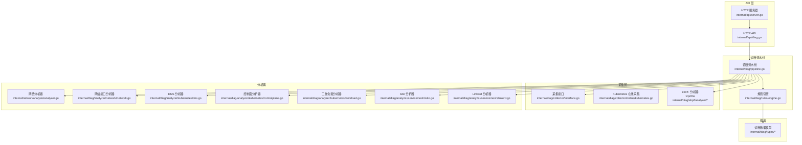
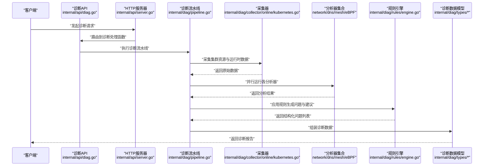
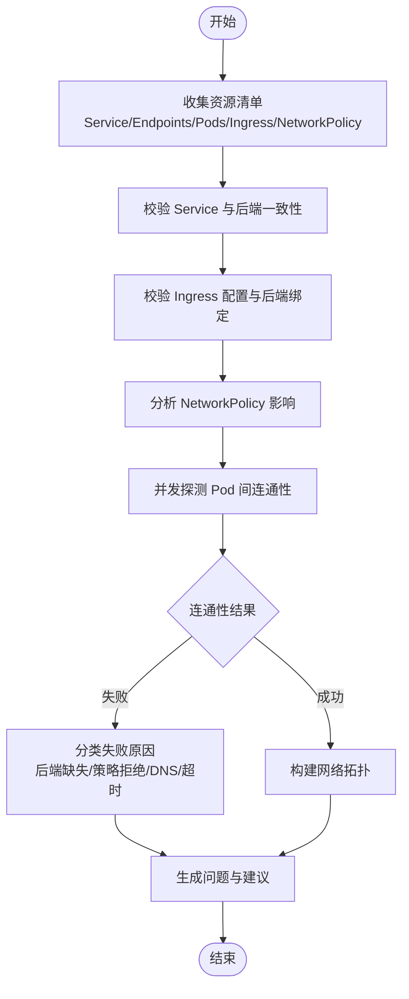
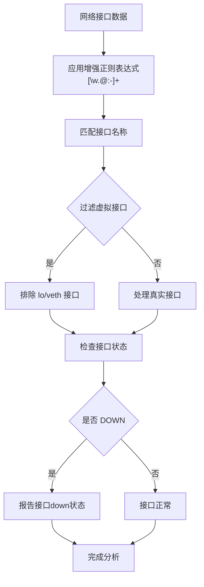
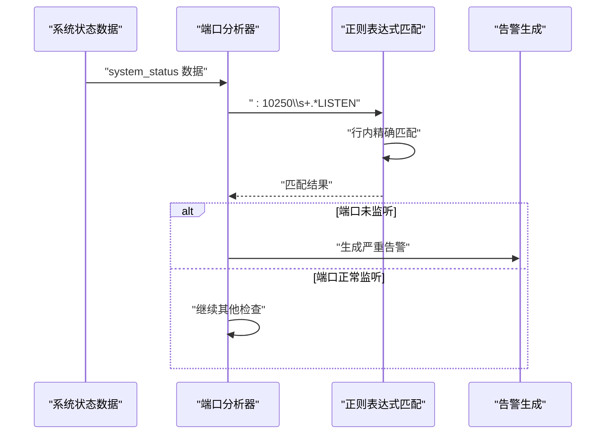
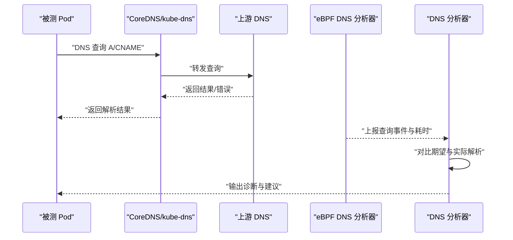
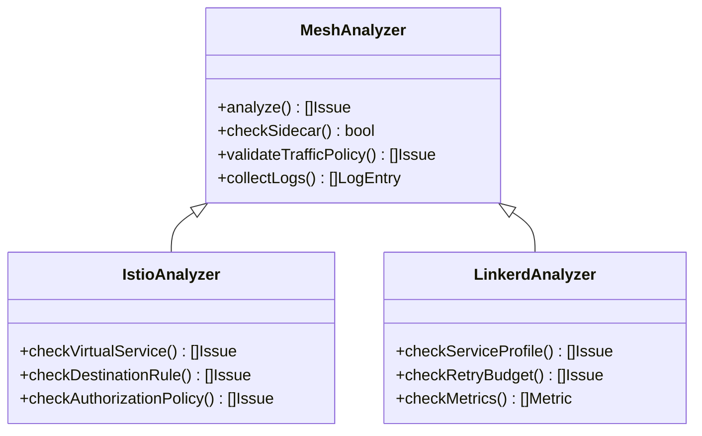
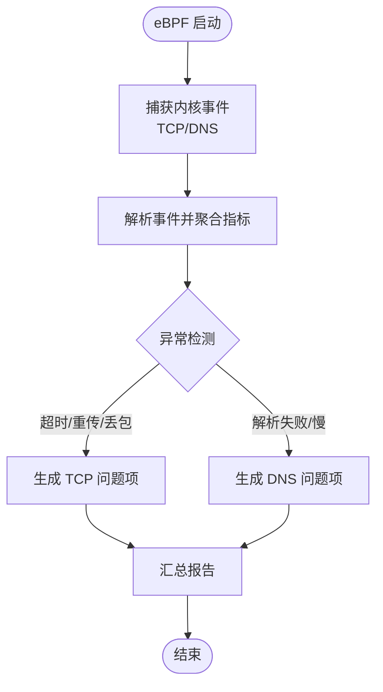
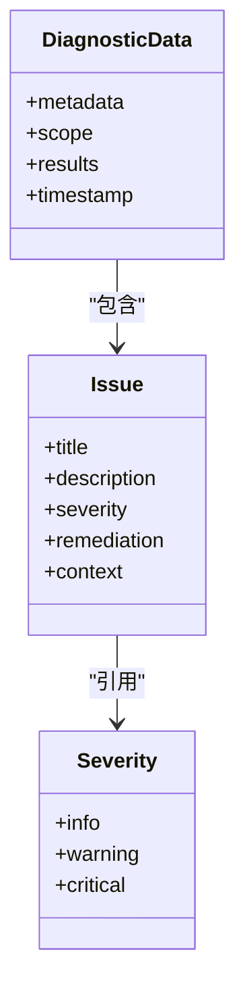
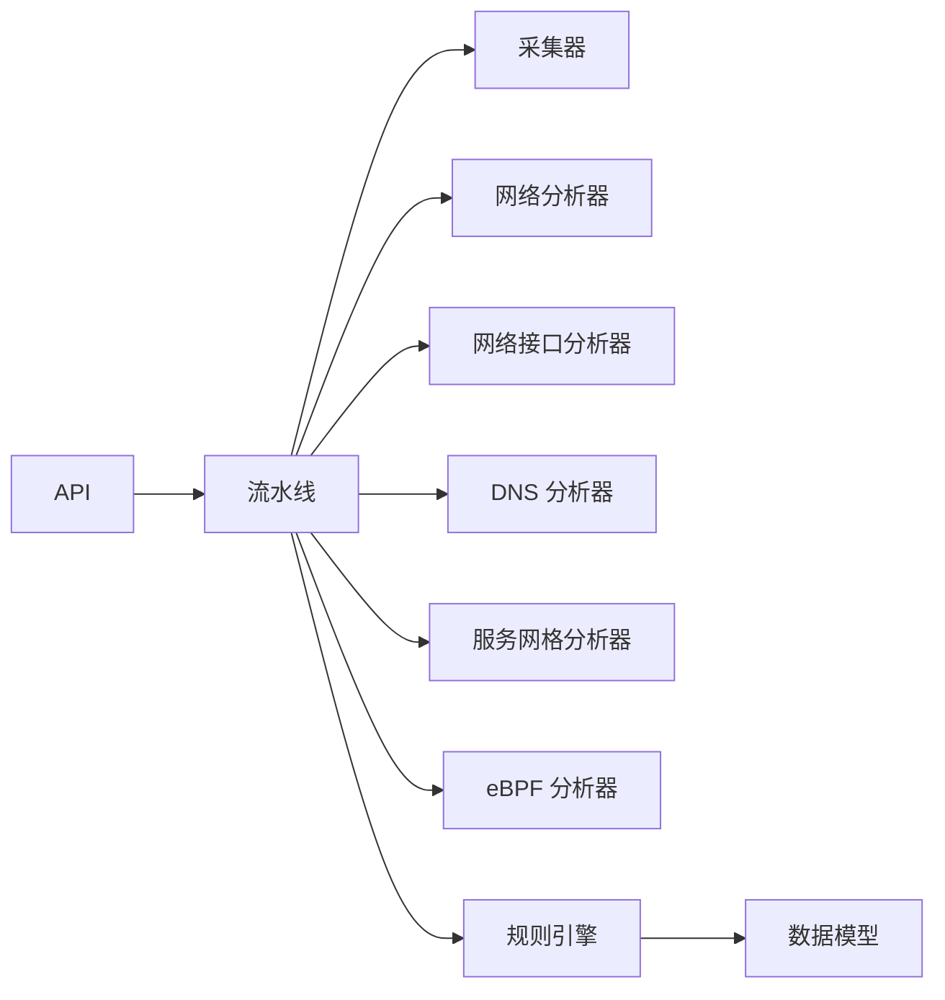

# 网络分析诊断

<cite>
**本文引用的文件**   
- [internal/networkanalysis/analyzer.go](file://internal/networkanalysis/analyzer.go)
- [internal/diag/analyzer/network/network.go](file://internal/diag/analyzer/network/network.go)
- [internal/diag/analyzer/network/network_test.go](file://internal/diag/analyzer/network/network_test.go)
- [internal/diag/analyzer/kubernetes/dns.go](file://internal/diag/analyzer/kubernetes/dns.go)
- [internal/diag/analyzer/kubernetes/controlplane.go](file://internal/diag/analyzer/kubernetes/controlplane.go)
- [internal/diag/analyzer/kubernetes/workload.go](file://internal/diag/analyzer/kubernetes/workload.go)
- [internal/diag/analyzer/servicemesh/istio.go](file://internal/diag/analyzer/servicemesh/istio.go)
- [internal/diag/analyzer/servicemesh/linkerd.go](file://internal/diag/analyzer/servicemesh/linkerd.go)
- [internal/diag/analyzer/servicemesh/servicemesh_test.go](file://internal/diag/analyzer/servicemesh/servicemesh_test.go)
- [internal/diag/types/diagnostic_data.go](file://internal/diag/types/diagnostic_data.go)
- [internal/diag/types/issue.go](file://internal/diag/types/issue.go)
- [internal/diag/types/severity.go](file://internal/diag/types/severity.go)
- [internal/diag/pipeline.go](file://internal/diag/pipeline.go)
- [internal/api/diag.go](file://internal/api/diag.go)
- [internal/api/server.go](file://internal/api/server.go)
- [internal/diag/ebpf/analyzer/tcp_analyzer.go](file://internal/diag/ebpf/analyzer/tcp_analyzer.go)
- [internal/diag/ebpf/analyzer/dns_analyzer.go](file://internal/diag/ebpf/analyzer/dns_analyzer.go)
- [internal/diag/collector/interface.go](file://internal/diag/collector/interface.go)
- [internal/diag/collector/online/kubernetes.go](file://internal/diag/collector/online/kubernetes.go)
- [internal/diag/rules/engine.go](file://internal/diag/rules/engine.go)
- [internal/diag/rules/types.go](file://internal/diag/rules/types.go)
</cite>

## 更新摘要
**变更内容**   
- 更新了网络接口分析器的正则表达式模式，改进了接口名称匹配准确性
- 优化了 kubelet 端口检测逻辑，使用行内精确匹配避免漏报
- 增强了网络诊断的可靠性，特别是在复杂网络环境下的检测能力

## 目录
1. [简介](#简介)
2. [项目结构](#项目结构)
3. [核心组件](#核心组件)
4. [架构总览](#架构总览)
5. [详细组件分析](#详细组件分析)
6. [依赖关系分析](#依赖关系分析)
7. [性能考量](#性能考量)
8. [故障排查指南](#故障排查指南)
9. [结论](#结论)
10. [附录](#附录)

## 简介
本文件面向 Klaw 的网络分析诊断能力，系统性说明网络连接性测试、DNS 解析诊断、服务网格分析与网络拓扑发现。文档覆盖 Pod 间通信检测、Service 路由验证、Ingress 配置检查与网络策略分析；并提供自动诊断流程、连接超时分析、DNS 解析失败排查与服务发现问题定位方法，同时给出可操作的测试命令、结果解读与优化建议。

**最新更新**：网络分析器已改进正则表达式模式和 kubelet 端口检测逻辑，提升了在复杂网络环境下的诊断准确性和可靠性。

## 项目结构
Klaw 的网络诊断能力由"采集—分析—规则—报告"的流水线驱动，并通过 API 暴露给前端或外部系统。关键路径包括：
- 数据采集层：在线采集 Kubernetes 资源与运行时信息（如 eBPF）。
- 分析层：网络、DNS、控制面、工作负载、服务网格等专项分析器。
- 规则引擎：将分析结果映射为问题与建议。
- 输出层：统一诊断数据模型与多种报告格式。

**图表来源** 
- [internal/api/diag.go](file://internal/api/diag.go)
- [internal/api/server.go](file://internal/api/server.go)
- [internal/diag/pipeline.go](file://internal/diag/pipeline.go)
- [internal/diag/collector/interface.go](file://internal/diag/collector/interface.go)
- [internal/diag/collector/online/kubernetes.go](file://internal/diag/collector/online/kubernetes.go)
- [internal/networkanalysis/analyzer.go](file://internal/networkanalysis/analyzer.go)
- [internal/diag/analyzer/network/network.go](file://internal/diag/analyzer/network/network.go)
- [internal/diag/analyzer/kubernetes/dns.go](file://internal/diag/analyzer/kubernetes/dns.go)
- [internal/diag/analyzer/kubernetes/controlplane.go](file://internal/diag/analyzer/kubernetes/controlplane.go)
- [internal/diag/analyzer/kubernetes/workload.go](file://internal/diag/analyzer/kubernetes/workload.go)
- [internal/diag/analyzer/servicemesh/istio.go](file://internal/diag/analyzer/servicemesh/istio.go)
- [internal/diag/analyzer/servicemesh/linkerd.go](file://internal/diag/analyzer/servicemesh/linkerd.go)
- [internal/diag/ebpf/analyzer/tcp_analyzer.go](file://internal/diag/ebpf/analyzer/tcp_analyzer.go)
- [internal/diag/ebpf/analyzer/dns_analyzer.go](file://internal/diag/ebpf/analyzer/dns_analyzer.go)
- [internal/diag/rules/engine.go](file://internal/diag/rules/engine.go)
- [internal/diag/types/diagnostic_data.go](file://internal/diag/types/diagnostic_data.go)

**章节来源**
- [internal/api/diag.go](file://internal/api/diag.go)
- [internal/api/server.go](file://internal/api/server.go)
- [internal/diag/pipeline.go](file://internal/diag/pipeline.go)
- [internal/diag/collector/interface.go](file://internal/diag/collector/interface.go)
- [internal/diag/collector/online/kubernetes.go](file://internal/diag/collector/online/kubernetes.go)
- [internal/networkanalysis/analyzer.go](file://internal/networkanalysis/analyzer.go)
- [internal/diag/analyzer/network/network.go](file://internal/diag/analyzer/network/network.go)
- [internal/diag/analyzer/kubernetes/dns.go](file://internal/diag/analyzer/kubernetes/dns.go)
- [internal/diag/analyzer/kubernetes/controlplane.go](file://internal/diag/analyzer/kubernetes/controlplane.go)
- [internal/diag/analyzer/kubernetes/workload.go](file://internal/diag/analyzer/kubernetes/workload.go)
- [internal/diag/analyzer/servicemesh/istio.go](file://internal/diag/analyzer/servicemesh/istio.go)
- [internal/diag/analyzer/servicemesh/linkerd.go](file://internal/diag/analyzer/servicemesh/linkerd.go)
- [internal/diag/ebpf/analyzer/tcp_analyzer.go](file://internal/diag/ebpf/analyzer/tcp_analyzer.go)
- [internal/diag/ebpf/analyzer/dns_analyzer.go](file://internal/diag/ebpf/analyzer/dns_analyzer.go)
- [internal/diag/rules/engine.go](file://internal/diag/rules/engine.go)
- [internal/diag/types/diagnostic_data.go](file://internal/diag/types/diagnostic_data.go)

## 核心组件
- 网络分析器：负责连通性探测、拓扑发现、Service/Ingress/NetworkPolicy 校验与 Pod 间通信检测。
- **网络接口分析器**：基于改进的正则表达式模式，准确识别各种格式的网卡接口名称（支持 vxlan.calico、vethxxx@if5、br-xxxx 等复杂命名），检测接口状态并排除虚拟接口干扰。
- **端口分析器**：采用行内精确匹配算法检测 kubelet 端口监听状态，避免跨行匹配导致的漏报问题。
- DNS 分析器：基于 kube-dns/CoreDNS 与 eBPF 捕获，定位解析失败、延迟与缓存异常。
- 控制面与工作负载分析器：校验 Endpoint、EndpointSlice、Service、Ingress、Pod 状态及关联关系。
- 服务网格分析器：针对 Istio/Linkerd 的 Sidecar、TrafficPolicy、访问日志与链路追踪进行诊断。
- eBPF 分析器：从内核态抓取 TCP/DNS 事件，用于连接超时、重试、丢包与解析慢根因定位。
- 规则引擎：将原始分析结果转换为结构化问题与建议，支持严重级别与修复指引。
- 诊断数据模型：统一的 Issue、Severity、DiagnosticData 等类型，贯穿采集、分析、报告全链路。

**章节来源**
- [internal/networkanalysis/analyzer.go](file://internal/networkanalysis/analyzer.go)
- [internal/diag/analyzer/network/network.go](file://internal/diag/analyzer/network/network.go)
- [internal/diag/analyzer/kubernetes/dns.go](file://internal/diag/analyzer/kubernetes/dns.go)
- [internal/diag/analyzer/kubernetes/controlplane.go](file://internal/diag/analyzer/kubernetes/controlplane.go)
- [internal/diag/analyzer/kubernetes/workload.go](file://internal/diag/analyzer/kubernetes/workload.go)
- [internal/diag/analyzer/servicemesh/istio.go](file://internal/diag/analyzer/servicemesh/istio.go)
- [internal/diag/analyzer/servicemesh/linkerd.go](file://internal/diag/analyzer/servicemesh/linkerd.go)
- [internal/diag/ebpf/analyzer/tcp_analyzer.go](file://internal/diag/ebpf/analyzer/tcp_analyzer.go)
- [internal/diag/ebpf/analyzer/dns_analyzer.go](file://internal/diag/ebpf/analyzer/dns_analyzer.go)
- [internal/diag/rules/engine.go](file://internal/diag/rules/engine.go)
- [internal/diag/types/diagnostic_data.go](file://internal/diag/types/diagnostic_data.go)
- [internal/diag/types/issue.go](file://internal/diag/types/issue.go)
- [internal/diag/types/severity.go](file://internal/diag/types/severity.go)

## 架构总览
下图展示一次完整的网络诊断请求从 API 到分析器与规则引擎的调用序列，以及最终输出的诊断数据。

**图表来源** 
- [internal/api/diag.go](file://internal/api/diag.go)
- [internal/api/server.go](file://internal/api/server.go)
- [internal/diag/pipeline.go](file://internal/diag/pipeline.go)
- [internal/diag/collector/online/kubernetes.go](file://internal/diag/collector/online/kubernetes.go)
- [internal/diag/rules/engine.go](file://internal/diag/rules/engine.go)
- [internal/diag/types/diagnostic_data.go](file://internal/diag/types/diagnostic_data.go)

## 详细组件分析

### 网络分析器（连通性与拓扑）
- 功能要点
  - Pod 间连通性检测：基于目标 Service/Endpoint 与 Pod 标签选择器，构造探测任务并评估可达性。
  - Service 路由验证：校验 Service 端口、协议、后端 Endpoints/EndpointSlice 一致性。
  - Ingress 配置检查：校验 Host/Path、TLS、Backend Service 存在性与引用正确性。
  - 网络策略分析：识别 NetworkPolicy 对入站/出站流量的限制与潜在阻断。
  - 拓扑发现：聚合 Namespace、Service、Endpoints、Pods、Ingress、NetworkPolicy 构建可视化拓扑。
- 复杂度与性能
  - 扫描阶段 O(N) 遍历资源；连通性探测并发执行，受限于集群规模与网络带宽。
- 错误处理
  - 区分不可达原因（无后端、策略拒绝、DNS 失败、超时），归类为不同问题项。

**图表来源** 
- [internal/networkanalysis/analyzer.go](file://internal/networkanalysis/analyzer.go)

**章节来源**
- [internal/networkanalysis/analyzer.go](file://internal/networkanalysis/analyzer.go)
- [internal/diag/analyzer/kubernetes/controlplane.go](file://internal/diag/analyzer/kubernetes/controlplane.go)
- [internal/diag/analyzer/kubernetes/workload.go](file://internal/diag/analyzer/kubernetes/workload.go)

### 网络接口分析器（改进版）
**更新**：改进了正则表达式模式以支持更复杂的接口名称格式

- 功能要点
  - **增强的接口名称匹配**：使用 `[\w.@:-]+` 正则表达式，支持包含点号、连字符、冒号的复杂接口名（如 `vxlan.calico`、`veth123@if5`、`br-xxxx`）。
  - **智能接口过滤**：自动排除 loopback (`lo`) 和虚拟以太网 (`veth*`) 接口，避免误报。
  - **DOWN 状态检测**：准确识别处于 DOWN 状态的物理和网络接口。
- 技术改进
  - 旧版本使用简单的 `\w+` 模式，无法匹配现代容器网络中的复杂接口命名。
  - 新版本支持 Calico、Flannel 等 CNI 插件生成的复杂接口名称。
- 典型场景
  - 检测 CNI 插件创建的隧道接口是否正常工作。
  - 监控多网卡环境下的接口状态变化。

**图表来源** 
- [internal/diag/analyzer/network/network.go:43-57](file://internal/diag/analyzer/network/network.go#L43-L57)

**章节来源**
- [internal/diag/analyzer/network/network.go:15-72](file://internal/diag/analyzer/network/network.go#L15-L72)
- [internal/diag/analyzer/network/network_test.go:53-109](file://internal/diag/analyzer/network/network_test.go#L53-L109)

### 端口分析器（kubelet 端口检测改进）
**更新**：优化了 kubelet 端口检测逻辑，使用行内精确匹配避免漏报

- 功能要点
  - **行内精确匹配**：使用 `:10250\s+.*LISTEN` 正则表达式，确保在同一行内同时匹配端口号和 LISTEN 状态。
  - **避免跨行误判**：防止同一文件中不同行的 ":10250" 和 "LISTEN" 被错误匹配。
  - **关键端口监控**：专门监控 kubelet 服务的 10250 端口监听状态。
- 技术改进
  - 旧版本可能因为全文搜索导致跨行匹配，产生误报或漏报。
  - 新版本通过行级匹配确保检测准确性。
- 故障场景
  - 当 kubelet 未启动或崩溃时，及时发出严重告警。
  - 避免因系统日志格式变化导致的检测失效。

**图表来源** 
- [internal/diag/analyzer/network/network.go:145-158](file://internal/diag/analyzer/network/network.go#L145-L158)

**章节来源**
- [internal/diag/analyzer/network/network.go:117-161](file://internal/diag/analyzer/network/network.go#L117-L161)
- [internal/diag/analyzer/network/network_test.go:208-239](file://internal/diag/analyzer/network/network_test.go#L208-L239)

### DNS 解析诊断
- 功能要点
  - 基于 CoreDNS/kube-dns 配置与日志，结合 eBPF 抓取的 DNS 查询事件，定位解析失败、延迟高、缓存未命中等问题。
  - 校验 ClusterIP、Headless Service、ExternalName 与 CNAME 链路的正确性。
- 常见问题
  - 解析超时：上游 DNS 不可达、转发配置错误、节点网络隔离。
  - 解析失败：记录不存在、CNAME 循环、权限不足。
  - 解析缓慢：缓存未命中、频繁重建、上游响应慢。
- 自动化诊断
  - 自动比对期望解析结果与实际解析结果，输出差异与修复建议。

**图表来源** 
- [internal/diag/analyzer/kubernetes/dns.go](file://internal/diag/analyzer/kubernetes/dns.go)
- [internal/diag/ebpf/analyzer/dns_analyzer.go](file://internal/diag/ebpf/analyzer/dns_analyzer.go)

**章节来源**
- [internal/diag/analyzer/kubernetes/dns.go](file://internal/diag/analyzer/kubernetes/dns.go)
- [internal/diag/ebpf/analyzer/dns_analyzer.go](file://internal/diag/ebpf/analyzer/dns_analyzer.go)

### 服务网格分析（Istio/Linkerd）
- 功能要点
  - 检测 Sidecar 注入状态、mTLS 配置、访问策略（AuthorizationPolicy/VirtualService/TrafficRoute）。
  - 分析流量路由、重试、熔断、超时设置是否合理。
  - 结合网格访问日志与链路追踪，定位跨服务调用失败与延迟热点。
- 典型问题
  - Sidecar 未注入导致 mTLS 不生效。
  - 路由规则冲突或优先级错误。
  - 超时/重试策略不当引发级联失败。

**图表来源** 
- [internal/diag/analyzer/servicemesh/istio.go](file://internal/diag/analyzer/servicemesh/istio.go)
- [internal/diag/analyzer/servicemesh/linkerd.go](file://internal/diag/analyzer/servicemesh/linkerd.go)

**章节来源**
- [internal/diag/analyzer/servicemesh/istio.go](file://internal/diag/analyzer/servicemesh/istio.go)
- [internal/diag/analyzer/servicemesh/linkerd.go](file://internal/diag/analyzer/servicemesh/linkerd.go)
- [internal/diag/analyzer/servicemesh/servicemesh_test.go](file://internal/diag/analyzer/servicemesh/servicemesh_test.go)

### eBPF 网络分析（TCP/DNS）
- 功能要点
  - 捕获 TCP 连接建立、重传、RST、关闭事件，统计连接时长、超时率、丢包率。
  - 捕获 DNS 查询/响应事件，统计解析耗时、失败率、缓存命中率。
- 适用场景
  - 连接超时根因定位（服务端不可达、防火墙拦截、拥塞）。
  - DNS 解析慢根因定位（上游延迟、缓存失效、解析链过长）。

**图表来源** 
- [internal/diag/ebpf/analyzer/tcp_analyzer.go](file://internal/diag/ebpf/analyzer/tcp_analyzer.go)
- [internal/diag/ebpf/analyzer/dns_analyzer.go](file://internal/diag/ebpf/analyzer/dns_analyzer.go)

**章节来源**
- [internal/diag/ebpf/analyzer/tcp_analyzer.go](file://internal/diag/ebpf/analyzer/tcp_analyzer.go)
- [internal/diag/ebpf/analyzer/dns_analyzer.go](file://internal/diag/ebpf/analyzer/dns_analyzer.go)

### 控制面与工作负载分析
- 功能要点
  - 校验 Control Plane 组件健康度（API Server、Scheduler、Controller Manager、etcd）。
  - 校验 Workload 资源（Deployment/StatefulSet/DaemonSet）与 Service/Ingress 的关联关系。
  - 识别 Endpoint/EndpointSlice 不一致、Pod 就绪探针失败、滚动更新卡住等问题。

**章节来源**
- [internal/diag/analyzer/kubernetes/controlplane.go](file://internal/diag/analyzer/kubernetes/controlplane.go)
- [internal/diag/analyzer/kubernetes/workload.go](file://internal/diag/analyzer/kubernetes/workload.go)

### 规则引擎与诊断数据模型
- 规则引擎
  - 将分析器的原始结果映射为 Issue，附带严重级别、上下文信息与修复建议。
  - 支持规则加载、匹配与优先级排序。
- 数据模型
  - DiagnosticData：封装一次诊断的元数据、时间戳、范围与结果。
  - Issue/Severity：问题描述与严重级别定义。

**图表来源** 
- [internal/diag/types/diagnostic_data.go](file://internal/diag/types/diagnostic_data.go)
- [internal/diag/types/issue.go](file://internal/diag/types/issue.go)
- [internal/diag/types/severity.go](file://internal/diag/types/severity.go)
- [internal/diag/rules/engine.go](file://internal/diag/rules/engine.go)
- [internal/diag/rules/types.go](file://internal/diag/rules/types.go)

**章节来源**
- [internal/diag/rules/engine.go](file://internal/diag/rules/engine.go)
- [internal/diag/rules/types.go](file://internal/diag/rules/types.go)
- [internal/diag/types/diagnostic_data.go](file://internal/diag/types/diagnostic_data.go)
- [internal/diag/types/issue.go](file://internal/diag/types/issue.go)
- [internal/diag/types/severity.go](file://internal/diag/types/severity.go)

## 依赖关系分析
- 组件耦合
  - API 层依赖诊断流水线；流水线依赖采集器与分析器；分析器通过规则引擎产出结构化问题；最终通过数据模型输出。
- 外部依赖
  - Kubernetes API Server、CoreDNS/kube-dns、服务网格控制平面（Istio/Linkerd）、内核 eBPF 子系统。
- 潜在循环依赖
  - 分析器之间保持松耦合，通过流水线协调；避免直接相互导入。

**图表来源** 
- [internal/api/diag.go](file://internal/api/diag.go)
- [internal/diag/pipeline.go](file://internal/diag/pipeline.go)
- [internal/diag/collector/interface.go](file://internal/diag/collector/interface.go)
- [internal/networkanalysis/analyzer.go](file://internal/networkanalysis/analyzer.go)
- [internal/diag/analyzer/network/network.go](file://internal/diag/analyzer/network/network.go)
- [internal/diag/analyzer/kubernetes/dns.go](file://internal/diag/analyzer/kubernetes/dns.go)
- [internal/diag/analyzer/servicemesh/istio.go](file://internal/diag/analyzer/servicemesh/istio.go)
- [internal/diag/ebpf/analyzer/tcp_analyzer.go](file://internal/diag/ebpf/analyzer/tcp_analyzer.go)
- [internal/diag/rules/engine.go](file://internal/diag/rules/engine.go)
- [internal/diag/types/diagnostic_data.go](file://internal/diag/types/diagnostic_data.go)

**章节来源**
- [internal/api/diag.go](file://internal/api/diag.go)
- [internal/diag/pipeline.go](file://internal/diag/pipeline.go)
- [internal/diag/collector/interface.go](file://internal/diag/collector/interface.go)
- [internal/networkanalysis/analyzer.go](file://internal/networkanalysis/analyzer.go)
- [internal/diag/analyzer/network/network.go](file://internal/diag/analyzer/network/network.go)
- [internal/diag/analyzer/kubernetes/dns.go](file://internal/diag/analyzer/kubernetes/dns.go)
- [internal/diag/analyzer/servicemesh/istio.go](file://internal/diag/analyzer/servicemesh/istio.go)
- [internal/diag/ebpf/analyzer/tcp_analyzer.go](file://internal/diag/ebpf/analyzer/tcp_analyzer.go)
- [internal/diag/rules/engine.go](file://internal/diag/rules/engine.go)
- [internal/diag/types/diagnostic_data.go](file://internal/diag/types/diagnostic_data.go)

## 性能考量
- 并发与限流
  - 分析器并行执行，需限制并发度以避免压垮 API Server 或网络栈。
- 采样与窗口
  - eBPF 事件聚合采用滑动窗口，避免内存膨胀；对高频事件进行降采样。
- I/O 与缓存
  - 对重复查询的资源使用本地缓存；减少不必要的远程调用。
- 资源占用
  - 在大规模集群中，优先聚焦受影响命名空间与关键服务，缩小扫描范围。
- **正则表达式优化**
  - 改进的正则表达式模式提高了匹配效率，减少了不必要的回溯操作。
  - 行内精确匹配避免了全文搜索的性能开销。

## 故障排查指南
- 连接超时分析
  - 现象：Pod 间或对外访问出现超时。
  - 排查步骤：检查 Service 后端是否存在；确认 NetworkPolicy 是否放行；查看 eBPF TCP 事件的重传与 RST；核对上游服务健康。
  - 建议：调整超时阈值、增加重试与退避、优化后端容量与负载均衡策略。
- DNS 解析失败排查
  - 现象：域名无法解析或解析极慢。
  - 排查步骤：检查 CoreDNS 配置与插件；查看 eBPF DNS 事件与日志；验证上游 DNS 可达性与缓存命中。
  - 建议：修正转发配置、优化缓存策略、缩短解析链。
- 服务发现问题定位
  - 现象：Service 无法路由到 Pod。
  - 排查步骤：校验 Selector 与 Pod 标签；检查 Endpoint/EndpointSlice；确认就绪探针通过；验证 Ingress Backend 引用。
  - 建议：修正标签选择器、修复探针逻辑、调整 Ingress 配置。
- 服务网格问题定位
  - 现象：跨服务调用失败或延迟升高。
  - 排查步骤：检查 Sidecar 注入与 mTLS；验证路由策略与访问控制；分析网格日志与链路追踪。
  - 建议：修正路由规则、调整重试/熔断参数、确保 Sidecar 正常。
- **网络接口问题排查（新增）**
  - 现象：特定接口状态异常导致网络中断。
  - 排查步骤：检查接口名称是否符合预期格式；确认 CNI 插件正常运行；验证接口配置是否正确。
  - 建议：重启相关网络插件、检查物理网络连接、验证接口驱动状态。
- **kubelet 端口问题排查（新增）**
  - 现象：kubelet 服务不可用导致节点管理异常。
  - 排查步骤：检查 10250 端口监听状态；查看 kubelet 服务日志；验证系统资源使用情况。
  - 建议：重启 kubelet 服务、检查系统资源、验证配置文件语法。

**章节来源**
- [internal/diag/ebpf/analyzer/tcp_analyzer.go](file://internal/diag/ebpf/analyzer/tcp_analyzer.go)
- [internal/diag/ebpf/analyzer/dns_analyzer.go](file://internal/diag/ebpf/analyzer/dns_analyzer.go)
- [internal/diag/analyzer/kubernetes/dns.go](file://internal/diag/analyzer/kubernetes/dns.go)
- [internal/diag/analyzer/kubernetes/controlplane.go](file://internal/diag/analyzer/kubernetes/controlplane.go)
- [internal/diag/analyzer/kubernetes/workload.go](file://internal/diag/analyzer/kubernetes/workload.go)
- [internal/diag/analyzer/servicemesh/istio.go](file://internal/diag/analyzer/servicemesh/istio.go)
- [internal/diag/analyzer/servicemesh/linkerd.go](file://internal/diag/analyzer/servicemesh/linkerd.go)
- [internal/diag/analyzer/network/network.go](file://internal/diag/analyzer/network/network.go)

## 结论
Klaw 的网络分析诊断体系以流水线为核心，整合了网络、DNS、控制面、工作负载与服务网格等多维度分析能力，并结合 eBPF 提供内核级观测。通过规则引擎将原始数据转化为可操作的问题与建议，帮助快速定位与修复网络问题。

**最新改进**：网络分析器通过改进的正则表达式模式和增强的 kubelet 端口检测逻辑，显著提升了在复杂网络环境下的诊断准确性和可靠性。这些改进特别适用于现代容器化环境中常见的复杂接口命名和多进程场景。

建议在大规模环境中按需启用分析器、合理设置并发与采样策略，以获得最佳性能与准确性。

## 附录
- 常用网络测试命令（示例）
  - 连通性测试：curl/wget 访问 Service/Ingress；telnet/nc 测试端口可达性。
  - DNS 测试：dig/nslookup/host 验证解析结果与耗时。
  - 路由验证：kubectl get endpoints/endpointslice；kubectl describe service。
  - 策略检查：kubectl get networkpolicy -o yaml；kubectl auth can-i --list。
  - 网格观察：istioctl proxy-status/proxy-config；linkerd check/profile。
  - **接口检查**：ip link show；ip addr show；cat /proc/net/dev。
  - **端口检查**：ss -tlnp | grep 10250；netstat -tlnp | grep 10250。
- 诊断结果解读
  - 关注 Issue 的严重级别、上下文信息与修复建议；结合 eBPF 事件与日志交叉验证。
  - **特别注意**：对于网络接口问题，关注接口名称格式和状态变化；对于 kubelet 端口问题，确认端口监听状态和服务健康。
- 优化建议
  - 精简 NetworkPolicy 规则；优化 DNS 缓存与上游配置；调整服务网格超时/重试策略；提升后端可用性与弹性。
  - **网络优化**：使用标准化的接口命名规范；定期监控关键端口状态；建立网络健康基线。