# 集群诊断分析

<cite>
**本文引用的文件**   
- [internal/diag/pipeline.go](file://internal/diag/pipeline.go)
- [internal/diag/import.go](file://internal/diag/import.go)
- [internal/diag/analyzer/interface.go](file://internal/diag/analyzer/interface.go)
- [internal/diag/analyzer/registry.go](file://internal/diag/analyzer/registry.go)
- [internal/diag/analyzer/kubernetes/kubernetes.go](file://internal/diag/analyzer/kubernetes/kubernetes.go)
- [internal/diag/analyzer/kubernetes/controlplane.go](file://internal/diag/analyzer/kubernetes/controlplane.go)
- [internal/diag/analyzer/kubernetes/workload.go](file://internal/diag/analyzer/kubernetes/workload.go)
- [internal/diag/analyzer/kubernetes/storage.go](file://internal/diag/analyzer/kubernetes/storage.go)
- [internal/diag/analyzer/kubernetes/network.go](file://internal/diag/analyzer/network/network.go)
- [internal/diag/analyzer/system/resource.go](file://internal/diag/analyzer/system/resource.go)
- [internal/diag/analyzer/log/log.go](file://internal/diag/analyzer/log/log.go)
- [internal/diag/analyzer/runtime/runtime.go](file://internal/diag/analyzer/runtime/runtime.go)
- [internal/diag/analyzer/security/cis.go](file://internal/diag/analyzer/security/cis.go)
- [internal/diag/analyzer/servicemesh/istio.go](file://internal/diag/analyzer/servicemesh/istio.go)
- [internal/diag/collector/interface.go](file://internal/diag/collector/interface.go)
- [internal/diag/collector/online/kubernetes.go](file://internal/diag/collector/online/kubernetes.go)
- [internal/diag/collector/offline/directory.go](file://internal/diag/collector/offline/directory.go)
- [internal/diag/rules/engine.go](file://internal/diag/rules/engine.go)
- [internal/diag/rules/loader.go](file://internal/diag/rules/loader.go)
- [internal/diag/rules/types.go](file://internal/diag/rules/types.go)
- [internal/diag/rca/engine.go](file://internal/diag/rca/engine.go)
- [internal/diag/reporter/interface.go](file://internal/diag/reporter/interface.go)
- [internal/diag/reporter/html.go](file://internal/diag/reporter/html.go)
- [internal/diag/reporter/json.go](file://internal/diag/reporter/json.go)
- [internal/diag/reporter/text.go](file://internal/diag/reporter/text.go)
- [internal/diag/reporter/grafana.go](file://internal/diag/reporter/grafana.go)
- [internal/diag/types/diagnostic_data.go](file://internal/diag/types/diagnostic_data.go)
- [internal/diag/types/issue.go](file://internal/diag/types/issue.go)
- [internal/diag/types/severity.go](file://internal/diag/types/severity.go)
- [internal/api/diag.go](file://internal/api/diag.go)
- [operator/controllers/clusterdiagnostic_controller.go](file://operator/controllers/clusterdiagnostic_controller.go)
- [operator/controllers/nodediagnostic_controller.go](file://operator/controllers/nodediagnostic_controller.go)
- [operator/api/v1/clusterdiagnostic_types.go](file://operator/api/v1/clusterdiagnostic_types.go)
- [operator/api/v1/nodediagnostic_types.go](file://operator/api/v1/nodediagnostic_types.go)
</cite>

## 目录
1. [简介](#简介)
2. [项目结构](#项目结构)
3. [核心组件](#核心组件)
4. [架构总览](#架构总览)
5. [详细组件分析](#详细组件分析)
6. [依赖关系分析](#依赖关系分析)
7. [性能考虑](#性能考虑)
8. [故障排查指南](#故障排查指南)
9. [结论](#结论)
10. [附录](#附录)

## 简介
本文件面向 Klaw 的“集群诊断分析”能力，系统性阐述诊断引擎的架构设计、数据采集管道、规则匹配机制与分析器插件体系。文档覆盖 Kubernetes 资源健康检查、性能指标采集、异常检测与根因分析（RCA），并提供诊断流程配置、自定义分析器开发、报告生成与性能优化建议，以及 API 调用示例与排障指引。读者无需深入源码即可理解整体工作原理与扩展方式。

## 项目结构
Klaw 的诊断子系统位于 internal/diag 目录，围绕“采集—分析—规则—报告”的流水线组织代码；Operator 侧通过 CRD 控制器驱动周期性或事件触发的诊断任务；API 层暴露统一的诊断接口供前端或外部系统调用。

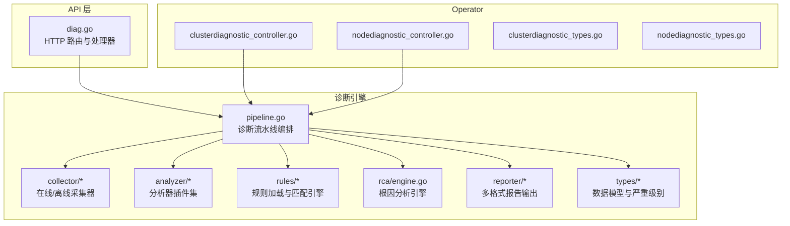

**图表来源** 
- [internal/api/diag.go](file://internal/api/diag.go)
- [internal/diag/pipeline.go](file://internal/diag/pipeline.go)
- [internal/diag/collector/interface.go](file://internal/diag/collector/interface.go)
- [internal/diag/analyzer/interface.go](file://internal/diag/analyzer/interface.go)
- [internal/diag/rules/engine.go](file://internal/diag/rules/engine.go)
- [internal/diag/rca/engine.go](file://internal/diag/rca/engine.go)
- [internal/diag/reporter/interface.go](file://internal/diag/reporter/interface.go)
- [operator/controllers/clusterdiagnostic_controller.go](file://operator/controllers/clusterdiagnostic_controller.go)
- [operator/controllers/nodediagnostic_controller.go](file://operator/controllers/nodediagnostic_controller.go)
- [operator/api/v1/clusterdiagnostic_types.go](file://operator/api/v1/clusterdiagnostic_types.go)
- [operator/api/v1/nodediagnostic_types.go](file://operator/api/v1/nodediagnostic_types.go)

**章节来源**
- [internal/api/diag.go](file://internal/api/diag.go)
- [internal/diag/pipeline.go](file://internal/diag/pipeline.go)
- [internal/diag/collector/interface.go](file://internal/diag/collector/interface.go)
- [internal/diag/analyzer/interface.go](file://internal/diag/analyzer/interface.go)
- [internal/diag/rules/engine.go](file://internal/diag/rules/engine.go)
- [internal/diag/rca/engine.go](file://internal/diag/rca/engine.go)
- [internal/diag/reporter/interface.go](file://internal/diag/reporter/interface.go)
- [operator/controllers/clusterdiagnostic_controller.go](file://operator/controllers/clusterdiagnostic_controller.go)
- [operator/controllers/nodediagnostic_controller.go](file://operator/controllers/nodediagnostic_controller.go)
- [operator/api/v1/clusterdiagnostic_types.go](file://operator/api/v1/clusterdiagnostic_types.go)
- [operator/api/v1/nodediagnostic_types.go](file://operator/api/v1/nodediagnostic_types.go)

## 核心组件
- 诊断流水线（Pipeline）：统一编排采集、分析、规则匹配、RCA 与报告输出，支持并行执行与错误隔离。
- 采集器（Collector）：提供在线（Kubernetes API）与离线（目录快照）两种模式，屏蔽底层差异。
- 分析器（Analyzer）：插件化实现，按领域划分（Kubernetes 控制面/工作负载/存储/网络/运行时/日志/安全/服务网格等）。
- 规则引擎（Rules）：加载 YAML/JSON 规则，对分析结果进行匹配、评分与告警。
- 根因分析（RCA）：基于关联图与因果链推断问题根因，输出可操作修复建议。
- 报告器（Reporter）：支持 HTML、JSON、文本、SARIF、Grafana 等多种输出格式。
- 类型定义（Types）：诊断数据、问题项、严重级别等核心数据结构。

**章节来源**
- [internal/diag/pipeline.go](file://internal/diag/pipeline.go)
- [internal/diag/collector/interface.go](file://internal/diag/collector/interface.go)
- [internal/diag/analyzer/interface.go](file://internal/diag/analyzer/interface.go)
- [internal/diag/rules/engine.go](file://internal/diag/rules/engine.go)
- [internal/diag/rca/engine.go](file://internal/diag/rca/engine.go)
- [internal/diag/reporter/interface.go](file://internal/diag/reporter/interface.go)
- [internal/diag/types/diagnostic_data.go](file://internal/diag/types/diagnostic_data.go)
- [internal/diag/types/issue.go](file://internal/diag/types/issue.go)
- [internal/diag/types/severity.go](file://internal/diag/types/severity.go)

## 架构总览
下图展示从 API 到 Operator 触发、再到诊断流水线执行的端到端流程。

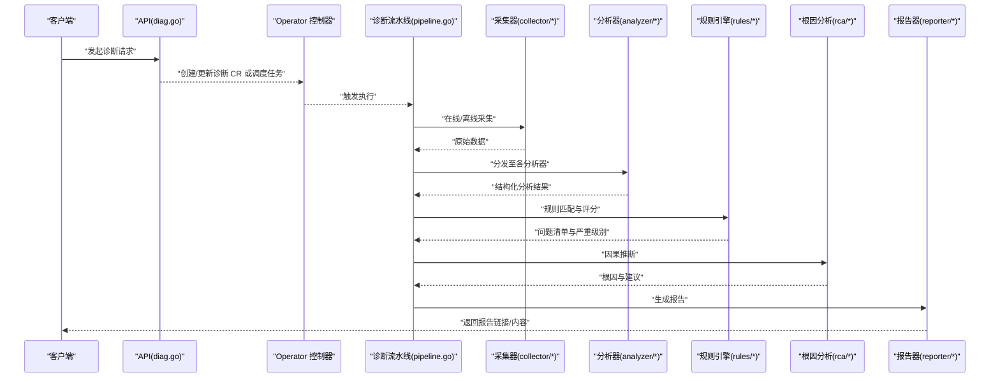

**图表来源** 
- [internal/api/diag.go](file://internal/api/diag.go)
- [operator/controllers/clusterdiagnostic_controller.go](file://operator/controllers/clusterdiagnostic_controller.go)
- [internal/diag/pipeline.go](file://internal/diag/pipeline.go)
- [internal/diag/collector/interface.go](file://internal/diag/collector/interface.go)
- [internal/diag/analyzer/interface.go](file://internal/diag/analyzer/interface.go)
- [internal/diag/rules/engine.go](file://internal/diag/rules/engine.go)
- [internal/diag/rca/engine.go](file://internal/diag/rca/engine.go)
- [internal/diag/reporter/interface.go](file://internal/diag/reporter/interface.go)

## 详细组件分析

### 诊断流水线（Pipeline）
- 职责：编排采集、分析、规则匹配、RCA 与报告生成；管理并发、超时、重试与错误传播。
- 关键特性：
  - 阶段化执行，支持跳过失败阶段并继续后续步骤。
  - 上下文传递诊断 ID、时间窗口、命名空间过滤等参数。
  - 中间结果缓存，避免重复采集与分析。

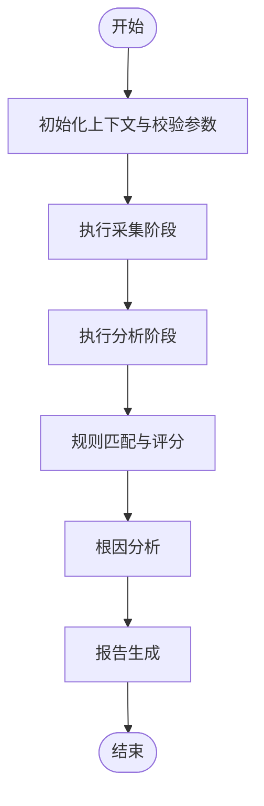

**图表来源** 
- [internal/diag/pipeline.go](file://internal/diag/pipeline.go)

**章节来源**
- [internal/diag/pipeline.go](file://internal/diag/pipeline.go)

### 数据采集管道（Collector）
- 在线采集器（Kubernetes）：通过 Kubernetes API 获取集群状态、事件、指标与日志片段。
- 离线采集器（Directory）：读取本地目录中的快照文件，用于无集群环境或回溯分析。
- 抽象接口：统一采集入口，便于扩展新的数据源。

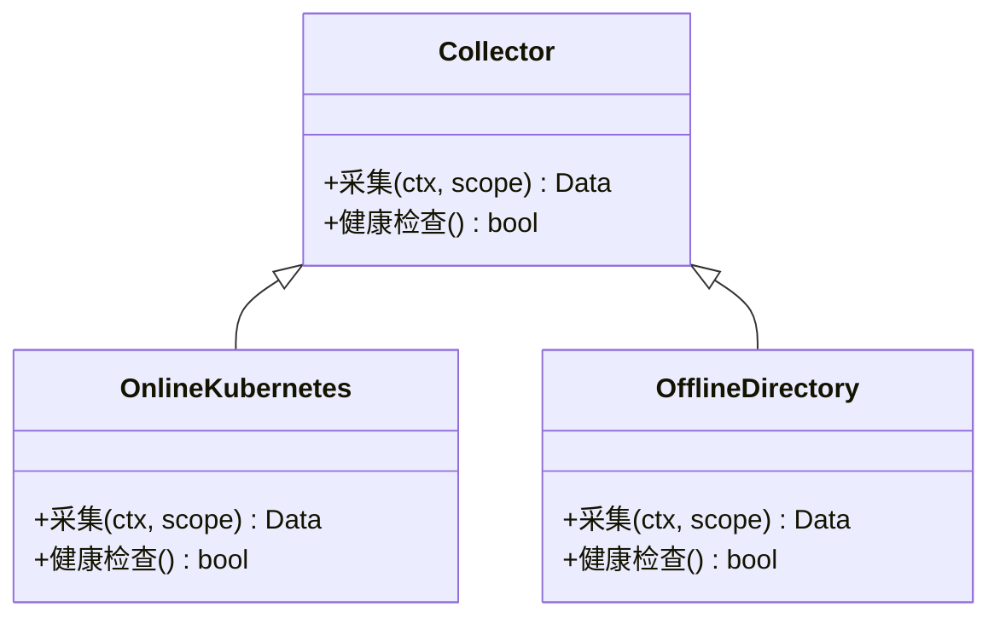

**图表来源** 
- [internal/diag/collector/interface.go](file://internal/diag/collector/interface.go)
- [internal/diag/collector/online/kubernetes.go](file://internal/diag/collector/online/kubernetes.go)
- [internal/diag/collector/offline/directory.go](file://internal/diag/collector/offline/directory.go)

**章节来源**
- [internal/diag/collector/interface.go](file://internal/diag/collector/interface.go)
- [internal/diag/collector/online/kubernetes.go](file://internal/diag/collector/online/kubernetes.go)
- [internal/diag/collector/offline/directory.go](file://internal/diag/collector/offline/directory.go)

### 分析器插件系统（Analyzer）
- 插件注册：通过注册表集中管理分析器实例，支持动态发现与版本兼容。
- 领域分析器：
  - Kubernetes 控制面：API Server、etcd、Scheduler、Controller Manager 健康检查。
  - 工作负载：Deployment/StatefulSet/DaemonSet/Pod 状态与就绪探针。
  - 存储：PV/PVC/StorageClass 与 CSI 插件健康。
  - 网络：Service/Ingress/CNI 连通性与 DNS 解析。
  - 运行时：容器运行时状态与镜像拉取问题。
  - 日志：关键字与错误模式匹配。
  - 安全：CIS 基准、RBAC 权限审计。
  - 服务网格：Istio/Linkerd 流量与策略健康。
- 扩展点：实现统一接口，并在注册表中注册。

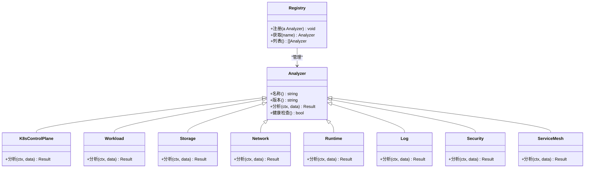

**图表来源** 
- [internal/diag/analyzer/interface.go](file://internal/diag/analyzer/interface.go)
- [internal/diag/analyzer/registry.go](file://internal/diag/analyzer/registry.go)
- [internal/diag/analyzer/kubernetes/controlplane.go](file://internal/diag/analyzer/kubernetes/controlplane.go)
- [internal/diag/analyzer/kubernetes/workload.go](file://internal/diag/analyzer/kubernetes/workload.go)
- [internal/diag/analyzer/kubernetes/storage.go](file://internal/diag/analyzer/kubernetes/storage.go)
- [internal/diag/analyzer/kubernetes/network.go](file://internal/diag/analyzer/network/network.go)
- [internal/diag/analyzer/runtime/runtime.go](file://internal/diag/analyzer/runtime/runtime.go)
- [internal/diag/analyzer/log/log.go](file://internal/diag/analyzer/log/log.go)
- [internal/diag/analyzer/security/cis.go](file://internal/diag/analyzer/security/cis.go)
- [internal/diag/analyzer/servicemesh/istio.go](file://internal/diag/analyzer/servicemesh/istio.go)

**章节来源**
- [internal/diag/analyzer/interface.go](file://internal/diag/analyzer/interface.go)
- [internal/diag/analyzer/registry.go](file://internal/diag/analyzer/registry.go)
- [internal/diag/analyzer/kubernetes/kubernetes.go](file://internal/diag/analyzer/kubernetes/kubernetes.go)
- [internal/diag/analyzer/kubernetes/controlplane.go](file://internal/diag/analyzer/kubernetes/controlplane.go)
- [internal/diag/analyzer/kubernetes/workload.go](file://internal/diag/analyzer/kubernetes/workload.go)
- [internal/diag/analyzer/kubernetes/storage.go](file://internal/diag/analyzer/kubernetes/storage.go)
- [internal/diag/analyzer/kubernetes/network.go](file://internal/diag/analyzer/network/network.go)
- [internal/diag/analyzer/system/resource.go](file://internal/diag/analyzer/system/resource.go)
- [internal/diag/analyzer/log/log.go](file://internal/diag/analyzer/log/log.go)
- [internal/diag/analyzer/runtime/runtime.go](file://internal/diag/analyzer/runtime/runtime.go)
- [internal/diag/analyzer/security/cis.go](file://internal/diag/analyzer/security/cis.go)
- [internal/diag/analyzer/servicemesh/istio.go](file://internal/diag/analyzer/servicemesh/istio.go)

### 规则匹配机制（Rules）
- 规则加载：支持 YAML/JSON 规则文件，包含匹配条件、阈值、动作与优先级。
- 匹配引擎：遍历分析结果，应用规则，生成问题项与严重级别。
- 可扩展性：新增规则无需修改代码，仅需配置文件。

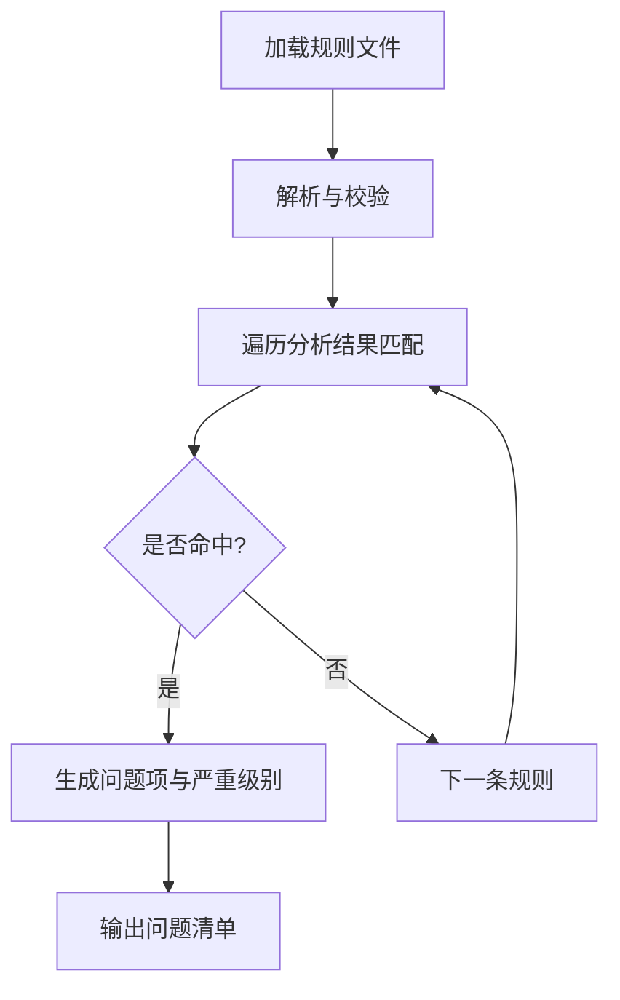

**图表来源** 
- [internal/diag/rules/loader.go](file://internal/diag/rules/loader.go)
- [internal/diag/rules/engine.go](file://internal/diag/rules/engine.go)
- [internal/diag/rules/types.go](file://internal/diag/rules/types.go)

**章节来源**
- [internal/diag/rules/loader.go](file://internal/diag/rules/loader.go)
- [internal/diag/rules/engine.go](file://internal/diag/rules/engine.go)
- [internal/diag/rules/types.go](file://internal/diag/rules/types.go)

### 根因分析（RCA）
- 输入：问题清单、拓扑关系、时序事件。
- 方法：构建因果图，结合规则与历史模式，定位最可能的根因节点。
- 输出：根因说明、影响范围、修复建议与验证步骤。

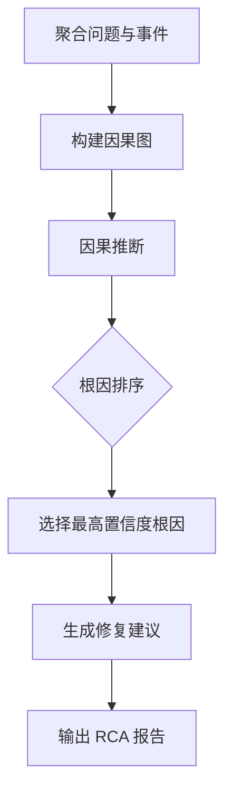

**图表来源** 
- [internal/diag/rca/engine.go](file://internal/diag/rca/engine.go)

**章节来源**
- [internal/diag/rca/engine.go](file://internal/diag/rca/engine.go)

### 报告生成（Reporter）
- 多格式输出：HTML 可视化、JSON 结构化、文本摘要、SARIF 安全扫描集成、Grafana 面板链接。
- 模板化：支持主题与字段定制，便于企业品牌化。
- 持久化：可选落盘或上传对象存储。

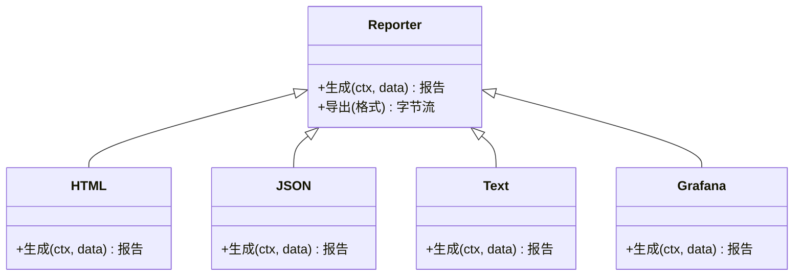

**图表来源** 
- [internal/diag/reporter/interface.go](file://internal/diag/reporter/interface.go)
- [internal/diag/reporter/html.go](file://internal/diag/reporter/html.go)
- [internal/diag/reporter/json.go](file://internal/diag/reporter/json.go)
- [internal/diag/reporter/text.go](file://internal/diag/reporter/text.go)
- [internal/diag/reporter/grafana.go](file://internal/diag/reporter/grafana.go)

**章节来源**
- [internal/diag/reporter/interface.go](file://internal/diag/reporter/interface.go)
- [internal/diag/reporter/html.go](file://internal/diag/reporter/html.go)
- [internal/diag/reporter/json.go](file://internal/diag/reporter/json.go)
- [internal/diag/reporter/text.go](file://internal/diag/reporter/text.go)
- [internal/diag/reporter/grafana.go](file://internal/diag/reporter/grafana.go)

### 数据类型与模型（Types）
- 诊断数据：采集与分析结果的统一载体。
- 问题项：描述问题、位置、严重级别、证据与建议。
- 严重级别：致命、严重、警告、提示等分级标准。

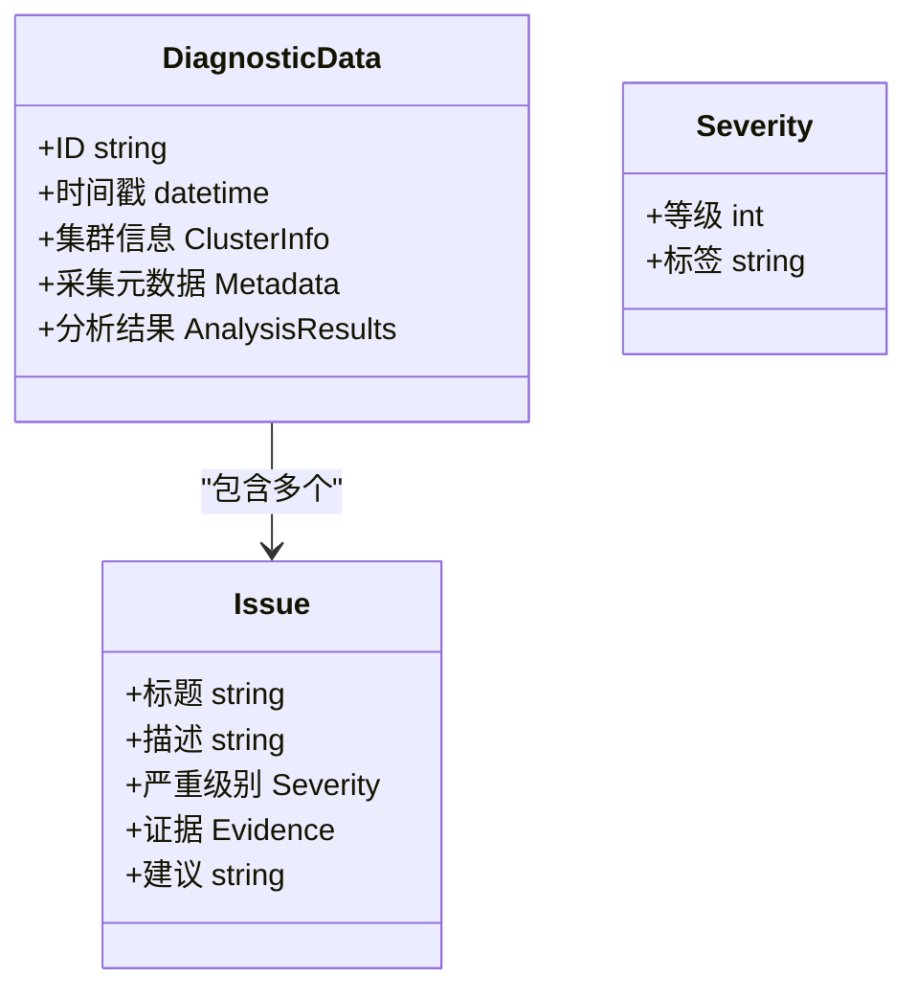

**图表来源** 
- [internal/diag/types/diagnostic_data.go](file://internal/diag/types/diagnostic_data.go)
- [internal/diag/types/issue.go](file://internal/diag/types/issue.go)
- [internal/diag/types/severity.go](file://internal/diag/types/severity.go)

**章节来源**
- [internal/diag/types/diagnostic_data.go](file://internal/diag/types/diagnostic_data.go)
- [internal/diag/types/issue.go](file://internal/diag/types/issue.go)
- [internal/diag/types/severity.go](file://internal/diag/types/severity.go)

### Operator 集成与控制平面
- ClusterDiagnostic/NodalDiagnostic CRD：声明式定义诊断任务目标、范围与频率。
- 控制器：监听 CR 变更，调度诊断流水线，管理生命周期与状态上报。

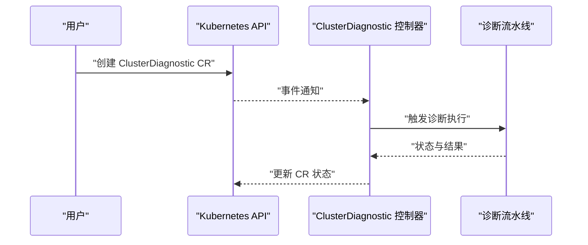

**图表来源** 
- [operator/api/v1/clusterdiagnostic_types.go](file://operator/api/v1/clusterdiagnostic_types.go)
- [operator/api/v1/nodediagnostic_types.go](file://operator/api/v1/nodediagnostic_types.go)
- [operator/controllers/clusterdiagnostic_controller.go](file://operator/controllers/clusterdiagnostic_controller.go)
- [operator/controllers/nodediagnostic_controller.go](file://operator/controllers/nodediagnostic_controller.go)

**章节来源**
- [operator/api/v1/clusterdiagnostic_types.go](file://operator/api/v1/clusterdiagnostic_types.go)
- [operator/api/v1/nodediagnostic_types.go](file://operator/api/v1/nodediagnostic_types.go)
- [operator/controllers/clusterdiagnostic_controller.go](file://operator/controllers/clusterdiagnostic_controller.go)
- [operator/controllers/nodediagnostic_controller.go](file://operator/controllers/nodediagnostic_controller.go)

## 依赖关系分析
- 松耦合：分析器与采集器通过接口解耦，规则与 RCA 仅依赖结构化数据。
- 扩展点：新增分析器只需实现接口并注册；新增报告器同理。
- 外部依赖：Kubernetes API、对象存储、Grafana 等通过配置注入。

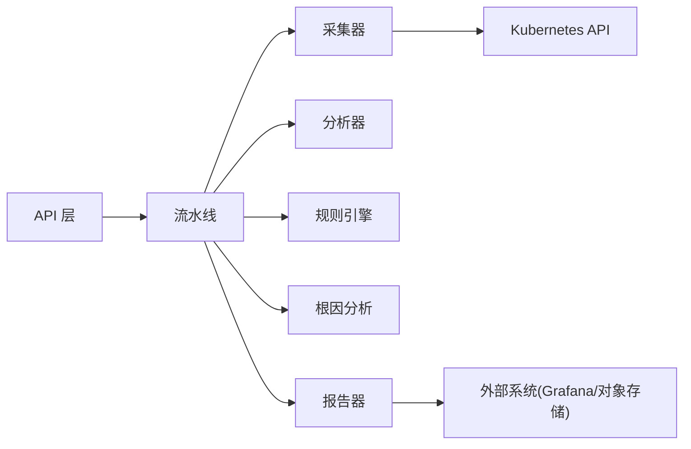

**图表来源** 
- [internal/api/diag.go](file://internal/api/diag.go)
- [internal/diag/pipeline.go](file://internal/diag/pipeline.go)
- [internal/diag/collector/interface.go](file://internal/diag/collector/interface.go)
- [internal/diag/analyzer/interface.go](file://internal/diag/analyzer/interface.go)
- [internal/diag/rules/engine.go](file://internal/diag/rules/engine.go)
- [internal/diag/rca/engine.go](file://internal/diag/rca/engine.go)
- [internal/diag/reporter/interface.go](file://internal/diag/reporter/interface.go)

**章节来源**
- [internal/api/diag.go](file://internal/api/diag.go)
- [internal/diag/pipeline.go](file://internal/diag/pipeline.go)
- [internal/diag/collector/interface.go](file://internal/diag/collector/interface.go)
- [internal/diag/analyzer/interface.go](file://internal/diag/analyzer/interface.go)
- [internal/diag/rules/engine.go](file://internal/diag/rules/engine.go)
- [internal/diag/rca/engine.go](file://internal/diag/rca/engine.go)
- [internal/diag/reporter/interface.go](file://internal/diag/reporter/interface.go)

## 性能考虑
- 并行执行：采集与分析阶段支持并发，合理设置并发度以避免 API 限流。
- 增量采集：优先使用事件与差异对比，减少全量抓取。
- 缓存与去重：对热点数据（如节点列表、命名空间）做短期缓存。
- 超时与重试：为外部依赖设置超时与退避策略，提升鲁棒性。
- 采样与分页：大对象（日志、事件）采用分页与采样，降低内存占用。
- 报告压缩：对大体积报告启用压缩与异步导出。

[本节为通用指导，不直接分析具体文件]

## 故障排查指南
- 常见问题
  - 采集失败：检查 Kubernetes 连接、权限与网络策略。
  - 分析器未生效：确认已正确注册且版本兼容。
  - 规则不命中：校验规则语法与匹配字段。
  - 报告为空：确认流水线阶段是否全部成功。
- 定位步骤
  - 查看流水线日志与阶段状态。
  - 检查采集器健康检查返回值。
  - 验证规则加载与解析结果。
  - 核对 RCA 因果图与置信度。
- 恢复建议
  - 调整并发与超时参数。
  - 增加采样与分页限制。
  - 补充缺失权限或网络策略。

**章节来源**
- [internal/diag/pipeline.go](file://internal/diag/pipeline.go)
- [internal/diag/collector/interface.go](file://internal/diag/collector/interface.go)
- [internal/diag/analyzer/registry.go](file://internal/diag/analyzer/registry.go)
- [internal/diag/rules/loader.go](file://internal/diag/rules/loader.go)
- [internal/diag/rca/engine.go](file://internal/diag/rca/engine.go)

## 结论
Klaw 的诊断子系统以流水线为核心，将采集、分析、规则匹配、RCA 与报告有机整合，具备高扩展性与良好工程实践。通过 Operator 与 API 的双通道接入，既适合自动化运维场景，也便于交互式诊断。遵循本文的配置与扩展指南，可快速构建符合企业需求的集群诊断能力。

[本节为总结性内容，不直接分析具体文件]

## 附录

### API 调用示例（概念性）
- 发起诊断：POST /api/v1/diagnostics，请求体包含集群标识、时间窗口、命名空间过滤与报告格式。
- 查询状态：GET /api/v1/diagnostics/{id}/status，返回执行进度与阶段状态。
- 下载报告：GET /api/v1/diagnostics/{id}/report?format=html|json|text|sarif|grafana。
- 删除记录：DELETE /api/v1/diagnostics/{id}。

[本节为概念性说明，不直接分析具体文件]

### 配置参数说明（概念性）
- 采集器
  - 在线：kubeconfig、API 服务器地址、超时、并发数。
  - 离线：快照目录路径、文件格式、大小限制。
- 分析器
  - 启用/禁用开关、阈值、采样率。
- 规则引擎
  - 规则文件路径、加载模式、优先级策略。
- 报告器
  - 输出格式、模板路径、存储后端。

[本节为概念性说明，不直接分析具体文件]

### 自定义分析器开发指南（概念性）
- 实现统一接口：名称、版本、分析与健康检查。
- 注册分析器：在启动时加入注册表。
- 单元测试：覆盖正常与异常路径，确保稳定性。
- 文档与示例：提供使用说明与样例数据。

[本节为概念性说明，不直接分析具体文件]