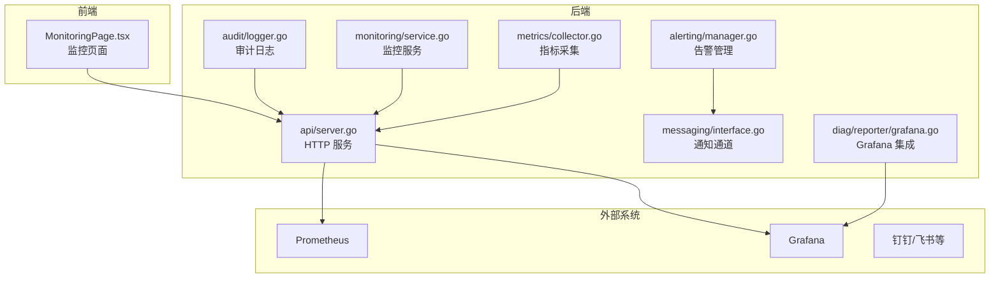
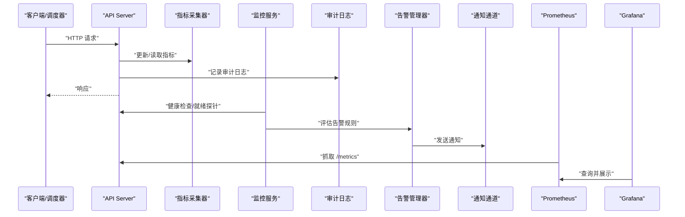
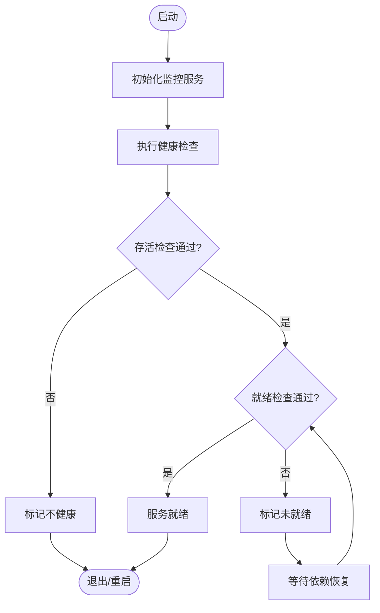
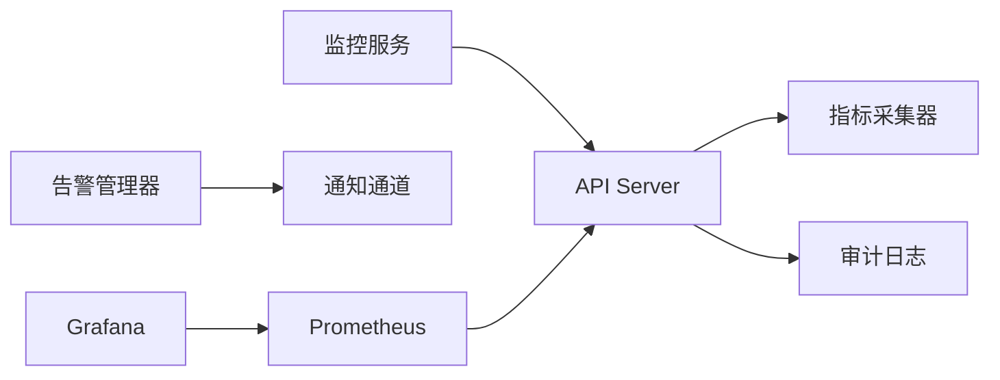

# 监控日志

<cite>
**本文引用的文件**   
- [internal/metrics/collector.go](file://internal/metrics/collector.go)
- [internal/monitoring/service.go](file://internal/monitoring/service.go)
- [internal/monitoring/manager.go](file://internal/monitoring/manager.go)
- [internal/api/server.go](file://internal/api/server.go)
- [internal/audit/logger.go](file://internal/audit/logger.go)
- [configs/config.yaml.example](file://configs/config.yaml.example)
- [web/src/pages/MonitoringPage.tsx](file://web/src/pages/MonitoringPage.tsx)
- [internal/diag/reporter/grafana.go](file://internal/diag/reporter/grafana.go)
- [internal/alerting/manager.go](file://internal/alerting/manager.go)
- [internal/messaging/interface.go](file://internal/messaging/interface.go)
</cite>

## 目录
1. [简介](#简介)
2. [项目结构](#项目结构)
3. [核心组件](#核心组件)
4. [架构总览](#架构总览)
5. [详细组件分析](#详细组件分析)
6. [依赖关系分析](#依赖关系分析)
7. [性能考虑](#性能考虑)
8. [故障排查指南](#故障排查指南)
9. [结论](#结论)
10. [附录](#附录)

## 简介
本文件面向 Klaw 平台的生产运维与 SRE 团队，系统化说明指标收集、日志记录、健康检查、性能监控与告警配置。文档覆盖：
- 指标采集与暴露（Prometheus/Grafana）
- 结构化日志与审计日志
- 健康检查端点与服务可用性探测
- 性能监控与关键指标定义
- 告警规则与通知渠道
- 监控仪表板配置建议
- 日志轮转策略与存储规划
- 生产环境最佳实践与常见问题排查

## 项目结构
Klaw 的监控与日志能力分布在以下模块：
- internal/metrics：指标采集与导出
- internal/monitoring：服务级监控编排与健康检查
- internal/api：HTTP 服务与诊断接口
- internal/audit：审计与操作日志
- web/src/pages/MonitoringPage：前端监控页面
- internal/diag/reporter：诊断报告输出（含 Grafana）
- internal/alerting：告警管理
- internal/messaging：消息通知通道（如钉钉、飞书）

图表来源
- [internal/metrics/collector.go](file://internal/metrics/collector.go)
- [internal/monitoring/service.go](file://internal/monitoring/service.go)
- [internal/api/server.go](file://internal/api/server.go)
- [internal/audit/logger.go](file://internal/audit/logger.go)
- [internal/diag/reporter/grafana.go](file://internal/diag/reporter/grafana.go)
- [web/src/pages/MonitoringPage.tsx](file://web/src/pages/MonitoringPage.tsx)
- [internal/alerting/manager.go](file://internal/alerting/manager.go)
- [internal/messaging/interface.go](file://internal/messaging/interface.go)

章节来源
- [internal/metrics/collector.go](file://internal/metrics/collector.go)
- [internal/monitoring/service.go](file://internal/monitoring/service.go)
- [internal/api/server.go](file://internal/api/server.go)
- [internal/audit/logger.go](file://internal/audit/logger.go)
- [web/src/pages/MonitoringPage.tsx](file://web/src/pages/MonitoringPage.tsx)
- [internal/diag/reporter/grafana.go](file://internal/diag/reporter/grafana.go)
- [internal/alerting/manager.go](file://internal/alerting/manager.go)
- [internal/messaging/interface.go](file://internal/messaging/interface.go)

## 核心组件
- 指标采集器（internal/metrics/collector.go）
  - 负责业务与运行时指标的注册、更新与导出
  - 典型指标类别：请求计数、延迟分位、错误率、资源使用、队列深度等
- 监控服务（internal/monitoring/service.go, manager.go）
  - 统一编排健康检查、探针、定时任务与状态上报
  - 提供就绪/存活探针与自定义健康状态聚合
- HTTP 服务（internal/api/server.go）
  - 暴露 /healthz、/readyz、/metrics 等标准端点
  - 承载诊断与监控相关接口
- 审计日志（internal/audit/logger.go）
  - 结构化审计日志，记录关键操作、权限变更与事件
- 告警管理（internal/alerting/manager.go）
  - 规则加载、评估与触发，对接通知通道
- 通知通道（internal/messaging/interface.go）
  - 抽象通知接口，支持多种渠道（钉钉、飞书等）
- 前端监控页（web/src/pages/MonitoringPage.tsx）
  - 展示关键指标、健康状态与诊断摘要

章节来源
- [internal/metrics/collector.go](file://internal/metrics/collector.go)
- [internal/monitoring/service.go](file://internal/monitoring/service.go)
- [internal/monitoring/manager.go](file://internal/monitoring/manager.go)
- [internal/api/server.go](file://internal/api/server.go)
- [internal/audit/logger.go](file://internal/audit/logger.go)
- [internal/alerting/manager.go](file://internal/alerting/manager.go)
- [internal/messaging/interface.go](file://internal/messaging/interface.go)
- [web/src/pages/MonitoringPage.tsx](file://web/src/pages/MonitoringPage.tsx)

## 架构总览
Klaw 监控体系以 Prometheus 为指标中心，Grafana 为可视化层，结合内部告警与通知通道形成闭环。

图表来源
- [internal/api/server.go](file://internal/api/server.go)
- [internal/metrics/collector.go](file://internal/metrics/collector.go)
- [internal/monitoring/service.go](file://internal/monitoring/service.go)
- [internal/audit/logger.go](file://internal/audit/logger.go)
- [internal/alerting/manager.go](file://internal/alerting/manager.go)
- [internal/messaging/interface.go](file://internal/messaging/interface.go)

## 详细组件分析

### 指标采集与导出（internal/metrics/collector.go）
- 职责
  - 定义并维护计数器、直方图、仪表盘等指标类型
  - 在关键路径上更新指标（请求数、耗时、错误码分布、资源占用）
  - 暴露标准 /metrics 供 Prometheus 抓取
- 设计要点
  - 指标命名遵循一致性规范（前缀、维度、单位）
  - 避免高基数维度导致内存膨胀
  - 批量更新与采样策略降低开销
- 性能影响
  - 直方图分位计算需权衡精度与成本
  - 计数器更新应无锁或低竞争

章节来源
- [internal/metrics/collector.go](file://internal/metrics/collector.go)

### 监控服务与健康检查（internal/monitoring/service.go, manager.go）
- 职责
  - 聚合多个子系统健康状态
  - 实现存活（liveness）与就绪（readiness）探针
  - 定时任务驱动指标刷新与诊断数据收集
- 设计要点
  - 健康检查应快速返回，避免阻塞
  - 就绪探针关注依赖组件可用性与初始化完成
  - 失败降级与熔断策略配合

图表来源
- [internal/monitoring/service.go](file://internal/monitoring/service.go)
- [internal/monitoring/manager.go](file://internal/monitoring/manager.go)

章节来源
- [internal/monitoring/service.go](file://internal/monitoring/service.go)
- [internal/monitoring/manager.go](file://internal/monitoring/manager.go)

### HTTP 服务与诊断端点（internal/api/server.go）
- 职责
  - 注册 /healthz、/readyz、/metrics 等端点
  - 提供诊断与监控相关接口（如诊断报告、状态查询）
- 设计要点
  - 端点幂等与安全控制
  - 限流与超时保护
  - 响应体标准化

章节来源
- [internal/api/server.go](file://internal/api/server.go)

### 审计日志（internal/audit/logger.go）
- 职责
  - 记录关键操作、权限变更、访问事件
  - 结构化字段便于检索与分析
- 设计要点
  - 异步写入与批处理
  - 敏感信息脱敏
  - 分级与过滤策略

章节来源
- [internal/audit/logger.go](file://internal/audit/logger.go)

### 告警管理与通知（internal/alerting/manager.go, internal/messaging/interface.go）
- 职责
  - 加载与评估告警规则
  - 触发后通过通知通道发送告警
- 设计要点
  - 规则去重与抑制
  - 多通道冗余与回退
  - 告警收敛与静默窗口

章节来源
- [internal/alerting/manager.go](file://internal/alerting/manager.go)
- [internal/messaging/interface.go](file://internal/messaging/interface.go)

### 前端监控页面（web/src/pages/MonitoringPage.tsx）
- 职责
  - 展示关键指标、健康状态、诊断摘要
  - 提供交互筛选与刷新
- 设计要点
  - 实时/轮询策略平衡
  - 错误边界与重试机制

章节来源
- [web/src/pages/MonitoringPage.tsx](file://web/src/pages/MonitoringPage.tsx)

### Grafana 集成（internal/diag/reporter/grafana.go）
- 职责
  - 生成可导入 Grafana 的报告或面板配置
  - 与 Grafana 数据源对接
- 设计要点
  - 模板化与参数化
  - 版本兼容与回滚

章节来源
- [internal/diag/reporter/grafana.go](file://internal/diag/reporter/grafana.go)

## 依赖关系分析
- 组件耦合
  - API 依赖指标采集器与审计日志
  - 监控服务依赖 API 的健康端点与外部依赖状态
  - 告警管理器依赖通知通道
- 外部依赖
  - Prometheus 抓取 /metrics
  - Grafana 展示面板
  - 通知通道（钉钉、飞书等）

图表来源
- [internal/api/server.go](file://internal/api/server.go)
- [internal/metrics/collector.go](file://internal/metrics/collector.go)
- [internal/monitoring/service.go](file://internal/monitoring/service.go)
- [internal/alerting/manager.go](file://internal/alerting/manager.go)
- [internal/messaging/interface.go](file://internal/messaging/interface.go)

章节来源
- [internal/api/server.go](file://internal/api/server.go)
- [internal/metrics/collector.go](file://internal/metrics/collector.go)
- [internal/monitoring/service.go](file://internal/monitoring/service.go)
- [internal/alerting/manager.go](file://internal/alerting/manager.go)
- [internal/messaging/interface.go](file://internal/messaging/interface.go)

## 性能考虑
- 指标采集
  - 控制指标数量与维度基数，避免内存与 CPU 压力
  - 使用增量计数器与采样直方图
- 健康检查
  - 轻量级检查，避免长耗时 I/O
  - 依赖组件失败时快速失败
- 日志写入
  - 异步与批处理，减少同步阻塞
  - 合理日志级别与采样
- 告警评估
  - 规则精简与缓存，避免频繁计算
  - 抑制与去重降低噪声

[本节为通用指导，不直接分析具体文件]

## 故障排查指南
- 指标缺失或不更新
  - 检查 /metrics 端点可达性与内容完整性
  - 确认 Prometheus 抓取间隔与目标配置
  - 验证指标注册与更新路径是否被调用
- 健康检查失败
  - 查看 liveness/readiness 探针返回值与原因
  - 检查依赖组件状态与网络连通性
- 日志丢失或异常
  - 确认日志级别与过滤器设置
  - 检查磁盘空间与轮转策略
  - 核对审计日志写入流程与权限
- 告警误报或漏报
  - 审查规则阈值与窗口
  - 检查通知通道连通性与重试策略
  - 启用告警历史与抑制规则

章节来源
- [internal/api/server.go](file://internal/api/server.go)
- [internal/metrics/collector.go](file://internal/metrics/collector.go)
- [internal/monitoring/service.go](file://internal/monitoring/service.go)
- [internal/audit/logger.go](file://internal/audit/logger.go)
- [internal/alerting/manager.go](file://internal/alerting/manager.go)
- [internal/messaging/interface.go](file://internal/messaging/interface.go)

## 结论
Klaw 的监控与日志体系围绕指标采集、健康检查、结构化日志与告警通知构建，结合 Prometheus 与 Grafana 形成完整的观测闭环。生产环境中应重视指标质量、健康探针设计与日志治理，并通过告警收敛与通知冗余提升稳定性与可运维性。

[本节为总结，不直接分析具体文件]

## 附录

### 监控仪表板配置建议
- 关键面板
  - 服务整体健康与可用性
  - 请求量、延迟分位与错误率
  - 资源使用（CPU、内存、磁盘、网络）
  - 队列与并发指标
- 数据来源
  - Prometheus 作为唯一指标源
  - 统一标签与命名规范
- 共享与版本化
  - 面板 JSON 纳入版本管理
  - 按环境隔离（开发/测试/生产）

[本节为概念性内容，不直接分析具体文件]

### 日志轮转策略
- 轮转策略
  - 按大小与时间双维度轮转
  - 保留周期与压缩归档
- 存储规划
  - 本地短期留存 + 远端长期归档
  - 索引与检索优化
- 安全合规
  - 敏感信息脱敏
  - 访问控制与审计

[本节为概念性内容，不直接分析具体文件]

### 性能调优清单
- 指标
  - 限制维度基数，使用采样直方图
  - 批量更新与惰性计算
- 健康检查
  - 快速失败与超时控制
  - 依赖组件探针分离
- 日志
  - 异步写入与批处理
  - 动态调整日志级别
- 告警
  - 规则精简与缓存
  - 抑制与静默窗口

[本节为概念性内容，不直接分析具体文件]

### 生产环境最佳实践
- 指标
  - 明确 SLI/SLO 与对应指标
  - 统一命名与标签规范
- 健康检查
  - 区分存活与就绪探针
  - 依赖组件健康聚合
- 日志
  - 结构化与分级
  - 脱敏与最小化原则
- 告警
  - 基于 SLO 的阈值与窗口
  - 多渠道通知与回退
- 可视化
  - 分层面板与钻取
  - 模板化与版本化

[本节为概念性内容，不直接分析具体文件]

### 配置参考（示例）
- 配置文件位置
  - configs/config.yaml.example
- 常见键值
  - 指标端口与路径
  - 健康检查开关与超时
  - 日志级别与输出目标
  - 告警规则路径与通知通道

章节来源
- [configs/config.yaml.example](file://configs/config.yaml.example)