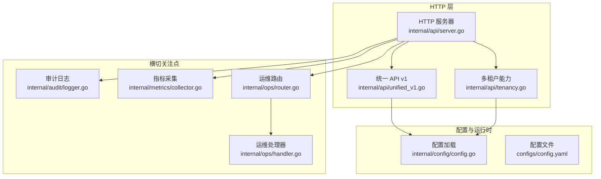
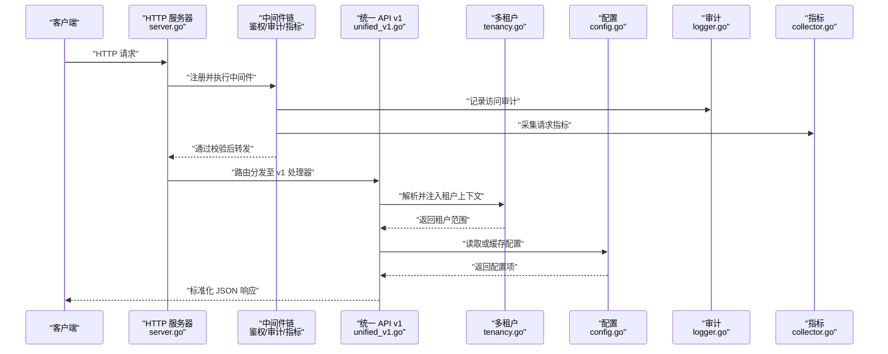
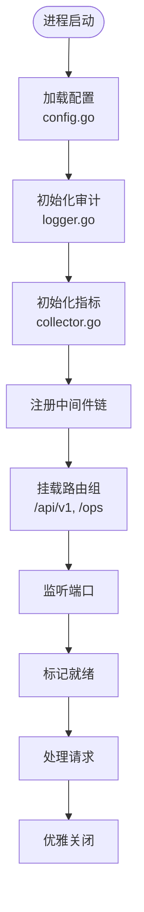
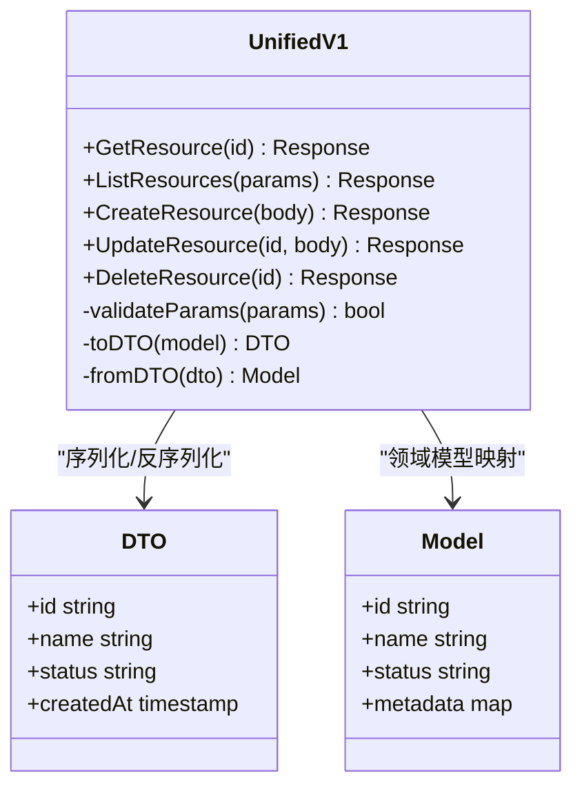
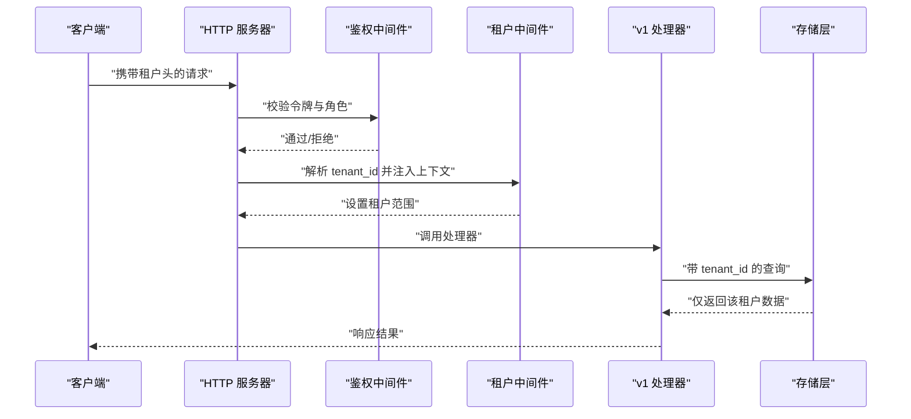
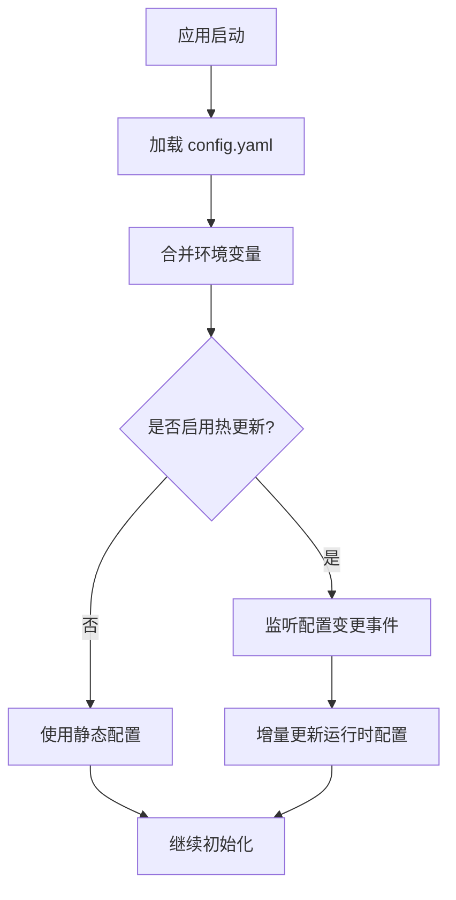
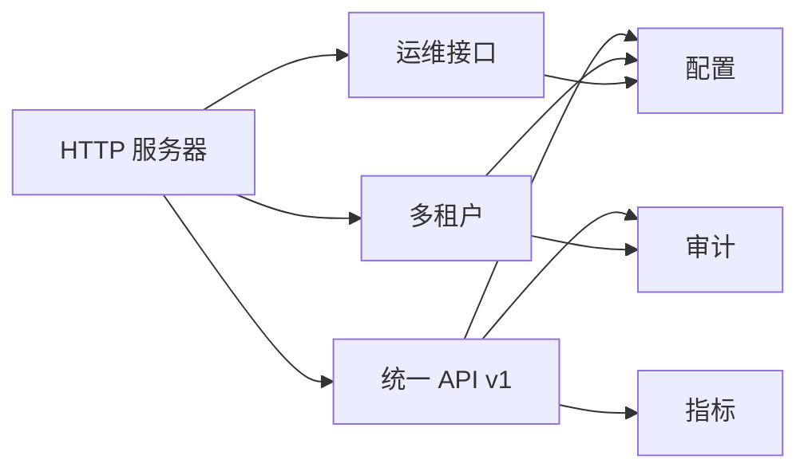

# API服务架构

<cite>
**本文引用的文件**   
- [internal/api/server.go](file://internal/api/server.go)
- [internal/api/unified_v1.go](file://internal/api/unified_v1.go)
- [internal/api/tenancy.go](file://internal/api/tenancy.go)
- [internal/config/config.go](file://internal/config/config.go)
- [configs/config.yaml](file://configs/config.yaml)
- [internal/audit/logger.go](file://internal/audit/logger.go)
- [internal/metrics/collector.go](file://internal/metrics/collector.go)
- [internal/ops/router.go](file://internal/ops/router.go)
- [internal/ops/handler.go](file://internal/ops/handler.go)
</cite>

## 目录
1. [简介](#简介)
2. [项目结构](#项目结构)
3. [核心组件](#核心组件)
4. [架构总览](#架构总览)
5. [详细组件分析](#详细组件分析)
6. [依赖关系分析](#依赖关系分析)
7. [性能考虑](#性能考虑)
8. [故障排查指南](#故障排查指南)
9. [结论](#结论)
10. [附录](#附录)

## 简介
本文件面向 Klaw 平台的 API 服务层，系统化阐述 RESTful API 设计模式、路由组织与请求处理流程；统一 API v1 的设计原则、版本管理与向后兼容策略；多租户隔离机制（上下文传递、权限验证、数据隔离）；配置管理（配置文件结构、环境变量支持、动态更新）；认证授权、错误处理与日志规范；以及中间件链设计与性能优化建议。文档力求兼顾技术深度与可读性，帮助开发者快速理解并扩展 API 服务。

## 项目结构
API 服务位于 internal/api 目录，围绕 HTTP 服务器、统一 API v1、多租户能力等模块组织；配置集中于 configs 与 internal/config；审计与指标分别在 internal/audit 与 internal/metrics；运维接口在 internal/ops。整体采用分层与模块化设计：HTTP 层负责路由与中间件编排，业务逻辑由独立模块实现，基础设施通过可插拔的存储、消息、监控等组件接入。

图表来源 
- [internal/api/server.go](file://internal/api/server.go)
- [internal/api/unified_v1.go](file://internal/api/unified_v1.go)
- [internal/api/tenancy.go](file://internal/api/tenancy.go)
- [internal/config/config.go](file://internal/config/config.go)
- [configs/config.yaml](file://configs/config.yaml)
- [internal/audit/logger.go](file://internal/audit/logger.go)
- [internal/metrics/collector.go](file://internal/metrics/collector.go)
- [internal/ops/router.go](file://internal/ops/router.go)
- [internal/ops/handler.go](file://internal/ops/handler.go)

章节来源
- [internal/api/server.go](file://internal/api/server.go)
- [internal/api/unified_v1.go](file://internal/api/unified_v1.go)
- [internal/api/tenancy.go](file://internal/api/tenancy.go)
- [internal/config/config.go](file://internal/config/config.go)
- [configs/config.yaml](file://configs/config.yaml)
- [internal/audit/logger.go](file://internal/audit/logger.go)
- [internal/metrics/collector.go](file://internal/metrics/collector.go)
- [internal/ops/router.go](file://internal/ops/router.go)
- [internal/ops/handler.go](file://internal/ops/handler.go)

## 核心组件
- HTTP 服务器与路由注册：集中式入口，负责监听端口、挂载路由、注入中间件、启动生命周期钩子。
- 统一 API v1：定义统一的资源模型、RESTful 路径命名、分页与过滤参数、错误响应格式，作为对外稳定契约。
- 多租户能力：基于请求上下文注入租户标识，贯穿鉴权、限流、审计与数据访问层，确保租户间隔离。
- 配置管理：从 YAML 与环境变量加载配置，提供热更新能力与默认值回退。
- 审计与指标：结构化审计日志与 Prometheus 指标暴露，支撑可观测性与合规审计。
- 运维接口：健康检查、就绪探针、调试端点，便于部署与排障。

章节来源
- [internal/api/server.go](file://internal/api/server.go)
- [internal/api/unified_v1.go](file://internal/api/unified_v1.go)
- [internal/api/tenancy.go](file://internal/api/tenancy.go)
- [internal/config/config.go](file://internal/config/config.go)
- [internal/audit/logger.go](file://internal/audit/logger.go)
- [internal/metrics/collector.go](file://internal/metrics/collector.go)
- [internal/ops/router.go](file://internal/ops/router.go)
- [internal/ops/handler.go](file://internal/ops/handler.go)

## 架构总览
下图展示请求从进入 HTTP 服务器到统一 API v1 处理器，再到多租户与配置、审计、指标的完整链路。

图表来源 
- [internal/api/server.go](file://internal/api/server.go)
- [internal/api/unified_v1.go](file://internal/api/unified_v1.go)
- [internal/api/tenancy.go](file://internal/api/tenancy.go)
- [internal/config/config.go](file://internal/config/config.go)
- [internal/audit/logger.go](file://internal/audit/logger.go)
- [internal/metrics/collector.go](file://internal/metrics/collector.go)

## 详细组件分析

### HTTP 服务器与路由组织
- 职责：创建 HTTP 服务器实例，注册全局中间件（鉴权、审计、指标、CORS、请求体限制等），按功能域划分路由组，挂载统一 API v1 与运维接口。
- 路由组织：以 /api/v1 为前缀的资源化路径，遵循 RESTful 语义；内部按领域拆分路由组，避免单文件膨胀。
- 生命周期：启动时加载配置、初始化审计与指标、注册路由；优雅关闭时释放资源。

图表来源 
- [internal/api/server.go](file://internal/api/server.go)
- [internal/config/config.go](file://internal/config/config.go)
- [internal/audit/logger.go](file://internal/audit/logger.go)
- [internal/metrics/collector.go](file://internal/metrics/collector.go)

章节来源
- [internal/api/server.go](file://internal/api/server.go)

### 统一 API v1 设计
- 设计原则：
  - 资源导向：URL 表示名词资源，动词通过 HTTP 方法表达。
  - 状态码规范：成功 2xx，客户端错误 4xx，服务端错误 5xx。
  - 分页与过滤：统一 query 参数约定（如 page、pageSize、filter）。
  - 错误响应：统一错误体结构，包含 code、message、details。
  - 幂等性：GET/PUT/DELETE 幂等，POST 非幂等需明确说明。
- 版本管理：
  - URL 前缀 /api/v1 显式声明版本。
  - 向后兼容：新增字段只增不改，废弃字段保留一段时间并标注弃用。
  - 变更策略：重大不兼容变更通过新路径 /api/v2 引入，旧版本并行运行。
- 处理器组织：按资源划分处理器函数，输入输出使用统一 DTO，避免直接暴露内部模型。

图表来源 
- [internal/api/unified_v1.go](file://internal/api/unified_v1.go)

章节来源
- [internal/api/unified_v1.go](file://internal/api/unified_v1.go)

### 多租户隔离机制
- 上下文传递：
  - 从请求头或令牌中解析 tenant_id，注入到请求上下文。
  - 所有下游组件通过上下文获取当前租户，禁止硬编码。
- 权限验证：
  - 基于角色的访问控制（RBAC）与租户级权限矩阵。
  - 鉴权失败返回标准 401/403，并记录审计事件。
- 数据隔离：
  - 所有查询自动附加 tenant_id 条件，防止跨租户数据泄露。
  - 缓存键与队列名包含租户前缀，确保隔离。

图表来源 
- [internal/api/tenancy.go](file://internal/api/tenancy.go)
- [internal/api/unified_v1.go](file://internal/api/unified_v1.go)

章节来源
- [internal/api/tenancy.go](file://internal/api/tenancy.go)

### 配置管理系统
- 配置文件结构：
  - YAML 主配置包含服务端口、数据库连接、审计开关、指标暴露端口、特性开关等。
  - 支持多环境覆盖（开发、测试、生产）。
- 环境变量支持：
  - 关键敏感信息（密钥、DSN）通过环境变量注入。
  - 环境变量优先级高于配置文件。
- 动态配置更新：
  - 支持热重载部分配置（如日志级别、特性开关）。
  - 变更事件广播至订阅者，避免重启。

图表来源 
- [internal/config/config.go](file://internal/config/config.go)
- [configs/config.yaml](file://configs/config.yaml)

章节来源
- [internal/config/config.go](file://internal/config/config.go)
- [configs/config.yaml](file://configs/config.yaml)

### 认证授权机制
- 认证：
  - 支持 JWT/OAuth2 令牌校验，校验签名、过期时间与受众。
  - 可选 mTLS 双向认证用于服务间通信。
- 授权：
  - RBAC 模型：用户-角色-权限三元组，结合租户维度进行细粒度控制。
  - 资源级权限：对特定资源 ID 的操作权限校验。
- 安全最佳实践：
  - 最小权限原则，定期轮换密钥。
  - 敏感操作二次确认与审计。

章节来源
- [internal/api/tenancy.go](file://internal/api/tenancy.go)
- [internal/api/unified_v1.go](file://internal/api/unified_v1.go)

### 错误处理策略
- 统一错误体：code、message、details、traceId。
- 分类：
  - 客户端错误：参数校验失败、权限不足、资源不存在。
  - 服务端错误：上游超时、数据库异常、未知错误。
- 处理流程：
  - 中间件捕获 panic 与未处理错误，转换为标准响应。
  - 记录结构化错误日志，附带上下文与堆栈。

章节来源
- [internal/api/unified_v1.go](file://internal/api/unified_v1.go)
- [internal/audit/logger.go](file://internal/audit/logger.go)

### 日志记录规范
- 结构化日志：JSON 格式，包含时间戳、级别、请求ID、租户ID、用户ID、耗时、状态码。
- 分级：
  - DEBUG：详细调试信息，生产环境默认关闭。
  - INFO：关键业务流程。
  - WARN：潜在问题与降级行为。
  - ERROR：不可恢复错误。
- 脱敏：禁止记录密码、令牌、PII 等敏感信息。

章节来源
- [internal/audit/logger.go](file://internal/audit/logger.go)

### 指标与可观测性
- 指标类型：
  - 请求计数、延迟分布、错误率、并发数、GC 统计。
  - 业务指标：租户活跃数、资源创建速率。
- 暴露方式：Prometheus /metrics 端点，支持拉取与告警规则。
- 追踪：集成 OpenTelemetry，生成分布式追踪。

章节来源
- [internal/metrics/collector.go](file://internal/metrics/collector.go)

### 运维接口
- 健康检查：/healthz 存活探针，/readyz 就绪探针。
- 调试端点：/debug/pprof 性能剖析（生产禁用）。
- 配置查看：/ops/config 只读查看当前生效配置。

章节来源
- [internal/ops/router.go](file://internal/ops/router.go)
- [internal/ops/handler.go](file://internal/ops/handler.go)

## 依赖关系分析
API 服务依赖配置、审计、指标、多租户与运维模块，形成清晰的层次与边界。

图表来源 
- [internal/api/server.go](file://internal/api/server.go)
- [internal/api/unified_v1.go](file://internal/api/unified_v1.go)
- [internal/api/tenancy.go](file://internal/api/tenancy.go)
- [internal/config/config.go](file://internal/config/config.go)
- [internal/audit/logger.go](file://internal/audit/logger.go)
- [internal/metrics/collector.go](file://internal/metrics/collector.go)
- [internal/ops/router.go](file://internal/ops/router.go)
- [internal/ops/handler.go](file://internal/ops/handler.go)

章节来源
- [internal/api/server.go](file://internal/api/server.go)
- [internal/api/unified_v1.go](file://internal/api/unified_v1.go)
- [internal/api/tenancy.go](file://internal/api/tenancy.go)
- [internal/config/config.go](file://internal/config/config.go)
- [internal/audit/logger.go](file://internal/audit/logger.go)
- [internal/metrics/collector.go](file://internal/metrics/collector.go)
- [internal/ops/router.go](file://internal/ops/router.go)
- [internal/ops/handler.go](file://internal/ops/handler.go)

## 性能考虑
- 连接池与超时：合理设置数据库、外部依赖的连接池大小与超时，避免雪崩。
- 缓存策略：热点数据使用内存缓存（如 TTL、LRU），降低后端压力。
- 异步处理：耗时任务放入队列异步执行，接口立即返回。
- 批处理：批量写入与查询减少往返次数。
- 压缩与分页：大响应启用 gzip，列表接口强制分页。
- 指标驱动优化：基于 Prometheus 与 pprof 定位瓶颈。

## 故障排查指南
- 常见问题：
  - 401/403：检查令牌有效性、角色与租户权限。
  - 404：确认资源路径与 ID 是否存在。
  - 500：查看审计日志与堆栈，定位上游错误。
- 诊断步骤：
  - 开启 DEBUG 日志，收集 traceId。
  - 检查 /metrics 与 /healthz 状态。
  - 使用 pprof 分析 CPU/内存热点。
- 恢复措施：
  - 回滚配置或代码版本。
  - 扩容实例或提升资源配额。
  - 隔离故障租户或资源。

章节来源
- [internal/audit/logger.go](file://internal/audit/logger.go)
- [internal/metrics/collector.go](file://internal/metrics/collector.go)
- [internal/ops/handler.go](file://internal/ops/handler.go)

## 结论
Klaw 的 API 服务层以统一 API v1 为核心，结合多租户隔离、配置热更新、审计与指标体系，构建了可扩展、可观测、易维护的 RESTful 服务架构。通过严格的版本管理与错误处理规范，保障向后兼容与稳定性。建议持续完善 RBAC 与审计细节，强化性能监控与容量规划，以支撑大规模多租户场景。

## 附录
- 术语表：
  - 租户：独立的使用者或组织单元，数据与权限隔离。
  - 中间件：请求处理管道中的横切逻辑。
  - 指标：系统运行状态的量化度量。
- 参考：
  - RESTful 设计规范与最佳实践。
  - Prometheus 指标导出与告警。
  - OpenTelemetry 分布式追踪。