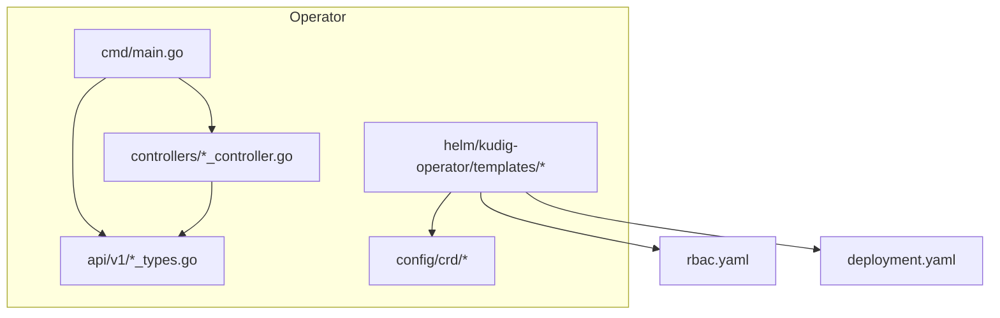
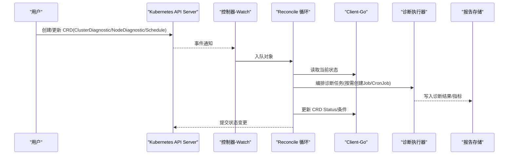
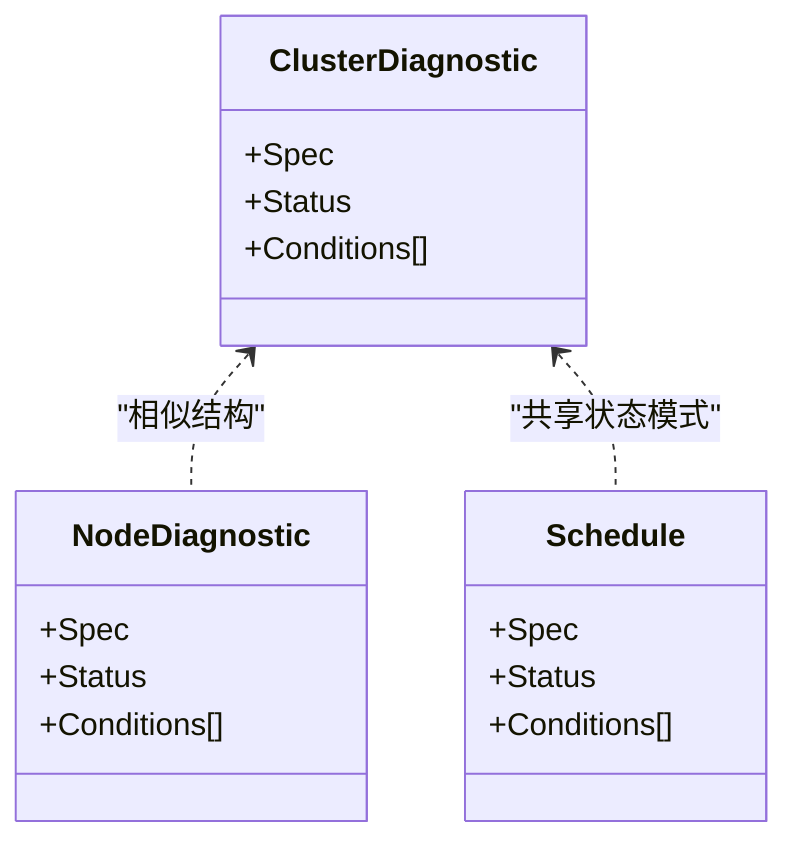
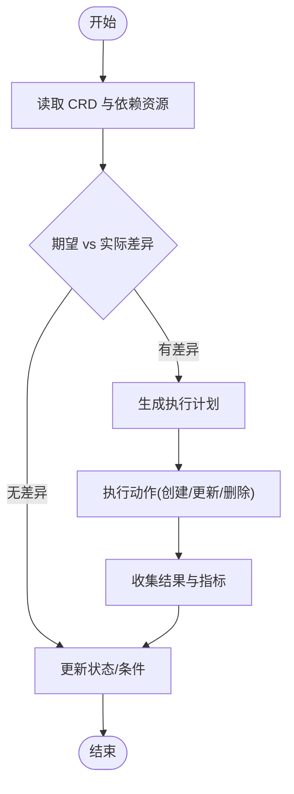
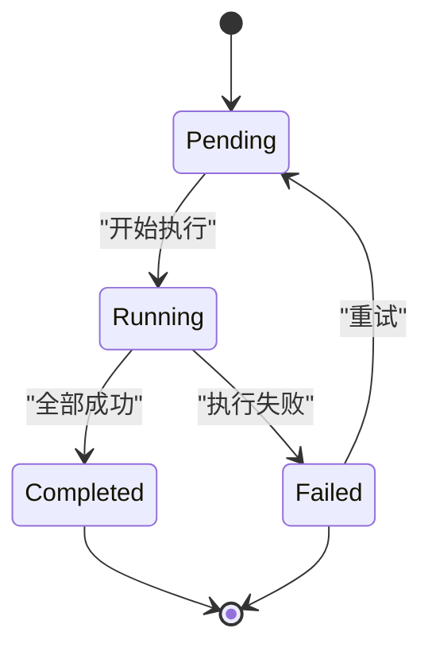
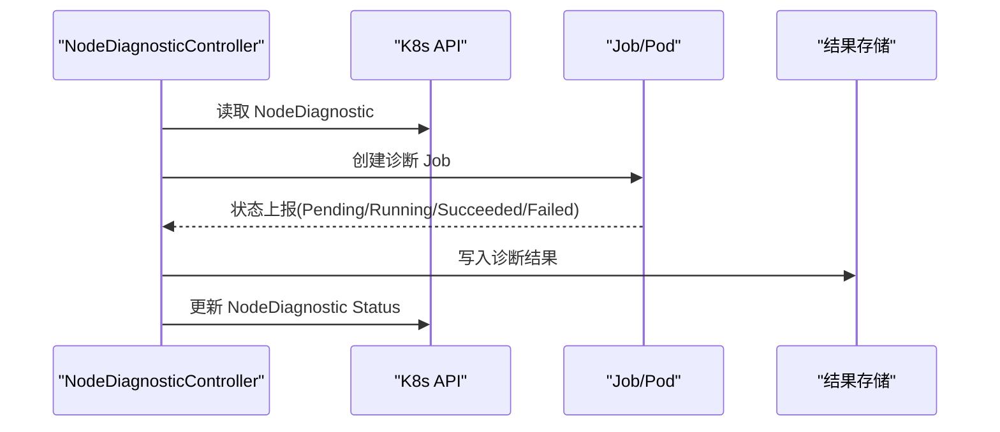
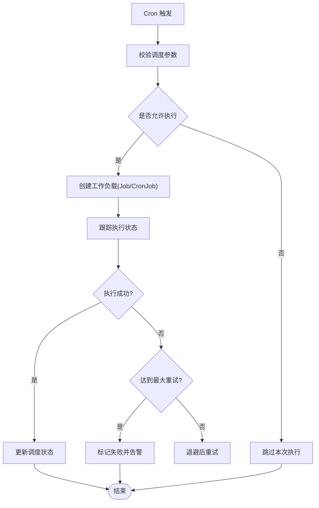
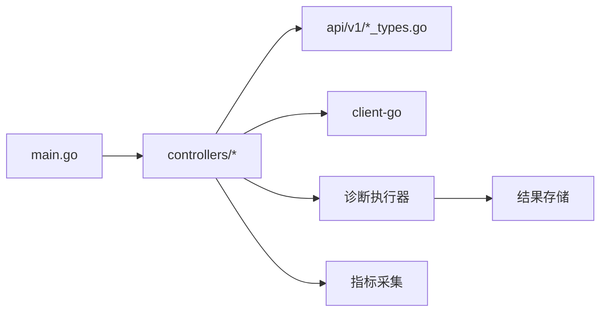

# Operator架构

<cite>
**本文档引用的文件**
- [operator/cmd/main.go](file://operator/cmd/main.go)
- [operator/api/v1/clusterdiagnostic_types.go](file://operator/api/v1/clusterdiagnostic_types.go)
- [operator/api/v1/nodediagnostic_types.go](file://operator/api/v1/nodediagnostic_types.go)
- [operator/api/v1/schedule_types.go](file://operator/api/v1/schedule_types.go)
- [operator/api/v1/groupversion_info.go](file://operator/api/v1/groupversion_info.go)
- [operator/controllers/clusterdiagnostic_controller.go](file://operator/controllers/clusterdiagnostic_controller.go)
- [operator/controllers/nodediagnostic_controller.go](file://operator/controllers/nodediagnostic_controller.go)
- [operator/controllers/schedule_controller.go](file://operator/controllers/schedule_controller.go)
- [operator/config/crd/bases/...](file://operator/config/crd)
- [operator/helm/kudig-operator/templates/crds.yaml](file://operator/helm/kudig-operator/templates/crds.yaml)
- [operator/helm/kudig-operator/templates/rbac.yaml](file://operator/helm/kudig-operator/templates/rbac.yaml)
- [operator/helm/kudig-operator/templates/deployment.yaml](file://operator/helm/kudig-operator/templates/deployment.yaml)
- [operator/helm/kudig-operator/values.yaml](file://operator/helm/kudig-operator/values.yaml)
- [operator/README.md](file://operator/README.md)
</cite>

## 目录
1. [简介](#简介)
2. [项目结构](#项目结构)
3. [核心组件](#核心组件)
4. [架构总览](#架构总览)
5. [详细组件分析](#详细组件分析)
6. [依赖关系分析](#依赖关系分析)
7. [性能考量](#性能考量)
8. [故障排查指南](#故障排查指南)
9. [结论](#结论)
10. [附录](#附录)

## 简介
本文件为 Klaw 平台的 Kubernetes Operator 提供全面的架构文档。内容涵盖控制器循环、事件处理与状态同步机制；自定义资源定义（CRD）的设计原则，包括字段约束、默认值与验证规则；集群诊断与节点诊断控制器的实现逻辑，包括资源生命周期管理与故障恢复策略；调度器的设计，支持定时任务与分布式执行；RBAC 权限配置、安全最佳实践与监控集成方案；以及 Operator 的部署、扩缩容与维护指南。

## 项目结构
Operator 子工程位于 operator/ 目录下，采用标准 controller-runtime 风格组织：
- api/v1：自定义资源类型定义与版本信息
- controllers：各 CRD 对应的控制器实现
- config/crd：CRD YAML 清单
- helm/kudig-operator：Helm Chart，包含 CRDs、RBAC、Deployment 等模板
- cmd/main.go：Operator 入口，初始化控制器管理器并启动

图表来源
- [operator/cmd/main.go](file://operator/cmd/main.go)
- [operator/api/v1/groupversion_info.go](file://operator/api/v1/groupversion_info.go)
- [operator/controllers/clusterdiagnostic_controller.go](file://operator/controllers/clusterdiagnostic_controller.go)
- [operator/controllers/nodediagnostic_controller.go](file://operator/controllers/nodediagnostic_controller.go)
- [operator/controllers/schedule_controller.go](file://operator/controllers/schedule_controller.go)
- [operator/helm/kudig-operator/templates/crds.yaml](file://operator/helm/kudig-operator/templates/crds.yaml)
- [operator/helm/kudig-operator/templates/rbac.yaml](file://operator/helm/kudig-operator/templates/rbac.yaml)
- [operator/helm/kudig-operator/templates/deployment.yaml](file://operator/helm/kudig-operator/templates/deployment.yaml)

章节来源
- [operator/README.md](file://operator/README.md)

## 核心组件
- 自定义资源（CRD）
  - ClusterDiagnostic：表示集群级诊断任务，声明式描述目标范围、采集项、报告输出等
  - NodeDiagnostic：表示节点级诊断任务，声明式描述目标节点、采集项、报告输出等
  - Schedule：表示定时调度任务，声明式描述 Cron 表达式、并发策略、重试策略、工作负载选择器等
- 控制器
  - ClusterDiagnosticController：监听 ClusterDiagnostic 事件，协调诊断执行与结果持久化
  - NodeDiagnosticController：监听 NodeDiagnostic 事件，协调节点诊断执行与结果持久化
  - ScheduleController：基于 Cron 触发调度，创建或管理实际工作负载（如 Job/CronJob），并跟踪执行状态
- 运行时入口
  - main：初始化 client-go/controller-runtime，注册 Scheme、设置日志与指标、启动控制器管理器

章节来源
- [operator/api/v1/clusterdiagnostic_types.go](file://operator/api/v1/clusterdiagnostic_types.go)
- [operator/api/v1/nodediagnostic_types.go](file://operator/api/v1/nodediagnostic_types.go)
- [operator/api/v1/schedule_types.go](file://operator/api/v1/schedule_types.go)
- [operator/controllers/clusterdiagnostic_controller.go](file://operator/controllers/clusterdiagnostic_controller.go)
- [operator/controllers/nodediagnostic_controller.go](file://operator/controllers/nodediagnostic_controller.go)
- [operator/controllers/schedule_controller.go](file://operator/controllers/schedule_controller.go)
- [operator/cmd/main.go](file://operator/cmd/main.go)

## 架构总览
Operator 遵循“声明式 API + 控制器循环”的模式：用户通过 CRD 声明期望状态，控制器持续观察集群状态变化，驱动实际状态向期望状态收敛。

图表来源
- [operator/controllers/clusterdiagnostic_controller.go](file://operator/controllers/clusterdiagnostic_controller.go)
- [operator/controllers/nodediagnostic_controller.go](file://operator/controllers/nodediagnostic_controller.go)
- [operator/controllers/schedule_controller.go](file://operator/controllers/schedule_controller.go)

## 详细组件分析

### 自定义资源定义（CRD）设计原则
- 版本与分组
  - 使用 v1 版本，统一 Group/Version，便于演进与兼容
- 字段约束与默认值
  - 必填字段：名称、命名空间、关键开关（如 enabled、collectors）
  - 可选字段：超时、重试次数、并发度、标签选择器、输出格式
  - 默认值：未显式指定时采用保守默认（如单并发、最小超时）
- 验证规则
  - 使用 OpenAPI v3 schema 进行字段校验（枚举、范围、正则）
  - 在控制器中做业务级二次校验（如时间窗口合法性、资源配额检查）
- 状态模型
  - Spec：期望状态（不可变或受控变更）
  - Status：运行期状态（阶段、条件、指标、错误信息）
  - Conditions：标准化条件集合（Ready、Progressing、Failed 等）

图表来源
- [operator/api/v1/clusterdiagnostic_types.go](file://operator/api/v1/clusterdiagnostic_types.go)
- [operator/api/v1/nodediagnostic_types.go](file://operator/api/v1/nodediagnostic_types.go)
- [operator/api/v1/schedule_types.go](file://operator/api/v1/schedule_types.go)

章节来源
- [operator/api/v1/clusterdiagnostic_types.go](file://operator/api/v1/clusterdiagnostic_types.go)
- [operator/api/v1/nodediagnostic_types.go](file://operator/api/v1/nodediagnostic_types.go)
- [operator/api/v1/schedule_types.go](file://operator/api/v1/schedule_types.go)

### 控制器循环与事件处理
- 事件源
  - 监听 CRD 的 Create/Update/Delete 事件
  - 监听相关下游资源（如 Job/Pod/Node）以感知执行进度
- 入队与去重
  - 使用速率限制队列，避免风暴
  - 对重复事件进行合并与幂等处理
- Reconcile 流程
  - 读取对象与依赖资源
  - 计算差异并生成计划
  - 调用执行器创建/更新资源
  - 收集状态并更新 CRD.Status/Conditions
  - 记录指标与审计日志

图表来源
- [operator/controllers/clusterdiagnostic_controller.go](file://operator/controllers/clusterdiagnostic_controller.go)
- [operator/controllers/nodediagnostic_controller.go](file://operator/controllers/nodediagnostic_controller.go)
- [operator/controllers/schedule_controller.go](file://operator/controllers/schedule_controller.go)

章节来源
- [operator/controllers/clusterdiagnostic_controller.go](file://operator/controllers/clusterdiagnostic_controller.go)
- [operator/controllers/nodediagnostic_controller.go](file://operator/controllers/nodediagnostic_controller.go)
- [operator/controllers/schedule_controller.go](file://operator/controllers/schedule_controller.go)

### 集群诊断控制器（ClusterDiagnostic）
- 职责
  - 根据 Spec 选择目标集群范围（全部/按标签）
  - 编排采集器（内核、网络、存储、GPU、服务网格等）
  - 聚合结果并生成报告（HTML/JSON/SARIF/Grafana）
- 生命周期
  - Pending -> Running -> Completed/Failed
  - 失败重试与退避策略
- 故障恢复
  - 自动重试、部分失败隔离、人工干预入口（手动重试/取消）

图表来源
- [operator/controllers/clusterdiagnostic_controller.go](file://operator/controllers/clusterdiagnostic_controller.go)

章节来源
- [operator/controllers/clusterdiagnostic_controller.go](file://operator/controllers/clusterdiagnostic_controller.go)

### 节点诊断控制器（NodeDiagnostic）
- 职责
  - 针对单个节点或节点集合执行诊断
  - 采集系统、进程、网络、存储、运行时等维度数据
- 生命周期
  - Pending -> Running -> Completed/Failed
  - 支持按节点粒度失败隔离与重试
- 故障恢复
  - 节点不可达时的指数退避重试
  - 资源不足时的降级采集

图表来源
- [operator/controllers/nodediagnostic_controller.go](file://operator/controllers/nodediagnostic_controller.go)

章节来源
- [operator/controllers/nodediagnostic_controller.go](file://operator/controllers/nodediagnostic_controller.go)

### 调度器（Schedule）
- 职责
  - 基于 Cron 表达式触发诊断任务
  - 支持并发策略（Forbid/Allow/Replace）、重试策略、超时控制
  - 将调度事件转换为具体工作负载（Job/CronJob）并跟踪执行
- 分布式执行
  - 多副本控制器通过 Leader Election 保证唯一触发
  - 任务分片与负载均衡（按标签/节点）

图表来源
- [operator/controllers/schedule_controller.go](file://operator/controllers/schedule_controller.go)

章节来源
- [operator/controllers/schedule_controller.go](file://operator/controllers/schedule_controller.go)

### 入口与控制器管理器
- 初始化步骤
  - 构建 Config、Manager、Scheme
  - 注册 CRD 类型与控制器
  - 启动健康检查与指标端点
- 启动顺序
  - 先建立与 API Server 的连接
  - 再启动控制器与缓存
  - 最后暴露 HTTP 端点（健康、指标、调试）

章节来源
- [operator/cmd/main.go](file://operator/cmd/main.go)

## 依赖关系分析
- 内部依赖
  - 控制器依赖 api/v1 类型定义
  - 控制器通过 client-go 访问 API Server
  - 诊断执行器与报告模块由控制器编排调用
- 外部依赖
  - Kubernetes API Server
  - 存储后端（本地/远程）用于结果持久化
  - 监控系统（Prometheus/Grafana）用于指标与可视化

图表来源
- [operator/cmd/main.go](file://operator/cmd/main.go)
- [operator/controllers/clusterdiagnostic_controller.go](file://operator/controllers/clusterdiagnostic_controller.go)
- [operator/controllers/nodediagnostic_controller.go](file://operator/controllers/nodediagnostic_controller.go)
- [operator/controllers/schedule_controller.go](file://operator/controllers/schedule_controller.go)

章节来源
- [operator/cmd/main.go](file://operator/cmd/main.go)

## 性能考量
- 控制器层面
  - 使用 informer 缓存减少 API 请求
  - 合理设置队列速率限制与并发度
  - 避免长耗时操作阻塞 reconcile
- 诊断执行
  - 并行采集与结果聚合
  - 增量采集与缓存命中
  - 大对象分块上传与断点续传
- 存储与监控
  - 异步写入与批量提交
  - 指标采样与降采样
  - 告警阈值与抑制规则

[本节为通用指导，不直接分析具体文件]

## 故障排查指南
- 常见问题
  - CRD 未安装或版本不一致导致控制器无法启动
  - RBAC 权限不足导致无法读写资源
  - 诊断任务频繁失败（权限、资源不足、网络问题）
  - 调度器未触发（Cron 表达式错误或时钟不同步）
- 排查步骤
  - 查看控制器日志与事件
  - 检查 CRD 与对象状态（kubectl describe）
  - 验证 RBAC 与 ServiceAccount
  - 检查 Job/Pod 状态与事件
  - 核对存储与监控配置
- 恢复策略
  - 修正配置后重新应用
  - 手动重试失败的诊断任务
  - 调整资源配额与限流参数

章节来源
- [operator/helm/kudig-operator/templates/rbac.yaml](file://operator/helm/kudig-operator/templates/rbac.yaml)
- [operator/helm/kudig-operator/templates/deployment.yaml](file://operator/helm/kudig-operator/templates/deployment.yaml)

## 结论
Klaw Operator 通过声明式 CRD 与控制器循环实现了集群与节点诊断的自动化编排与状态同步。其设计遵循 Kubernetes 最佳实践，具备可扩展性、可观测性与高可用性。结合合理的 RBAC、监控与故障恢复策略，可在生产环境中稳定运行。

[本节为总结性内容，不直接分析具体文件]

## 附录

### RBAC 权限配置与安全最佳实践
- RBAC
  - 最小权限原则：仅授予必要的读/写权限
  - 命名空间隔离：为不同租户或环境分配独立 SA 与角色
  - 定期审计：审查角色绑定与令牌有效期
- 安全
  - 启用 Pod 安全策略/PSA
  - 限制容器镜像来源与签名校验
  - 敏感信息使用 Secret 管理
  - 网络策略限制跨命名空间访问

章节来源
- [operator/helm/kudig-operator/templates/rbac.yaml](file://operator/helm/kudig-operator/templates/rbac.yaml)

### 监控集成方案
- 指标
  - 暴露 Prometheus 指标端点
  - 自定义指标：reconcile 次数、失败率、执行时长
- 日志
  - 结构化日志，包含 traceId、对象名、阶段
  - 集中收集与检索（ELK/Loki）
- 告警
  - 基于指标阈值与事件规则
  - 多渠道通知（邮件、IM）

章节来源
- [operator/helm/kudig-operator/templates/deployment.yaml](file://operator/helm/kudig-operator/templates/deployment.yaml)

### 部署、扩缩容与维护指南
- 部署
  - 使用 Helm 安装 CRDs、RBAC、Deployment
  - 配置 values.yaml（副本数、资源限制、镜像仓库）
- 扩缩容
  - 调整 Deployment replicas
  - 调整控制器并发与队列大小
- 维护
  - 滚动升级与回滚
  - 备份 CRD 与诊断结果
  - 定期清理过期 Job/Pod

章节来源
- [operator/helm/kudig-operator/values.yaml](file://operator/helm/kudig-operator/values.yaml)
- [operator/helm/kudig-operator/templates/deployment.yaml](file://operator/helm/kudig-operator/templates/deployment.yaml)
- [operator/helm/kudig-operator/templates/crds.yaml](file://operator/helm/kudig-operator/templates/crds.yaml)