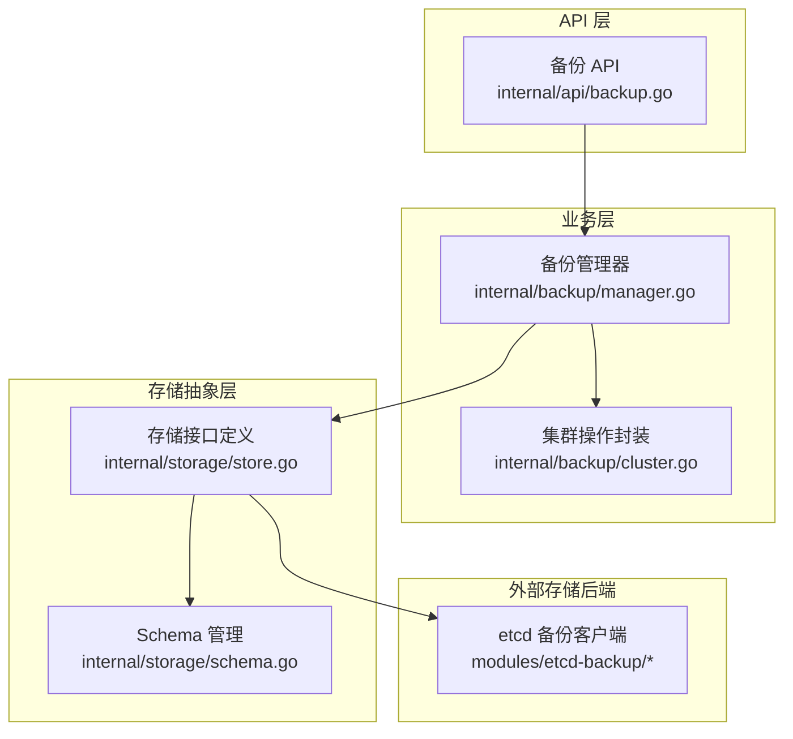
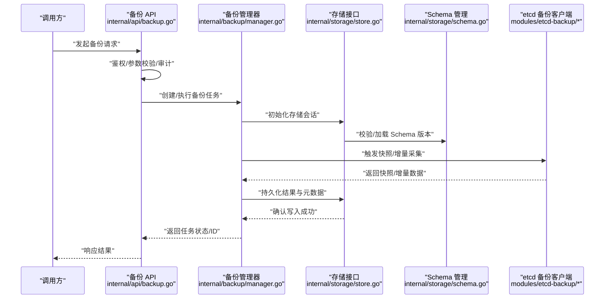
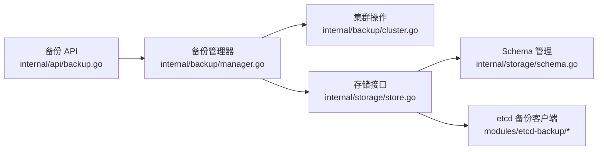
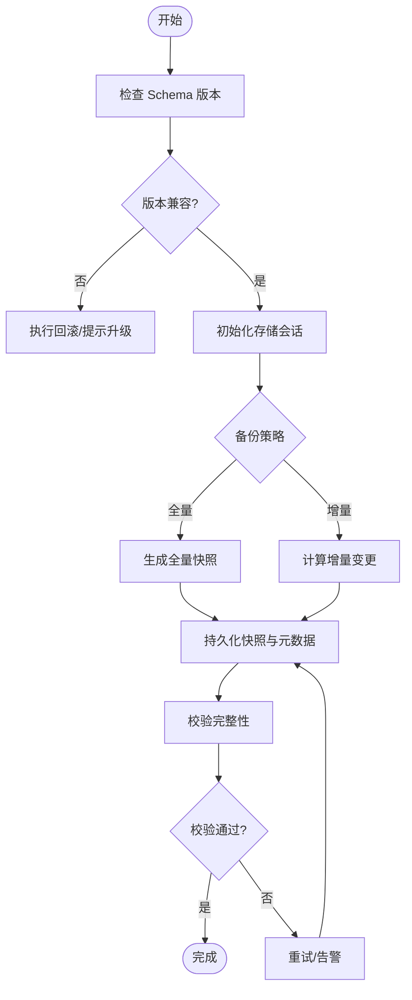

# 存储层架构

<cite>
**本文引用的文件**   
- [internal/storage/store.go](file://internal/storage/store.go)
- [internal/storage/schema.go](file://internal/storage/schema.go)
- [internal/backup/manager.go](file://internal/backup/manager.go)
- [internal/backup/cluster.go](file://internal/backup/cluster.go)
- [internal/api/backup.go](file://internal/api/backup.go)
- [modules/etcd-backup/manager.go](file://modules/etcd-backup/manager.go)
- [modules/etcd-backup/client.go](file://modules/etcd-backup/client.go)
- [modules/etcd-backup/types.go](file://modules/etcd-backup/types.go)
</cite>

## 目录
1. [简介](#简介)
2. [项目结构](#项目结构)
3. [核心组件](#核心组件)
4. [架构总览](#架构总览)
5. [详细组件分析](#详细组件分析)
6. [依赖关系分析](#依赖关系分析)
7. [性能考虑](#性能考虑)
8. [故障排查指南](#故障排查指南)
9. [结论](#结论)
10. [附录](#附录) 

## 简介
本文件为 Klaw 平台存储层的架构文档，聚焦以下目标：
- 数据存储抽象层的设计与插件化后端扩展机制
- Schema 管理机制（版本控制、迁移策略、向后兼容性）
- 备份恢复系统（增量备份、一致性保证、灾难恢复流程）
- 数据访问模式、缓存策略与性能优化
- 数据安全（加密存储、访问控制）
- 存储后端扩展指南与故障排查方法

## 项目结构
存储相关代码主要分布在 internal/storage、internal/backup、internal/api 以及 modules/etcd-backup 等模块中。整体采用“接口抽象 + 具体实现”的分层设计，API 层通过统一入口暴露备份能力，存储抽象层屏蔽不同后端的差异，Schema 管理负责元数据版本与迁移。

图表来源 
- [internal/api/backup.go](file://internal/api/backup.go)
- [internal/backup/manager.go](file://internal/backup/manager.go)
- [internal/backup/cluster.go](file://internal/backup/cluster.go)
- [internal/storage/store.go](file://internal/storage/store.go)
- [internal/storage/schema.go](file://internal/storage/schema.go)
- [modules/etcd-backup/manager.go](file://modules/etcd-backup/manager.go)
- [modules/etcd-backup/client.go](file://modules/etcd-backup/client.go)
- [modules/etcd-backup/types.go](file://modules/etcd-backup/types.go)

章节来源
- [internal/storage/store.go](file://internal/storage/store.go)
- [internal/storage/schema.go](file://internal/storage/schema.go)
- [internal/backup/manager.go](file://internal/backup/manager.go)
- [internal/backup/cluster.go](file://internal/backup/cluster.go)
- [internal/api/backup.go](file://internal/api/backup.go)
- [modules/etcd-backup/manager.go](file://modules/etcd-backup/manager.go)
- [modules/etcd-backup/client.go](file://modules/etcd-backup/client.go)
- [modules/etcd-backup/types.go](file://modules/etcd-backup/types.go)

## 核心组件
- 存储抽象接口：定义统一的读写、事务、元数据操作契约，屏蔽底层存储差异，便于多后端接入。
- Schema 管理：维护数据模型版本、迁移脚本与兼容性校验，确保升级过程平滑且可回滚。
- 备份管理器：协调备份任务生命周期、调度与状态跟踪，聚合集群资源快照与增量变更。
- etcd 备份客户端：面向 etcd 的专用备份实现，提供快照、增量与恢复能力。

章节来源
- [internal/storage/store.go](file://internal/storage/store.go)
- [internal/storage/schema.go](file://internal/storage/schema.go)
- [internal/backup/manager.go](file://internal/backup/manager.go)
- [internal/backup/cluster.go](file://internal/backup/cluster.go)
- [modules/etcd-backup/manager.go](file://modules/etcd-backup/manager.go)
- [modules/etcd-backup/client.go](file://modules/etcd-backup/client.go)
- [modules/etcd-backup/types.go](file://modules/etcd-backup/types.go)

## 架构总览
Klaw 存储层采用分层解耦设计：
- API 层：对外暴露备份相关的 HTTP/内部接口，参数校验、权限检查、审计日志。
- 业务层：编排备份流程，处理集群资源收集、增量计算、一致性标记与恢复编排。
- 存储抽象层：定义统一接口，支持多种后端（如 etcd、对象存储、文件系统），并通过 Schema 管理进行版本控制。
- 后端实现：以插件形式注册，按需加载；当前包含 etcd 备份客户端。

图表来源 
- [internal/api/backup.go](file://internal/api/backup.go)
- [internal/backup/manager.go](file://internal/backup/manager.go)
- [internal/storage/store.go](file://internal/storage/store.go)
- [internal/storage/schema.go](file://internal/storage/schema.go)
- [modules/etcd-backup/manager.go](file://modules/etcd-backup/manager.go)
- [modules/etcd-backup/client.go](file://modules/etcd-backup/client.go)
- [modules/etcd-backup/types.go](file://modules/etcd-backup/types.go)

## 详细组件分析

### 存储抽象层（Store 接口）
- 职责：定义统一的读写、事务、批量操作、元数据存取接口；提供错误类型与上下文传播；支持插件式后端注册。
- 关键设计点：
  - 接口隔离：按功能域拆分（读、写、事务、元数据），降低耦合。
  - 错误语义：标准化错误码与包装，便于上层统一处理。
  - 插件机制：通过工厂或注册表动态选择后端实现。
- 扩展建议：新增后端需实现全部必要接口，并在启动时完成注册与配置注入。

章节来源
- [internal/storage/store.go](file://internal/storage/store.go)

### Schema 管理机制
- 职责：管理数据模型版本、迁移脚本、兼容性与回滚策略。
- 关键设计点：
  - 版本控制：每个 Schema 带版本号，升级前进行兼容性检查。
  - 迁移策略：支持正向迁移与回滚脚本，保证幂等性。
  - 向后兼容：旧版本读取路径兼容新字段，避免破坏性变更。
  - 校验与审计：迁移前后进行完整性校验并记录审计日志。
- 最佳实践：
  - 变更必须附带迁移脚本与测试用例。
  - 禁止直接修改历史迁移，使用追加方式演进。
  - 对关键字段变更提供降级读取逻辑。

章节来源
- [internal/storage/schema.go](file://internal/storage/schema.go)

### 备份管理器（Backup Manager）
- 职责：编排备份任务，包括全量/增量策略、一致性标记、并发控制、失败重试与状态上报。
- 关键设计点：
  - 任务生命周期：创建、调度、执行、监控、清理。
  - 一致性保证：在快照边界内锁定或标记一致性点，确保跨资源一致。
  - 增量策略：基于时间戳或版本号识别变更集，减少带宽与存储开销。
  - 错误处理：区分可重试与不可重试错误，支持断点续传。
- 与集群操作的协作：通过 cluster.go 封装 Kubernetes/etcd 资源采集与过滤。

章节来源
- [internal/backup/manager.go](file://internal/backup/manager.go)
- [internal/backup/cluster.go](file://internal/backup/cluster.go)

### etcd 备份客户端
- 职责：对接 etcd 服务，提供快照导出、增量拉取、恢复导入等功能。
- 关键设计点：
  - 连接管理：健康检查、重连、超时与限流。
  - 快照格式：结构化元数据与二进制数据分离，便于压缩与传输。
  - 增量机制：基于 revision 或时间窗口抓取变更。
  - 恢复流程：顺序回放、冲突检测与幂等写入。
- 安全与可靠性：支持 TLS、认证令牌、传输加密与校验和验证。

章节来源
- [modules/etcd-backup/manager.go](file://modules/etcd-backup/manager.go)
- [modules/etcd-backup/client.go](file://modules/etcd-backup/client.go)
- [modules/etcd-backup/types.go](file://modules/etcd-backup/types.go)

### 备份 API
- 职责：暴露备份任务的创建、查询、取消与恢复接口；进行鉴权、参数校验与审计。
- 关键设计点：
  - 路由与处理器：RESTful 风格，统一错误响应格式。
  - 权限控制：RBAC 集成，最小权限原则。
  - 审计追踪：记录操作主体、时间、资源与结果。
  - 异步任务：长耗时操作通过任务队列异步执行。

章节来源
- [internal/api/backup.go](file://internal/api/backup.go)

## 依赖关系分析
存储层依赖关系清晰，API 层依赖备份管理器，备份管理器依赖存储抽象与集群操作封装，存储抽象再依赖具体后端实现（如 etcd 备份客户端）。Schema 管理贯穿存储抽象层，确保数据模型演进可控。

图表来源 
- [internal/api/backup.go](file://internal/api/backup.go)
- [internal/backup/manager.go](file://internal/backup/manager.go)
- [internal/backup/cluster.go](file://internal/backup/cluster.go)
- [internal/storage/store.go](file://internal/storage/store.go)
- [internal/storage/schema.go](file://internal/storage/schema.go)
- [modules/etcd-backup/manager.go](file://modules/etcd-backup/manager.go)
- [modules/etcd-backup/client.go](file://modules/etcd-backup/client.go)
- [modules/etcd-backup/types.go](file://modules/etcd-backup/types.go)

章节来源
- [internal/api/backup.go](file://internal/api/backup.go)
- [internal/backup/manager.go](file://internal/backup/manager.go)
- [internal/backup/cluster.go](file://internal/backup/cluster.go)
- [internal/storage/store.go](file://internal/storage/store.go)
- [internal/storage/schema.go](file://internal/storage/schema.go)
- [modules/etcd-backup/manager.go](file://modules/etcd-backup/manager.go)
- [modules/etcd-backup/client.go](file://modules/etcd-backup/client.go)
- [modules/etcd-backup/types.go](file://modules/etcd-backup/types.go)

## 性能考虑
- 存储抽象层：
  - 批量操作：合并小写请求，减少网络往返。
  - 连接池：复用后端连接，避免频繁握手。
  - 分页与游标：大集合遍历采用分页与游标，降低内存峰值。
- Schema 管理：
  - 懒加载：按需加载迁移脚本，减少启动开销。
  - 幂等迁移：避免重复执行导致额外成本。
- 备份管理器：
  - 并发控制：限制并发度，避免下游过载。
  - 增量优先：优先使用增量策略，减少数据传输。
  - 断点续传：失败后可从断点继续，提升恢复效率。
- etcd 备份客户端：
  - 流式传输：大对象分块传输，降低内存占用。
  - 压缩与去重：对快照数据进行压缩与重复块消除。
  - 限流与退避：遵循后端限流策略，指数退避重试。

[本节为通用性能指导，不直接分析具体文件]

## 故障排查指南
- 常见问题定位：
  - 备份失败：检查任务状态、错误码与日志；确认后端连通性与权限。
  - 恢复不一致：核对一致性标记与迁移版本；验证快照完整性。
  - Schema 冲突：查看迁移脚本幂等性与兼容性校验结果。
- 诊断步骤：
  - 启用详细日志与审计追踪。
  - 检查连接池与健康检查状态。
  - 验证备份数据的校验和与签名。
  - 逐步回滚到上一稳定版本，确认问题范围。
- 恢复流程：
  - 先恢复元数据，再恢复数据。
  - 按版本顺序回放迁移脚本。
  - 运行一致性校验与冒烟测试。

章节来源
- [internal/backup/manager.go](file://internal/backup/manager.go)
- [internal/storage/schema.go](file://internal/storage/schema.go)
- [modules/etcd-backup/manager.go](file://modules/etcd-backup/manager.go)
- [modules/etcd-backup/client.go](file://modules/etcd-backup/client.go)

## 结论
Klaw 存储层通过清晰的抽象与插件化设计，实现了多后端支持与灵活的 Schema 管理。备份管理器提供了完整的任务编排与一致性保障，etcd 备份客户端则补齐了特定后端的实现细节。结合严格的错误处理、审计与性能优化策略，系统具备高可用与可扩展性。建议在后续迭代中持续完善监控指标、自动化测试与灾难演练，进一步提升稳定性与可运维性。

[本节为总结性内容，不直接分析具体文件]

## 附录

### 存储后端扩展指南
- 步骤概览：
  - 定义后端配置结构与初始化函数。
  - 实现存储接口所有必要方法。
  - 在启动阶段注册后端实现。
  - 编写单元测试与集成测试。
- 注意事项：
  - 保持错误语义与上下文传播一致。
  - 实现幂等写入与事务边界。
  - 提供连接健康检查与自动重连。
  - 适配 Schema 迁移与兼容性校验。

[本节为通用扩展指导，不直接分析具体文件]

### 备份恢复流程图

[本图为概念性流程，不直接映射具体源码文件]