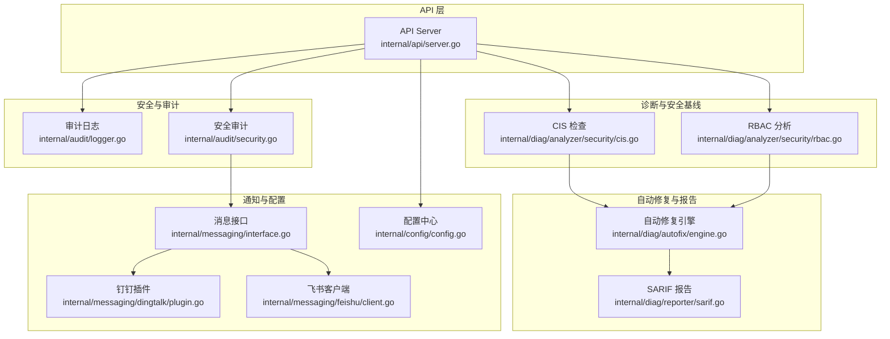
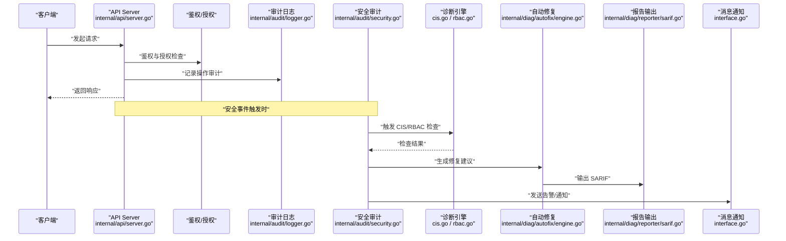
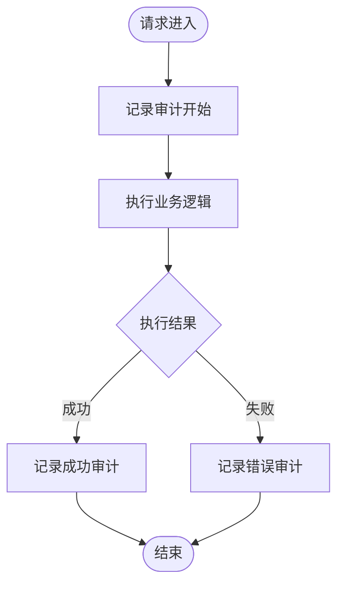
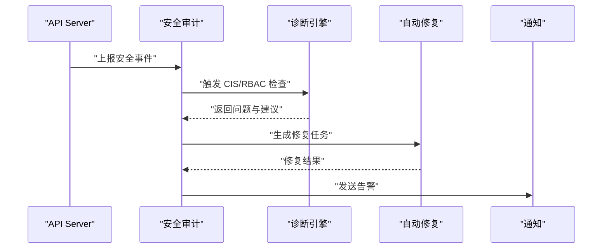
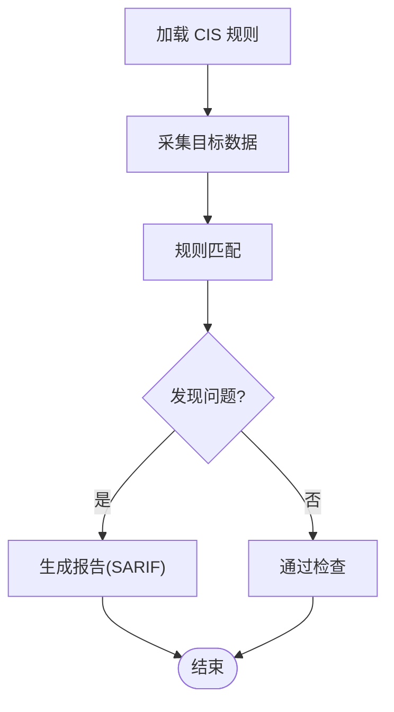
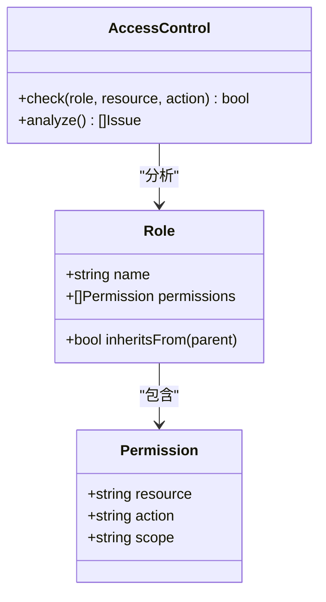
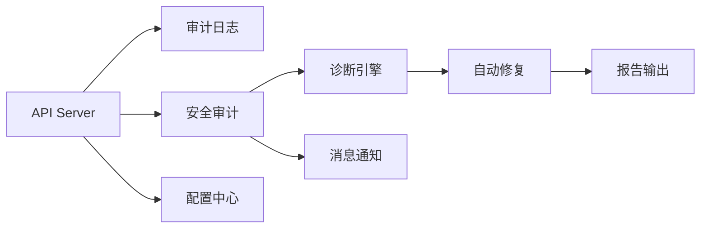

# 安全架构

<cite>
**本文引用的文件**   
- [internal/audit/logger.go](file://internal/audit/logger.go)
- [internal/audit/security.go](file://internal/audit/security.go)
- [internal/api/server.go](file://internal/api/server.go)
- [internal/config/config.go](file://internal/config/config.go)
- [internal/diag/analyzer/security/cis.go](file://internal/diag/analyzer/security/cis.go)
- [internal/diag/analyzer/security/rbac.go](file://internal/diag/analyzer/security/rbac.go)
- [internal/diag/analyzer/security/rbac_test.go](file://internal/diag/analyzer/security/rbac_test.go)
- [internal/diag/analyzer/security/cis_test.go](file://internal/diag/analyzer/security/cis_test.go)
- [internal/diag/autofix/engine.go](file://internal/diag/autofix/engine.go)
- [internal/diag/reporter/sarif.go](file://internal/diag/reporter/sarif.go)
- [internal/messaging/interface.go](file://internal/messaging/interface.go)
- [internal/messaging/dingtalk/plugin.go](file://internal/messaging/dingtalk/plugin.go)
- [internal/messaging/feishu/client.go](file://internal/messaging/feishu/client.go)
- [configs/config.yaml.example](file://configs/config.yaml.example)
- [go.mod](file://go.mod)
</cite>

## 目录
1. [简介](#简介)
2. [项目结构](#项目结构)
3. [核心组件](#核心组件)
4. [架构总览](#架构总览)
5. [详细组件分析](#详细组件分析)
6. [依赖关系分析](#依赖关系分析)
7. [性能考虑](#性能考虑)
8. [故障排查指南](#故障排查指南)
9. [结论](#结论)
10. [附录](#附录)

## 简介
本技术文档围绕 Klaw 平台的安全架构展开，系统性阐述多层安全防护体系：身份认证、授权控制与审计日志；RBAC 权限模型（角色定义、权限继承、资源访问控制）；安全审计机制（操作日志记录、安全事件检测、合规性检查）；CIS 安全基准检查的自动化评估与修复建议；数据传输加密、存储安全与网络安全防护；以及安全配置指南、漏洞扫描集成与安全事件响应流程。文档面向不同技术背景的读者，提供从概览到代码级细节的分层说明，并辅以可视化图示帮助理解。

## 项目结构
Klaw 的安全相关能力主要分布在以下模块：
- 审计与日志：internal/audit
- API 网关与鉴权入口：internal/api
- 配置管理：internal/config
- 诊断与安全基线检查：internal/diag/analyzer/security
- 自动修复引擎：internal/diag/autofix
- 报告输出（含 SARIF）：internal/diag/reporter
- 消息通知（钉钉、飞书）：internal/messaging
- 运行时依赖与版本：go.mod

**图表来源** 
- [internal/api/server.go](file://internal/api/server.go)
- [internal/audit/logger.go](file://internal/audit/logger.go)
- [internal/audit/security.go](file://internal/audit/security.go)
- [internal/diag/analyzer/security/cis.go](file://internal/diag/analyzer/security/cis.go)
- [internal/diag/analyzer/security/rbac.go](file://internal/diag/analyzer/security/rbac.go)
- [internal/diag/autofix/engine.go](file://internal/diag/autofix/engine.go)
- [internal/diag/reporter/sarif.go](file://internal/diag/reporter/sarif.go)
- [internal/messaging/interface.go](file://internal/messaging/interface.go)
- [internal/messaging/dingtalk/plugin.go](file://internal/messaging/dingtalk/plugin.go)
- [internal/messaging/feishu/client.go](file://internal/messaging/feishu/client.go)
- [internal/config/config.go](file://internal/config/config.go)

**章节来源**
- [internal/api/server.go](file://internal/api/server.go)
- [internal/audit/logger.go](file://internal/audit/logger.go)
- [internal/audit/security.go](file://internal/audit/security.go)
- [internal/config/config.go](file://internal/config/config.go)
- [internal/diag/analyzer/security/cis.go](file://internal/diag/analyzer/security/cis.go)
- [internal/diag/analyzer/security/rbac.go](file://internal/diag/analyzer/security/rbac.go)
- [internal/diag/autofix/engine.go](file://internal/diag/autofix/engine.go)
- [internal/diag/reporter/sarif.go](file://internal/diag/reporter/sarif.go)
- [internal/messaging/interface.go](file://internal/messaging/interface.go)
- [internal/messaging/dingtalk/plugin.go](file://internal/messaging/dingtalk/plugin.go)
- [internal/messaging/feishu/client.go](file://internal/messaging/feishu/client.go)

## 核心组件
- 审计日志子系统：负责统一记录操作行为、关键事件与错误上下文，支持结构化输出与可观测性对接。
- 安全审计子系统：聚焦安全相关事件（如鉴权失败、越权尝试、异常登录等），进行聚合与告警。
- 配置管理：集中加载与校验安全相关配置项（如 TLS、审计开关、通知渠道等）。
- 诊断与安全基线：实现 CIS 基准检查与 RBAC 分析，生成问题清单与修复建议。
- 自动修复引擎：基于规则将“问题”转化为“修复动作”，支持幂等与回滚策略。
- 报告输出：以 SARIF 等标准格式输出检查结果，便于与 CI/CD 和工单系统集成。
- 消息通知：通过钉钉、飞书等通道推送安全事件与修复结果。

**章节来源**
- [internal/audit/logger.go](file://internal/audit/logger.go)
- [internal/audit/security.go](file://internal/audit/security.go)
- [internal/config/config.go](file://internal/config/config.go)
- [internal/diag/analyzer/security/cis.go](file://internal/diag/analyzer/security/cis.go)
- [internal/diag/analyzer/security/rbac.go](file://internal/diag/analyzer/security/rbac.go)
- [internal/diag/autofix/engine.go](file://internal/diag/autofix/engine.go)
- [internal/diag/reporter/sarif.go](file://internal/diag/reporter/sarif.go)
- [internal/messaging/interface.go](file://internal/messaging/interface.go)
- [internal/messaging/dingtalk/plugin.go](file://internal/messaging/dingtalk/plugin.go)
- [internal/messaging/feishu/client.go](file://internal/messaging/feishu/client.go)

## 架构总览
Klaw 的安全架构采用分层设计：
- 接入层：API Server 作为统一入口，执行请求解析、鉴权前置校验与审计埋点。
- 业务层：各功能域服务调用 RBAC 与审计能力，确保最小权限与可追溯。
- 安全能力层：审计日志、安全审计、CIS/RBAC 诊断、自动修复、报告与通知。
- 基础设施层：配置中心、消息通道、外部系统（CI/CD、工单、SIEM）。

**图表来源** 
- [internal/api/server.go](file://internal/api/server.go)
- [internal/audit/logger.go](file://internal/audit/logger.go)
- [internal/audit/security.go](file://internal/audit/security.go)
- [internal/diag/analyzer/security/cis.go](file://internal/diag/analyzer/security/cis.go)
- [internal/diag/analyzer/security/rbac.go](file://internal/diag/analyzer/security/rbac.go)
- [internal/diag/autofix/engine.go](file://internal/diag/autofix/engine.go)
- [internal/diag/reporter/sarif.go](file://internal/diag/reporter/sarif.go)
- [internal/messaging/interface.go](file://internal/messaging/interface.go)

## 详细组件分析

### 审计日志子系统
- 职责：统一记录用户操作、系统事件、错误上下文；支持结构化字段（时间戳、主体、资源、动作、结果、追踪ID等）。
- 关键点：
  - 高可用写入：异步落盘或缓冲队列，避免阻塞主流程。
  - 敏感信息脱敏：对密码、令牌、密钥等字段进行掩码处理。
  - 可观测性：与日志采集器对接，支持按维度检索与聚合。
- 典型流程：请求进入 -> 记录开始 -> 执行业务 -> 记录结束/异常 -> 可选上报。

**图表来源** 
- [internal/audit/logger.go](file://internal/audit/logger.go)

**章节来源**
- [internal/audit/logger.go](file://internal/audit/logger.go)

### 安全审计子系统
- 职责：识别安全相关事件（鉴权失败、越权访问、异常登录、敏感操作），进行聚合、评分与告警。
- 关键点：
  - 事件分类与严重等级划分。
  - 与诊断引擎联动，触发 CIS/RBAC 检查。
  - 与通知通道集成，实时推送。
- 典型流程：捕获事件 -> 判定严重性 -> 关联上下文 -> 触发诊断/修复 -> 输出报告 -> 通知。

**图表来源** 
- [internal/audit/security.go](file://internal/audit/security.go)
- [internal/diag/analyzer/security/cis.go](file://internal/diag/analyzer/security/cis.go)
- [internal/diag/analyzer/security/rbac.go](file://internal/diag/analyzer/security/rbac.go)
- [internal/diag/autofix/engine.go](file://internal/diag/autofix/engine.go)
- [internal/messaging/interface.go](file://internal/messaging/interface.go)

**章节来源**
- [internal/audit/security.go](file://internal/audit/security.go)

### 配置管理（安全相关）
- 职责：集中加载与校验安全配置，包括 TLS、审计开关、通知渠道、诊断策略等。
- 关键点：
  - 环境变量与配置文件优先级。
  - 默认值与强制校验，防止不安全默认配置。
  - 动态更新与热重载（如适用）。

**章节来源**
- [internal/config/config.go](file://internal/config/config.go)
- [configs/config.yaml.example](file://configs/config.yaml.example)

### CIS 安全基准检查
- 职责：依据 CIS 基准对集群/应用进行自动化检查，输出问题清单与修复建议。
- 关键点：
  - 规则集管理与扩展。
  - 检查范围覆盖网络、存储、工作负载、控制面等。
  - 结果标准化（支持 SARIF）。
- 典型流程：加载规则 -> 采集数据 -> 匹配规则 -> 生成问题 -> 输出报告。

**图表来源** 
- [internal/diag/analyzer/security/cis.go](file://internal/diag/analyzer/security/cis.go)
- [internal/diag/reporter/sarif.go](file://internal/diag/reporter/sarif.go)

**章节来源**
- [internal/diag/analyzer/security/cis.go](file://internal/diag/analyzer/security/cis.go)
- [internal/diag/analyzer/security/cis_test.go](file://internal/diag/analyzer/security/cis_test.go)

### RBAC 权限模型与分析
- 职责：定义角色、权限与资源访问控制，分析现有 RBAC 配置，发现过度授权与缺失限制。
- 关键点：
  - 角色定义与权限继承。
  - 资源访问控制矩阵。
  - 分析与测试用例保障正确性。
- 典型流程：读取 RBAC 配置 -> 构建权限图 -> 分析风险 -> 输出建议。

**图表来源** 
- [internal/diag/analyzer/security/rbac.go](file://internal/diag/analyzer/security/rbac.go)

**章节来源**
- [internal/diag/analyzer/security/rbac.go](file://internal/diag/analyzer/security/rbac.go)
- [internal/diag/analyzer/security/rbac_test.go](file://internal/diag/analyzer/security/rbac_test.go)

### 自动修复引擎
- 职责：将诊断结果转换为可执行的修复动作，支持幂等、回滚与审批流程。
- 关键点：
  - 规则驱动修复策略。
  - 执行环境隔离与权限控制。
  - 修复结果验证与回滚。

**章节来源**
- [internal/diag/autofix/engine.go](file://internal/diag/autofix/engine.go)

### 报告输出（SARIF）
- 职责：将检查结果以 SARIF 标准格式输出，便于与 CI/CD 和工单系统集成。
- 关键点：
  - 字段映射与版本兼容。
  - 多语言与工具链支持。

**章节来源**
- [internal/diag/reporter/sarif.go](file://internal/diag/reporter/sarif.go)

### 消息通知（钉钉、飞书）
- 职责：通过企业即时通讯工具推送安全事件与修复结果。
- 关键点：
  - 统一消息接口抽象。
  - 多渠道适配与重试机制。

**章节来源**
- [internal/messaging/interface.go](file://internal/messaging/interface.go)
- [internal/messaging/dingtalk/plugin.go](file://internal/messaging/dingtalk/plugin.go)
- [internal/messaging/feishu/client.go](file://internal/messaging/feishu/client.go)

## 依赖关系分析
- 内部依赖：
  - API Server 依赖审计、安全审计、配置与诊断引擎。
  - 安全审计依赖诊断引擎与通知通道。
  - 诊断引擎依赖规则集与数据采集器。
  - 自动修复依赖诊断结果与执行环境。
  - 报告输出依赖诊断结果与格式化器。
- 外部依赖：
  - 消息通道（钉钉、飞书）。
  - CI/CD 与工单系统（通过 SARIF 集成）。
  - 日志采集与 SIEM（通过结构化日志）。

**图表来源** 
- [internal/api/server.go](file://internal/api/server.go)
- [internal/audit/logger.go](file://internal/audit/logger.go)
- [internal/audit/security.go](file://internal/audit/security.go)
- [internal/config/config.go](file://internal/config/config.go)
- [internal/diag/analyzer/security/cis.go](file://internal/diag/analyzer/security/cis.go)
- [internal/diag/analyzer/security/rbac.go](file://internal/diag/analyzer/security/rbac.go)
- [internal/diag/autofix/engine.go](file://internal/diag/autofix/engine.go)
- [internal/diag/reporter/sarif.go](file://internal/diag/reporter/sarif.go)
- [internal/messaging/interface.go](file://internal/messaging/interface.go)

**章节来源**
- [go.mod](file://go.mod)

## 性能考虑
- 审计日志写入应异步化，避免影响主链路延迟。
- 安全事件聚合与去重，降低高频噪声。
- 诊断规则按需加载与缓存，减少重复计算。
- 自动修复任务限流与并发控制，避免资源争用。
- 报告输出批量处理，减少 I/O 开销。

[本节为通用指导，不直接分析具体文件]

## 故障排查指南
- 常见问题：
  - 审计日志丢失：检查写入队列、磁盘空间与权限。
  - 安全事件未告警：确认事件分类与阈值配置。
  - CIS/RBAC 检查失败：核对规则集版本与目标环境差异。
  - 自动修复失败：查看执行日志与回滚状态。
  - 通知未送达：检查通道配置与网络连通性。
- 定位步骤：
  - 通过结构化日志检索追踪 ID。
  - 使用 SARIF 报告定位问题根因。
  - 结合诊断结果与修复建议逐步验证。

**章节来源**
- [internal/audit/logger.go](file://internal/audit/logger.go)
- [internal/audit/security.go](file://internal/audit/security.go)
- [internal/diag/analyzer/security/cis.go](file://internal/diag/analyzer/security/cis.go)
- [internal/diag/analyzer/security/rbac.go](file://internal/diag/analyzer/security/rbac.go)
- [internal/diag/autofix/engine.go](file://internal/diag/autofix/engine.go)
- [internal/diag/reporter/sarif.go](file://internal/diag/reporter/sarif.go)
- [internal/messaging/interface.go](file://internal/messaging/interface.go)

## 结论
Klaw 的安全架构通过分层设计与模块化能力，实现了从接入鉴权、授权控制到审计日志、安全事件检测与合规检查的闭环。CIS 基准检查与 RBAC 分析提供了自动化评估与修复建议，配合 SARIF 报告与消息通知，形成完整的安全运营体系。建议在部署中严格遵循安全配置指南，持续集成漏洞扫描，并建立标准化的安全事件响应流程，以提升整体安全水位与运维效率。

[本节为总结性内容，不直接分析具体文件]

## 附录
- 安全配置指南要点：
  - 启用 TLS 与强加密套件。
  - 开启审计日志与敏感字段脱敏。
  - 配置 RBAC 最小权限原则。
  - 设置 CIS 检查频率与阈值。
  - 配置通知渠道与告警路由。
- 漏洞扫描集成：
  - 在 CI/CD 中集成 SARIF 消费与门禁。
  - 定期执行 CIS/RBAC 检查并归档报告。
- 安全事件响应流程：
  - 事件分级与分派。
  - 根因分析与修复验证。
  - 复盘与改进措施。

[本节为补充性内容，不直接分析具体文件]