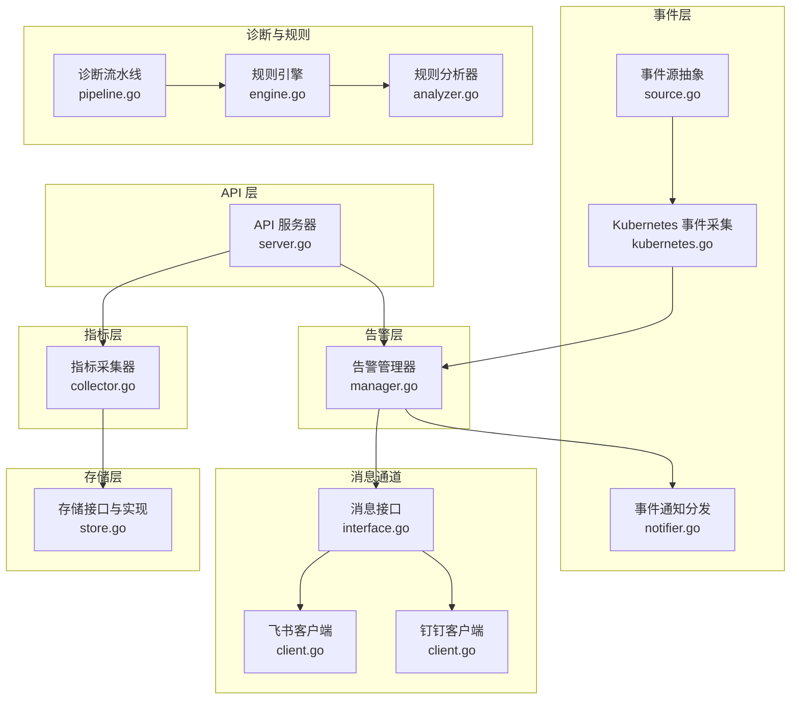
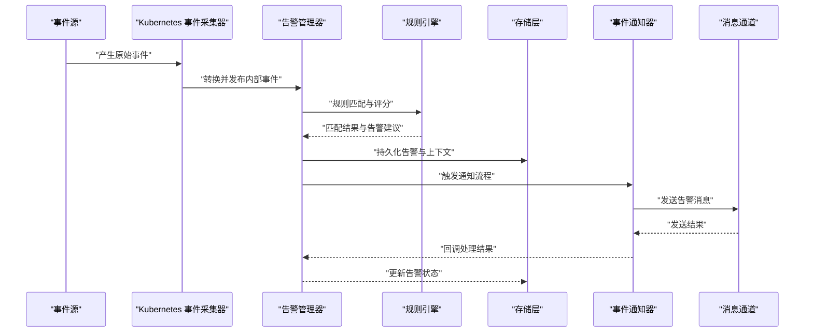
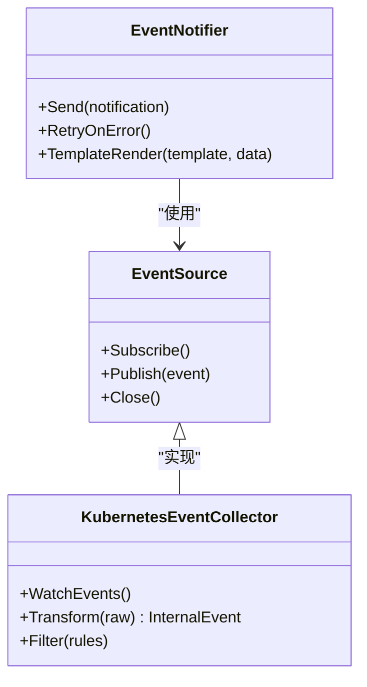
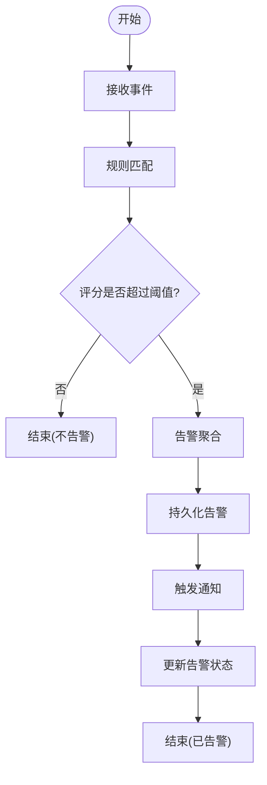
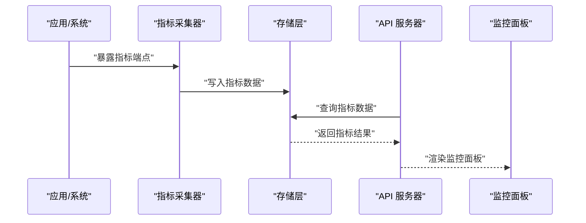
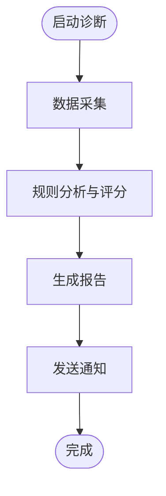
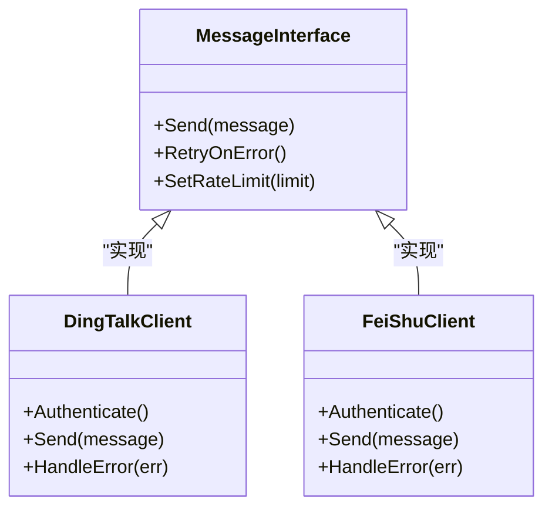
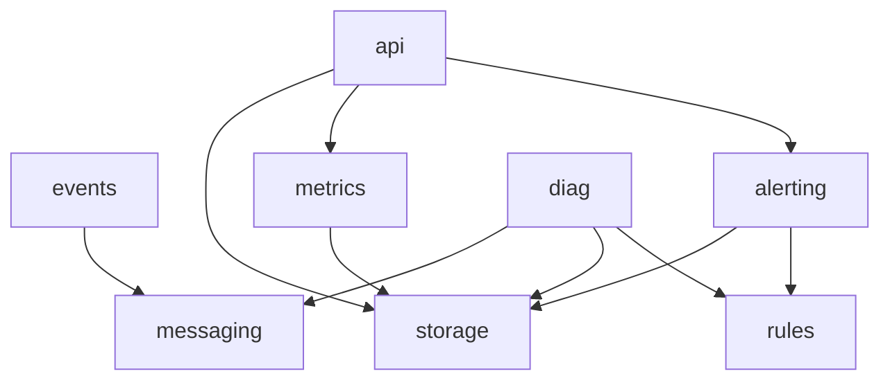

# 数据流架构

<cite>
**本文引用的文件**   
- [internal/events/source.go](file://internal/events/source.go)
- [internal/events/kubernetes.go](file://internal/events/kubernetes.go)
- [internal/events/notifier.go](file://internal/events/notifier.go)
- [internal/alerting/manager.go](file://internal/alerting/manager.go)
- [internal/api/server.go](file://internal/api/server.go)
- [internal/metrics/collector.go](file://internal/metrics/collector.go)
- [internal/storage/store.go](file://internal/storage/store.go)
- [internal/diag/pipeline.go](file://internal/diag/pipeline.go)
- [internal/diag/rules/engine.go](file://internal/diag/rules/engine.go)
- [internal/diag/rules/analyzer.go](file://internal/diag/rules/analyzer.go)
- [internal/diag/notifier/notifier.go](file://internal/diag/notifier/notifier.go)
- [internal/messaging/interface.go](file://internal/messaging/interface.go)
- [internal/messaging/dingtalk/client.go](file://internal/messaging/dingtalk/client.go)
- [internal/messaging/feishu/client.go](file://internal/messaging/feishu/client.go)
- [configs/config.yaml](file://configs/config.yaml)
- [go.mod](file://go.mod)
</cite>

## 目录
1. [简介](#简介)
2. [项目结构](#项目结构)
3. [核心组件](#核心组件)
4. [架构总览](#架构总览)
5. [详细组件分析](#详细组件分析)
6. [依赖关系分析](#依赖关系分析)
7. [性能考量](#性能考量)
8. [故障排查指南](#故障排查指南)
9. [结论](#结论)
10. [附录](#附录)

## 简介
本技术文档围绕 Klaw 平台的数据流架构，系统性阐述从数据采集、处理、存储到展示的端到端链路。重点覆盖事件驱动架构（事件源抽象、事件处理器与消息队列集成）、告警系统（规则匹配、告警聚合与通知发送）、指标收集与分析管道（实时监控与性能分析），以及数据一致性保证、错误重试机制与流量控制策略。同时提供数据流监控、调试与优化指南，帮助读者快速定位问题并提升系统稳定性与吞吐能力。

## 项目结构
Klaw 采用模块化设计，按职责划分多个内部包：
- events：事件源抽象与 Kubernetes 事件采集、通知分发
- alerting：告警管理器，负责规则评估与告警生命周期管理
- api：HTTP API 服务入口与路由
- metrics：指标采集与导出
- storage：数据存储接口与实现
- diag：诊断流水线、规则引擎、报告与通知
- messaging：消息通道抽象与具体实现（钉钉、飞书等）
- configs：配置加载与默认值
- go.mod：模块依赖声明

图表来源
- [internal/events/source.go:1-200](file://internal/events/source.go#L1-L200)
- [internal/events/kubernetes.go:1-200](file://internal/events/kubernetes.go#L1-L200)
- [internal/events/notifier.go:1-200](file://internal/events/notifier.go#L1-L200)
- [internal/alerting/manager.go:1-200](file://internal/alerting/manager.go#L1-L200)
- [internal/api/server.go:1-200](file://internal/api/server.go#L1-L200)
- [internal/metrics/collector.go:1-200](file://internal/metrics/collector.go#L1-L200)
- [internal/storage/store.go:1-200](file://internal/storage/store.go#L1-L200)
- [internal/diag/pipeline.go:1-200](file://internal/diag/pipeline.go#L1-L200)
- [internal/diag/rules/engine.go:1-200](file://internal/diag/rules/engine.go#L1-L200)
- [internal/diag/rules/analyzer.go:1-200](file://internal/diag/rules/analyzer.go#L1-L200)
- [internal/messaging/interface.go:1-200](file://internal/messaging/interface.go#L1-L200)
- [internal/messaging/dingtalk/client.go:1-200](file://internal/messaging/dingtalk/client.go#L1-L200)
- [internal/messaging/feishu/client.go:1-200](file://internal/messaging/feishu/client.go#L1-L200)

章节来源
- [internal/events/source.go:1-200](file://internal/events/source.go#L1-L200)
- [internal/alerting/manager.go:1-200](file://internal/alerting/manager.go#L1-L200)
- [internal/api/server.go:1-200](file://internal/api/server.go#L1-L200)
- [internal/metrics/collector.go:1-200](file://internal/metrics/collector.go#L1-L200)
- [internal/storage/store.go:1-200](file://internal/storage/store.go#L1-L200)
- [internal/diag/pipeline.go:1-200](file://internal/diag/pipeline.go#L1-L200)
- [internal/diag/rules/engine.go:1-200](file://internal/diag/rules/engine.go#L1-L200)
- [internal/diag/rules/analyzer.go:1-200](file://internal/diag/rules/analyzer.go#L1-L200)
- [internal/messaging/interface.go:1-200](file://internal/messaging/interface.go#L1-L200)
- [internal/messaging/dingtalk/client.go:1-200](file://internal/messaging/dingtalk/client.go#L1-L200)
- [internal/messaging/feishu/client.go:1-200](file://internal/messaging/feishu/client.go#L1-L200)
- [configs/config.yaml:1-200](file://configs/config.yaml#L1-L200)
- [go.mod:1-200](file://go.mod#L1-L200)

## 核心组件
- 事件源抽象与采集
  - 事件源接口定义统一的订阅与发布语义，屏蔽不同数据源的差异。
  - Kubernetes 事件采集器监听集群事件，转换为内部事件模型，进入处理管线。
  - 事件通知器将处理结果转发至消息通道或外部系统。

- 告警管理器
  - 接收事件后执行规则匹配、阈值判断与聚合策略，生成告警实例。
  - 维护告警状态机（新建、抑制、恢复、升级），支持去重与合并。

- API 服务器
  - 暴露 RESTful 接口用于查询告警、指标、诊断结果与触发手动任务。
  - 作为编排入口，协调各子系统调用。

- 指标采集器
  - 周期性采集系统与应用指标，进行聚合与导出，供监控面板展示。

- 存储层
  - 提供统一存储接口，支持持久化告警、指标与诊断结果。
  - 封装读写事务与一致性策略。

- 诊断流水线与规则引擎
  - 诊断流水线串联采集、分析、报告与通知步骤。
  - 规则引擎加载规则集，对输入数据进行匹配与评分，输出问题与建议。

- 消息通道
  - 抽象消息发送接口，支持多通道（钉钉、飞书等）。
  - 客户端实现负责鉴权、限流与重试。

章节来源
- [internal/events/source.go:1-200](file://internal/events/source.go#L1-L200)
- [internal/events/kubernetes.go:1-200](file://internal/events/kubernetes.go#L1-L200)
- [internal/events/notifier.go:1-200](file://internal/events/notifier.go#L1-L200)
- [internal/alerting/manager.go:1-200](file://internal/alerting/manager.go#L1-L200)
- [internal/api/server.go:1-200](file://internal/api/server.go#L1-L200)
- [internal/metrics/collector.go:1-200](file://internal/metrics/collector.go#L1-L200)
- [internal/storage/store.go:1-200](file://internal/storage/store.go#L1-L200)
- [internal/diag/pipeline.go:1-200](file://internal/diag/pipeline.go#L1-L200)
- [internal/diag/rules/engine.go:1-200](file://internal/diag/rules/engine.go#L1-L200)
- [internal/diag/rules/analyzer.go:1-200](file://internal/diag/rules/analyzer.go#L1-L200)
- [internal/messaging/interface.go:1-200](file://internal/messaging/interface.go#L1-L200)
- [internal/messaging/dingtalk/client.go:1-200](file://internal/messaging/dingtalk/client.go#L1-L200)
- [internal/messaging/feishu/client.go:1-200](file://internal/messaging/feishu/client.go#L1-L200)

## 架构总览
Klaw 的数据流以事件为驱动，贯穿采集、处理、存储与展示全链路。事件源抽象统一接入多种数据源；事件处理器基于规则引擎与告警管理器进行决策；指标采集器提供实时观测；存储层保障数据一致性与可回溯；消息通道完成告警通知。

图表来源
- [internal/events/kubernetes.go:1-200](file://internal/events/kubernetes.go#L1-L200)
- [internal/alerting/manager.go:1-200](file://internal/alerting/manager.go#L1-L200)
- [internal/diag/rules/engine.go:1-200](file://internal/diag/rules/engine.go#L1-L200)
- [internal/storage/store.go:1-200](file://internal/storage/store.go#L1-L200)
- [internal/events/notifier.go:1-200](file://internal/events/notifier.go#L1-L200)
- [internal/messaging/interface.go:1-200](file://internal/messaging/interface.go#L1-L200)

## 详细组件分析

### 事件源与采集器
- 事件源抽象
  - 定义订阅、发布与生命周期管理方法，确保可扩展的接入方式。
  - 支持批量事件与增量拉取，降低对上游系统的压力。

- Kubernetes 事件采集器
  - 监听集群事件，过滤与归一化为内部事件模型。
  - 支持命名空间与资源类型过滤，减少无关事件流入。

- 事件通知器
  - 将处理结果通过消息通道发送，支持模板化内容与多通道适配。

图表来源
- [internal/events/source.go:1-200](file://internal/events/source.go#L1-L200)
- [internal/events/kubernetes.go:1-200](file://internal/events/kubernetes.go#L1-L200)
- [internal/events/notifier.go:1-200](file://internal/events/notifier.go#L1-L200)

章节来源
- [internal/events/source.go:1-200](file://internal/events/source.go#L1-L200)
- [internal/events/kubernetes.go:1-200](file://internal/events/kubernetes.go#L1-L200)
- [internal/events/notifier.go:1-200](file://internal/events/notifier.go#L1-L200)

### 告警管理器与规则引擎
- 告警管理器
  - 接收事件后执行规则匹配、阈值判断与聚合策略。
  - 维护告警状态机（新建、抑制、恢复、升级），支持去重与合并。
  - 与存储层交互，持久化告警上下文与历史。

- 规则引擎
  - 加载规则集，对输入数据进行匹配与评分。
  - 支持动态规则更新与热加载，提高灵活性。

图表来源
- [internal/alerting/manager.go:1-200](file://internal/alerting/manager.go#L1-L200)
- [internal/diag/rules/engine.go:1-200](file://internal/diag/rules/engine.go#L1-L200)
- [internal/diag/rules/analyzer.go:1-200](file://internal/diag/rules/analyzer.go#L1-L200)

章节来源
- [internal/alerting/manager.go:1-200](file://internal/alerting/manager.go#L1-L200)
- [internal/diag/rules/engine.go:1-200](file://internal/diag/rules/engine.go#L1-L200)
- [internal/diag/rules/analyzer.go:1-200](file://internal/diag/rules/analyzer.go#L1-L200)

### 指标采集与分析管道
- 指标采集器
  - 周期性采集系统与应用指标，进行聚合与导出。
  - 支持自定义采集器与插件扩展。

- 存储与展示
  - 指标数据写入存储层，供监控面板与查询接口使用。
  - 支持时间序列压缩与分片存储，提升查询性能。

图表来源
- [internal/metrics/collector.go:1-200](file://internal/metrics/collector.go#L1-L200)
- [internal/storage/store.go:1-200](file://internal/storage/store.go#L1-L200)
- [internal/api/server.go:1-200](file://internal/api/server.go#L1-L200)

章节来源
- [internal/metrics/collector.go:1-200](file://internal/metrics/collector.go#L1-L200)
- [internal/storage/store.go:1-200](file://internal/storage/store.go#L1-L200)
- [internal/api/server.go:1-200](file://internal/api/server.go#L1-L200)

### 诊断流水线与通知
- 诊断流水线
  - 串联采集、分析、报告与通知步骤，支持并行与串行组合。
  - 提供进度跟踪与错误恢复机制。

- 通知
  - 通过消息通道发送告警与诊断结果，支持模板化内容。
  - 支持多通道并发发送与失败重试。

图表来源
- [internal/diag/pipeline.go:1-200](file://internal/diag/pipeline.go#L1-L200)
- [internal/diag/notifier/notifier.go:1-200](file://internal/diag/notifier/notifier.go#L1-L200)

章节来源
- [internal/diag/pipeline.go:1-200](file://internal/diag/pipeline.go#L1-L200)
- [internal/diag/notifier/notifier.go:1-200](file://internal/diag/notifier/notifier.go#L1-L200)

### 消息通道与集成
- 消息接口
  - 抽象消息发送接口，支持多通道适配。
  - 定义重试、限流与模板渲染能力。

- 具体实现
  - 钉钉与飞书客户端实现鉴权、限流与重试逻辑。
  - 支持批量发送与失败回退。

图表来源
- [internal/messaging/interface.go:1-200](file://internal/messaging/interface.go#L1-L200)
- [internal/messaging/dingtalk/client.go:1-200](file://internal/messaging/dingtalk/client.go#L1-L200)
- [internal/messaging/feishu/client.go:1-200](file://internal/messaging/feishu/client.go#L1-L200)

章节来源
- [internal/messaging/interface.go:1-200](file://internal/messaging/interface.go#L1-L200)
- [internal/messaging/dingtalk/client.go:1-200](file://internal/messaging/dingtalk/client.go#L1-L200)
- [internal/messaging/feishu/client.go:1-200](file://internal/messaging/feishu/client.go#L1-L200)

## 依赖关系分析
Klaw 的各模块通过清晰的接口解耦，依赖关系如下：
- events 依赖 messaging 进行通知
- alerting 依赖 rules 与 storage
- metrics 依赖 storage
- api 依赖 alerting、metrics 与 storage
- diag 依赖 rules、storage 与 messaging

图表来源
- [internal/events/source.go:1-200](file://internal/events/source.go#L1-L200)
- [internal/alerting/manager.go:1-200](file://internal/alerting/manager.go#L1-L200)
- [internal/metrics/collector.go:1-200](file://internal/metrics/collector.go#L1-L200)
- [internal/api/server.go:1-200](file://internal/api/server.go#L1-L200)
- [internal/diag/pipeline.go:1-200](file://internal/diag/pipeline.go#L1-L200)
- [internal/messaging/interface.go:1-200](file://internal/messaging/interface.go#L1-L200)

章节来源
- [internal/events/source.go:1-200](file://internal/events/source.go#L1-L200)
- [internal/alerting/manager.go:1-200](file://internal/alerting/manager.go#L1-L200)
- [internal/metrics/collector.go:1-200](file://internal/metrics/collector.go#L1-L200)
- [internal/api/server.go:1-200](file://internal/api/server.go#L1-L200)
- [internal/diag/pipeline.go:1-200](file://internal/diag/pipeline.go#L1-L200)
- [internal/messaging/interface.go:1-200](file://internal/messaging/interface.go#L1-L200)

## 性能考量
- 事件处理
  - 使用批处理与异步队列提升吞吐，避免阻塞主流程。
  - 对高频事件进行采样与聚合，降低下游压力。

- 指标采集
  - 采用拉取模式与缓存机制，减少重复计算。
  - 支持分片存储与索引优化，提升查询性能。

- 存储层
  - 使用事务与乐观锁保证一致性，避免竞态条件。
  - 支持读写分离与冷热数据分层，降低成本。

- 消息通道
  - 实现指数退避重试与熔断机制，提高鲁棒性。
  - 支持批量发送与限流，避免被上游系统拒绝。

[本节为通用指导，无需特定文件引用]

## 故障排查指南
- 事件丢失
  - 检查事件源连接与订阅状态，确认过滤器配置正确。
  - 查看事件处理日志与重试记录，定位失败原因。

- 告警误报/漏报
  - 验证规则匹配逻辑与阈值设置，检查聚合策略。
  - 查看告警状态机流转，确认抑制与恢复逻辑。

- 指标异常
  - 检查采集器健康状态与导出端点可用性。
  - 查看存储写入延迟与查询响应时间。

- 通知失败
  - 验证消息通道鉴权与限流配置。
  - 查看重试次数与错误码，定位上游系统问题。

章节来源
- [internal/events/source.go:1-200](file://internal/events/source.go#L1-L200)
- [internal/alerting/manager.go:1-200](file://internal/alerting/manager.go#L1-L200)
- [internal/metrics/collector.go:1-200](file://internal/metrics/collector.go#L1-L200)
- [internal/messaging/interface.go:1-200](file://internal/messaging/interface.go#L1-L200)

## 结论
Klaw 的数据流架构以事件驱动为核心，通过模块化设计与清晰接口解耦，实现了从采集、处理、存储到展示的完整链路。告警系统与规则引擎协同工作，保障问题及时发现与处理。指标采集与分析管道提供实时监控与性能洞察。通过一致性保证、错误重试与流量控制策略，系统在稳定性与性能上达到平衡。结合监控、调试与优化指南，可有效提升运维效率与系统可靠性。

[本节为总结性内容，无需特定文件引用]

## 附录
- 配置项说明
  - 事件源配置：订阅地址、过滤规则、批处理大小
  - 告警规则：阈值、聚合窗口、抑制策略
  - 指标采集：采集间隔、导出格式、存储后端
  - 消息通道：鉴权信息、限流参数、重试策略

- 最佳实践
  - 合理设置批处理大小与并发度，避免内存溢出
  - 使用分级告警与降噪策略，减少告警风暴
  - 定期清理历史数据，保持存储性能
  - 监控关键指标与错误率，建立告警闭环

[本节为补充信息，无需特定文件引用]