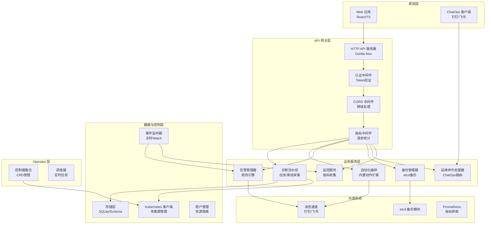
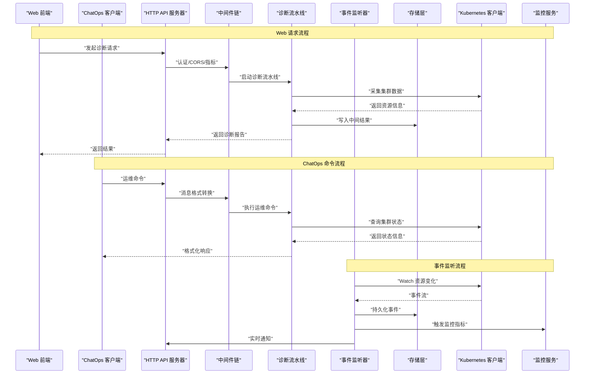
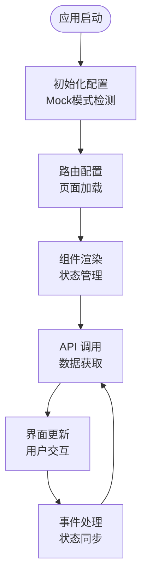
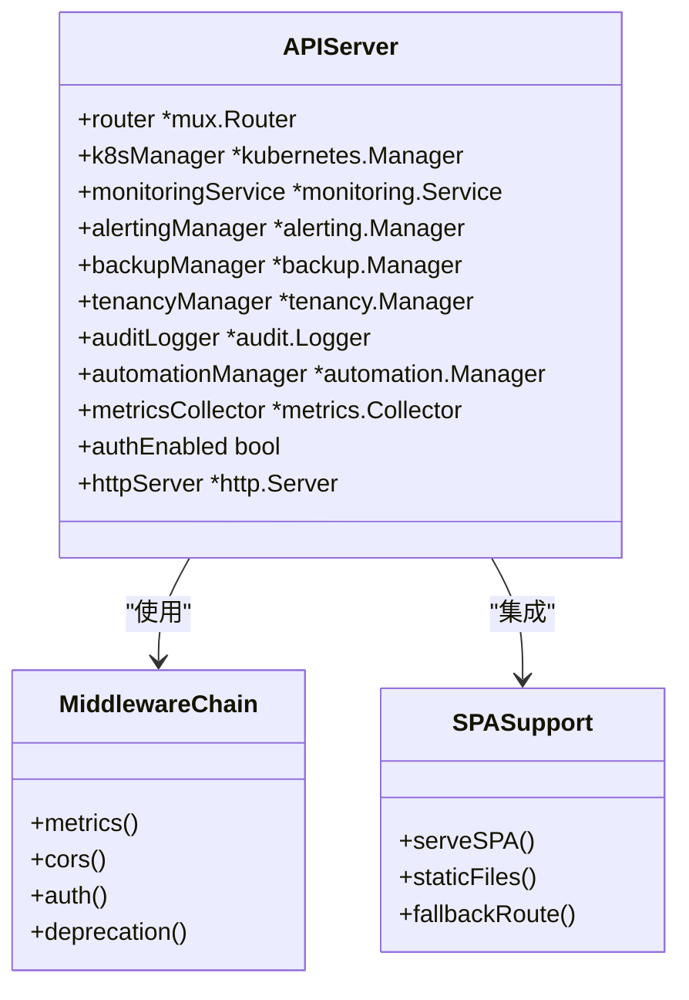
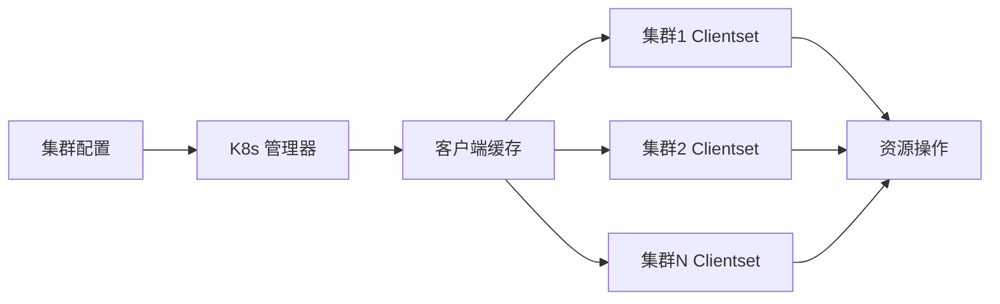
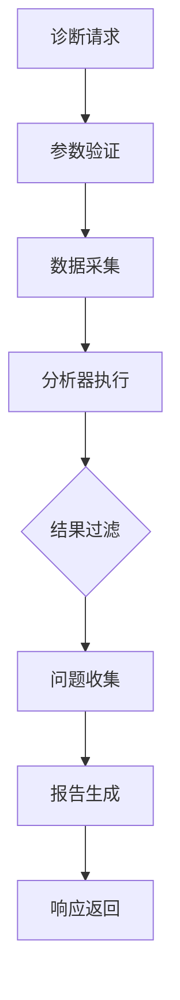
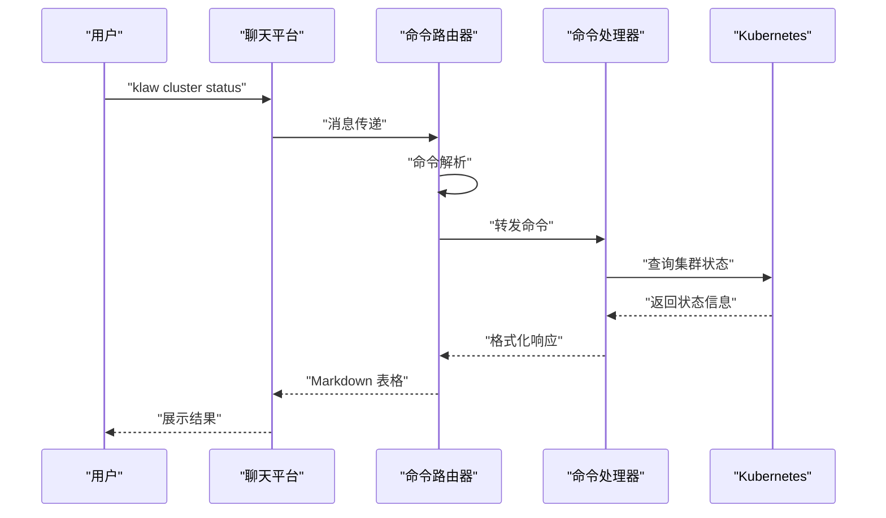
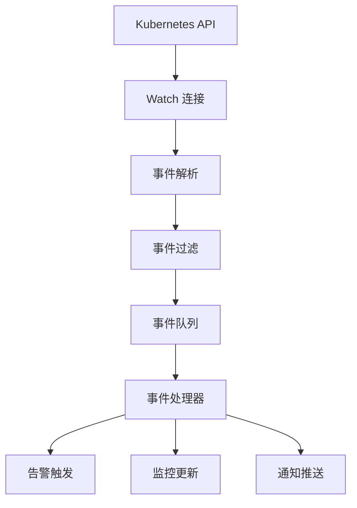

# 系统架构

<cite>
**本文引用的文件**   
- [go.mod](file://go.mod)
- [Dockerfile](file://Dockerfile)
- [Makefile](file://Makefile)
- [configs/config.yaml](file://configs/config.yaml)
- [cmd/klaw/main.go](file://cmd/klaw/main.go)
- [internal/api/server.go](file://internal/api/server.go)
- [internal/api/unified_v1.go](file://internal/api/unified_v1.go)
- [internal/config/config.go](file://internal/config/config.go)
- [internal/storage/store.go](file://internal/storage/store.go)
- [internal/monitoring/service.go](file://internal/monitoring/service.go)
- [internal/metrics/collector.go](file://internal/metrics/collector.go)
- [internal/alerting/manager.go](file://internal/alerting/manager.go)
- [internal/automation/manager.go](file://internal/automation/manager.go)
- [internal/backup/manager.go](file://internal/backup/manager.go)
- [internal/diag/pipeline.go](file://internal/diag/pipeline.go)
- [internal/diag/import.go](file://internal/diag/import.go)
- [internal/events/source.go](file://internal/events/source.go)
- [internal/events/notifier.go](file://internal/events/notifier.go)
- [internal/events/kubernetes.go](file://internal/events/kubernetes.go)
- [internal/kubernetes/manager.go](file://internal/kubernetes/manager.go)
- [internal/ops/router.go](file://internal/ops/router.go)
- [internal/ops/handler.go](file://internal/ops/handler.go)
- [operator/cmd/main.go](file://operator/cmd/main.go)
- [operator/controllers/clusterdiagnostic_controller.go](file://operator/controllers/clusterdiagnostic_controller.go)
- [operator/controllers/nodediagnostic_controller.go](file://operator/controllers/nodediagnostic_controller.go)
- [operator/controllers/schedule_controller.go](file://operator/controllers/schedule_controller.go)
- [helm/klaw/values.yaml](file://helm/klaw/values.yaml)
- [deployment/kind/manage.sh](file://deployment/kind/manage.sh)
- [web/src/lib/api.ts](file://web/src/lib/api.ts)
- [web/src/App.tsx](file://web/src/App.tsx)
- [web/src/main.tsx](file://web/src/main.tsx)
</cite>

## 更新摘要
**所做更改**
- 更新了系统架构描述，新增了Web UI、HTTP Server、K8s Manager、Diag Pipeline、Ops Router和Event Watcher的集成架构图
- 增强了组件交互和数据流分析
- 添加了事件监听和实时通信机制
- 完善了ChatOps和运维命令处理架构
- 更新了前后端分离架构的详细实现

## 目录
1. [简介](#简介)
2. [项目结构](#项目结构)
3. [核心组件](#核心组件)
4. [架构总览](#架构总览)
5. [详细组件分析](#详细组件分析)
6. [依赖关系分析](#依赖关系分析)
7. [性能考量](#性能考量)
8. [故障排查指南](#故障排查指南)
9. [结论](#结论)
10. [附录](#附录)

## 简介
本文件为 Klaw 平台的系统架构文档，面向开发者与运维人员，覆盖高层设计、架构模式、系统边界、组件交互、数据流与集成模式，并阐述技术决策、权衡与约束。文档同时给出基础设施需求、可扩展性考虑与部署拓扑，涵盖横切关注点（安全性、监控、可观测性与灾难恢复），并记录技术栈、第三方依赖与版本兼容性。

**最新更新**：本次更新重点增强了系统架构描述，新增了Web UI、HTTP Server、K8s Manager、Diag Pipeline、Ops Router和Event Watcher的完整集成架构图，展示了现代云原生平台的全景视图。

## 项目结构
Klaw 采用多模块、前后端分离与 Operator 协同的现代化架构：
- **后端服务**：Go 语言实现，提供 HTTP API、诊断流水线、自动化编排、备份与告警等能力。
- **前端应用**：React + TypeScript，通过 REST API 与后端交互，提供集群与节点诊断、监控、备份等界面。
- **Kubernetes Operator**：基于 controller-runtime，管理自定义资源（ClusterDiagnostic、NodeDiagnostic、Schedule），驱动诊断任务调度与执行。
- **ChatOps 集成**：支持钉钉、飞书等消息平台的运维命令处理。
- **事件监听系统**：实时监听 Kubernetes 事件，支持过滤、去重和通知推送。
- **配置与部署**：YAML 配置、Helm Chart、Kind 本地集群脚本、容器镜像构建。

**图表来源**
- [internal/api/server.go:29-78](file://internal/api/server.go#L29-L78)
- [internal/diag/pipeline.go:12-78](file://internal/diag/pipeline.go#L12-L78)
- [internal/ops/router.go:11-168](file://internal/ops/router.go#L11-L168)
- [internal/events/source.go:229-406](file://internal/events/source.go#L229-L406)
- [internal/kubernetes/manager.go:19-151](file://internal/kubernetes/manager.go#L19-L151)

**章节来源**
- [go.mod](file://go.mod)
- [Dockerfile](file://Dockerfile)
- [Makefile](file://Makefile)
- [configs/config.yaml](file://configs/config.yaml)

## 核心组件
- **HTTP API 服务器**：统一入口，路由到各业务处理器，承载 v1 API 与统一接口，支持中间件链式处理。
- **诊断流水线**：采集、分析与报告生成，支持离线与在线采集器、规则引擎、RCA、自动修复、成本分析等。
- **自动化编排**：内置与扩展动作编排，支持触发条件与执行策略。
- **告警管理器**：聚合事件与规则，向外部通知渠道发送告警。
- **备份管理器**：对 etcd 等进行备份与恢复操作。
- **运维命令处理器**：ChatOps 命令解析与执行，支持多种消息平台。
- **事件监听系统**：实时监听 Kubernetes 事件，支持过滤、去重和异步处理。
- **存储层**：结构化数据存储与 Schema 管理。
- **监控与指标**：暴露 Prometheus 指标，收集关键运行时指标。
- **Kubernetes 客户端**：访问集群资源，配合 Operator 完成控制循环。
- **Operator 控制器**：监听 CRD 变更，协调诊断任务生命周期。

**章节来源**
- [internal/api/server.go:29-163](file://internal/api/server.go#L29-L163)
- [internal/diag/pipeline.go:12-78](file://internal/diag/pipeline.go#L12-L78)
- [internal/automation/manager.go](file://internal/automation/manager.go)
- [internal/alerting/manager.go](file://internal/alerting/manager.go)
- [internal/backup/manager.go](file://internal/backup/manager.go)
- [internal/ops/router.go:11-168](file://internal/ops/router.go#L11-L168)
- [internal/events/source.go:229-406](file://internal/events/source.go#L229-L406)
- [internal/storage/store.go](file://internal/storage/store.go)
- [internal/monitoring/service.go](file://internal/monitoring/service.go)
- [internal/kubernetes/manager.go:19-151](file://internal/kubernetes/manager.go#L19-L151)
- [operator/controllers/clusterdiagnostic_controller.go](file://operator/controllers/clusterdiagnostic_controller.go)

## 架构总览
Klaw 采用"微服务 + Operator + ChatOps"的分层架构：
- **表现层**：Web 前端通过 REST API 与后端交互，ChatOps 客户端通过消息通道接入。
- **网关层**：HTTP API 作为统一网关，提供认证、限流、CORS、指标收集等横切功能。
- **服务层**：分发请求至诊断、自动化、告警、备份、运维命令等子系统。
- **数据与控制层**：存储层持久化状态；Kubernetes 客户端与 Operator 协作，将声明式 CRD 转化为实际运行态。
- **事件驱动层**：实时监听 Kubernetes 事件，驱动告警、监控和自动化响应。
- **横切能力**：监控、审计、安全、配置中心贯穿各层。

**图表来源**
- [internal/api/server.go:189-216](file://internal/api/server.go#L189-L216)
- [internal/diag/pipeline.go:27-73](file://internal/diag/pipeline.go#L27-L73)
- [internal/events/kubernetes.go:46-94](file://internal/events/kubernetes.go#L46-L94)
- [internal/ops/router.go:37-62](file://internal/ops/router.go#L37-L62)

## 详细组件分析

### Web UI 与前端架构
- **技术栈**：React 18 + TypeScript + Vite + Tailwind CSS
- **路由管理**：react-router-dom 实现页面级路由
- **状态管理**：Context API + 自定义 Hook
- **API 客户端**：Axios 封装，支持 Mock 模式
- **UI 组件**：Lucide React 图标库，响应式设计
- **开发工具**：Vitest 测试框架，MSW 模拟服务

**图表来源**
- [web/src/main.tsx:8-16](file://web/src/main.tsx#L8-L16)
- [web/src/App.tsx:15-77](file://web/src/App.tsx#L15-L77)
- [web/src/lib/api.ts:3-15](file://web/src/lib/api.ts#L3-L15)

**章节来源**
- [web/src/lib/api.ts](file://web/src/lib/api.ts)
- [web/src/App.tsx](file://web/src/App.tsx)
- [web/src/main.tsx](file://web/src/main.tsx)

### HTTP API 服务器与中间件链
- **路由注册**：Gorilla Mux 路由器，RESTful API 设计
- **中间件链**：指标收集 → CORS → 认证 → 弃用提示 → 路由处理
- **SPA 支持**：静态文件服务，前端路由回退
- **健康检查**：/healthz 和 /readyz 端点
- **错误处理**：统一错误响应格式

**图表来源**
- [internal/api/server.go:29-78](file://internal/api/server.go#L29-L78)
- [internal/api/server.go:165-216](file://internal/api/server.go#L165-L216)

**章节来源**
- [internal/api/server.go:29-216](file://internal/api/server.go#L29-L216)

### Kubernetes 管理器与多集群支持
- **多集群管理**：支持多个 Kubernetes 集群连接
- **认证方式**：in-cluster 模式和 kubeconfig 文件
- **客户端缓存**：按集群名称缓存 Clientset
- **动态刷新**：支持运行时刷新集群连接
- **环境检测**：自动检测是否在 Pod 内运行

**图表来源**
- [internal/kubernetes/manager.go:19-42](file://internal/kubernetes/manager.go#L19-L42)
- [internal/kubernetes/manager.go:105-151](file://internal/kubernetes/manager.go#L105-L151)

**章节来源**
- [internal/kubernetes/manager.go:19-151](file://internal/kubernetes/manager.go#L19-L151)

### 诊断流水线与插件架构
- **数据采集**：在线采集器（Kubernetes API）和离线采集器（文件系统）
- **分析引擎**：插件化分析器注册表，支持动态加载
- **结果处理**：问题收集、严重级别评估、报告生成
- **过滤器**：支持分析器排除和结果过滤

**图表来源**
- [internal/diag/pipeline.go:27-73](file://internal/diag/pipeline.go#L27-L73)

**章节来源**
- [internal/diag/pipeline.go:12-78](file://internal/diag/pipeline.go#L12-L78)

### 运维命令处理器与 ChatOps 集成
- **命令路由**：支持前缀匹配和@提及识别
- **命令解析**：自然语言命令解析，支持缩写和别名
- **格式检测**：自动检测 Markdown、JSON、纯文本格式
- **消息平台**：钉钉、飞书等多平台支持
- **权限控制**：基于角色的命令访问控制

**图表来源**
- [internal/ops/router.go:37-62](file://internal/ops/router.go#L37-L62)
- [internal/ops/handler.go:55-82](file://internal/ops/handler.go#L55-L82)

**章节来源**
- [internal/ops/router.go:11-168](file://internal/ops/router.go#L11-L168)
- [internal/ops/handler.go:19-800](file://internal/ops/handler.go#L19-L800)

### 事件监听系统与实时通信
- **事件源抽象**：统一的 Source 接口，支持多种事件源
- **Kubernetes 事件**：实时监听 Pod、Deployment、Service 等资源变化
- **事件过滤**：基于命名空间、资源类型、事件类型的精细过滤
- **异步处理**：事件处理器异步执行，避免阻塞主循环
- **去重机制**：相同事件的智能去重和静音机制

**图表来源**
- [internal/events/kubernetes.go:46-94](file://internal/events/kubernetes.go#L46-L94)
- [internal/events/source.go:317-334](file://internal/events/source.go#L317-L334)

**章节来源**
- [internal/events/source.go:10-406](file://internal/events/source.go#L10-L406)
- [internal/events/kubernetes.go:16-279](file://internal/events/kubernetes.go#L16-L279)

### Operator 控制器与声明式管理
- **CRD 管理**：ClusterDiagnostic、NodeDiagnostic、Schedule 自定义资源
- **控制器模式**：Reconcile 循环，确保期望状态与实际状态一致
- **调度机制**：定时任务和事件驱动的混合调度
- **状态跟踪**：资源状态持久化和进度跟踪

**章节来源**
- [operator/cmd/main.go](file://operator/cmd/main.go)
- [operator/controllers/clusterdiagnostic_controller.go](file://operator/controllers/clusterdiagnostic_controller.go)
- [operator/controllers/nodediagnostic_controller.go](file://operator/controllers/nodediagnostic_controller.go)
- [operator/controllers/schedule_controller.go](file://operator/controllers/schedule_controller.go)

## 依赖关系分析
- **模块耦合**：API 层依赖诊断、自动化、告警、备份、存储、监控与 K8s 客户端；Operator 控制器依赖 K8s API 与 CRD。
- **外部依赖**：etcd 备份模块、消息通道（钉钉/飞书）、Prometheus、Kubernetes API。
- **版本兼容**：Go 版本、Kubernetes 版本、前端依赖包版本需对齐。
- **运行时依赖**：Kubernetes 集群、etcd 存储、消息平台服务。

```mermaid
graph LR
Web["Web 前端"] --> API["API 服务器"]
ChatOps["ChatOps 客户端"] --> Ops["运维命令处理器"]
API --> K8s["Kubernetes 客户端"]
API --> Store["存储层"]
API --> Mon["监控服务"]
API --> Alert["告警管理器"]
API --> Backup["备份管理器"]
API --> Diag["诊断流水线"]
Ops --> K8s
Ops --> MsgCh["消息通道"]
Events["事件监听器"] --> Alert
Events --> Mon
Events --> K8s
Operator["Operator 控制器"] --> K8s
Backup --> Etcd["etcd 备份模块"]
```

**图表来源**
- [internal/api/server.go:29-78](file://internal/api/server.go#L29-L78)
- [internal/ops/router.go:11-168](file://internal/ops/router.go#L11-L168)
- [internal/events/source.go:229-406](file://internal/events/source.go#L229-L406)

**章节来源**
- [go.mod](file://go.mod)

## 性能考量
- **并发与异步**：诊断流水线与告警发送应使用协程/队列，避免阻塞主线程。
- **缓存与批处理**：频繁查询的集群资源与指标数据建议缓存；批量写入存储减少 I/O。
- **背压与限流**：对外部系统（K8s API、消息通道）进行限流与重试退避。
- **资源隔离**：不同租户或任务使用命名空间与配额隔离，防止相互影响。
- **指标与追踪**：关键路径埋点，结合分布式追踪定位瓶颈。
- **WebSocket 优化**：实时事件推送使用 WebSocket 而非轮询。
- **前端优化**：组件懒加载、虚拟滚动、请求合并等前端性能优化。

## 故障排查指南
- **常见问题**：
  - API 超时：检查上游依赖（K8s API、存储、外部通知）健康状态与延迟。
  - 诊断失败：查看采集器日志与规则引擎输出，确认数据源可达。
  - 备份失败：校验 etcd 权限与网络连通性，检查存储空间与权限。
  - Operator 未生效：确认 RBAC、CRD 安装与控制器日志。
  - 事件丢失：检查 Watch 连接状态和事件过滤器配置。
  - ChatOps 无响应：验证消息平台配置和网络连通性。
- **调试手段**：
  - 启用详细日志与审计。
  - 使用健康探针与指标端点。
  - 通过 Kind 快速复现与回放。
  - 前端 Mock 模式进行独立测试。

**章节来源**
- [internal/monitoring/service.go](file://internal/monitoring/service.go)
- [internal/metrics/collector.go](file://internal/metrics/collector.go)
- [deployment/kind/manage.sh](file://deployment/kind/manage.sh)

## 结论
Klaw 以分层与插件化为核心，结合 Operator 的声明式控制、ChatOps 的即时运维和事件驱动的实时响应，形成高内聚、低耦合的现代云原生运维平台。通过统一的 API 与清晰的组件边界，支撑可扩展的生态与稳定的生产运行。建议在持续演进中强化可观测性、安全加固与灾备演练，确保系统在复杂环境下的可靠性与可维护性。

**最新改进**：本次架构更新显著增强了系统的实时性和可观测性，通过事件监听系统和 ChatOps 集成，提供了更加现代化的运维体验。

## 附录

### 技术栈与依赖
- **后端**：Go、标准库与常用框架（HTTP、并发原语）。
- **前端**：React、TypeScript、Vite、Tailwind、Lucide Icons。
- **运行时**：Kubernetes、etcd、Prometheus。
- **消息平台**：钉钉、飞书。
- **部署**：Helm、Kind、Docker。

**章节来源**
- [go.mod](file://go.mod)
- [web/package.json](file://web/package.json)
- [Dockerfile](file://Dockerfile)
- [helm/klaw/values.yaml](file://helm/klaw/values.yaml)

### 配置与环境
- **配置文件**：config.yaml 集中管理后端行为（端口、存储、K8s、通知等）。
- **环境变量**：敏感信息通过环境变量注入，避免硬编码。
- **多环境**：开发/测试/生产通过不同配置与 Helm values 区分。
- **事件配置**：支持细粒度的事件监听和过滤配置。

**章节来源**
- [configs/config.yaml](file://configs/config.yaml)
- [internal/config/config.go](file://internal/config/config.go)

### 部署拓扑
- **本地开发**：Kind 单集群，Operator 与后端同集群运行。
- **生产部署**：多副本后端、独立存储与备份目标、Operator 高可用。
- **网络与安全**：Ingress、TLS、RBAC、网络策略。
- **监控部署**：Prometheus、Grafana、日志聚合系统。

**章节来源**
- [deployment/kind/manage.sh](file://deployment/kind/manage.sh)
- [helm/klaw/values.yaml](file://helm/klaw/values.yaml)

### 横切关注点
- **安全性**：鉴权、授权、输入校验、密钥管理、审计日志。
- **可观测性**：指标、日志、追踪、健康探针。
- **灾难恢复**：备份与恢复演练、快照与回滚策略。
- **事件治理**：事件去重、限流、降级和熔断机制。
- **ChatOps 安全**：命令权限控制、操作审计、审批流程。

**章节来源**
- [internal/audit/logger.go](file://internal/audit/logger.go)
- [internal/audit/security.go](file://internal/audit/security.go)
- [internal/monitoring/service.go](file://internal/monitoring/service.go)
- [internal/backup/manager.go](file://internal/backup/manager.go)