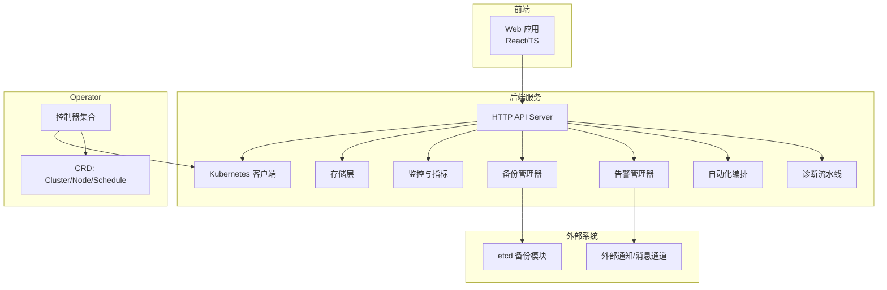
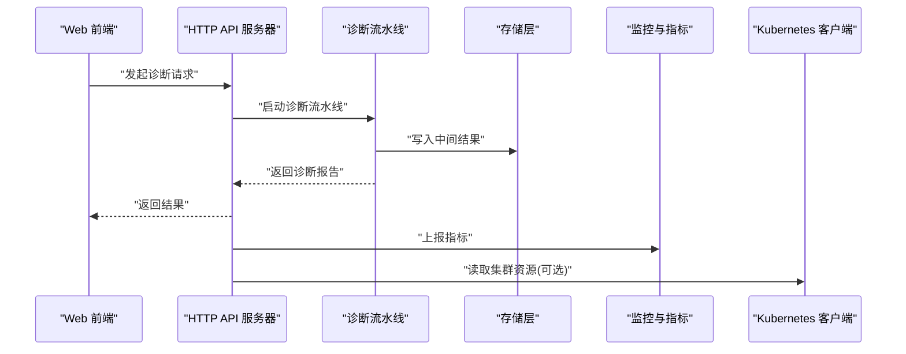
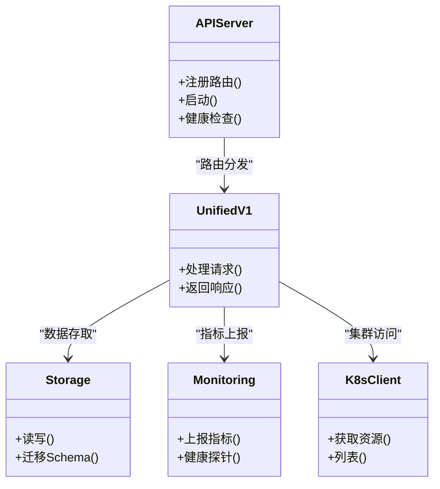
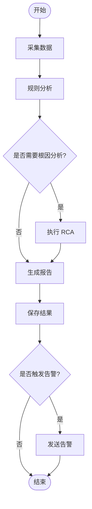
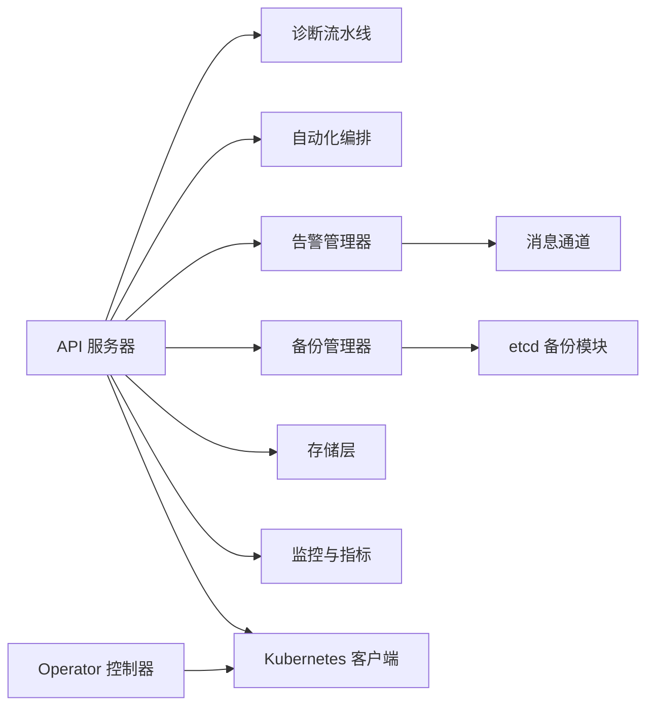

# 系统架构

<cite>
**本文引用的文件**   
- [go.mod](file://go.mod)
- [Dockerfile](file://Dockerfile)
- [Makefile](file://Makefile)
- [configs/config.yaml](file://configs/config.yaml)
- [cmd/klaw/main.go](file://cmd/klaw/main.go)
- [internal/api/server.go](file://internal/api/server.go)
- [internal/api/unified_v1.go](file://internal/api/unified_v1.go)
- [internal/config/config.go](file://internal/config/config.go)
- [internal/storage/store.go](file://internal/storage/store.go)
- [internal/monitoring/service.go](file://internal/monitoring/service.go)
- [internal/metrics/collector.go](file://internal/metrics/collector.go)
- [internal/alerting/manager.go](file://internal/alerting/manager.go)
- [internal/automation/manager.go](file://internal/automation/manager.go)
- [internal/backup/manager.go](file://internal/backup/manager.go)
- [internal/diag/pipeline.go](file://internal/diag/pipeline.go)
- [internal/diag/import.go](file://internal/diag/import.go)
- [internal/events/source.go](file://internal/events/source.go)
- [internal/events/notifier.go](file://internal/events/notifier.go)
- [internal/kubernetes/manager.go](file://internal/kubernetes/manager.go)
- [operator/cmd/main.go](file://operator/cmd/main.go)
- [operator/controllers/clusterdiagnostic_controller.go](file://operator/controllers/clusterdiagnostic_controller.go)
- [operator/controllers/nodediagnostic_controller.go](file://operator/controllers/nodediagnostic_controller.go)
- [operator/controllers/schedule_controller.go](file://operator/controllers/schedule_controller.go)
- [helm/klaw/values.yaml](file://helm/klaw/values.yaml)
- [deployment/kind/manage.sh](file://deployment/kind/manage.sh)
- [web/src/lib/api.ts](file://web/src/lib/api.ts)
- [web/src/App.tsx](file://web/src/App.tsx)
</cite>

## 目录
1. [简介](#简介)
2. [项目结构](#项目结构)
3. [核心组件](#核心组件)
4. [架构总览](#架构总览)
5. [详细组件分析](#详细组件分析)
6. [依赖关系分析](#依赖关系分析)
7. [性能考量](#性能考量)
8. [故障排查指南](#故障排查指南)
9. [结论](#结论)
10. [附录](#附录)

## 简介
本文件为 Klaw 平台的系统架构文档，面向开发者与运维人员，覆盖高层设计、架构模式、系统边界、组件交互、数据流与集成模式，并阐述技术决策、权衡与约束。文档同时给出基础设施需求、可扩展性考虑与部署拓扑，涵盖横切关注点（安全性、监控、可观测性与灾难恢复），并记录技术栈、第三方依赖与版本兼容性。

## 项目结构
Klaw 采用多模块、前后端分离与 Operator 协同的架构：
- 后端服务：Go 语言实现，提供 HTTP API、诊断流水线、自动化编排、备份与告警等能力。
- 前端应用：React + TypeScript，通过 REST API 与后端交互，提供集群与节点诊断、监控、备份等界面。
- Kubernetes Operator：基于 controller-runtime，管理自定义资源（ClusterDiagnostic、NodeDiagnostic、Schedule），驱动诊断任务调度与执行。
- 配置与部署：YAML 配置、Helm Chart、Kind 本地集群脚本、容器镜像构建。

图表来源
- [internal/api/server.go](file://internal/api/server.go)
- [internal/diag/pipeline.go](file://internal/diag/pipeline.go)
- [internal/automation/manager.go](file://internal/automation/manager.go)
- [internal/alerting/manager.go](file://internal/alerting/manager.go)
- [internal/backup/manager.go](file://internal/backup/manager.go)
- [internal/storage/store.go](file://internal/storage/store.go)
- [internal/monitoring/service.go](file://internal/monitoring/service.go)
- [internal/kubernetes/manager.go](file://internal/kubernetes/manager.go)
- [operator/controllers/clusterdiagnostic_controller.go](file://operator/controllers/clusterdiagnostic_controller.go)
- [operator/controllers/nodediagnostic_controller.go](file://operator/controllers/nodediagnostic_controller.go)
- [operator/controllers/schedule_controller.go](file://operator/controllers/schedule_controller.go)

章节来源
- [go.mod](file://go.mod)
- [Dockerfile](file://Dockerfile)
- [Makefile](file://Makefile)
- [configs/config.yaml](file://configs/config.yaml)

## 核心组件
- HTTP API 服务器：统一入口，路由到各业务处理器，承载 v1 API 与统一接口。
- 诊断流水线：采集、分析与报告生成，支持离线与在线采集器、规则引擎、RCA、自动修复、成本分析等。
- 自动化编排：内置与扩展动作编排，支持触发条件与执行策略。
- 告警管理器：聚合事件与规则，向外部通知渠道发送告警。
- 备份管理器：对 etcd 等进行备份与恢复操作。
- 存储层：结构化数据存储与 Schema 管理。
- 监控与指标：暴露 Prometheus 指标，收集关键运行时指标。
- Kubernetes 客户端：访问集群资源，配合 Operator 完成控制循环。
- Operator 控制器：监听 CRD 变更，协调诊断任务生命周期。

章节来源
- [internal/api/server.go](file://internal/api/server.go)
- [internal/api/unified_v1.go](file://internal/api/unified_v1.go)
- [internal/diag/pipeline.go](file://internal/diag/pipeline.go)
- [internal/diag/import.go](file://internal/diag/import.go)
- [internal/automation/manager.go](file://internal/automation/manager.go)
- [internal/alerting/manager.go](file://internal/alerting/manager.go)
- [internal/backup/manager.go](file://internal/backup/manager.go)
- [internal/storage/store.go](file://internal/storage/store.go)
- [internal/monitoring/service.go](file://internal/monitoring/service.go)
- [internal/kubernetes/manager.go](file://internal/kubernetes/manager.go)
- [operator/controllers/clusterdiagnostic_controller.go](file://operator/controllers/clusterdiagnostic_controller.go)
- [operator/controllers/nodediagnostic_controller.go](file://operator/controllers/nodediagnostic_controller.go)
- [operator/controllers/schedule_controller.go](file://operator/controllers/schedule_controller.go)

## 架构总览
Klaw 采用“微服务 + Operator”的分层架构：
- 表现层：Web 前端通过 REST API 与后端交互。
- 服务层：HTTP API 作为统一网关，分发请求至诊断、自动化、告警、备份等子系统。
- 数据与控制层：存储层持久化状态；Kubernetes 客户端与 Operator 协作，将声明式 CRD 转化为实际运行态。
- 横切能力：监控、审计、安全、配置中心贯穿各层。

图表来源
- [internal/api/server.go](file://internal/api/server.go)
- [internal/diag/pipeline.go](file://internal/diag/pipeline.go)
- [internal/storage/store.go](file://internal/storage/store.go)
- [internal/monitoring/service.go](file://internal/monitoring/service.go)
- [internal/kubernetes/manager.go](file://internal/kubernetes/manager.go)

## 详细组件分析

### HTTP API 服务器与统一接口
- 职责：注册路由、鉴权与限流（可选）、请求校验、响应封装、错误处理。
- 关键点：v1 API 与统一接口抽象，便于演进与兼容。
- 集成点：调用诊断、自动化、告警、备份、存储、监控与 K8s 客户端。

图表来源
- [internal/api/server.go](file://internal/api/server.go)
- [internal/api/unified_v1.go](file://internal/api/unified_v1.go)
- [internal/storage/store.go](file://internal/storage/store.go)
- [internal/monitoring/service.go](file://internal/monitoring/service.go)
- [internal/kubernetes/manager.go](file://internal/kubernetes/manager.go)

章节来源
- [internal/api/server.go](file://internal/api/server.go)
- [internal/api/unified_v1.go](file://internal/api/unified_v1.go)

### 诊断流水线
- 职责：数据采集、规则分析、RCA、自动修复、成本分析、报告生成。
- 关键点：插件化采集器（在线/离线）、规则引擎、管道阶段编排。
- 集成点：存储中间结果，上报指标，触发告警或自动化动作。

图表来源
- [internal/diag/pipeline.go](file://internal/diag/pipeline.go)
- [internal/diag/import.go](file://internal/diag/import.go)
- [internal/storage/store.go](file://internal/storage/store.go)
- [internal/alerting/manager.go](file://internal/alerting/manager.go)

章节来源
- [internal/diag/pipeline.go](file://internal/diag/pipeline.go)
- [internal/diag/import.go](file://internal/diag/import.go)

### 自动化编排
- 职责：定义动作与触发条件，按策略执行编排流程。
- 关键点：内置动作与扩展点，支持重试、幂等与回滚。
- 集成点：调用外部系统（如消息通道、K8s API）。

章节来源
- [internal/automation/manager.go](file://internal/automation/manager.go)

### 告警管理器
- 职责：聚合事件、匹配规则、发送告警到外部通知渠道。
- 关键点：去重、抑制、分级、模板化消息。
- 集成点：钉钉、飞书等消息通道（通过 messaging 接口）。

章节来源
- [internal/alerting/manager.go](file://internal/alerting/manager.go)
- [internal/events/notifier.go](file://internal/events/notifier.go)

### 备份管理器
- 职责：对 etcd 等关键数据进行备份与恢复。
- 关键点：增量/全量、压缩加密、失败重试、校验完整性。
- 集成点：etcd 备份模块、对象存储（可选）。

章节来源
- [internal/backup/manager.go](file://internal/backup/manager.go)
- [modules/etcd-backup/client.go](file://modules/etcd-backup/client.go)
- [modules/etcd-backup/manager.go](file://modules/etcd-backup/manager.go)

### 存储层
- 职责：结构化数据持久化、Schema 管理与迁移。
- 关键点：事务、索引、并发安全、备份导出。
- 集成点：数据库驱动（由配置决定）。

章节来源
- [internal/storage/store.go](file://internal/storage/store.go)
- [internal/storage/schema.go](file://internal/storage/schema.go)

### 监控与指标
- 职责：暴露 Prometheus 指标、健康探针、日志审计。
- 关键点：指标命名规范、采样策略、延迟与吞吐统计。
- 集成点：Prometheus 抓取、日志聚合。

章节来源
- [internal/monitoring/service.go](file://internal/monitoring/service.go)
- [internal/metrics/collector.go](file://internal/metrics/collector.go)

### Kubernetes 客户端与 Operator
- 职责：访问集群资源、监听 CRD 变更、协调任务生命周期。
- 关键点：控制器模式、事件驱动、重试与退避。
- 集成点：Kubernetes API Server、RBAC、Ingress/Service。

章节来源
- [internal/kubernetes/manager.go](file://internal/kubernetes/manager.go)
- [operator/cmd/main.go](file://operator/cmd/main.go)
- [operator/controllers/clusterdiagnostic_controller.go](file://operator/controllers/clusterdiagnostic_controller.go)
- [operator/controllers/nodediagnostic_controller.go](file://operator/controllers/nodediagnostic_controller.go)
- [operator/controllers/schedule_controller.go](file://operator/controllers/schedule_controller.go)

### 前端与 API 集成
- 职责：展示诊断结果、监控面板、备份管理、租户管理等。
- 关键点：REST 调用封装、错误处理、Mock 与服务端一致性。
- 集成点：后端 API 路径与版本。

章节来源
- [web/src/lib/api.ts](file://web/src/lib/api.ts)
- [web/src/App.tsx](file://web/src/App.tsx)

## 依赖关系分析
- 模块耦合：API 层依赖诊断、自动化、告警、备份、存储、监控与 K8s 客户端；Operator 控制器依赖 K8s API 与 CRD。
- 外部依赖：etcd 备份模块、消息通道（钉钉/飞书）、Prometheus、Kubernetes API。
- 版本兼容：Go 版本、Kubernetes 版本、前端依赖包版本需对齐。

图表来源
- [internal/api/server.go](file://internal/api/server.go)
- [internal/diag/pipeline.go](file://internal/diag/pipeline.go)
- [internal/automation/manager.go](file://internal/automation/manager.go)
- [internal/alerting/manager.go](file://internal/alerting/manager.go)
- [internal/backup/manager.go](file://internal/backup/manager.go)
- [internal/storage/store.go](file://internal/storage/store.go)
- [internal/monitoring/service.go](file://internal/monitoring/service.go)
- [internal/kubernetes/manager.go](file://internal/kubernetes/manager.go)
- [operator/controllers/clusterdiagnostic_controller.go](file://operator/controllers/clusterdiagnostic_controller.go)
- [operator/controllers/nodediagnostic_controller.go](file://operator/controllers/nodediagnostic_controller.go)
- [operator/controllers/schedule_controller.go](file://operator/controllers/schedule_controller.go)
- [modules/etcd-backup/client.go](file://modules/etcd-backup/client.go)

章节来源
- [go.mod](file://go.mod)

## 性能考量
- 并发与异步：诊断流水线与告警发送应使用协程/队列，避免阻塞主线程。
- 缓存与批处理：频繁查询的集群资源与指标数据建议缓存；批量写入存储减少 I/O。
- 背压与限流：对外部系统（K8s API、消息通道）进行限流与重试退避。
- 资源隔离：不同租户或任务使用命名空间与配额隔离，防止相互影响。
- 指标与追踪：关键路径埋点，结合分布式追踪定位瓶颈。

[本节为通用指导，不直接分析具体文件]

## 故障排查指南
- 常见问题：
  - API 超时：检查上游依赖（K8s API、存储、外部通知）健康状态与延迟。
  - 诊断失败：查看采集器日志与规则引擎输出，确认数据源可达。
  - 备份失败：校验 etcd 权限与网络连通性，检查存储空间与权限。
  - Operator 未生效：确认 RBAC、CRD 安装与控制器日志。
- 调试手段：
  - 启用详细日志与审计。
  - 使用健康探针与指标端点。
  - 通过 Kind 快速复现与回放。

章节来源
- [internal/monitoring/service.go](file://internal/monitoring/service.go)
- [internal/metrics/collector.go](file://internal/metrics/collector.go)
- [deployment/kind/manage.sh](file://deployment/kind/manage.sh)

## 结论
Klaw 以分层与插件化为核心，结合 Operator 的声明式控制，形成高内聚、低耦合的诊断与运维平台。通过统一的 API 与清晰的组件边界，支撑可扩展的生态与稳定的生产运行。建议在持续演进中强化可观测性、安全加固与灾备演练，确保系统在复杂环境下的可靠性与可维护性。

[本节为总结性内容，不直接分析具体文件]

## 附录

### 技术栈与依赖
- 后端：Go、标准库与常用框架（HTTP、并发原语）。
- 前端：React、TypeScript、Vite、Tailwind。
- 运行时：Kubernetes、etcd、Prometheus。
- 部署：Helm、Kind、Docker。

章节来源
- [go.mod](file://go.mod)
- [web/package.json](file://web/package.json)
- [Dockerfile](file://Dockerfile)
- [helm/klaw/values.yaml](file://helm/klaw/values.yaml)

### 配置与环境
- 配置文件：config.yaml 集中管理后端行为（端口、存储、K8s、通知等）。
- 环境变量：敏感信息通过环境变量注入，避免硬编码。
- 多环境：开发/测试/生产通过不同配置与 Helm values 区分。

章节来源
- [configs/config.yaml](file://configs/config.yaml)
- [internal/config/config.go](file://internal/config/config.go)

### 部署拓扑
- 本地开发：Kind 单集群，Operator 与后端同集群运行。
- 生产部署：多副本后端、独立存储与备份目标、Operator 高可用。
- 网络与安全：Ingress、TLS、RBAC、网络策略。

章节来源
- [deployment/kind/manage.sh](file://deployment/kind/manage.sh)
- [helm/klaw/values.yaml](file://helm/klaw/values.yaml)

### 横切关注点
- 安全性：鉴权、授权、输入校验、密钥管理、审计日志。
- 可观测性：指标、日志、追踪、健康探针。
- 灾难恢复：备份与恢复演练、快照与回滚策略。

章节来源
- [internal/audit/logger.go](file://internal/audit/logger.go)
- [internal/audit/security.go](file://internal/audit/security.go)
- [internal/monitoring/service.go](file://internal/monitoring/service.go)
- [internal/backup/manager.go](file://internal/backup/manager.go)