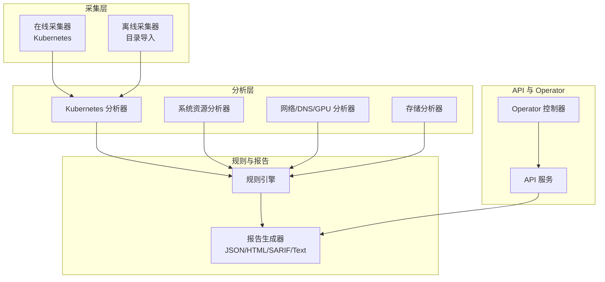
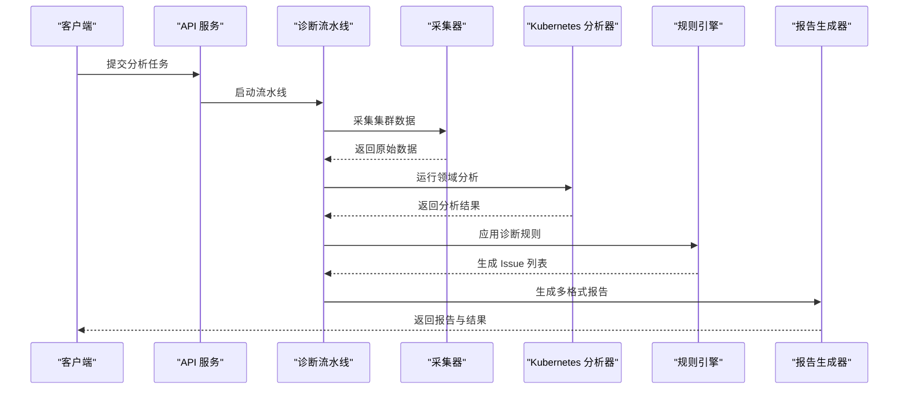
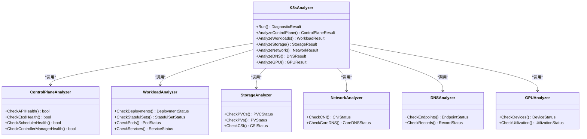
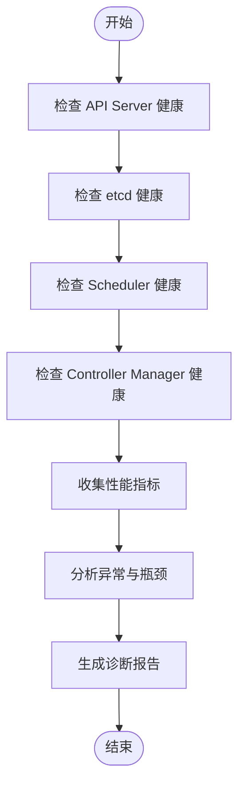
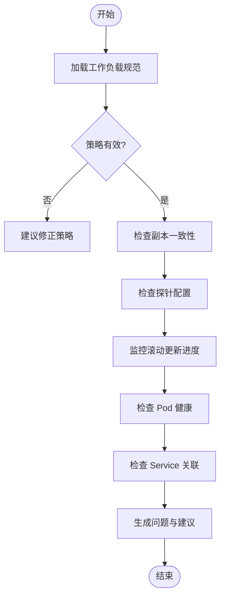
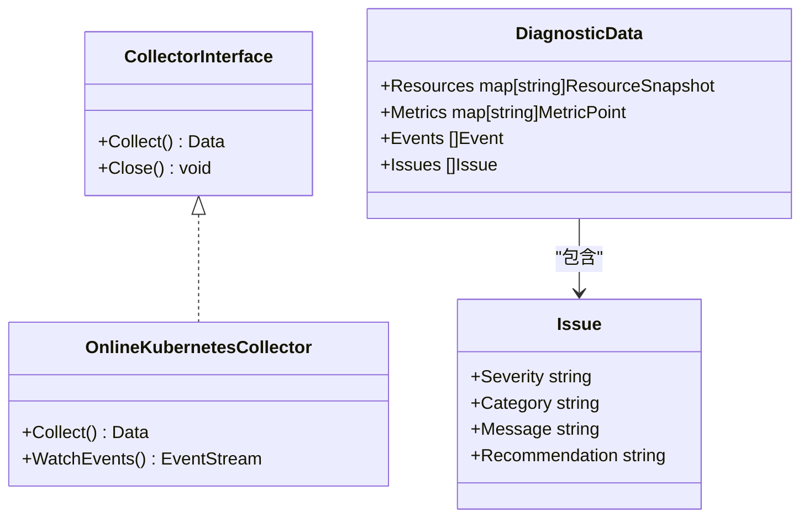
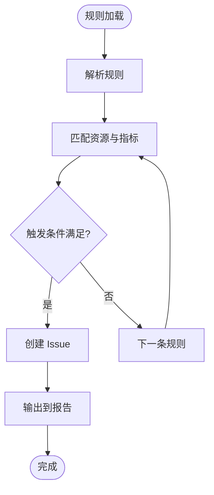
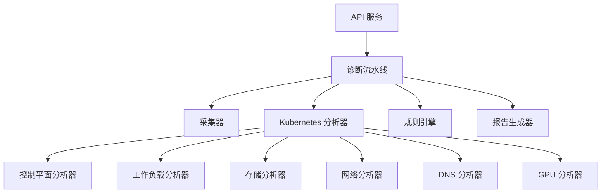

# Kubernetes资源分析器

<cite>
**本文引用的文件**   
- [internal/diag/analyzer/kubernetes/kubernetes.go](file://internal/diag/analyzer/kubernetes/kubernetes.go)
- [internal/diag/analyzer/kubernetes/controlplane.go](file://internal/diag/analyzer/kubernetes/controlplane.go)
- [internal/diag/analyzer/kubernetes/workload.go](file://internal/diag/analyzer/kubernetes/workload.go)
- [internal/diag/analyzer/kubernetes/storage.go](file://internal/diag/analyzer/kubernetes/storage.go)
- [internal/diag/analyzer/kubernetes/network.go](file://internal/diag/analyzer/kubernetes/network.go)
- [internal/diag/analyzer/kubernetes/dns.go](file://internal/diag/analyzer/kubernetes/dns.go)
- [internal/diag/analyzer/kubernetes/gpu.go](file://internal/diag/analyzer/kubernetes/gpu.go)
- [internal/diag/analyzer/system/resource.go](file://internal/diag/analyzer/system/resource.go)
- [internal/diag/collector/interface.go](file://internal/diag/collector/interface.go)
- [internal/diag/collector/online/kubernetes.go](file://internal/diag/collector/online/kubernetes.go)
- [internal/diag/pipeline.go](file://internal/diag/pipeline.go)
- [internal/diag/types/diagnostic_data.go](file://internal/diag/types/diagnostic_data.go)
- [internal/diag/types/issue.go](file://internal/diag/types/issue.go)
- [internal/diag/reporter/json.go](file://internal/diag/reporter/json.go)
- [internal/diag/reporter/html.go](file://internal/diag/reporter/html.go)
- [internal/diag/rules/engine.go](file://internal/diag/rules/engine.go)
- [internal/diag/rules/types.go](file://internal/diag/rules/types.go)
- [internal/api/server.go](file://internal/api/server.go)
- [internal/api/analysis.go](file://internal/api/analysis.go)
- [configs/config.yaml.example](file://configs/config.yaml.example)
- [operator/controllers/clusterdiagnostic_controller.go](file://operator/controllers/clusterdiagnostic_controller.go)
- [operator/controllers/schedule_controller.go](file://operator/controllers/schedule_controller.go)
</cite>

## 目录
1. [简介](#简介)
2. [项目结构](#项目结构)
3. [核心组件](#核心组件)
4. [架构总览](#架构总览)
5. [详细组件分析](#详细组件分析)
6. [依赖关系分析](#依赖关系分析)
7. [性能考虑](#性能考虑)
8. [故障排查指南](#故障排查指南)
9. [结论](#结论)
10. [附录](#附录)

## 简介
本文件为 Kubernetes 资源分析器的权威文档，聚焦于 Pod、Service、Deployment、StatefulSet 等核心资源的健康检查机制，涵盖资源状态监控、性能指标收集与问题诊断能力。同时，文档对控制平面组件（API Server、etcd、Scheduler、Controller Manager）的监控与分析能力进行说明，并记录工作负载分析器的部署策略检查、副本管理与滚动更新监控等功能。此外，提供配置参数说明、输出格式定义、性能优化建议以及实际使用示例和常见问题解决方案，帮助读者快速上手并高效运维。

## 项目结构
本项目采用模块化分层设计：
- 采集层：在线采集器对接 Kubernetes API，离线采集器支持目录数据导入
- 分析层：按领域划分的分析器（Kubernetes、系统、网络、存储、GPU、DNS、安全等）
- 规则引擎：基于规则的诊断与告警
- 报告层：JSON、HTML、SARIF、文本等多格式输出
- API 层：对外暴露分析任务、结果查询、自动化操作等接口
- Operator：通过 CRD 驱动集群级诊断与调度任务

**图表来源** 
- [internal/diag/collector/online/kubernetes.go](file://internal/diag/collector/online/kubernetes.go)
- [internal/diag/analyzer/kubernetes/kubernetes.go](file://internal/diag/analyzer/kubernetes/kubernetes.go)
- [internal/diag/rules/engine.go](file://internal/diag/rules/engine.go)
- [internal/diag/reporter/json.go](file://internal/diag/reporter/json.go)
- [internal/api/server.go](file://internal/api/server.go)

**章节来源**
- [internal/diag/collector/interface.go](file://internal/diag/collector/interface.go)
- [internal/diag/analyzer/kubernetes/kubernetes.go](file://internal/diag/analyzer/kubernetes/kubernetes.go)
- [internal/diag/pipeline.go](file://internal/diag/pipeline.go)

## 核心组件
- 采集器接口与实现
  - 统一采集接口定义，支持在线与离线两种模式
  - 在线采集器通过 Kubernetes API 获取集群资源与事件
- Kubernetes 分析器
  - 覆盖控制平面、工作负载、存储、网络、DNS、GPU 等领域
  - 针对 Pod、Service、Deployment、StatefulSet 等进行健康检查与问题定位
- 规则引擎
  - 加载并执行诊断规则，产出 Issue 列表
- 报告生成器
  - 将诊断结果以 JSON、HTML、SARIF、文本等格式输出
- API 服务
  - 提供分析任务提交、结果查询、自动化修复入口
- Operator
  - 通过 CRD 管理集群诊断任务与调度

**章节来源**
- [internal/diag/collector/interface.go](file://internal/diag/collector/interface.go)
- [internal/diag/analyzer/kubernetes/kubernetes.go](file://internal/diag/analyzer/kubernetes/kubernetes.go)
- [internal/diag/rules/engine.go](file://internal/diag/rules/engine.go)
- [internal/diag/reporter/json.go](file://internal/diag/reporter/json.go)
- [internal/api/server.go](file://internal/api/server.go)
- [operator/controllers/clusterdiagnostic_controller.go](file://operator/controllers/clusterdiagnostic_controller.go)

## 架构总览
整体流程从采集到报告输出的关键路径如下：

**图表来源** 
- [internal/api/server.go](file://internal/api/server.go)
- [internal/diag/pipeline.go](file://internal/diag/pipeline.go)
- [internal/diag/collector/online/kubernetes.go](file://internal/diag/collector/online/kubernetes.go)
- [internal/diag/analyzer/kubernetes/kubernetes.go](file://internal/diag/analyzer/kubernetes/kubernetes.go)
- [internal/diag/rules/engine.go](file://internal/diag/rules/engine.go)
- [internal/diag/reporter/json.go](file://internal/diag/reporter/json.go)

## 详细组件分析

### Kubernetes 分析器
- 职责
  - 聚合控制平面与工作负载的分析能力
  - 协调各子分析器（控制平面、工作负载、存储、网络、DNS、GPU）
- 关键能力
  - 资源状态监控：Pod、Service、Deployment、StatefulSet 等
  - 性能指标收集：CPU、内存、I/O、网络吞吐与延迟
  - 问题诊断：事件、警告、异常状态根因定位

**图表来源** 
- [internal/diag/analyzer/kubernetes/kubernetes.go](file://internal/diag/analyzer/kubernetes/kubernetes.go)
- [internal/diag/analyzer/kubernetes/controlplane.go](file://internal/diag/analyzer/kubernetes/controlplane.go)
- [internal/diag/analyzer/kubernetes/workload.go](file://internal/diag/analyzer/kubernetes/workload.go)
- [internal/diag/analyzer/kubernetes/storage.go](file://internal/diag/analyzer/kubernetes/storage.go)
- [internal/diag/analyzer/kubernetes/network.go](file://internal/diag/analyzer/kubernetes/network.go)
- [internal/diag/analyzer/kubernetes/dns.go](file://internal/diag/analyzer/kubernetes/dns.go)
- [internal/diag/analyzer/kubernetes/gpu.go](file://internal/diag/analyzer/kubernetes/gpu.go)

**章节来源**
- [internal/diag/analyzer/kubernetes/kubernetes.go](file://internal/diag/analyzer/kubernetes/kubernetes.go)
- [internal/diag/analyzer/kubernetes/controlplane.go](file://internal/diag/analyzer/kubernetes/controlplane.go)
- [internal/diag/analyzer/kubernetes/workload.go](file://internal/diag/analyzer/kubernetes/workload.go)
- [internal/diag/analyzer/kubernetes/storage.go](file://internal/diag/analyzer/kubernetes/storage.go)
- [internal/diag/analyzer/kubernetes/network.go](file://internal/diag/analyzer/kubernetes/network.go)
- [internal/diag/analyzer/kubernetes/dns.go](file://internal/diag/analyzer/kubernetes/dns.go)
- [internal/diag/analyzer/kubernetes/gpu.go](file://internal/diag/analyzer/kubernetes/gpu.go)

### 控制平面组件监控与分析
- API Server
  - 健康检查：存活探针、请求延迟、错误率
  - 指标：QPS、限流、认证失败次数
- etcd
  - 健康检查：成员状态、磁盘同步、事务延迟
  - 指标：快照大小、压缩率、WAL 长度
- Scheduler
  - 健康检查：调度队列积压、调度成功率
  - 指标：调度耗时、节点选择失败原因分布
- Controller Manager
  - 健康检查：控制器循环周期、重入锁竞争
  - 指标：事件处理速率、资源同步失败计数

**图表来源** 
- [internal/diag/analyzer/kubernetes/controlplane.go](file://internal/diag/analyzer/kubernetes/controlplane.go)

**章节来源**
- [internal/diag/analyzer/kubernetes/controlplane.go](file://internal/diag/analyzer/kubernetes/controlplane.go)

### 工作负载分析器（Deployment、StatefulSet、Pod、Service）
- 部署策略检查
  - 滚动更新策略：maxUnavailable、maxSurge、progressDeadlineSeconds
  - 回滚策略：revisionHistoryLimit、strategy.type
- 副本管理
  - 期望副本与实际副本对比
  - 就绪/存活探针配置校验
- 滚动更新监控
  - 更新进度、失败重试、事件追踪
- Pod 健康
  - 状态转换、重启次数、日志异常关键词
- Service 健康
  - Endpoints 匹配、端口映射、负载均衡策略

**图表来源** 
- [internal/diag/analyzer/kubernetes/workload.go](file://internal/diag/analyzer/kubernetes/workload.go)

**章节来源**
- [internal/diag/analyzer/kubernetes/workload.go](file://internal/diag/analyzer/kubernetes/workload.go)

### 系统与资源分析
- 节点资源
  - CPU、内存、磁盘、网络 I/O 使用率与阈值告警
- 容器运行时
  - 运行时版本、镜像拉取失败、容器状态异常
- 内核与系统参数
  - 文件描述符、网络栈参数、调度器参数

**章节来源**
- [internal/diag/analyzer/system/resource.go](file://internal/diag/analyzer/system/resource.go)

### 采集器与数据模型
- 采集器接口
  - 统一抽象，支持在线与离线数据源
- 在线采集器
  - 通过 Kubernetes API 获取资源清单与事件
- 诊断数据模型
  - 结构化表示资源状态、指标、事件与问题

**图表来源** 
- [internal/diag/collector/interface.go](file://internal/diag/collector/interface.go)
- [internal/diag/collector/online/kubernetes.go](file://internal/diag/collector/online/kubernetes.go)
- [internal/diag/types/diagnostic_data.go](file://internal/diag/types/diagnostic_data.go)
- [internal/diag/types/issue.go](file://internal/diag/types/issue.go)

**章节来源**
- [internal/diag/collector/interface.go](file://internal/diag/collector/interface.go)
- [internal/diag/collector/online/kubernetes.go](file://internal/diag/collector/online/kubernetes.go)
- [internal/diag/types/diagnostic_data.go](file://internal/diag/types/diagnostic_data.go)
- [internal/diag/types/issue.go](file://internal/diag/types/issue.go)

### 规则引擎与输出格式
- 规则引擎
  - 加载 YAML/内置规则，匹配资源状态与指标阈值
  - 生成 Issue 列表，附带严重级别与建议
- 输出格式
  - JSON：结构化结果，便于集成与二次处理
  - HTML：可视化报告，适合人工审阅
  - SARIF：静态分析标准格式，便于工具链集成
  - 文本：简洁摘要，适合日志与终端展示

**图表来源** 
- [internal/diag/rules/engine.go](file://internal/diag/rules/engine.go)
- [internal/diag/rules/types.go](file://internal/diag/rules/types.go)
- [internal/diag/reporter/json.go](file://internal/diag/reporter/json.go)
- [internal/diag/reporter/html.go](file://internal/diag/reporter/html.go)

**章节来源**
- [internal/diag/rules/engine.go](file://internal/diag/rules/engine.go)
- [internal/diag/rules/types.go](file://internal/diag/rules/types.go)
- [internal/diag/reporter/json.go](file://internal/diag/reporter/json.go)
- [internal/diag/reporter/html.go](file://internal/diag/reporter/html.go)

### API 与 Operator
- API 服务
  - 提供分析任务提交、结果查询、自动化修复接口
- Operator
  - 通过 ClusterDiagnostic、NodeDiagnostic、Schedule 等 CRD 驱动任务
  - 控制器负责生命周期管理与状态同步

**章节来源**
- [internal/api/server.go](file://internal/api/server.go)
- [internal/api/analysis.go](file://internal/api/analysis.go)
- [operator/controllers/clusterdiagnostic_controller.go](file://operator/controllers/clusterdiagnostic_controller.go)
- [operator/controllers/schedule_controller.go](file://operator/controllers/schedule_controller.go)

## 依赖关系分析
- 模块耦合
  - 采集器与分析器解耦，通过数据模型传递
  - 规则引擎独立于分析器，便于扩展与维护
  - 报告生成器与规则引擎解耦，支持多格式输出
- 外部依赖
  - Kubernetes API 客户端
  - 可选的 etcd、Prometheus、CSI、CNI 等组件信息

**图表来源** 
- [internal/api/server.go](file://internal/api/server.go)
- [internal/diag/pipeline.go](file://internal/diag/pipeline.go)
- [internal/diag/analyzer/kubernetes/kubernetes.go](file://internal/diag/analyzer/kubernetes/kubernetes.go)
- [internal/diag/rules/engine.go](file://internal/diag/rules/engine.go)
- [internal/diag/reporter/json.go](file://internal/diag/reporter/json.go)

**章节来源**
- [internal/diag/pipeline.go](file://internal/diag/pipeline.go)
- [internal/diag/analyzer/kubernetes/kubernetes.go](file://internal/diag/analyzer/kubernetes/kubernetes.go)
- [internal/diag/rules/engine.go](file://internal/diag/rules/engine.go)

## 性能考虑
- 采集优化
  - 增量采集与缓存：避免全量重复拉取
  - 并发采集：按命名空间或资源类型并行
- 分析优化
  - 懒加载：按需运行特定分析器
  - 阈值过滤：减少无效规则匹配
- 报告优化
  - 分页与摘要：大结果集分块返回
  - 异步生成：后台生成复杂报告
- 资源限制
  - 合理设置 Worker 数量与超时
  - 限制单次采集的数据量与字段

[本节为通用指导，不直接分析具体文件]

## 故障排查指南
- 常见问题
  - API 访问失败：检查 kubeconfig、RBAC、网络连通性
  - etcd 异常：查看成员状态、磁盘空间、TLS 证书
  - 调度失败：检查节点标签、污点容忍、资源配额
  - 滚动更新卡住：检查探针、资源限制、镜像拉取
- 诊断步骤
  - 使用 API 提交分析任务并查看结果
  - 检查规则引擎触发的 Issue 与建议
  - 导出 JSON/HTML 报告进行深度分析
- 恢复建议
  - 修正资源配置与策略
  - 清理僵尸资源与事件堆积
  - 扩容或调整集群参数

**章节来源**
- [internal/api/analysis.go](file://internal/api/analysis.go)
- [internal/diag/rules/engine.go](file://internal/diag/rules/engine.go)
- [internal/diag/reporter/json.go](file://internal/diag/reporter/json.go)
- [internal/diag/reporter/html.go](file://internal/diag/reporter/html.go)

## 结论
Kubernetes 资源分析器通过统一的采集与分析框架，实现对核心资源与控制平面的全面监控与诊断。其模块化设计与可扩展的规则引擎，使得用户能够灵活定制检查项与输出格式。结合 Operator 与 API 服务，可实现自动化诊断与修复闭环，提升集群稳定性与可观测性。

[本节为总结性内容，不直接分析具体文件]

## 附录

### 配置参数说明
- 采集相关
  - 采集间隔、并发数、超时时间
  - 在线/离线模式切换
- 分析相关
  - 启用/禁用特定分析器
  - 阈值与告警级别
- 输出相关
  - 报告格式选择（JSON/HTML/SARIF/Text）
  - 输出目标（本地文件、远程存储、Webhook）

**章节来源**
- [configs/config.yaml.example](file://configs/config.yaml.example)

### 输出格式定义
- JSON
  - 包含资源快照、指标、事件、Issue 列表与建议
- HTML
  - 可视化仪表盘与详情页面
- SARIF
  - 标准化问题描述，便于工具链集成
- 文本
  - 简洁摘要，适合日志与终端展示

**章节来源**
- [internal/diag/reporter/json.go](file://internal/diag/reporter/json.go)
- [internal/diag/reporter/html.go](file://internal/diag/reporter/html.go)

### 实际使用示例
- 提交分析任务
  - 通过 API 提交任务，指定命名空间与资源类型
- 查看结果
  - 查询任务状态与报告链接
- 自动化修复
  - 根据建议自动修正配置或执行修复脚本

**章节来源**
- [internal/api/server.go](file://internal/api/server.go)
- [internal/api/analysis.go](file://internal/api/analysis.go)

### 常见问题解决方案
- 无法连接 Kubernetes API
  - 检查 kubeconfig 权限与网络策略
- 滚动更新失败
  - 检查探针配置与资源限制
- etcd 性能下降
  - 检查磁盘 I/O 与快照频率
- 调度积压
  - 检查节点资源与调度器日志

**章节来源**
- [internal/diag/analyzer/kubernetes/controlplane.go](file://internal/diag/analyzer/kubernetes/controlplane.go)
- [internal/diag/analyzer/kubernetes/workload.go](file://internal/diag/analyzer/kubernetes/workload.go)