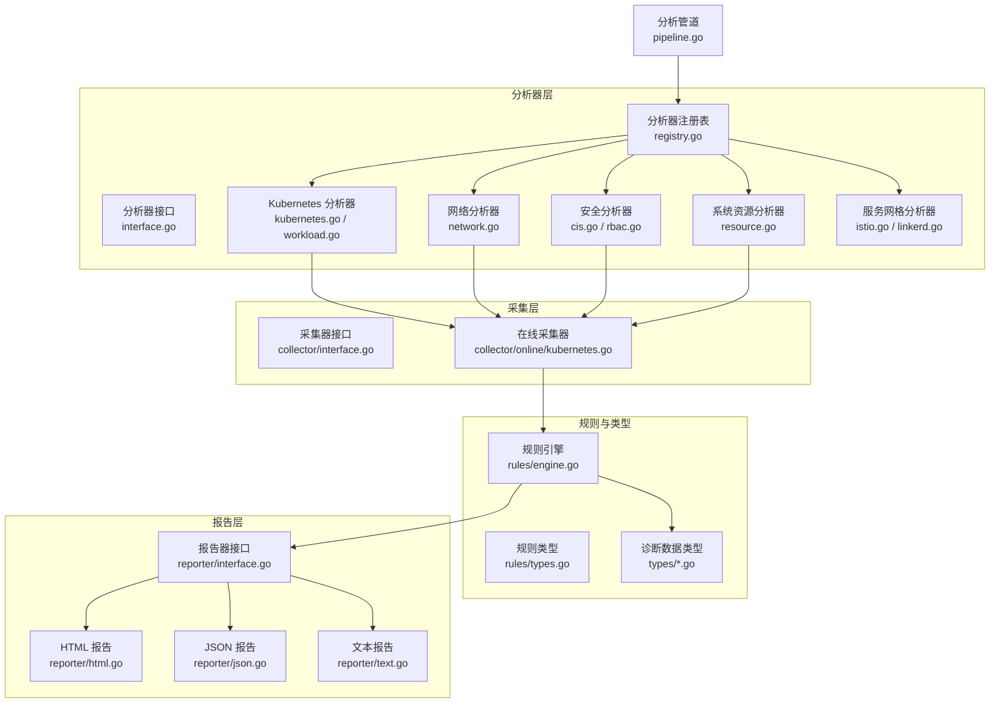
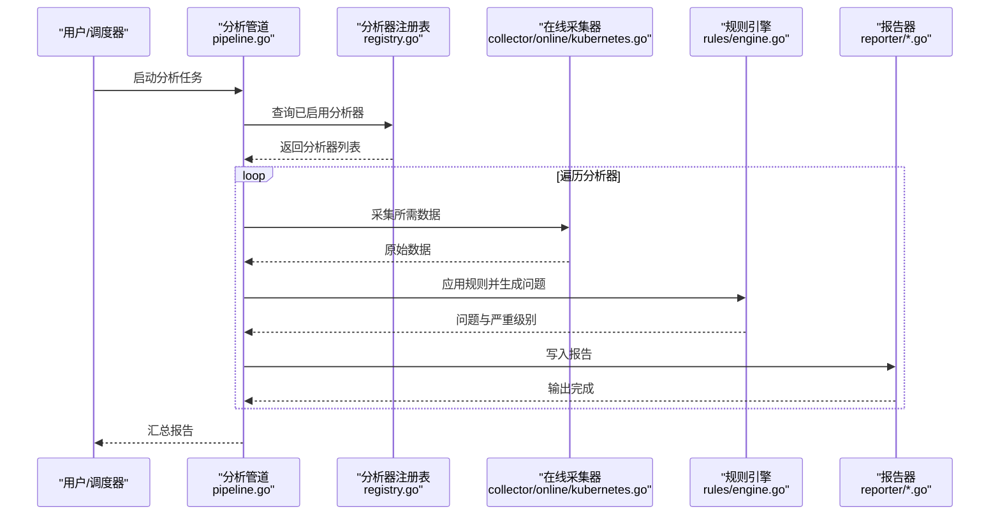
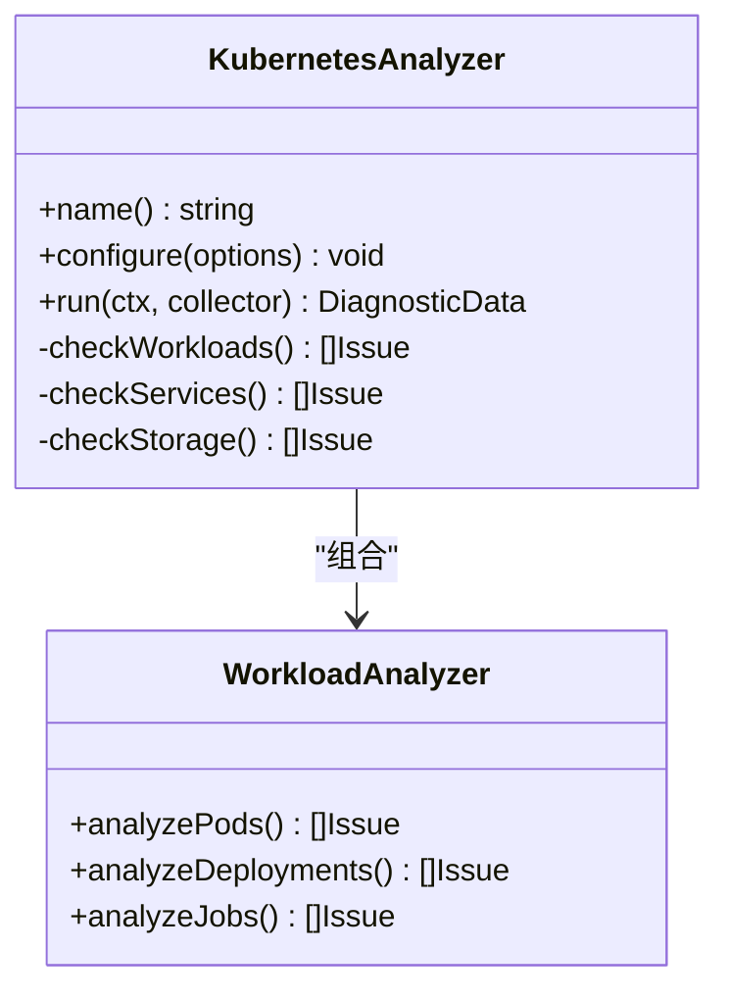
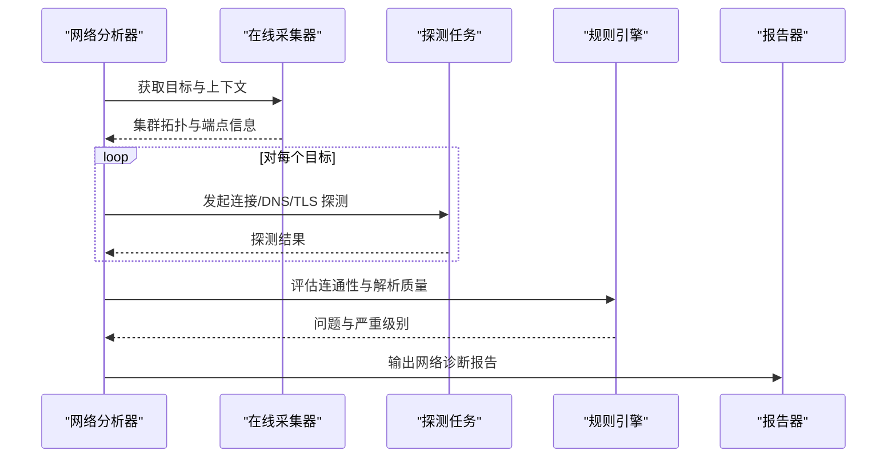
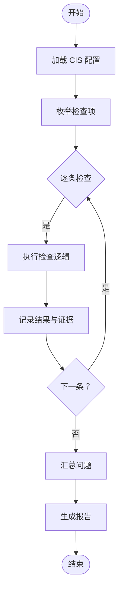
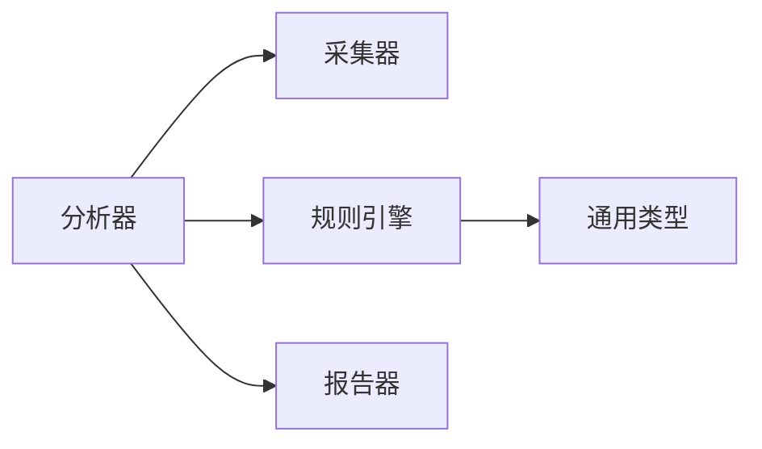

# 内置分析器

<cite>
**本文引用的文件**   
- [internal/diag/analyzer/interface.go](file://internal/diag/analyzer/interface.go)
- [internal/diag/analyzer/registry.go](file://internal/diag/analyzer/registry.go)
- [internal/diag/analyzer/kubernetes/kubernetes.go](file://internal/diag/analyzer/kubernetes/kubernetes.go)
- [internal/diag/analyzer/kubernetes/workload.go](file://internal/diag/analyzer/kubernetes/workload.go)
- [internal/diag/analyzer/network/network.go](file://internal/diag/analyzer/network/network.go)
- [internal/diag/analyzer/security/cis.go](file://internal/diag/analyzer/security/cis.go)
- [internal/diag/analyzer/security/rbac.go](file://internal/diag/analyzer/security/rbac.go)
- [internal/diag/analyzer/system/resource.go](file://internal/diag/analyzer/system/resource.go)
- [internal/diag/analyzer/servicemesh/istio.go](file://internal/diag/analyzer/servicemesh/istio.go)
- [internal/diag/analyzer/servicemesh/linkerd.go](file://internal/diag/analyzer/servicemesh/linkerd.go)
- [internal/diag/types/diagnostic_data.go](file://internal/diag/types/diagnostic_data.go)
- [internal/diag/types/issue.go](file://internal/diag/types/issue.go)
- [internal/diag/types/severity.go](file://internal/diag/types/severity.go)
- [internal/diag/pipeline.go](file://internal/diag/pipeline.go)
- [internal/diag/reporter/html.go](file://internal/diag/reporter/html.go)
- [internal/diag/reporter/json.go](file://internal/diag/reporter/json.go)
- [internal/diag/reporter/text.go](file://internal/diag/reporter/text.go)
- [internal/diag/reporter/interface.go](file://internal/diag/reporter/interface.go)
- [internal/diag/collector/interface.go](file://internal/diag/collector/interface.go)
- [internal/diag/collector/online/kubernetes.go](file://internal/diag/collector/online/kubernetes.go)
- [internal/diag/rules/engine.go](file://internal/diag/rules/engine.go)
- [internal/diag/rules/types.go](file://internal/diag/rules/types.go)
</cite>

## 更新摘要
**变更内容**
- 更新了分析器注册机制，所有诊断分析器现在使用新的 MustRegister() 函数
- 增强了启动时的错误可见性，从静默失败改为立即失败
- 改进了分析器初始化的可靠性与可调试性

## 目录
1. [简介](#简介)
2. [项目结构](#项目结构)
3. [核心组件](#核心组件)
4. [架构总览](#架构总览)
5. [详细组件分析](#详细组件分析)
6. [依赖关系分析](#依赖关系分析)
7. [性能考虑](#性能考虑)
8. [故障排查指南](#故障排查指南)
9. [结论](#结论)
10. [附录](#附录)

## 简介
本文件为 Klaw 平台"内置分析器"的权威文档，聚焦以下能力：
- Kubernetes 资源分析器：对 Pod、Service、Deployment 等对象进行健康检查与性能分析。
- 网络分析器：提供网络连接性测试、DNS 解析诊断与服务网格（Istio/Linkerd）分析。
- 安全分析器：执行 CIS 基准检查、RBAC 权限审查与漏洞扫描。
- 系统资源分析器：监控与分析 CPU、内存、存储等资源使用情况。
每个分析器均包含配置项说明、输出格式定义与性能调优建议，帮助使用者快速落地并优化使用体验。

**更新** 所有分析器现已采用新的 MustRegister() 注册机制，确保在启动时立即发现注册失败问题，提升系统可靠性。

## 项目结构
Klaw 的分析子系统位于 internal/diag 目录下，采用"分析器注册 + 管道编排 + 采集器 + 规则引擎 + 报告器"的分层设计：
- analyzer：各领域分析器的实现与统一接口、注册表。
- collector：在线/离线数据采集抽象与实现。
- rules：规则加载与执行引擎。
- reporter：多格式报告输出。
- types：诊断数据、问题与严重级别等通用类型。
- pipeline：分析任务编排与调度。

图表来源
- [internal/diag/analyzer/interface.go](file://internal/diag/analyzer/interface.go)
- [internal/diag/analyzer/registry.go](file://internal/diag/analyzer/registry.go)
- [internal/diag/analyzer/kubernetes/kubernetes.go](file://internal/diag/analyzer/kubernetes/kubernetes.go)
- [internal/diag/analyzer/kubernetes/workload.go](file://internal/diag/analyzer/kubernetes/workload.go)
- [internal/diag/analyzer/network/network.go](file://internal/diag/analyzer/network/network.go)
- [internal/diag/analyzer/security/cis.go](file://internal/diag/analyzer/security/cis.go)
- [internal/diag/analyzer/security/rbac.go](file://internal/diag/analyzer/security/rbac.go)
- [internal/diag/analyzer/system/resource.go](file://internal/diag/analyzer/system/resource.go)
- [internal/diag/analyzer/servicemesh/istio.go](file://internal/diag/analyzer/servicemesh/istio.go)
- [internal/diag/analyzer/servicemesh/linkerd.go](file://internal/diag/analyzer/servicemesh/linkerd.go)
- [internal/diag/collector/interface.go](file://internal/diag/collector/interface.go)
- [internal/diag/collector/online/kubernetes.go](file://internal/diag/collector/online/kubernetes.go)
- [internal/diag/rules/engine.go](file://internal/diag/rules/engine.go)
- [internal/diag/rules/types.go](file://internal/diag/rules/types.go)
- [internal/diag/types/diagnostic_data.go](file://internal/diag/types/diagnostic_data.go)
- [internal/diag/types/issue.go](file://internal/diag/types/issue.go)
- [internal/diag/types/severity.go](file://internal/diag/types/severity.go)
- [internal/diag/reporter/interface.go](file://internal/diag/reporter/interface.go)
- [internal/diag/reporter/html.go](file://internal/diag/reporter/html.go)
- [internal/diag/reporter/json.go](file://internal/diag/reporter/json.go)
- [internal/diag/reporter/text.go](file://internal/diag/reporter/text.go)
- [internal/diag/pipeline.go](file://internal/diag/pipeline.go)

章节来源
- [internal/diag/analyzer/interface.go](file://internal/diag/analyzer/interface.go)
- [internal/diag/analyzer/registry.go](file://internal/diag/analyzer/registry.go)
- [internal/diag/pipeline.go](file://internal/diag/pipeline.go)

## 核心组件
- 分析器接口与注册表
  - 所有分析器需实现统一接口，便于管道编排与扩展。
  - 注册表集中管理分析器实例，支持按名称启用/禁用与参数注入。
  - **新增** MustRegister() 函数提供启动时立即失败的注册机制，避免静默失败。
- 采集器
  - 抽象在线/离线采集方式，Kubernetes 在线采集器负责从集群获取资源与指标。
- 规则引擎
  - 加载规则集，对采集数据进行匹配与判定，生成问题与严重级别。
- 报告器
  - 将诊断结果输出为 HTML、JSON、文本等多种格式，便于集成与展示。
- 通用类型
  - 诊断数据、问题模型与严重级别贯穿全链路，保证一致性。

**更新** 分析器注册机制已全面升级，所有 init() 函数现在使用 MustRegister() 确保注册失败的即时可见性。

章节来源
- [internal/diag/analyzer/interface.go](file://internal/diag/analyzer/interface.go)
- [internal/diag/analyzer/registry.go:235-243](file://internal/diag/analyzer/registry.go#L235-L243)
- [internal/diag/analyzer/kubernetes/workload.go:380-386](file://internal/diag/analyzer/kubernetes/workload.go#L380-L386)
- [internal/diag/analyzer/network/network.go:272-278](file://internal/diag/analyzer/network/network.go#L272-L278)
- [internal/diag/analyzer/security/cis.go:450-458](file://internal/diag/analyzer/security/cis.go#L450-L458)
- [internal/diag/analyzer/security/rbac.go:359-366](file://internal/diag/analyzer/security/rbac.go#L359-L366)
- [internal/diag/analyzer/system/resource.go:395-404](file://internal/diag/analyzer/system/resource.go#L395-L404)
- [internal/diag/analyzer/servicemesh/istio.go:199-202](file://internal/diag/analyzer/servicemesh/istio.go#L199-L202)
- [internal/diag/analyzer/servicemesh/linkerd.go:135-137](file://internal/diag/analyzer/servicemesh/linkerd.go#L135-L137)

## 架构总览
下图展示了分析任务的端到端流程：管道根据配置选择启用的分析器，通过采集器拉取数据，规则引擎评估并生成问题，最后由报告器输出结果。

图表来源
- [internal/diag/pipeline.go](file://internal/diag/pipeline.go)
- [internal/diag/analyzer/registry.go](file://internal/diag/analyzer/registry.go)
- [internal/diag/collector/online/kubernetes.go](file://internal/diag/collector/online/kubernetes.go)
- [internal/diag/rules/engine.go](file://internal/diag/rules/engine.go)
- [internal/diag/reporter/html.go](file://internal/diag/reporter/html.go)
- [internal/diag/reporter/json.go](file://internal/diag/reporter/json.go)
- [internal/diag/reporter/text.go](file://internal/diag/reporter/text.go)

## 详细组件分析

### Kubernetes 资源分析器
功能概述
- 覆盖 Pod、Service、Deployment、StatefulSet、DaemonSet、Job/CronJob、Ingress、ConfigMap/Secret、PV/PVC、Node 等常见资源。
- 健康检查：状态、就绪/存活探针、事件、日志异常模式、资源配额与限制合理性。
- 性能分析：CPU/内存请求与限制、利用率、扩容策略、滚动更新策略、副本分布。

关键实现要点
- 工作负载分析：基于控制器期望与实际状态对比，识别不健康副本、频繁重启、资源争用等问题。
- 网络与服务发现：Service 端口映射、Endpoint 可达性、Ingress 路由规则校验。
- 存储：PVC 绑定状态、StorageClass 可用性、容量增长趋势。

配置选项
- 目标命名空间过滤、资源白名单/黑名单、采样周期、阈值配置（如 CPU/内存利用率）。
- 是否开启深度检查（如日志关键字匹配、事件聚合）。

输出格式
- 结构化问题清单，包含资源标识、问题类型、严重级别、建议修复步骤。
- 附带相关指标快照与事件摘要。

性能调优建议
- 合理设置采样周期与并发度，避免 API Server 压力过大。
- 对大规模集群优先启用"关键路径"检查，再按需展开深度检查。
- 利用缓存减少重复查询，结合增量采集降低开销。

**更新** 工作负载分析器现在使用 MustRegister() 进行注册，确保启动时立即发现注册冲突或错误。

章节来源
- [internal/diag/analyzer/kubernetes/kubernetes.go](file://internal/diag/analyzer/kubernetes/kubernetes.go)
- [internal/diag/analyzer/kubernetes/workload.go:380-386](file://internal/diag/analyzer/kubernetes/workload.go#L380-L386)

#### 类图（Kubernetes 分析器）

图表来源
- [internal/diag/analyzer/kubernetes/kubernetes.go](file://internal/diag/analyzer/kubernetes/kubernetes.go)
- [internal/diag/analyzer/kubernetes/workload.go](file://internal/diag/analyzer/kubernetes/workload.go)

### 网络分析器
功能概述
- 连接性测试：跨命名空间/节点访问验证、端口连通性、TLS 握手检测。
- DNS 解析诊断：解析延迟、失败原因分类、上游 DNS 健康。
- 服务网格分析：Istio/Linkerd 侧车注入、流量策略、mTLS、遥测数据完整性。

关键实现要点
- 基于在线采集器发起探测任务，聚合结果并生成问题。
- 针对服务网格，读取控制面与数据面配置，校验策略生效情况。

配置选项
- 探测目标列表、并发度、超时与重试次数、DNS 服务器列表。
- 服务网格模式开关（Istio/Linkerd）、策略范围（全局/命名空间）。

输出格式
- 连接性矩阵、DNS 解析统计、服务网格策略合规性问题与建议。

性能调优建议
- 控制探测并发与频率，避免对生产网络造成抖动。
- 对高频探测点使用本地缓存与去重策略。

**更新** 网络分析器现在使用 MustRegister() 进行批量注册，包括网卡接口、路由、端口、iptables 和 inode 分析器。

章节来源
- [internal/diag/analyzer/network/network.go:272-278](file://internal/diag/analyzer/network/network.go#L272-L278)

#### 序列图（网络诊断流程）

图表来源
- [internal/diag/analyzer/network/network.go](file://internal/diag/analyzer/network/network.go)
- [internal/diag/collector/online/kubernetes.go](file://internal/diag/collector/online/kubernetes.go)
- [internal/diag/rules/engine.go](file://internal/diag/rules/engine.go)
- [internal/diag/reporter/text.go](file://internal/diag/reporter/text.go)

### 安全分析器
功能概述
- CIS 基准检查：对照 CIS Kubernetes Benchmark 逐项核查配置与运行时行为。
- RBAC 权限审查：识别过度授权、敏感角色滥用、未绑定 ServiceAccount 等风险。
- 漏洞扫描：镜像漏洞扫描（与 image scanner 集成），输出 CVE 清单与修复建议。

关键实现要点
- CIS 检查项可配置化，支持自定义规则与豁免列表。
- RBAC 分析基于 Role/ClusterRole、RoleBinding/ClusterRoleBinding 构建权限图，定位高风险路径。
- 漏洞扫描通过镜像仓库或本地镜像缓存获取元数据与漏洞数据库。

配置选项
- CIS 级别（Level 1/2）、检查范围（集群/命名空间）、豁免项。
- RBAC 风险阈值、敏感角色白名单。
- 漏洞扫描源（Trivy/Clair）、扫描策略（全量/增量）。

输出格式
- 合规性问题清单、RBAC 风险报告、漏洞清单（含严重级别与修复链接）。

性能调优建议
- 对大型集群分批次执行 CIS 检查，避免长时间阻塞。
- 使用增量扫描与缓存减少重复计算。

**更新** 安全分析器现在使用 MustRegister() 进行注册，包括 CIS API Server、etcd、Kubelet 分析器和 RBAC 相关分析器。

章节来源
- [internal/diag/analyzer/security/cis.go:450-458](file://internal/diag/analyzer/security/cis.go#L450-L458)
- [internal/diag/analyzer/security/rbac.go:359-366](file://internal/diag/analyzer/security/rbac.go#L359-L366)

#### 流程图（CIS 检查流程）

图表来源
- [internal/diag/analyzer/security/cis.go](file://internal/diag/analyzer/security/cis.go)
- [internal/diag/rules/engine.go](file://internal/diag/rules/engine.go)
- [internal/diag/reporter/html.go](file://internal/diag/reporter/html.go)

### 系统资源分析器
功能概述
- 监控 CPU、内存、磁盘 I/O、网络带宽、GPU 等关键指标。
- 识别资源瓶颈、异常峰值、容量不足与碎片化问题。
- 结合 Node 与 Pod 维度进行关联分析，定位根因。

关键实现要点
- 通过在线采集器获取节点与 Pod 指标，结合历史数据做趋势分析。
- 对存储卷使用率、IOPS、延迟进行阈值告警。

配置选项
- 指标采集间隔、保留时长、阈值与告警等级。
- 是否启用 GPU/存储专项分析。

输出格式
- 资源使用概览、热点 TopN、异常事件与修复建议。

性能调优建议
- 合理设置采集粒度与窗口，平衡实时性与存储成本。
- 对高负载节点优先采样，其他节点降频采集。

**更新** 系统资源分析器现在使用 MustRegister() 进行注册，包括 CPU、内存、磁盘、Swap、连接跟踪、文件句柄和进程状态分析器。

章节来源
- [internal/diag/analyzer/system/resource.go:395-404](file://internal/diag/analyzer/system/resource.go#L395-L404)

### 服务网格分析器
功能概述
- Istio：Sidecar 注入、TrafficPolicy、PeerAuthentication、Telemetry、证书与 mTLS。
- Linkerd：Proxy 版本、服务身份、加密策略、流量追踪。

关键实现要点
- 读取控制面 CRD 与数据面配置，校验策略一致性与有效性。
- 结合网络分析器进行端到端连通性验证。

配置选项
- 网格类型（Istio/Linkerd）、检查范围、策略白名单。

输出格式
- 策略合规性问题、配置差异与修复指引。

**更新** 服务网格分析器现在使用 MustRegister() 进行注册，包括 Istio 和 Linkerd 分析器。

章节来源
- [internal/diag/analyzer/servicemesh/istio.go:199-202](file://internal/diag/analyzer/servicemesh/istio.go#L199-L202)
- [internal/diag/analyzer/servicemesh/linkerd.go:135-137](file://internal/diag/analyzer/servicemesh/linkerd.go#L135-L137)

## 依赖关系分析
- 分析器与采集器：分析器依赖采集器提供的数据源，解耦了数据获取与诊断逻辑。
- 规则引擎与类型：规则引擎消费通用类型，确保问题与严重级别的一致性。
- 报告器：多种输出后端，便于集成到不同平台（Web、CI/CD、告警系统）。

图表来源
- [internal/diag/analyzer/interface.go](file://internal/diag/analyzer/interface.go)
- [internal/diag/collector/interface.go](file://internal/diag/collector/interface.go)
- [internal/diag/rules/engine.go](file://internal/diag/rules/engine.go)
- [internal/diag/types/diagnostic_data.go](file://internal/diag/types/diagnostic_data.go)
- [internal/diag/reporter/interface.go](file://internal/diag/reporter/interface.go)

章节来源
- [internal/diag/analyzer/registry.go](file://internal/diag/analyzer/registry.go)
- [internal/diag/pipeline.go](file://internal/diag/pipeline.go)

## 性能考虑
- 并发与限流：合理设置分析器并发度与采集器限流，避免压垮 API Server 或网络。
- 增量与缓存：对稳定数据使用缓存，对变化数据增量采集，降低重复开销。
- 采样策略：按重要性分层采样，关键路径高频、次要路径低频。
- 报告压缩：大报告采用分页或压缩输出，减少传输与渲染成本。
- **新增** 启动时注册失败立即处理，避免后续运行中出现不可预期的行为。

## 故障排查指南
常见问题与定位方法
- 采集失败：检查在线采集器连接、权限与网络策略；查看采集器日志与错误码。
- 规则误报：核对规则阈值与豁免列表，必要时调整规则或补充上下文。
- 报告缺失：确认报告器配置与输出路径，检查权限与磁盘空间。
- 性能抖动：降低并发、延长采样间隔、启用缓存与去重。
- **新增** 启动失败：检查分析器注册过程中的错误，MustRegister() 会在启动时立即抛出注册冲突或初始化错误。

**更新** 由于采用了 MustRegister() 机制，启动时的注册错误会立即暴露，便于快速定位和修复问题。

章节来源
- [internal/diag/collector/online/kubernetes.go](file://internal/diag/collector/online/kubernetes.go)
- [internal/diag/rules/engine.go](file://internal/diag/rules/engine.go)
- [internal/diag/reporter/html.go](file://internal/diag/reporter/html.go)
- [internal/diag/reporter/json.go](file://internal/diag/reporter/json.go)
- [internal/diag/reporter/text.go](file://internal/diag/reporter/text.go)
- [internal/diag/analyzer/registry.go:235-243](file://internal/diag/analyzer/registry.go#L235-L243)

## 结论
Klaw 内置分析器以模块化、可扩展的设计，覆盖了 Kubernetes 资源、网络、安全与系统资源的关键诊断场景。通过统一的接口、注册表与管道编排，用户可以灵活组合分析器、定制规则与输出格式，满足不同规模与复杂度的运维需求。配合合理的配置与性能调优，可在保障稳定性的同时提升诊断效率与准确性。

**更新** 新的 MustRegister() 机制显著提升了系统的可靠性和可维护性，确保分析器注册过程中的任何问题都能在启动阶段被发现和处理。

## 附录
- 配置参考
  - 分析器启用/禁用、阈值与采样周期、报告格式与输出路径。
- 输出字段说明
  - 诊断数据、问题模型与严重级别的字段含义与取值范围。
- 最佳实践
  - 分阶段上线分析器、先关键后全面、持续优化规则与阈值。
- **新增** 注册机制
  - 所有分析器应使用 MustRegister() 进行注册，确保启动时错误可见性。
  - 避免在 init() 中执行可能失败的操作，如有必要应在 MustRegister() 调用前完成。