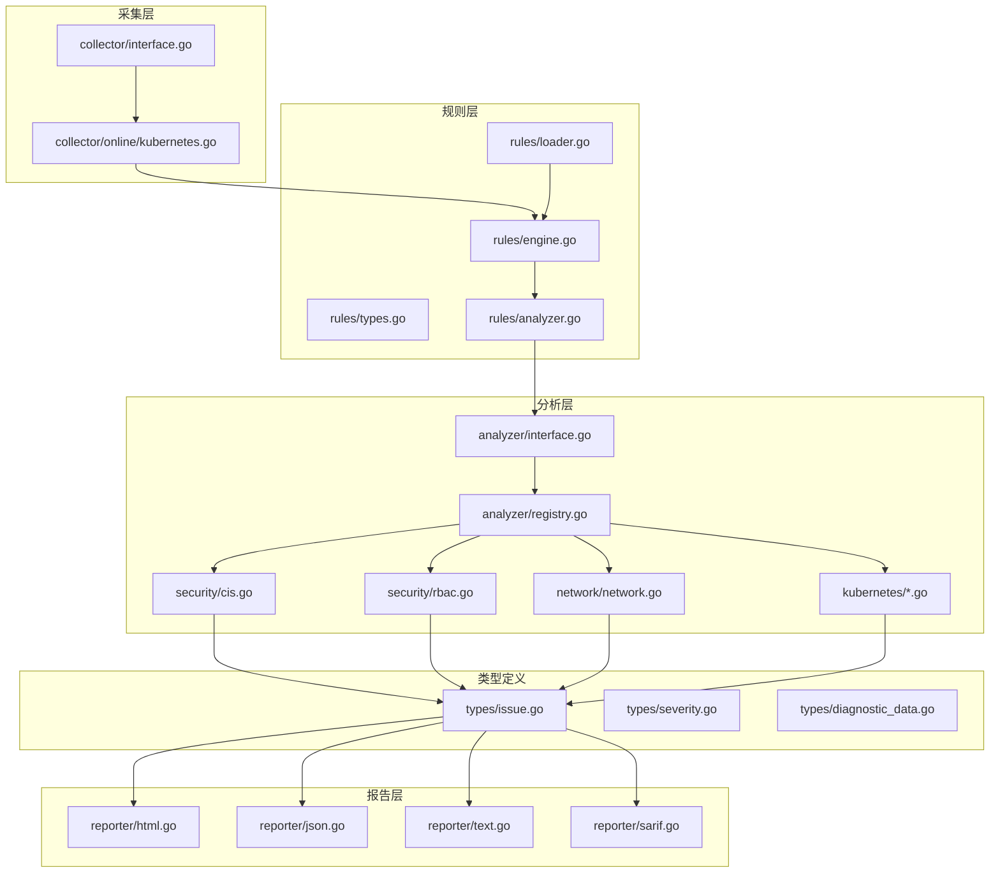
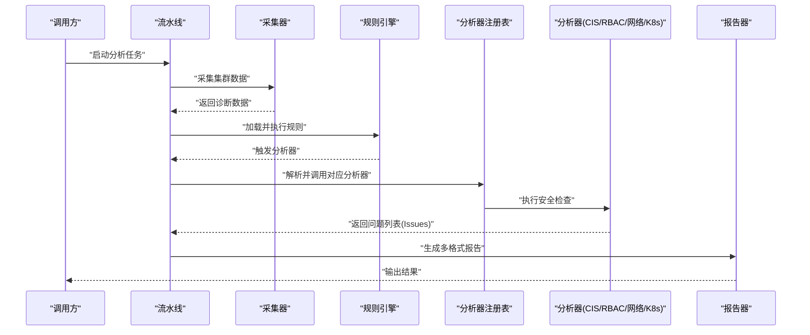
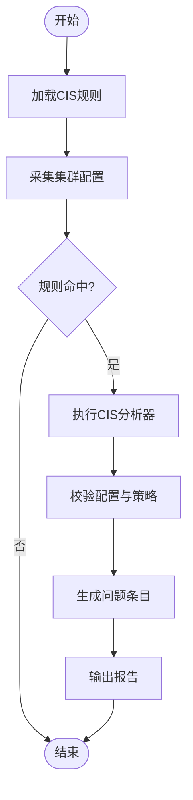
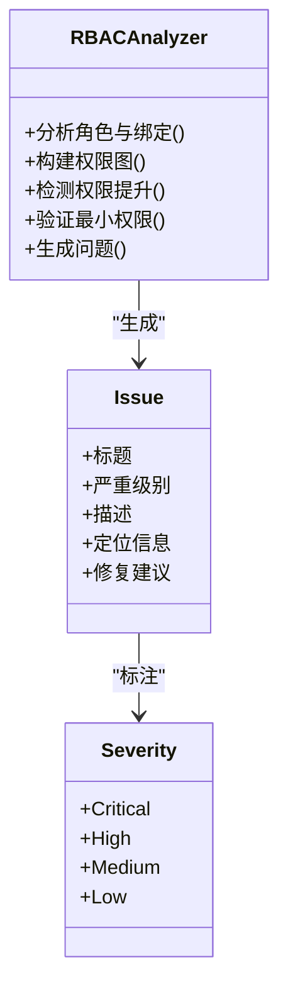
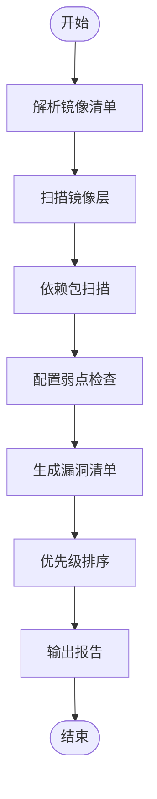
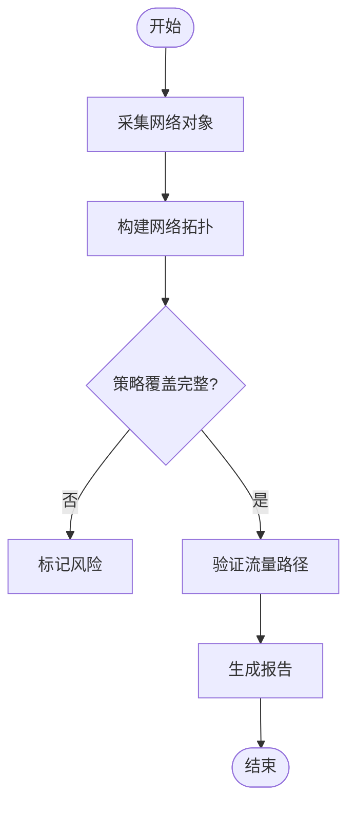
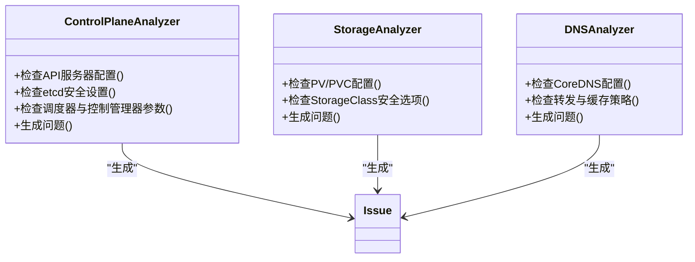
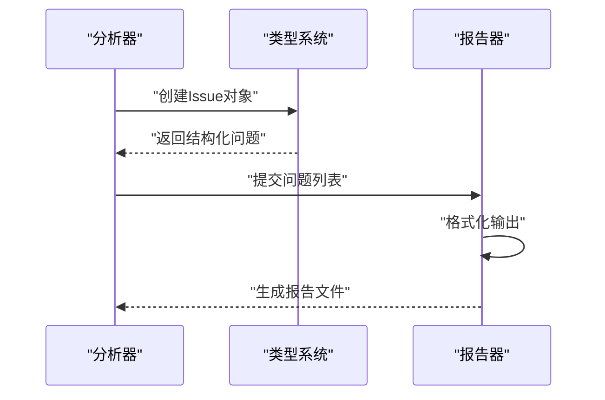
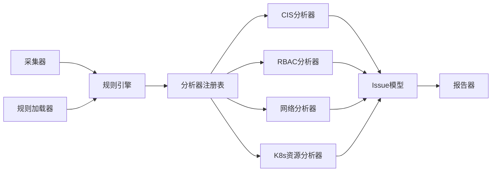

# 安全分析器

<cite>
**本文引用的文件**   
- [internal/diag/analyzer/security/cis.go](file://internal/diag/analyzer/security/cis.go)
- [internal/diag/analyzer/security/rbac.go](file://internal/diag/analyzer/security/rbac.go)
- [internal/diag/analyzer/scanner/image.go](file://internal/diag/analyzer/scanner/image.go)
- [internal/diag/analyzer/reporter/html.go](file://internal/diag/analyzer/reporter/html.go)
- [internal/diag/analyzer/reporter/json.go](file://internal/diag/analyzer/reporter/json.go)
- [internal/diag/analyzer/reporter/text.go](file://internal/diag/analyzer/reporter/text.go)
- [internal/diag/analyzer/reporter/sarif.go](file://internal/diag/analyzer/reporter/sarif.go)
- [internal/diag/analyzer/types/issue.go](file://internal/diag/analyzer/types/issue.go)
- [internal/diag/analyzer/types/severity.go](file://internal/diag/analyzer/types/severity.go)
- [internal/diag/analyzer/types/diagnostic_data.go](file://internal/diag/analyzer/types/diagnostic_data.go)
- [internal/diag/analyzer/interface.go](file://internal/diag/analyzer/interface.go)
- [internal/diag/analyzer/registry.go](file://internal/diag/analyzer/registry.go)
- [internal/diag/analyzer/pipeline.go](file://internal/diag/analyzer/pipeline.go)
- [internal/diag/analyzer/rules/engine.go](file://internal/diag/analyzer/rules/engine.go)
- [internal/diag/analyzer/rules/loader.go](file://internal/diag/analyzer/rules/loader.go)
- [internal/diag/analyzer/rules/types.go](file://internal/diag/analyzer/rules/types.go)
- [internal/diag/analyzer/rules/analyzer.go](file://internal/diag/analyzer/rules/analyzer.go)
- [internal/diag/analyzer/collector/interface.go](file://internal/diag/analyzer/collector/interface.go)
- [internal/diag/analyzer/collector/online/kubernetes.go](file://internal/diag/analyzer/collector/online/kubernetes.go)
- [internal/diag/analyzer/network/network.go](file://internal/diag/analyzer/network/network.go)
- [internal/diag/analyzer/kubernetes/controlplane.go](file://internal/diag/analyzer/kubernetes/controlplane.go)
- [internal/diag/analyzer/kubernetes/workload.go](file://internal/diag/analyzer/kubernetes/workload.go)
- [internal/diag/analyzer/kubernetes/storage.go](file://internal/diag/analyzer/kubernetes/storage.go)
- [internal/diag/analyzer/kubernetes/dns.go](file://internal/diag/analyzer/kubernetes/dns.go)
- [internal/diag/analyzer/kubernetes/kubernetes.go](file://internal/diag/analyzer/kubernetes/kubernetes.go)
</cite>

## 目录
1. [简介](#简介)
2. [项目结构](#项目结构)
3. [核心组件](#核心组件)
4. [架构总览](#架构总览)
5. [详细组件分析](#详细组件分析)
6. [依赖关系分析](#依赖关系分析)
7. [性能考量](#性能考量)
8. [故障排查指南](#故障排查指南)
9. [结论](#结论)
10. [附录](#附录)

## 简介
本文件为“安全分析器”的权威技术文档，聚焦于 CIS Kubernetes Benchmark 合规检查、RBAC 权限分析、漏洞扫描与安全报告生成。内容覆盖集群配置审计、网络安全策略验证、访问控制审查、角色权限映射、权限提升检测、最小权限原则验证、容器镜像安全扫描、依赖包漏洞检测与配置弱点识别，并提供合规性评估与修复建议、安全加固指南与最佳实践。

## 项目结构
安全分析器位于 internal/diag/analyzer 目录下，采用“采集-规则-分析-报告”的分层架构：
- 采集层：从在线集群或离线数据源收集诊断数据
- 规则层：加载并执行规则引擎，对数据进行匹配与判定
- 分析层：实现具体安全能力（CIS 合规、RBAC 分析、网络策略、工作负载与存储等）
- 报告层：将问题统一输出为 HTML/JSON/SARIF/文本等格式
- 类型定义：统一的 Issue、Severity、DiagnosticData 等数据结构

图表来源
- [internal/diag/analyzer/collector/interface.go](file://internal/diag/analyzer/collector/interface.go)
- [internal/diag/analyzer/collector/online/kubernetes.go](file://internal/diag/analyzer/collector/online/kubernetes.go)
- [internal/diag/analyzer/rules/engine.go](file://internal/diag/analyzer/rules/engine.go)
- [internal/diag/analyzer/rules/loader.go](file://internal/diag/analyzer/rules/loader.go)
- [internal/diag/analyzer/rules/types.go](file://internal/diag/analyzer/rules/types.go)
- [internal/diag/analyzer/rules/analyzer.go](file://internal/diag/analyzer/rules/analyzer.go)
- [internal/diag/analyzer/interface.go](file://internal/diag/analyzer/interface.go)
- [internal/diag/analyzer/registry.go](file://internal/diag/analyzer/registry.go)
- [internal/diag/analyzer/security/cis.go](file://internal/diag/analyzer/security/cis.go)
- [internal/diag/analyzer/security/rbac.go](file://internal/diag/analyzer/security/rbac.go)
- [internal/diag/analyzer/network/network.go](file://internal/diag/analyzer/network/network.go)
- [internal/diag/analyzer/kubernetes/controlplane.go](file://internal/diag/analyzer/kubernetes/controlplane.go)
- [internal/diag/analyzer/kubernetes/workload.go](file://internal/diag/analyzer/kubernetes/workload.go)
- [internal/diag/analyzer/kubernetes/storage.go](file://internal/diag/analyzer/kubernetes/storage.go)
- [internal/diag/analyzer/kubernetes/dns.go](file://internal/diag/analyzer/kubernetes/dns.go)
- [internal/diag/analyzer/reporter/html.go](file://internal/diag/analyzer/reporter/html.go)
- [internal/diag/analyzer/reporter/json.go](file://internal/diag/analyzer/reporter/json.go)
- [internal/diag/analyzer/reporter/text.go](file://internal/diag/analyzer/reporter/text.go)
- [internal/diag/analyzer/reporter/sarif.go](file://internal/diag/analyzer/reporter/sarif.go)
- [internal/diag/analyzer/types/issue.go](file://internal/diag/analyzer/types/issue.go)
- [internal/diag/analyzer/types/severity.go](file://internal/diag/analyzer/types/severity.go)
- [internal/diag/analyzer/types/diagnostic_data.go](file://internal/diag/analyzer/types/diagnostic_data.go)

章节来源
- [internal/diag/analyzer/pipeline.go](file://internal/diag/analyzer/pipeline.go)
- [internal/diag/analyzer/interface.go](file://internal/diag/analyzer/interface.go)
- [internal/diag/analyzer/registry.go](file://internal/diag/analyzer/registry.go)

## 核心组件
- 采集接口与实现：提供统一的采集抽象，支持在线 Kubernetes 环境的数据抓取
- 规则引擎：负责规则加载、匹配与执行，驱动各分析器产出问题
- 分析器注册表：集中管理各类分析器（CIS、RBAC、网络、Kubernetes 资源等）
- 类型系统：Issue、Severity、DiagnosticData 等统一模型贯穿全链路
- 报告器：HTML/JSON/SARIF/文本等多格式输出，便于集成与归档

章节来源
- [internal/diag/analyzer/collector/interface.go](file://internal/diag/analyzer/collector/interface.go)
- [internal/diag/analyzer/collector/online/kubernetes.go](file://internal/diag/analyzer/collector/online/kubernetes.go)
- [internal/diag/analyzer/rules/engine.go](file://internal/diag/analyzer/rules/engine.go)
- [internal/diag/analyzer/rules/loader.go](file://internal/diag/analyzer/rules/loader.go)
- [internal/diag/analyzer/interface.go](file://internal/diag/analyzer/interface.go)
- [internal/diag/analyzer/registry.go](file://internal/diag/analyzer/registry.go)
- [internal/diag/analyzer/types/issue.go](file://internal/diag/analyzer/types/issue.go)
- [internal/diag/analyzer/types/severity.go](file://internal/diag/analyzer/types/severity.go)
- [internal/diag/analyzer/types/diagnostic_data.go](file://internal/diag/analyzer/types/diagnostic_data.go)

## 架构总览
安全分析器以“流水线”方式组织：采集数据 -> 规则匹配 -> 分析器处理 -> 问题建模 -> 报告输出。通过注册表机制扩展新的分析器，保持高内聚低耦合。

图表来源
- [internal/diag/analyzer/pipeline.go](file://internal/diag/analyzer/pipeline.go)
- [internal/diag/analyzer/collector/interface.go](file://internal/diag/analyzer/collector/interface.go)
- [internal/diag/analyzer/collector/online/kubernetes.go](file://internal/diag/analyzer/collector/online/kubernetes.go)
- [internal/diag/analyzer/rules/engine.go](file://internal/diag/analyzer/rules/engine.go)
- [internal/diag/analyzer/registry.go](file://internal/diag/analyzer/registry.go)
- [internal/diag/analyzer/security/cis.go](file://internal/diag/analyzer/security/cis.go)
- [internal/diag/analyzer/security/rbac.go](file://internal/diag/analyzer/security/rbac.go)
- [internal/diag/analyzer/reporter/html.go](file://internal/diag/analyzer/reporter/html.go)
- [internal/diag/analyzer/reporter/json.go](file://internal/diag/analyzer/reporter/json.go)
- [internal/diag/analyzer/reporter/text.go](file://internal/diag/analyzer/reporter/text.go)
- [internal/diag/analyzer/reporter/sarif.go](file://internal/diag/analyzer/reporter/sarif.go)

## 详细组件分析

### CIS Kubernetes Benchmark 合规检查
- 功能范围：集群配置审计、控制面安全基线、网络策略验证、访问控制审查等
- 工作方式：基于规则引擎匹配集群对象与配置，结合分析器逻辑判断是否违反基准
- 输出：标准化 Issue 列表，包含严重级别、描述、定位信息与修复建议

图表来源
- [internal/diag/analyzer/security/cis.go](file://internal/diag/analyzer/security/cis.go)
- [internal/diag/analyzer/rules/engine.go](file://internal/diag/analyzer/rules/engine.go)
- [internal/diag/analyzer/rules/loader.go](file://internal/diag/analyzer/rules/loader.go)
- [internal/diag/analyzer/types/issue.go](file://internal/diag/analyzer/types/issue.go)

章节来源
- [internal/diag/analyzer/security/cis.go](file://internal/diag/analyzer/security/cis.go)
- [internal/diag/analyzer/rules/engine.go](file://internal/diag/analyzer/rules/engine.go)
- [internal/diag/analyzer/rules/loader.go](file://internal/diag/analyzer/rules/loader.go)
- [internal/diag/analyzer/types/issue.go](file://internal/diag/analyzer/types/issue.go)
- [internal/diag/analyzer/types/severity.go](file://internal/diag/analyzer/types/severity.go)

### RBAC 权限分析与最小权限验证
- 能力要点：
  - 角色权限映射：聚合 Role/ClusterRole、RoleBinding/ClusterRoleBinding，构建主体到资源的权限图
  - 权限提升检测：识别可被利用的越权路径（如绑定到 admin、可写 ServiceAccount 令牌等）
  - 最小权限原则验证：对比实际权限与业务需求，标记过度授权
- 输出：权限矩阵、风险路径、修复建议（收缩权限、分离职责、限制命名空间）

图表来源
- [internal/diag/analyzer/security/rbac.go](file://internal/diag/analyzer/security/rbac.go)
- [internal/diag/analyzer/types/issue.go](file://internal/diag/analyzer/types/issue.go)
- [internal/diag/analyzer/types/severity.go](file://internal/diag/analyzer/types/severity.go)

章节来源
- [internal/diag/analyzer/security/rbac.go](file://internal/diag/analyzer/security/rbac.go)
- [internal/diag/analyzer/types/issue.go](file://internal/diag/analyzer/types/issue.go)
- [internal/diag/analyzer/types/severity.go](file://internal/diag/analyzer/types/severity.go)

### 漏洞扫描（容器镜像与依赖）
- 容器镜像扫描：解析镜像清单与层，识别已知 CVE、不安全基础镜像、敏感配置暴露
- 依赖包漏洞检测：解析应用依赖（如 go.mod、package.json），匹配漏洞数据库
- 配置弱点识别：检测不安全的部署配置（特权容器、主机挂载、默认服务账号等）
- 输出：漏洞清单、影响范围、修复优先级与缓解措施

图表来源
- [internal/diag/analyzer/scanner/image.go](file://internal/diag/analyzer/scanner/image.go)
- [internal/diag/analyzer/types/issue.go](file://internal/diag/analyzer/types/issue.go)
- [internal/diag/analyzer/types/severity.go](file://internal/diag/analyzer/types/severity.go)

章节来源
- [internal/diag/analyzer/scanner/image.go](file://internal/diag/analyzer/scanner/image.go)
- [internal/diag/analyzer/types/issue.go](file://internal/diag/analyzer/types/issue.go)
- [internal/diag/analyzer/types/severity.go](file://internal/diag/analyzer/types/severity.go)

### 网络安全策略验证
- 能力要点：NetworkPolicy 存在性与有效性校验、入出站流量限制、默认拒绝策略、跨命名空间通信约束
- 工作方式：采集 NetworkPolicy、Service、Endpoint、Pod 等对象，进行连通性推断与策略覆盖度分析
- 输出：策略缺失项、潜在泄露路径、加固建议

图表来源
- [internal/diag/analyzer/network/network.go](file://internal/diag/analyzer/network/network.go)
- [internal/diag/analyzer/kubernetes/workload.go](file://internal/diag/analyzer/kubernetes/workload.go)
- [internal/diag/analyzer/types/issue.go](file://internal/diag/analyzer/types/issue.go)

章节来源
- [internal/diag/analyzer/network/network.go](file://internal/diag/analyzer/network/network.go)
- [internal/diag/analyzer/kubernetes/workload.go](file://internal/diag/analyzer/kubernetes/workload.go)
- [internal/diag/analyzer/types/issue.go](file://internal/diag/analyzer/types/issue.go)

### Kubernetes 资源分析（控制面、存储、DNS）
- 控制面：API Server、etcd、Scheduler、Controller Manager 的安全配置与运行参数
- 存储：持久卷、存储类、快照与备份策略的安全性
- DNS：CoreDNS 配置、转发策略、缓存与外部解析安全性
- 输出：资源配置问题、潜在风险点、优化建议

图表来源
- [internal/diag/analyzer/kubernetes/controlplane.go](file://internal/diag/analyzer/kubernetes/controlplane.go)
- [internal/diag/analyzer/kubernetes/storage.go](file://internal/diag/analyzer/kubernetes/storage.go)
- [internal/diag/analyzer/kubernetes/dns.go](file://internal/diag/analyzer/kubernetes/dns.go)
- [internal/diag/analyzer/types/issue.go](file://internal/diag/analyzer/types/issue.go)

章节来源
- [internal/diag/analyzer/kubernetes/controlplane.go](file://internal/diag/analyzer/kubernetes/controlplane.go)
- [internal/diag/analyzer/kubernetes/storage.go](file://internal/diag/analyzer/kubernetes/storage.go)
- [internal/diag/analyzer/kubernetes/dns.go](file://internal/diag/analyzer/kubernetes/dns.go)
- [internal/diag/analyzer/types/issue.go](file://internal/diag/analyzer/types/issue.go)

### 报告生成与合规性评估
- 报告格式：HTML（可视化）、JSON（机器可读）、SARIF（IDE/CI 集成）、文本（快速查看）
- 合规性评估：基于 CIS 基准评分、风险等级统计、趋势对比
- 修复建议：针对每个问题给出可操作的修复步骤与参考配置

图表来源
- [internal/diag/analyzer/reporter/html.go](file://internal/diag/analyzer/reporter/html.go)
- [internal/diag/analyzer/reporter/json.go](file://internal/diag/analyzer/reporter/json.go)
- [internal/diag/analyzer/reporter/text.go](file://internal/diag/analyzer/reporter/text.go)
- [internal/diag/analyzer/reporter/sarif.go](file://internal/diag/analyzer/reporter/sarif.go)
- [internal/diag/analyzer/types/issue.go](file://internal/diag/analyzer/types/issue.go)

章节来源
- [internal/diag/analyzer/reporter/html.go](file://internal/diag/analyzer/reporter/html.go)
- [internal/diag/analyzer/reporter/json.go](file://internal/diag/analyzer/reporter/json.go)
- [internal/diag/analyzer/reporter/text.go](file://internal/diag/analyzer/reporter/text.go)
- [internal/diag/analyzer/reporter/sarif.go](file://internal/diag/analyzer/reporter/sarif.go)
- [internal/diag/analyzer/types/issue.go](file://internal/diag/analyzer/types/issue.go)

## 依赖关系分析
- 采集层依赖 Kubernetes API 客户端，用于在线环境数据采集
- 规则层依赖规则加载器与引擎，驱动分析器执行
- 分析层通过注册表解耦，新增分析器无需修改核心流程
- 报告层依赖统一 Issue 模型，确保输出一致性

图表来源
- [internal/diag/analyzer/collector/interface.go](file://internal/diag/analyzer/collector/interface.go)
- [internal/diag/analyzer/collector/online/kubernetes.go](file://internal/diag/analyzer/collector/online/kubernetes.go)
- [internal/diag/analyzer/rules/engine.go](file://internal/diag/analyzer/rules/engine.go)
- [internal/diag/analyzer/rules/loader.go](file://internal/diag/analyzer/rules/loader.go)
- [internal/diag/analyzer/registry.go](file://internal/diag/analyzer/registry.go)
- [internal/diag/analyzer/security/cis.go](file://internal/diag/analyzer/security/cis.go)
- [internal/diag/analyzer/security/rbac.go](file://internal/diag/analyzer/security/rbac.go)
- [internal/diag/analyzer/network/network.go](file://internal/diag/analyzer/network/network.go)
- [internal/diag/analyzer/kubernetes/controlplane.go](file://internal/diag/analyzer/kubernetes/controlplane.go)
- [internal/diag/analyzer/types/issue.go](file://internal/diag/analyzer/types/issue.go)

章节来源
- [internal/diag/analyzer/registry.go](file://internal/diag/analyzer/registry.go)
- [internal/diag/analyzer/rules/engine.go](file://internal/diag/analyzer/rules/engine.go)
- [internal/diag/analyzer/types/issue.go](file://internal/diag/analyzer/types/issue.go)

## 性能考量
- 采集阶段：避免频繁 API 调用，使用缓存与增量更新
- 规则匹配：预编译规则、并行执行、短路评估
- 分析器设计：按需启用、批处理数据、减少内存占用
- 报告生成：流式输出、分页渲染、压缩传输

[本节为通用指导，不直接分析具体文件]

## 故障排查指南
- 常见问题：
  - 采集失败：检查 Kubernetes 连接、权限与网络可达性
  - 规则未命中：确认规则版本与集群版本兼容性
  - 报告为空：验证分析器注册与启用状态
  - 性能瓶颈：调整并发度与采样策略
- 调试建议：
  - 启用详细日志，定位错误堆栈
  - 使用 SARIF 输出在 IDE 中快速定位问题
  - 分模块测试，隔离问题范围

章节来源
- [internal/diag/analyzer/pipeline.go](file://internal/diag/analyzer/pipeline.go)
- [internal/diag/analyzer/rules/engine.go](file://internal/diag/analyzer/rules/engine.go)
- [internal/diag/analyzer/reporter/sarif.go](file://internal/diag/analyzer/reporter/sarif.go)

## 结论
安全分析器通过模块化架构实现了 CIS 合规检查、RBAC 权限分析、漏洞扫描与安全报告生成的完整闭环。其可扩展的注册表机制与统一的类型系统，使得新增安全能力变得简单且一致。建议在生产环境中持续集成该工具，形成自动化安全治理流程。

[本节为总结性内容，不直接分析具体文件]

## 附录
- 安全加固指南：
  - 启用最小权限原则，定期审计 RBAC 绑定
  - 强制使用 NetworkPolicy 限制 Pod 间通信
  - 使用受信任的基础镜像与依赖源
  - 关闭不必要的 API 端点与服务暴露
- 最佳实践：
  - 将安全扫描纳入 CI/CD 流水线
  - 建立问题跟踪与修复 SLA
  - 定期更新规则库与漏洞数据库
  - 使用 SARIF 与告警系统集成，实现自动通知

[本节为概念性内容，不直接分析具体文件]